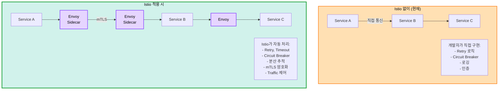
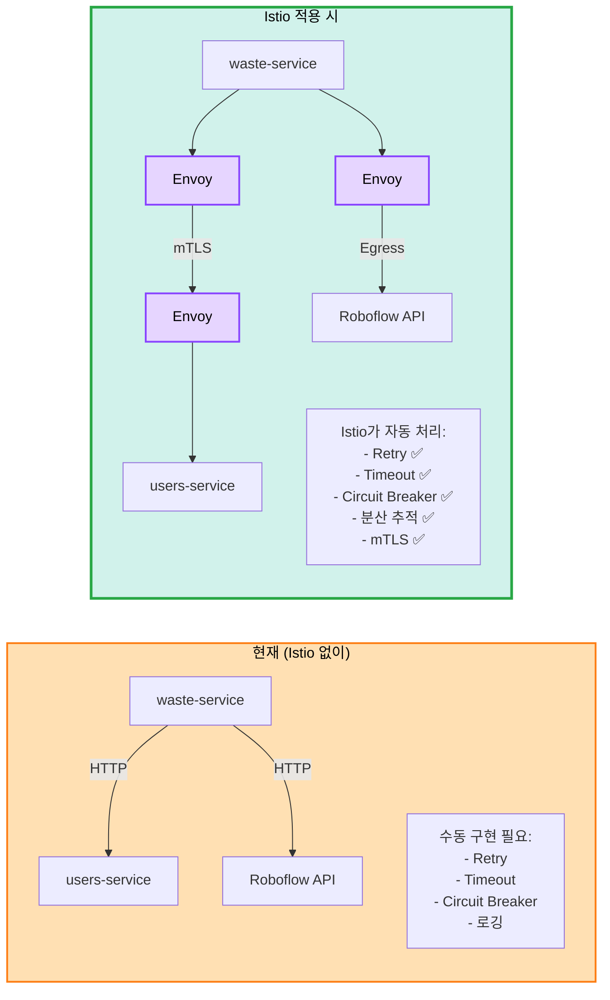
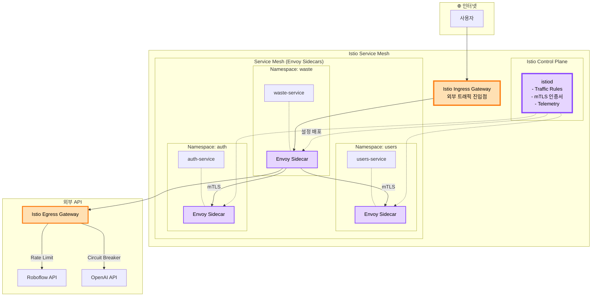

# 🕸️ Istio Service Mesh 도입 검토

> **질문**: Istio를 우리 K8s 아키텍처에 도입할 수 있나?  
> **날짜**: 2025-10-30  
> **상태**: 🔄 검토 중

## 📋 목차

1. [Istio란?](#istio란)
2. [Istio의 역할](#istio의-역할)
3. [현재 아키텍처 분석](#현재-아키텍처-분석)
4. [Istio 도입 방안](#istio-도입-방안)
5. [장단점 분석](#장단점-분석)
6. [최종 권장사항](#최종-권장사항)

---

## 🤔 Istio란?

### Service Mesh 개념



**Istio = Kubernetes 위의 네트워크 레이어**

---

## 🎯 Istio의 역할

### 4가지 핵심 기능

#### 1. Traffic Management (트래픽 제어)

```yaml
# A/B Testing 예시
apiVersion: networking.istio.io/v1beta1
kind: VirtualService
metadata:
  name: waste-service
spec:
  hosts:
  - waste-service
  http:
  - match:
    - headers:
        version:
          exact: v2
    route:
    - destination:
        host: waste-service
        subset: v2
  - route:
    - destination:
        host: waste-service
        subset: v1
      weight: 90
    - destination:
        host: waste-service
        subset: v2
      weight: 10  # 10%만 v2로
```

**가능한 것:**
- ✅ Canary 배포 (1%, 5%, 10%씩 점진적)
- ✅ A/B Testing (헤더, 쿠키 기반)
- ✅ Traffic Mirroring (프로덕션 트래픽 복제)
- ✅ Retry, Timeout (자동)
- ✅ Circuit Breaker (장애 격리)

#### 2. Security (보안)

```yaml
# mTLS 자동 활성화
apiVersion: security.istio.io/v1beta1
kind: PeerAuthentication
metadata:
  name: default
  namespace: waste
spec:
  mtls:
    mode: STRICT  # 모든 통신 암호화
```

**제공 기능:**
- ✅ mTLS (Mutual TLS) - 서비스 간 암호화 통신
- ✅ 인증/인가 (RBAC)
- ✅ 네트워크 정책 자동 적용
- ✅ Zero Trust 아키텍처

#### 3. Observability (관찰성)

```
자동 수집되는 메트릭:
├─ 요청 수 (req/s)
├─ 응답 시간 (latency)
├─ 에러율 (4xx, 5xx)
├─ 분산 추적 (Distributed Tracing)
└─ Service Graph (서비스 간 의존성)

통합 도구:
├─ Prometheus (메트릭)
├─ Grafana (대시보드)
├─ Jaeger (분산 추적)
└─ Kiali (Service Mesh 대시보드)
```

#### 4. Resilience (회복탄력성)

```yaml
# Circuit Breaker 예시
apiVersion: networking.istio.io/v1beta1
kind: DestinationRule
metadata:
  name: ai-api-breaker
spec:
  host: waste-service
  trafficPolicy:
    outlierDetection:
      consecutiveErrors: 5
      interval: 30s
      baseEjectionTime: 30s
      maxEjectionPercent: 50
```

**제공 기능:**
- ✅ Circuit Breaker (연속 실패 시 차단)
- ✅ Retry (자동 재시도)
- ✅ Timeout (타임아웃 설정)
- ✅ Rate Limiting (요청 제한)

---

## 📊 현재 아키텍처 분석

### 우리 아키텍처

```
Kubernetes Cluster:
├─ 5개 마이크로서비스
│   ├─ auth-service
│   ├─ users-service
│   ├─ waste-service
│   ├─ recycling-service
│   └─ locations-service
│
├─ 서비스 간 통신:
│   ├─ waste → users (사용자 정보 조회)
│   ├─ recycling → waste (분석 결과 참조)
│   └─ locations → users (사용자 위치)
│
└─ 외부 API 호출:
    ├─ Roboflow (AI Vision)
    ├─ OpenAI (LLM)
    └─ Kakao Map (위치)
```

### Istio 도입 시 개선점



---

## 🚀 Istio 도입 방안

### Phase 1: Istio 설치 (30분)

```bash
# 1. Istioctl 설치
curl -L https://istio.io/downloadIstio | sh -
cd istio-*
export PATH=$PWD/bin:$PATH

# 2. Istio 설치 (프로파일: demo 또는 default)
istioctl install --set profile=demo -y

# Profile 옵션:
# - minimal: 최소 구성
# - default: 프로덕션 (권장)
# - demo: 개발/테스트 (Kiali, Jaeger 포함)

# 3. 설치 확인
kubectl get pods -n istio-system

# 예상 Pod:
# istiod (Control Plane)
# istio-ingressgateway (Ingress)
# istio-egressgateway (Egress)
```

### Phase 2: Namespace Labeling

```bash
# Istio Sidecar 자동 주입 활성화
kubectl label namespace auth istio-injection=enabled
kubectl label namespace users istio-injection=enabled
kubectl label namespace waste istio-injection=enabled
kubectl label namespace recycling istio-injection=enabled
kubectl label namespace locations istio-injection=enabled

# 확인
kubectl get namespace -L istio-injection

# 기존 Pod 재시작 (Sidecar 주입)
kubectl rollout restart deployment -n auth
kubectl rollout restart deployment -n waste
# ...

# Sidecar 확인
kubectl get pods -n waste
# waste-service-xxx   2/2   Running  # 2/2 = App + Envoy Sidecar
```

### Phase 3: Gateway 설정

```yaml
# istio/gateway.yaml
apiVersion: networking.istio.io/v1beta1
kind: Gateway
metadata:
  name: sesacthon-gateway
  namespace: istio-system
spec:
  selector:
    istio: ingressgateway
  servers:
  - port:
      number: 80
      name: http
      protocol: HTTP
    hosts:
    - "api.yourdomain.com"
  - port:
      number: 443
      name: https
      protocol: HTTPS
    tls:
      mode: SIMPLE
      credentialName: api-tls
    hosts:
    - "api.yourdomain.com"

---
# istio/virtual-service.yaml
apiVersion: networking.istio.io/v1beta1
kind: VirtualService
metadata:
  name: waste-service
spec:
  hosts:
  - "api.yourdomain.com"
  gateways:
  - istio-system/sesacthon-gateway
  http:
  - match:
    - uri:
        prefix: "/api/v1/waste"
    route:
    - destination:
        host: waste-service.waste.svc.cluster.local
        port:
          number: 80
    retries:
      attempts: 3
      perTryTimeout: 2s
    timeout: 10s
```

### Phase 4: Service Mesh 정책

```yaml
# Circuit Breaker (AI API 호출용)
apiVersion: networking.istio.io/v1beta1
kind: DestinationRule
metadata:
  name: external-api-breaker
  namespace: waste
spec:
  host: waste-service
  trafficPolicy:
    connectionPool:
      tcp:
        maxConnections: 100
      http:
        http1MaxPendingRequests: 10
        maxRequestsPerConnection: 2
    outlierDetection:
      consecutiveErrors: 5
      interval: 30s
      baseEjectionTime: 30s
      maxEjectionPercent: 50

---
# Rate Limiting (LLM API 비용 제어)
apiVersion: networking.istio.io/v1beta1
kind: EnvoyFilter
metadata:
  name: llm-rate-limit
  namespace: recycling
spec:
  workloadSelector:
    labels:
      app: recycling-service
  configPatches:
  - applyTo: HTTP_FILTER
    match:
      context: SIDECAR_OUTBOUND
    patch:
      operation: INSERT_BEFORE
      value:
        name: envoy.filters.http.local_ratelimit
        typed_config:
          "@type": type.googleapis.com/envoy.extensions.filters.http.local_ratelimit.v3.LocalRateLimit
          stat_prefix: http_local_rate_limiter
          token_bucket:
            max_tokens: 20
            tokens_per_fill: 20
            fill_interval: 60s  # 분당 20회
```

---

## 💡 우리 아키텍처에 적용

### 적용 아키텍처



### 구체적 사용 사례

#### 1. AI API Circuit Breaker

```yaml
# waste-service → Roboflow API 호출 시
# 연속 5회 실패 → 30초간 차단 → 점진적 복구

apiVersion: networking.istio.io/v1beta1
kind: DestinationRule
metadata:
  name: roboflow-breaker
  namespace: waste
spec:
  host: "*.roboflow.com"
  trafficPolicy:
    outlierDetection:
      consecutiveErrors: 5
      interval: 30s
      baseEjectionTime: 30s
```

**효과:**
- ✅ AI API 장애 시 폭포 효과 방지
- ✅ 30초 후 자동 복구 시도
- ✅ 다른 서비스는 정상 작동

#### 2. LLM API Rate Limiting

```yaml
# OpenAI API 호출 제한 (비용 폭증 방지)
apiVersion: networking.istio.io/v1beta1
kind: EnvoyFilter
metadata:
  name: openai-rate-limit
  namespace: recycling
spec:
  # 분당 20회 제한
  # 초과 시 429 Too Many Requests
```

**효과:**
- ✅ LLM API 비용 폭증 방지
- ✅ 애플리케이션 코드 수정 불필요
- ✅ Istio 설정만으로 제어

#### 3. Canary 배포

```yaml
# waste-service v2를 10%만 배포
apiVersion: networking.istio.io/v1beta1
kind: VirtualService
metadata:
  name: waste-canary
spec:
  http:
  - route:
    - destination:
        host: waste-service
        subset: v1
      weight: 90
    - destination:
        host: waste-service
        subset: v2
      weight: 10

# 모니터링 후 v2 에러율 낮으면
# weight: 50/50 → 100% v2로 점진적 전환
```

**효과:**
- ✅ 안전한 배포 (단계적)
- ✅ 문제 발생 시 즉시 롤백
- ✅ ArgoCD와 통합 가능

#### 4. 분산 추적 (Distributed Tracing)

```
사용자 요청 → waste-service → users-service → DB

Jaeger로 전체 흐름 추적:
├─ 각 서비스 응답 시간
├─ 병목 지점 파악
├─ 에러 발생 위치
└─ 전체 latency 분석

→ 코드 수정 없이 자동!
```

---

## 💰 비용 및 리소스

### 추가 리소스

```
Istio Control Plane (istiod):
├─ CPU: 500m
├─ Memory: 2GB
└─ 배치: Master 노드

Envoy Sidecar (각 Pod마다):
├─ CPU: 10-50m
├─ Memory: 50-100MB
└─ 개수: 서비스 Pod 수 × 1

예상:
├─ API Pods: 8개 × 100MB = 800MB
├─ Worker Pods: 12개 × 50MB = 600MB
├─ istiod: 2GB
└─ 총 추가 메모리: 3.4GB

현재 클러스터:
├─ 총 메모리: 10GB
├─ 여유: ~3GB
└─ 상태: ⚠️ 빡빡함
```

### 추가 비용

```
노드 추가 필요:
현재: Master (4GB) + Worker1 (4GB) + Worker2 (4GB) + Worker3 (2GB) = 14GB
Istio 추가: +3.4GB
총 필요: 17.4GB

옵션 1: Worker 스펙 업
├─ Worker 3: t3.small → t3.medium
├─ 추가 비용: $15/월
└─ 총: $120/월

옵션 2: Worker 추가
├─ Worker 4 (t3.small) 추가
├─ 추가 비용: $15/월
└─ 총: $120/월

결론:
Istio 도입 시 +$15/월
```

---

## ⚖️ 장단점 분석

### ✅ 장점

```
1. Traffic 제어
   ✅ Canary 배포 (안전한 릴리즈)
   ✅ A/B Testing (기능 실험)
   ✅ Circuit Breaker (장애 격리)
   ✅ Retry, Timeout (자동)

2. 보안
   ✅ mTLS (서비스 간 암호화)
   ✅ Zero Trust
   ✅ 네트워크 정책

3. 관찰성
   ✅ 분산 추적 (Jaeger)
   ✅ Service Graph (Kiali)
   ✅ 메트릭 자동 수집

4. 코드 간소화
   ✅ Retry 로직 제거 (Istio가 처리)
   ✅ Circuit Breaker 코드 불필요
   ✅ 로깅 자동화

5. 프로덕션급
   ✅ Netflix, Airbnb 사용
   ✅ CNCF 졸업 프로젝트
```

### ❌ 단점

```
1. 복잡도 증가
   ❌ 학습 곡선 가파름
   ❌ YAML 파일 추가 (VirtualService, DestinationRule)
   ❌ 디버깅 어려움 (Sidecar 레이어)

2. 리소스 오버헤드
   ❌ 메모리 +3.4GB
   ❌ CPU +1 core
   ❌ 비용 +$15/월

3. 구축 시간
   ❌ Istio 설치: 30분
   ❌ 설정 작성: 2-3시간
   ❌ 학습 시간: 1주일

4. 해커톤 부적합
   ❌ 2일 동안 Istio 배울 시간 없음
   ❌ 기능 구현이 우선
   ❌ 오버엔지니어링

5. 성능 오버헤드
   ❌ Sidecar 경유 → latency +1-2ms
   ❌ 작은 규모에서는 불필요
```

---

## 🎯 우리 프로젝트에 적합한가?

### 현재 상황

```
규모:
├─ 서비스: 5개
├─ 노드: 3개
├─ 예상 사용자: 100-500명
└─ 서비스 간 호출: 적음 (waste → users 정도)

복잡도:
├─ 외부 API 의존: 높음 (AI, LLM)
└─ 서비스 간 의존: 낮음

기간:
└─ 해커톤: 2일
```

### Istio 필요성 분석

| 기능 | 필요성 | Istio 없이 대안 | 우선순위 |
|------|--------|----------------|----------|
| **Circuit Breaker** | 🟡 중간 | Celery Retry 정책 | P1 |
| **mTLS** | 🟢 낮음 | 내부 통신, Private VPC | P2 |
| **Canary 배포** | 🟡 중간 | ArgoCD Rollout | P2 |
| **분산 추적** | 🟡 중간 | 로그 집계 | P2 |
| **Traffic Split** | 🟢 낮음 | 필요 시 구현 | P3 |
| **Rate Limiting** | 🔴 높음 | 애플리케이션 코드 | P0 |

**결론:**
- 🔴 필수 기능: 없음
- 🟡 유용한 기능: Circuit Breaker, Canary
- 🟢 선택적: 대부분

---

## 📋 최종 권장사항

### ❌ 해커톤 단계: Istio 도입 안 함

```
이유:

1. 시간 부족
   ❌ Istio 학습: 1주일
   ❌ 설정 작성: 2-3시간
   ❌ 기능 개발이 우선

2. 오버킬
   ❌ 5개 서비스에는 과도
   ❌ 서비스 간 호출 적음
   ❌ 복잡도 증가

3. 리소스 부족
   ❌ 메모리 +3.4GB
   ❌ 현재 클러스터 빡빡

4. 대안 존재
   ✅ AWS ALB Controller로 충분
   ✅ Celery Retry 정책
   ✅ 애플리케이션 레벨 Rate Limiting

결론:
→ Istio 없이 진행
```

### ⭐ MVP 출시 후: Istio 도입 검토

```
도입 시점:

1. 사용자 10,000명 이상
2. 서비스 10개 이상으로 확장
3. 서비스 간 의존성 복잡
4. Canary 배포 필요
5. 분산 추적 필요

준비 사항:
├─ Worker 노드 추가 (리소스)
├─ Istio 학습 (1-2주)
└─ 점진적 도입 (Namespace 단위)

예상 비용:
└─ +$15-30/월 (Worker 추가)
```

### 🔧 대안: 필요한 기능만 구현

#### Circuit Breaker (애플리케이션 레벨)

```python
# app/external/ai_client.py
from circuitbreaker import circuit

@circuit(failure_threshold=5, recovery_timeout=30)
async def call_ai_api(image_url: str):
    """Circuit Breaker 적용"""
    try:
        response = await httpx.post(AI_API_URL, json={"image": image_url})
        return response.json()
    except Exception as e:
        logger.error(f"AI API 실패: {e}")
        raise
```

#### Rate Limiting (애플리케이션 레벨)

```python
# app/middleware/rate_limit.py
from slowapi import Limiter
from slowapi.util import get_remote_address

limiter = Limiter(key_func=get_remote_address)

@app.post("/api/v1/waste/analyze")
@limiter.limit("10/minute")  # 분당 10회 제한
async def analyze_waste():
    ...
```

---

## 🎓 Istio 학습 자료 (나중에)

MVP 후 Istio 도입 시:

- [Istio 공식 문서](https://istio.io/latest/docs/)
- [Istio By Example](https://istiobyexample.dev/)
- [Kiali (Service Mesh 대시보드)](https://kiali.io/)
- [Jaeger (분산 추적)](https://www.jaegertracing.io/)

---

## ✅ 최종 결론

### ❌ 현재는 도입하지 않음

```
이유:
1. 해커톤 기간 부족 (2일)
2. 서비스 규모 작음 (5개)
3. 리소스 부족 (메모리 +3.4GB)
4. 복잡도 증가
5. 대안 존재 (AWS ALB, 애플리케이션 로직)

결론:
→ Istio 없이 Kubernetes + ArgoCD + Helm만으로 충분
→ MVP 출시 후 필요시 검토
```

### ⭐ MVP 후 도입 검토 조건

```
다음 조건 충족 시 도입:

✅ 사용자 10,000+ (트래픽 증가)
✅ 서비스 10개+ (복잡도 증가)
✅ 서비스 간 의존성 복잡
✅ Canary 배포 필수
✅ 1-2주 학습 시간 확보
✅ Worker 노드 추가 (+$15/월)

→ 그때 점진적으로 도입 (Namespace 단위)
```

---

## 📚 관련 문서

- [최종 K8s 아키텍처](final-k8s-architecture.md)
- [Task Queue 설계](task-queue-design.md)
- [GitOps 배포](../deployment/gitops-argocd-helm.md)

---

**작성일**: 2025-10-30  
**결론**: ❌ 현재 도입 안 함, MVP 후 검토  
**상태**: 참고용 문서

