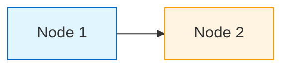
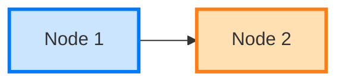
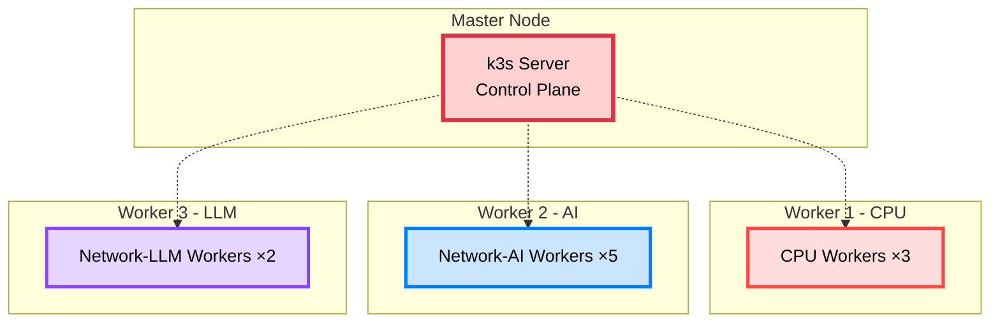

# 🎨 Mermaid 색상 가이드

> **문서 전반의 Mermaid 다이어그램 색상 표준**  
> **날짜**: 2025-10-30

## 🎯 색상 팔레트

### 가시성 높은 색상 (개선)

```
기본 원칙:
✅ 배경과 명도 차이 크게 (최소 40% 이상)
✅ Stroke 두껍게 (2-4px)
✅ 진하고 선명한 색상 우선
✅ 중요도에 따라 색상 강도 조절
```

### 표준 색상 팔레트

| 용도 | 색상 코드 | 예시 | 사용처 |
|------|----------|------|--------|
| **Critical (긴급/중요)** | `#ff4444, #dc3545` | 🔴 | AI, 핵심 작업, Master 노드 |
| **Warning (주의/높음)** | `#ff8800, #fd7e14` | 🟠 | Worker, 빌드, API |
| **Success (성공/완료)** | `#00cc66, #28a745` | 🟢 | 완료, 정상, I/O Workers |
| **Info (정보/일반)** | `#0088ff, #007bff` | 🔵 | 클라이언트, Auth, 정보 |
| **Primary (주요)** | `#8844ff, #6f42c1` | 🟣 | GitOps, ArgoCD, 특수 |
| **Database** | `#00bbaa, #20c997` | 🔷 | DB, Storage, 데이터 |
| **Network** | `#5599ff, #4299e1` | 💠 | CDN, LB, Network |

### Stroke 규칙

```
stroke-width:
├─ 1px: 일반 (기본)
├─ 2px: 중요
├─ 3px: 매우 중요
└─ 4px: 최우선/핵심
```

---

## 📐 적용 예시

### 변경 전 (가시성 낮음) ❌



**문제:**
- 너무 연한 색 (#e1f5ff)
- 배경과 구분 안 됨
- 텍스트 읽기 어려움

### 변경 후 (가시성 높음) ✅



**개선:**
- 적당히 진한 색 (#cce5ff)
- 진한 stroke (#007bff)
- 두꺼운 테두리 (3px)

---

## 🎨 컴포넌트별 색상 매핑

### 인프라 컴포넌트

```
Frontend/Client:
  fill:#cce5ff
  stroke:#007bff
  stroke-width:3px

API Gateway/LB:
  fill:#ffe0b3
  stroke:#fd7e14
  stroke-width:3px

Backend API:
  fill:#d1f2eb
  stroke:#00cc66
  stroke-width:2px

Database:
  fill:#ccf5f0
  stroke:#20c997
  stroke-width:2px

Redis/Cache:
  fill:#ffcccc
  stroke:#dc3545
  stroke-width:2px

Critical Path:
  fill:#ffd1d1
  stroke:#ff4444
  stroke-width:4px
```

### Worker 타입

```
CPU Workers:
  fill:#ffdddd
  stroke:#dc3545
  stroke-width:3px

Network-AI Workers:
  fill:#cce5ff
  stroke:#007bff
  stroke-width:3px

Network-LLM Workers:
  fill:#e6d5ff
  stroke:#8844ff
  stroke-width:2px

I/O Workers:
  fill:#d1f2eb
  stroke:#28a745
  stroke-width:2px
```

---

## 🔧 변경 예시

### K8s 클러스터 다이어그램



---

## 📋 체크리스트

변경할 문서:
- [ ] architecture/celery-rabbitmq-queues.md
- [ ] architecture/k8s-cluster-setup.md
- [ ] architecture/image-processing-architecture.md
- [ ] architecture/polling-vs-websocket.md
- [x] architecture/SERVICE_ARCHITECTURE.md
- [ ] architecture/decision-summary.md
- [ ] deployment/full-guide.md
- [ ] deployment/docker.md
- [ ] getting-started/project-structure.md
- [ ] development/git-workflow.md

---

**작성일**: 2025-10-30  
**적용**: 모든 Mermaid 다이어그램

