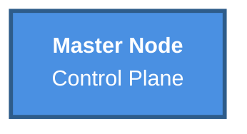
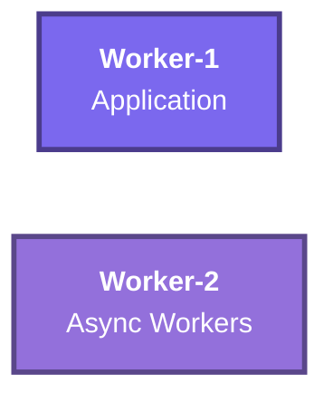
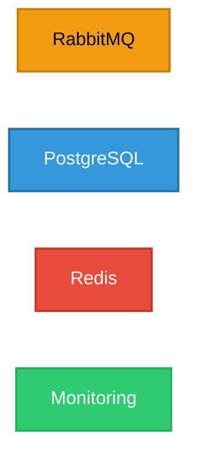
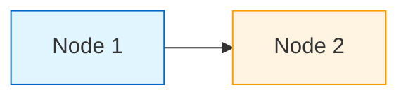
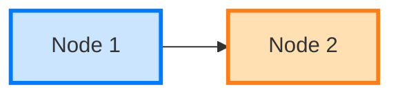
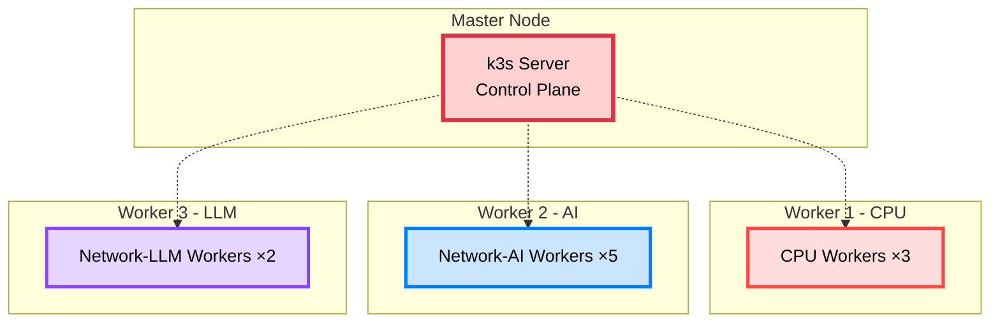

# 🎨 Mermaid 다이어그램 색상 가이드

> **문서 전반의 Mermaid 다이어그램 표준 색상 팔레트**  
> **최종 업데이트**: 2025-11-05  
> **목적**: 높은 가독성과 일관성 있는 시각적 표현

---

## 📋 목차

1. [색상 원칙](#색상-원칙)
2. [표준 색상 팔레트](#표준-색상-팔레트)
3. [컴포넌트별 색상 매핑](#컴포넌트별-색상-매핑)
4. [적용 예시](#적용-예시)

---

## 🎯 색상 원칙

### 1. 가독성 우선

```yaml
원칙:
  ✅ 배경과 명도 차이 최소 40% 이상
  ✅ 텍스트 색상 명시 (밝은 배경: color:#000, 어두운 배경: color:#fff)
  ✅ Stroke 두께 2-3px (강조 시 4px)
✅ 진하고 선명한 색상 우선

피해야 할 것:
  ❌ 너무 연한 색 (파스텔 톤)
  ❌ 비슷한 색상 연속 사용
  ❌ 텍스트 색상 미지정
```

### 2. Material Design 색상 사용

```yaml
기본 규칙:
  - Primary: 파란색 계열 (#4A90E2, #3498DB)
  - Secondary: 보라색 계열 (#7B68EE, #9370DB)
  - Success: 초록색 계열 (#2ECC71, #27AE60)
  - Warning: 주황색 계열 (#F39C12, #E67E22)
  - Danger: 빨간색 계열 (#E74C3C, #C0392B)
  - Info: 하늘색 계열 (#3498DB, #2874A6)
```

---

## 🎨 표준 색상 팔레트

### Control Plane (Control/Master)

```yaml
fill: #4A90E2  # 진한 파랑
stroke: #2E5C8A  # 더 진한 파랑
stroke-width: 3px
color: #fff  # 흰색 텍스트
```



### Application Workers

```yaml
Worker-1:
  fill: #7B68EE  # 중간 보라
  stroke: #4B3C8C  # 진한 보라
  stroke-width: 3px
  color: #fff

Worker-2:
  fill: #9370DB  # 연한 보라
  stroke: #5A478A  # 중간 보라
  stroke-width: 3px
  color: #fff
```



### Infrastructure Components

```yaml
RabbitMQ:
  fill: #F39C12  # 주황색
  stroke: #C87F0A  # 진한 주황
  stroke-width: 2px
  color: #000  # 검은색 텍스트

PostgreSQL:
  fill: #3498DB  # 파란색
  stroke: #2874A6  # 진한 파랑
  stroke-width: 2px
  color: #fff

Redis:
  fill: #E74C3C  # 빨간색
  stroke: #C0392B  # 진한 빨강
  stroke-width: 2px
  color: #fff

Monitoring:
  fill: #2ECC71  # 초록색
  stroke: #27AE60  # 진한 초록
  stroke-width: 2px
  color: #fff
```



### Network Components

```yaml
ALB/Load Balancer:
  fill: #FF6B6B  # 연한 빨강
  stroke: #C92A2A  # 진한 빨강
  stroke-width: 3px
  color: #fff

Route53/DNS:
  fill: #FFE066  # 노란색
  stroke: #F59F00  # 진한 노랑
  stroke-width: 2px
  color: #000

S3/Storage:
  fill: #51CF66  # 연한 초록
  stroke: #2F9E44  # 진한 초록
  stroke-width: 2px
  color: #fff
```

### Background/Container

```yaml
VPC/Container:
  fill: #F8F9FA  # 매우 연한 회색
  stroke: #6C757D  # 회색
  stroke-width: 2px
  color: #000

Subgraph (AZ-a):
  fill: #FFF9E6  # 연한 노랑 배경
  stroke: #FFE4B3  # 노랑 테두리
  stroke-width: 2px
  color: #000

Subgraph (AZ-b):
  fill: #E6F7FF  # 연한 파랑 배경
  stroke: #B3E0FF  # 파랑 테두리
  stroke-width: 2px
  color: #000

Subgraph (AZ-c):
  fill: #FFF0F5  # 연한 분홍 배경
  stroke: #FFD6E8  # 분홍 테두리
  stroke-width: 2px
  color: #000
```

---

## 🏗️ 컴포넌트별 색상 매핑

### 1. Kubernetes Nodes

| 노드 타입 | Fill | Stroke | Width | Text |
|----------|------|--------|-------|------|
| Master (Control Plane) | #4A90E2 | #2E5C8A | 3px | #fff |
| Worker-1 (Application) | #7B68EE | #4B3C8C | 3px | #fff |
| Worker-2 (Async) | #9370DB | #5A478A | 3px | #fff |

### 2. Data Infrastructure

| 컴포넌트 | Fill | Stroke | Width | Text |
|----------|------|--------|-------|------|
| RabbitMQ | #F39C12 | #C87F0A | 2px | #000 |
| PostgreSQL | #3498DB | #2874A6 | 2px | #fff |
| Redis | #E74C3C | #C0392B | 2px | #fff |
| MongoDB | #47A248 | #13AA52 | 2px | #fff |

### 3. Monitoring & Logging

| 컴포넌트 | Fill | Stroke | Width | Text |
|----------|------|--------|-------|------|
| Prometheus | #E74C3C | #C0392B | 2px | #fff |
| Grafana | #F39C12 | #C87F0A | 2px | #000 |
| Alertmanager | #FF6B6B | #C92A2A | 2px | #fff |
| Monitoring Node | #2ECC71 | #27AE60 | 2px | #fff |

### 4. Network & Ingress

| 컴포넌트 | Fill | Stroke | Width | Text |
|----------|------|--------|-------|------|
| ALB | #FF6B6B | #C92A2A | 3px | #fff |
| Route53 | #FFE066 | #F59F00 | 2px | #000 |
| Ingress Controller | #9370DB | #5A478A | 2px | #fff |
| Service Mesh | #7B68EE | #4B3C8C | 2px | #fff |

### 5. CI/CD & GitOps

| 컴포넌트 | Fill | Stroke | Width | Text |
|----------|------|--------|-------|------|
| GitHub Actions | #FFE066 | #F59F00 | 3px | #000 |
| ArgoCD | #4A90E2 | #2E5C8A | 3px | #fff |
| Container Registry | #9370DB | #5A478A | 2px | #fff |
| Helm | #51CF66 | #2F9E44 | 2px | #fff |

---

## 📐 적용 예시

### 변경 전 (가시성 낮음) ❌



**문제:**
- 너무 연한 색 (#e1f5ff)
- 배경과 구분 안 됨
- 텍스트 읽기 어려움

### 변경 후 (가시성 높음) ✅



**개선:**
- 적당히 진한 색 (#cce5ff)
- 진한 stroke (#007bff)
- 두꺼운 테두리 (3px)

---

## 🎨 컴포넌트별 색상 매핑

### 인프라 컴포넌트

```
Frontend/Client:
  fill:#cce5ff
  stroke:#007bff
  stroke-width:3px

API Gateway/LB:
  fill:#ffe0b3
  stroke:#fd7e14
  stroke-width:3px

Backend API:
  fill:#d1f2eb
  stroke:#00cc66
  stroke-width:2px

Database:
  fill:#ccf5f0
  stroke:#20c997
  stroke-width:2px

Redis/Cache:
  fill:#ffcccc
  stroke:#dc3545
  stroke-width:2px

Critical Path:
  fill:#ffd1d1
  stroke:#ff4444
  stroke-width:4px
```

### Worker 타입

```
CPU Workers:
  fill:#ffdddd
  stroke:#dc3545
  stroke-width:3px

Network-AI Workers:
  fill:#cce5ff
  stroke:#007bff
  stroke-width:3px

Network-LLM Workers:
  fill:#e6d5ff
  stroke:#8844ff
  stroke-width:2px

I/O Workers:
  fill:#d1f2eb
  stroke:#28a745
  stroke-width:2px
```

---

## 🔧 변경 예시

### K8s 클러스터 다이어그램



---

## 📋 체크리스트

변경할 문서:
- [ ] architecture/celery-rabbitmq-queues.md
- [ ] architecture/k8s-cluster-setup.md
- [ ] architecture/image-processing-architecture.md
- [ ] architecture/polling-vs-websocket.md
- [x] architecture/SERVICE_ARCHITECTURE.md
- [ ] architecture/decision-summary.md
- [ ] deployment/full-guide.md
- [ ] deployment/docker.md
- [ ] getting-started/project-structure.md
- [ ] development/git-workflow.md

---

**작성일**: 2025-10-30  
**적용**: 모든 Mermaid 다이어그램

