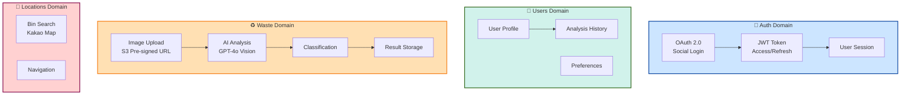
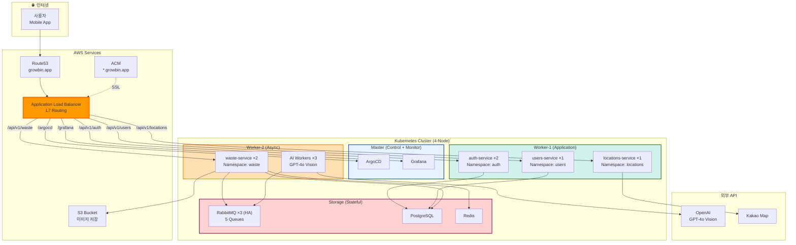
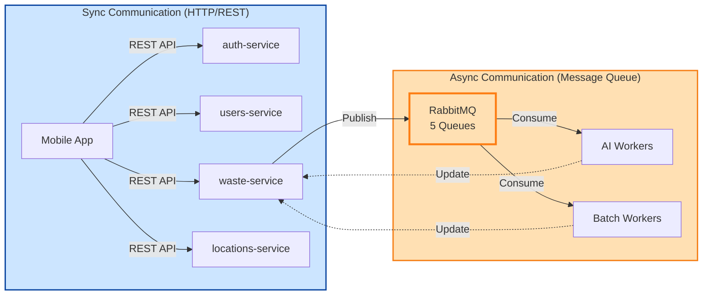

# 🏗️ 마이크로서비스 아키텍처 설계

> **최종 결정**: 4-Node Kubernetes 클러스터  
> **구성**: 6개 서비스, AWS ALB Path-based Routing, Helm Charts  
> **날짜**: 2025-10-31  
> **상태**: ✅ Infrastructure 완료, Application 개발 중

## 📋 목차

1. [도메인 분석](#도메인-분석)
2. [최종 아키텍처](#최종-아키텍처)
3. [서비스별 상세](#서비스별-상세)
4. [통신 패턴](#통신-패턴)
5. [배포 전략](#배포-전략)

---

## 🎯 도메인 분석

### Bounded Context (경계 컨텍스트)



---

## 🏗️ 최종 아키텍처

### 4-Node Cluster 서비스 배치



---

## 📦 서비스별 상세

### 1. auth-service (Worker-1)

```yaml
Domain: 인증 및 권한
Namespace: auth
Replicas: 2
Resources: 100m CPU, 128Mi RAM

Responsibilities:
├─ OAuth 2.0 소셜 로그인 (Kakao, Naver, Google)
├─ JWT Token 발급 (Access, Refresh)
├─ Token 검증 및 갱신
└─ User Session 관리

APIs:
├─ POST /api/v1/auth/login/kakao
├─ POST /api/v1/auth/login/naver
├─ POST /api/v1/auth/login/google
├─ POST /api/v1/auth/refresh
├─ POST /api/v1/auth/logout
└─ GET  /api/v1/auth/me

Dependencies:
├─ PostgreSQL (auth schema)
├─ Redis (Session cache)
└─ External OAuth APIs

Pattern: Reactor (Sync API)
```

### 2. users-service (Worker-1)

```yaml
Domain: 사용자 관리
Namespace: users
Replicas: 1
Resources: 100m CPU, 128Mi RAM

Responsibilities:
├─ 사용자 프로필 관리
├─ 분석 이력 조회
├─ 사용자 설정
└─ 통계 정보

APIs:
├─ GET  /api/v1/users/profile
├─ PUT  /api/v1/users/profile
├─ GET  /api/v1/users/history
└─ GET  /api/v1/users/stats

Dependencies:
├─ PostgreSQL (users schema)
└─ Redis (Cache)

Pattern: Reactor (Sync API)
```

### 3. waste-service (Worker-2)

```yaml
Domain: 쓰레기 분석
Namespace: waste
Replicas: 2
Resources: 200m CPU, 256Mi RAM

Responsibilities:
├─ 이미지 업로드 (S3 Pre-signed URL)
├─ 분석 Job 생성
├─ RabbitMQ Task 발행
├─ 결과 조회 (Polling)
└─ 진행률 관리

APIs:
├─ POST /api/v1/waste/analyze (Job 생성)
├─ POST /api/v1/waste/upload-complete (Task 발행)
├─ GET  /api/v1/waste/status/{job_id} (진행률)
└─ GET  /api/v1/waste/result/{job_id} (최종 결과)

Dependencies:
├─ PostgreSQL (waste schema)
├─ Redis (Job status, Result cache)
├─ RabbitMQ (Task queue)
└─ S3 (이미지 저장)

Pattern: Reactor (Sync API) + Async Workers
```

### 4. locations-service (Worker-1)

```yaml
Domain: 수거함 위치
Namespace: locations
Replicas: 1
Resources: 100m CPU, 128Mi RAM

Responsibilities:
├─ 재활용 수거함 검색
├─ 위치 기반 추천
└─ 네비게이션 정보

APIs:
├─ GET /api/v1/locations/bins/nearby
├─ GET /api/v1/locations/bins/{id}
└─ GET /api/v1/locations/navigation

Dependencies:
├─ PostgreSQL (locations schema)
├─ Kakao Map API
└─ Redis (Location cache)

Pattern: Reactor (Sync API)
```

### 5. Celery AI Workers (Worker-2)

```yaml
Domain: 비동기 AI 분석
Namespace: waste
Replicas: 3
Resources: 500m CPU, 1Gi RAM

Responsibilities:
├─ GPT-4o Vision API 호출
├─ 쓰레기 분류 및 인식
├─ LLM 피드백 생성
└─ 결과 저장 및 캐싱

Queue: q.ai
Routing Key: ai.*
Concurrency: 4 (gevent pool)
Prefetch: 2

Tasks:
├─ image.analyze (GPT-4o Vision)
├─ classification.identify
├─ feedback.generate
└─ result.save

Dependencies:
├─ RabbitMQ (q.ai)
├─ OpenAI API
├─ PostgreSQL
├─ Redis
└─ S3

Pattern: Task Queue (Async)
```

### 6. Celery Batch Workers (Worker-2)

```yaml
Domain: 배치 처리
Namespace: waste
Replicas: 2
Resources: 300m CPU, 512Mi RAM

Responsibilities:
├─ 일일 통계 집계
├─ 리포트 생성
├─ 데이터 정리
└─ 예약 작업

Queue: q.batch, q.sched
Routing Key: batch.*, sched.*
Concurrency: 4 (processes pool)
Prefetch: 1

Tasks:
├─ analytics.daily
├─ report.generate
├─ cleanup.cache
└─ cleanup.images

Dependencies:
├─ RabbitMQ (q.batch, q.sched)
├─ PostgreSQL
└─ S3

Pattern: Task Queue (Background)
```

---

## 🔄 통신 패턴

### 서비스 간 통신



### API Gateway (Path-based Routing)

```
Route53: growbin.app
   ↓
ALB (L7 Load Balancer)
   ↓
Path-based Routing:
├─ /argocd              → argocd-server (Master)
├─ /grafana             → grafana (Master)
├─ /api/v1/auth/*       → auth-service (Worker-1)
├─ /api/v1/users/*      → users-service (Worker-1)
├─ /api/v1/waste/*      → waste-service (Worker-2)
├─ /api/v1/locations/*  → locations-service (Worker-1)
└─ /                    → default-backend
```

---

## 📊 리소스 할당

### 노드별 서비스 배치

```
Master (t3.large, 8GB):
├─ Control Plane
├─ ArgoCD ×3 pods
├─ Prometheus + Grafana
└─ AWS LB Controller

Worker-1 (t3.medium, 4GB) - Application:
├─ auth-service ×2 (200m CPU, 256Mi)
├─ users-service ×1 (100m CPU, 128Mi)
├─ locations-service ×1 (100m CPU, 128Mi)
└─ 총: 400m CPU, 512Mi RAM

Worker-2 (t3.medium, 4GB) - Async:
├─ waste-service ×2 (200m CPU, 256Mi)
├─ AI Workers ×3 (500m CPU, 1Gi)
├─ Batch Workers ×2 (300m CPU, 512Mi)
└─ 총: 2100m CPU, 3584Mi RAM (여유 적음)

Storage (t3.large, 8GB) - Stateful:
├─ RabbitMQ ×3 (600m CPU, 3Gi)
├─ PostgreSQL (500m CPU, 2Gi)
├─ Redis (200m CPU, 1Gi)
├─ Celery Beat ×1 (50m CPU, 128Mi)
└─ 총: 1350m CPU, 6128Mi RAM
```

---

## 🚀 배포 전략

### Helm Charts 구조

```
charts/
├── auth/
│   ├── Chart.yaml
│   ├── values.yaml
│   ├── values-prod.yaml
│   └── templates/
│       ├── deployment.yaml
│       ├── service.yaml
│       ├── ingress.yaml
│       ├── hpa.yaml
│       └── configmap.yaml
│
├── users/
├── waste/
│   └── templates/
│       ├── deployment.yaml (API)
│       ├── worker-deployment.yaml (AI Workers)
│       └── batch-deployment.yaml (Batch Workers)
│
└── locations/
```

### ArgoCD Applications

```yaml
# argocd/applications/all-services.yaml
apiVersion: v1
kind: List
items:
- apiVersion: argoproj.io/v1alpha1
  kind: Application
  metadata:
    name: auth-service
    namespace: argocd
  spec:
    project: default
    source:
      repoURL: https://github.com/your-org/sesacthon-backend
      targetRevision: main
      path: charts/auth
      helm:
        valueFiles:
          - values-prod.yaml
    destination:
      server: https://kubernetes.default.svc
      namespace: auth
    syncPolicy:
      automated:
        prune: true
        selfHeal: true
      syncOptions:
        - CreateNamespace=true

- apiVersion: argoproj.io/v1alpha1
  kind: Application
  metadata:
    name: waste-service
    namespace: argocd
  spec:
    project: default
    source:
      repoURL: https://github.com/your-org/sesacthon-backend
      targetRevision: main
      path: charts/waste
    destination:
      namespace: waste
    syncPolicy:
      automated:
        prune: true
        selfHeal: true

# ... 나머지 서비스들
```

---

## 🔐 보안 및 격리

### Network Policies

```yaml
# auth Namespace 격리
apiVersion: networking.k8s.io/v1
kind: NetworkPolicy
metadata:
  name: auth-network-policy
  namespace: auth
spec:
  podSelector:
    matchLabels:
      app: auth-service
  policyTypes:
  - Ingress
  - Egress
  ingress:
  - from:
    - namespaceSelector:
        matchLabels:
          name: kube-system
    ports:
    - protocol: TCP
      port: 8000
  egress:
  - to:
    - namespaceSelector:
        matchLabels:
          name: default
    ports:
    - protocol: TCP
      port: 5432  # PostgreSQL
```

### Secrets 관리

```bash
# 각 서비스별 Secrets
kubectl create secret generic auth-secrets \
  --from-literal=jwt-secret='xxx' \
  --from-literal=kakao-client-id='xxx' \
  -n auth

kubectl create secret generic waste-secrets \
  --from-literal=openai-api-key='sk-xxx' \
  -n waste

kubectl create secret generic locations-secrets \
  --from-literal=kakao-map-key='xxx' \
  -n locations
```

---

## 📈 Auto Scaling

### HPA 설정

```yaml
# waste-service HPA
apiVersion: autoscaling/v2
kind: HorizontalPodAutoscaler
metadata:
  name: waste-service
  namespace: waste
spec:
  scaleTargetRef:
    kind: Deployment
    name: waste-service
  minReplicas: 2
  maxReplicas: 10
  metrics:
  - type: Resource
    resource:
      name: cpu
      target:
        type: Utilization
        averageUtilization: 70
  - type: Resource
    resource:
      name: memory
      target:
        type: Utilization
        averageUtilization: 80

# AI Workers HPA
---
apiVersion: autoscaling/v2
kind: HorizontalPodAutoscaler
metadata:
  name: ai-worker
  namespace: waste
spec:
  scaleTargetRef:
    kind: Deployment
    name: ai-worker
  minReplicas: 3
  maxReplicas: 10
  metrics:
  - type: Pods
    pods:
      metric:
        name: celery_queue_length
      target:
        type: AverageValue
        averageValue: "10"
```

---

## 🎯 데이터 흐름

### 이미지 분석 요청 전체 흐름

```
1. Frontend → ALB: POST /api/v1/waste/analyze
   └─ ALB → waste-service (Worker-2)
   
2. waste-service:
   └─ Job ID 생성
   └─ S3 Pre-signed URL 반환
   
3. Frontend → S3: 이미지 직접 업로드
   
4. Frontend → waste-service: POST /upload-complete/{job_id}
   
5. waste-service → RabbitMQ:
   └─ Publish: q.ai / ai.analyze
   
6. AI Worker (Worker-2):
   └─ Consume q.ai
   └─ S3에서 이미지 다운로드
   └─ GPT-4o Vision API 호출
   └─ 분류 및 피드백 생성
   └─ PostgreSQL 저장
   └─ Redis 캐싱 (7일)
   
7. Frontend Polling (0.5초):
   └─ GET /api/v1/waste/status/{job_id}
   └─ Redis에서 진행률 조회
   └─ 100% 완료 시 결과 반환
```

---

## 📚 관련 문서

- [4-Node 배포 아키텍처](deployment-architecture-4node.md) - 전체 시스템
- [Task Queue 설계](task-queue-design.md) - RabbitMQ + Celery
- [Final K8s Architecture](final-k8s-architecture.md) - GitOps
- [VPC 네트워크 설계](../infrastructure/vpc-network-design.md)

---

**작성일**: 2025-10-31  
**구성**: 4-Node Kubernetes + AWS ALB + RabbitMQ HA  
**상태**: ✅ Infrastructure 완료, Application 개발 중
