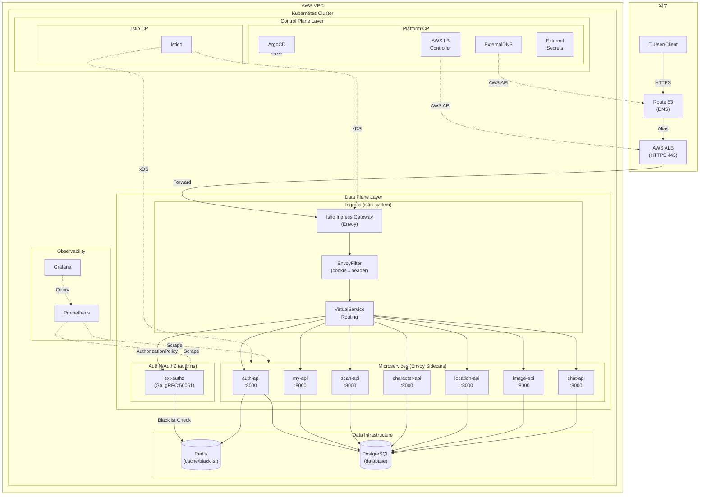
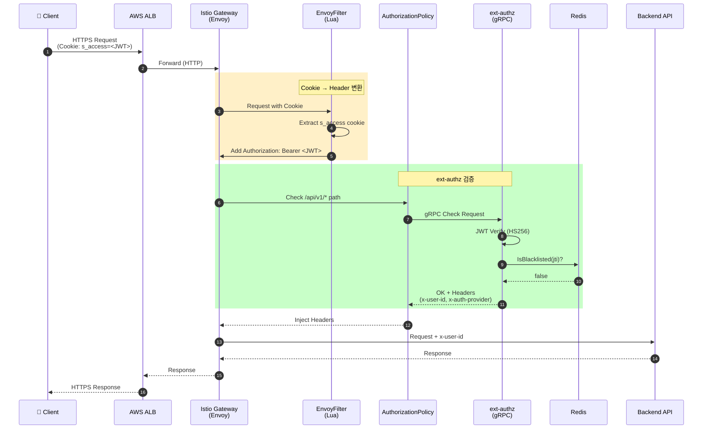
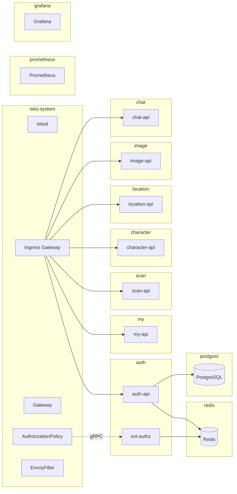
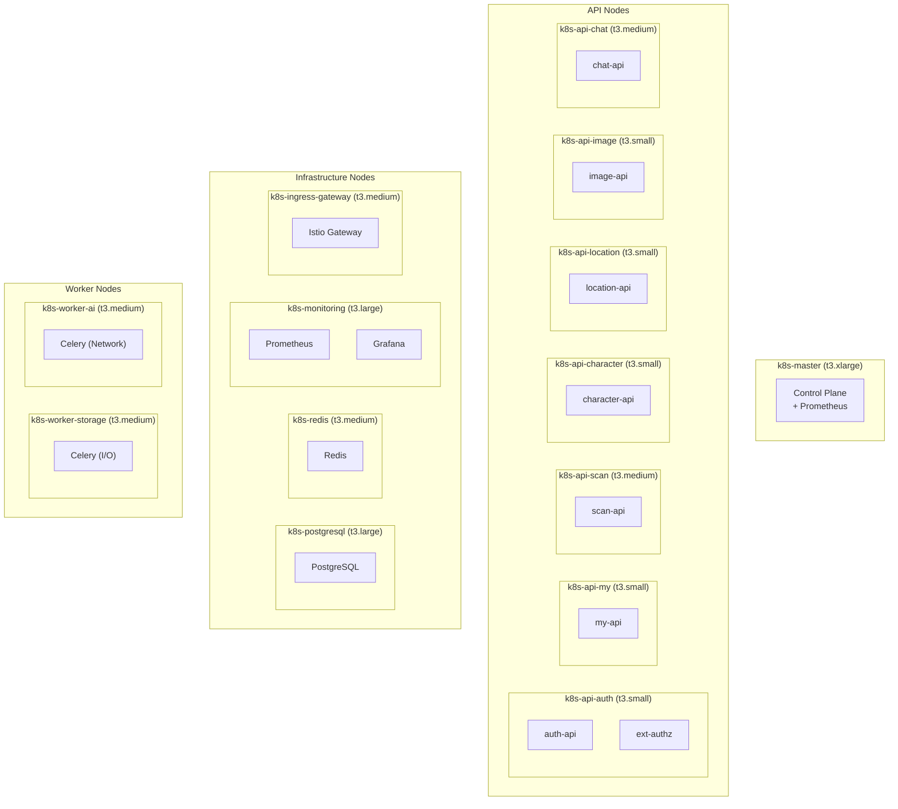

# 이코에코 클러스터 네트워크 토폴로지

## 개요

이코에코 백엔드 클러스터의 네트워크 아키텍처입니다. Istio 서비스 메시 기반으로 구성되어 있으며, ext-authz를 통한 중앙집중식 인증/인가를 수행합니다.

---

## 전체 아키텍처

---

## AuthN/AuthZ 상세 흐름

---

## 네임스페이스 구조

---

## 노드 배치 (EC2)

---

## 주요 구성 요소

### Istio 리소스

| 리소스 | 이름 | 네임스페이스 | 역할 |
|--------|------|-------------|------|
| Gateway | eco2-gateway | istio-system | 외부 트래픽 진입점 |
| EnvoyFilter | cookie-to-header | istio-system | s_access 쿠키 → Authorization 헤더 |
| AuthorizationPolicy | ext-authz-policy | istio-system | /api/v1/* 경로 ext-authz 호출 |
| VirtualService | {domain}-vs | 각 ns | 경로 기반 라우팅 |

### ext-authz 설정

| 항목 | 값 |
|------|-----|
| Service | ext-authz.auth.svc.cluster.local |
| Port | 50051 (gRPC) |
| Timeout | 0.25s |
| failOpen | false |
| 검증 대상 헤더 | authorization, x-refresh-token, x-request-id |

### 우회 경로 (notPaths)

- OAuth: `/api/v1/auth/{kakao,google,naver}`, `/api/v1/auth/{provider}/callback`
- 토큰 갱신: `/api/v1/auth/refresh`
- 문서: `/api/v1/{service}/docs`, `/api/v1/{service}/openapi.json`
- 헬스체크: `/api/v1/{service}/{health,ready,metrics}`

