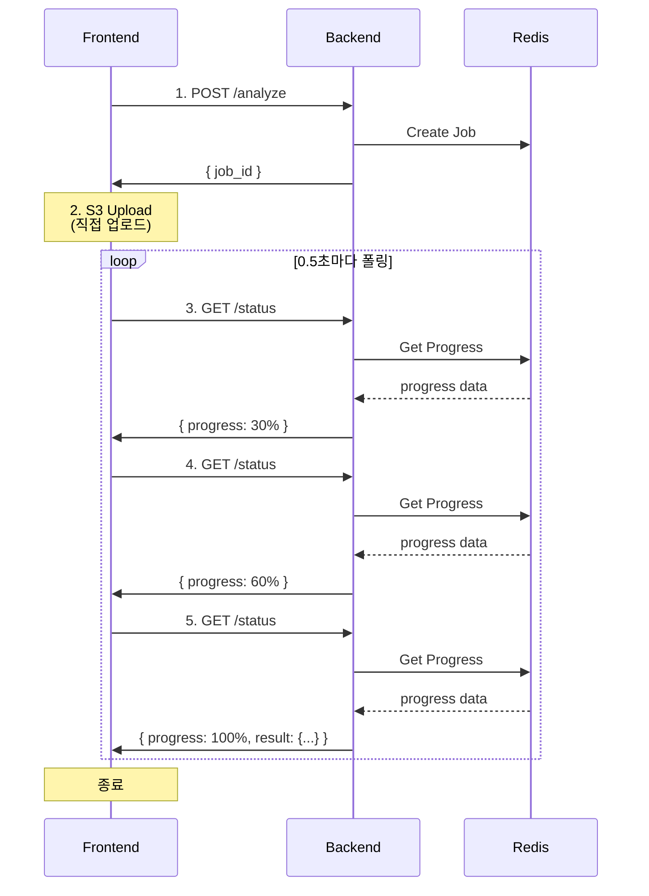
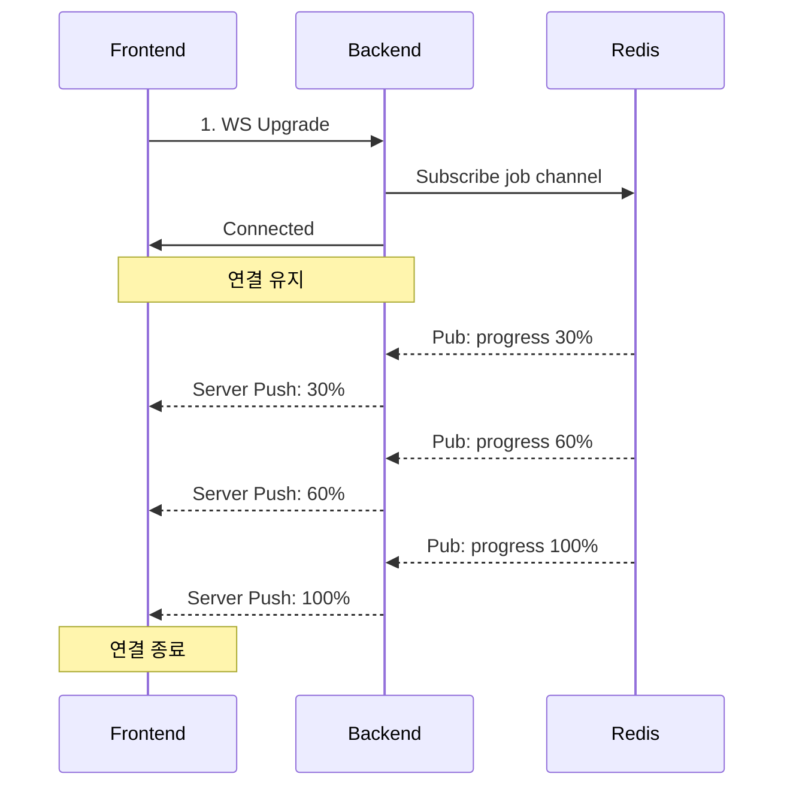

# ⚡ Polling vs WebSocket 비교 분석

> **결정**: Short Polling 방식 채택 ✅  
> **날짜**: 2025-10-30  
> **작성자**: Backend Team

## 📋 목차

1. [문제 정의](#문제-정의)
2. [두 방식 비교](#두-방식-비교)
3. [실제 트래픽 시뮬레이션](#실제-트래픽-시뮬레이션)
4. [최종 결정](#최종-결정)

---

## 🎯 문제 정의

### 서비스 특성

```
사용자 행동 패턴:
1. 쓰레기 사진 촬영/업로드 (2~5MB)
2. AI 비전 분석 대기 (2~5초)
3. LLM 피드백 생성 대기 (3~8초)
4. 결과 확인 → 종료

특징:
- 단발성 요청-응답
- 5-10초 처리 시간
- 실시간 진행률 표시 필요
- 동시 접속 100+ 예상
```

### 해결해야 할 과제

1. **실시간 진행률 표시** (0% → 100%, 1% 단위)
2. **로드 밸런서 환경** (3+ FastAPI 인스턴스)
3. **Auto Scaling 대응** (트래픽에 따라 서버 증감)
4. **모바일 네트워크 안정성** (연결 끊김 대응)

---

## 🔄 두 방식 비교

### 1️⃣ Short Polling 방식

#### 아키텍처



#### 구현 코드

```python
# Backend (FastAPI)
@router.get("/waste/status/{job_id}")
async def get_job_status(job_id: str):
    """진행률 조회 (Stateless)"""
    progress_data = await redis.get(f"job:{job_id}:progress")
    
    if not progress_data:
        raise HTTPException(404, "Job not found")
    
    data = json.loads(progress_data)
    
    return {
        "job_id": job_id,
        "status": data["status"],
        "progress": data["progress"],
        "message": data["message"],
        "result": data.get("result") if data["progress"] == 100 else None
    }
```

```javascript
// Frontend (React Native)
const pollProgress = async (jobId) => {
  const maxAttempts = 20;  // 최대 10초 (0.5초 × 20)
  const interval = 500;     // 0.5초
  
  for (let i = 0; i < maxAttempts; i++) {
    const response = await fetch(`/api/v1/waste/status/${jobId}`);
    const data = await response.json();
    
    // UI 업데이트
    updateProgressBar(data.progress);
    updateMessage(data.message);
    
    if (data.progress === 100) {
      return data.result;  // 완료!
    }
    
    await sleep(interval);
  }
  
  throw new Error('Timeout');
};
```

#### 장점 ✅

| 항목 | 설명 |
|------|------|
| **Stateless** | 어느 서버로 요청이 가도 동일한 응답 |
| **LB 호환** | Round Robin, Least Connections 등 자유 |
| **Auto Scaling** | 서버 추가/제거 시 영향 없음 |
| **구현 간단** | 일반 HTTP GET 요청만 사용 |
| **디버깅 쉬움** | cURL로 테스트 가능 |
| **모바일 친화적** | 네트워크 끊김에 강함 |
| **재시도 간편** | 실패 시 다시 요청만 하면 됨 |

#### 단점 ⚠️

| 항목 | 설명 | 대응 방안 |
|------|------|-----------|
| 네트워크 오버헤드 | 0.5초마다 요청 (10회 → ~5KB) | 무시 가능한 수준 |
| 실시간성 부족 | 최대 0.5초 지연 | 사용자가 체감 불가 |
| 서버 부하 | 100명 × 10회 = 1,000 req | FastAPI 1,000+ req/s 처리 가능 |

---

### 2️⃣ WebSocket 방식

#### 아키텍처



#### 구현 코드

```python
# Backend (FastAPI)
@router.websocket("/ws/status/{job_id}")
async def websocket_status(websocket: WebSocket, job_id: str):
    """WebSocket 진행률 스트리밍 (Stateful)"""
    await websocket.accept()
    
    # Redis Pub/Sub 구독
    pubsub = redis.pubsub()
    await pubsub.subscribe(f"job:{job_id}")
    
    try:
        async for message in pubsub.listen():
            if message["type"] == "message":
                data = json.loads(message["data"])
                
                # 클라이언트에게 즉시 전송
                await websocket.send_json(data)
                
                if data["progress"] == 100:
                    break
    finally:
        await pubsub.unsubscribe(f"job:{job_id}")
        await websocket.close()

# Celery Worker
def update_progress(job_id: str, progress: int, message: str):
    """Redis Pub/Sub로 진행률 발행"""
    redis.publish(
        f"job:{job_id}",
        json.dumps({"progress": progress, "message": message})
    )
```

```javascript
// Frontend (React Native)
const connectWebSocket = (jobId) => {
  return new Promise((resolve, reject) => {
    const ws = new WebSocket(`wss://api.example.com/ws/status/${jobId}`);
    
    ws.onmessage = (event) => {
      const data = JSON.parse(event.data);
      
      updateProgressBar(data.progress);
      updateMessage(data.message);
      
      if (data.progress === 100) {
        ws.close();
        resolve(data.result);
      }
    };
    
    ws.onerror = (error) => {
      reject(error);
    };
    
    ws.onclose = () => {
      // 재연결 로직 필요!
    };
  });
};
```

#### 장점 ✅

| 항목 | 설명 |
|------|------|
| **실시간성** | 서버 → 클라이언트 즉시 푸시 (지연 0ms) |
| **네트워크 효율** | 연결 1번만 유지 |
| **진정한 실시간** | 서버 이벤트를 즉시 전달 |

#### 단점 ❌

| 항목 | 설명 |
|------|------|
| **Stateful** | 특정 서버에 연결 고정 필요 |
| **Sticky Session 필수** | ALB 설정 복잡 |
| **Auto Scaling 어려움** | 서버 제거 시 연결 끊김 |
| **메모리 소모** | 연결당 2MB (100명 = 200MB) |
| **Redis Pub/Sub 필요** | 추가 인프라 및 복잡도 |
| **모바일 불안정** | 네트워크 전환 시 재연결 |
| **디버깅 어려움** | 특수 도구 필요 |
| **구현 복잡** | Polling 대비 10배 |

---

## 📊 실제 트래픽 시뮬레이션

### 시나리오: 동시 사용자 100명

#### Polling 방식

```
=== 요청 패턴 ===
초기 요청: 100명 × 1회 = 100 req
폴링 요청: 100명 × 10회 (5초간) = 1,000 req
총 요청: 1,100 req / 5초 = 220 req/s

=== 서버 분산 (FastAPI 3대) ===
Server #1: 73 req/s
Server #2: 73 req/s
Server #3: 74 req/s

FastAPI 처리 능력: 1,000+ req/s
여유도: 93% ✅

=== 메모리 사용 ===
연결 유지 불필요
안정적인 메모리 사용

=== 네트워크 ===
요청당 크기: ~500 bytes
총 트래픽: 1,100 × 500 = 550KB
대역폭 영향: 무시 가능

=== 장애 대응 ===
- Server #1 죽음 → ALB가 #2, #3으로 자동 라우팅
- 사용자 영향: 없음 (다음 폴링 때 다른 서버 사용)
- 재시도: 자동 (HTTP 수준에서 처리)
```

#### WebSocket 방식

```
=== 연결 패턴 ===
동시 연결: 100개 (5초간 유지)
연결 수명: 평균 5초

=== 서버 분산 (Sticky Session) ===
Server #1: 33 connections (고정)
Server #2: 33 connections (고정)
Server #3: 34 connections (고정)

=== 메모리 사용 ===
Server #1: 33 × 2MB = 66MB
Server #2: 33 × 2MB = 66MB
Server #3: 34 × 2MB = 68MB
총: 200MB

=== Redis Pub/Sub ===
메시지: 100명 × 10회 = 1,000 messages
Pub/Sub 오버헤드: +30% CPU
모든 FastAPI가 모든 채널 구독 필요

=== 장애 대응 ===
- Server #1 죽음 → 33명 연결 끊김
- 사용자 영향: 재연결 필요 (5초 딜레이)
- 재연결 시 Server #2로 가면 → 기존 진행률 복구 필요
```

---

## 🔧 로드 밸런서 호환성

### Polling - ALB 설정 (제약 없음)

```yaml
# AWS ALB - 간단한 설정
TargetGroup:
  HealthCheck:
    Path: /health
    Interval: 30
  
  # Sticky Session 불필요!
  Stickiness:
    Enabled: false

Listener:
  DefaultActions:
    - Type: forward
      # Round Robin (기본값)
```

```nginx
# Nginx - 간단한 설정
upstream fastapi_backend {
    server backend1:8000;
    server backend2:8000;
    server backend3:8000;
    # Round Robin (기본값)
}

server {
    location /api/v1/waste/status/ {
        proxy_pass http://fastapi_backend;
        # 특별한 설정 불필요
    }
}
```

### WebSocket - ALB 설정 (복잡)

```yaml
# AWS ALB - 복잡한 설정
TargetGroup:
  HealthCheck:
    Path: /health
  
  # Sticky Session 필수!
  Stickiness:
    Enabled: true
    Type: application-based
    Duration: 3600  # 1시간

Listener:
  DefaultActions:
    - Type: forward
      # IP Hash 또는 Cookie 기반 고정
```

```nginx
# Nginx - 복잡한 설정
map $http_upgrade $connection_upgrade {
    default upgrade;
    '' close;
}

upstream websocket_backend {
    # IP Hash 필수!
    ip_hash;
    
    server backend1:8000;
    server backend2:8000;
    server backend3:8000;
}

server {
    location /ws/ {
        proxy_pass http://websocket_backend;
        proxy_http_version 1.1;
        
        # WebSocket 전용 헤더
        proxy_set_header Upgrade $http_upgrade;
        proxy_set_header Connection $connection_upgrade;
        
        # 타임아웃 길게 (연결 유지)
        proxy_read_timeout 300s;
        proxy_send_timeout 300s;
    }
}
```

---

## ❓ 세밀한 진행률 표시 가능 여부

### Q: Polling으로 0→100%, 1% 단위 표시 가능한가?

**A: 완전히 가능합니다!** ✅

#### 핵심 메커니즘

```python
# Celery Worker - 세밀한 진행률 업데이트
@celery_app.task(bind=True)
def process_waste_image(self, job_id: str):
    """진행률을 Redis에 1% 단위로 업데이트"""
    
    # 0% - 시작
    update_progress(job_id, 0, "작업 시작")
    
    # 10% - 이미지 다운로드
    update_progress(job_id, 10, "이미지 다운로드 중...")
    image = download_from_s3(job_id)
    
    # 20% - 해시 계산
    update_progress(job_id, 20, "캐시 확인 중...")
    img_hash = calculate_hash(image)
    
    # 30% - 전처리
    update_progress(job_id, 30, "이미지 전처리 중...")
    processed = preprocess(image)
    
    # 40-50% - AI 호출 준비
    update_progress(job_id, 40, "AI 분석 준비...")
    update_progress(job_id, 50, "AI 비전 분석 중...")
    vision_result = call_ai_api(processed)
    
    # 60% - 결과 파싱
    update_progress(job_id, 60, "결과 처리 중...")
    
    # 70-80% - LLM
    update_progress(job_id, 70, "피드백 준비...")
    update_progress(job_id, 80, "AI 피드백 생성 중...")
    feedback = call_llm(vision_result)
    
    # 90% - 위치 검색
    update_progress(job_id, 90, "근처 수거함 검색...")
    locations = find_bins(vision_result)
    
    # 100% - 완료
    update_progress(job_id, 100, "완료!")
    save_result(job_id, {
        "waste_type": vision_result,
        "feedback": feedback,
        "locations": locations
    })

def update_progress(job_id: str, progress: int, message: str):
    """Redis에 진행률 저장 (모든 서버가 조회 가능)"""
    redis.setex(
        f"job:{job_id}:progress",
        3600,
        json.dumps({
            "progress": progress,
            "message": message,
            "updated_at": datetime.utcnow().isoformat()
        })
    )
```

#### Frontend 폴링 (0.5초마다)

```javascript
const pollProgress = async (jobId) => {
  const interval = setInterval(async () => {
    const response = await fetch(`/api/v1/waste/status/${jobId}`);
    const data = await response.json();
    
    // 세밀한 UI 업데이트
    updateProgressBar(data.progress);  // 0, 10, 20, 30, ... 100
    updateMessage(data.message);
    
    // 단계별 체크마크
    updateSteps({
      download: data.progress >= 10,
      cache: data.progress >= 20,
      preprocess: data.progress >= 30,
      ai_vision: data.progress >= 50,
      llm: data.progress >= 80,
      location: data.progress >= 90,
      done: data.progress === 100
    });
    
    if (data.progress === 100) {
      clearInterval(interval);
      showResult(data.result);
    }
  }, 500);  // 0.5초마다
};
```

**결과:**
- ✅ 사용자는 0.5초마다 업데이트된 진행률 확인
- ✅ Celery Worker가 10% 단위로 업데이트 → 충분히 세밀함
- ✅ 필요하면 1% 단위도 가능 (update_progress를 더 자주 호출)

---

## 🎯 최종 결정

### ✅ **Short Polling 방식 채택**

#### 결정 이유

1. **Stateless 설계** → LB와 완벽 호환
2. **간단한 구현** → 해커톤 일정에 적합
3. **안정성** → 모바일 네트워크 불안정에 강함
4. **디버깅 용이** → 문제 해결 빠름
5. **충분한 실시간성** → 0.5초 지연은 사용자가 체감 불가
6. **세밀한 진행률 가능** → 0-100%, 10% 단위 업데이트

#### 구현 계획

```python
# Phase 1: 기본 구조 (Day 1)
- S3 Presigned URL 업로드
- Redis 상태 관리
- 기본 폴링 API

# Phase 2: 진행률 추적 (Day 1-2)
- Celery Task 진행률 업데이트
- Frontend 폴링 로직
- Progress Bar UI

# Phase 3: 최적화 (Day 2)
- 이미지 해시 캐싱
- Celery Worker Auto Scaling
- CloudFront CDN
```

#### 성능 목표

| 지표 | 목표값 |
|------|--------|
| 초기 응답 시간 | < 0.1초 |
| 폴링 응답 시간 | < 0.05초 |
| 전체 처리 시간 | < 5초 |
| 동시 처리 | 100+ req/s |
| 캐시 히트율 | > 70% |

---

## 📚 참고 자료

- [FastAPI Background Tasks](https://fastapi.tiangolo.com/tutorial/background-tasks/)
- [Celery Progress Tracking](https://docs.celeryq.dev/en/stable/userguide/tasks.html#custom-task-classes)
- [AWS ALB Target Groups](https://docs.aws.amazon.com/elasticloadbalancing/latest/application/load-balancer-target-groups.html)
- [Redis Pub/Sub](https://redis.io/docs/manual/pubsub/)

---

## 🔄 추후 고려사항

### WebSocket이 정말 필요해진다면?

**적용 시나리오:**
- 실시간 채팅 기능 추가
- 라이브 스트리밍 기능
- 다중 사용자 협업 기능

**그래도 현재는 불필요:**
- 단발성 요청-응답 패턴
- 5초 처리 시간
- 양방향 통신 불필요

---

**작성일**: 2025-10-30  
**결정자**: Backend Team  
**상태**: ✅ 최종 승인

