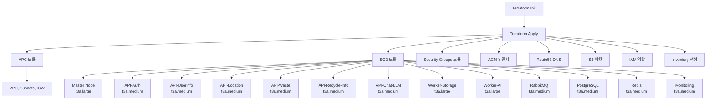
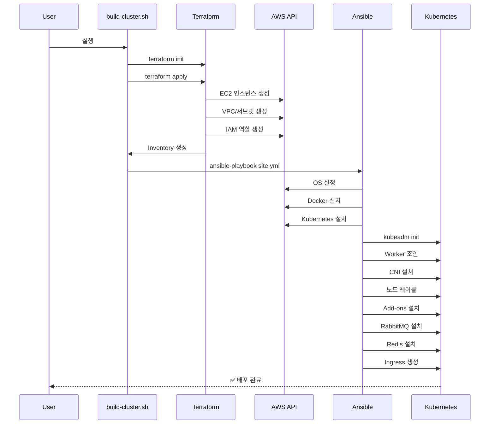

# 서비스 아키텍처 (Terraform/Ansible 기반)

> **기준 문서**: [final-k8s-architecture.md](final-k8s-architecture.md)  
> **배포 도구**: Terraform (IaC) + Ansible (Configuration Management)  
> **아키텍처**: 13-Node + Worker Local SQLite WAL  
> **앱 이름**: Eco² (이코에코)  
> **버전**: v0.6.0  
> **날짜**: 2025-11-07

## 📋 목차

1. [프로젝트 구조](#프로젝트-구조)
2. [인프라 배포 프로세스](#인프라-배포-프로세스)
3. [서비스 구성](#서비스-구성)
4. [배포 방식](#배포-방식)

---

## 🏗️ 프로젝트 구조

### 디렉토리 구조

```
SeSACTHON/backend/
├── terraform/              # Infrastructure as Code (IaC)
│   ├── main.tf            # 메인 설정 (13-Node 정의)
│   ├── modules/
│   │   ├── vpc/           # VPC 모듈 (서브넷, IGW, Route Table)
│   │   ├── ec2/           # EC2 모듈 (13개 노드)
│   │   └── security-groups/ # 보안 그룹 모듈
│   ├── acm.tf             # ACM 인증서
│   ├── route53.tf         # Route53 DNS
│   ├── s3.tf              # S3 버킷 (이미지 저장)
│   ├── cloudfront.tf      # CloudFront CDN
│   ├── iam.tf             # IAM 역할 및 정책
│   ├── alb-controller-iam.tf # ALB Controller IAM
│   └── outputs.tf         # Ansible Inventory 자동 생성
│
├── ansible/               # Configuration Management
│   ├── site.yml           # 메인 플레이북 (15단계)
│   ├── playbooks/         # 단계별 플레이북
│   │   ├── 02-master-init.yml
│   │   ├── 03-worker-join.yml
│   │   ├── 03-1-set-provider-id.yml  # Provider ID 주입 (NEW)
│   │   ├── 04-cni-install.yml
│   │   ├── 05-addons.yml
│   │   ├── 05-1-ebs-csi-driver.yml
│   │   ├── 06-cert-manager-issuer.yml
│   │   ├── 07-alb-controller.yml
│   │   ├── 07-ingress-resources.yml
│   │   ├── 08-monitoring.yml
│   │   ├── 09-etcd-backup.yml
│   │   └── label-nodes.yml          # 13-Node 레이블 (NEW)
│   ├── roles/             # 재사용 가능한 역할
│   │   ├── common/        # OS 설정 (Swap, 커널)
│   │   ├── docker/        # Docker 설치
│   │   ├── kubernetes/    # Kubernetes 패키지 설치
│   │   ├── argocd/        # ArgoCD 설치
│   │   ├── rabbitmq/      # RabbitMQ Operator 설치
│   │   └── redis/         # Redis 설치
│   └── inventory/
│       └── group_vars/
│           └── all.yml    # 공통 변수 (K8s 버전, 도메인 등)
│
├── scripts/               # 자동화 스크립트
│   ├── cluster/
│   │   └── auto-rebuild.sh  # 전체 자동화 (13-Node 지원)
│   ├── maintenance/
│   │   └── destroy-with-cleanup.sh  # 완전 삭제 스크립트
│   ├── utilities/
│   │   ├── invalidate-cdn-cache.sh  # CDN 캐시 무효화
│   │   └── request-vcpu-increase.sh # vCPU 한도 증가 요청
│   └── check-*.sh         # 상태 확인 스크립트
│
└── docs/                  # 문서
    ├── architecture/      # 아키텍처 설계
    ├── infrastructure/    # 인프라 가이드
    ├── guides/           # 실용 가이드
    └── troubleshooting/  # 문제 해결
```

---

## 🚀 인프라 배포 프로세스

### Phase 1: Terraform (AWS 인프라 프로비저닝)



**Terraform 출력**:
- EC2 인스턴스 IP 주소
- VPC ID
- ACM Certificate ARN
- Ansible Inventory (자동 생성)

### Phase 2: Ansible (Kubernetes 클러스터 구성)

**site.yml 실행 순서**:

1. **Prerequisites - OS 설정**
   - Role: `common`
   - Swap 비활성화, 커널 파라미터 설정

2. **Docker 설치**
   - Role: `docker`
   - Container Runtime 설치

3. **Kubernetes 패키지 설치**
   - Role: `kubernetes`
   - kubeadm, kubelet, kubectl 설치

4. **Master 초기화**
   - Playbook: `02-master-init.yml`
   - `kubeadm init` 실행
   - kubeconfig 설정

5. **Workers 조인**
   - Playbook: `03-worker-join.yml`
   - 12개 Worker 노드 조인 (API 6개, Worker 2개, Infra 4개)

5-1. **Provider ID 설정**
   - Playbook: `03-1-set-provider-id.yml`
   - AWS 인스턴스 ID를 Kubernetes node에 주입
   - ALB Controller 연동에 필수

6. **CNI 플러그인 설치**
   - Playbook: `04-cni-install.yml`
   - Calico VXLAN 설치
   - 노드 Ready 상태 확인

7. **노드 레이블 지정**
   - Playbook: `label-nodes.yml`
   ```yaml
   # Master
   - node-role.kubernetes.io/master
   
   # API 노드 (6개)
   - workload=api
   - domain=auth / userinfo / location / waste / recycle-info / chat-llm
   - instance-type=t3a.medium
   
   # Worker 노드 (2개)
   - workload=worker
   - domain=storage / ai
   - instance-type=t3a.large
   
   # Infra 노드 (4개)
   - workload=infrastructure
   - domain=rabbitmq / postgresql / redis / monitoring
   - instance-type=t3a.medium
   ```

8. **Add-ons 설치**
   - Playbook: `05-addons.yml`
   - Cert-manager, Metrics Server

9. **EBS CSI Driver**
   - Playbook: `05-1-ebs-csi-driver.yml`
   - StorageClass (gp3) 생성

10. **Cert-manager Issuer**
    - Playbook: `06-cert-manager-issuer.yml`
    - Let's Encrypt ClusterIssuer

11. **ALB Controller**
    - Playbook: `07-alb-controller.yml`
    - Helm으로 설치

12. **ArgoCD 설치**
    - Role: `argocd`
    - kubectl apply 방식

13. **Monitoring 설치**
    - Playbook: `08-monitoring.yml`
    - Prometheus Stack (Helm)

14. **RabbitMQ 설치**
    - Role: `rabbitmq`
    - Operator 설치 + RabbitmqCluster CR

15. **Redis 설치**
    - Role: `redis`
    - kubectl apply 방식

16. **Ingress 리소스 생성**
    - Playbook: `07-ingress-resources.yml`
    - Path-based Routing 설정

17. **etcd 백업 설정**
    - Playbook: `09-etcd-backup.yml`

---

## 🎯 서비스 구성 (13-Node)

### API 마이크로서비스 (6개)

> **참고**: [final-k8s-architecture.md](final-k8s-architecture.md) - 마이크로서비스 배치 섹션

#### 1. auth-api
- **Namespace**: `api-auth`
- **Replicas**: 2
- **Node**: k8s-api-auth (t3a.medium)
- **기술**: FastAPI, OAuth 2.0, JWT
- **Path**: `/api/v1/auth`

#### 2. userinfo-api
- **Namespace**: `api-userinfo`
- **Replicas**: 2
- **Node**: k8s-api-userinfo (t3a.medium)
- **기술**: FastAPI
- **Path**: `/api/v1/users`

#### 3. location-api
- **Namespace**: `api-location`
- **Replicas**: 2
- **Node**: k8s-api-location (t3a.medium)
- **기술**: FastAPI, Kakao Map API
- **Path**: `/api/v1/locations`

#### 4. waste-api
- **Namespace**: `api-waste`
- **Replicas**: 2
- **Node**: k8s-api-waste (t3a.medium)
- **기술**: FastAPI, 쓰레기 분석
- **Path**: `/api/v1/waste`

#### 5. recycle-info-api
- **Namespace**: `api-recycle-info`
- **Replicas**: 2
- **Node**: k8s-api-recycle-info (t3a.medium)
- **기술**: FastAPI, 재활용 정보
- **Path**: `/api/v1/recycle-info`

#### 6. chat-llm-api
- **Namespace**: `api-chat-llm`
- **Replicas**: 2
- **Node**: k8s-api-chat-llm (t3a.medium)
- **기술**: FastAPI, LLM 챗봇
- **Path**: `/api/v1/chat`

### Worker 서비스 (2개) + Worker Local SQLite WAL

#### Worker-Storage
- **Node**: k8s-worker-storage (t3a.large)
- **Namespace**: `workers`
- **기능**:
  - S3 Upload Worker (Celery)
  - **Worker Local SQLite WAL** (로컬 작업 로그)
  - PostgreSQL 동기화 (5분 주기)
- **RabbitMQ 큐**: `q.storage`
- **PVC**: 50GB (WAL 저장소)
- **복구**: WAL 기반 자동 복구

#### Worker-AI
- **Node**: k8s-worker-ai (t3a.large)
- **Namespace**: `workers`
- **기능**:
  - AI Analysis Worker (Celery)
  - **Worker Local SQLite WAL** (로컬 작업 로그)
  - PostgreSQL 동기화 (5분 주기)
- **RabbitMQ 큐**: `q.ai`
- **PVC**: 50GB (WAL 저장소)
- **복구**: WAL 기반 자동 복구

### 인프라 서비스 (4개)

#### RabbitMQ
- **Node**: k8s-rabbitmq (t3a.medium)
- **Namespace**: `messaging`
- **Replicas**: 1 (향후 HA 3-node)
- **배포 방식**: Operator (kubectl apply)
- **Role**: `ansible/roles/rabbitmq/`

#### PostgreSQL
- **Node**: k8s-postgresql (t3a.medium)
- **Namespace**: `database`
- **Replicas**: 1
- **배포 방식**: StatefulSet
- **스토리지**: EBS gp3 100GB
- **기능**: 중앙 DB (Worker WAL 동기화 타겟)

#### Redis
- **Node**: k8s-redis (t3a.medium)
- **Namespace**: `cache`
- **Replicas**: 1
- **배포 방식**: kubectl apply
- **Role**: `ansible/roles/redis/`
- **기능**: 세션 캐시, API 캐시

#### Monitoring (Prometheus + Grafana)
- **Node**: k8s-monitoring (t3a.medium)
- **Namespace**: `monitoring`
- **배포 방식**: Helm (kube-prometheus-stack)
- **구성**:
  - Prometheus Server (메트릭 수집/저장)
  - Grafana (시각화)
  - Alertmanager (알림)
  - Node Exporter (노드 메트릭)
- **보존 기간**: 30일

### CDN + S3 이미지 저장소

#### CloudFront
- **Distribution**: E3EIBT2OP59VRA (예시)
- **Origin**: S3 버킷 (prod-sesacthon-images)
- **도메인**: images.ecoeco.app (예정)
- **캐싱**: Edge 캐싱

#### S3 Bucket
- **Bucket**: prod-sesacthon-images
- **Region**: ap-northeast-2
- **Lifecycle**: 90일 후 자동 삭제
- **CORS**: API 도메인 허용

---

## 🔧 배포 방식

### 현재 배포 방식 (Ansible)

| 컴포넌트 | 배포 방식 | 파일 위치 |
|---------|---------|----------|
| **Kubernetes Core** | kubeadm | `ansible/site.yml` |
| **Calico CNI** | kubectl apply | `ansible/playbooks/04-cni-install.yml` |
| **Cert-manager** | kubectl apply | `ansible/playbooks/05-addons.yml` |
| **EBS CSI Driver** | kubectl apply | `ansible/playbooks/05-1-ebs-csi-driver.yml` |
| **ALB Controller** | Helm | `ansible/playbooks/07-alb-controller.yml` |
| **ArgoCD** | kubectl apply | `ansible/roles/argocd/tasks/main.yml` |
| **Prometheus Stack** | Helm | `ansible/playbooks/08-monitoring.yml` |
| **RabbitMQ** | Operator | `ansible/roles/rabbitmq/tasks/main.yml` |
| **Redis** | kubectl apply | `ansible/roles/redis/tasks/main.yml` |

### 향후 애플리케이션 배포 방식 (GitOps)

```
API 서비스 (6개):
├─ auth-api → ArgoCD Application (Helm Chart)
├─ userinfo-api → ArgoCD Application (Helm Chart)
├─ location-api → ArgoCD Application (Helm Chart)
├─ waste-api → ArgoCD Application (Helm Chart)
├─ recycle-info-api → ArgoCD Application (Helm Chart)
└─ chat-llm-api → ArgoCD Application (Helm Chart)

Worker 서비스 (2개):
├─ storage-worker → ArgoCD Application (Helm Chart)
│  └─ Worker Local SQLite WAL + PostgreSQL 동기화
└─ ai-worker → ArgoCD Application (Helm Chart)
   └─ Worker Local SQLite WAL + PostgreSQL 동기화
```

---

## 📊 배포 프로세스 시퀀스



---

## 🎯 핵심 포인트

### Terraform 역할
- **AWS 인프라 프로비저닝**
- **인벤토리 자동 생성** (`outputs.tf` → `hosts.tpl`)

### Ansible 역할
- **OS 레벨 설정** (Swap, 커널)
- **Kubernetes 클러스터 초기화** (kubeadm)
- **Add-ons 설치** (Cert-manager, ALB Controller 등)
- **애플리케이션 인프라 설치** (RabbitMQ, Redis)
- **노드 레이블 지정** (워크로드 분리)

### 향후 GitOps
- **GitHub Actions**: CI (빌드, 테스트, 이미지 푸시)
- **ArgoCD**: CD (자동 배포)
- **Helm Charts**: 애플리케이션 매니페스트 관리

---

**작성일**: 2025-11-07  
**아키텍처 버전**: 3.0 (13-Node + Worker Local SQLite WAL)  
**앱 이름**: Eco² (이코에코)  
**기준 문서**: [final-k8s-architecture.md](final-k8s-architecture.md)  
**배포 도구**: Terraform + Ansible  
**자동화 스크립트**: `scripts/cluster/auto-rebuild.sh`

