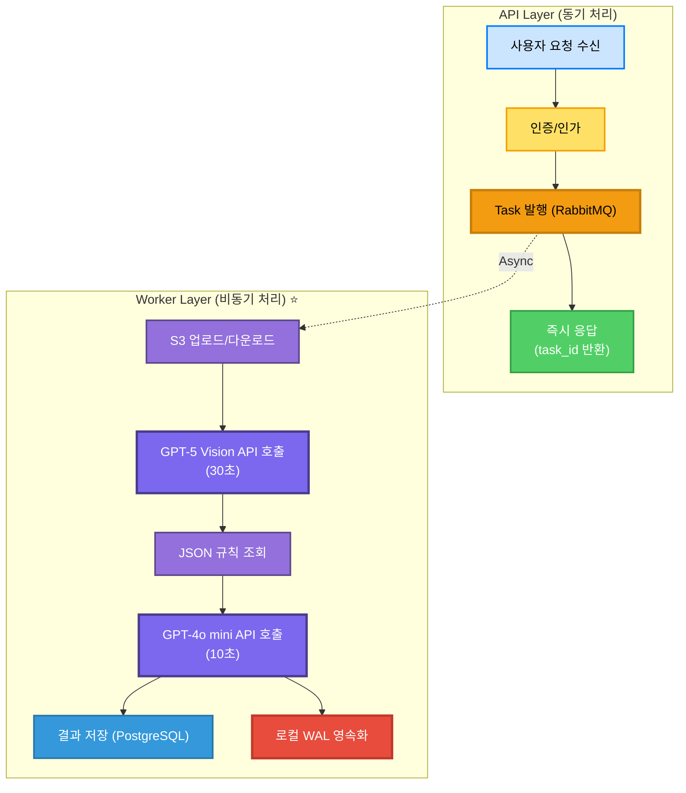
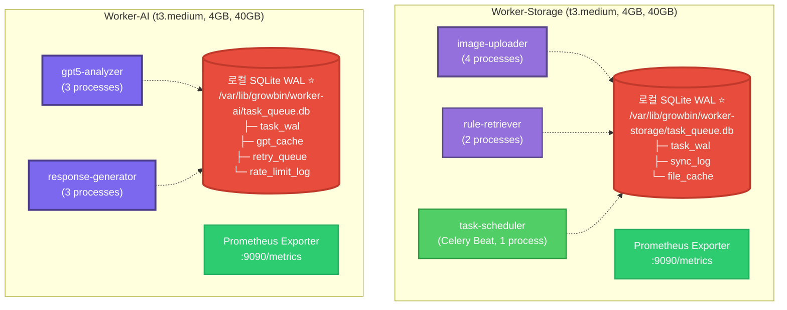
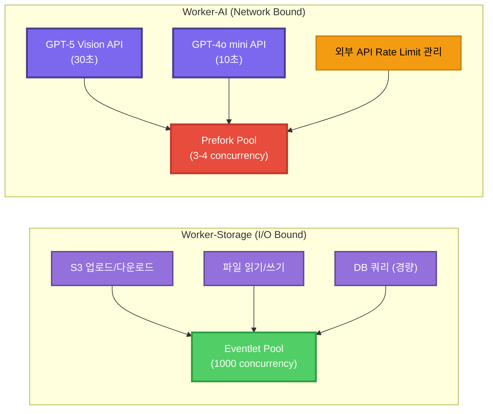

# Worker Layer 아키텍처

작성 일시: 2025-11-06
시스템: Growbin Backend (13-Node Cluster)
참고: [Celery 동작 방식](./CELERY_ARCHITECTURE.md), Instagram Architecture

---

## 📚 목차

1. [Worker Layer 개요](#1-worker-layer-개요)
2. [Growbin Worker 구조](#2-growbin-worker-구조)
3. [Worker 타입별 상세 설명](#3-worker-타입별-상세-설명)
4. [WAL 통합 아키텍처](#4-wal-통합-아키텍처)
5. [Worker 배포 전략](#5-worker-배포-전략)
6. [모니터링 및 장애 처리](#6-모니터링-및-장애-처리)
7. [성능 최적화](#7-성능-최적화)
8. [Best Practices](#8-best-practices)

---

## 1. Worker Layer 개요

### 1.1 정의

```
Worker Layer = Celery Worker를 실행하는 인프라 계층
  - 비동기 작업 실행
  - I/O 집약적 작업 (S3, API 호출)
  - AI 모델 추론 (GPT-5, GPT-4o mini)
```

### 1.2 Growbin에서의 역할



**장점**:
- ✅ API 응답 속도 향상 (즉시 반환)
- ✅ 리소스 격리 (API vs Worker)
- ✅ 스케일 독립 (Worker만 증설)
- ✅ 장애 격리 (Worker 다운 → API 정상)

---

## 2. Growbin Worker 구조

### 2.1 전체 아키텍처



### 2.2 Worker 분리 기준



---

## 3. Worker 타입별 상세 설명

### 3.1 image-uploader (Worker-Storage)

**역할**: S3 이미지 업로드 및 전처리

```python
# workers/storage/tasks/image_uploader.py
from celery import Task
from celery_app import app
import boto3
from PIL import Image

class ImageUploaderTask(Task):
    """이미지 업로드 Task Base"""
    
    def on_success(self, retval, task_id, args, kwargs):
        """업로드 성공 시"""
        # 로컬 WAL 업데이트
        local_wal.update_status(task_id, 'completed')
        
        # PostgreSQL 비동기 동기화
        sync_to_postgres.delay(task_id)
    
    def on_failure(self, exc, task_id, args, kwargs, einfo):
        """업로드 실패 시"""
        # 로컬 WAL에 에러 기록
        local_wal.update_status(task_id, 'failed', error=str(exc))

@app.task(
    base=ImageUploaderTask,
    bind=True,
    autoretry_for=(S3Error, NetworkError),
    retry_kwargs={'max_retries': 3, 'countdown': 10},
    time_limit=300,  # 5분 타임아웃
    acks_late=True,
)
def image_upload_task(self, user_id, image_path, analysis_id):
    """
    이미지 S3 업로드
    
    Args:
        user_id: 사용자 ID
        image_path: 로컬 이미지 경로
        analysis_id: 분석 ID
    
    Returns:
        dict: {"s3_path": "s3://...", "thumbnail_path": "s3://..."}
    """
    task_id = self.request.id
    
    # 1. 로컬 WAL에 Task 기록
    local_wal.save_task(
        task_id=task_id,
        task_name='image_upload',
        payload={'user_id': user_id, 'analysis_id': analysis_id},
        status='running'
    )
    
    try:
        # 2. 이미지 전처리
        image = Image.open(image_path)
        
        # 리사이즈 (최대 2048x2048)
        max_size = (2048, 2048)
        image.thumbnail(max_size, Image.Resampling.LANCZOS)
        
        # 3. S3 업로드 (원본)
        s3_key = f"uploads/{user_id}/{analysis_id}/original.jpg"
        s3_client.upload_file(
            image_path,
            bucket='prod-growbin-images',
            key=s3_key,
            ExtraArgs={
                'ContentType': 'image/jpeg',
                'CacheControl': 'max-age=31536000',  # 1년
            }
        )
        s3_path = f"s3://prod-growbin-images/{s3_key}"
        
        # 4. 썸네일 생성 및 업로드
        thumbnail = image.copy()
        thumbnail.thumbnail((300, 300), Image.Resampling.LANCZOS)
        
        thumbnail_key = f"uploads/{user_id}/{analysis_id}/thumbnail.jpg"
        # ... (썸네일 업로드)
        
        # 5. 결과 반환
        result = {
            "s3_path": s3_path,
            "thumbnail_path": f"s3://prod-growbin-images/{thumbnail_key}"
        }
        
        # 6. 다음 Task 발행 (Vision 분석)
        gpt5_analysis_task.apply_async(
            args=[analysis_id, s3_path],
            queue='vision_analysis'
        )
        
        return result
    
    except Exception as e:
        logger.error(f"Image upload failed: {e}")
        raise

# Celery Worker 설정
# $ celery -A celery_app worker \
#     -Q user_input \
#     --pool=eventlet \
#     --concurrency=1000 \
#     --hostname=image-uploader@%h
```

---

### 3.2 gpt5-analyzer (Worker-AI)

**역할**: GPT-5 Vision API 호출 및 이미지 분석

```python
# workers/ai/tasks/gpt5_analyzer.py
from celery import Task
from celery_app import app
import openai
import hashlib

class GPT5AnalyzerTask(Task):
    """GPT-5 분석 Task Base"""
    
    def on_success(self, retval, task_id, args, kwargs):
        # WAL 업데이트 + 캐싱
        local_wal.update_status(task_id, 'completed')
        
        # GPT-5 응답 캐싱
        cache_key = hashlib.sha256(str(args).encode()).hexdigest()
        local_wal.save_cache(cache_key, retval, ttl=3600)  # 1시간

@app.task(
    base=GPT5AnalyzerTask,
    bind=True,
    autoretry_for=(openai.error.RateLimitError, openai.error.APIError),
    retry_kwargs={'max_retries': 5, 'countdown': 30},
    retry_backoff=True,  # Exponential Backoff
    retry_jitter=True,   # Jitter 추가
    time_limit=60,       # 1분 타임아웃
    soft_time_limit=50,  # 50초 Soft Timeout
    rate_limit='100/m',  # 분당 100개 (GPT-5 Rate Limit)
    acks_late=True,
)
def gpt5_analysis_task(self, analysis_id, s3_path):
    """
    GPT-5 Vision으로 이미지 분석
    
    Args:
        analysis_id: 분석 ID
        s3_path: S3 이미지 경로
    
    Returns:
        dict: {
            "category": "plastic",
            "item": "pet_bottle",
            "state": "clean",
            "confidence": 0.95
        }
    """
    task_id = self.request.id
    
    # 1. 로컬 WAL에 Task 기록
    local_wal.save_task(
        task_id=task_id,
        task_name='gpt5_analysis',
        payload={'analysis_id': analysis_id},
        status='running'
    )
    
    # 2. 캐시 확인
    cache_key = hashlib.sha256(s3_path.encode()).hexdigest()
    cached = local_wal.get_cache(cache_key)
    if cached:
        logger.info(f"Cache hit for {s3_path}")
        return cached
    
    try:
        # 3. Rate Limit 체크
        rate_limit_key = f"rate_limit:gpt5:{self.request.id}"
        if redis.exists(rate_limit_key):
            raise self.retry(countdown=60)
        
        redis.setex(rate_limit_key, 60, 1)
        
        # 4. GPT-5 Vision API 호출
        response = openai.ChatCompletion.create(
            model="gpt-5-vision-preview",
            messages=[
                {
                    "role": "system",
                    "content": """당신은 폐기물 분류 전문가입니다.
                    이미지를 분석하여 다음 정보를 JSON 형식으로 반환하세요:
                    - category: 폐기물 종류 (plastic, paper, metal, glass, general)
                    - item: 구체적 품목 (pet_bottle, cardboard, aluminum_can 등)
                    - state: 상태 (clean, dirty, mixed)
                    - confidence: 신뢰도 (0.0-1.0)
                    """
                },
                {
                    "role": "user",
                    "content": [
                        {"type": "text", "text": "이 폐기물을 분석해주세요."},
                        {"type": "image_url", "image_url": {"url": s3_path}}
                    ]
                }
            ],
            max_tokens=500,
            temperature=0.2,  # 일관성 있는 응답
        )
        
        # 5. 응답 파싱
        result = json.loads(response.choices[0].message.content)
        
        # 6. 로컬 WAL 캐시에 저장
        local_wal.save_cache(cache_key, result, ttl=3600)
        
        # 7. 다음 Task 발행 (규칙 조회)
        rule_retrieval_task.apply_async(
            args=[analysis_id, result['item']],
            queue='rule_retrieval'
        )
        
        return result
    
    except openai.error.RateLimitError as e:
        # Rate Limit 초과 → 재시도
        logger.warning(f"GPT-5 Rate Limit: {e}")
        raise self.retry(exc=e, countdown=60)
    
    except Exception as e:
        logger.error(f"GPT-5 analysis failed: {e}")
        raise

# Celery Worker 설정
# $ celery -A celery_app worker \
#     -Q vision_analysis \
#     --pool=prefork \
#     --concurrency=3 \
#     --hostname=gpt5-analyzer@%h
```

---

### 3.3 rule-retriever (Worker-Storage)

**역할**: JSON 규칙 파일 조회

```python
# workers/storage/tasks/rule_retriever.py
from celery import Task
from celery_app import app
import json
from pathlib import Path

@app.task(
    bind=True,
    time_limit=10,  # 10초 타임아웃 (로컬 파일 조회)
    acks_late=True,
)
def rule_retrieval_task(self, analysis_id, item):
    """
    JSON 규칙 조회
    
    Args:
        analysis_id: 분석 ID
        item: 품목 (pet_bottle, cardboard 등)
    
    Returns:
        dict: {"rules": [...], "disposal_method": "..."}
    """
    task_id = self.request.id
    
    # 1. 로컬 WAL에 Task 기록
    local_wal.save_task(
        task_id=task_id,
        task_name='rule_retrieval',
        payload={'analysis_id': analysis_id, 'item': item},
        status='running'
    )
    
    try:
        # 2. JSON 파일 조회 (로컬)
        rule_path = Path(f"/app/rules/{item}.json")
        
        if not rule_path.exists():
            # Fallback to general rule
            rule_path = Path("/app/rules/general.json")
        
        with open(rule_path, 'r', encoding='utf-8') as f:
            rules = json.load(f)
        
        # 3. 다음 Task 발행 (응답 생성)
        response_generation_task.apply_async(
            args=[analysis_id, rules],
            queue='response_generation'
        )
        
        return rules
    
    except Exception as e:
        logger.error(f"Rule retrieval failed: {e}")
        raise

# Celery Worker 설정
# $ celery -A celery_app worker \
#     -Q rule_retrieval \
#     --pool=prefork \
#     --concurrency=2 \
#     --hostname=rule-retriever@%h
```

---

### 3.4 response-generator (Worker-AI)

**역할**: GPT-4o mini로 최종 응답 생성

```python
# workers/ai/tasks/response_generator.py
from celery import Task
from celery_app import app
import openai

@app.task(
    bind=True,
    autoretry_for=(openai.error.RateLimitError,),
    retry_kwargs={'max_retries': 3, 'countdown': 20},
    time_limit=30,  # 30초 타임아웃
    rate_limit='200/m',  # 분당 200개 (GPT-4o mini)
    acks_late=True,
)
def response_generation_task(self, analysis_id, rules):
    """
    GPT-4o mini로 최종 응답 생성
    
    Args:
        analysis_id: 분석 ID
        rules: 분리배출 규칙
    
    Returns:
        str: 사용자에게 보여줄 최종 응답
    """
    task_id = self.request.id
    
    # 1. 로컬 WAL에 Task 기록
    local_wal.save_task(
        task_id=task_id,
        task_name='response_generation',
        payload={'analysis_id': analysis_id},
        status='running'
    )
    
    try:
        # 2. GPT-4o mini API 호출
        response = openai.ChatCompletion.create(
            model="gpt-4o-mini",
            messages=[
                {
                    "role": "system",
                    "content": """당신은 친절한 분리배출 안내 도우미입니다.
                    사용자가 이해하기 쉽게 설명해주세요."""
                },
                {
                    "role": "user",
                    "content": f"""다음 규칙을 바탕으로 분리배출 방법을 안내해주세요:
                    {json.dumps(rules, ensure_ascii=False)}
                    """
                }
            ],
            max_tokens=300,
            temperature=0.7,
        )
        
        final_response = response.choices[0].message.content
        
        # 3. PostgreSQL에 최종 결과 저장
        with postgres_session('growbin_waste') as db:
            analysis = db.query(WasteAnalysis).get(analysis_id)
            analysis.status = 'completed'
            analysis.response = final_response
            analysis.completed_at = datetime.now()
            db.commit()
        
        # 4. 로컬 WAL 업데이트
        local_wal.update_status(task_id, 'completed')
        
        return final_response
    
    except Exception as e:
        logger.error(f"Response generation failed: {e}")
        raise

# Celery Worker 설정
# $ celery -A celery_app worker \
#     -Q response_generation \
#     --pool=prefork \
#     --concurrency=3 \
#     --hostname=response-generator@%h
```

---

### 3.5 task-scheduler (Celery Beat)

**역할**: 주기적 작업 스케줄링

```python
# workers/storage/tasks/scheduler.py
from celery_app import app
from celery.schedules import crontab

# Celery Beat 스케줄 정의
app.conf.beat_schedule = {
    # 5분마다: WAL → PostgreSQL 동기화
    'sync-wal-every-5-minutes': {
        'task': 'workers.storage.tasks.sync_wal_to_postgres',
        'schedule': 300.0,
    },
    
    # 1시간마다: WAL 체크포인트
    'wal-checkpoint-hourly': {
        'task': 'workers.storage.tasks.wal_checkpoint',
        'schedule': 3600.0,
    },
    
    # 매일 자정: 로그 정리
    'cleanup-logs-daily': {
        'task': 'workers.storage.tasks.cleanup_logs',
        'schedule': crontab(hour=0, minute=0),
    },
    
    # 매주 월요일 오전 9시: 주간 리포트
    'weekly-report-monday-9am': {
        'task': 'workers.analytics.tasks.generate_weekly_report',
        'schedule': crontab(hour=9, minute=0, day_of_week=1),
    },
}

@app.task
def sync_wal_to_postgres():
    """WAL → PostgreSQL 동기화"""
    # 상세 설명은 WAL 아키텍처 참고
    pass

@app.task
def wal_checkpoint():
    """WAL 체크포인트 (WAL → DB 동기화)"""
    local_wal.conn.execute("PRAGMA wal_checkpoint(FULL)")

# Celery Beat 시작
# $ celery -A celery_app beat --loglevel=info
```

---

## 4. WAL 통합 아키텍처

> 상세 설명: [RabbitMQ + WAL 아키텍처](./RABBITMQ_WAL_ARCHITECTURE.md)

### 4.1 Worker 로컬 WAL 구조

```sql
-- /var/lib/growbin/worker-storage/task_queue.db
CREATE TABLE task_wal (
    task_id TEXT PRIMARY KEY,
    task_name TEXT NOT NULL,
    payload JSON,
    status TEXT DEFAULT 'pending',  -- pending, running, completed, failed
    rabbitmq_delivery_tag INTEGER,
    created_at INTEGER,
    started_at INTEGER,
    completed_at INTEGER,
    error TEXT,
    retry_count INTEGER DEFAULT 0
);

CREATE INDEX idx_task_status ON task_wal(status, created_at);

-- PostgreSQL 동기화 이력
CREATE TABLE sync_log (
    id INTEGER PRIMARY KEY AUTOINCREMENT,
    task_id TEXT NOT NULL,
    synced_at INTEGER,
    status TEXT,  -- success, failed
    error TEXT
);

-- 파일 캐시 (Worker-Storage)
CREATE TABLE file_cache (
    key TEXT PRIMARY KEY,
    file_path TEXT,
    size INTEGER,
    created_at INTEGER,
    ttl INTEGER
);
```

```sql
-- /var/lib/growbin/worker-ai/task_queue.db
-- (Worker-Storage와 동일한 task_wal 테이블)

-- GPT API 응답 캐시
CREATE TABLE gpt_cache (
    cache_key TEXT PRIMARY KEY,
    prompt TEXT,
    response JSON,
    model TEXT,  -- gpt-5-vision, gpt-4o-mini
    created_at INTEGER,
    ttl INTEGER DEFAULT 3600
);

CREATE INDEX idx_gpt_cache_ttl ON gpt_cache(created_at + ttl);

-- 재시도 큐
CREATE TABLE retry_queue (
    task_id TEXT PRIMARY KEY,
    retry_count INTEGER,
    next_retry_at INTEGER,
    error TEXT,
    payload JSON
);

-- Rate Limit 로그
CREATE TABLE rate_limit_log (
    timestamp INTEGER,
    api TEXT,  -- gpt5, gpt4o
    count INTEGER
);
```

### 4.2 WAL 초기화 (Worker 시작 시)

```python
# workers/common/wal.py
import sqlite3
import time

class LocalWALQueue:
    def __init__(self, db_path, worker_type='storage'):
        self.db_path = db_path
        self.worker_type = worker_type
        self.conn = None
        self._init_connection()
    
    def _init_connection(self):
        """WAL 모드로 연결"""
        self.conn = sqlite3.connect(
            self.db_path,
            isolation_level=None,  # Autocommit
            check_same_thread=False,
            timeout=30.0
        )
        
        # WAL 모드 활성화 (Robin 방식)
        self.conn.execute("PRAGMA journal_mode=WAL")
        self.conn.execute("PRAGMA synchronous=NORMAL")  # 성능 최적화
        self.conn.execute("PRAGMA wal_autocheckpoint=1000")  # 1000 페이지마다
        
        # 테이블 생성
        self._create_tables()
    
    def _create_tables(self):
        """테이블 생성"""
        # task_wal (공통)
        self.conn.execute("""
            CREATE TABLE IF NOT EXISTS task_wal (
                task_id TEXT PRIMARY KEY,
                task_name TEXT NOT NULL,
                payload JSON,
                status TEXT DEFAULT 'pending',
                created_at INTEGER,
                started_at INTEGER,
                completed_at INTEGER,
                error TEXT,
                retry_count INTEGER DEFAULT 0
            )
        """)
        
        if self.worker_type == 'ai':
            # GPT 캐시
            self.conn.execute("""
                CREATE TABLE IF NOT EXISTS gpt_cache (
                    cache_key TEXT PRIMARY KEY,
                    response JSON,
                    model TEXT,
                    created_at INTEGER,
                    ttl INTEGER DEFAULT 3600
                )
            """)
    
    def save_task(self, task_id, task_name, payload, status='pending'):
        """Task WAL에 저장"""
        self.conn.execute("""
            INSERT INTO task_wal (task_id, task_name, payload, status, created_at)
            VALUES (?, ?, ?, ?, ?)
        """, (task_id, task_name, json.dumps(payload), status, int(time.time())))
    
    def update_status(self, task_id, status, error=None):
        """Task 상태 업데이트"""
        if status == 'completed':
            self.conn.execute("""
                UPDATE task_wal
                SET status = ?, completed_at = ?
                WHERE task_id = ?
            """, (status, int(time.time()), task_id))
        else:
            self.conn.execute("""
                UPDATE task_wal
                SET status = ?, error = ?
                WHERE task_id = ?
            """, (status, error, task_id))

# Worker 전역 변수
local_wal = LocalWALQueue(
    db_path="/var/lib/growbin/task_queue.db",
    worker_type=os.getenv('WORKER_TYPE', 'storage')
)
```

---

## 5. Worker 배포 전략

### 5.1 Kubernetes Deployment

```yaml
# k8s/workers/worker-storage-deployment.yaml
apiVersion: apps/v1
kind: Deployment
metadata:
  name: worker-storage
  namespace: workers
spec:
  replicas: 2
  selector:
    matchLabels:
      app: worker-storage
  template:
    metadata:
      labels:
        app: worker-storage
    spec:
      nodeSelector:
        node-role: worker-storage
      
      containers:
      - name: celery-worker
        image: ghcr.io/sesacthon/worker-storage:latest
        command: ["/bin/sh", "-c"]
        args:
          - |
            celery -A celery_app worker \
              -Q user_input,rule_retrieval \
              --pool=eventlet \
              --concurrency=1000 \
              --hostname=image-uploader@%h \
              --loglevel=info
        
        env:
        - name: CELERY_BROKER_URL
          value: "amqp://rabbitmq:5672/growbin"
        - name: DATABASE_URL
          value: "postgresql://postgres:5432/growbin_waste"
        - name: WORKER_TYPE
          value: "storage"
        
        resources:
          requests:
            cpu: "1"
            memory: "2Gi"
          limits:
            cpu: "2"
            memory: "4Gi"
        
        volumeMounts:
        - name: wal-storage
          mountPath: /var/lib/growbin
        
        livenessProbe:
          exec:
            command:
              - celery
              - -A
              - celery_app
              - inspect
              - ping
          initialDelaySeconds: 30
          periodSeconds: 30
        
        readinessProbe:
          exec:
            command:
              - celery
              - -A
              - celery_app
              - inspect
              - active
          initialDelaySeconds: 10
          periodSeconds: 10
      
      volumes:
      - name: wal-storage
        persistentVolumeClaim:
          claimName: worker-storage-wal-pvc

---
apiVersion: v1
kind: Service
metadata:
  name: worker-storage
  namespace: workers
spec:
  selector:
    app: worker-storage
  ports:
  - name: metrics
    port: 9090
    targetPort: 9090
```

### 5.2 Horizontal Pod Autoscaler

```yaml
# k8s/workers/worker-storage-hpa.yaml
apiVersion: autoscaling/v2
kind: HorizontalPodAutoscaler
metadata:
  name: worker-storage-hpa
  namespace: workers
spec:
  scaleTargetRef:
    apiVersion: apps/v1
    kind: Deployment
    name: worker-storage
  minReplicas: 2
  maxReplicas: 10
  metrics:
  - type: Resource
    resource:
      name: cpu
      target:
        type: Utilization
        averageUtilization: 70
  - type: Pods
    pods:
      metric:
        name: celery_queue_length
      target:
        type: AverageValue
        averageValue: "100"
  
  behavior:
    scaleUp:
      stabilizationWindowSeconds: 60
      policies:
      - type: Percent
        value: 50
        periodSeconds: 60
    scaleDown:
      stabilizationWindowSeconds: 300
      policies:
      - type: Pods
        value: 1
        periodSeconds: 60
```

---

## 6. 모니터링 및 장애 처리

> 상세 설명: [통합 아키텍처 장애 지점](./COMBINED_ARCHITECTURE_WAL_DOMAIN.md#3-장애-지점-분석-및-대응)

### 6.1 Prometheus 메트릭

```python
# workers/common/metrics.py
from prometheus_client import Counter, Gauge, Histogram

# Task 메트릭
celery_tasks_total = Counter(
    'celery_tasks_total',
    'Total Celery tasks',
    ['worker', 'task_name', 'status']
)

celery_task_duration = Histogram(
    'celery_task_duration_seconds',
    'Task execution time',
    ['worker', 'task_name'],
    buckets=[0.1, 0.5, 1, 5, 10, 30, 60, 120, 300]
)

# WAL 메트릭
wal_pending_tasks = Gauge(
    'wal_pending_tasks',
    'Current pending tasks in WAL',
    ['worker']
)

wal_sync_delay = Histogram(
    'wal_sync_delay_seconds',
    'WAL → PostgreSQL sync delay',
    ['worker']
)

# GPT API 메트릭
gpt_api_calls_total = Counter(
    'gpt_api_calls_total',
    'Total GPT API calls',
    ['model', 'status']  # model: gpt5, gpt4o
)

gpt_cache_hits_total = Counter(
    'gpt_cache_hits_total',
    'GPT cache hits',
    ['model']
)
```

---

## 7. 성능 최적화

### 7.1 Task 체이닝 최적화

```python
# ❌ Bad: 순차 체이닝 (느림)
result1 = task1.delay(args)
result2 = task2.delay(result1.get())  # Blocking!
result3 = task3.delay(result2.get())  # Blocking!

# ✅ Good: Celery Chain (빠름)
from celery import chain

result = chain(
    task1.s(args),
    task2.s(),
    task3.s()
).apply_async()
```

### 7.2 Prefetch 최적화

```python
# Worker-Storage (I/O Bound)
# - Eventlet Pool
# - 높은 Prefetch (빠른 Task 처리)
app.conf.worker_prefetch_multiplier = 10

# Worker-AI (Network Bound)
# - Prefork Pool
# - 낮은 Prefetch (긴 Task 처리)
app.conf.worker_prefetch_multiplier = 1
```

---

## 8. Best Practices

### 8.1 Task 설계

- ✅ **작고 단일 책임**: 한 Task는 한 가지 일만
- ✅ **멱등성**: 여러 번 실행해도 같은 결과
- ✅ **타임아웃 설정**: `time_limit`, `soft_time_limit`
- ✅ **재시도 전략**: `autoretry_for`, Exponential Backoff

### 8.2 에러 처리

- ✅ **명시적 예외 처리**: 재시도 가능 vs 불가능 구분
- ✅ **DLQ 설정**: 최대 재시도 초과 시 DLQ로
- ✅ **로깅**: 에러 발생 시 상세 로그

### 8.3 WAL 관리

- ✅ **주기적 체크포인트**: 1시간마다 `PRAGMA wal_checkpoint`
- ✅ **TTL 설정**: 캐시 데이터는 TTL 설정
- ✅ **디스크 모니터링**: WAL 파일 크기 모니터링

---

## 📚 참고 문서

- [Celery 동작 방식](./CELERY_ARCHITECTURE.md) ⭐
- [RabbitMQ + WAL 아키텍처](./RABBITMQ_WAL_ARCHITECTURE.md)
- [통합 아키텍처 (WAL + 도메인 분리)](./COMBINED_ARCHITECTURE_WAL_DOMAIN.md)
- [DB 아키텍처 분석](./DB_ARCHITECTURE_ANALYSIS.md)

---

**작성 일시**: 2025-11-06
**시스템**: Growbin Backend (13-Node Cluster)

