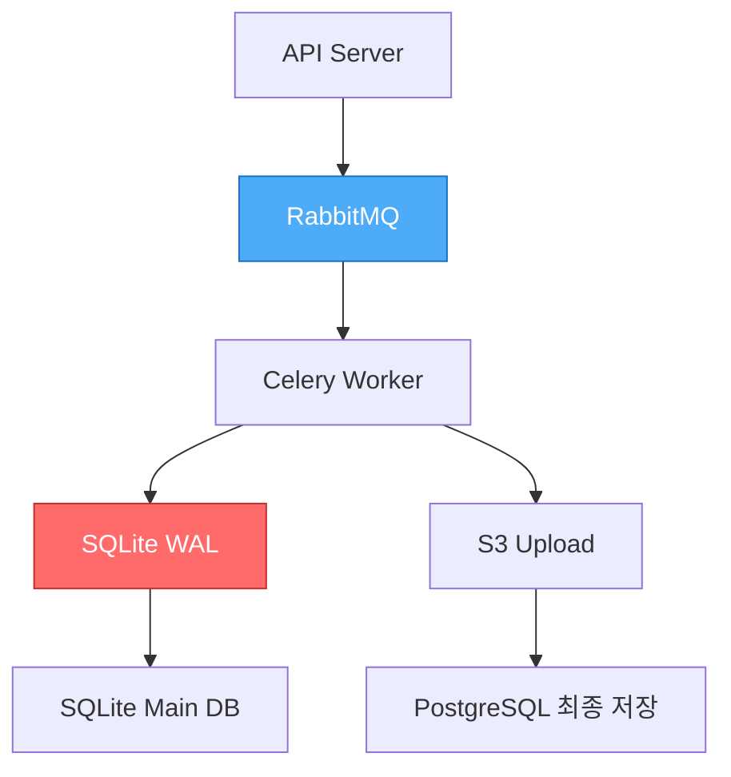

# WAL + MQ 이중 영속화 아키텍처

## 📋 개요

Worker-Storage에서 사용하는 **SQLite WAL(Write-Ahead Logging) + RabbitMQ** 이중 영속화 구조는 비동기 작업의 안정성과 성능을 동시에 달성하기 위한 설계입니다.

---

## 🏗️ 현재 아키텍처

### 전체 흐름



### 데이터 경로

```python
# 1. API 요청 → RabbitMQ
@router.post("/upload")
async def upload_image(file: UploadFile):
    task = image_uploader.delay(file.file.read(), user_id)
    return {"task_id": task.id}

# 2. RabbitMQ → Celery Worker
@celery_app.task(bind=True)
def image_uploader(self, image_data: bytes, user_id: str):
    # 3. SQLite WAL 기록
    local_db.insert(
        task_id=self.request.id,
        status='processing',
        data=image_data
    )
    
    # 4. S3 업로드
    s3_url = upload_to_s3(image_data)
    
    # 5. PostgreSQL 저장
    postgresql.insert(user_id, s3_url)
    
    # 6. WAL 정리
    local_db.delete(task_id=self.request.id)
```

---

## 🎯 이중 영속화의 목적

### 1. RabbitMQ 역할

```yaml
목적: 태스크 큐잉 및 분산

장점:
  ✅ 태스크 분산: 여러 Worker에 균등 분배
  ✅ 우선순위: Priority Queue
  ✅ 재시도: Automatic Retry
  ✅ 비동기: Non-blocking
  ✅ 확인 메커니즘: ACK/NACK

특징:
  - Message Persistence (디스크 저장)
  - Durable Queues
  - Delivery Acknowledgement
```

### 2. SQLite WAL 역할

```yaml
목적: Worker 로컬 작업 추적 및 복구

장점:
  ✅ 빠른 쓰기: 메모리 + 순차 쓰기
  ✅ 트랜잭션: ACID 보장
  ✅ 충돌 방지: 동시 읽기/쓰기
  ✅ 복구 가능: 재시작 후 미완료 작업 재개
  ✅ 로컬 캐시: 네트워크 부하 없음

특징:
  - Write-Ahead Log (쓰기 전 로그 기록)
  - Checkpoint (주기적 Main DB 동기화)
  - Rollback Journal
```

---

## 💾 SQLite WAL 동작 원리

### WAL 모드 vs Rollback Journal

```sql
-- WAL 모드 활성화
PRAGMA journal_mode=WAL;

-- 동시성 향상
PRAGMA synchronous=NORMAL;

-- 체크포인트 설정
PRAGMA wal_autocheckpoint=1000;
```

#### Rollback Journal (기본)

```
1. 쓰기 시작
2. 기존 데이터를 Journal에 백업
3. Main DB에 새 데이터 쓰기
4. Journal 삭제

문제점:
- 쓰기 중 읽기 블로킹
- 느린 성능
```

#### WAL (Write-Ahead Logging)

```
1. 쓰기 시작
2. 새 데이터를 WAL 파일에 추가 (Append-only)
3. 주기적으로 Main DB에 체크포인트
4. 읽기는 Main DB + WAL 병합

장점:
- 쓰기 중에도 읽기 가능
- 순차 쓰기로 빠른 성능
- 동시성 향상
```

### 파일 구조

```bash
/data/worker-storage/
├── tasks.db           # Main Database
├── tasks.db-wal       # Write-Ahead Log (변경사항)
└── tasks.db-shm       # Shared Memory (인덱스)

# WAL 파일 크기 모니터링
ls -lh tasks.db-wal
# → 1000 pages마다 자동 체크포인트
```

---

## 🔄 이중 영속화 시나리오

### 시나리오 1: 정상 처리

```python
# 1. API → RabbitMQ
API: POST /upload → RabbitMQ Queue
  Status: PENDING

# 2. RabbitMQ → Worker
Worker: Task 수신
  RabbitMQ: Message ACK 보류 (아직 확인 안 함)
  
# 3. Worker → SQLite WAL
Worker: 작업 시작
  SQLite WAL: INSERT task_id, status='processing'
  
# 4. Worker → S3 Upload
Worker: S3에 이미지 업로드
  S3: 201 Created
  
# 5. Worker → PostgreSQL
Worker: PostgreSQL에 메타데이터 저장
  PostgreSQL: INSERT user_id, s3_url
  
# 6. Worker → SQLite WAL (정리)
Worker: 작업 완료
  SQLite WAL: DELETE task_id
  
# 7. Worker → RabbitMQ
Worker: RabbitMQ ACK (확인)
  RabbitMQ: Message 삭제

결과: ✅ 성공
```

### 시나리오 2: Worker 중단 (S3 업로드 중)

```python
# 1-3: 동일 (RabbitMQ → Worker → SQLite WAL)

# 4. Worker → S3 Upload
Worker: S3 업로드 중...
  ⚠️ Worker 갑자기 종료 (OOM, Crash 등)

# 5. RabbitMQ 처리
RabbitMQ: ACK 받지 못함
  → Message를 다시 Queue에 추가 (Requeue)
  → Visibility Timeout 후 다른 Worker에 전달

# 6. Worker 재시작
Worker: SQLite WAL 복구
  SQLite: task_id='xxx', status='processing' 발견
  
  옵션 1: WAL 기록 기반 재시도
    → S3 업로드 재시도
    → 성공 시 PostgreSQL 저장
    → SQLite WAL 정리
    → RabbitMQ ACK
  
  옵션 2: WAL 무시, RabbitMQ 메시지 재처리
    → SQLite WAL DELETE (충돌 방지)
    → RabbitMQ 메시지로 새로 시작

결과: ✅ 복구 가능 (이중 보호)
```

### 시나리오 3: Network 장애 (PostgreSQL 저장 실패)

```python
# 1-4: 동일 (S3 업로드 완료)

# 5. Worker → PostgreSQL
Worker: PostgreSQL 연결 시도
  ❌ Network Timeout
  
# 6. Worker → Retry
Celery: 자동 재시도 (max_retries=3)
  Retry 1: 5초 후 재시도
  Retry 2: 10초 후 재시도
  Retry 3: 20초 후 재시도
  
# 7. 모든 재시도 실패
Celery: Dead Letter Queue로 이동
  
# 8. SQLite WAL 유지
SQLite WAL: task_id 유지 (미완료)
  
# 9. 수동 복구 또는 재처리
관리자: SQLite WAL 조회
  → 미완료 작업 확인
  → S3 URL은 존재 (이미 업로드됨)
  → PostgreSQL 재시도

결과: ✅ 데이터 손실 없음 (S3에 저장됨)
```

---

## 📊 장점 vs 단점

### 장점

#### 1. 고가용성 (High Availability)

```yaml
RabbitMQ 장애:
  → SQLite WAL에 작업 기록 유지
  → RabbitMQ 복구 후 재처리

Worker 장애:
  → RabbitMQ가 Message Requeue
  → SQLite WAL로 중복 작업 방지

Network 장애:
  → SQLite WAL에 중간 상태 저장
  → 복구 후 이어서 처리
```

#### 2. 빠른 응답 (Low Latency)

```python
# 동기식 (느림)
API → PostgreSQL 직접 저장
  응답 시간: 200-500ms

# 비동기식 (빠름)
API → RabbitMQ → Worker
  응답 시간: 5-10ms (큐잉만)
  실제 처리: 백그라운드
```

#### 3. 순서 보장 (Ordering)

```yaml
RabbitMQ:
  - FIFO Queue
  - Priority Queue
  - Message Ordering

SQLite WAL:
  - 순차 쓰기
  - 트랜잭션 순서 보장
```

#### 4. 중복 방지 (Idempotency)

```python
# SQLite WAL로 중복 확인
def image_uploader(task_id, image_data):
    # 1. 이미 처리 중인지 확인
    if local_db.exists(task_id):
        logger.warning(f"Task {task_id} already processing")
        return  # 중복 방지
    
    # 2. WAL에 기록
    local_db.insert(task_id, 'processing')
    
    # 3. 실제 작업
    upload_to_s3(image_data)
    
    # 4. 완료 후 정리
    local_db.delete(task_id)
```

### 단점

#### 1. 복잡도 증가

```yaml
관리 대상:
  - RabbitMQ 설정 및 모니터링
  - SQLite WAL 체크포인트
  - 동기화 로직
  - 복구 로직

디버깅:
  - Message가 RabbitMQ에 있나?
  - WAL에 기록되어 있나?
  - 어디서 실패했나?
```

#### 2. 동기화 오버헤드

```python
# 쓰기 경로
1. RabbitMQ에 Message 추가
2. SQLite WAL에 기록
3. 실제 작업 수행
4. PostgreSQL에 저장
5. SQLite WAL 정리
6. RabbitMQ ACK

총 6단계 → 각 단계마다 I/O
```

#### 3. 중복 처리 가능성

```yaml
시나리오:
  1. Worker가 작업 완료
  2. SQLite WAL 정리 완료
  3. RabbitMQ ACK 전에 Worker 종료
  → RabbitMQ가 Message Requeue
  → 다른 Worker가 중복 처리

해결책:
  - 멱등성(Idempotency) 보장
  - PostgreSQL에 unique constraint
  - S3 동일 파일 덮어쓰기
```

#### 4. 디스크 공간 사용

```bash
# WAL 파일 크기
tasks.db: 10MB
tasks.db-wal: 5MB (변경사항)

# 피크 시간대
tasks.db-wal: 50MB (체크포인트 전)

# 디스크 모니터링 필요
```

---

## 🔀 대안 아키텍처

### 대안 1: RabbitMQ만 사용 (단순화)

```yaml
구조:
  API → RabbitMQ (Persistent) → Worker → PostgreSQL

장점:
  ✅ 단순함
  ✅ RabbitMQ Persistence로 충분
  ✅ 관리 부담 감소

단점:
  ❌ Worker 로컬 상태 추적 불가
  ❌ 복구 시 RabbitMQ 의존
  ❌ 중복 방지 어려움

적합한 경우:
  - 작업이 단순
  - 중복 처리 허용 가능
  - RabbitMQ 안정성 높음
```

### 대안 2: PostgreSQL만 사용 (전통적)

```yaml
구조:
  API → PostgreSQL (task table) → Worker Polling

장점:
  ✅ 단순함
  ✅ 중앙 집중 관리
  ✅ SQL 쿼리 활용

단점:
  ❌ Polling 오버헤드
  ❌ 동시성 제한
  ❌ PostgreSQL 부하 증가

적합한 경우:
  - 트래픽 낮음
  - 기존 PostgreSQL 활용
  - 단순한 구조 선호
```

### 대안 3: Kafka (Event Sourcing)

```yaml
구조:
  API → Kafka → Consumer → PostgreSQL

장점:
  ✅ 이벤트 소싱
  ✅ 재생 가능 (Replay)
  ✅ 높은 처리량
  ✅ 분산 처리

단점:
  ❌ Kafka 운영 복잡도
  ❌ 리소스 요구 높음
  ❌ Overkill일 수 있음

적합한 경우:
  - 대규모 트래픽
  - 이벤트 기반 아키텍처
  - 감사(Audit) 필요
```

### 대안 4: Redis Streams (가벼운 MQ)

```yaml
구조:
  API → Redis Streams → Consumer Group → PostgreSQL

장점:
  ✅ Redis 재사용
  ✅ 빠른 성능
  ✅ Consumer Group
  ✅ 메모리 기반

단점:
  ❌ Persistence 약함
  ❌ 메모리 제한
  ❌ 복잡한 라우팅 어려움

적합한 경우:
  - 이미 Redis 사용 중
  - 단순한 큐 필요
  - 메모리 충분
```

---

## 🎯 권장 사항

### 현재 구조 유지 (WAL + MQ) 적합한 경우

```yaml
✅ 다음 조건을 만족하면 현재 구조 권장:

1. 높은 안정성 요구
   - 데이터 손실 최소화
   - 작업 추적 필요

2. 중간 규모 트래픽
   - 초당 100-1000 요청
   - Worker 2-10개

3. 복잡한 작업
   - S3 업로드 + PostgreSQL
   - 여러 단계 작업
   - 재시도 필요

4. 운영 역량
   - RabbitMQ 운영 가능
   - SQLite 관리 가능
```

### 단순화 고려 (RabbitMQ만) 적합한 경우

```yaml
✅ 다음 조건이면 단순화 고려:

1. 낮은 트래픽
   - 초당 10-100 요청
   - Worker 1-2개

2. 단순한 작업
   - 단일 단계
   - 빠른 처리 (< 1초)

3. 멱등성 보장 가능
   - 중복 처리 허용
   - 또는 애플리케이션 레벨 중복 방지

4. 운영 부담 최소화
   - 최소 인프라
   - 단순한 구조 선호
```

---

## 📈 성능 비교

| 항목 | PostgreSQL만 | RabbitMQ만 | WAL + MQ (현재) | Kafka |
|-----|-------------|-----------|----------------|-------|
| 응답 시간 | 200ms | 10ms | 10ms | 5ms |
| 처리량 | 100 TPS | 1,000 TPS | 1,000 TPS | 10,000 TPS |
| 복구 가능 | ✅ | ✅ | ✅✅ | ✅✅✅ |
| 복잡도 | 낮음 | 중간 | 높음 | 매우 높음 |
| 리소스 | 낮음 | 중간 | 중간 | 높음 |
| 운영 난이도 | 쉬움 | 보통 | 어려움 | 매우 어려움 |

---

## 🔧 구현 예시

### Worker-Storage SQLite 초기화

```python
# worker_storage/db.py
import sqlite3
from contextlib import contextmanager

class LocalTaskDB:
    def __init__(self, db_path="/data/tasks.db"):
        self.db_path = db_path
        self._init_db()
    
    def _init_db(self):
        conn = sqlite3.connect(self.db_path)
        
        # WAL 모드 활성화
        conn.execute("PRAGMA journal_mode=WAL")
        conn.execute("PRAGMA synchronous=NORMAL")
        conn.execute("PRAGMA wal_autocheckpoint=1000")
        
        # 테이블 생성
        conn.execute("""
            CREATE TABLE IF NOT EXISTS tasks (
                task_id TEXT PRIMARY KEY,
                status TEXT NOT NULL,
                data BLOB,
                created_at TIMESTAMP DEFAULT CURRENT_TIMESTAMP,
                updated_at TIMESTAMP DEFAULT CURRENT_TIMESTAMP
            )
        """)
        
        # 인덱스
        conn.execute("CREATE INDEX IF NOT EXISTS idx_status ON tasks(status)")
        conn.execute("CREATE INDEX IF NOT EXISTS idx_created_at ON tasks(created_at)")
        
        conn.commit()
        conn.close()
    
    @contextmanager
    def get_conn(self):
        conn = sqlite3.connect(self.db_path)
        try:
            yield conn
            conn.commit()
        except Exception as e:
            conn.rollback()
            raise e
        finally:
            conn.close()
    
    def insert_task(self, task_id: str, status: str, data: bytes = None):
        with self.get_conn() as conn:
            conn.execute(
                "INSERT OR REPLACE INTO tasks (task_id, status, data, updated_at) VALUES (?, ?, ?, CURRENT_TIMESTAMP)",
                (task_id, status, data)
            )
    
    def update_status(self, task_id: str, status: str):
        with self.get_conn() as conn:
            conn.execute(
                "UPDATE tasks SET status = ?, updated_at = CURRENT_TIMESTAMP WHERE task_id = ?",
                (status, task_id)
            )
    
    def delete_task(self, task_id: str):
        with self.get_conn() as conn:
            conn.execute("DELETE FROM tasks WHERE task_id = ?", (task_id,))
    
    def get_pending_tasks(self):
        with self.get_conn() as conn:
            cursor = conn.execute(
                "SELECT task_id, data FROM tasks WHERE status = 'processing' ORDER BY created_at"
            )
            return cursor.fetchall()
    
    def checkpoint(self):
        """수동 체크포인트"""
        with self.get_conn() as conn:
            conn.execute("PRAGMA wal_checkpoint(TRUNCATE)")

# 전역 인스턴스
local_db = LocalTaskDB()
```

### Celery Worker 통합

```python
# worker_storage/tasks.py
from celery import Celery
from .db import local_db
import boto3

celery_app = Celery('worker_storage', broker='amqp://k8s-rabbitmq')

s3_client = boto3.client('s3')

@celery_app.task(bind=True, max_retries=3)
def image_uploader(self, image_data: bytes, user_id: str, filename: str):
    task_id = self.request.id
    
    try:
        # 1. WAL에 기록
        local_db.insert_task(task_id, 'processing', image_data)
        
        # 2. S3 업로드
        s3_key = f"users/{user_id}/{filename}"
        s3_client.put_object(
            Bucket='sesacthon-images',
            Key=s3_key,
            Body=image_data
        )
        
        s3_url = f"https://sesacthon-images.s3.amazonaws.com/{s3_key}"
        
        # 3. PostgreSQL 저장
        # (여기서는 생략)
        
        # 4. WAL 정리
        local_db.delete_task(task_id)
        
        return {"status": "success", "s3_url": s3_url}
        
    except Exception as e:
        # 재시도
        local_db.update_status(task_id, 'failed')
        raise self.retry(exc=e, countdown=5)


@celery_app.task
def recover_pending_tasks():
    """
    Worker 시작 시 미완료 작업 복구
    """
    pending = local_db.get_pending_tasks()
    
    for task_id, data in pending:
        # 재처리
        image_uploader.apply_async(
            args=(data, "unknown", "recovered"),
            task_id=task_id
        )
```

---

## 📝 결론

### 현재 WAL + MQ 구조

```yaml
평가: ✅ 적합

이유:
  1. 높은 안정성 (이중 영속화)
  2. 빠른 응답 (비동기)
  3. 복구 가능 (WAL + MQ)
  4. 중복 방지 (로컬 추적)

트레이드오프:
  - 복잡도 증가 (관리 가능한 수준)
  - 리소스 사용 (Worker당 40GB → 충분)

권장 사항:
  - 현재 구조 유지
  - 모니터링 강화 (WAL 파일 크기, MQ 깊이)
  - 정기적 체크포인트
```

---

**최종 업데이트**: 2025-11-08  
**아키텍처 버전**: v0.6.0 (14-Node)

