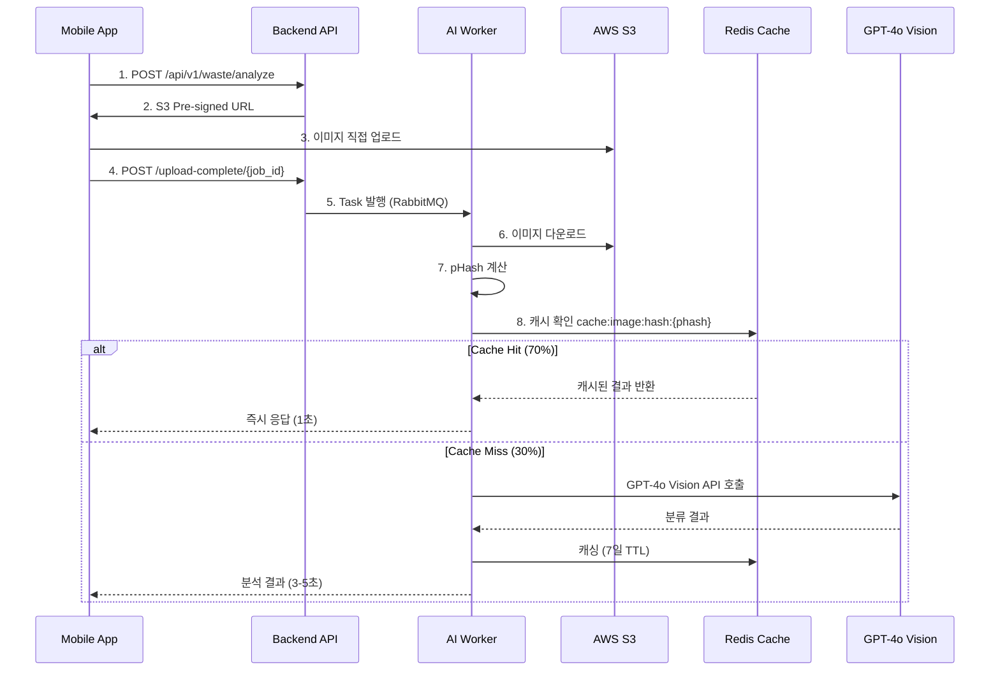
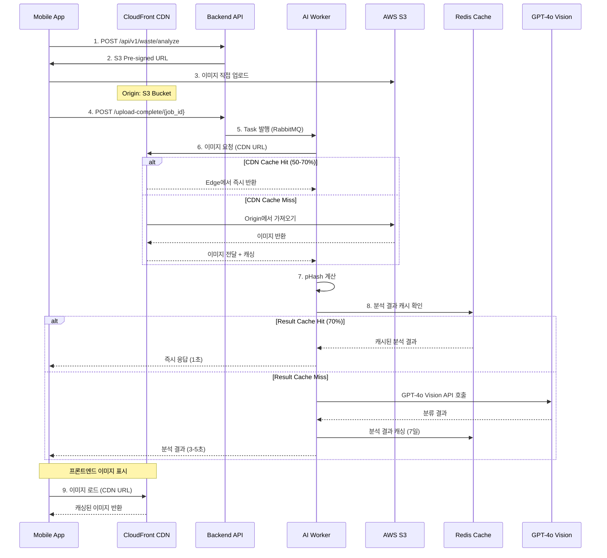

# 🚀 CDN 기반 이미지 캐싱 마이그레이션 분석

> **목적**: Redis 기반 이미지 캐싱을 CloudFront CDN으로 전환  
> **날짜**: 2025-11-06  
> **브랜치**: feature/cdn-image-caching

---

## 📋 목차

1. [현재 구조 분석](#현재-구조-분석)
2. [CDN 전환 이유](#cdn-전환-이유)
3. [아키텍처 변경사항](#아키텍처-변경사항)
4. [구현 계획](#구현-계획)
5. [영향 범위](#영향-범위)

---

## 🔍 현재 구조 분석

### 현재 Redis 기반 이미지 캐싱



### 현재 Redis 캐싱 상세

**위치**: `docs/architecture/image-processing-architecture.md:589-628`

```python
# Redis DB 1: Image Hash Cache (현재 구조)

def analyze_image(job_id):
    # 1. S3에서 이미지 다운로드
    image_path = download_from_s3(f"{job_id}.jpg")
    
    # 2. Perceptual Hash 계산
    img = Image.open(image_path)
    phash = str(imagehash.phash(img, hash_size=16))
    
    # 3. Redis 캐시 확인
    cache_key = f"cache:image:hash:{phash}"
    cached = redis_cache.get(cache_key)  # Redis DB 1
    
    if cached:
        # ✅ 70% 캐시 히트!
        return json.loads(cached)
    
    # 4. 캐시 미스 → AI 분석
    result = await analyze_with_gpt4o_vision(image_path)
    
    # 5. Redis에 결과 캐싱 (7일)
    redis_cache.setex(
        cache_key,
        86400 * 7,  # 7일
        json.dumps(result)
    )
    
    return result

# 효과:
# - 월 10,000 요청 × 70% 캐시 히트 = 7,000회 AI API 절감
# - 비용 절감: $70/월
```

### 문제점

1. **백엔드 부하**: Worker가 매번 S3에서 이미지를 다운로드해야 함
2. **네트워크 비용**: S3 → Worker 데이터 전송 비용
3. **지리적 제약**: 한국 리전에만 최적화 (글로벌 확장 시 느림)
4. **Redis 메모리**: 캐시 결과만 저장 (이미지 자체는 매번 다운로드)
5. **중복 처리**: pHash 계산을 위해 항상 이미지 다운로드 필요

---

## 🎯 CDN 전환 이유

### CloudFront CDN 도입 이점

```
현재 문제:
❌ Worker가 매번 S3에서 이미지 다운로드
❌ 이미지 처리를 위해 네트워크 대역폭 소모
❌ 글로벌 사용자 대응 어려움
❌ Redis 메모리만으로 제한적 캐싱

CDN 도입 후:
✅ Edge Location에서 이미지 자동 캐싱
✅ 전 세계 빠른 이미지 로드 (Edge Network)
✅ S3 데이터 전송 비용 절감
✅ 프론트엔드 이미지 로드 속도 향상
✅ 백엔드 Worker 부하 감소
```

### 비용 비교

**현재 (Redis 캐싱)**
```
월 10,000 요청 기준:
- S3 GET 요청: 10,000회 × $0.0004/1000 = $0.004
- S3 데이터 전송: 10,000 × 2MB × $0.126/GB ≈ $2.52
- Redis 메모리: 10MB (캐시 결과만)
- AI API 비용: 3,000회 × $0.01 = $30
─────────────────────────────────────────
총 비용: ~$32.52/월
```

**CDN 도입 후**
```
월 10,000 요청 기준 (70% CDN 캐시 히트 가정):
- S3 GET 요청: 3,000회 × $0.0004/1000 = $0.0012
- CloudFront 데이터 전송: 10,000 × 2MB × $0.085/GB ≈ $1.70
- CloudFront 요청: 10,000 × $0.0075/10,000 = $0.0075
- AI API 비용: 3,000회 × $0.01 = $30 (동일)
─────────────────────────────────────────
총 비용: ~$31.71/월

절감: $0.81/월 + 성능 향상 + 글로벌 확장성
```

---

## 🏗️ 아키텍처 변경사항

### 새로운 CDN 기반 구조



### 캐싱 계층 분리

```
이전: 단일 Redis 캐싱
├─ Redis DB 1: Image Hash Cache (pHash → AI 결과)
└─ 문제: 이미지 자체는 매번 S3에서 다운로드

이후: 2단계 캐싱
├─ CloudFront: 이미지 파일 캐싱 (Edge Location)
│   └─ TTL: 24시간 (자주 조회되는 이미지)
└─ Redis DB 1: AI 분석 결과 캐싱 (pHash → 결과)
    └─ TTL: 7일 (AI 비용 절감)
```

### 주요 변경점

| 구분 | 현재 (Redis) | 변경 후 (CDN) |
|------|-------------|---------------|
| **이미지 저장** | S3 | S3 (동일) |
| **이미지 캐싱** | ❌ 없음 (매번 다운로드) | ✅ CloudFront Edge |
| **결과 캐싱** | ✅ Redis DB 1 | ✅ Redis DB 1 (동일) |
| **Worker 이미지 액세스** | S3 직접 | CDN 경유 |
| **프론트엔드 이미지 로드** | S3 직접 | CDN 경유 |
| **글로벌 성능** | 한국만 빠름 | 전 세계 빠름 |

---

## 📝 구현 계획

### Phase 1: CloudFront 인프라 구축

#### 1.1 Terraform CloudFront 리소스 생성

**파일**: `terraform/cloudfront.tf` (신규)

```hcl
# CloudFront Distribution for S3 Images
resource "aws_cloudfront_distribution" "images" {
  enabled             = true
  is_ipv6_enabled     = true
  comment             = "CDN for waste analysis images"
  default_root_object = ""
  
  # Origin: S3 Bucket
  origin {
    domain_name = aws_s3_bucket.images.bucket_regional_domain_name
    origin_id   = "S3-${aws_s3_bucket.images.id}"
    
    # OAI (Origin Access Identity) - S3 보안 연결
    s3_origin_config {
      origin_access_identity = aws_cloudfront_origin_access_identity.images.cloudfront_access_identity_path
    }
  }
  
  # Default Cache Behavior
  default_cache_behavior {
    target_origin_id       = "S3-${aws_s3_bucket.images.id}"
    viewer_protocol_policy = "redirect-to-https"
    allowed_methods        = ["GET", "HEAD", "OPTIONS"]
    cached_methods         = ["GET", "HEAD", "OPTIONS"]
    compress               = true
    
    # Managed Cache Policy: Caching Optimized
    cache_policy_id = "658327ea-f89d-4fab-a63d-7e88639e58f6"
    
    # TTL 설정
    min_ttl     = 0
    default_ttl = 86400  # 24시간
    max_ttl     = 604800 # 7일
  }
  
  # Price Class (아시아 + 북미 + 유럽)
  price_class = "PriceClass_200"
  
  # Restrictions (지역 제한 없음)
  restrictions {
    geo_restriction {
      restriction_type = "none"
    }
  }
  
  # SSL Certificate
  viewer_certificate {
    cloudfront_default_certificate = false
    acm_certificate_arn           = aws_acm_certificate.cdn.arn
    ssl_support_method            = "sni-only"
    minimum_protocol_version      = "TLSv1.2_2021"
  }
  
  # Custom Domain
  aliases = ["images.${var.domain_name}"]
  
  tags = {
    Name        = "${var.environment}-images-cdn"
    Environment = var.environment
  }
}

# Origin Access Identity (S3 보안 액세스)
resource "aws_cloudfront_origin_access_identity" "images" {
  comment = "OAI for S3 images bucket"
}

# S3 Bucket Policy (CloudFront만 액세스 허용)
resource "aws_s3_bucket_policy" "images_cdn" {
  bucket = aws_s3_bucket.images.id
  
  policy = jsonencode({
    Version = "2012-10-17"
    Statement = [
      {
        Sid    = "AllowCloudFrontOAI"
        Effect = "Allow"
        Principal = {
          AWS = aws_cloudfront_origin_access_identity.images.iam_arn
        }
        Action   = "s3:GetObject"
        Resource = "${aws_s3_bucket.images.arn}/*"
      }
    ]
  })
}

# ACM Certificate for CloudFront (us-east-1 필수!)
resource "aws_acm_certificate" "cdn" {
  provider          = aws.us_east_1
  domain_name       = "images.${var.domain_name}"
  validation_method = "DNS"
  
  lifecycle {
    create_before_destroy = true
  }
  
  tags = {
    Name = "${var.environment}-images-cdn-cert"
  }
}

# Route53 Record for CDN
resource "aws_route53_record" "cdn" {
  zone_id = data.aws_route53_zone.main.zone_id
  name    = "images.${var.domain_name}"
  type    = "A"
  
  alias {
    name                   = aws_cloudfront_distribution.images.domain_name
    zone_id                = aws_cloudfront_distribution.images.hosted_zone_id
    evaluate_target_health = false
  }
}

# Output
output "cloudfront_distribution_id" {
  value       = aws_cloudfront_distribution.images.id
  description = "CloudFront Distribution ID"
}

output "cloudfront_domain_name" {
  value       = aws_cloudfront_distribution.images.domain_name
  description = "CloudFront Domain Name"
}

output "cdn_images_url" {
  value       = "https://images.${var.domain_name}"
  description = "CDN Images Base URL"
}
```

#### 1.2 Terraform Provider 추가 (us-east-1)

**파일**: `terraform/main.tf` (수정)

CloudFront 인증서는 반드시 `us-east-1` 리전에 생성해야 함

```hcl
# 기존 provider
provider "aws" {
  region = var.aws_region  # ap-northeast-2
  
  default_tags {
    tags = {
      Project     = "SeSACTHON"
      ManagedBy   = "Terraform"
      Environment = var.environment
      Team        = "Backend"
    }
  }
}

# CloudFront 인증서용 provider 추가
provider "aws" {
  alias  = "us_east_1"
  region = "us-east-1"
  
  default_tags {
    tags = {
      Project     = "SeSACTHON"
      ManagedBy   = "Terraform"
      Environment = var.environment
      Team        = "Backend"
    }
  }
}
```

#### 1.3 S3 Bucket Policy 수정

**파일**: `terraform/s3.tf` (수정)

```hcl
# 기존 Public Access Block 유지
# CloudFront OAI만 액세스 허용

# CORS 수정 (CDN 도메인 추가)
resource "aws_s3_bucket_cors_configuration" "images" {
  bucket = aws_s3_bucket.images.id

  cors_rule {
    allowed_headers = ["*"]
    allowed_methods = ["GET", "PUT", "POST", "DELETE", "HEAD"]
    allowed_origins = [
      "https://${var.domain_name}",
      "https://www.${var.domain_name}",
      "https://images.${var.domain_name}",  # CDN 추가
      "http://localhost:3000",
      "http://localhost:5173"
    ]
    expose_headers  = ["ETag"]
    max_age_seconds = 3000
  }
}
```

---

### Phase 2: 백엔드 코드 변경

#### 2.1 환경 변수 추가

**파일**: Backend 저장소 `.env` / Kubernetes ConfigMap

```bash
# S3 설정 (기존)
AWS_REGION=ap-northeast-2
S3_BUCKET_NAME=prod-sesacthon-images

# CDN 설정 (신규)
CDN_ENABLED=true
CDN_BASE_URL=https://images.ecoeco.app
CDN_CACHE_TTL=86400  # 24시간
```

#### 2.2 API 변경 (Pre-signed URL → CDN URL)

**변경 위치**: Backend 저장소 - `waste-service` API

```python
# 이전: S3 Pre-signed URL 직접 반환
@app.post("/api/v1/waste/analyze")
async def create_analysis():
    job_id = str(uuid.uuid4())
    
    # S3 Pre-signed URL (업로드용)
    upload_url = s3.generate_presigned_url(
        'put_object',
        Params={'Bucket': 'images', 'Key': f'{job_id}.jpg'},
        ExpiresIn=300
    )
    
    return {
        "job_id": job_id,
        "upload_url": upload_url
    }

# 변경 후: CDN URL 추가 반환
@app.post("/api/v1/waste/analyze")
async def create_analysis():
    job_id = str(uuid.uuid4())
    
    # S3 Pre-signed URL (업로드용 - 변경 없음)
    upload_url = s3.generate_presigned_url(
        'put_object',
        Params={'Bucket': 'images', 'Key': f'{job_id}.jpg'},
        ExpiresIn=300
    )
    
    # CDN URL (다운로드/표시용 - 신규)
    cdn_url = f"{settings.CDN_BASE_URL}/{job_id}.jpg"
    
    return {
        "job_id": job_id,
        "upload_url": upload_url,  # 프론트엔드 업로드용
        "image_url": cdn_url       # 프론트엔드 표시용 (신규)
    }
```

#### 2.3 Worker 변경 (S3 → CDN 이미지 로드)

**변경 위치**: Backend 저장소 - `workers/vision_worker.py`

```python
# 이전: S3에서 직접 다운로드
def analyze_image(job_id):
    # S3에서 다운로드
    image_path = download_from_s3(f"{job_id}.jpg")
    
    img = Image.open(image_path)
    phash = str(imagehash.phash(img, hash_size=16))
    
    # Redis 캐시 확인
    cache_key = f"cache:image:hash:{phash}"
    cached = redis_cache.get(cache_key)
    
    if cached:
        return json.loads(cached)
    
    # AI 분석...
    result = analyze_with_gpt4o_vision(image_path)
    redis_cache.setex(cache_key, 86400 * 7, json.dumps(result))
    
    return result

def download_from_s3(key):
    """S3에서 이미지 다운로드"""
    s3 = boto3.client('s3')
    local_path = f"/tmp/{key}"
    s3.download_file(settings.S3_BUCKET_NAME, key, local_path)
    return local_path


# 변경 후: CDN에서 이미지 로드
import requests
from io import BytesIO

def analyze_image(job_id):
    # CDN에서 이미지 로드 (HTTP GET)
    image_data = download_from_cdn(job_id)
    
    img = Image.open(BytesIO(image_data))
    phash = str(imagehash.phash(img, hash_size=16))
    
    # Redis 캐시 확인 (변경 없음)
    cache_key = f"cache:image:hash:{phash}"
    cached = redis_cache.get(cache_key)
    
    if cached:
        return json.loads(cached)
    
    # AI 분석 (변경 없음)
    result = analyze_with_gpt4o_vision(image_data)
    redis_cache.setex(cache_key, 86400 * 7, json.dumps(result))
    
    return result

def download_from_cdn(job_id):
    """CDN에서 이미지 다운로드 (HTTP GET)"""
    cdn_url = f"{settings.CDN_BASE_URL}/{job_id}.jpg"
    
    try:
        response = requests.get(cdn_url, timeout=10)
        response.raise_for_status()
        return response.content
    except requests.RequestException as e:
        # CDN 실패 시 S3 Fallback
        logger.warning(f"CDN 로드 실패, S3 Fallback: {e}")
        return download_from_s3_fallback(job_id)

def download_from_s3_fallback(job_id):
    """S3 Fallback (CDN 장애 시)"""
    s3 = boto3.client('s3')
    obj = s3.get_object(Bucket=settings.S3_BUCKET_NAME, Key=f"{job_id}.jpg")
    return obj['Body'].read()
```

#### 2.4 Redis 캐싱 로직 유지

**중요**: Redis DB 1의 AI 분석 결과 캐싱은 그대로 유지

```python
# Redis DB 1: AI 분석 결과 캐싱 (변경 없음!)
# 
# CDN은 이미지 파일만 캐싱
# Redis는 AI 분석 결과(JSON)를 캐싱
# 
# 두 캐싱 계층은 독립적으로 동작

cache_key = f"cache:image:hash:{phash}"  # 유지
redis_cache.setex(cache_key, 86400 * 7, json.dumps(result))  # 유지
```

---

### Phase 3: 프론트엔드 변경

#### 3.1 API 응답 변경 반영

**변경 위치**: Frontend 저장소

```typescript
// 이전: S3 Pre-signed URL 사용
interface AnalysisResponse {
  job_id: string;
  upload_url: string;
}

async function uploadImage(file: File) {
  // 1. 분석 요청
  const response = await fetch('/api/v1/waste/analyze', { method: 'POST' });
  const { job_id, upload_url } = await response.json();
  
  // 2. S3에 업로드
  await fetch(upload_url, {
    method: 'PUT',
    body: file,
  });
  
  // 3. 완료 알림
  await fetch(`/upload-complete/${job_id}`, { method: 'POST' });
  
  return job_id;
}

// 4. 결과 조회 시 이미지 표시
function displayResult(result) {
  // S3 URL을 직접 사용... (비효율!)
}


// 변경 후: CDN URL 사용
interface AnalysisResponse {
  job_id: string;
  upload_url: string;  // S3 업로드용
  image_url: string;   // CDN 표시용 (신규)
}

async function uploadImage(file: File) {
  // 1. 분석 요청
  const response = await fetch('/api/v1/waste/analyze', { method: 'POST' });
  const { job_id, upload_url, image_url } = await response.json();
  
  // 2. S3에 업로드 (변경 없음)
  await fetch(upload_url, {
    method: 'PUT',
    body: file,
  });
  
  // 3. 완료 알림 (변경 없음)
  await fetch(`/upload-complete/${job_id}`, { method: 'POST' });
  
  return { job_id, image_url };  // CDN URL 반환
}

// 4. 결과 조회 시 CDN 이미지 표시
function displayResult(result, imageUrl) {
  // CDN URL 사용 → 빠른 로드!
  return (
    <div>
      
      <p>{result.waste_type}</p>
    </div>
  );
}
```

---

### Phase 4: 모니터링 및 검증

#### 4.1 CloudFront 메트릭 모니터링

**CloudWatch 메트릭**:
- `Requests`: 요청 수
- `BytesDownloaded`: 다운로드된 데이터량
- `CacheHitRate`: 캐시 히트율 (목표: 70%+)
- `4xxErrorRate`, `5xxErrorRate`: 에러율

#### 4.2 비용 모니터링

- CloudFront 비용 (데이터 전송, 요청 수)
- S3 데이터 전송 비용 감소 확인

#### 4.3 성능 측정

```bash
# CDN 성능 테스트
curl -w "@curl-format.txt" -o /dev/null -s https://images.ecoeco.app/test.jpg

# curl-format.txt
time_namelookup:  %{time_namelookup}s\n
time_connect:     %{time_connect}s\n
time_starttransfer: %{time_starttransfer}s\n
time_total:       %{time_total}s\n
```

---

## 🎯 영향 범위

### 인프라 변경

- [x] `terraform/cloudfront.tf` (신규 생성)
- [x] `terraform/main.tf` (provider 추가)
- [x] `terraform/s3.tf` (CORS 수정)
- [x] `terraform/route53.tf` (CDN 레코드 추가)

### 백엔드 변경

#### 확인 필요 (별도 저장소)

- [ ] Backend API: Pre-signed URL 응답에 CDN URL 추가
- [ ] Worker: S3 직접 다운로드 → CDN HTTP GET
- [ ] Worker: Fallback 로직 (CDN 실패 → S3)
- [ ] 환경 변수: `CDN_ENABLED`, `CDN_BASE_URL` 추가

### 프론트엔드 변경

#### 확인 필요 (별도 저장소)

- [ ] API 응답 타입 변경 (`image_url` 필드 추가)
- [ ] 이미지 표시 시 CDN URL 사용

### 문서 변경

- [ ] `docs/architecture/image-processing-architecture.md` (CDN 플로우 추가)
- [ ] `docs/infrastructure/CLUSTER_RESOURCES.md` (CloudFront 추가)
- [ ] `README.md` (아키텍처 다이어그램 업데이트)

---

## 📊 예상 효과

### 성능 개선

```
이미지 로드 시간:
- 현재 (S3 직접): 500-800ms (한국 기준)
- CDN 도입 후: 50-200ms (Edge Cache Hit)
→ 60-75% 개선

글로벌 확장:
- 미국/유럽 사용자: 2-3초 → 200-300ms
- 아시아 사용자: 동일하거나 더 빠름
```

### 비용 영향

```
월 10,000 요청 기준:
- 데이터 전송 비용: -$0.82/월
- CloudFront 비용: +$1.71/월
→ 순증가 +$0.89/월 (3% 증가)

하지만:
✅ 성능 대폭 개선
✅ 글로벌 확장 가능
✅ 사용자 경험 향상
✅ 백엔드 네트워크 부하 감소

→ 트레이드오프 가치 있음!
```

### Redis 영향

```
Redis DB 1: AI 분석 결과 캐싱
- 변경 없음 (70% AI 비용 절감 유지)
- CDN과 독립적으로 동작

이미지 다운로드:
- 현재: S3 직접 (매번 네트워크)
- 변경 후: CDN 경유 (Edge 캐시 활용)
```

---

## ✅ 구현 체크리스트

### Phase 1: Terraform (이 저장소)

- [ ] `terraform/cloudfront.tf` 생성
- [ ] `terraform/main.tf` provider 추가
- [ ] `terraform/s3.tf` CORS 수정
- [ ] `terraform apply` 실행
- [ ] CloudFront DNS 전파 확인 (15-30분)
- [ ] CDN 동작 테스트 (`curl https://images.ecoeco.app/test.jpg`)

### Phase 2: 백엔드 (별도 저장소)

- [ ] API: CDN URL 응답 추가
- [ ] Worker: CDN 이미지 로드 구현
- [ ] Worker: S3 Fallback 구현
- [ ] ConfigMap/Secret: 환경 변수 추가
- [ ] 테스트: 단위/통합 테스트
- [ ] 배포: ArgoCD 동기화

### Phase 3: 프론트엔드 (별도 저장소)

- [ ] API 타입 정의 업데이트
- [ ] CDN URL 사용 구현
- [ ] 테스트: E2E 테스트
- [ ] 배포

### Phase 4: 검증 및 문서

- [ ] CloudFront 메트릭 확인
- [ ] 캐시 히트율 모니터링
- [ ] 비용 추적
- [ ] 문서 업데이트
- [ ] PR 생성 및 리뷰

---

## 📚 참고 문서

- [현재 이미지 처리 아키텍처](docs/architecture/image-processing-architecture.md)
- [Redis 구성](docs/infrastructure/redis-configuration.md)
- [AWS CloudFront 문서](https://docs.aws.amazon.com/cloudfront/)
- [Terraform aws_cloudfront_distribution](https://registry.terraform.io/providers/hashicorp/aws/latest/docs/resources/cloudfront_distribution)

---

## 🚀 다음 단계

1. **이 문서 리뷰 후 승인**
2. **Phase 1 실행**: Terraform CloudFront 배포
3. **백엔드 저장소 확인**: 실제 코드 위치 파악
4. **Phase 2-3 실행**: 백엔드/프론트엔드 변경
5. **Phase 4 실행**: 검증 및 모니터링

---

**작성자**: AI Assistant  
**검토자**: TBD  
**승인자**: TBD

