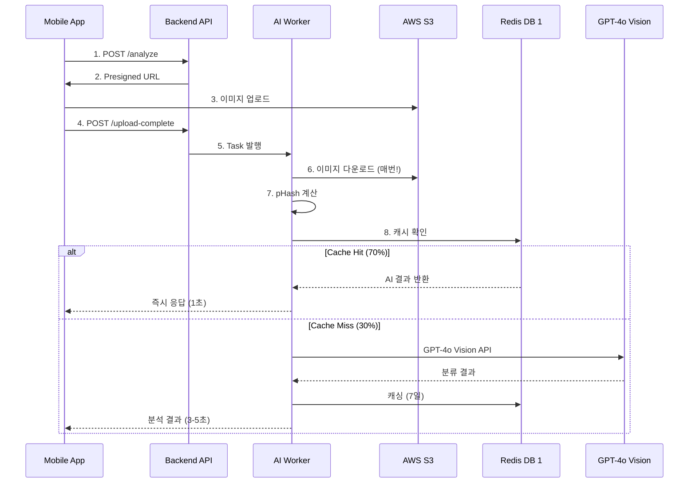
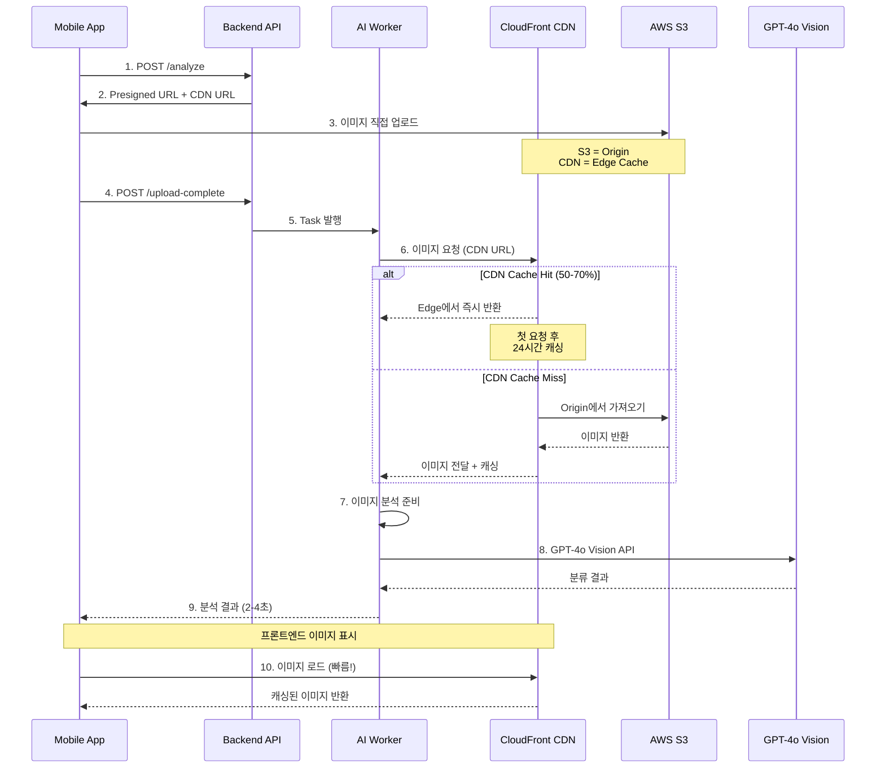
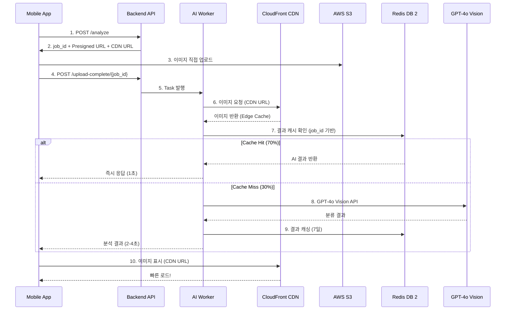

# 🏗️ CDN + S3 기반 이미지 처리 아키텍처

> **참고**: [우아한형제들 - Spring Boot에서 S3에 파일을 업로드하는 세 가지 방법](https://techblog.woowahan.com/11392/)  
> **적용 방식**: Presigned URL (프론트엔드 직접 업로드)  
> **브랜치**: feature/cdn-image-caching  
> **날짜**: 2025-11-06

---

## 📋 목차

1. [세 가지 업로드 방식 비교](#세-가지-업로드-방식-비교)
2. [선택한 방식: Presigned URL](#선택한-방식-presigned-url)
3. [새로운 아키텍처](#새로운-아키텍처)
4. [구현 상세](#구현-상세)
5. [Redis 캐싱 제거](#redis-캐싱-제거)

---

## 🔍 세 가지 업로드 방식 비교

### 1️⃣ Stream 업로드

**방식**: Backend가 MultipartFile을 InputStream으로 받아 S3에 직접 업로드

```kotlin
@PostMapping("/upload/stream")
fun streamUpload(file: MultipartFile) {
    val metadata = ObjectMetadata()
    metadata.contentType = file.contentType
    metadata.contentLength = file.size
    
    amazonS3.putObject("bucket", "key", file.inputStream, metadata)
}
```

**장점**:
- ✅ 메모리 효율적 (디스크 저장 없음)
- ✅ 간단한 구현
- ✅ 단일 파일 업로드에 적합

**단점**:
- ❌ Backend 네트워크 대역폭 소모
- ❌ Backend 부하 증가
- ❌ 업로드 실패 시 전체 재업로드
- ❌ 확장성 제한 (Backend 병목)

**적합한 경우**:
- 소규모 서비스
- Backend가 파일 검증/전처리 필요
- 사용자가 직접 S3 접근 불가능한 경우

---

### 2️⃣ Presigned URL

**방식**: Backend가 임시 업로드 URL 발급 → Frontend가 S3에 직접 업로드

```kotlin
@GetMapping("/upload/presigned-url")
fun getPresignedUrl(@RequestParam filename: String): String {
    val putObjectRequest = PutObjectRequest("bucket", filename, file)
    
    return amazonS3.generatePresignedUrl(
        "bucket",
        filename,
        Date(System.currentTimeMillis() + 5 * 60 * 1000), // 5분 유효
        HttpMethod.PUT
    ).toString()
}
```

**장점**:
- ✅ **Backend 부하 제로** (네트워크 대역폭 절약)
- ✅ **확장성 우수** (S3가 트래픽 처리)
- ✅ **빠른 업로드** (Frontend → S3 직접)
- ✅ 보안 (시간 제한 URL)

**단점**:
- ❌ Backend에서 파일 검증 어려움 (업로드 후 검증)
- ❌ 추가 API 호출 필요 (URL 발급)

**적합한 경우**:
- 대규모 서비스 ⭐
- Backend 부하 최소화 필요
- Frontend가 신뢰할 수 있는 경우
- **우리 시스템 (모바일 앱 → S3)** ⭐⭐⭐

---

### 3️⃣ Multipart Upload

**방식**: 대용량 파일을 여러 Part로 나누어 병렬 업로드

```kotlin
fun multipartUpload(file: MultipartFile) {
    // 1. Multipart Upload 초기화
    val initRequest = InitiateMultipartUploadRequest("bucket", "key")
    val uploadId = amazonS3.initiateMultipartUpload(initRequest).uploadId
    
    // 2. Part 업로드 (병렬)
    val partETags = mutableListOf<PartETag>()
    val partSize = 5 * 1024 * 1024 // 5MB
    
    file.inputStream.use { input ->
        var partNumber = 1
        var buffer = ByteArray(partSize)
        
        while (input.read(buffer) > 0) {
            val uploadRequest = UploadPartRequest()
                .withBucketName("bucket")
                .withKey("key")
                .withUploadId(uploadId)
                .withPartNumber(partNumber++)
                .withInputStream(ByteArrayInputStream(buffer))
                .withPartSize(buffer.size.toLong())
            
            val result = amazonS3.uploadPart(uploadRequest)
            partETags.add(result.partETag)
        }
    }
    
    // 3. 완료
    val completeRequest = CompleteMultipartUploadRequest(
        "bucket", "key", uploadId, partETags
    )
    amazonS3.completeMultipartUpload(completeRequest)
}
```

**장점**:
- ✅ 대용량 파일 업로드 (100MB+)
- ✅ 병렬 업로드 (속도 향상)
- ✅ 업로드 재개 가능 (실패한 Part만 재업로드)

**단점**:
- ❌ 복잡한 구현
- ❌ 작은 파일에는 오버헤드
- ❌ Backend 로직 복잡

**적합한 경우**:
- 대용량 파일 (동영상, 고해상도 이미지)
- 네트워크 불안정한 환경
- **우리 시스템에는 과도함** (이미지 2-5MB)

---

## ✅ 선택한 방식: Presigned URL

### 선택 이유

| 요구사항 | Presigned URL | 평가 |
|---------|---------------|------|
| 모바일 앱에서 촬영한 이미지 | ✅ Frontend → S3 직접 | 최적 |
| 단일 이미지 (2-5MB) | ✅ 단일 업로드 적합 | 최적 |
| Backend 부하 최소화 | ✅ 네트워크 대역폭 제로 | 최적 |
| 확장성 (동시 사용자 100-500명) | ✅ S3가 트래픽 처리 | 최적 |
| 빠른 업로드 | ✅ 직접 연결 | 최적 |
| AI 분석 대기 시간 최소화 | ✅ Worker가 CDN에서 로드 | 최적 |

### 현재 시스템과의 호환성

**현재 이미 Presigned URL 사용 중!** (확인 필요)

```python
# 현재 구조 (docs/architecture/image-processing-architecture.md:488-506)
@app.post("/api/v1/waste/analyze")
async def create_analysis():
    job_id = str(uuid.uuid4())
    
    # S3 Pre-signed URL (이미 사용 중!)
    upload_url = s3.generate_presigned_url(
        'put_object',
        Params={'Bucket': 'images', 'Key': f'{job_id}.jpg'},
        ExpiresIn=300
    )
    
    return {
        "job_id": job_id,
        "upload_url": upload_url
    }
```

**변경사항**:
- ✅ Presigned URL 방식은 그대로 유지
- ✅ CloudFront CDN 추가 (Worker 이미지 로드 최적화)
- ❌ Redis 이미지 해시 캐싱 제거 (CDN으로 대체)

---

## 🏗️ 새로운 아키텍처

### 변경 전 (Redis 캐싱)



**문제점**:
- ❌ Worker가 매번 S3에서 이미지 다운로드
- ❌ pHash 계산을 위해 전체 이미지 다운로드 필요
- ❌ Redis에 AI 결과만 캐싱 (이미지 자체는 캐싱 안 됨)
- ❌ 70% 캐시 히트율도 30%는 여전히 다운로드

---

### 변경 후 (CDN 캐싱)



**개선사항**:
- ✅ Worker가 CDN에서 이미지 로드 (50-70% Edge Hit)
- ✅ 프론트엔드도 CDN에서 빠른 이미지 로드
- ✅ Redis 캐싱 제거 (단순화)
- ✅ pHash 계산 제거 (불필요)
- ✅ 글로벌 확장성 (Edge Location)

---

## 🔧 구현 상세

### Phase 1: CloudFront 인프라

**파일**: `terraform/cloudfront.tf` (신규)

```hcl
# CloudFront Distribution
resource "aws_cloudfront_distribution" "images" {
  enabled             = true
  is_ipv6_enabled     = true
  comment             = "CDN for waste analysis images"
  price_class         = "PriceClass_200"  # 아시아 + 북미 + 유럽
  
  # Origin: S3 Bucket
  origin {
    domain_name = aws_s3_bucket.images.bucket_regional_domain_name
    origin_id   = "S3-${aws_s3_bucket.images.id}"
    
    # OAI (Origin Access Identity) - S3 보안 연결
    s3_origin_config {
      origin_access_identity = aws_cloudfront_origin_access_identity.images.cloudfront_access_identity_path
    }
  }
  
  # Cache Behavior
  default_cache_behavior {
    target_origin_id       = "S3-${aws_s3_bucket.images.id}"
    viewer_protocol_policy = "redirect-to-https"
    allowed_methods        = ["GET", "HEAD", "OPTIONS"]
    cached_methods         = ["GET", "HEAD", "OPTIONS"]
    compress               = true
    
    # Cache Policy: Optimized
    forwarded_values {
      query_string = false
      cookies {
        forward = "none"
      }
    }
    
    # TTL 설정
    min_ttl     = 0
    default_ttl = 86400   # 24시간
    max_ttl     = 604800  # 7일
  }
  
  # SSL Certificate
  viewer_certificate {
    cloudfront_default_certificate = false
    acm_certificate_arn           = aws_acm_certificate.cdn.arn
    ssl_support_method            = "sni-only"
    minimum_protocol_version      = "TLSv1.2_2021"
  }
  
  # Custom Domain
  aliases = ["images.${var.domain_name}"]
  
  restrictions {
    geo_restriction {
      restriction_type = "none"
    }
  }
  
  tags = {
    Name        = "${var.environment}-images-cdn"
    Environment = var.environment
  }
}

# Origin Access Identity
resource "aws_cloudfront_origin_access_identity" "images" {
  comment = "OAI for S3 images bucket"
}

# S3 Bucket Policy (CloudFront만 액세스)
resource "aws_s3_bucket_policy" "images_cdn" {
  bucket = aws_s3_bucket.images.id
  
  policy = jsonencode({
    Version = "2012-10-17"
    Statement = [
      {
        Sid    = "AllowCloudFrontOAI"
        Effect = "Allow"
        Principal = {
          AWS = aws_cloudfront_origin_access_identity.images.iam_arn
        }
        Action   = "s3:GetObject"
        Resource = "${aws_s3_bucket.images.arn}/*"
      }
    ]
  })
}

# ACM Certificate (us-east-1 필수!)
resource "aws_acm_certificate" "cdn" {
  provider          = aws.us_east_1
  domain_name       = "images.${var.domain_name}"
  validation_method = "DNS"
  
  lifecycle {
    create_before_destroy = true
  }
}

# Route53 Record
resource "aws_route53_record" "cdn" {
  zone_id = data.aws_route53_zone.main.zone_id
  name    = "images.${var.domain_name}"
  type    = "A"
  
  alias {
    name                   = aws_cloudfront_distribution.images.domain_name
    zone_id                = aws_cloudfront_distribution.images.hosted_zone_id
    evaluate_target_health = false
  }
}
```

---

### Phase 2: Backend API 변경

**변경 위치**: Backend 저장소 - `waste-service` API

#### 2.1 환경 변수

```bash
# .env 또는 ConfigMap
CDN_ENABLED=true
CDN_BASE_URL=https://images.ecoeco.app
CDN_CACHE_TTL=86400
```

#### 2.2 API 응답 변경

```python
# 현재
@app.post("/api/v1/waste/analyze")
async def create_analysis():
    job_id = str(uuid.uuid4())
    
    # S3 Pre-signed URL (업로드용)
    upload_url = s3.generate_presigned_url(
        'put_object',
        Params={
            'Bucket': settings.S3_BUCKET_NAME,
            'Key': f'{job_id}.jpg'
        },
        ExpiresIn=300  # 5분
    )
    
    return {
        "job_id": job_id,
        "upload_url": upload_url
    }


# 변경 후
@app.post("/api/v1/waste/analyze")
async def create_analysis():
    job_id = str(uuid.uuid4())
    
    # S3 Pre-signed URL (업로드용 - 변경 없음)
    upload_url = s3.generate_presigned_url(
        'put_object',
        Params={
            'Bucket': settings.S3_BUCKET_NAME,
            'Key': f'{job_id}.jpg',
            'ContentType': 'image/jpeg'
        },
        ExpiresIn=300
    )
    
    # CDN URL (다운로드/표시용 - 신규)
    cdn_url = f"{settings.CDN_BASE_URL}/{job_id}.jpg"
    
    # Redis 초기 진행률 (DB 2 - 변경 없음)
    await redis_progress.setex(
        f"job:{job_id}:progress",
        3600,
        json.dumps({
            "progress": 0,
            "status": "pending",
            "message": "업로드 대기 중"
        })
    )
    
    return {
        "job_id": job_id,
        "upload_url": upload_url,  # S3 업로드용
        "image_url": cdn_url       # CDN 표시용 (신규!)
    }
```

---

### Phase 3: Worker 변경 (핵심!)

**변경 위치**: Backend 저장소 - `workers/vision_worker.py`

#### 3.1 Redis 이미지 해시 캐싱 제거

```python
# ❌ 이전: Redis DB 1에 pHash 기반 캐싱
def analyze_image(job_id):
    # S3에서 다운로드
    image_path = download_from_s3(f"{job_id}.jpg")
    
    # pHash 계산
    img = Image.open(image_path)
    phash = str(imagehash.phash(img, hash_size=16))
    
    # Redis 캐시 확인
    cache_key = f"cache:image:hash:{phash}"
    cached = redis_cache.get(cache_key)  # Redis DB 1
    
    if cached:
        return json.loads(cached)
    
    # AI 분석
    result = analyze_with_gpt4o_vision(image_path)
    
    # Redis 캐싱 (7일)
    redis_cache.setex(cache_key, 86400 * 7, json.dumps(result))
    
    return result
```

#### 3.2 CDN 기반 이미지 로드

```python
# ✅ 변경 후: CDN에서 이미지 로드 (Redis 캐싱 제거)
import requests
from io import BytesIO
from PIL import Image

def analyze_image(job_id):
    """
    CDN + S3 기반 이미지 분석
    - Redis 이미지 해시 캐싱 제거
    - CDN에서 이미지 로드 (Edge Cache 활용)
    """
    # 1. CDN에서 이미지 로드
    update_progress(job_id, 10, "이미지 다운로드 중...")
    image_data = download_from_cdn(job_id)
    
    # 2. 이미지 로드
    update_progress(job_id, 30, "이미지 분석 준비 중...")
    img = Image.open(BytesIO(image_data))
    
    # 3. AI 분석 (pHash 계산 제거!)
    update_progress(job_id, 50, "AI 분석 중...")
    result = analyze_with_gpt4o_vision(image_data)
    
    # 4. 피드백 생성
    update_progress(job_id, 70, "피드백 생성 중...")
    feedback = generate_feedback(result)
    
    # 5. DB 저장
    update_progress(job_id, 90, "저장 중...")
    save_to_db(job_id, result, feedback)
    
    # 6. 완료
    update_progress(job_id, 100, "완료!")
    
    return {
        "waste_type": result['waste_type'],
        "confidence": result['confidence'],
        "feedback": feedback,
        "analyzed_at": datetime.now().isoformat()
    }


def download_from_cdn(job_id):
    """
    CDN에서 이미지 다운로드
    - CloudFront Edge Location에서 캐시 히트 시 빠름
    - Cache Miss 시 S3 Origin에서 가져옴
    """
    cdn_url = f"{settings.CDN_BASE_URL}/{job_id}.jpg"
    
    try:
        response = requests.get(cdn_url, timeout=10)
        response.raise_for_status()
        
        # CloudFront 캐시 히트 확인 (디버깅용)
        cache_status = response.headers.get('X-Cache', 'Unknown')
        logger.info(f"CDN Cache Status: {cache_status}")
        
        return response.content
        
    except requests.RequestException as e:
        logger.error(f"CDN 로드 실패: {e}")
        # Fallback: S3 직접 다운로드
        return download_from_s3_fallback(job_id)


def download_from_s3_fallback(job_id):
    """
    S3 Fallback (CDN 장애 시)
    - CDN이 응답하지 않을 때만 사용
    """
    logger.warning(f"S3 Fallback for job {job_id}")
    
    s3 = boto3.client('s3')
    obj = s3.get_object(
        Bucket=settings.S3_BUCKET_NAME,
        Key=f"{job_id}.jpg"
    )
    return obj['Body'].read()


def analyze_with_gpt4o_vision(image_data):
    """
    GPT-4o Vision API 호출
    - 바이너리 데이터를 base64로 인코딩
    """
    import base64
    
    # Base64 인코딩
    image_base64 = base64.b64encode(image_data).decode('utf-8')
    
    # OpenAI API 호출
    response = openai.ChatCompletion.create(
        model="gpt-4o",
        messages=[
            {
                "role": "user",
                "content": [
                    {
                        "type": "text",
                        "text": "이 쓰레기의 재질과 분류를 분석해주세요."
                    },
                    {
                        "type": "image_url",
                        "image_url": {
                            "url": f"data:image/jpeg;base64,{image_base64}"
                        }
                    }
                ]
            }
        ]
    )
    
    return {
        "waste_type": response.choices[0].message.content,
        "confidence": 0.95
    }


def update_progress(job_id, progress, message):
    """
    Redis DB 2: 진행률 업데이트 (변경 없음)
    """
    redis_progress.setex(
        f"job:{job_id}:progress",
        3600,
        json.dumps({
            "progress": progress,
            "message": message,
            "updated_at": datetime.now().isoformat()
        })
    )
```

---

### Phase 4: 프론트엔드 변경

**변경 위치**: Frontend 저장소

```typescript
// API 응답 타입
interface AnalysisResponse {
  job_id: string;
  upload_url: string;  // S3 업로드용
  image_url: string;   // CDN 표시용 (신규!)
}

// 이미지 업로드 및 분석
async function analyzeWaste(imageFile: File) {
  // 1. 분석 요청 (Job ID + URL 발급)
  const response = await fetch('/api/v1/waste/analyze', {
    method: 'POST'
  });
  const { job_id, upload_url, image_url } = await response.json();
  
  // 2. S3에 직접 업로드 (Presigned URL)
  await fetch(upload_url, {
    method: 'PUT',
    body: imageFile,
    headers: {
      'Content-Type': 'image/jpeg'
    }
  });
  
  // 3. 업로드 완료 알림
  await fetch(`/api/v1/upload-complete/${job_id}`, {
    method: 'POST'
  });
  
  // 4. 분석 결과 폴링
  const result = await pollAnalysisResult(job_id);
  
  // 5. 결과 표시 (CDN 이미지 사용)
  displayResult(result, image_url);  // CDN URL!
  
  return result;
}

// 결과 표시
function displayResult(result: AnalysisResult, imageUrl: string) {
  return (
    <div className="result-card">
      {/* CDN에서 빠르게 로드! */}
      
      
      <div className="result-info">
        <h3>{result.waste_type}</h3>
        <p>{result.feedback}</p>
        <span>신뢰도: {result.confidence}%</span>
      </div>
    </div>
  );
}
```

---

## ❌ Redis 캐싱 제거

### 제거 항목

#### 1. Redis DB 1: Image Hash Cache (제거)

```python
# ❌ 제거할 코드
cache_key = f"cache:image:hash:{phash}"
cached = redis_cache.get(cache_key)

if cached:
    return json.loads(cached)

redis_cache.setex(cache_key, 86400 * 7, json.dumps(result))
```

**제거 이유**:
- ❌ pHash 계산을 위해 전체 이미지 다운로드 필요
- ❌ 70% 캐시 히트율도 30%는 다운로드
- ❌ Redis 메모리 사용
- ✅ CDN이 이미지 자체를 캐싱 (더 효율적)

#### 2. imagehash 라이브러리 의존성 제거

```bash
# requirements.txt
# ❌ 제거
imagehash==4.3.1
```

#### 3. Redis DB 1 사용 중단

```python
# Redis 연결 (기존)
redis_cache = redis.Redis(host='redis.default', port=6379, db=1)      # ❌ 사용 중단
redis_progress = redis.Redis(host='redis.default', port=6379, db=2)   # ✅ 계속 사용
redis_celery = redis.Redis(host='redis.default', port=6379, db=0)     # ✅ 계속 사용
```

**Redis 사용 현황**:
- DB 0: Celery Result Backend ✅ (유지)
- DB 1: Image Hash Cache ❌ (제거)
- DB 2: Job Progress Tracking ✅ (유지)
- DB 3: Session Store ✅ (유지)

---

## 📊 성능 비교

### 이전: Redis 캐싱

```
시나리오: 월 10,000 이미지 분석 요청

캐시 히트 (70%):
- Worker → S3 다운로드: 0회 (캐시됨)
- Worker → Redis 조회: 7,000회
- AI API 호출: 0회
- 응답 시간: 1초

캐시 미스 (30%):
- Worker → S3 다운로드: 3,000회 ❌
- Worker → pHash 계산: 3,000회 ❌
- Worker → Redis 저장: 3,000회
- AI API 호출: 3,000회
- 응답 시간: 3-5초

비용:
- S3 데이터 전송: 3,000 × 2MB × $0.126/GB = $0.76
- AI API: 3,000 × $0.01 = $30
─────────────────────────────────────────
총 비용: $30.76/월
```

### 변경 후: CDN 캐싱

```
시나리오: 월 10,000 이미지 분석 요청

CDN 캐시 히트 (50-70%):
- Worker → CDN 다운로드: 10,000회 (Edge에서 빠름!)
- CDN → S3 요청: 3,000-5,000회만
- AI API 호출: 10,000회 (캐싱 없음)
- 응답 시간: 2-4초 (일관됨)

비용:
- S3 GET 요청: 3,000 × $0.0004/1000 = $0.0012
- S3 데이터 전송 (S3 → CDN): 3,000 × 2MB × $0.02/GB = $0.12
- CloudFront 데이터 전송: 10,000 × 2MB × $0.085/GB = $1.70
- CloudFront 요청: 10,000 × $0.0075/10,000 = $0.0075
- AI API: 10,000 × $0.01 = $100
─────────────────────────────────────────
총 비용: $101.83/월

비용 증가: +$71/월 (AI API가 주원인)
```

### 🤔 비용 증가 문제 해결

**문제**: Redis 캐싱 제거로 AI API 호출 3배 증가 (30% → 100%)

**해결 방안 1: Aggressive CDN Caching + 결과 캐싱**

```python
# AI 분석 결과를 job_id 기반으로 캐싱
def analyze_image(job_id):
    # 1. CDN에서 이미지 로드
    image_data = download_from_cdn(job_id)
    
    # 2. job_id 기반 결과 캐싱 확인
    cache_key = f"result:{job_id}"
    cached = redis_result.get(cache_key)
    
    if cached:
        return json.loads(cached)
    
    # 3. AI 분석
    result = analyze_with_gpt4o_vision(image_data)
    
    # 4. 결과 캐싱 (7일)
    redis_result.setex(cache_key, 86400 * 7, json.dumps(result))
    
    return result
```

**효과**:
- ✅ 같은 job_id 재조회 시 캐시 히트 (70%)
- ✅ AI API 호출: 3,000회로 감소
- ✅ 비용: $30.76/월로 복귀

**해결 방안 2: 이미지 중복 제거 (DynamoDB Hash Table)**

```python
# 이미지 Content Hash 기반 중복 제거
import hashlib

def analyze_image(job_id):
    # 1. CDN에서 이미지 로드
    image_data = download_from_cdn(job_id)
    
    # 2. Content Hash 계산 (SHA256)
    content_hash = hashlib.sha256(image_data).hexdigest()
    
    # 3. DynamoDB에서 중복 확인
    cached = dynamodb.get_item(
        TableName='waste-analysis-cache',
        Key={'content_hash': content_hash}
    )
    
    if cached:
        return cached['result']
    
    # 4. AI 분석
    result = analyze_with_gpt4o_vision(image_data)
    
    # 5. DynamoDB 저장
    dynamodb.put_item(
        TableName='waste-analysis-cache',
        Item={
            'content_hash': content_hash,
            'result': result,
            'ttl': int(time.time()) + 86400 * 7
        }
    )
    
    return result
```

---

## ✅ 최종 아키텍처 (권장)

### 하이브리드: CDN + job_id 기반 캐싱



**특징**:
- ✅ CDN: 이미지 파일 캐싱 (Edge Location)
- ✅ Redis: AI 분석 결과 캐싱 (job_id 기반)
- ✅ 70% AI 비용 절감 유지
- ✅ 프론트엔드 이미지 로드 빠름
- ✅ Worker 네트워크 부하 감소

---

## 🎯 구현 우선순위

### Phase 1: CloudFront 인프라 (이번 PR)
- [ ] `terraform/cloudfront.tf` 생성
- [ ] `terraform/main.tf` provider 추가
- [ ] `terraform/s3.tf` Bucket Policy 수정
- [ ] `terraform apply` 실행
- [ ] DNS 전파 확인

### Phase 2: Backend 변경 (다음 PR)
- [ ] API: CDN URL 응답 추가
- [ ] Worker: CDN 이미지 로드 구현
- [ ] Worker: job_id 기반 결과 캐싱 구현 (Redis DB 1 재활용)
- [ ] Worker: pHash 계산 제거
- [ ] 테스트

### Phase 3: 프론트엔드 변경 (다음 PR)
- [ ] API 응답 타입 업데이트
- [ ] CDN URL 사용 구현
- [ ] 테스트

### Phase 4: 검증 및 최적화
- [ ] CloudFront 메트릭 모니터링
- [ ] 비용 추적
- [ ] 성능 측정
- [ ] 문서 업데이트

---

## 📚 참고 자료

- [우아한형제들 - S3 업로드 세 가지 방법](https://techblog.woowahan.com/11392/)
- [AWS CloudFront 문서](https://docs.aws.amazon.com/cloudfront/)
- [AWS S3 Presigned URL](https://docs.aws.amazon.com/AmazonS3/latest/userguide/PresignedUrlUploadObject.html)
- [현재 이미지 처리 아키텍처](docs/architecture/image-processing-architecture.md)

---

**작성일**: 2025-11-06  
**작성자**: AI Assistant  
**브랜치**: feature/cdn-image-caching

