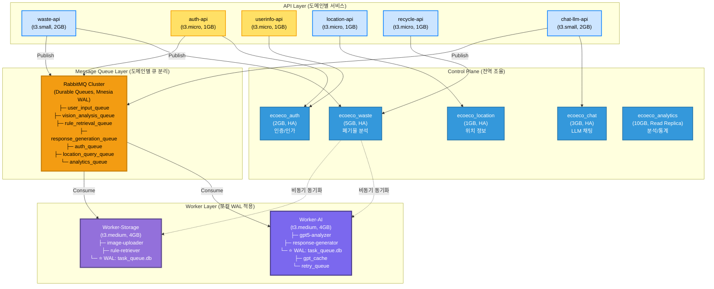
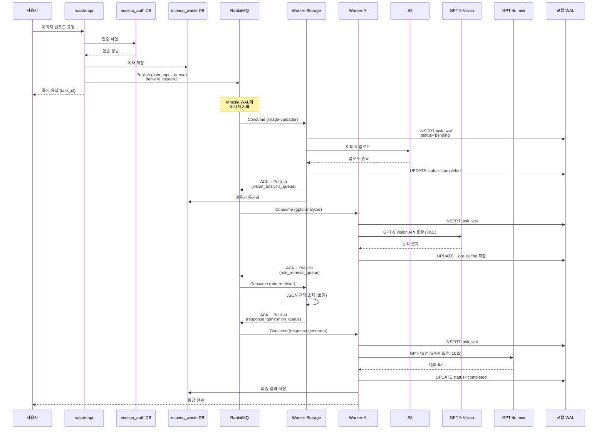
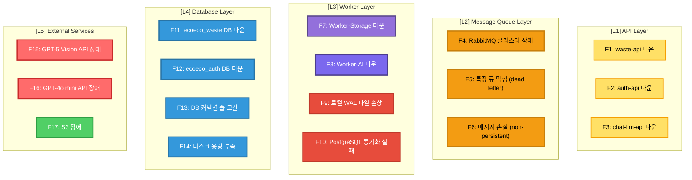

# WAL + 도메인 분리 통합 아키텍처

분석 일시: 2025-11-06
시스템: Ecoeco Backend (13-Node Cluster)
참고: Robin Storage, OStore, PostgreSQL WAL

---

## 🎯 핵심 질문

**"WAL과 도메인 분리를 결합하면 어떤 구조가 나올지, 장애지점은 어떻게 파악할지?"**

---

## 📊 1. 통합 아키텍처 전체 구조



---

## 🔄 2. 데이터 흐름 (전체 시퀀스)

### 2.1 Waste Analysis 요청 흐름



---

## 🚨 3. 장애 지점 분석 및 대응

### 3.1 장애 지점 맵



---

### 3.2 장애별 영향 범위 및 복구 전략

#### F1: waste-api 다운 (도메인별 격리 효과 ✅)

**영향 범위**:
- ❌ 폐기물 분석 API 중단
- ✅ auth-api, chat-llm-api, location-api 정상 운영 (격리됨!)

**감지**:
```python
# Prometheus Alert
- alert: WasteAPIDown
  expr: up{job="waste-api"} == 0
  for: 1m
  annotations:
    summary: "waste-api 다운"
```

**복구 전략**:
1. Kubernetes ReplicaSet 자동 재시작
2. 다른 Pod가 트래픽 인수
3. RabbitMQ 큐에 쌓인 메시지 보존 → 복구 후 처리

---

#### F4: RabbitMQ 클러스터 장애 (WAL 효과 ✅)

**영향 범위**:
- ❌ 새 메시지 발행 불가
- ✅ Worker 로컬 WAL에 미완료 Task 보존
- ✅ 복구 후 자동 재시작

**감지**:
```python
- alert: RabbitMQDown
  expr: rabbitmq_up == 0
  for: 2m
  annotations:
    summary: "RabbitMQ 클러스터 다운"
```

**복구 전략**:
```python
# Worker 시작 시 WAL 복구
class WALRecovery:
    def recover_on_startup(self):
        # 1. RabbitMQ 재연결 대기
        while not rabbitmq_available():
            time.sleep(5)
        
        # 2. 로컬 WAL에서 미완료 Task 조회
        pending = self.conn.execute("""
            SELECT task_id, task_name, payload
            FROM task_wal
            WHERE status IN ('pending', 'running')
            AND created_at > ?
        """, (time.time() - 3600,)).fetchall()  # 1시간 이내
        
        # 3. RabbitMQ로 재발행
        for task_id, task_name, payload in pending:
            rabbitmq_publish(task_name, payload, task_id=task_id)
            
            # WAL에 재발행 표시
            self.conn.execute("""
                UPDATE task_wal
                SET status = 'republished',
                    error = 'Recovered from RabbitMQ outage'
                WHERE task_id = ?
            """, (task_id,))
```

---

#### F7: Worker-Storage 다운 (WAL 복구 ✅)

**영향 범위**:
- ❌ S3 업로드 중단
- ✅ RabbitMQ 큐에 메시지 보존
- ✅ 로컬 WAL에 진행 중 Task 보존

**감지**:
```python
- alert: WorkerStorageDown
  expr: up{job="worker-storage"} == 0
  for: 2m
  annotations:
    summary: "Worker-Storage 다운"
```

**복구 전략**:
```bash
# 1. Kubernetes Pod 재시작
kubectl rollout restart deployment/worker-storage

# 2. Worker 시작 시 자동 실행
# workers/storage/celery_app.py
if __name__ == "__main__":
    # WAL 복구
    recovery = WALRecovery("/var/lib/ecoeco/task_queue.db")
    recovery.recover_on_startup()
    
    # Celery Worker 시작
    app.worker_main()
```

**WAL 복구 로직**:
```python
def recover_on_startup(self):
    # 1. WAL 체크포인트 (WAL → DB 동기화)
    self.conn.execute("PRAGMA wal_checkpoint(FULL)")
    
    # 2. 미완료 Task 조회
    pending = self.conn.execute("""
        SELECT task_id, task_name, payload, created_at
        FROM task_wal
        WHERE status IN ('pending', 'running')
    """).fetchall()
    
    for task_id, task_name, payload, created_at in pending:
        # 타임아웃 체크 (1시간 초과 시 실패 처리)
        if time.time() - created_at > 3600:
            self.conn.execute("""
                UPDATE task_wal
                SET status = 'timeout',
                    error = 'Task timeout during worker restart',
                    completed_at = ?
                WHERE task_id = ?
            """, (int(time.time()), task_id))
            logger.warning(f"Task {task_id} timed out")
        else:
            # RabbitMQ로 재발행
            logger.info(f"Republishing task {task_id}")
            # ... (재발행 로직)
```

---

#### F11: ecoeco_waste DB 다운 (도메인별 격리 ✅)

**영향 범위**:
- ❌ 폐기물 분석 결과 저장 실패
- ✅ ecoeco_auth, ecoeco_chat DB 정상 (격리됨!)
- ✅ Worker WAL에 임시 저장

**감지**:
```python
- alert: WasteDBDown
  expr: pg_up{database="ecoeco_waste"} == 0
  for: 1m
  annotations:
    summary: "ecoeco_waste DB 다운"
```

**복구 전략**:
```python
# Worker에서 PostgreSQL 연결 실패 시
@app.task(bind=True, max_retries=5)
def sync_to_postgres(self, task_id):
    try:
        # PostgreSQL 저장 시도
        with postgres_session('ecoeco_waste') as db:
            task_data = get_from_wal(task_id)
            db.add(TaskLog(**task_data))
            db.commit()
    
    except OperationalError as e:
        # DB 연결 실패
        logger.error(f"PostgreSQL down: {e}")
        
        # WAL에 동기화 실패 표시
        local_wal.conn.execute("""
            UPDATE task_wal
            SET sync_status = 'pending',
                sync_retry_count = sync_retry_count + 1,
                last_sync_attempt = ?
            WHERE task_id = ?
        """, (int(time.time()), task_id))
        
        # 재시도 (Exponential Backoff)
        raise self.retry(exc=e, countdown=60 * (2 ** self.request.retries))
```

**백그라운드 재동기화**:
```python
@app.task
def background_sync_wal_to_postgres():
    """주기적으로 WAL에서 미동기화 Task를 PostgreSQL에 저장"""
    pending_syncs = local_wal.conn.execute("""
        SELECT task_id, task_name, payload, completed_at
        FROM task_wal
        WHERE status = 'completed'
        AND sync_status = 'pending'
        AND sync_retry_count < 10
        ORDER BY completed_at ASC
        LIMIT 100
    """).fetchall()
    
    for task_id, task_name, payload, completed_at in pending_syncs:
        sync_to_postgres.delay(task_id)

# Celery Beat 스케줄
app.conf.beat_schedule = {
    'background-sync': {
        'task': 'background_sync_wal_to_postgres',
        'schedule': 300.0,  # 5분마다
    },
}
```

---

#### F15: GPT-5 Vision API 장애 (외부 서비스)

**영향 범위**:
- ❌ 이미지 분석 중단
- ✅ 다른 도메인 정상 운영
- ✅ WAL에 재시도 큐 보존

**감지**:
```python
- alert: GPT5APIDown
  expr: rate(gpt5_api_errors_total[5m]) > 0.5
  for: 5m
  annotations:
    summary: "GPT-5 Vision API 장애율 높음"
```

**복구 전략**:
```python
# Worker-AI에서 GPT-5 호출 실패 시
@app.task(bind=True, max_retries=10)
def gpt5_analysis_task(self, image_path):
    try:
        # GPT-5 API 호출
        result = call_gpt5_vision_api(image_path)
        
        # WAL 캐시에 저장
        local_wal.conn.execute("""
            INSERT INTO gpt_cache (image_path, response, model, created_at)
            VALUES (?, ?, 'gpt-5', ?)
        """, (image_path, json.dumps(result), int(time.time())))
        
        return result
    
    except GPT5APIError as e:
        logger.error(f"GPT-5 API failed: {e}")
        
        # WAL 재시도 큐에 저장
        local_wal.conn.execute("""
            INSERT INTO retry_queue (task_id, retry_count, error, next_retry_at)
            VALUES (?, ?, ?, ?)
        """, (
            self.request.id,
            self.request.retries,
            str(e),
            int(time.time()) + 60 * (2 ** self.request.retries)
        ))
        
        # Exponential Backoff 재시도
        raise self.retry(
            exc=e,
            countdown=60 * (2 ** self.request.retries),  # 1분, 2분, 4분, 8분, ...
            max_retries=10
        )
```

---

## 🔍 4. 장애 감지 시스템 (통합 모니터링)

### 4.1 Prometheus 메트릭

```yaml
# prometheus.yml
scrape_configs:
  # API Layer
  - job_name: 'api-services'
    kubernetes_sd_configs:
      - role: pod
        namespaces:
          names: ['api']
    relabel_configs:
      - source_labels: [__meta_kubernetes_pod_label_app]
        regex: '(waste|auth|chat)-api'
        action: keep
    metrics_path: /metrics
  
  # Worker Layer
  - job_name: 'celery-workers'
    static_configs:
      - targets:
        - 'worker-storage:9090'
        - 'worker-ai:9090'
  
  # PostgreSQL
  - job_name: 'postgresql'
    static_configs:
      - targets:
        - 'postgresql-exporter:9187'
    relabel_configs:
      - source_labels: [database]
        target_label: domain
  
  # RabbitMQ
  - job_name: 'rabbitmq'
    static_configs:
      - targets: ['rabbitmq:15692']
```

### 4.2 커스텀 메트릭 (Worker WAL 상태)

```python
# workers/storage/metrics.py
from prometheus_client import Counter, Gauge, Histogram

# WAL 메트릭
wal_tasks_total = Counter(
    'wal_tasks_total',
    'Total tasks recorded in WAL',
    ['status', 'task_name']
)

wal_pending_tasks = Gauge(
    'wal_pending_tasks',
    'Current number of pending tasks in WAL'
)

wal_sync_delay = Histogram(
    'wal_sync_delay_seconds',
    'Time delay between task completion and PostgreSQL sync'
)

wal_file_size = Gauge(
    'wal_file_size_bytes',
    'Current size of WAL file'
)

# Task Hook에서 메트릭 업데이트
@task_prerun.connect
def update_wal_metrics_prerun(task_id, task_name, **kwargs):
    wal_tasks_total.labels(status='started', task_name=task_name).inc()
    
    # 현재 pending 수 업데이트
    pending_count = local_wal.conn.execute(
        "SELECT COUNT(*) FROM task_wal WHERE status IN ('pending', 'running')"
    ).fetchone()[0]
    wal_pending_tasks.set(pending_count)

@task_postrun.connect
def update_wal_metrics_postrun(task_id, task_name, **kwargs):
    wal_tasks_total.labels(status='completed', task_name=task_name).inc()
    
    # 동기화 지연 측정
    completed_at = local_wal.conn.execute(
        "SELECT completed_at FROM task_wal WHERE task_id = ?",
        (task_id,)
    ).fetchone()[0]
    
    sync_delay = time.time() - completed_at
    wal_sync_delay.observe(sync_delay)
    
    # WAL 파일 크기
    wal_size = os.path.getsize("/var/lib/ecoeco/task_queue.db-wal")
    wal_file_size.set(wal_size)
```

### 4.3 Grafana 대시보드

```json
{
  "dashboard": {
    "title": "Ecoeco WAL + Domain Architecture",
    "panels": [
      {
        "title": "도메인별 DB 상태",
        "targets": [{
          "expr": "pg_up{database=~\"ecoeco_(auth|waste|chat|location|analytics)\"}"
        }]
      },
      {
        "title": "Worker WAL 상태",
        "targets": [
          {
            "expr": "wal_pending_tasks",
            "legendFormat": "Pending Tasks"
          },
          {
            "expr": "rate(wal_tasks_total[5m])",
            "legendFormat": "Tasks/sec - {{status}}"
          }
        ]
      },
      {
        "title": "WAL 동기화 지연",
        "targets": [{
          "expr": "histogram_quantile(0.95, wal_sync_delay_seconds_bucket)",
          "legendFormat": "P95 Sync Delay"
        }]
      },
      {
        "title": "RabbitMQ 큐 깊이 (도메인별)",
        "targets": [{
          "expr": "rabbitmq_queue_messages{queue=~\".*_queue\"}"
        }]
      },
      {
        "title": "장애 영향 범위",
        "targets": [
          {
            "expr": "up{job=\"api-services\"} == 0",
            "legendFormat": "API Down: {{instance}}"
          },
          {
            "expr": "up{job=\"celery-workers\"} == 0",
            "legendFormat": "Worker Down: {{instance}}"
          }
        ]
      }
    ]
  }
}
```

---

## 🎯 5. 장애 시나리오별 복구 시간 (RTO/RPO)

| 장애 유형 | 영향 범위 | RTO (복구 시간) | RPO (데이터 손실) | 복구 전략 |
|-----------|-----------|-----------------|-------------------|-----------|
| **F1: waste-api 다운** | 폐기물 분석만 | 30초 | 0 (WAL 보존) | K8s 자동 재시작 |
| **F2: auth-api 다운** | 인증만 | 30초 | 0 (WAL 보존) | K8s 자동 재시작 |
| **F4: RabbitMQ 다운** | 새 메시지 발행 불가 | 2분 | 0 (Durable Queue) | 클러스터 재시작 |
| **F7: Worker-Storage 다운** | S3 업로드 중단 | 1분 | 0 (로컬 WAL) | WAL 복구 → 재발행 |
| **F8: Worker-AI 다운** | AI 분석 중단 | 1분 | 0 (로컬 WAL + 캐시) | WAL 복구 → 재발행 |
| **F11: ecoeco_waste DB 다운** | 분석 결과 저장 실패 | 5분 | 0 (Worker WAL) | DB 복구 → WAL 재동기화 |
| **F12: ecoeco_auth DB 다운** | 인증 실패 | 5분 | 0 | DB 복구 |
| **F15: GPT-5 API 장애** | 이미지 분석 중단 | API 복구까지 | 0 (재시도 큐) | Exponential Backoff 재시도 |

**핵심 포인트**:
- ✅ **RTO < 5분**: 모든 장애 유형
- ✅ **RPO = 0**: WAL 덕분에 데이터 손실 없음
- ✅ **도메인 격리**: 한 도메인 장애 → 다른 도메인 정상

---

## 🛠️ 6. 장애 복구 자동화 스크립트

### 6.1 전체 시스템 헬스체크

```bash
#!/bin/bash
# scripts/monitoring/health-check.sh

echo "━━━━━━━━━━━━━━━━━━━━━━━━━━━━━━━━━━━━━━━━"
echo "🔍 Ecoeco 시스템 헬스체크 (WAL + 도메인 분리)"
echo "━━━━━━━━━━━━━━━━━━━━━━━━━━━━━━━━━━━━━━━━"

# 1. PostgreSQL 도메인별 DB 체크
echo ""
echo "1️⃣  PostgreSQL 도메인별 DB 상태"
for db in auth waste chat location analytics; do
    if psql -h postgresql -U postgres -d "ecoeco_${db}" -c "SELECT 1" >/dev/null 2>&1; then
        echo "  ✅ ecoeco_${db}: OK"
    else
        echo "  ❌ ecoeco_${db}: DOWN"
    fi
done

# 2. RabbitMQ 큐 체크
echo ""
echo "2️⃣  RabbitMQ 큐 상태"
rabbitmqctl list_queues name messages consumers | while read queue msgs consumers; do
    if [ "$msgs" -gt 1000 ]; then
        echo "  ⚠️  ${queue}: ${msgs} messages (큐 막힘 의심)"
    else
        echo "  ✅ ${queue}: ${msgs} messages"
    fi
done

# 3. Worker WAL 상태 체크
echo ""
echo "3️⃣  Worker WAL 상태"
for worker in storage ai; do
    wal_db="/var/lib/ecoeco/worker-${worker}/task_queue.db"
    if [ -f "$wal_db" ]; then
        pending=$(sqlite3 "$wal_db" "SELECT COUNT(*) FROM task_wal WHERE status IN ('pending', 'running')")
        echo "  ✅ Worker-${worker}: ${pending} pending tasks"
        
        if [ "$pending" -gt 100 ]; then
            echo "     ⚠️  경고: pending tasks 과다"
        fi
    else
        echo "  ❌ Worker-${worker}: WAL DB 없음"
    fi
done

# 4. API 엔드포인트 체크
echo ""
echo "4️⃣  API 서비스 상태"
for api in waste auth userinfo location recycle-info chat-llm; do
    if curl -sf "http://${api}-api:8000/health" >/dev/null; then
        echo "  ✅ ${api}-api: OK"
    else
        echo "  ❌ ${api}-api: DOWN"
    fi
done

echo ""
echo "━━━━━━━━━━━━━━━━━━━━━━━━━━━━━━━━━━━━━━━━"
```

### 6.2 WAL 자동 복구 스크립트

```bash
#!/bin/bash
# scripts/maintenance/wal-recovery.sh

WORKER_TYPE=$1  # storage or ai
WAL_DB="/var/lib/ecoeco/worker-${WORKER_TYPE}/task_queue.db"

echo "━━━━━━━━━━━━━━━━━━━━━━━━━━━━━━━━━━━━━━━━"
echo "🔄 Worker-${WORKER_TYPE} WAL 복구 시작"
echo "━━━━━━━━━━━━━━━━━━━━━━━━━━━━━━━━━━━━━━━━"

# 1. WAL 체크포인트 (WAL → DB 동기화)
echo ""
echo "1️⃣  WAL 체크포인트 실행..."
sqlite3 "$WAL_DB" "PRAGMA wal_checkpoint(FULL);"
echo "  ✅ 체크포인트 완료"

# 2. 미완료 Task 조회
echo ""
echo "2️⃣  미완료 Task 조회..."
pending_count=$(sqlite3 "$WAL_DB" "SELECT COUNT(*) FROM task_wal WHERE status IN ('pending', 'running')")
echo "  📋 미완료 Task: ${pending_count}개"

if [ "$pending_count" -gt 0 ]; then
    # 3. Task 타임아웃 체크 (1시간 초과)
    echo ""
    echo "3️⃣  타임아웃 Task 처리..."
    timeout_count=$(sqlite3 "$WAL_DB" "
        UPDATE task_wal
        SET status = 'timeout',
            error = 'Task timeout during recovery',
            completed_at = strftime('%s', 'now')
        WHERE status IN ('pending', 'running')
        AND created_at < strftime('%s', 'now') - 3600;
        
        SELECT changes();
    ")
    echo "  ⏰ 타임아웃 처리: ${timeout_count}개"
    
    # 4. 유효한 Task RabbitMQ 재발행
    echo ""
    echo "4️⃣  유효한 Task 재발행..."
    sqlite3 "$WAL_DB" "
        SELECT task_id, task_name, payload
        FROM task_wal
        WHERE status IN ('pending', 'running')
        AND created_at >= strftime('%s', 'now') - 3600
    " | while IFS='|' read task_id task_name payload; do
        echo "  📤 재발행: ${task_name} (${task_id})"
        # Python 스크립트로 RabbitMQ 재발행
        python3 /app/scripts/republish_task.py "$task_id" "$task_name" "$payload"
    done
fi

echo ""
echo "━━━━━━━━━━━━━━━━━━━━━━━━━━━━━━━━━━━━━━━━"
echo "✅ WAL 복구 완료!"
echo "━━━━━━━━━━━━━━━━━━━━━━━━━━━━━━━━━━━━━━━━"
```

---

## 📊 7. 최종 아키텍처 요약

### 핵심 설계 원칙

```
┌─────────────────────────────────────────────────────────────────┐
│ 1. 도메인별 DB 분리 (OStore 교훈)                               │
│    → 장애 격리: waste DB 다운 → auth/chat 정상                 │
│    → 스케일 독립: 트래픽 많은 도메인만 증설                     │
├─────────────────────────────────────────────────────────────────┤
│ 2. RabbitMQ Durable Queue (Mnesia WAL)                          │
│    → 메시지 영속화: 재시작 후 복구                              │
│    → 이중 보장: RabbitMQ + Worker WAL                           │
├─────────────────────────────────────────────────────────────────┤
│ 3. Worker 로컬 SQLite WAL (Robin 방식)                          │
│    → 빠른 기록: 순차 쓰기 (8배 빠름)                            │
│    → 장애 복구: Worker 재시작 시 WAL에서 자동 복구              │
│    → PostgreSQL 독립: DB 장애 시에도 Worker 작동                │
├─────────────────────────────────────────────────────────────────┤
│ 4. 비동기 PostgreSQL 동기화                                     │
│    → 백그라운드 동기화: Worker → PostgreSQL                     │
│    → 재시도 메커니즘: Exponential Backoff                       │
└─────────────────────────────────────────────────────────────────┘
```

### 장애 격리 효과

```
단일 DB 구조 (기존):
  DB 다운 → 전체 서비스 다운 ❌

도메인별 DB + WAL 구조 (개선):
  ecoeco_waste DB 다운
    → waste API 쓰기 실패
    → Worker WAL에 임시 저장 ✅
    → auth/chat/location API 정상 운영 ✅
    → DB 복구 후 WAL 자동 재동기화 ✅
```

### RTO/RPO 보장

```
RTO (Recovery Time Objective)
  - API 장애: 30초 (K8s 자동 재시작)
  - Worker 장애: 1분 (WAL 복구)
  - DB 장애: 5분 (DB 복구 + WAL 재동기화)

RPO (Recovery Point Objective)
  - 모든 장애 유형: 0 (데이터 손실 없음)
  - WAL 덕분에 완벽한 데이터 보존
```

---

**결론**: WAL과 도메인 분리를 결합하면 **장애 격리 + 데이터 보존 + 빠른 복구**를 모두 달성할 수 있습니다! 🎯

