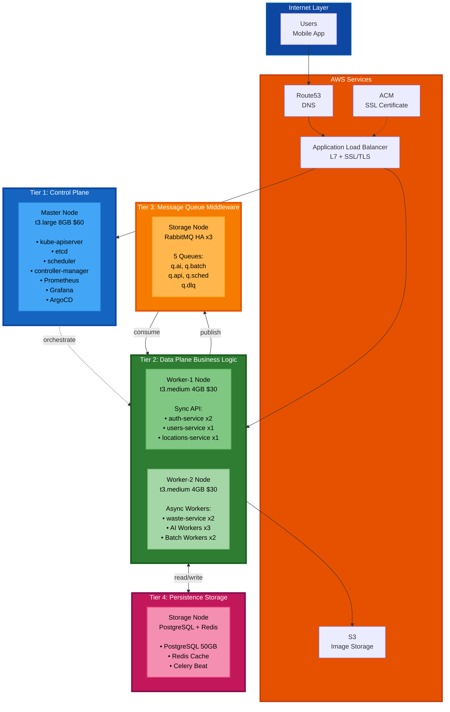

# 🚀 배포 가이드

> **4-Tier Kubernetes 클러스터 자동 배포**  
> **소요 시간**: 40-50분 (완전 자동화)  
> **날짜**: 2025-10-31

## 📋 목차

1. [빠른 시작](#빠른-시작)
2. [4-Tier 아키텍처](#4-tier-아키텍처)
3. [배포 단계](#배포-단계)
4. [검증](#검증)
5. [문제 해결](#문제-해결)

---

## ⚡ 빠른 시작

### 완전 자동 배포 (40-50분)

```bash
cd /Users/mango/workspace/SeSACTHON/backend

# 모든 확인 없이 자동 실행
./scripts/auto-rebuild.sh
```

---

## 🏗️ 4-Tier 아키텍처

### Software Engineering Layered Architecture



### Tier 정의 (Layered Architecture)

```
Tier 1: Control Plane (Orchestration Layer)
━━━━━━━━━━━━━━━━━━━━━━━━━━━━━━━━━━━━━━━━
Physical: Master (t3.large, 8GB, 80GB)
Cost: $60/월

책임 (Responsibility):
├─ Cluster Orchestration (kube-apiserver, scheduler)
├─ Cluster State Management (etcd)
├─ Observability (Prometheus, Grafana)
└─ GitOps (ArgoCD)

관심사 (Concern):
└─ "어떻게 워크로드를 배치하고 관리할 것인가?"

Tier 2: Data Plane (Business Logic Layer)
━━━━━━━━━━━━━━━━━━━━━━━━━━━━━━━━━━━━━━━━
Physical: Worker-1 + Worker-2 (t3.medium ×2, 4GB ×2, 40GB ×2)
Cost: $60/월

책임:
├─ Sync API Processing (Worker-1)
│  ├─ auth-service: OAuth 로그인, JWT 발급
│  ├─ users-service: 프로필, 이력
│  └─ locations-service: 수거함 검색
│
└─ Async Processing (Worker-2)
   ├─ waste-service: 이미지 분석 API
   ├─ AI Workers: GPT-4o Vision 분석
   └─ Batch Workers: 배치 작업

관심사:
└─ "비즈니스 로직을 어떻게 처리할 것인가?"
   (Sync/Async는 구현 세부사항)

Tier 3: Message Queue (Middleware Layer)
━━━━━━━━━━━━━━━━━━━━━━━━━━━━━━━━━━━━━━━━
Physical: Storage (t3.large, 8GB의 일부)
Cost: $60/월 (Tier 4와 공유)

책임:
├─ Message Routing (Topic Exchange)
├─ Delivery Guarantee (Durable Queues)
├─ Queue Management (5 Queues)
└─ High Availability (3-node Cluster)

구성:
└─ RabbitMQ HA ×3 (q.ai, q.batch, q.api, q.sched, q.dlq)

관심사:
└─ "메시지를 어떻게 안전하게 전달할 것인가?"

Tier 4: Persistence (Storage Layer)
━━━━━━━━━━━━━━━━━━━━━━━━━━━━━━━━━━━━━━━━
Physical: Storage (t3.large, 8GB의 일부)
Cost: $60/월 (Tier 3과 공유)

책임:
├─ Data Persistence (PostgreSQL)
├─ Result Backend (Redis)
├─ Caching (Redis)
└─ Scheduled Tasks (Celery Beat)

구성:
├─ PostgreSQL (StatefulSet, 50GB PVC)
├─ Redis (Deployment)
└─ Celery Beat ×1

관심사:
└─ "데이터를 어떻게 영속적으로 저장할 것인가?"

━━━━━━━━━━━━━━━━━━━━━━━━━━━━━━━━━━━━━━━━
노드: 4개 (Master, Worker-1, Worker-2, Storage)
Tier: 4계층 (Control, Data, MQ, Storage)
비용: $185/월 (EC2 $180 + S3 $5)
```

---

## 📦 배포 단계

### Step 1: 자동 배포 실행

```bash
./scripts/auto-rebuild.sh

# 실행 과정:
1. Terraform destroy (5분)
2. Terraform apply (5-10분)
   ✅ VPC, Subnets, Security Groups
   ✅ EC2 4대 (Master, Worker-1, Worker-2, Storage)
   ✅ S3, ACM, Route53, IAM

3. Ansible 대기 (5분)
4. Ansible Playbook (35-40분)
   ✅ Common 설정
   ✅ containerd 설치
   ✅ Kubernetes 설치
   ✅ Master 초기화 (Tier 1)
   ✅ Workers 조인 (Tier 2)
   ✅ Calico VXLAN CNI
   ✅ cert-manager
   ✅ AWS Load Balancer Controller
   ✅ Ingress 리소스
   ✅ RabbitMQ HA (Tier 3)
   ✅ Monitoring (Prometheus, Grafana)
   ✅ etcd 백업

━━━━━━━━━━━━━━━━━━━━━━━━━━━━
총: 40-50분
```

---

## ✅ 검증

### 1. Tier 1 (Control Plane)

```bash
kubectl get nodes
# 4/4 Ready

kubectl get pods -n kube-system
# etcd, apiserver, scheduler, controller-manager: Running

kubectl cluster-info
# Kubernetes control plane is running at https://...
```

### 2. Tier 2 (Data Plane)

```bash
# Sync API (Worker-1)
kubectl get pods -n auth
kubectl get pods -n users
kubectl get pods -n locations

# Async Workers (Worker-2)
kubectl get pods -n waste
# waste-service, ai-worker, batch-worker: Running
```

### 3. Tier 3 (Message Queue)

```bash
kubectl get pods -n messaging
# rabbitmq-0, rabbitmq-1, rabbitmq-2: Running

kubectl exec -n messaging rabbitmq-0 -- \
  rabbitmqctl cluster_status
# 3 nodes in cluster
```

### 4. Tier 4 (Storage)

```bash
kubectl get pods -n default
# postgresql-0: Running
# redis-xxx: Running

kubectl get pvc -n messaging
# rabbitmq-data-rabbitmq-0,1,2: Bound

kubectl get pvc -n default
# postgresql-data: Bound (50Gi)
```

---

## 🎯 4-Tier 장점

### Layered Architecture Benefits

```
1. Separation of Concerns
   ✅ Control (Tier 1)
   ✅ Processing (Tier 2)
   ✅ Messaging (Tier 3)
   ✅ Persistence (Tier 4)

2. Independent Scaling
   ✅ Tier 2 확장: Worker 노드 추가
   ✅ Tier 3 확장: RabbitMQ 클러스터 확장
   ✅ Tier 4 확장: PostgreSQL 읽기 복제본

3. Fault Isolation
   ✅ Tier 3 장애 → Tier 2 계속 작동 (동기 API)
   ✅ Tier 4 장애 → Tier 3 메시지 보존
   ✅ Tier 1 독립 → Control Plane 안정성

4. Clear Dependency
   Tier 1 (Control)
      ↓
   Tier 2 (Business Logic)
      ↓ ↓
   Tier 3   Tier 4
   (MQ)    (Storage)
   
   ✅ Dependency Rule 준수
   ✅ 상위 → 하위만 의존
```

---

## 📚 관련 문서

- [4-Tier 배포 아키텍처](docs/architecture/deployment-architecture-4node.md)
- [Task Queue 설계](docs/architecture/task-queue-design.md) - Tier 3
- [Final K8s Architecture](docs/architecture/final-k8s-architecture.md)
- [VPC 네트워크](docs/infrastructure/vpc-network-design.md)

---

**작성일**: 2025-10-31  
**아키텍처**: 4-Tier Layered Architecture  
**비용**: $185/월  
**노드**: 4개 (Master, Worker-1, Worker-2, Storage)  
**패턴**: Separation of Concerns + Clean Architecture
