# Helm Chart + ArgoCD 자동 배포 구조 요약

## 📦 생성된 파일 목록

### 1. Helm Chart (charts/ecoeco-backend/)

```
charts/ecoeco-backend/
├── Chart.yaml                                  # Chart 메타데이터
├── values.yaml                                 # 전체 설정 값
├── templates/
│   ├── _helpers.tpl                           # 헬퍼 함수
│   ├── api/
│   │   └── waste-deployment.yaml             # Waste API (예시)
│   └── ingress/
│       └── api-ingress.yaml                  # ALB Ingress
└── values-prod.yaml                           # 프로덕션 환경 값 (향후)
```

### 2. ArgoCD Application

```
argocd/
└── application.yaml                           # ArgoCD Application 정의
```

### 3. Terraform (9 노드 구성)

```
terraform/
├── main.tf                                    # ✅ API 노드 2개 추가
├── outputs.tf                                 # ✅ 9 노드 outputs
└── templates/
    └── hosts.tpl                              # ✅ Ansible inventory 템플릿
```

---

## 🔄 자동 배포 프로세스

### 개발자 워크플로우

```mermaid
graph LR
    Dev["`**개발자**`"] --> Code["`**코드 수정**
    waste-api/
    auth-api/ 등`"]
    
    Code --> Push["`**Git Push**
    feature 브랜치`"]
    
    Push --> CI["`**GitHub Actions**
    1. 테스트
    2. Docker Build
    3. GHCR Push`"]
    
    CI --> Tag["`**Image Tag**
    ghcr.io/org/
    waste-api:v1.2.3`"]
    
    Tag --> Update["`**values.yaml 업데이트**
    (자동 또는 수동)`"]
    
    Update --> Git["`**Git Commit**
    main 브랜치`"]
    
    Git --> ArgoCD["`**ArgoCD**
    변경 감지
    (3분마다)`"]
    
    ArgoCD --> Sync["`**Auto Sync**
    Helm Chart 배포`"]
    
    Sync --> K8s["`**Kubernetes**
    Pod 업데이트`"]
    
    style Dev fill:#FFE066,stroke:#F59F00,stroke-width:2px,color:#000
    style CI fill:#7B68EE,stroke:#4B3C8C,stroke-width:3px,color:#fff
    style ArgoCD fill:#F39C12,stroke:#C87F0A,stroke-width:3px,color:#000
    style K8s fill:#4A90E2,stroke:#2E5C8A,stroke-width:3px,color:#fff
```



---

## 🚀 사용 방법

### 1단계: 새 API 서비스 개발 완료

```bash
# 예: auth-api 개발 완료
cd services/auth-api
git add .
git commit -m "feat: Add JWT authentication"
git push origin feature/auth-api
```

### 2단계: CI/CD 파이프라인 (자동)

```yaml
# .github/workflows/api-deploy.yml
name: Deploy API Service

on:
  push:
    branches: [main]
    paths:
      - 'services/**'

jobs:
  build-and-deploy:
    runs-on: ubuntu-latest
    steps:
      - uses: actions/checkout@v3
      
      - name: Docker Build & Push
        run: |
          docker build -t ghcr.io/${{ github.repository }}/auth-api:${{ github.sha }} services/auth-api
          docker push ghcr.io/${{ github.repository }}/auth-api:${{ github.sha }}
      
      - name: Update Helm Chart
        run: |
          # values.yaml의 이미지 태그 업데이트
          sed -i "s|tag: .*|tag: ${{ github.sha }}|" charts/ecoeco-backend/values.yaml
          git commit -am "chore: Update auth-api image tag"
          git push
```

### 3단계: ArgoCD 자동 배포 (자동)

```bash
# ArgoCD가 자동으로:
# 1. Git 변경 감지 (3분마다)
# 2. Helm Chart 렌더링
# 3. Kubernetes에 적용
# 4. Pod Rolling Update

# 상태 확인
kubectl get pods -n api
# auth-api-xxx-old    1/1   Terminating
# auth-api-xxx-new    1/1   Running
```

---

## 📝 values.yaml 수정으로 배포

### 예시 1: Replica 변경

```yaml
# charts/ecoeco-backend/values.yaml

api:
  waste:
    enabled: true
    replicas: 5  # 3 → 5로 변경
```

```bash
git commit -am "scale: Increase waste-api replicas to 5"
git push

# ArgoCD가 자동으로 5개로 확장
```

### 예시 2: 새 서비스 활성화

```yaml
# charts/ecoeco-backend/values.yaml

api:
  newService:
    enabled: true  # false → true
    replicas: 2
    image:
      repository: ghcr.io/org/new-service
      tag: v1.0.0
```

```bash
git commit -am "feat: Enable new-service API"
git push

# ArgoCD가 자동으로 new-service 배포
```

---

## 🏗️ 최종 노드 구성 (9개)

### Terraform + Ansible

```yaml
1. Master (t3.large, 8GB):
   - Control Plane + ArgoCD

2-3. API 노드 (t3.medium, 4GB each):
   - API-1: waste, chat-llm, auth
   - API-2: userinfo, location, recycle-info

4-5. Worker 노드 (t3.medium, 4GB each):
   - Worker-1: image-uploader, rule-retriever, beat
   - Worker-2: gpt5-analyzer, response-generator

6-9. Infrastructure (기존 유지):
   - RabbitMQ, PostgreSQL, Redis, Monitoring
```

### 배포 방법

```bash
# 1. Terraform으로 인프라 생성
cd terraform/
terraform apply

# 2. Ansible로 Kubernetes 설치
cd ../ansible/
ansible-playbook -i inventory/hosts.ini site.yml

# 3. ArgoCD Application 배포
kubectl apply -f argocd/application.yaml

# 4. 완료! 이후 모든 배포는 Git Push만으로 자동화
```

---

## ✅ 장점

### 1. 자동화

```
✅ 코드 푸시 → 자동 빌드 → 자동 배포
✅ values.yaml 수정만으로 설정 변경
✅ ArgoCD가 클러스터 상태 자동 동기화
```

### 2. 확장성

```
✅ 새 서비스 추가: values.yaml에 설정만 추가
✅ Replica 조정: 숫자만 변경
✅ 롤백: Git revert만으로 가능
```

### 3. 안정성

```
✅ Helm Chart 템플릿으로 일관성 유지
✅ ArgoCD가 Desired State 보장
✅ GitOps: 모든 변경사항이 Git에 기록
```

---

**결론**: Helm Chart + ArgoCD로 완전 자동화된 배포 파이프라인 구축 완료! 🎯

