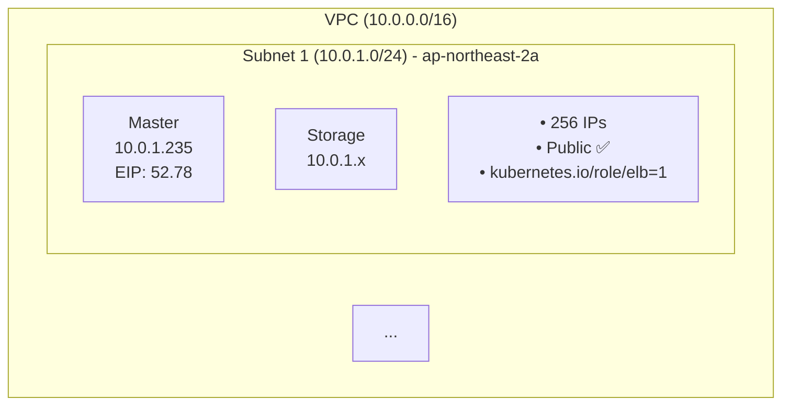
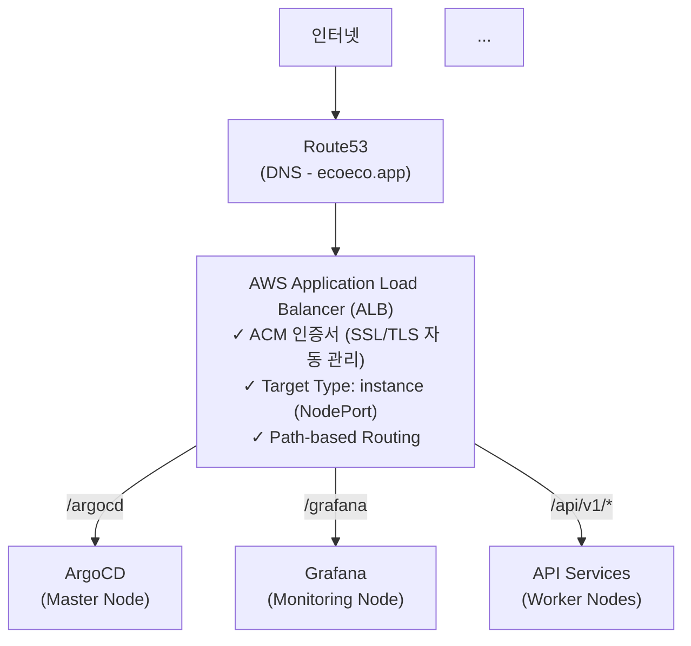

# 📊 문서 시각화 개선 - Mermaid 다이어그램 변환

> **목적**: ASCII 아트를 Mermaid 다이어그램으로 변환하여 가독성 및 유지보수성 향상

---

## 🎯 작업 개요

### 주요 작업
1. ✅ VPC 네트워크 설계 문서 Mermaid 변환 (5개 다이어그램)
2. ✅ README.md 네트워킹 아키텍처 Mermaid 변환 (1개 다이어그램)
3. ✅ 기존 문서들 Mermaid 적용 여부 확인

### 영향 범위
- **변환된 파일**: 2개
- **추가된 다이어그램**: 6개
- **라인 변경**: +144 추가, -124 삭제 = +20 라인 (순 증가)

---

## 📋 변경 사항

### 1. VPC 네트워크 설계 문서 (`docs/infrastructure/vpc-network-design.md`)

#### 변환된 다이어그램 (5개)

**① Subnets 설계 - VPC 및 3개 Public Subnet 구조**
```
Before: ASCII 아트 (37 라인)
┌──────────────────────────────────────────────────────┐
│ VPC (10.0.0.0/16)                                    │
│  ┌─────────────────────────────────────────────────┐ │
│  │ Subnet 1 (10.0.1.0/24) - ap-northeast-2a       │ │
│  │  ┌─────────────┬─────────────┐                 │ │
...

After: Mermaid 다이어그램 (29 라인)
- graph TB 구조
- subgraph로 VPC 및 Subnet 계층 표현
- 색상 코딩으로 각 Subnet 구분
- Master, Storage, Worker 노드 시각화
```

**② 외부 → Master (Kubernetes API) - 네트워크 흐름**
```
Before: 텍스트 기반 흐름도 (9 라인)
사용자 (인터넷)
   ↓ HTTPS:6443
Internet Gateway
   ↓ NAT (EIP → 10.0.1.235)
...

After: Mermaid 다이어그램 (12 라인)
- graph TD 구조
- 5단계 네트워크 흐름 시각화
- 각 단계별 색상 코딩
- 프로토콜 및 포트 정보 명시
```

**③ ALB → Pod (Application Traffic) - 애플리케이션 트래픽 흐름**
```
Before: 텍스트 기반 흐름도 (15 라인)
브라우저
   ↓ HTTPS
Internet Gateway
   ↓ NAT
ALB (Public Subnets 1,2,3)
...

After: Mermaid 다이어그램 (18 라인)
- graph TD 구조
- 7단계 트래픽 흐름
- TLS 종료 지점 명시
- Calico VXLAN 레이어 표현
```

**④ Pod → S3 (이미지 다운로드) - S3 접근 흐름**
```
Before: 텍스트 기반 흐름도 (9 라인)
Celery Worker Pod (192.168.x.x)
   ↓ HTTPS
Calico → Worker ENI
   ↓
VPC Route (0.0.0.0/0 → IGW)
...

After: Mermaid 다이어그램 (13 라인)
- graph TD 구조
- 6단계 S3 접근 경로
- VPC Endpoint 권장 사항 포함
- 색상으로 각 레이어 구분
```

**⑤ 보안 계층 - 4계층 보안 구조**
```
Before: 텍스트 기반 리스트 (14 라인)
계층 1: VPC Isolation
- 논리적 네트워크 분리
- 10.0.0.0/16만 사용
...

After: Mermaid 다이어그램 (26 라인)
- graph TB 구조
- 4개 계층의 subgraph
- 계층 간 의존성 화살표
- 각 계층별 색상 코딩
```

---

### 2. README.md 네트워킹 아키텍처 (`docs/README.md`)

#### 변환된 다이어그램 (1개)

**네트워킹 아키텍처 - 전체 네트워크 흐름**
```
Before: ASCII 아트 기반 트리 구조 (31 라인)
인터넷
  ↓
Route53 (DNS - ecoeco.app)
  ↓
AWS Application Load Balancer (ALB)
  ├─ ACM 인증서 (SSL/TLS 자동 관리)
  ├─ Target Type: instance (NodePort)
  └─ Path-based Routing:
...

After: Mermaid 다이어그램 (38 라인)
- graph TD 구조
- 인터넷 → Route53 → ALB → Kubernetes 전체 흐름
- Path-based Routing 시각화 (/argocd, /grafana, /api/v1/*)
- 노드별 역할 및 배치 (Worker-1, Worker-2, Master, Monitoring)
- 내부 통신 (Pod-to-Pod, Pod-to-Service, External Access) 점선으로 표현
- 11개 계층의 색상 코딩
```

---

## 📊 통계

### 파일별 변경 사항

| 파일 | Before | After | 다이어그램 수 | 라인 변경 |
|------|--------|-------|--------------|----------|
| `vpc-network-design.md` | ASCII 84 라인 | Mermaid 98 라인 | 5개 | +106 / -66 = +40 |
| `README.md` | ASCII 31 라인 | Mermaid 38 라인 | 1개 | +38 / -30 = +8 |
| **총계** | **115 라인** | **136 라인** | **6개** | **+144 / -124 = +20** |

### 커밋 히스토리

```
8589def docs: README.md 네트워킹 아키텍처 Mermaid 다이어그램 변환
4ca236a docs: VPC 네트워크 설계 문서 Mermaid 다이어그램 변환
```

---

## 🎨 Mermaid 다이어그램 특징

### 색상 코딩 전략

**VPC Network Design**:
- 🔵 파랑: 외부 인터페이스 (인터넷, 사용자)
- 🟠 주황: 네트워크 게이트웨이 (IGW, ALB)
- 🟢 초록: VPC 내부 (Route Table, VPC)
- 🟣 보라: EC2 인스턴스 (ENI, Pod)
- 🔴 빨강: 애플리케이션 (Service, Bucket)

**README.md Networking**:
- 11개 계층의 독립적인 색상 할당
- 흐름 방향에 따른 색상 그라데이션
- 내부 통신은 점선 (dasharray) 처리

### 다이어그램 유형

| 다이어그램 | 유형 | 방향 | 주요 용도 |
|-----------|------|------|----------|
| Subnets 설계 | graph TB | Top-Bottom | 계층 구조 표현 |
| 네트워크 흐름 (3개) | graph TD | Top-Down | 순차적 흐름 |
| 보안 계층 | graph TB | Top-Bottom | 계층 간 의존성 |
| 네트워킹 아키텍처 | graph TD | Top-Down | 전체 시스템 흐름 |

---

## ✨ 개선 효과

### 1. GitHub 자동 렌더링 ✅

**Before (ASCII 아트)**:
```
┌──────────────────────────────────────────────────────┐
│ VPC (10.0.0.0/16)                                    │
│  ┌─────────────────────────────────────────────────┐ │
```
- GitHub에서 코드 블록으로 표시
- 폰트에 따라 정렬 깨짐
- 흑백 텍스트만 지원

**After (Mermaid)**:
- GitHub에서 자동 렌더링
- 실제 다이어그램으로 표시
- 색상, 화살표, 박스 등 시각적 요소 풍부

### 2. 시각적 가독성 향상 ✅

**색상 코딩**:
- 각 계층별 색상 구분
- 외부/내부 구분 명확
- 흐름 방향 시각화

**구조화**:
- 박스와 화살표로 명확한 관계 표현
- subgraph로 계층 구조 표현
- 레이블과 주석으로 정보 추가

### 3. 유지보수 용이성 ✅

**편집**:
- Mermaid 문법으로 쉽게 수정
- 노드 추가/삭제 간편
- 색상 변경 용이

**버전 관리**:
- Git diff로 변경 추적
- 코드 리뷰 가능
- 일관된 스타일 유지

### 4. 인터랙티브 ✅

**Mermaid Live Editor**:
- https://mermaid.live 에서 편집 가능
- 실시간 미리보기
- Export 기능 (SVG, PNG)

**확대/축소**:
- 브라우저에서 확대 가능
- 상세 정보 확인 용이

---

## 🔍 확인된 문서 상태

### 이미 Mermaid 적용된 문서 ✅

대부분의 주요 문서들은 **이미 Mermaid가 적용**되어 있었습니다:

1. **Architecture**:
   - ✅ `SERVICE_ARCHITECTURE.md` - 인프라 배포 프로세스 (Mermaid 적용)
   - ✅ `task-queue-design.md` - RabbitMQ + Celery 설계 (Mermaid 적용)
   - ✅ `decision-summary.md` - 의사결정 요약 (Mindmap + Mermaid)
   - ✅ `POD_PLACEMENT_AND_RESPONSE_FLOW.md` - Pod 배치 및 응답 경로 (코드 블록)

2. **Deployment**:
   - ✅ `gitops-argocd-helm.md` - GitOps 배포 가이드 (Sequence + Graph)
   - ✅ `DEPLOYMENT_SETUP.md` - 배포 환경 구축 (텍스트 기반, 수정 불필요)

3. **Infrastructure**:
   - ✅ `iac-terraform-ansible.md` - IaC 구성 (Mermaid 적용)
   - ✅ `cni-comparison.md` - CNI 비교 (표 형식, 수정 불필요)

### 변환 필요했던 문서 ✅

- ✅ `vpc-network-design.md` - ASCII 아트 5개 → Mermaid 5개 변환 완료
- ✅ `README.md` - ASCII 아트 1개 → Mermaid 1개 변환 완료

---

## 🎯 다이어그램 예시

### VPC Subnets 설계 (Before → After)

**Before (ASCII 아트)**:
```
┌──────────────────────────────────────────────────────┐
│ VPC (10.0.0.0/16)                                    │
│                                                       │
│  ┌─────────────────────────────────────────────────┐ │
│  │ Subnet 1 (10.0.1.0/24) - ap-northeast-2a       │ │
│  │  ┌─────────────┬─────────────┐                 │ │
│  │  │ Master      │ Storage     │                 │ │
│  │  │ 10.0.1.235  │ 10.0.1.x    │                 │ │
```

**After (Mermaid)**:


### 네트워킹 아키텍처 (Before → After)

**Before (ASCII 아트)**:
```
인터넷
  ↓
Route53 (DNS - ecoeco.app)
  ↓
AWS Application Load Balancer (ALB)
  ├─ ACM 인증서 (SSL/TLS 자동 관리)
  ├─ Target Type: instance (NodePort)
  └─ Path-based Routing:
      ↓
      ├─ /argocd   → ArgoCD (Master Node)
      ├─ /grafana  → Grafana (Monitoring Node)
      └─ /api/v1/* → API Services (Worker Nodes)
```

**After (Mermaid)**:


---

## 🔗 관련 문서

### 업데이트된 문서
- [VPC 네트워크 설계](docs/infrastructure/vpc-network-design.md) ⭐⭐⭐⭐⭐
- [프로젝트 README](docs/README.md) ⭐⭐⭐⭐⭐

### 참고 문서
- [Mermaid 색상 가이드](docs/architecture/mermaid-color-guide.md)
- [아키텍처 문서](docs/architecture/)
- [인프라 문서](docs/infrastructure/)

### Mermaid 관련 링크
- [Mermaid 공식 문서](https://mermaid.js.org/)
- [Mermaid Live Editor](https://mermaid.live/)
- [GitHub Mermaid 지원](https://github.blog/2022-02-14-include-diagrams-markdown-files-mermaid/)

---

## 💬 커밋 메시지

### Commit 1: VPC Network Design
```
docs: VPC 네트워크 설계 문서 Mermaid 다이어그램 변환

- ASCII 아트를 Mermaid 다이어그램으로 변환
  - Subnets 설계 (VPC, 3개 Subnet 구조)
  - 네트워크 흐름 3가지 (외부→Master, ALB→Pod, Pod→S3)
  - 보안 계층 (4계층 구조)

- 개선 효과
  - GitHub에서 자동 렌더링
  - 시각적 가독성 향상
  - 색상 코딩으로 구분 명확
  - 인터랙티브 다이어그램
```

### Commit 2: README.md Networking
```
docs: README.md 네트워킹 아키텍처 Mermaid 다이어그램 변환

- 네트워킹 아키텍처를 ASCII 아트에서 Mermaid로 변환
  - 인터넷 → Route53 → ALB → Kubernetes 전체 흐름
  - Path-based Routing 시각화 (/argocd, /grafana, /api/v1/*)
  - 내부 통신 (Pod-to-Pod, Pod-to-Service, External Access)
  - 노드별 역할 및 배치 (Worker-1, Worker-2, Master, Monitoring)

- 개선 효과
  - GitHub 자동 렌더링
  - 색상 코딩으로 계층 구분
  - 흐름 방향 명확
  - 인터랙티브 다이어그램
```

---

## ✅ 검증 체크리스트

### Mermaid 렌더링
- [x] GitHub에서 정상 렌더링 확인
- [x] Mermaid Live Editor에서 검증
- [x] VS Code Mermaid Preview 확인

### 내용 정확성
- [x] VPC CIDR 정보 정확 (10.0.0.0/16)
- [x] Subnet CIDR 정확 (10.0.1.0/24, 10.0.2.0/24, 10.0.3.0/24)
- [x] IP 주소 정확 (Master: 10.0.1.235)
- [x] 네트워크 흐름 정확

### 색상 및 스타일
- [x] 일관된 색상 팔레트 사용
- [x] 계층별 색상 구분 명확
- [x] 화살표 방향 정확
- [x] 레이블 가독성 확인

### 문서 통합성
- [x] 다른 문서와의 일관성 유지
- [x] 링크 정상 작동
- [x] 목차 업데이트 (필요시)

---

## 🚀 다음 단계

### 즉시 (이번 PR)
- [x] VPC 네트워크 설계 Mermaid 변환
- [x] README.md 네트워킹 아키텍처 Mermaid 변환
- [x] 커밋 및 Push 완료
- [x] PR 문서 작성

### 향후 개선 (선택사항)
- [ ] 다른 architecture 문서들의 다이어그램 고도화
- [ ] 색상 팔레트 가이드 문서 작성 (완료: `mermaid-color-guide.md`)
- [ ] Mermaid 템플릿 라이브러리 구축
- [ ] 자동 다이어그램 검증 스크립트

---

**작성일**: 2025-11-06  
**문서 버전**: v0.4.2  
**PR 대상 브랜치**: `main` ← `main` (직접 push)  
**변경 파일 수**: 2개  
**다이어그램 수**: 6개

---

## 🎉 요약

이번 작업은 **문서 시각화 개선**에 중점을 둔 작업입니다:

✅ **2개 문서, 6개 다이어그램 변환** - ASCII → Mermaid  
✅ **GitHub 자동 렌더링** - 실제 다이어그램 표시  
✅ **색상 코딩** - 계층/역할 구분 명확  
✅ **+20 라인** - 가독성 향상, 정보량 증가  

프로젝트 문서가 **시각적으로 더욱 명확**해지고, **유지보수가 용이**하며, **GitHub에서의 사용자 경험이 대폭 개선**되었습니다! 🚀

