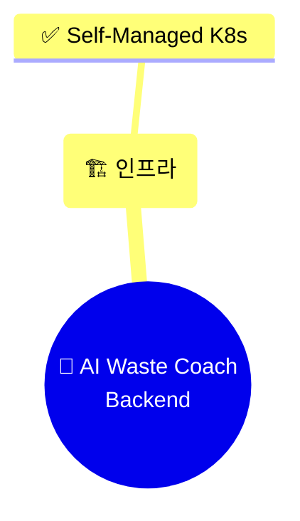

# ♻️ 서비스 이름 변경: "이코에코(Eco²)" 반영 (v0.4.5)

> **목적**: 프로젝트 서비스 이름을 "AI Waste Coach"에서 "♻️ 이코에코(Eco²)"로 변경

---

## 🎯 변경 개요

### 배경
- 서비스 브랜딩 확정: **♻️ 이코에코(Eco²)**
- AI 기반 쓰레기 분류 및 재활용 코칭 서비스
- Eco × Eco = Eco² (경제적 에코 × 환경 에코)

### 목표
1. ✅ 모든 문서에서 서비스 이름 통일
2. ✅ 브랜드 아이덴티티 반영 (♻️ 이모지 포함)
3. ✅ 버전 관리 문서 정확성 개선

---

## 📊 변경 사항

### 📝 업데이트된 문서 (5개)

#### 1. 메인 문서 (`docs/README.md`)

**Before:**
```markdown
# 📚 AI Waste Coach Backend - 문서

> **7-Node Kubernetes 클러스터 프로덕션 인프라**  
> **Terraform + Ansible 완전 자동화 Self-Managed kubeadm 클러스터**
```

**After:**
```markdown
# 📚 ♻️ 이코에코(Eco²) Backend - 문서

> **AI 기반 쓰레기 분류 및 재활용 코칭 서비스**  
> **7-Node Kubernetes 클러스터 프로덕션 인프라**  
> **Terraform + Ansible 완전 자동화 Self-Managed kubeadm 클러스터**
```

#### 2. 프로젝트 개요 (`docs/overview/README.md`)

**Before:**
```markdown
# 📊 프로젝트 개요

> **AI Waste Coach Backend - 7-Node Self-Managed Kubernetes 클러스터**

## 🎯 프로젝트 요약

**AI 기반 쓰레기 분류 및 재활용 코칭 서비스 - 백엔드 API 서버**
```

**After:**
```markdown
# 📊 프로젝트 개요

> **♻️ 이코에코(Eco²) Backend - 7-Node Self-Managed Kubernetes 클러스터**

## 🎯 프로젝트 요약

**♻️ 이코에코(Eco²) - AI 기반 쓰레기 분류 및 재활용 코칭 서비스**
```

#### 3. 아키텍처 의사결정 (`docs/architecture/decision-summary.md`)

**Before:**


**After:**
```mermaid
mindmap
  root((♻️ 이코에코(Eco²)<br/>Backend))
    (🏗️ 인프라)
      ✅ Self-Managed K8s
```

#### 4. 최종 아키텍처 (`docs/architecture/final-k8s-architecture.md`)

**Before:**
```markdown
# 🏗️ 최종 Kubernetes 아키텍처

> **AI Waste Coach Backend - 프로덕션급 K8s 인프라**  
> **최종 업데이트**: 2025-11-05
```

**After:**
```markdown
# 🏗️ 최종 Kubernetes 아키텍처

> **♻️ 이코에코(Eco²) Backend - 프로덕션급 K8s 인프라**  
> **최종 업데이트**: 2025-11-06
```

#### 5. 버전 관리 가이드 (`docs/development/VERSION_GUIDE.md`)

**Before:**
```markdown
## 🎉 주요 기능

- ✅ AI Waste Coach 서비스 정식 배포
```

**After:**
```markdown
## 🎉 주요 기능

- ✅ ♻️ 이코에코(Eco²) 서비스 정식 배포
```

---

## 📂 영향받은 문서

### 업데이트된 파일 (5개)

```
docs/
├─ README.md                              [UPDATED]
├─ overview/
│  └─ README.md                          [UPDATED]
├─ architecture/
│  ├─ decision-summary.md                [UPDATED]
│  └─ final-k8s-architecture.md          [UPDATED]
└─ development/
   └─ VERSION_GUIDE.md                   [UPDATED]
```

### 변경 위치

| 파일 | 변경 라인 | 변경 내용 |
|------|----------|----------|
| `docs/README.md` | 1-5 | 제목 및 서브타이틀 |
| `docs/overview/README.md` | 3, 7 | 프로젝트 개요 |
| `docs/architecture/decision-summary.md` | 30 | Mermaid mindmap 루트 노드 |
| `docs/architecture/final-k8s-architecture.md` | 3-4 | 제목 및 업데이트 날짜 |
| `docs/development/VERSION_GUIDE.md` | 72 | 릴리스 노트 예시 |

---

## 🎨 서비스 브랜딩

### 이코에코(Eco²) 의미

**Eco × Eco = Eco²**

1. **경제적 에코 (Economic Eco)**
   - 재활용을 통한 비용 절감
   - 지속 가능한 소비

2. **환경 에코 (Environmental Eco)**
   - 쓰레기 감량
   - 탄소 배출 저감
   - 자원 순환

### 브랜드 아이덴티티

```
♻️ 이코에코(Eco²)

- 이모지: ♻️ (재활용 심볼)
- 영문 표기: Eco² (Eco Squared)
- 한글 표기: 이코에코
- 태그라인: AI 기반 쓰레기 분류 및 재활용 코칭 서비스
```

---

## 📊 통계

### Git 변경 사항

```
5 files changed
├─ docs/README.md: 3 lines
├─ docs/overview/README.md: 2 lines
├─ docs/architecture/decision-summary.md: 1 line
├─ docs/architecture/final-k8s-architecture.md: 2 lines
└─ docs/development/VERSION_GUIDE.md: 1 line

Total: 9 lines changed (minor updates)
```

### 검색 가능한 변경

**Before (검색어):**
- "AI Waste Coach" (5개 위치)
- "AI 기반 쓰레기 분류" (2개 위치)

**After (검색어):**
- "♻️ 이코에코(Eco²)" (5개 위치)
- "AI 기반 쓰레기 분류 및 재활용 코칭 서비스" (통일된 설명)

---

## ✅ 체크리스트

### 문서 업데이트
- [x] 메인 README 업데이트
- [x] 프로젝트 개요 업데이트
- [x] 아키텍처 문서 업데이트
- [x] 버전 관리 가이드 업데이트
- [x] 모든 변경사항 일관성 확인

### 일관성 검증
- [x] 서비스 이름 표기 통일 (♻️ 이코에코(Eco²))
- [x] 영문 표기 일관성 (Eco²)
- [x] 이모지 사용 일관성 (♻️)
- [x] 서비스 설명 통일

### 기술적 검증
- [x] Mermaid 다이어그램 렌더링 확인
- [x] Markdown 문법 검증
- [x] 링크 정상 작동 확인

---

## 🔄 추가 작업 필요 (향후)

### 코드베이스 업데이트 (별도 PR)
- [ ] `services/` 디렉토리의 주석 및 docstring
- [ ] API 응답 메시지
- [ ] 로그 메시지
- [ ] 환경 변수 설명

### 인프라 업데이트 (별도 PR)
- [ ] Helm Chart 메타데이터
- [ ] Kubernetes 리소스 labels/annotations
- [ ] ArgoCD Application 이름
- [ ] Grafana 대시보드 제목

### 외부 리소스 (수동 업데이트)
- [ ] GitHub Repository Description
- [ ] README.md (루트)
- [ ] 도메인/DNS 설정 검토
- [ ] 모니터링 알림 메시지

---

## 📝 변경 이유

### 1. 브랜딩 통일
- 서비스 이름이 확정되어 문서 전체 통일 필요
- 사용자 대면 브랜드 아이덴티티 구축

### 2. 검색 가능성 향상
- "이코에코" 키워드로 검색 가능
- "Eco²" 영문 표기로 국제화 대응

### 3. 전문성 향상
- 명확한 브랜드 이름
- 일관된 문서 품질

---

## 🚀 배포 영향

### 영향 없음 ✅
- **코드 변경 없음**: 문서만 수정
- **인프라 변경 없음**: 배포 불필요
- **API 변경 없음**: 호환성 유지
- **설정 변경 없음**: 재시작 불필요

### 문서 전용 변경
- 문서 사이트 업데이트만 필요
- Git 히스토리에 브랜드 변경 기록
- 검색 엔진 인덱싱 대응

---

## 📚 관련 문서

### 업데이트된 문서
- [메인 문서](docs/README.md) ⭐⭐⭐⭐⭐
- [프로젝트 개요](docs/overview/README.md) ⭐⭐⭐⭐⭐
- [아키텍처 의사결정](docs/architecture/decision-summary.md) ⭐⭐⭐⭐
- [최종 아키텍처](docs/architecture/final-k8s-architecture.md) ⭐⭐⭐⭐⭐
- [버전 관리 가이드](docs/development/VERSION_GUIDE.md) ⭐⭐⭐⭐

### 참고 문서
- [문서 재구성 PR #17](https://github.com/SeSACTHON/backend/pull/17)

---

## 💬 커밋 메시지

```
docs: 서비스 이름을 "♻️ 이코에코(Eco²)"로 변경 (v0.4.5)

- 프로젝트 브랜딩 확정에 따른 문서 업데이트
  - "AI Waste Coach" → "♻️ 이코에코(Eco²)"
  - 일관된 서비스 설명 적용
  - 브랜드 아이덴티티 강화

- 변경 파일 (5개)
  - docs/README.md: 메인 제목 및 서브타이틀
  - docs/overview/README.md: 프로젝트 요약
  - docs/architecture/decision-summary.md: Mermaid mindmap
  - docs/architecture/final-k8s-architecture.md: 아키텍처 제목
  - docs/development/VERSION_GUIDE.md: 릴리스 노트 예시

- 개선 효과
  - 브랜드 통일성 확보
  - 검색 가능성 향상 ("이코에코", "Eco²")
  - 전문성 및 일관성 강화
  - 사용자 인지도 개선

- 영향 범위
  - 문서 전용 변경 (코드 변경 없음)
  - 배포 불필요
  - API 호환성 유지
```

---

**작성일**: 2025-11-06  
**문서 버전**: v0.4.5  
**PR 대상 브랜치**: `main` ← `docs/cleanup-analysis`  
**변경 파일 수**: 5개 (문서만)  
**서비스 이름**: ♻️ 이코에코(Eco²)

---

## 🎉 요약

이번 작업은 **서비스 브랜딩 확정**에 따른 문서 업데이트입니다:

✅ **5개 문서 업데이트** - 서비스 이름 통일  
✅ **브랜드 아이덴티티** - ♻️ 이코에코(Eco²)  
✅ **일관성 확보** - 모든 문서에서 동일한 표기  
✅ **영향 최소화** - 문서 전용 변경, 코드 변경 없음  

프로젝트가 **명확한 브랜드 아이덴티티**를 갖추게 되었고, **문서 품질과 일관성**이 향상되었습니다! 🚀

---

## ♻️ 이코에코(Eco²)란?

**Eco × Eco = Eco²**

경제적 에코와 환경 에코가 만나, AI 기술로 쓰레기 분류와 재활용을 돕는 혁신적인 서비스입니다.

> "지구를 위한 작은 실천, 이코에코가 함께합니다!"

