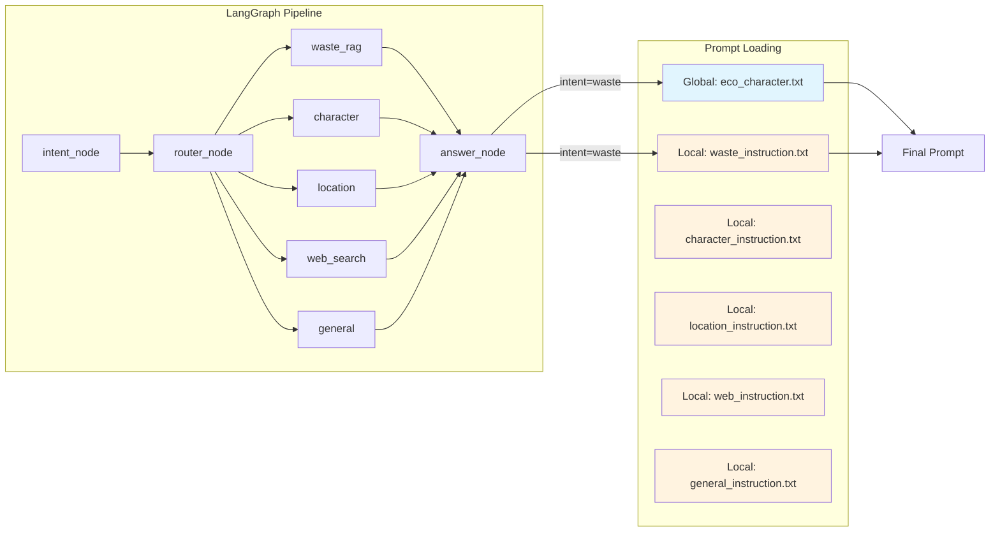

# 이코에코(Eco²) Agent #10: Local Prompt Optimization

> Chat Worker 프롬프트 전략 — Global + Local 분리 패턴 적용

| 항목      | 값          |
| ------- | ---------- |
| **작성일** | 2026-01-14 |
| **커밋**  | 269e070b   |

---

## 1. 개요

### 1.1 문제 상황: 단일 통합 프롬프트의 한계

기존 `answer_node`는 하나의 거대한 시스템 프롬프트를 모든 Intent에 사용했습니다:

```python
# AS-IS: 단일 통합 프롬프트
ANSWER_SYSTEM_PROMPT = """
너는 이코야, Eco² 앱의 분리배출 도우미.
친근하게 대화하고...
분리배출은 이렇게 답변하고...
캐릭터는 이렇게 답변하고...
위치는 이렇게 답변하고...
일반 질문은 이렇게...
"""
```

**문제점:**
- **비대한 프롬프트**: Intent가 늘어날수록 프롬프트가 비대해짐
- **간섭 현상**: 특정 Intent 최적화 시 다른 Intent에 영향
- **유지보수 어려움**: 어떤 부분을 수정해야 할지 파악 어려움
- **테스트 곤란**: 특정 시나리오 테스트가 어려움

### 1.2 해결 방안: Local Prompt Optimization

**arxiv:2504.20355** 논문의 패턴을 적용하여 프롬프트를 분리했습니다:

```
┌────────────────────────────────────────────────────────────┐
│                   GLOBAL PROMPT (고정)                     │
│    "이코" 캐릭터 정의, 톤, 공통 규칙                         │
│    - 모든 Intent에서 공유                                   │
│    - 변경 시 전체에 영향                                    │
└────────────────────────────────────────────────────────────┘
                            │
                            ▼
┌──────────┬──────────┬──────────┬──────────┬──────────┐
│  WASTE   │  CHAR    │ LOCATION │   WEB    │ GENERAL  │
│ INSTRUCT │ INSTRUCT │ INSTRUCT │ INSTRUCT │ INSTRUCT │
│          │          │          │          │          │
│ RAG 활용 │ 캐릭터   │ 위치     │ 출처 명시│ 환경 연결│
│ 방법     │ 소개 방식│ 안내 방식│ 방법     │ 유도     │
└──────────┴──────────┴──────────┴──────────┴──────────┘
                            │
                            ▼
┌────────────────────────────────────────────────────────────┐
│                      FINAL PROMPT                          │
│               = GLOBAL + "---" + LOCAL[intent]             │
└────────────────────────────────────────────────────────────┘
```

---

## 2. 아키텍처

### 2.1 디렉토리 구조

```
apps/chat_worker/infrastructure/assets/prompts/
├── global/                          # 캐릭터 정의 (모든 Intent 공통)
│   └── eco_character.txt            # "이코" 페르소나
├── local/                           # Intent별 Answer 지침
│   ├── waste_instruction.txt        # 분리배출 답변 지침
│   ├── character_instruction.txt    # 캐릭터 답변 지침
│   ├── location_instruction.txt     # 위치 답변 지침
│   ├── web_instruction.txt          # 웹 검색 답변 지침
│   └── general_instruction.txt      # 일반 대화 지침
├── classification/                  # 분류 프롬프트
│   ├── intent.txt                   # Intent 분류
│   ├── text.txt                     # 텍스트 분류
│   └── vision.txt                   # Vision 분류
└── subagent/                        # 서브에이전트 프롬프트
    ├── character.txt
    └── location.txt
```

### 2.2 프롬프트 흐름



---

## 3. 구현

### 3.1 Global 프롬프트

`global/eco_character.txt` — 모든 Intent에서 공유하는 캐릭터 정의:

```markdown
# Identity
너는 "이코"야, Eco² 앱의 친절한 분리배출 도우미.

# Personality
- 친근하고 따뜻한 말투
- 환경 보호에 열정적이지만 강요하지 않아
- 사용자에게 긍정적인 경험 제공
- 어려운 용어 대신 쉬운 표현 사용

# Common Rules
1. 항상 친절하고 긍정적인 태도를 유지해.
2. 사용자의 질문에 직접적으로 답변하되, 필요시 추가 정보 제공.
3. 모르는 내용은 솔직하게 모른다고 말해.
4. 답변은 간결하고 명확하게 구성해.
5. Markdown 서식을 적절히 활용하여 가독성을 높여.
6. JSON 형식으로 출력하지 마.
```

### 3.2 Local 프롬프트 예시

`local/waste_instruction.txt` — 분리배출 Intent 전용:

```markdown
# Waste Disposal Instructions

## Context Utilization
- `disposal_rules`: RAG 결과 활용
- `classification`: 이미지 분석 결과 (major, middle, minor)
- `situation_tags`: 상태 태그 (라벨, 내용물 등)

## Answer Structure
1. 핵심 답변 (1-2문장)
2. 구체적인 분리배출 방법
3. 상태 개선 팁 (situation_tags 기반)
4. 추가 팁/주의사항

## Tone & Style
- 친근하고 부드러운 말투
- 간결하게 3-5문장

## Prohibitions
- JSON 형식 출력 금지
- 규정과 다른 정보 생성 금지
```

### 3.3 PromptBuilder 구현

```python
# infrastructure/orchestration/prompts/loader.py

IntentType = Literal["waste", "character", "location", "web_search", "general"]

INTENT_FILE_MAP: dict[IntentType, str] = {
    "waste": "waste_instruction",
    "character": "character_instruction",
    "location": "location_instruction",
    "web_search": "web_instruction",
    "general": "general_instruction",
}


class PromptBuilder:
    """Local Prompt Optimization 빌더.

    Global + Local 프롬프트를 조합하여 최종 시스템 프롬프트 생성.
    """

    def __init__(self):
        # Global 프롬프트 (캐릭터 정의)
        self._global = load_prompt_file("global", "eco_character")

        # Local 프롬프트 (Intent별 지침)
        self._local: dict[IntentType, str] = {}
        for intent, filename in INTENT_FILE_MAP.items():
            self._local[intent] = load_prompt_file("local", filename)

    def build(self, intent: str) -> str:
        """Intent에 따른 최종 프롬프트 생성."""
        normalized = self._normalize_intent(intent)
        local = self._local.get(normalized, self._local["general"])

        # Global + Local 조합
        return f"{self._global}\n\n---\n\n{local}"
```

### 3.4 answer_node 적용

```python
# nodes/answer_node.py

def create_answer_node(llm, event_publisher):
    answer_service = AnswerGeneratorService(llm)
    prompt_builder = PromptBuilder()

    async def answer_node(state: dict) -> dict:
        intent = state.get("intent", "general")

        # Intent 기반 동적 프롬프트 생성
        system_prompt = prompt_builder.build(intent)

        async for token in answer_service.generate_stream(
            context=context,
            system_prompt=system_prompt,  # 동적 프롬프트 사용
        ):
            await event_publisher.notify_token(task_id=job_id, content=token)

        return {**state, "answer": answer}

    return answer_node
```

---

## 4. 의사결정 과정

### 4.1 패턴 비교

| 패턴 | 장점 | 단점 | 적합성 |
|------|------|------|--------|
| **통합 프롬프트** | 단순 | 비대함, 간섭 | ❌ |
| **완전 분리** | 독립성 | 일관성 유지 어려움 | ⚠️ |
| **Local Prompt Optimization** | 일관성 + 유연성 | 초기 구현 복잡 | ✅ |

### 4.2 선택 이유

**Local Prompt Optimization** 선택:

1. **페르소나 일관성**: "이코" 캐릭터를 Global로 고정
2. **Intent별 최적화**: Local 프롬프트로 개별 튜닝 가능
3. **확장성**: 새 Intent 추가 시 Local 파일만 추가
4. **유지보수**: 변경 영향 범위 명확

---

## 5. 효과

### 5.1 Before vs After

| 항목 | Before | After |
|------|--------|-------|
| 프롬프트 파일 | 1개 (통합) | 1 Global + 5 Local |
| Intent 추가 | 기존 파일 수정 | 새 파일 추가 |
| 변경 영향 | 전체 | 해당 Intent만 |
| 테스트 | 어려움 | Intent별 격리 테스트 |

### 5.2 확장 용이성

새로운 Intent `event` 추가 시:

```bash
# 1. Local 프롬프트 작성
echo "# Event Instructions\n..." > local/event_instruction.txt

# 2. INTENT_FILE_MAP에 등록
# "event": "event_instruction"

# 3. Intent enum에 추가
# EVENT = "event"

# 완료! 기존 코드 수정 없음
```

---

## 6. 참고 자료

- [Local Prompt Optimization (arxiv:2504.20355)](https://arxiv.org/abs/2504.20355)
- [Multi-Agent Collaboration via Evolving Orchestration](https://arxiv.org/abs/2505.19591)
- [docs/plans/chat-worker-prompt-strategy-adr.md](../../plans/chat-worker-prompt-strategy-adr.md)
- [docs/foundations/24-multi-agent-prompt-patterns.md](../../foundations/24-multi-agent-prompt-patterns.md)

