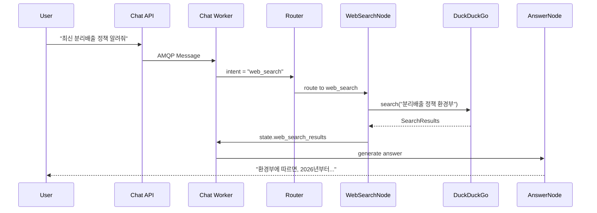

# 이코에코(Eco²) Agent #11: Web Search Subagent

> Chat Worker에 웹 검색 서브에이전트 추가 — 실시간 정보 검색

| 항목      | 값          |
| ------- | ---------- |
| **작성일** | 2026-01-14 |
| **커밋**  | e9b92ae2   |

---

## 1. 개요

### 1.1 필요성

기존 `chat_worker`는 로컬 RAG 데이터와 LLM 자체 지식에 의존했습니다.
하지만 사용자가 **최신 정보**를 요청할 때 한계가 있었습니다:

```
사용자: "최신 분리배출 정책 알려줘"
이코: "제가 가진 정보가 최신이 아닐 수 있어요..." 😅
```

**웹 검색이 필요한 시나리오:**
- 최신 분리배출 정책/규제 변경
- 환경 관련 뉴스/트렌드
- 환경부 공지사항

### 1.2 해결: web_search 서브에이전트

```
┌───────────────────────────────────────────────────────────────────┐
│                    LangGraph Pipeline (TO-BE)                      │
├───────────────────────────────────────────────────────────────────┤
│                                                                    │
│   START → intent → [vision?] → router                              │
│                                   │                                │
│          ┌────────┬────────┬──────┴──────┬────────┬────────┐      │
│          ▼        ▼        ▼             ▼        ▼        ▼      │
│       waste   character  location   web_search  general           │
│       (RAG)   (gRPC)     (gRPC)    (DuckDuckGo) (pass)            │
│          └────────┴────────┴─────────────┴────────┘               │
│                                   │                                │
│                                   ▼                                │
│                               answer → END                         │
│                                                                    │
└───────────────────────────────────────────────────────────────────┘
```

---

## 2. 아키텍처

### 2.1 Port/Adapter 패턴

```
┌─────────────────────────────────────────────────────────────┐
│                    Application Layer                         │
├─────────────────────────────────────────────────────────────┤
│                                                              │
│   ┌─────────────────────────────────────────────────────┐   │
│   │              WebSearchPort (Interface)               │   │
│   │                                                      │   │
│   │   + search(query, max_results, region, time_range)  │   │
│   │   + search_news(query, max_results, region)         │   │
│   └─────────────────────────────────────────────────────┘   │
│                            ▲                                 │
└────────────────────────────┼─────────────────────────────────┘
                             │
┌────────────────────────────┼─────────────────────────────────┐
│                    Infrastructure Layer                       │
├────────────────────────────┼─────────────────────────────────┤
│                            │                                  │
│   ┌────────────────────────┴────────────────────────┐        │
│   │                                                  │        │
│   ▼                                                  ▼        │
│ ┌─────────────────────────┐   ┌─────────────────────────┐    │
│ │ DuckDuckGoSearchClient  │   │   TavilySearchClient    │    │
│ │                         │   │                         │    │
│ │ - 무료                  │   │ - 1000 req/월 무료      │    │
│ │ - API 키 불필요         │   │ - LLM 최적화 결과       │    │
│ │ - Rate limit 있음       │   │ - API 키 필요           │    │
│ └─────────────────────────┘   └─────────────────────────┘    │
│                                                               │
└───────────────────────────────────────────────────────────────┘
```

### 2.2 검색 API 비교

| API | 비용 | 장점 | 단점 | 선택 |
|-----|------|------|------|------|
| **DuckDuckGo** | 무료 | API 키 불필요, 무제한 | Rate limit | ✅ 기본 |
| **Tavily** | 1,000 req/월 무료 | LLM 최적화 결과 | API 키 필요 | 선택적 |
| **Serper** | 2,500 req/월 무료 | Google 결과 | API 키 필요 | - |

---

## 3. 구현

### 3.1 WebSearchPort

```python
# application/ports/web_search.py

@dataclass
class SearchResult:
    """검색 결과 단일 항목."""
    title: str
    url: str
    snippet: str
    source: str


@dataclass
class WebSearchResponse:
    """웹 검색 응답."""
    query: str
    results: list[SearchResult]
    total_results: int
    search_engine: str


class WebSearchPort(ABC):
    """웹 검색 Port (추상 인터페이스)."""

    @abstractmethod
    async def search(
        self,
        query: str,
        max_results: int = 5,
        region: str = "kr-kr",
        time_range: Literal["day", "week", "month", "year", "all"] = "all",
    ) -> WebSearchResponse:
        """웹 검색 수행."""
        pass

    @abstractmethod
    async def search_news(
        self,
        query: str,
        max_results: int = 5,
        region: str = "kr-kr",
    ) -> WebSearchResponse:
        """뉴스 검색 수행."""
        pass
```

### 3.2 DuckDuckGo 클라이언트

```python
# infrastructure/integrations/web_search/duckduckgo.py

class DuckDuckGoSearchClient(WebSearchPort):
    """DuckDuckGo 검색 클라이언트.

    무료, API 키 불필요.
    비동기 컨텍스트에서 동기 API를 thread pool로 실행.
    """

    async def search(self, query, max_results=5, region="kr-kr", time_range="all"):
        # 동기 함수를 thread pool에서 실행
        return await asyncio.to_thread(
            self._search_sync, query, max_results, region, time_range
        )

    def _search_sync(self, query, max_results, region, time_range):
        from duckduckgo_search import DDGS

        with DDGS() as ddgs:
            raw_results = list(ddgs.text(
                query,
                region=region,
                timelimit={"day": "d", "week": "w", "month": "m"}[time_range],
                max_results=max_results,
            ))

        return WebSearchResponse(
            query=query,
            results=[SearchResult(
                title=r["title"],
                url=r["href"],
                snippet=r["body"],
                source=urlparse(r["href"]).netloc,
            ) for r in raw_results],
            search_engine="duckduckgo",
        )
```

### 3.3 web_search_node

```python
# infrastructure/orchestration/langgraph/nodes/web_search_node.py

def create_web_search_node(web_search_client, event_publisher):
    """웹 검색 노드 팩토리."""

    async def web_search_node(state: dict) -> dict:
        job_id = state["job_id"]
        message = state.get("message", "")
        intent = state.get("intent", "general")

        # 이벤트: 시작
        await event_publisher.notify_stage(
            task_id=job_id,
            stage="web_search",
            status="started",
            progress=40,
            message="🔍 웹에서 최신 정보를 검색 중...",
        )

        # 검색어 최적화
        search_query = _optimize_search_query(message, intent)

        # 뉴스 vs 일반 검색
        if "뉴스" in message or "최근" in message:
            response = await web_search_client.search_news(search_query)
        else:
            response = await web_search_client.search(search_query)

        # 이벤트: 완료
        await event_publisher.notify_stage(
            task_id=job_id,
            stage="web_search",
            status="completed",
            progress=50,
        )

        return {
            **state,
            "web_search_results": _format_results(response),
        }

    return web_search_node
```

### 3.4 Intent 분류

`classification/intent.txt`에 `web_search` Intent 추가:

```markdown
## web_search
- 최신 정책, 뉴스, 규제 정보 등 실시간 웹 검색이 필요한 질문
- "최신", "최근", "뉴스", "정책", "규제", "공지", "발표" 등의 키워드
- 예: "최신 분리배출 정책 알려줘", "플라스틱 규제 뉴스"
```

---

## 4. 프롬프트

### 4.1 web_instruction.txt

```markdown
# Web Search Instructions

## Context Utilization
- `web_search_results`: 웹 검색 결과 (제목, 스니펫, 출처, URL)
- 검색 결과가 없으면 RAG 데이터나 자체 지식으로 대답

## Answer Structure
1. 핵심 정보 요약 (1-2문장)
2. 출처별 세부 내용 정리
3. 신뢰할 수 있는 출처 명시
4. 추가 팁이나 주의사항 (필요시)

## Source Attribution
- 검색 결과 출처를 자연스럽게 언급
- 예: "환경부에 따르면...", "최근 보도에 의하면..."
- URL은 직접 노출하지 않고 출처명만 사용

## Prohibitions
- 출처 없이 단정적인 주장 금지
- 검색 결과를 그대로 복사하지 말고 요약/재구성
```

---

## 5. 설정

### 5.1 환경변수

```bash
# 선택적: Tavily API 키 (설정 시 Tavily 사용)
CHAT_WORKER_TAVILY_API_KEY=tvly-xxx
```

### 5.2 의존성

```txt
# requirements.txt
duckduckgo-search>=6.0.0
tavily-python>=0.3.0  # Optional
```

### 5.3 DI Factory

```python
# setup/dependencies.py

def get_web_search_client() -> WebSearchPort:
    """웹 검색 클라이언트 싱글톤."""
    settings = get_settings()

    # Tavily API 키가 있으면 Tavily 사용
    if settings.tavily_api_key:
        return TavilySearchClient(api_key=settings.tavily_api_key)

    # 기본: DuckDuckGo
    return DuckDuckGoSearchClient()
```

---

## 6. 동작 흐름

### 6.1 전체 시퀀스



### 6.2 검색어 최적화

```python
def _optimize_search_query(message: str, intent: str) -> str:
    """검색어 최적화."""
    query = message.strip()

    # 분리배출 관련이면 키워드 추가
    if intent == "waste":
        if "정책" in query or "규정" in query:
            query = f"{query} 환경부 분리배출"

    # 환경 관련 검색어 보강
    env_keywords = ["탄소", "재활용", "환경", "쓰레기", "폐기물"]
    if any(k in query for k in env_keywords):
        query = f"{query} 한국"

    return query
```

---

## 7. 결과

### 7.1 지원 Intent 확장

| Intent | 데이터 소스 | 구현 상태 |
|--------|------------|----------|
| waste | 로컬 JSON (RAG) | ✅ |
| character | gRPC → Character API | ✅ |
| location | gRPC → Location API | ✅ |
| **web_search** | **DuckDuckGo/Tavily** | ✅ **신규** |
| general | LLM 자체 지식 | ✅ |

### 7.2 예시 대화

```
사용자: "최신 플라스틱 규제 뉴스 알려줘"

이코: 최근 환경부에서 발표한 내용에 따르면,
2026년부터 일회용 플라스틱 사용 규제가 더욱 강화될 예정이에요! 📰

**주요 내용:**
- 카페/음식점 일회용컵 보증금제 확대 (환경부 발표)
- 포장재 재활용 등급 표시 의무화 (뉴스1)

분리배출도 중요하지만, 플라스틱 사용 자체를 줄이는 것도
좋은 방법이에요! 🌱
```

---

## 8. 향후 계획

- [ ] 검색 결과 캐싱 (동일 쿼리 1시간 캐시)
- [ ] Rate Limiting (DuckDuckGo 차단 방지)
- [ ] Fallback 전략 (DuckDuckGo 실패 시 Tavily)
- [ ] 검색 품질 메트릭 수집

---

## 9. 참고

- [duckduckgo-search PyPI](https://pypi.org/project/duckduckgo-search/)
- [Tavily API Docs](https://docs.tavily.com/)
- [LangChain Web Search Tools](https://python.langchain.com/docs/integrations/tools/)

