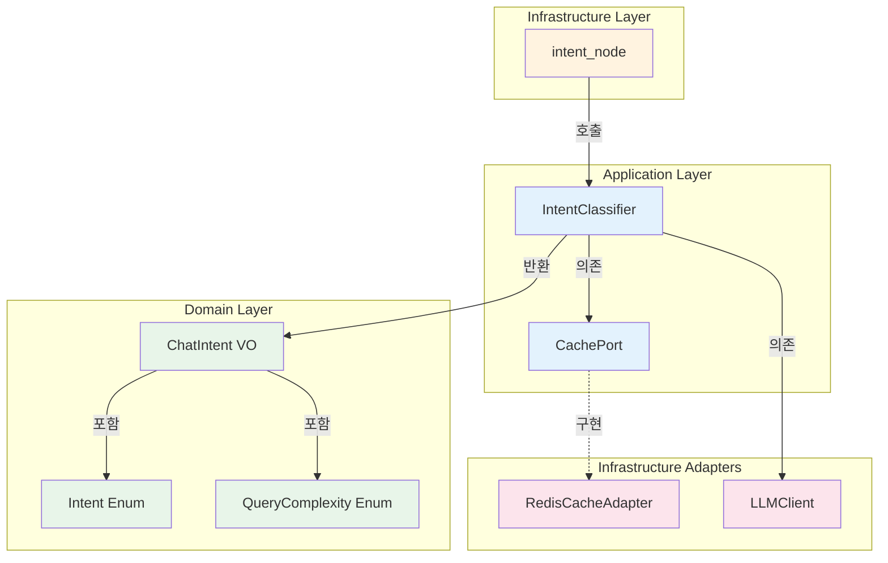
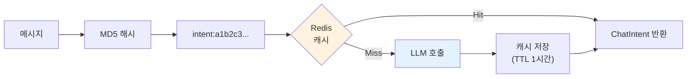

# 이코에코(Eco²) Agent #11: Intent Classification System

> LangGraph 파이프라인의 관문 — 의도 분류와 신뢰도 기반 라우팅

| 항목      | 값          |
| ------- | ---------- |
| **작성일** | 2026-01-14 |
| **커밋**  | 8c332cdd   |

---

## 1. 개요

### 1.1 Intent Node의 역할

Intent Node는 LangGraph 파이프라인의 **첫 번째 관문**입니다. 사용자 메시지를 분석하여 어떤 서브에이전트로 라우팅할지 결정합니다.

```
┌─────────────────────────────────────────────────────────────────────────┐
│                     LangGraph Pipeline Overview                          │
├─────────────────────────────────────────────────────────────────────────┤
│                                                                         │
│    User Message                                                         │
│         │                                                               │
│         ▼                                                               │
│    ┌─────────┐                                                          │
│    │ INTENT  │  ◀─── "이 파이프라인의 관문"                              │
│    │  NODE   │       사용자 의도 분류 + 복잡도 판단                       │
│    └────┬────┘                                                          │
│         │                                                               │
│         ▼                                                               │
│    ┌─────────┐   waste    ┌──────────┐                                  │
│    │ ROUTER  │───────────▶│ waste_rag│                                  │
│    │         │            └──────────┘                                  │
│    │         │   character ┌──────────┐                                 │
│    │         │────────────▶│character │ (gRPC)                          │
│    │         │            └──────────┘                                  │
│    │         │   location  ┌──────────┐                                 │
│    │         │────────────▶│ location │ (gRPC)                          │
│    │         │            └──────────┘                                  │
│    │         │   web_search┌──────────┐                                 │
│    │         │────────────▶│web_search│ (DuckDuckGo)                    │
│    │         │            └──────────┘                                  │
│    │         │   general   ┌──────────┐                                 │
│    │         │────────────▶│ general  │ (passthrough)                   │
│    └─────────┘            └──────────┘                                  │
│                                                                         │
└─────────────────────────────────────────────────────────────────────────┘
```

Intent Node가 **`waste`**를 반환하면 `waste_rag` 노드로 라우팅되어 RAG 검색이 수행되고, **`character`**를 반환하면 Character API와 gRPC 통신을 수행합니다. 이처럼 **정확한 Intent 분류가 전체 파이프라인의 품질을 결정**합니다.

### 1.2 문제 정의

초기 구현은 단순했습니다:

```python
# AS-IS: 단순 LLM 호출
intent_str = await llm.generate(prompt=message, system_prompt=PROMPT)
return Intent.from_string(intent_str)  # "waste" → Intent.WASTE
```

**문제점:**

| 문제 | 설명 |
|------|------|
| **LLM 불안정성** | "waste" 대신 "waste_query"나 "폐기물" 등 예상 외 응답 |
| **신뢰도 부재** | 애매한 질문에도 강제로 분류 |
| **비용/지연** | 동일 메시지 반복 호출 시 불필요한 LLM 비용 |
| **맥락 무시** | 멀티턴 대화에서 이전 대화 무시 |

---

## 2. 아키텍처

### 2.1 계층 분리



**계층별 책임:**

| 계층 | 컴포넌트 | 책임 |
|------|----------|------|
| **Infrastructure** | `intent_node` | 이벤트 발행 + 서비스 호출 + state 업데이트 |
| **Application** | `IntentClassifier` | 비즈니스 로직 (분류, 신뢰도, 캐싱) |
| **Domain** | `ChatIntent`, `Intent`, `QueryComplexity` | 불변 Value Object |

**의사결정: 왜 서비스를 분리했나?**

- **테스트 용이성**: `IntentClassifier`는 LangGraph 없이 단독 테스트 가능
- **재사용성**: 다른 컨텍스트에서도 Intent 분류 로직 재사용 가능
- **SRP**: Node는 오케스트레이션, Service는 비즈니스 로직

### 2.2 데이터 흐름

```
┌──────────────────────────────────────────────────────────────────────────┐
│                          Intent Classification Flow                       │
├──────────────────────────────────────────────────────────────────────────┤
│                                                                          │
│  User Message: "플라스틱 어떻게 버려?"                                     │
│        │                                                                 │
│        ▼                                                                 │
│  ┌─────────────────┐                                                     │
│  │  1. Cache Check │  ─── Cache Hit? ──▶ Return Cached ChatIntent        │
│  └────────┬────────┘                                                     │
│           │ Cache Miss                                                   │
│           ▼                                                              │
│  ┌─────────────────┐                                                     │
│  │ 2. Context Build│  ◀── 대화 맥락 포함 (P3)                             │
│  └────────┬────────┘      "[이전 의도: character]                        │
│           │                [현재 질문: 플라스틱...]"                      │
│           ▼                                                              │
│  ┌─────────────────┐                                                     │
│  │  3. LLM Call    │  ─── "waste" (temperature=0.1)                      │
│  └────────┬────────┘                                                     │
│           │                                                              │
│           ▼                                                              │
│  ┌─────────────────┐                                                     │
│  │ 4. Parse + Conf │  ─── Intent.WASTE, confidence=0.9                   │
│  └────────┬────────┘      (키워드 "버려" 매칭 → +0.1)                     │
│           │                                                              │
│           ▼                                                              │
│  ┌─────────────────┐                                                     │
│  │ 5. Fallback?    │  ─── confidence < 0.6? → Intent.GENERAL             │
│  └────────┬────────┘                                                     │
│           │                                                              │
│           ▼                                                              │
│  ┌─────────────────┐                                                     │
│  │ 6. Cache Store  │  ─── TTL=1시간                                      │
│  └────────┬────────┘                                                     │
│           │                                                              │
│           ▼                                                              │
│  ChatIntent(intent=WASTE, complexity=SIMPLE, confidence=0.9)             │
│                                                                          │
└──────────────────────────────────────────────────────────────────────────┘
```

---

## 3. 구현 상세

### 3.1 Intent 분류 프롬프트

프롬프트는 **Markdown 구조화 형식**을 사용합니다 (scan_worker 패턴):

```markdown
# Identity
당신은 사용자의 질문을 분류하는 **의도 분류기**입니다.

# Task
사용자 메시지를 분석하여 다섯 가지 의도 중 하나를 선택하세요.

# Intent Categories
## waste - 폐기물 분리배출
## character - 캐릭터 관련
## location - 위치 기반
## web_search - 실시간 웹 검색
## general - 일반 대화

# Rules
1. 반드시 다섯 가지 중 하나만 출력
2. 소문자로 출력
3. 여러 의도가 혼합된 경우 핵심 의도 선택

# Examples
Input: "플라스틱 어떻게 버려?"
Output: waste
```

**의사결정: 왜 Markdown 형식인가?**

- **일관성**: `scan_worker`와 동일한 구조로 유지보수 용이
- **가독성**: 각 섹션이 명확히 구분됨
- **Few-shot**: Examples 섹션으로 LLM 출력 안정화

### 3.2 신뢰도 기반 Fallback (P1)

LLM 응답을 맹신하지 않고, **규칙 기반 신뢰도**를 계산합니다:

```
신뢰도 계산 로직
════════════════════════════════════════════════════════════════

  Base Confidence = 1.0

  규칙 1: LLM 응답 정확도
  ────────────────────────────────────────────────────────────
  LLM 응답이 ["waste", "character", "location", "web_search", "general"]
  중 하나와 정확히 일치하지 않으면:
      confidence -= 0.3

  규칙 2: 메시지 길이
  ────────────────────────────────────────────────────────────
  메시지가 5자 미만이면:
      confidence -= 0.2

  규칙 3: 키워드 매칭
  ────────────────────────────────────────────────────────────
  Intent별 키워드 매칭 결과에 따라 조정:

  │ Intent      │ 키워드                           │ 효과      │
  │─────────────│──────────────────────────────────│───────────│
  │ waste       │ 버려, 버리, 분리, 재활용, 쓰레기  │ +0.1/개   │
  │ character   │ 캐릭터, 얻, 모아, 컬렉션          │ +0.1/개   │
  │ location    │ 어디, 근처, 가까, 센터, 위치      │ +0.1/개   │
  │ web_search  │ 최신, 뉴스, 정책, 규제, 발표      │ +0.1/개   │

  키워드 매칭 없으면 (general 제외):
      confidence -= 0.1

  Fallback
  ────────────────────────────────────────────────────────────
  if confidence < 0.6:
      intent = Intent.GENERAL  # 안전한 폴백
```

**예시:**

| 메시지 | LLM 응답 | 키워드 | 최종 신뢰도 | 결과 |
|--------|----------|--------|-------------|------|
| "플라스틱 버려" | "waste" | 버려 (+0.1) | 1.1 → 1.0 | ✅ WASTE |
| "응" | "general" | 없음 | 1.0 - 0.2 = 0.8 | ✅ GENERAL |
| "뭔가 알려줘" | "waste_query" | 없음 | 1.0 - 0.3 - 0.1 = 0.6 | ✅ GENERAL (fallback) |

### 3.3 Intent 캐싱 (P2)

**동일 메시지 반복 질문**에 대한 LLM 호출 비용 절감:



**의사결정: 왜 CachePort 추상화인가?**

```python
# AS-IS: Redis 직접 의존 (Clean Architecture 위반)
class IntentClassifier:
    def __init__(self, llm, redis: Redis):  # ❌ Infrastructure 침투
        self._redis = redis

# TO-BE: CachePort 추상화
class IntentClassifier:
    def __init__(self, llm, cache: CachePort):  # ✅ Port만 의존
        self._cache = cache
```

장점:
- **테스트**: `InMemoryCache` 주입으로 단위 테스트
- **교체 용이**: Memcached, Local 등으로 교체 가능
- **계층 분리**: Application Layer가 Redis를 모름

### 3.4 대화 맥락 활용 (P3)

멀티턴 대화에서 **이전 Intent 히스토리**를 활용합니다:

```
┌─────────────────────────────────────────────────────────────────────────┐
│                      Context-Aware Intent Classification                 │
├─────────────────────────────────────────────────────────────────────────┤
│                                                                         │
│  Turn 1: "플라스틱 어떻게 버려?"                                          │
│          → intent=waste                                                 │
│                                                                         │
│  Turn 2: "그럼 캐릭터는?"                                                 │
│          │                                                              │
│          ▼                                                              │
│  ┌───────────────────────────────────────────────────────────┐          │
│  │  Context-Aware Prompt                                     │          │
│  │  ─────────────────────────────────────────────────────────│          │
│  │  [이전 대화 의도: waste]                                   │          │
│  │  [현재 질문: 그럼 캐릭터는?]                                │          │
│  └───────────────────────────────────────────────────────────┘          │
│          │                                                              │
│          ▼                                                              │
│  → intent=character (이전 맥락 참조)                                     │
│                                                                         │
│  ⚠️ 맥락이 있으면 캐시 스킵 (맥락 의존적이므로)                           │
│                                                                         │
└─────────────────────────────────────────────────────────────────────────┘
```

---

## 4. Domain Objects

### 4.1 Intent Enum

```python
class Intent(str, Enum):
    WASTE = "waste"        # 분리배출
    CHARACTER = "character"  # 캐릭터
    LOCATION = "location"   # 위치
    WEB_SEARCH = "web_search" # 웹 검색
    GENERAL = "general"     # 일반
```

### 4.2 ChatIntent Value Object

```python
@dataclass(frozen=True, slots=True)
class ChatIntent:
    intent: Intent
    complexity: QueryComplexity
    confidence: float = 1.0

    @property
    def is_complex(self) -> bool:
        return self.complexity == QueryComplexity.COMPLEX

    @property
    def is_high_confidence(self) -> bool:
        return self.confidence >= 0.7

    @classmethod
    def simple_general(cls, confidence: float = 1.0) -> "ChatIntent":
        """안전한 폴백용 팩토리."""
        return cls(Intent.GENERAL, QueryComplexity.SIMPLE, confidence)
```

**의사결정: 왜 Value Object인가?**

- **불변성**: `frozen=True`로 상태 변경 방지
- **동등성**: 값 기반 비교 (`intent=WASTE, confidence=0.9` 동일 객체)
- **풍부한 동작**: `is_complex`, `is_high_confidence` 등 도메인 로직 내포

---

## 5. 의사결정 흐름

### 5.1 전체 결정 트리

```
Intent 분류 의사결정 트리
══════════════════════════════════════════════════════════════════════

  Q1. 캐싱을 사용할 것인가?
  ├─ YES: 반복 질문 비용 절감, LLM 호출 50%+ 감소 예상
  ├─ NO: 모든 요청이 고유하다면 불필요
  └─ 결정: ✅ YES (동일 질문 패턴 존재)

  Q2. 캐싱 백엔드 선택?
  ├─ Redis: 분산 환경, TTL 지원, 이미 인프라 존재
  ├─ Local: 단일 인스턴스, 빠름
  └─ 결정: ✅ Redis (K8s 환경, 여러 Pod 공유)

  Q3. Redis를 어떻게 주입할 것인가?
  ├─ 직접 주입: 간단하지만 Infrastructure 침투
  ├─ Port 추상화: 계층 분리, 테스트 용이
  └─ 결정: ✅ CachePort (Clean Architecture 준수)

  Q4. LLM 응답을 신뢰할 것인가?
  ├─ 완전 신뢰: 간단하지만 예상 외 응답 시 오류
  ├─ 검증 후 사용: 신뢰도 계산, 필요시 폴백
  └─ 결정: ✅ 신뢰도 기반 Fallback (0.6 미만 → GENERAL)

  Q5. 멀티턴 대화를 지원할 것인가?
  ├─ NO: 단순하지만 맥락 무시
  ├─ YES: Checkpointer에서 previous_intents 전달
  └─ 결정: ✅ YES (context 파라미터, 캐시 스킵)
```

### 5.2 P0-P3 우선순위

| 우선순위 | 기능 | 상태 | 이유 |
|----------|------|------|------|
| **P0** | 프롬프트 파일화 | ✅ | 유지보수 용이, scan_worker 일관성 |
| **P1** | 신뢰도 Fallback | ✅ | LLM 불안정성 대응 |
| **P2** | 캐싱 (CachePort) | ✅ | 비용 절감, Clean Architecture |
| **P2** | Multi-Intent 감지 | ⚠️ | 로깅만 (처리는 추후) |
| **P3** | 대화 맥락 | ✅ | 멀티턴 품질 향상 |

---

## 6. 결과 및 효과

### 6.1 Before vs After

| 항목 | Before | After |
|------|--------|-------|
| 프롬프트 관리 | 하드코딩 | 파일 기반 (`intent.txt`) |
| LLM 응답 처리 | 그대로 사용 | 신뢰도 기반 Fallback |
| 캐싱 | 없음 | Redis (CachePort) |
| Redis 의존 | 직접 | Port 추상화 |
| 테스트 | 어려움 | Mock 주입 가능 |
| 멀티턴 | 무시 | context 활용 |

### 6.2 예상 효과

```
┌────────────────────────────────────────────────────────────────────────┐
│                         예상 효과                                       │
├────────────────────────────────────────────────────────────────────────┤
│                                                                        │
│  💰 비용 절감                                                           │
│  ─────────────────────────────────────────────────────────             │
│  캐시 적중률 30% 가정 시:                                               │
│  - LLM 호출 30% 감소                                                   │
│  - 응답 시간 ~50ms (캐시) vs ~500ms (LLM)                              │
│                                                                        │
│  🎯 정확도 향상                                                         │
│  ─────────────────────────────────────────────────────────             │
│  - 예상 외 LLM 응답 → Fallback 처리                                     │
│  - 애매한 질문 → GENERAL로 안전하게 처리                                 │
│                                                                        │
│  🧪 테스트 용이성                                                       │
│  ─────────────────────────────────────────────────────────             │
│  - IntentClassifier 단독 테스트 가능                                    │
│  - InMemoryCache로 캐싱 로직 검증                                       │
│  - Mock LLM으로 다양한 시나리오 테스트                                   │
│                                                                        │
└────────────────────────────────────────────────────────────────────────┘
```

---

## 7. 참고 자료

- **커밋**: `8c332cdd` — CachePort/MetricsPort 도입
- **파일**:
  - `application/intent/services/intent_classifier.py`
  - `infrastructure/orchestration/langgraph/nodes/intent_node.py`
  - `infrastructure/assets/prompts/classification/intent.txt`
  - `application/ports/cache/cache_port.py`
- **관련 문서**:
  - [#22 Local Prompt Optimization](./22-chat-prompt-optimization.md)
  - [#06 Domain Layer](./06-chat-implementation-phase1-domain.md)

