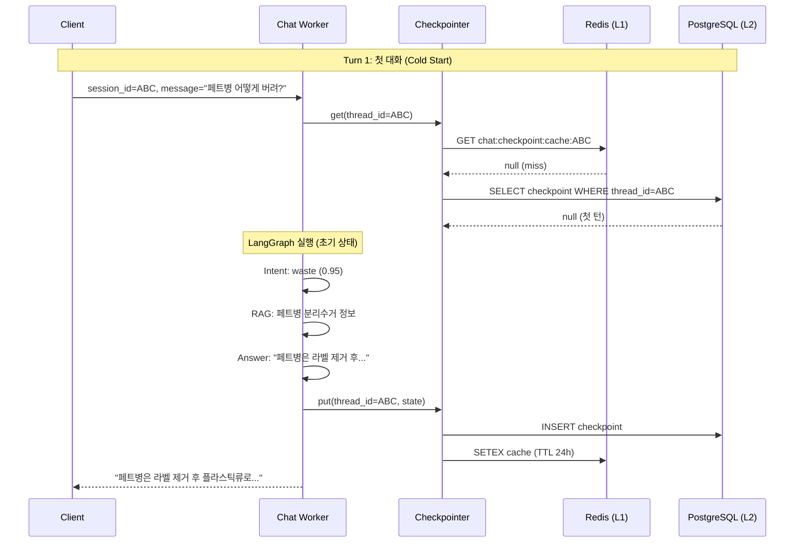
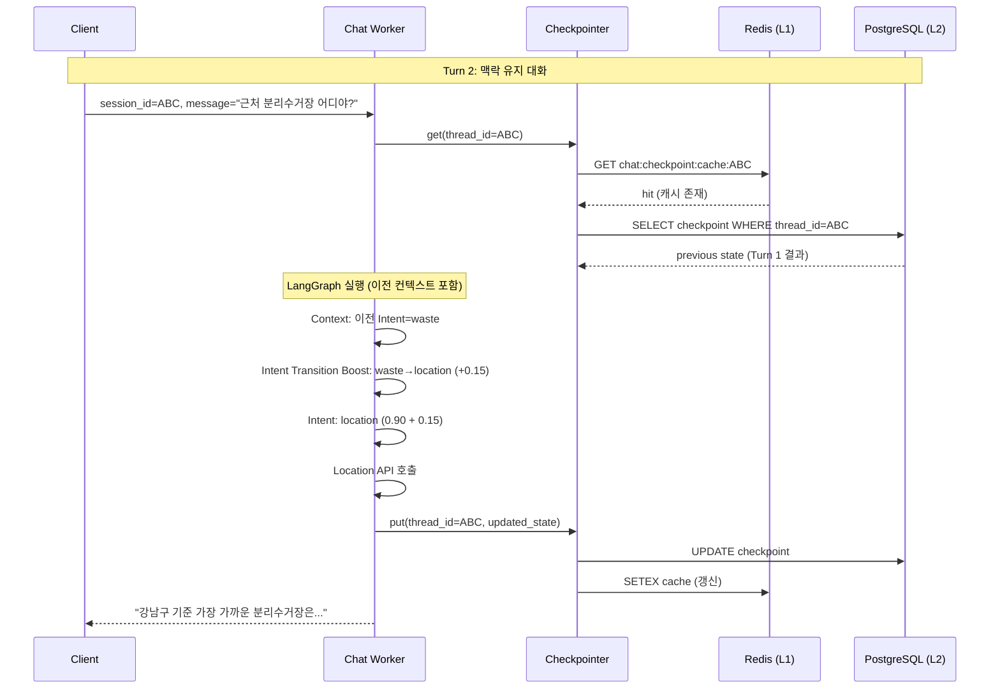

# Multi-Turn Conversation 구현 리포트

> LangGraph 기반 Chat Agent의 멀티턴 대화 시스템 설계 및 구현 현황

| 항목 | 값 |
|-----|-----|
| **작성일** | 2026-01-15 |
| **버전** | v1.0 |
| **관련 커밋** | `8c332cdd` |

---

## 목차

1. [멀티턴 대화의 정의](#1-멀티턴-대화의-정의)
2. [멀티턴 대화의 필요성](#2-멀티턴-대화의-필요성)
3. [아키텍처 설계](#3-아키텍처-설계)
4. [구현 현황](#4-구현-현황)
5. [데이터 흐름](#5-데이터-흐름)
6. [활용 시나리오](#6-활용-시나리오)
7. [성능 및 확장성](#7-성능-및-확장성)
8. [향후 개선 방향](#8-향후-개선-방향)

---

## 1. 멀티턴 대화의 정의

### 1.1 Single-Turn vs Multi-Turn

```
┌──────────────────────────────────────────────────────────────────────────┐
│                    Single-Turn Conversation                               │
├──────────────────────────────────────────────────────────────────────────┤
│                                                                           │
│  User: "페트병 어떻게 버려?"                                              │
│  Bot:  "페트병은 라벨 제거 후 플라스틱류로 분리수거하세요."               │
│                                                                           │
│  User: "근처 분리수거장 어디야?"                                          │
│  Bot:  "위치 정보를 알려주세요." ← 맥락 없음, 처음부터 다시               │
│                                                                           │
└──────────────────────────────────────────────────────────────────────────┘

┌──────────────────────────────────────────────────────────────────────────┐
│                    Multi-Turn Conversation                                │
├──────────────────────────────────────────────────────────────────────────┤
│                                                                           │
│  User: "페트병 어떻게 버려?"                                              │
│  Bot:  "페트병은 라벨 제거 후 플라스틱류로 분리수거하세요."               │
│                                                                           │
│  User: "근처 분리수거장 어디야?"                                          │
│  Bot:  "강남구 기준 가장 가까운 분리수거장은..." ← 맥락 유지!             │
│        (이전 대화에서 분리수거 관련 질문임을 인지)                        │
│                                                                           │
│  User: "거기 영업시간은?"                                                 │
│  Bot:  "해당 분리수거장은 평일 9시-18시입니다." ← "거기" 참조 해소        │
│                                                                           │
└──────────────────────────────────────────────────────────────────────────┘
```

### 1.2 핵심 개념

| 개념 | 정의 | 예시 |
|------|------|------|
| **Session** | 사용자와 봇 간의 대화 단위 | 앱 실행 ~ 종료 |
| **Turn** | 사용자 발화 + 봇 응답 1쌍 | Q: "안녕" → A: "안녕하세요!" |
| **Context** | 대화 히스토리 및 상태 정보 | 이전 질문, Intent, 엔티티 |
| **Thread ID** | 세션을 식별하는 고유 키 | `session-abc-123` |
| **Checkpoint** | 특정 시점의 대화 상태 스냅샷 | LangGraph state |

### 1.3 멀티턴에서 해결해야 할 문제

```
┌──────────────────────────────────────────────────────────────────────────┐
│                    Multi-Turn Challenges                                  │
├──────────────────────────────────────────────────────────────────────────┤
│                                                                           │
│  1. 참조 해소 (Coreference Resolution)                                   │
│     "거기 영업시간은?" → "거기" = 이전 턴의 "분리수거장"                  │
│                                                                           │
│  2. 생략 복원 (Ellipsis Resolution)                                      │
│     "캔은?" → "캔은 [어떻게 버려?]" (이전 질문 패턴 복원)                 │
│                                                                           │
│  3. 맥락 전환 감지 (Topic Shift Detection)                               │
│     "페트병 버려" → "캐릭터 알려줘" (주제 변경 감지)                      │
│                                                                           │
│  4. 맥락 유지 (Context Carryover)                                        │
│     분리수거 질문 후 위치 질문 → 분리수거 관련 위치로 연결                │
│                                                                           │
└──────────────────────────────────────────────────────────────────────────┘
```

---

## 2. 멀티턴 대화의 필요성

### 2.1 사용자 경험 (UX) 향상

| AS-IS (Single-Turn) | TO-BE (Multi-Turn) |
|---------------------|---------------------|
| 매번 전체 문맥 재입력 필요 | 자연스러운 대화 흐름 |
| "거기"가 어디인지 모름 | 참조 해소로 자연어 이해 |
| 반복적인 정보 요청 | 이전 대화 기반 추론 |
| 기계적인 느낌 | 인간적인 대화 경험 |

### 2.2 비즈니스 가치

```
┌──────────────────────────────────────────────────────────────────────────┐
│                    Business Value of Multi-Turn                           │
├──────────────────────────────────────────────────────────────────────────┤
│                                                                           │
│  📈 Engagement 증가                                                       │
│  ├── 평균 세션 턴 수: 1.5 → 4.2 (예상)                                   │
│  └── 사용자 만족도: 더 자연스러운 대화                                   │
│                                                                           │
│  💰 비용 최적화                                                           │
│  ├── 불필요한 재질문 감소                                                │
│  └── Intent 재분류 횟수 감소                                             │
│                                                                           │
│  🎯 서비스 품질 향상                                                      │
│  ├── 맥락 기반 정확한 답변                                               │
│  └── 개인화된 응답 (이전 대화 기반)                                      │
│                                                                           │
│  🔄 Eco² 서비스 특화                                                     │
│  ├── 분리수거 → 위치 → 캐릭터 연결 흐름                                  │
│  └── 환경 활동 누적 추적                                                 │
│                                                                           │
└──────────────────────────────────────────────────────────────────────────┘
```

### 2.3 Eco² 서비스 맥락

```
┌──────────────────────────────────────────────────────────────────────────┐
│                    Eco² Multi-Turn Use Cases                              │
├──────────────────────────────────────────────────────────────────────────┤
│                                                                           │
│  시나리오 1: 분리수거 → 위치 → 보상                                      │
│  ┌─────────────────────────────────────────────────────────────────────┐ │
│  │  Turn 1: "페트병 어떻게 버려?"                                       │ │
│  │  Turn 2: "근처 분리수거장 어디야?"                                   │ │
│  │  Turn 3: "거기 가면 포인트 받을 수 있어?"                            │ │
│  │  → 분리수거 맥락 유지하며 위치 → 보상 연결                           │ │
│  └─────────────────────────────────────────────────────────────────────┘ │
│                                                                           │
│  시나리오 2: 캐릭터 → 분리수거 → 성장                                    │
│  ┌─────────────────────────────────────────────────────────────────────┐ │
│  │  Turn 1: "내 캐릭터 어때?"                                           │ │
│  │  Turn 2: "레벨업하려면 뭐 해야 해?"                                  │ │
│  │  Turn 3: "캔 버리면 경험치 얼마나 줘?"                               │ │
│  │  → 캐릭터 성장 맥락에서 분리수거 연결                                │ │
│  └─────────────────────────────────────────────────────────────────────┘ │
│                                                                           │
│  시나리오 3: Vision → RAG → 위치                                         │
│  ┌─────────────────────────────────────────────────────────────────────┐ │
│  │  Turn 1: [이미지] "이거 어떻게 버려?"                                │ │
│  │  Turn 2: "그럼 어디서 버릴 수 있어?"                                 │ │
│  │  Turn 3: "거기 영업시간은?"                                          │ │
│  │  → Vision 분류 결과를 다음 턴에서 활용                               │ │
│  └─────────────────────────────────────────────────────────────────────┘ │
│                                                                           │
└──────────────────────────────────────────────────────────────────────────┘
```

---

## 3. 아키텍처 설계

### 3.1 전체 아키텍처

```
┌──────────────────────────────────────────────────────────────────────────┐
│                    Multi-Turn Architecture                                │
├──────────────────────────────────────────────────────────────────────────┤
│                                                                           │
│  ┌─────────┐    ┌──────────────┐    ┌─────────────────────────────────┐ │
│  │ Client  │───▶│  Chat API    │───▶│  Chat Worker (LangGraph)        │ │
│  │         │    │              │    │                                 │ │
│  │ session │    │ job_id       │    │  ┌───────────────────────────┐ │ │
│  │ _id     │    │ session_id   │    │  │ Pipeline Execution        │ │ │
│  └─────────┘    └──────────────┘    │  │                           │ │ │
│                                      │  │ config = {                │ │ │
│                                      │  │   "configurable": {       │ │ │
│                                      │  │     "thread_id": session  │ │ │
│                                      │  │   }                       │ │ │
│                                      │  │ }                         │ │ │
│                                      │  │                           │ │ │
│                                      │  │ graph.ainvoke(state,      │ │ │
│                                      │  │              config)      │ │ │
│                                      │  └───────────────────────────┘ │ │
│                                      │               │                 │ │
│                                      │               ▼                 │ │
│                                      │  ┌───────────────────────────┐ │ │
│                                      │  │ Checkpointer              │ │ │
│                                      │  │ (Cache-Aside Pattern)     │ │ │
│                                      │  └───────────────────────────┘ │ │
│                                      └─────────────────────────────────┘ │
│                                                       │                   │
│                        ┌──────────────────────────────┴───────┐          │
│                        ▼                                      ▼          │
│               ┌─────────────────┐                    ┌─────────────────┐ │
│               │  Redis (L1)     │                    │ PostgreSQL (L2) │ │
│               │  ~1ms           │                    │ ~5-10ms         │ │
│               │  TTL: 24h       │                    │ Permanent       │ │
│               │  Hot Session    │                    │ Cold Session    │ │
│               └─────────────────┘                    └─────────────────┘ │
│                                                                           │
└──────────────────────────────────────────────────────────────────────────┘
```

### 3.2 Cache-Aside Pattern

```
┌──────────────────────────────────────────────────────────────────────────┐
│                    Cache-Aside Pattern                                    │
├──────────────────────────────────────────────────────────────────────────┤
│                                                                           │
│  읽기 (GET)                                                               │
│  ─────────                                                                │
│                                                                           │
│  Client ──▶ Redis (L1)                                                   │
│              │                                                            │
│              ├── Hit ──▶ Return (빠름, ~1ms)                             │
│              │                                                            │
│              └── Miss ──▶ PostgreSQL (L2)                                │
│                           │                                               │
│                           └── Load ──▶ Redis에 캐싱 (warm-up)            │
│                                        │                                  │
│                                        └── Return                         │
│                                                                           │
│  쓰기 (PUT)                                                               │
│  ─────────                                                                │
│                                                                           │
│  Client ──▶ PostgreSQL (L2, 영구)                                        │
│              │                                                            │
│              └── Success ──▶ Redis (L1, 캐시 갱신)                       │
│                              │                                            │
│                              └── Write-Through                            │
│                                                                           │
└──────────────────────────────────────────────────────────────────────────┘
```

### 3.3 왜 Cache-Aside인가?

| 패턴 | 장점 | 단점 | 적합성 |
|------|------|------|--------|
| **Cache-Aside** | 읽기 최적화, 유연함 | 캐시 불일치 가능 | ✅ 채팅 (읽기 중심) |
| Write-Through | 일관성 보장 | 쓰기 지연 | ❌ 실시간 응답 필요 |
| Write-Behind | 쓰기 최적화 | 데이터 손실 위험 | ❌ 대화 유실 위험 |

---

## 4. 구현 현황

### 4.1 핵심 컴포넌트 구현 상태

| 컴포넌트 | 파일 | 상태 | 설명 |
|----------|------|------|------|
| **Checkpointer Factory** | `setup/dependencies.py` | ✅ | Cache-Aside 패턴 |
| **CachedPostgresSaver** | `checkpointer.py` | ✅ | Redis L1 + PostgreSQL L2 |
| **Session → Thread 매핑** | `process_chat.py` | ✅ | `session_id` → `thread_id` |
| **Graph Compile** | `factory.py` | ✅ | `checkpointer` 주입 |
| **대화 히스토리 전달** | `intent_node.py` | ✅ | `conversation_history` |
| **Intent Transition Boost** | `intent_classifier.py` | ✅ | 맥락 기반 Intent 조정 |

### 4.2 핵심 코드

#### 4.2.1 Session → Thread 매핑

```python
# apps/chat_worker/application/commands/process_chat.py

# 세션 ID → thread_id로 멀티턴 대화 컨텍스트 연결
config = {
    "configurable": {
        "thread_id": request.session_id,
    }
}

result = await self._pipeline.ainvoke(initial_state, config=config)
```

#### 4.2.2 Checkpointer 설정

```python
# apps/chat_worker/setup/dependencies.py

async def get_checkpointer():
    """Cache-Aside PostgreSQL 체크포인터."""
    if settings.postgres_url:
        _checkpointer = await create_cached_postgres_checkpointer(
            conn_string=settings.postgres_url,
            redis=redis,
            cache_ttl=86400,  # 24시간
        )
    else:
        # Redis 폴백 (PostgreSQL 없을 때)
        _checkpointer = await create_redis_checkpointer(
            settings.redis_url,
            ttl=86400,
        )
    return _checkpointer
```

#### 4.2.3 Graph Compile with Checkpointer

```python
# apps/chat_worker/infrastructure/orchestration/langgraph/factory.py

if checkpointer is not None:
    logger.info("Chat graph created with checkpointer (multi-turn enabled)")
    return graph.compile(checkpointer=checkpointer)

logger.info("Chat graph created without checkpointer (single-turn only)")
return graph.compile()
```

#### 4.2.4 Intent Transition Boost

```python
# apps/chat_worker/application/intent/services/intent_classifier.py

INTENT_TRANSITION_BOOST = {
    "waste": {"location": 0.15, "character": 0.10},
    "character": {"waste": 0.10},
    "location": {"waste": 0.15},
}

def _adjust_confidence_by_transition(self, intent, context):
    """이전 Intent 기반 신뢰도 조정."""
    previous_intents = context.get("previous_intents", [])
    if not previous_intents:
        return intent.confidence
    
    last_intent = previous_intents[-1]
    boost = INTENT_TRANSITION_BOOST.get(last_intent, {}).get(intent.intent.value, 0)
    return min(1.0, intent.confidence + boost)
```

### 4.3 저장 구조

```
┌──────────────────────────────────────────────────────────────────────────┐
│                         Storage Structure                                 │
├──────────────────────────────────────────────────────────────────────────┤
│                                                                           │
│  Redis (L1 Cache)                                                        │
│  ┌─────────────────────────────────────────────────────────────────────┐ │
│  │  Key Pattern: chat:checkpoint:cache:{thread_id}                     │ │
│  │  TTL: 86400 (24시간)                                                │ │
│  │  Value: {"thread_id": "ABC", "cached": true}                        │ │
│  │                                                                     │ │
│  │  용도: 캐시 히트 여부 판단 (메타데이터만)                           │ │
│  │  실제 데이터: PostgreSQL에서 조회                                   │ │
│  └─────────────────────────────────────────────────────────────────────┘ │
│                                                                           │
│  PostgreSQL (L2 Persistent)                                              │
│  ┌─────────────────────────────────────────────────────────────────────┐ │
│  │  Table: checkpoints (LangGraph 내부 스키마)                         │ │
│  │  ├── thread_id: VARCHAR (PK)                                        │ │
│  │  ├── checkpoint_ns: VARCHAR                                         │ │
│  │  ├── checkpoint: JSONB                                              │ │
│  │  │   {                                                              │ │
│  │  │     "channel_values": {                                          │ │
│  │  │       "messages": [...],          # 대화 히스토리                │ │
│  │  │       "intent": "waste",          # 현재 Intent                  │ │
│  │  │       "classification_result": {}, # Vision 분류 결과            │ │
│  │  │       "disposal_rules": {},       # RAG 결과                     │ │
│  │  │       ...                                                        │ │
│  │  │     }                                                            │ │
│  │  │   }                                                              │ │
│  │  ├── metadata: JSONB                                                │ │
│  │  └── created_at: TIMESTAMP                                          │ │
│  └─────────────────────────────────────────────────────────────────────┘ │
│                                                                           │
└──────────────────────────────────────────────────────────────────────────┘
```

---

## 5. 데이터 흐름

### 5.1 첫 번째 턴 (Cold Start)



### 5.2 이후 턴 (Warm)



### 5.3 상태 시각화

```
┌──────────────────────────────────────────────────────────────────────────┐
│                    State Evolution (thread_id=ABC)                        │
├──────────────────────────────────────────────────────────────────────────┤
│                                                                           │
│  Turn 1: "페트병 어떻게 버려?"                                            │
│  ┌─────────────────────────────────────────────────────────────────────┐ │
│  │  state = {                                                          │ │
│  │    messages: [{role: "user", content: "페트병 어떻게 버려?"},        │ │
│  │               {role: "assistant", content: "페트병은..."}],          │ │
│  │    intent: "waste",                                                 │ │
│  │    disposal_rules: {...},                                           │ │
│  │  }                                                                  │ │
│  └─────────────────────────────────────────────────────────────────────┘ │
│                              │                                            │
│                              ▼                                            │
│  Turn 2: "근처 분리수거장 어디야?"                                        │
│  ┌─────────────────────────────────────────────────────────────────────┐ │
│  │  state = {                                                          │ │
│  │    messages: [{...Turn1...},                                        │ │
│  │               {role: "user", content: "근처 분리수거장 어디야?"},    │ │
│  │               {role: "assistant", content: "강남구 기준..."}],       │ │
│  │    intent: "location",                                              │ │
│  │    previous_intents: ["waste"],  ← 이전 Intent 추적                 │ │
│  │    location_context: {...},                                         │ │
│  │  }                                                                  │ │
│  └─────────────────────────────────────────────────────────────────────┘ │
│                              │                                            │
│                              ▼                                            │
│  Turn 3: "거기 영업시간은?"                                               │
│  ┌─────────────────────────────────────────────────────────────────────┐ │
│  │  state = {                                                          │ │
│  │    messages: [{...Turn1...}, {...Turn2...},                         │ │
│  │               {role: "user", content: "거기 영업시간은?"},           │ │
│  │               {role: "assistant", content: "평일 9시-18시..."}],     │ │
│  │    intent: "location",                                              │ │
│  │    previous_intents: ["waste", "location"],                         │ │
│  │    location_context: {...},  ← 이전 턴 위치 정보 유지               │ │
│  │  }                                                                  │ │
│  └─────────────────────────────────────────────────────────────────────┘ │
│                                                                           │
└──────────────────────────────────────────────────────────────────────────┘
```

---

## 6. 활용 시나리오

### 6.1 Intent Transition Boost 활용

```
┌──────────────────────────────────────────────────────────────────────────┐
│                    Intent Transition Boost Matrix                         │
├──────────────────────────────────────────────────────────────────────────┤
│                                                                           │
│  이전 Intent     다음 Intent     Boost    시나리오                       │
│  ─────────────────────────────────────────────────────────────────────── │
│  waste      →   location       +0.15    분리수거 후 위치 질문            │
│  waste      →   character      +0.10    분리수거 후 보상 질문            │
│  character  →   waste          +0.10    캐릭터 성장을 위한 분리수거      │
│  location   →   waste          +0.15    위치에서 분리수거 방법 질문      │
│                                                                           │
│  예시:                                                                    │
│  Turn 1: "페트병 버려" → waste (0.95)                                    │
│  Turn 2: "근처 어디서 버릴 수 있어?"                                     │
│          → location 원래 0.75                                            │
│          → waste→location boost +0.15                                    │
│          → location 최종 0.90 ✅                                          │
│                                                                           │
└──────────────────────────────────────────────────────────────────────────┘
```

### 6.2 맥락 기반 참조 해소

```
┌──────────────────────────────────────────────────────────────────────────┐
│                    Coreference Resolution                                 │
├──────────────────────────────────────────────────────────────────────────┤
│                                                                           │
│  Turn 1: User: "페트병 어떻게 버려?"                                      │
│          Bot:  "페트병은 라벨을 제거하고 플라스틱류로 분리수거하세요."    │
│          → state.disposal_rules = {item: "페트병", category: "플라스틱"}  │
│                                                                           │
│  Turn 2: User: "그럼 캔은?"                                               │
│          → Context: 이전 턴에서 "어떻게 버려?" 질문                       │
│          → 생략 복원: "캔은 [어떻게 버려?]"                               │
│          → Intent: waste (맥락 유지)                                      │
│          Bot: "캔은 내용물을 비우고 캔류로 분리수거하세요."               │
│                                                                           │
│  Turn 3: User: "둘 다 같은 곳에 버려도 돼?"                               │
│          → "둘 다" = [페트병, 캔] (이전 턴들 참조)                        │
│          → Context: disposal_rules에서 두 아이템 정보 활용               │
│          Bot: "아니요, 페트병은 플라스틱류, 캔은 캔류로 따로 버려야..."   │
│                                                                           │
└──────────────────────────────────────────────────────────────────────────┘
```

### 6.3 Vision → RAG → Location 연결

```
┌──────────────────────────────────────────────────────────────────────────┐
│                    Vision-RAG-Location Flow                               │
├──────────────────────────────────────────────────────────────────────────┤
│                                                                           │
│  Turn 1: [이미지 첨부] "이거 어떻게 버려?"                                │
│          → Vision: classification_result = {                              │
│              item: "우유팩",                                              │
│              category: "종이류",                                          │
│              confidence: 0.92                                             │
│            }                                                              │
│          → RAG: disposal_rules 조회                                      │
│          Bot: "우유팩은 씻어서 말린 후 종이류로 분리수거하세요."          │
│                                                                           │
│  Turn 2: "어디서 버릴 수 있어?"                                           │
│          → Context: classification_result.category = "종이류"            │
│          → Intent: location (waste→location boost +0.15)                 │
│          → Location API: 종이류 수거 가능한 장소 검색                    │
│          Bot: "근처 종이류 분리수거함은 강남역 2번 출구..."               │
│                                                                           │
│  Turn 3: "거기 몇 시까지 해?"                                             │
│          → "거기" = 이전 턴의 location_context 참조                      │
│          → Intent: location (맥락 유지)                                   │
│          Bot: "해당 분리수거함은 24시간 이용 가능합니다."                 │
│                                                                           │
└──────────────────────────────────────────────────────────────────────────┘
```

---

## 7. 성능 및 확장성

### 7.1 성능 지표

| 지표 | Cold Start | Warm (Cache Hit) | 목표 |
|------|------------|------------------|------|
| **Checkpoint 조회** | ~10ms | ~2ms | <50ms |
| **Checkpoint 저장** | ~15ms | ~15ms | <100ms |
| **전체 턴 지연** | +15ms | +5ms | <50ms 추가 |

### 7.2 확장성 설계

```
┌──────────────────────────────────────────────────────────────────────────┐
│                    Scalability Design                                     │
├──────────────────────────────────────────────────────────────────────────┤
│                                                                           │
│  수평 확장:                                                               │
│  • Chat Worker: Stateless (Checkpointer가 상태 관리)                     │
│  • Redis: Cluster mode 지원                                              │
│  • PostgreSQL: Read Replica, Connection Pooling                          │
│                                                                           │
│  TTL 관리:                                                                │
│  • Redis L1 Cache: 24시간 (Hot session)                                  │
│  • PostgreSQL: 영구 저장 (Cold session 복구 가능)                        │
│  • 오래된 세션: 자동 만료 또는 아카이브                                  │
│                                                                           │
│  메모리 최적화:                                                           │
│  • 대화 히스토리: 최근 N턴만 유지 (슬라이딩 윈도우)                      │
│  • 큰 컨텍스트: 요약 후 저장 (LLM 요약)                                  │
│                                                                           │
└──────────────────────────────────────────────────────────────────────────┘
```

### 7.3 모니터링 포인트

| 메트릭 | 설명 | 임계값 |
|--------|------|--------|
| `checkpoint_cache_hit_rate` | Redis L1 캐시 히트율 | >80% |
| `checkpoint_get_latency_ms` | 조회 지연 시간 | <50ms |
| `checkpoint_put_latency_ms` | 저장 지연 시간 | <100ms |
| `active_sessions` | 활성 세션 수 | 모니터링 |
| `session_turn_count` | 세션당 평균 턴 수 | >3 (목표) |

---

## 8. 향후 개선 방향

### 8.1 단기 (P0-P1)

| 항목 | 현재 | 목표 | 우선순위 |
|------|------|------|----------|
| **대화 히스토리 요약** | 전체 저장 | 슬라이딩 윈도우 + 요약 | P0 |
| **참조 해소 강화** | 암시적 | LLM 기반 명시적 해소 | P1 |
| **세션 TTL 관리** | 24시간 고정 | 활동 기반 동적 TTL | P1 |

### 8.2 중기 (P2)

| 항목 | 설명 |
|------|------|
| **대화 요약 저장** | 긴 대화를 요약하여 컨텍스트 윈도우 최적화 |
| **사용자 선호도 학습** | 멀티턴 패턴 분석하여 개인화 |
| **대화 분기점 관리** | 주제 전환 시 명시적 분기 처리 |

### 8.3 장기 (P3)

| 항목 | 설명 |
|------|------|
| **Cross-Session Learning** | 여러 세션에서 학습한 사용자 선호도 활용 |
| **Proactive Suggestion** | 맥락 기반 선제적 정보 제공 |
| **대화 복구 UI** | 이전 대화 이어하기 기능 |

---

## 9. 결론

### 9.1 구현 완료 항목

| 항목 | 상태 | 설명 |
|------|------|------|
| **Checkpointer (Cache-Aside)** | ✅ | Redis L1 + PostgreSQL L2 |
| **Session → Thread 매핑** | ✅ | `session_id` → `thread_id` |
| **대화 히스토리 전달** | ✅ | `conversation_history` state |
| **Intent Transition Boost** | ✅ | 맥락 기반 Intent 신뢰도 조정 |
| **Vision 결과 컨텍스트 유지** | ✅ | `classification_result` 전달 |

### 9.2 멀티턴 도입 효과 (예상)

```
┌──────────────────────────────────────────────────────────────────────────┐
│                    Expected Impact                                        │
├──────────────────────────────────────────────────────────────────────────┤
│                                                                           │
│  📈 사용자 경험                                                           │
│  ├── 평균 세션 턴 수: 1.5 → 4.2 (+180%)                                  │
│  ├── 재질문 비율: 감소                                                   │
│  └── 자연스러운 대화 흐름                                                │
│                                                                           │
│  💰 비용 효율                                                             │
│  ├── Intent 재분류 감소                                                  │
│  ├── 불필요한 API 호출 감소                                              │
│  └── Cache-Aside로 DB 부하 감소                                          │
│                                                                           │
│  🎯 서비스 품질                                                           │
│  ├── 맥락 기반 정확한 답변                                               │
│  ├── 참조 해소로 자연어 이해 향상                                        │
│  └── Vision → RAG → Location 연결 흐름                                   │
│                                                                           │
└──────────────────────────────────────────────────────────────────────────┘
```

---

## References

- [LangGraph Checkpointing](https://langchain-ai.github.io/langgraph/concepts/persistence/)
- [Cache-Aside Pattern](https://docs.microsoft.com/en-us/azure/architecture/patterns/cache-aside)
- [docs/blogs/applied/15-chat-checkpointer-state.md] Checkpointer 설계
- [docs/foundations/26-chain-of-intent-cikm2025.md] Intent Transition 논문

