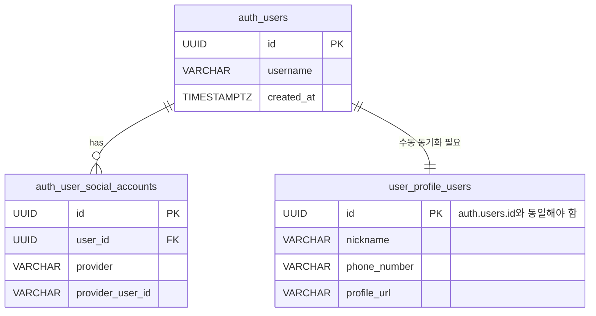
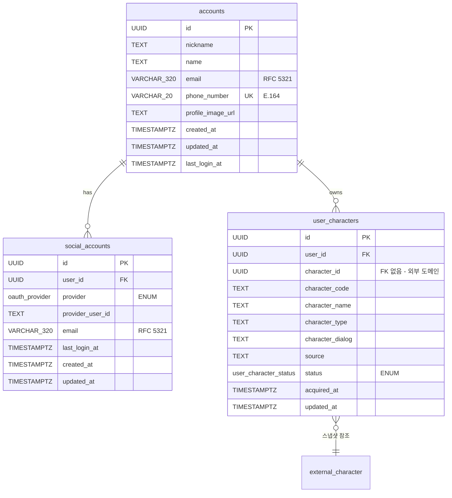
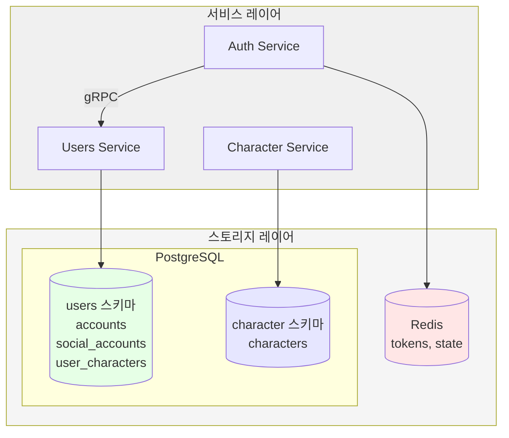
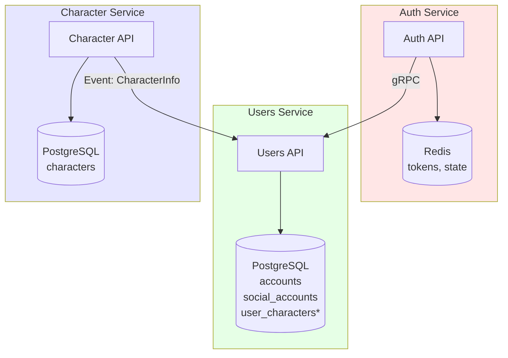
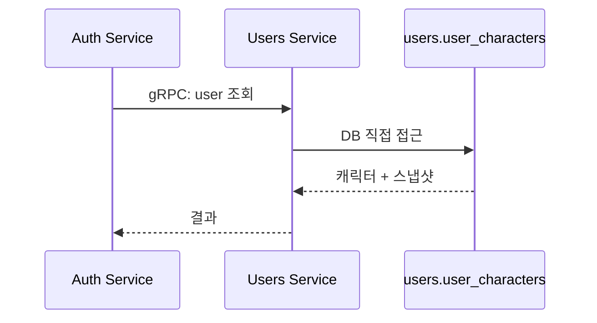
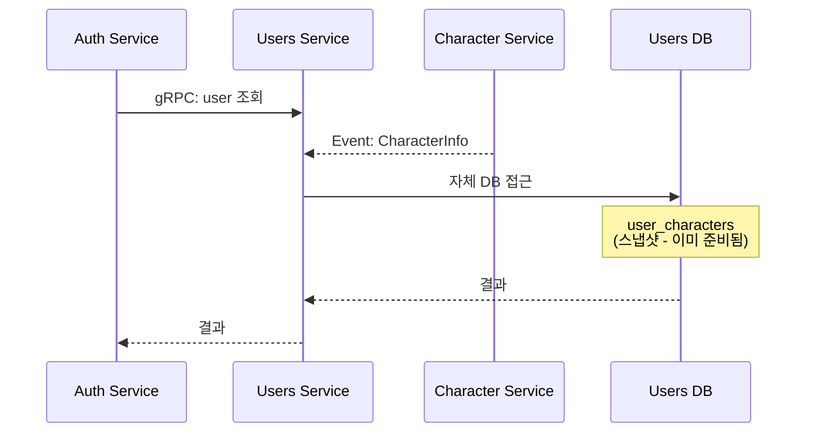
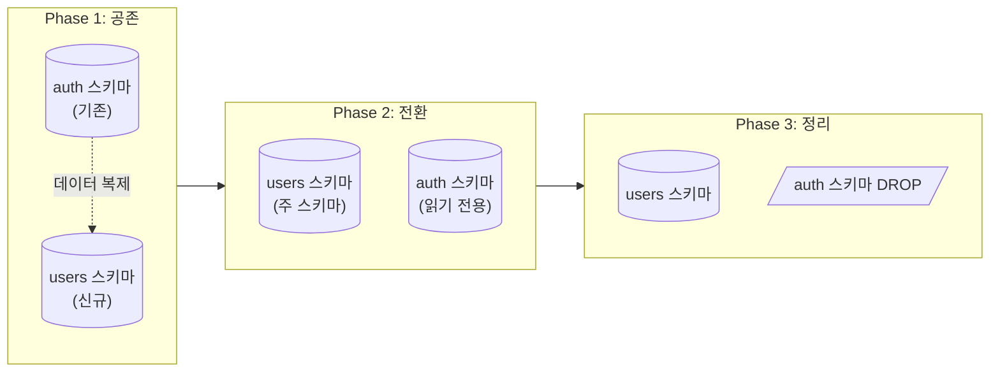
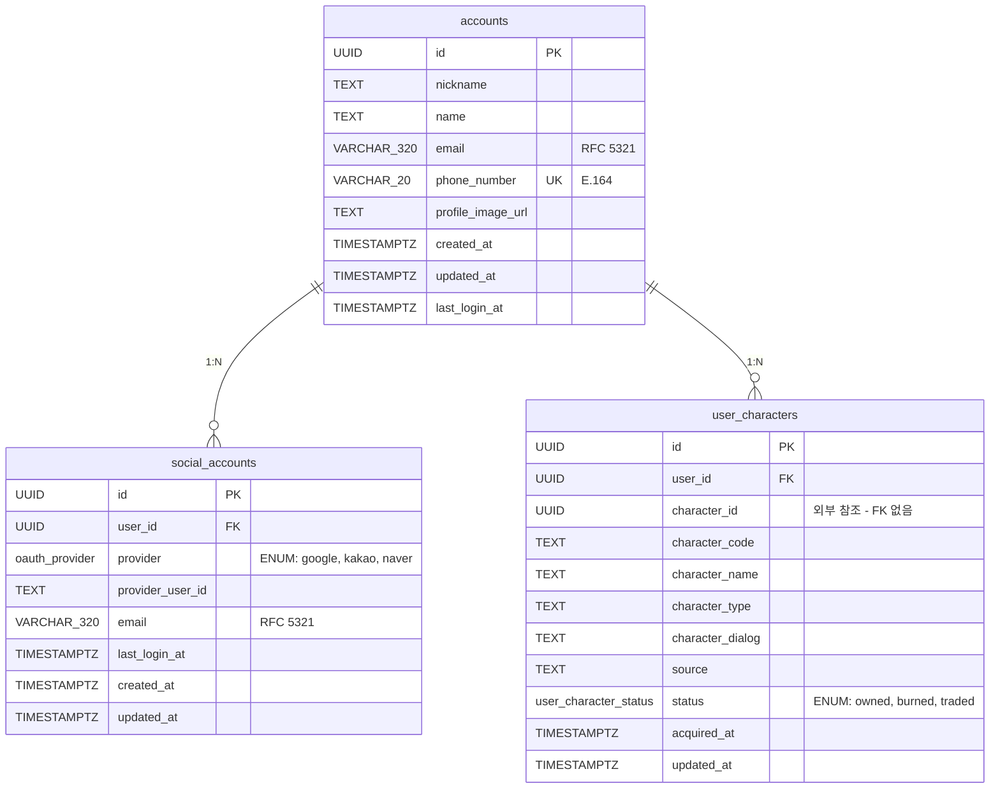

# Clean Architecture #10: Auth/Users 스키마 정규화

> Auth와 Users 도메인의 스키마 통합 과정에서 정규화 수준을 결정하고, 데이터 타입을 개선한 과정을 기록합니다.

---

## 1. 스키마 통합 배경

### AS-IS: 분산된 사용자 정보



**문제: auth.users.id와 user_profile.users.id 수동 동기화 필요**

### 문제점

| 문제 | 설명 |
|------|------|
| **ID 동기화** | auth.users.id와 user_profile.users.id 수동 동기화 필요 |
| **트랜잭션 분리** | 회원가입 시 두 스키마에 걸쳐 원자적 삽입 어려움 |
| **조인 복잡성** | 프로필 조회 시 cross-schema JOIN 필요 |
| **데이터 불일치** | 동기화 실패 시 orphan 레코드 발생 가능 |

### TO-BE: 통합 스키마



**통합 결과:**
- `auth.users` + `user_profile.users` → `users.accounts`
- `auth.user_social_accounts` → `users.social_accounts`
- `social_accounts`에 `UNIQUE(provider, provider_user_id)` 제약

---

## 2. 정규화 수준 분석

### 2.1 정규화 단계

| 단계 | 조건 | accounts | social_accounts | user_characters |
|------|------|----------|-----------------|-----------------|
| **1NF** | 원자값, 중복 그룹 없음 | ✅ | ✅ | ✅ |
| **2NF** | 완전 함수 종속 | ✅ | ✅ | ✅ |
| **3NF** | 이행 종속 없음 | ✅ | ✅ | ⚠️ |
| **BCNF** | 모든 결정자가 후보키 | ✅ | ✅ | ⚠️ |

### 2.2 user_characters의 비정규화

```sql
-- user_characters 테이블
CREATE TABLE users.user_characters (
    id UUID PRIMARY KEY,
    user_id UUID NOT NULL,
    character_id UUID NOT NULL,          -- FK 역할 (실제 FK 없음)
    
    -- 비정규화된 캐릭터 정보 (스냅샷, TEXT 기본)
    character_code TEXT NOT NULL,
    character_name TEXT NOT NULL,
    character_type TEXT,
    character_dialog TEXT,
    source TEXT,
    
    status user_character_status NOT NULL,  -- ENUM
    acquired_at TIMESTAMPTZ NOT NULL,
    updated_at TIMESTAMPTZ NOT NULL
);
```

**비정규화 이유:**

| 관점 | 설명 |
|------|------|
| **도메인 분리** | users는 character 도메인에 의존하지 않음 |
| **읽기 성능** | character 테이블 JOIN 없이 조회 가능 |
| **히스토리 보존** | 획득 시점의 캐릭터 정보 스냅샷 |
| **서비스 분리 대비** | Database per Service 전환 용이 |

---

## 3. 데이터 타입 개선

### 3.1 ENUM 타입 도입

**AS-IS (VARCHAR):**
```python
Column("provider", String(32))  # 'google', 'kakao', 'naver'
Column("status", String(20))    # 'owned', 'burned', 'traded'
```

**TO-BE (ENUM):**
```python
class OAuthProvider(str, Enum):
    GOOGLE = "google"
    KAKAO = "kakao"
    NAVER = "naver"

class UserCharacterStatus(str, Enum):
    OWNED = "owned"
    BURNED = "burned"
    TRADED = "traded"

Column("provider", Enum(OAuthProvider, native_enum=True))
Column("status", Enum(UserCharacterStatus, native_enum=True))
```

**ENUM 적용 기준:**

| 조건 | 적용 여부 |
|------|----------|
| 값의 집합이 고정됨 | ✅ 적용 |
| 값 추가가 드묾 | ✅ 적용 |
| 외부에서 동적으로 값이 들어옴 | ❌ VARCHAR 유지 |

**적용 결과:**

| 필드 | AS-IS | TO-BE | 이유 |
|------|-------|-------|------|
| `provider` | VARCHAR(32) | ENUM | 고정 값 (google, kakao, naver) |
| `status` | VARCHAR(20) | ENUM | 고정 값 (owned, burned, traded) |
| `character_type` | VARCHAR(64) | **VARCHAR 유지** | CSV에서 동적 값 |

### 3.2 TEXT vs VARCHAR

#### PostgreSQL의 특성

PostgreSQL에서 `VARCHAR(n)`과 `TEXT`는 **성능상 차이가 거의 없습니다**:

| 항목 | VARCHAR(n) | TEXT |
|------|------------|------|
| 저장 방식 | 동일 (varlena) | 동일 (varlena) |
| 성능 | 동일 | 동일 |
| 길이 검증 | DB 레벨에서 체크 | 없음 |
| 스키마 변경 | 길이 변경 시 ALTER 필요 | 유연함 |

#### 두 가지 전략 비교

**전략 A: 명시적 길이 제한**

| 장점 | 단점 |
|------|------|
| DB 레벨 데이터 무결성 | 스키마 변경 비용 |
| 문서화 효과 (의도 명시) | 예상치 못한 길이 초과 에러 |
| 표준 규격 명시 가능 | 관리 포인트 증가 |

```python
Column("email", String(320))        # RFC 5321 표준
Column("phone_number", String(20))  # E.164 표준
Column("nickname", String(120))
```

**전략 B: Unbounded String (현재 선택)**

PostgreSQL의 특성을 활용하여 **길이 제한 없는 `TEXT`**를 기본으로 사용합니다.
불필요한 길이 제한 관리를 피하고 스키마 유연성을 확보하는 전략입니다.

| 장점 | 단점 |
|------|------|
| 스키마 관리 유연성 | DB 레벨 검증 없음 |
| ALTER TABLE 불필요 | 애플리케이션 레벨 검증 필요 |
| 예상치 못한 에러 감소 | 의도가 코드에서만 보임 |

```python
# Unbounded String 스타일
Column("nickname", Text)            # 길이 제한 없음
Column("name", Text)                # 길이 제한 없음
Column("character_code", Text)      # 길이 제한 없음
```

**추가 기법: CITEXT**

대소문자 구분 없는 식별자에 PostgreSQL 확장 타입 `CITEXT` 사용:

```sql
-- 애플리케이션에서 lower() 처리 불필요
name CITEXT NOT NULL UNIQUE
```

| 필드 | 일반 TEXT | CITEXT |
|------|-----------|--------|
| 'Admin' vs 'admin' | 다른 값 | 같은 값 |
| UNIQUE 제약 | 대소문자 구분 | 대소문자 무시 |
| 검색 | `WHERE lower(name) = lower(?)` | `WHERE name = ?` |

#### 현재 프로젝트의 선택

**TEXT 기본 전략**: 표준 규격이 명확한 필드만 VARCHAR, 나머지는 **TEXT**

| 필드 | 타입 | 이유 |
|------|------|------|
| `email` | VARCHAR(320) | RFC 5321 표준 |
| `phone_number` | VARCHAR(20) | E.164 표준 |
| `nickname`, `name` | **TEXT** | 길이 제한 불필요 |
| `profile_image_url` | **TEXT** | URL 길이 다양 |
| `character_*` | **TEXT** | 스냅샷, 길이 예측 어려움 |
| `provider_user_id` | **TEXT** | OAuth 제공자별 상이 |

> **향후 고려사항**
> - nickname에 CITEXT 적용 검토 (대소문자 무시 유일성)

### 3.3 TIMESTAMPTZ 설계

#### TIMESTAMP vs TIMESTAMPTZ

| 타입 | 저장 방식 | 조회 시 | 권장 |
|------|----------|--------|------|
| `TIMESTAMP` | 입력값 그대로 | 그대로 반환 | ❌ |
| `TIMESTAMPTZ` | 타임존 정보 포함 저장 | 세션 타임존으로 변환 | ✅ |

**TIMESTAMPTZ 선택 이유:**
- 타임존 정보 보존
- 서버/클라이언트 타임존 독립적
- 정확한 시간 비교 가능

#### 타임존 설정 (KST)

```sql
-- PostgreSQL 세션 타임존 설정
SET timezone = 'Asia/Seoul';

-- 또는 postgresql.conf
timezone = 'Asia/Seoul'
```

```python
# SQLAlchemy 연결 시 타임존 설정
engine = create_async_engine(
    DATABASE_URL,
    connect_args={"options": "-c timezone=Asia/Seoul"}
)
```

#### updated_at 자동 갱신

**옵션 A: 애플리케이션 수동 갱신 (현재)**
```python
# SQLAlchemy onupdate
Column("updated_at", DateTime(timezone=True), onupdate=func.now())
```

**옵션 B: PostgreSQL 트리거 자동 갱신**
```sql
-- 트리거 함수 생성
CREATE OR REPLACE FUNCTION update_updated_at_column()
RETURNS TRIGGER AS $$
BEGIN
    NEW.updated_at = NOW();
    RETURN NEW;
END;
$$ language 'plpgsql';

-- 각 테이블에 트리거 적용
CREATE TRIGGER update_accounts_updated_at
    BEFORE UPDATE ON users.accounts
    FOR EACH ROW EXECUTE FUNCTION update_updated_at_column();
```

| 방식 | 장점 | 단점 |
|------|------|------|
| 애플리케이션 | 명시적, 제어 가능 | 누락 가능성 |
| 트리거 | 자동화, 누락 없음 | DB 의존성 |

**현재 선택: 애플리케이션 (SQLAlchemy `onupdate`)**

#### 시간 필드 인덱스 고려

| 필드 | 인덱스 필요성 | 사용 사례 |
|------|-------------|----------|
| `created_at` | ⚠️ 선택적 | 최신 가입자 조회, 기간별 통계 |
| `updated_at` | ❌ 불필요 | 거의 조회 안 함 |
| `last_login_at` | ⚠️ 선택적 | 휴면 계정 탐지, 활성 사용자 통계 |
| `acquired_at` | ⚠️ 선택적 | 최근 획득 캐릭터 조회 |

**현재 결정: 인덱스 미추가**
- 이유: 초기 데이터 적음, 필요 시 추가 (premature optimization 방지)
- 향후: 쿼리 패턴 분석 후 추가 검토

### 3.4 최종 타입 규칙

```python
# 기본: TEXT (Unbounded String)
Column("nickname", Text)
Column("name", Text)
Column("profile_image_url", Text)
Column("character_code", Text)
Column("character_name", Text)
Column("character_type", Text)
Column("character_dialog", Text)
Column("source", Text)
Column("provider_user_id", Text)

# 예외: VARCHAR (표준 규격 존재)
Column("email", String(320))        # RFC 5321: 64(local) + 1(@) + 255(domain)
Column("phone_number", String(20))  # E.164: +국가코드 + 최대 15자리

# ENUM (고정 값)
Column("provider", Enum(OAuthProvider))
Column("status", Enum(UserCharacterStatus))

# 향후 CITEXT 고려
# Column("nickname", CITEXT)  # 대소문자 무시 유일성
```

---

## 4. 서비스 분리 시나리오

### 4.1 현재: Shared Database + gRPC



**핵심: Auth는 users 스키마에 직접 접근하지 않고 gRPC로 Users 서비스 호출**

| 장점 | 단점 |
|------|------|
| 서비스 간 명확한 경계 | gRPC 호출 오버헤드 |
| users 스키마 캡슐화 | 네트워크 장애 고려 필요 |
| Users 서비스 독립 배포 가능 | 트랜잭션 분리 |

### 4.2 Database per Service로 분리 시



> **\* user_characters**: 캐릭터 스냅샷 데이터로, character 도메인 분리 후에도 독립적 조회 가능

### 4.3 user_characters가 이미 분리 대비된 이유

```python
# user_characters 테이블 설계
user_characters_table = Table(
    "user_characters",
    metadata,
    Column("user_id", UUID),          # 내부 FK
    Column("character_id", UUID),     # 외부 참조 (FK 없음!)
    
    # 스냅샷 데이터 (character 서비스 분리 대비, TEXT 기본)
    Column("character_code", Text),
    Column("character_name", Text),
    Column("character_type", Text),
    Column("character_dialog", Text),
)
```

**character_id에 FK가 없는 이유:**

1. **도메인 독립성**: users 스키마는 character 스키마를 참조하지 않음
2. **서비스 분리 대비**: character 서비스가 분리되어도 스키마 변경 없음
3. **데이터 완결성**: 스냅샷으로 독립적 조회 가능

### 4.4 분리 시 데이터 동기화 패턴

**캐릭터 획득 플로우:**

현재 (Shared DB):



분리 후 (Database per Service):



**동기화 옵션:**

| 패턴 | 설명 | 사용 시점 |
|------|------|----------|
| **Event Sourcing** | CharacterUpdated 이벤트 구독 | 비동기 동기화 |
| **API Call** | 조회 시 Character 서비스 호출 | 실시간 데이터 필요 |
| **Materialized View** | Read Model 별도 구성 | CQRS 패턴 |
| **Snapshot (현재)** | 획득 시점 데이터 저장 | 히스토리 보존 |

---

## 5. 선택 근거 요약

### 5.1 왜 users 스키마로 통합했는가?

| 기준 | 결정 |
|------|------|
| **데이터 주인** | 사용자 정보의 주인은 users 도메인 |
| **트랜잭션** | 회원가입/프로필 업데이트 단일 트랜잭션 |
| **JOIN 최소화** | 프로필 조회 시 cross-schema JOIN 제거 |
| **마이그레이션** | auth.users → users.accounts 데이터 이관 |

### 5.2 왜 3NF를 완전히 적용하지 않았는가?

| 테이블 | 정규화 수준 | 이유 |
|--------|------------|------|
| accounts | 3NF | 핵심 엔티티, 완전 정규화 |
| social_accounts | 3NF | 1:N 관계, FK로 참조 |
| user_characters | **2NF** | 도메인 분리, 스냅샷 패턴 |

**user_characters 비정규화 트레이드오프:**

| 장점 | 단점 |
|------|------|
| 조회 성능 | 데이터 중복 |
| 도메인 독립성 | 동기화 비용 (선택적) |
| 서비스 분리 용이 | 저장 공간 |
| 히스토리 보존 | |

### 5.3 왜 ENUM을 선택적으로 적용했는가?

| 필드 | ENUM 적용 | 이유 |
|------|----------|------|
| provider | ✅ | OAuth 제공자 고정 (google, kakao, naver) |
| status | ✅ | 캐릭터 상태 고정 (owned, burned, traded) |
| character_type | ❌ | CSV 카탈로그에서 동적으로 정의 |

---

## 6. 마이그레이션 전략

### 6.1 Parallel Running (공존) 전략

기존 `auth` 스키마와 새로운 `users` 스키마가 **마이그레이션 기간 동안 공존**합니다.



### 6.2 마이그레이션 단계

| Phase | 상태 | auth 스키마 | users 스키마 | 애플리케이션 |
|-------|------|-------------|--------------|--------------|
| **1. 공존** | 현재 | 읽기/쓰기 | 읽기/쓰기 | 양쪽 모두 접근 |
| **2. 전환** | 목표 | 읽기 전용 | 주 스키마 | users 우선 접근 |
| **3. 정리** | 완료 | DROP | 단일 스키마 | users만 접근 |

### 6.3 공존 기간 데이터 동기화

```sql
-- V003 마이그레이션: auth → users 데이터 복제
INSERT INTO users.accounts (...)
SELECT ... FROM auth.users
LEFT JOIN user_profile.users ON ...
ON CONFLICT (id) DO NOTHING;

INSERT INTO users.social_accounts (...)
SELECT ... FROM auth.user_social_accounts
ON CONFLICT (provider, provider_user_id) DO NOTHING;
```

### 6.4 공존 전략의 장점

| 장점 | 설명 |
|------|------|
| **무중단 배포** | 기존 서비스 영향 없이 점진적 전환 |
| **롤백 가능** | 문제 발생 시 auth 스키마로 복귀 가능 |
| **검증 기간** | 신규 스키마 안정성 확인 후 전환 |
| **점진적 코드 마이그레이션** | 애플리케이션 코드도 단계적 변경 |

### 6.5 스키마 파일 구성

```
migrations/
├── schemas/
│   ├── auth_schema.sql       # 기존 스키마 (deprecated 예정)
│   └── users_schema.sql      # 신규 통합 스키마
└── V003__create_users_schema.sql  # 마이그레이션 스크립트
```

> **Note**: `auth_schema.sql`은 마이그레이션 완료 후 DROP 예정이며,
> 현재는 롤백 및 레퍼런스 용도로 유지합니다.

---

## 7. 최종 스키마

### ERD



### DDL

```sql
-- users.accounts (3NF)
CREATE TABLE users.accounts (
    id UUID PRIMARY KEY,
    nickname TEXT,                          -- Unbounded
    name TEXT,                              -- Unbounded
    email VARCHAR(320),                     -- RFC 5321
    phone_number VARCHAR(20) UNIQUE,        -- E.164
    profile_image_url TEXT,                 -- Unbounded
    created_at TIMESTAMPTZ DEFAULT NOW(),
    updated_at TIMESTAMPTZ DEFAULT NOW(),
    last_login_at TIMESTAMPTZ
);

-- users.social_accounts (3NF)
CREATE TABLE users.social_accounts (
    id UUID PRIMARY KEY,
    user_id UUID NOT NULL REFERENCES users.accounts(id) ON DELETE CASCADE,
    provider oauth_provider NOT NULL,       -- ENUM
    provider_user_id TEXT NOT NULL,         -- Unbounded (OAuth 제공자별 상이)
    email VARCHAR(320),                     -- RFC 5321
    last_login_at TIMESTAMPTZ,
    created_at TIMESTAMPTZ DEFAULT NOW(),
    updated_at TIMESTAMPTZ DEFAULT NOW(),
    UNIQUE(provider, provider_user_id)
);

-- users.user_characters (2NF, 의도적 비정규화)
CREATE TABLE users.user_characters (
    id UUID PRIMARY KEY,
    user_id UUID NOT NULL,                  -- FK 가능하나 현재 미설정
    character_id UUID NOT NULL,             -- FK 없음 (도메인 분리)
    
    -- 캐릭터 스냅샷 (비정규화, 모두 TEXT)
    character_code TEXT NOT NULL,
    character_name TEXT NOT NULL,
    character_type TEXT,
    character_dialog TEXT,
    source TEXT,
    
    status user_character_status NOT NULL DEFAULT 'owned',  -- ENUM
    acquired_at TIMESTAMPTZ DEFAULT NOW(),
    updated_at TIMESTAMPTZ DEFAULT NOW()
);

-- ENUM 정의
CREATE TYPE oauth_provider AS ENUM ('google', 'kakao', 'naver');
CREATE TYPE user_character_status AS ENUM ('owned', 'burned', 'traded');
```

### 인덱스 전략

| 테이블 | 인덱스 | 선택 이유 |
|--------|--------|----------|
| **accounts** | `phone_number` (UNIQUE) | 제약조건으로 자동 생성, 전화번호 중복 방지 |
| **accounts** | `nickname` (Partial) | 닉네임 검색, NULL 제외로 불필요한 인덱스 크기 감소 |
| **accounts** | `email` (Partial) | 이메일 조회, NULL 제외 |
| **social_accounts** | `user_id` | 사용자별 연동 계정 조회 (1:N 관계) |
| **social_accounts** | `provider` | 제공자별 통계/필터링 |
| **social_accounts** | `(provider, provider_user_id)` (UNIQUE) | 복합 유니크 제약, OAuth 로그인 시 조회 |
| **user_characters** | `user_id` | 사용자별 보유 캐릭터 조회 (메인 쿼리) |
| **user_characters** | `character_id` | 특정 캐릭터 보유자 조회 |
| **user_characters** | `character_code` | 코드 기반 캐릭터 검색 |

```sql
-- accounts 인덱스 (Partial Index 활용)
CREATE INDEX idx_accounts_nickname ON users.accounts(nickname) 
    WHERE nickname IS NOT NULL;  -- NULL 제외로 인덱스 크기 최적화
CREATE INDEX idx_accounts_email ON users.accounts(email) 
    WHERE email IS NOT NULL;

-- social_accounts 인덱스
CREATE INDEX idx_social_user_id ON users.social_accounts(user_id);
    -- 이유: 사용자별 연동 계정 조회 (프로필 페이지)
CREATE INDEX idx_social_provider ON users.social_accounts(provider);
    -- 이유: OAuth 제공자별 통계, 관리자 대시보드
CREATE INDEX idx_social_provider_user ON users.social_accounts(provider, provider_user_id);
    -- 이유: OAuth 로그인 시 기존 계정 조회 (복합 키 커버링)

-- user_characters 인덱스
CREATE INDEX idx_characters_user_id ON users.user_characters(user_id);
    -- 이유: "내 캐릭터 목록" 조회 (가장 빈번한 쿼리)
CREATE INDEX idx_characters_character_id ON users.user_characters(character_id);
    -- 이유: "이 캐릭터를 가진 사용자" 조회 (어드민, 통계)
CREATE INDEX idx_characters_code ON users.user_characters(character_code);
    -- 이유: 캐릭터 코드 기반 검색 (CSV 연동)
```

---

## 8. 요약

### 8.1 주요 결정

| 결정 | 선택 | 이유 |
|------|------|------|
| 스키마 통합 | auth + user_profile → users | 데이터 주인, 트랜잭션 단순화 |
| accounts 정규화 | 3NF | 핵심 엔티티, 일관성 |
| user_characters 정규화 | 2NF (비정규화) | 도메인 분리, 서비스 분리 대비 |
| provider, status | ENUM | 고정 값, 타입 안전성 |
| **문자열 기본 타입** | **TEXT** | Unbounded String 전략 |
| email, phone | VARCHAR (표준 길이) | RFC 5321, E.164 |

### 8.2 String 타입 전략

**현재 프로젝트 선택: TEXT 기본 전략**

| 타입 | 적용 대상 | 이유 |
|------|----------|------|
| **TEXT** | nickname, name, character_*, source 등 | 기본 (Unbounded) |
| **VARCHAR(n)** | email, phone_number | 표준 규격 존재 (RFC/E.164) |
| **ENUM** | provider, status | 고정 값, 타입 안전성 |

> PostgreSQL에서 VARCHAR(n)과 TEXT는 성능 동일 (varlena 저장).
> TEXT 기본 전략으로 스키마 관리 유연성 확보, ALTER TABLE 비용 제거.
