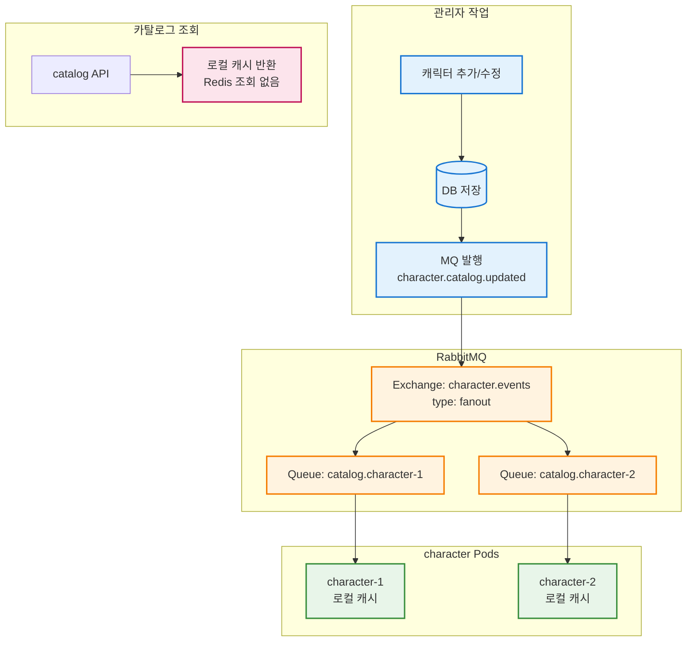

# 이코에코(Eco²) 비동기 전환 #1: MQ 적용 가능 영역 분석

> 이전 글: [RabbitMQ + Celery 아키텍처 설계](./00-rabbitmq-celery-architecture.md)

---

## 개요

[RabbitMQ + Celery 아키텍처 설계](./00-rabbitmq-celery-architecture.md)에서는 Chat/Scan API의 AI 파이프라인을 비동기로 전환하는 계획을 수립했다. 그러나 MQ 도입의 효과는 AI 파이프라인에만 국한되지 않는다.

본 글에서는 이코에코 백엔드 전체를 분석하여 **RabbitMQ 적용으로 개선할 수 있는 영역**을 도출하고, 우선순위를 정한다.

### 분석 대상

| 도메인 | 역할 | 현재 부하 특성 |
|--------|------|---------------|
| **chat** | 폐기물 분류 챗봇 | GPT API 호출 (10~30초) |
| **scan** | 이미지 스캔 + 리워드 | GPT API + gRPC 호출 |
| **character** | 캐릭터 발급 + 동기화 | DB + gRPC 호출 |
| **image** | 이미지 업로드 | S3 Presigned URL |
| **location** | 위치 검색 | PostGIS 쿼리 |
| **my** | 사용자 프로필 | CRUD |
| **auth** | 인증/인가 | Redis 블랙리스트 |
| **ext-authz** | JWT 검증 | Redis 조회 (1,100 RPS) |

---

## 1. ext-authz: Local Cache + MQ Event Broadcasting

### 현재 상태

[ext-authz 성능 튜닝](https://rooftopsnow.tistory.com/24)에서 **Redis Pool Size 튜닝**과 **HPA 수평 확장**으로 성능을 개선했다.

```
[현재 튜닝된 구조]
모든 API 요청 → ext-authz → Redis EXISTS blacklist:{jti}
                               ↓
                         Redis Pool (PoolSize: 200, MinIdleConns: 50)
```

| 지표 | 튜닝 전 | 튜닝 후 | 비고 |
|------|---------|---------|------|
| Redis PoolSize | 20 | **200** | 10배 증가 |
| MinIdleConns | 0 | **50** | Cold Start 방지 |
| PoolTimeout | 4s | **2s** | 빠른 실패 (Backpressure) |
| 달성 RPS | ~450 | **1,100+** | 단일 노드 기준 |
| p99 Latency | 500ms+ | **250~350ms** | 부하 시 |
| Success Rate | 95% | **99.8%** | |

### 현재 아키텍처의 근본적 한계

Redis Pool 튜닝으로 단기적 병목은 해소했으나, **Redis 싱글 스레드 특성**으로 인한 구조적 한계가 존재한다:

```
┌────────────────────────────────────────────────────────────────┐
│                    Redis 싱글 커맨드 큐 병목                      │
├────────────────────────────────────────────────────────────────┤
│                                                                │
│  ext-authz-1 ──┐                                               │
│  ext-authz-2 ──┼──▶ Redis (싱글 스레드) ──▶ [커맨드 큐] ──▶ 순차 처리 │
│  ext-authz-3 ──┘                              ↑                 │
│                                          여기가 병목!            │
│                                                                │
│  Pool Size를 늘려도, HPA로 파드를 확장해도                         │
│  Redis 내부에서는 O(n) 순차 처리                                  │
│                                                                │
└────────────────────────────────────────────────────────────────┘
```

| 한계 | 설명 | 영향 |
|------|------|------|
| **Redis 싱글 스레드** | 모든 명령어가 순차 처리됨 | 연결 수 증가해도 처리량 한계 |
| **매 요청 Redis 호출** | 모든 JWT 검증 시 네트워크 I/O | RTT 누적 (1-10ms/요청) |
| **수평 확장 시 비용** | Pod당 Redis 연결 200개 × Pod 수 | Redis 연결 폭증 |
| **Redis 장애 전파** | Redis 다운 시 전체 인증 실패 | 가용성 저하 |

### 해결책: Local Cache + MQ Event Broadcasting

**핵심 아이디어**: 읽기 경로에서 Redis를 완전히 제거한다.

```
┌─────────────────────────────────────────────────────────────────┐
│                     쓰기 경로 (로그아웃 시)                        │
└─────────────────────────────────────────────────────────────────┘

auth-api ──▶ Redis (저장) ──▶ MQ (fanout) ──┬──▶ ext-authz-1 (로컬 캐시)
                                           ├──▶ ext-authz-2 (로컬 캐시)
                                           └──▶ ext-authz-3 (로컬 캐시)

┌─────────────────────────────────────────────────────────────────┐
│                     읽기 경로 (매 API 요청)                       │
└─────────────────────────────────────────────────────────────────┘

Request ──▶ ext-authz-1 ──▶ 로컬 캐시 조회 (O(1), <0.1ms)
                                ↓
                           Redis 조회 없음!
```

### 동기화 방식: Polling이 아닌 Event-Driven Push

**중요**: 매번 Redis에서 동기화하는 게 아니다.

| 시점 | Redis 조회 | MQ 사용 |
|------|-----------|---------|
| 파드 시작 | ✅ 한 번 (초기 로딩) | ❌ |
| 로그아웃 발생 | ❌ | ✅ 이벤트 수신 |
| 토큰 검증 (매 요청) | ❌ 없음! | ❌ |

```mermaid
flowchart TB
    classDef authStyle fill:#e3f2fd,stroke:#1976d2,stroke-width:2px
    classDef rmqStyle fill:#fff3e0,stroke:#f57c00,stroke-width:2px
    classDef extAuthzStyle fill:#fce4ec,stroke:#c2185b,stroke-width:2px
    classDef redisStyle fill:#ffebee,stroke:#d32f2f,stroke-width:2px
    classDef localStyle fill:#e8f5e9,stroke:#388e3c,stroke-width:2px

    subgraph Init["1️⃣ 초기 로딩 (파드 시작 시 1회)"]
        STARTUP[ext-authz 시작]
        REDIS_SCAN[(Redis SCAN<br/>blacklist:*)]
        LOCAL_INIT[로컬 캐시 초기화]
    end

    subgraph Sync["2️⃣ 실시간 동기화 (이벤트 기반)"]
        subgraph Auth["Auth Service"]
            LOGOUT[로그아웃 처리]
            REDIS_SET[(Redis SETEX)]
            MQ_PUB[MQ 발행]
        end

        subgraph MQ["RabbitMQ"]
            EX[Exchange: auth.events<br/>type: fanout]
            Q1[Queue: blacklist.ext-authz-1]
            Q2[Queue: blacklist.ext-authz-2]
            Q3[Queue: blacklist.ext-authz-3]
        end

        subgraph Workers["ext-authz Pods"]
            W1[ext-authz-1<br/>로컬 캐시]
            W2[ext-authz-2<br/>로컬 캐시]
            W3[ext-authz-3<br/>로컬 캐시]
        end
    end

    subgraph Read["3️⃣ 토큰 검증 (매 요청)"]
        REQ[API 요청]
        CHECK[ext-authz]
        LOCAL_CHECK[로컬 캐시 조회<br/>O(1), <0.1ms]
        RESULT[검증 결과]
    end

    STARTUP --> REDIS_SCAN
    REDIS_SCAN --> LOCAL_INIT

    LOGOUT --> REDIS_SET
    LOGOUT --> MQ_PUB
    MQ_PUB --> EX
    EX --> Q1
    EX --> Q2
    EX --> Q3
    Q1 --> W1
    Q2 --> W2
    Q3 --> W3

    REQ --> CHECK
    CHECK --> LOCAL_CHECK
    LOCAL_CHECK --> RESULT

    class LOGOUT,REDIS_SET,MQ_PUB authStyle
    class EX,Q1,Q2,Q3 rmqStyle
    class STARTUP,CHECK extAuthzStyle
    class REDIS_SCAN redisStyle
    class LOCAL_INIT,LOCAL_CHECK,W1,W2,W3,RESULT localStyle
```

### 구현 예시 (Go)

```go
// 로컬 캐시 구조체
type LocalBlacklistCache struct {
    mu    sync.RWMutex
    items map[string]int64  // jti -> expireAt unix timestamp
}

func (c *LocalBlacklistCache) Contains(jti string) bool {
    c.mu.RLock()
    defer c.mu.RUnlock()
    expireAt, exists := c.items[jti]
    return exists && time.Now().Unix() < expireAt
}

func (c *LocalBlacklistCache) Add(jti string, expireAt int64) {
    c.mu.Lock()
    c.items[jti] = expireAt
    c.mu.Unlock()
}
```

```go
// 검증 로직 변경
// Before: 매번 Redis 조회
func (s *AuthzService) IsBlacklisted(jti string) bool {
    return s.redis.Exists(ctx, "blacklist:"+jti).Val() > 0  // 네트워크 I/O
}

// After: 로컬 메모리 조회
func (s *AuthzService) IsBlacklisted(jti string) bool {
    return s.localCache.Contains(jti)  // O(1), <0.1ms
}
```

```go
// 파드 시작 시 초기화
func (s *AuthzService) Initialize() error {
    // 1. Redis에서 전체 블랙리스트 로드 (1회성)
    keys, _ := s.redis.Keys(ctx, "blacklist:*").Result()
    for _, key := range keys {
        ttl, _ := s.redis.TTL(ctx, key).Result()
        jti := strings.TrimPrefix(key, "blacklist:")
        s.localCache.Add(jti, time.Now().Add(ttl).Unix())
    }

    // 2. MQ 구독 시작 (이후 이벤트 기반 동기화)
    go s.subscribeBlacklistEvents()
    return nil
}

// MQ 이벤트 수신
func (s *AuthzService) subscribeBlacklistEvents() {
    ch, _ := s.mq.Consume("blacklist.events")
    for msg := range ch {
        var event BlacklistEvent
        json.Unmarshal(msg.Body, &event)
        s.localCache.Add(event.JTI, event.ExpireAt)
    }
}
```

### RabbitMQ 토폴로지

```yaml
Exchange:
  name: auth.blacklist.events
  type: fanout  # 모든 ext-authz 파드에 브로드캐스트

Queues:
  - name: blacklist.sync.{pod-id}  # 각 파드별 exclusive queue
    autoDelete: true               # 파드 종료 시 자동 삭제
    exclusive: true                # 단일 consumer만 허용
```

### ⚠️ Celery Task Queue와의 차이

**중요**: 이 패턴은 **Celery Task Queue가 아닌 RabbitMQ Fanout Exchange**를 사용한다.

```
┌─────────────────────────────────────────────────────────────────────────────┐
│  Celery Task Queue (AI 파이프라인용)                                         │
│  ─────────────────────────────────                                          │
│                                                                             │
│  scan-api ──▶ Exchange (direct) ──▶ scan.vision Queue ──▶ Worker-AI-1      │
│                                                            (혼자 처리!)    │
│                                                                             │
│  • "이 이미지 분류해줘" (Command)                                            │
│  • Competing Consumers: 하나의 Worker만 처리                                 │
│  • 처리 완료 후 메시지 삭제                                                  │
│                                                                             │
├─────────────────────────────────────────────────────────────────────────────┤
│  Event Broadcasting (ext-authz 동기화용)                                     │
│  ───────────────────────────────────────                                    │
│                                                                             │
│  auth-api ──▶ Exchange (fanout) ──┬──▶ Queue-1 ──▶ ext-authz-1 (로컬캐시)  │
│                                   ├──▶ Queue-2 ──▶ ext-authz-2 (로컬캐시)  │
│                                   └──▶ Queue-3 ──▶ ext-authz-3 (로컬캐시)  │
│                                                     (모두 처리!)           │
│                                                                             │
│  • "JTI xxx가 블랙리스트에 추가됐다" (Event)                                  │
│  • Fanout: 모든 구독자가 동일 이벤트 수신                                     │
│  • 각자 로컬 캐시 업데이트                                                   │
│                                                                             │
└─────────────────────────────────────────────────────────────────────────────┘
```

| 구분 | Celery Task Queue | Event Broadcasting |
|------|-------------------|-------------------|
| **목적** | 작업 분산 처리 | 상태 동기화 |
| **Exchange 타입** | Direct/Topic | **Fanout** |
| **처리 주체** | 하나의 Worker | **모든 인스턴스** |
| **메시지 의미** | "해라" (Command) | "일어났다" (Event) |
| **라이브러리** | Celery (Python) | amqp (Go 네이티브) |

**같은 RabbitMQ 클러스터**를 사용하지만 **다른 패턴**이다. Celery로 구현하면 하나의 Worker만 이벤트를 수신하여 나머지 Pod들의 로컬 캐시가 동기화되지 않는다.

### 왜 이게 가능한가?

블랙리스트는 **이벤트 소스가 단일**하다:

| 동작 | 소스 | 빈도 |
|------|------|------|
| 추가 | auth-api 로그아웃만 | 드묾 (사용자 행동) |
| 삭제 | TTL 만료 (자동) | - |
| 조회 | 모든 API 요청 | 매우 빈번 |

**읽기:쓰기 비율 = 99.99%:0.01%** → 쓰기 이벤트만 전파하면 완벽한 동기화.

### Eventual Consistency 허용 가능한 이유

1. **보안 위험 낮음**: 토큰 탈취 후 1-2초 내에 사용하는 공격은 극히 드묾
2. **TTL 기반**: 만료된 토큰은 JWT 서명 검증에서 이미 거부됨
3. **이중 방어**: Access Token 만료 시간이 짧음 (15분)

### 메모리 사용량 예측

| 항목 | 값 | 계산 |
|------|---|------|
| 동시 활성 세션 | ~10,000 | |
| JTI 크기 | ~36 bytes | UUID |
| expireAt 크기 | 8 bytes | int64 |
| 총 메모리 | **~440KB** | 10,000 × 44 bytes |

→ 무시할 수 있는 수준. 파드당 메모리 제한(128Mi) 대비 0.3%.

### 예상 개선 효과

| 지표 | 현재 (Redis 직접) | MQ + 로컬 캐시 | 개선율 |
|------|------------------|----------------|--------|
| 읽기 latency | 1-10ms (네트워크) | **<0.1ms** (메모리) | **100x** |
| Redis RPS | = API 전체 RPS | **≈ 0** (쓰기만) | **∞** |
| Redis 조회 비율 | 100% | **0%** | 100% |
| 예상 RPS 한계 | 1,100 (Redis 제한) | **10,000+** (CPU 제한) | **10x** |
| 수평 확장성 | Redis가 SPOF | **파드별 독립** | 무한 |

### Fallback 전략

MQ 장애 시에도 서비스 지속:

```go
func (s *AuthzService) IsBlacklisted(jti string) bool {
    // 1. 로컬 캐시 우선
    if s.localCache.Contains(jti) {
        return true
    }

    // 2. MQ 연결 끊김 시 Redis fallback
    if s.mqDisconnected.Load() {
        return s.redis.Exists(ctx, "blacklist:"+jti).Val() > 0
    }

    return false
}
```

### 우선순위: P1

- **변경 이유**: Redis 싱글 커맨드 큐 병목 해소가 RPS 증가의 핵심
- **의존성**: RabbitMQ 인프라 구축 후 바로 적용 가능
- **트리거**: 5,000+ RPS 목표 시 필수
- **리스크**: 낮음 (Redis를 fallback으로 유지)

---

## 2. gRPC 통신 전체 맵 및 MQ 전환 분석

### 현재 gRPC 통신 흐름

```
┌─────────────────────────────────────────────────────────────────────────────┐
│                        gRPC 내부 통신 전체 맵                                 │
├─────────────────────────────────────────────────────────────────────────────┤
│                                                                             │
│  ┌─────────┐    GetCharacterReward     ┌───────────┐    GrantCharacter     │
│  │  scan   │ ─────────────────────────▶│ character │ ────────────────────▶ │
│  └─────────┘    (동기, 응답 필요)        └───────────┘    (best-effort)      │
│                                              │                              │
│                                              │                              │
│                                              ▼                              │
│                                         ┌────────┐                          │
│                                         │   my   │                          │
│                                         └────────┘                          │
│                                              │                              │
│                                              │ GetDefaultCharacter          │
│                                              │ (신규 사용자 시)               │
│                                              ▼                              │
│                                         ┌───────────┐                       │
│                                         │ character │                       │
│                                         └───────────┘                       │
│                                                                             │
└─────────────────────────────────────────────────────────────────────────────┘
```

| 호출 | 방향 | 트리거 | 현재 상태 | MQ 전환 |
|------|------|--------|----------|---------|
| **GetCharacterReward** | scan → character | 스캔 완료 후 | 동기 gRPC | ❌ 응답 필요 |
| **GrantCharacter** | character → my | 캐릭터 발급 시 | best-effort + CB | ⚠️ 현재 유지 |
| **GetDefaultCharacter** | my → character | 신규 사용자 | gRPC + CB | ✅ P3 (아래) |

### scan → character (GetCharacterReward): 유지

```python
# scan/services/scan.py
async def _call_character_reward_api(self, reward_request):
    stub = await get_character_stub()
    response = await stub.GetCharacterReward(grpc_req, timeout=...)
    return CharacterRewardResponse(...)  # ← 사용자 응답에 포함
```

**유지 이유**:
- 사용자에게 **리워드 결과를 즉시 반환**해야 함
- MQ로 전환하면 Polling/WebSocket 필요 → 복잡도 증가

**대안 (향후)**:
- Scan 전체가 MQ 비동기 전환 시, Celery 체인 내에서 처리
- `scan_task.apply_async() → classify → evaluate_reward → save` 일괄 처리

### my → character (GetDefaultCharacter): 로컬 캐시 가능

```python
# my/services/characters.py
async def _ensure_default_character(self, user_id: UUID) -> bool:
    client = get_character_client()
    default_char = await client.get_default_character()  # ← 매번 gRPC 호출
    ...
```

**문제점**:
- 신규 사용자마다 기본 캐릭터 정보를 gRPC로 조회
- Circuit Breaker로 장애 격리되지만, 불필요한 네트워크 호출

**개선안**: 기본 캐릭터 정보(1개)를 로컬 캐시에 보관

```python
# my/core/local_cache.py
_default_character: DefaultCharacterInfo | None = None

async def get_default_character() -> DefaultCharacterInfo | None:
    global _default_character
    if _default_character is not None:
        return _default_character  # 로컬 캐시 hit

    # Fallback: gRPC 호출
    client = get_character_client()
    char = await client.get_default_character()
    _default_character = char
    return char

# MQ 이벤트 수신 시 갱신
async def on_default_character_updated(event):
    global _default_character
    _default_character = DefaultCharacterInfo(**event.payload)
```

**우선순위**: P3 (현재 Circuit Breaker로 충분히 안정적)

---

## 3. Character 카탈로그: Local Cache + MQ 동기화

### 현재 상태

character 서비스는 **캐릭터 카탈로그**를 Redis에 캐싱하고 있다 (Cache-aside 패턴).

```python
# character/services/character.py
async def catalog(self) -> list[CharacterProfile]:
    # 1. 캐시 조회
    cached = await get_cached(CATALOG_KEY)
    if cached is not None:
        return [CharacterProfile(**item) for item in cached]  # Cache hit

    # 2. DB 조회 (Cache miss)
    characters = await self.character_repo.list_all()
    profiles = [self._to_profile(character) for character in characters]

    # 3. 캐시 저장 (TTL 5분)
    await set_cached(CATALOG_KEY, [p.model_dump() for p in profiles])
    return profiles
```

### ext-authz와의 유사점

| 특성 | ext-authz 블랙리스트 | character 카탈로그 |
|------|---------------------|-------------------|
| **읽기:쓰기 비율** | 99.99%:0.01% | 99.9%:0.1% |
| **쓰기 빈도** | 로그아웃 시 | 캐릭터 추가/수정 (admin) |
| **데이터 크기** | ~10KB (10,000 JTI) | ~5KB (20개 캐릭터) |
| **현재 캐싱** | Redis 직접 조회 | Redis Cache-aside |
| **TTL** | 토큰 만료 시간 | 5분 |

→ **동일한 패턴 적용 가능**: 로컬 캐시 + MQ 이벤트 브로드캐스트

### 현재 아키텍처의 한계

```
┌────────────────────────────────────────────────────────────────┐
│                    현재: TTL 기반 캐시 갱신                       │
├────────────────────────────────────────────────────────────────┤
│                                                                │
│  character-1 ──┬──▶ Redis GET character:catalog                │
│  character-2 ──┤   (TTL 5분마다 Cache miss → DB 조회)           │
│  character-3 ──┘                                               │
│                                                                │
│  문제점:                                                        │
│  1. TTL 만료 시 동시 요청 → Thundering Herd (DB 과부하)          │
│  2. 캐릭터 수정 후 최대 5분간 구버전 노출                          │
│  3. Redis 장애 시 모든 파드가 DB 직접 조회                        │
│                                                                │
└────────────────────────────────────────────────────────────────┘
```

### MQ 기반 개선



### 구현 예시 (Python)

```python
# character/core/local_cache.py
from threading import RLock
from typing import Optional
import asyncio

class LocalCatalogCache:
    def __init__(self):
        self._lock = RLock()
        self._catalog: list[dict] | None = None

    def get(self) -> list[dict] | None:
        with self._lock:
            return self._catalog

    def set(self, catalog: list[dict]) -> None:
        with self._lock:
            self._catalog = catalog

_local_cache = LocalCatalogCache()

# character/services/character.py 수정
async def catalog(self) -> list[CharacterProfile]:
    # 1. 로컬 캐시 우선 (Redis 조회 없음)
    cached = _local_cache.get()
    if cached is not None:
        return [CharacterProfile(**item) for item in cached]

    # 2. Fallback: DB 조회 (초기 로딩 또는 캐시 미스)
    characters = await self.character_repo.list_all()
    profiles = [self._to_profile(character) for character in characters]
    _local_cache.set([p.model_dump() for p in profiles])
    return profiles

# MQ Consumer (lifespan에서 시작)
async def subscribe_catalog_events(mq_channel):
    async for message in mq_channel.consume("catalog.updates"):
        catalog_data = json.loads(message.body)
        _local_cache.set(catalog_data)
        message.ack()
```

### 예상 효과

| 지표 | 현재 (Redis Cache-aside) | MQ + 로컬 캐시 |
|------|-------------------------|----------------|
| 조회 latency | 1-5ms (Redis RTT) | **<0.1ms** |
| Redis 부하 | TTL 만료마다 조회 | **0** |
| 캐시 일관성 | TTL 기반 (최대 5분 지연) | **즉시 동기화** |
| Thundering Herd | 발생 가능 | **완전 제거** |

### 우선순위: P3 (Low)

- **이유**: 현재 Redis 캐시로 충분히 동작, 카탈로그 변경 빈도 낮음
- **트리거**: 캐릭터 추가/수정 빈도 증가 시, 또는 Redis 부하 이슈 시
- **의존성**: ext-authz MQ 구축 후 동일 인프라 재활용 가능

---

## 4. Image 후처리 파이프라인 (향후, P3)

### 현재 상태

현재 이미지 서비스는 **Presigned URL 발급**만 담당하며, 후처리는 없다.

```python
# image/services/image.py
async def create_upload_url(self, channel, request, uploader_id):
    key = self._build_object_key(channel.value, request.filename)
    upload_url = self._s3_client.generate_presigned_url(...)  # ~50ms
    return ImageUploadResponse(upload_url=upload_url, cdn_url=cdn_url)
```

### 향후 확장 시 MQ 필요

현재 CDN(CloudFront)에서 이미지 캐싱을 수행 중이다. 서비스 고도화 시 다음 후처리 작업이 추가될 수 있다:

| 작업 | 예상 시간 | MQ 적용 | 비고 |
|------|----------|---------|------|
| 썸네일 생성 | 1~3초 | ✅ | PIL/Pillow |
| 이미지 리사이즈 | 1~2초 | ✅ | 다양한 해상도 |
| EXIF 메타데이터 추출 | <1초 | ⚠️ 선택적 | 동기 처리 가능 |
| AI 이미지 분석 | 5~15초 | ✅ | 중복 이미지 탐지 등 |
| CDN 캐시 Invalidation | <1초 | ✅ | 이미지 업데이트 시 |

### 우선순위: P3 (Low)

- **이유**: 현재 후처리 요구사항 없음
- **트리거**: 서비스 고도화 시 재검토

---

## 5. Location 데이터 색인 갱신 (향후, P3)

### 현재 상태

위치 데이터는 **정적 데이터셋**으로, 초기 Job으로 색인된다.

```python
# location/jobs/import_*.py
# 초기 구동 시 CSV → PostGIS 색인
```

### 향후 확장 시 MQ 필요

| 시나리오 | MQ 필요성 | 비고 |
|----------|----------|------|
| 사용자 위치 제보 | ✅ 비동기 검증 + 색인 | 스팸/악성 필터링 |
| 외부 API 동기화 | ✅ 배치 처리 | Rate Limit 대응 |

### 우선순위: P3 (Low)

- **이유**: 현재 정적 데이터로 운영
- **트리거**: 실시간 데이터 요구사항 발생 시

---

## 적용 우선순위 종합

### 의사결정 프레임워크

MQ 적용 우선순위는 다음 기준으로 결정했다:

| 기준 | 가중치 | 설명 |
|------|--------|------|
| **사용자 영향** | 40% | 직접적인 UX 개선 여부 |
| **시스템 안정성** | 30% | 장애 격리, 재시도, 정합성 |
| **구현 복잡도** | 20% | 기존 코드 변경량, 리스크 |
| **의존성** | 10% | 선행 작업 필요 여부 |

### 우선순위 매트릭스 (RabbitMQ 중심)

```
┌─────────────────────────────────────────────────────────────────┐
│              RabbitMQ 기반 우선순위 매트릭스                       │
├─────────────────────────────────────────────────────────────────┤
│                                                                 │
│  영향도(Impact)                                                 │
│     ▲                                                          │
│     │   ┌─────────────────────────────────────────────────┐    │
│  높음│   │ P0: Chat/Scan AI 파이프라인  [RabbitMQ-Command]  │    │
│     │   │ "이 이미지를 분류해" → 한 번 처리하고 끝          │    │
│     │   └─────────────────────────────────────────────────┘    │
│     │                                                          │
│     │   ┌─────────────────┐                                    │
│  중간│   │ P1: ext-authz   │  [RabbitMQ-Fanout]                │
│     │   │ Local Cache +   │  실시간 브로드캐스트              │
│     │   │ MQ Broadcasting │  (Redis 기반)                     │
│     │   └─────────────────┘                                    │
│     │                                                          │
│     │   ┌─────────────────┐  ┌─────────────────┐               │
│  낮음│   │ P3: 카탈로그    │  │ P3: Image/Loc   │               │
│     │   │ Local Cache     │  │ 향후 요구사항   │               │
│     │   └─────────────────┘  └─────────────────┘               │
│     └───────────────────────────────────────────────────▶      │
│                        구현 복잡도                     시간축    │
└─────────────────────────────────────────────────────────────────┘
```

### RabbitMQ 활용 패턴 요약

| 작업 | 메시지 유형 | Exchange 타입 | 우선순위 | 이유 |
|------|------------|--------------|---------|------|
| AI 파이프라인 | `ClassifyImage` (Command) | **Direct** | P0 | 한 번 처리, 응답 필요 |
| 리워드 지급 | `GrantReward` (Command) | **Direct** | P0 | Fire-and-forget, DLQ |
| ext-authz 동기화 | `BlacklistAdded` (Broadcast) | **Fanout** | P1 | 모든 인스턴스에 전파 |
| 카탈로그 동기화 | `CatalogUpdated` (Broadcast) | **Fanout** | P3 | 관리자 수정 시 |

### gRPC 통신 전환 전략

| 호출 | 방향 | 현재 | 전환 | 우선순위 | 이유 |
|------|------|------|------|----------|------|
| GetCharacterReward | scan → character | gRPC | **유지** | - | 응답 필요 |
| GrantCharacter | character → my | gRPC (best-effort) | **현재 유지** | - | CB로 안정적 |
| GetDefaultCharacter | my → character | gRPC | **로컬캐시** | P3 | 변경 드묾 |

### Local Cache + MQ 패턴 적용 대상

**공통 조건**: 읽기:쓰기 비율이 극단적으로 비대칭 (99%+:1%-)

| 대상 | 데이터 | Exchange 타입 | 우선순위 | 이유 |
|------|--------|--------------|---------|------|
| **ext-authz** | JWT 블랙리스트 | **Fanout** | P1 | RPS 병목 해소 |
| **character** | 캐릭터 카탈로그 | **Fanout** | P3 | 현재 안정적 |
| **my** | 기본 캐릭터 정보 | **Fanout** | P3 | 변경 드묾 |

### 로드맵

| 순서 | 작업 | 예상 기간 | 예상 효과 |
|------|------|----------|----------|
| 1 | RabbitMQ 인프라 구축 (Operator) | 1주 | 기반 인프라 ✅ 완료 |
| 2 | AI 파이프라인 비동기화 | 2주 | 응답 10초→100ms |
| 3 | ext-authz Local Cache + Fanout | 1주 | RPS 10x 향상 |
| 향후 | 카탈로그/기본캐릭터 로컬캐시 | - | 요구사항 발생 시 |

---

## 업계 사례 및 베스트 프랙티스

### 1. Netflix: 마이크로서비스 간 비동기 통신

Netflix는 1,000개 이상의 마이크로서비스를 운영하며, 서비스 간 통신을 **이벤트 기반**으로 처리한다. 핵심 원칙:

- **서비스 독립성**: 각 서비스는 자체 데이터 저장소를 보유
- **이벤트 발행/구독**: 상태 변경 시 이벤트 발행, 관심 있는 서비스만 구독
- **Eventually Consistent**: 즉각적 정합성보다 가용성 우선

### 2. Uber: Domain-Oriented Microservices Architecture (DOMA)

Uber는 수천 개의 마이크로서비스를 **도메인 기반**으로 그룹화하고, 도메인 간 통신을 MQ로 처리한다:

> "Microservices without proper boundaries become a distributed monolith."

- **도메인 경계**: 강한 결합은 도메인 내부로 제한
- **비동기 통신**: 도메인 간 통신은 이벤트 기반
- **Saga Pattern**: 분산 트랜잭션 대신 보상 트랜잭션

### 3. 올리브영: RabbitMQ 기반 쿠폰 발급 시스템

올리브영은 기존 Redis Worker에서 RabbitMQ로 전환하여 쿠폰 발급 시스템을 개선했다:

- **문제**: 트래픽 급증 시 Redis Worker 병목
- **해결**: RabbitMQ + Celery로 비동기 처리
- **효과**: 안정적인 메시지 보장, 확장성 확보

참고: [올리브영 테크 블로그](https://oliveyoung.tech/2023-09-18/oliveyoung-coupon-rabbit/)

### 4. Amazon MQ: Celery + RabbitMQ 최적화 가이드

AWS에서 권장하는 RabbitMQ + Celery 최적화 설정:

```python
# Celery 5.5+ 권장 설정
app = Celery('tasks')
app.conf.update(
    # Quorum Queue 사용 (Classic 대신)
    task_default_queue_type='quorum',

    # Broker 전송 옵션
    broker_transport_options={
        'confirm_publish': True,  # 발행 확인
    },

    # Worker 설정
    worker_prefetch_multiplier=1,  # 공정한 분배
    task_acks_late=True,           # 작업 완료 후 ACK
    task_reject_on_worker_lost=True,
)
```

참고: [Amazon MQ Best Practices](https://docs.aws.amazon.com/amazon-mq/latest/developer-guide/best-practices-performance.html)

---

## 결론

MQ 도입은 AI 파이프라인 비동기화(Chat/Scan)를 넘어 **시스템 전반의 결합도를 낮추고 확장성을 확보**하는 핵심 인프라다.

### 핵심 패턴: Local Cache + MQ Event Broadcasting

**읽기:쓰기 비율이 극단적으로 비대칭인 데이터**에 대해:

```
┌─────────────────────────────────────────────────────────────────┐
│  Before: 매번 Redis/DB 조회                                      │
│  ──────────────────────────                                     │
│  Request → Service → Redis/DB → Response                        │
│                         ↑                                       │
│                    네트워크 I/O, 순차 처리 병목                    │
├─────────────────────────────────────────────────────────────────┤
│  After: 로컬 캐시 + MQ 이벤트 동기화                              │
│  ────────────────────────────────                               │
│  [쓰기] Source → Redis/DB → MQ (fanout) → 모든 파드 로컬 캐시    │
│  [읽기] Request → 로컬 캐시 조회 (O(1), <0.1ms) → Response       │
│                         ↑                                       │
│                    네트워크 I/O 제거, 무한 확장성                  │
└─────────────────────────────────────────────────────────────────┘
```

### RabbitMQ 활용 패턴

```
┌─────────────────────────────────────────────────────────────────┐
│                    RabbitMQ Exchange 패턴                        │
├─────────────────────────────────────────────────────────────────┤
│                                                                  │
│  Direct Exchange = Command (일감)    Fanout Exchange = 브로드캐스트│
│  ─────────────────────────────────   ───────────────────────────│
│                                                                  │
│  • "이 이미지를 분류해"              • "블랙리스트가 추가됐다"     │
│  • "리워드를 지급해"                 • "카탈로그가 수정됐다"       │
│  • 하나의 Worker가 처리              • 모든 인스턴스에 전파        │
│  • 처리 후 삭제                      • 로컬 캐시 갱신              │
│                                                                  │
│  AI 파이프라인 (P0)                  ext-authz 동기화 (P1)        │
│                                                                  │
└─────────────────────────────────────────────────────────────────┘
```

### 핵심 우선순위

| 우선순위 | 작업 | Exchange 타입 |
|---------|------|--------------|
| **P0** | AI 파이프라인 비동기화 | Direct |
| **P1** | ext-authz Local Cache + Broadcasting | Fanout |
| **P3** | 카탈로그/기본캐릭터 로컬캐시 | Fanout |

### ext-authz 개선 핵심 (RabbitMQ Fanout)

| 문제 | 원인 | 해결책 |
|------|------|--------|
| Redis 싱글 스레드 병목 | 모든 요청이 Redis 커맨드 큐에 적재 | **읽기 경로에서 Redis 완전 제거** |
| Pool Size 늘려도 한계 | Redis 내부는 여전히 순차 처리 | **로컬 메모리 조회 (O(1))** |
| 이벤트 동기화 필요 | 블랙리스트 추가는 드묾 | **RabbitMQ Fanout으로 브로드캐스트** |

단계별로 적용하여 시스템 복잡도를 관리하며, RabbitMQ 기반의 **비동기 아키텍처**로 확장성과 안정성을 확보하는 것이 목표다.

---

## 참고

### 내부 블로그 시리즈
- [비동기 전환 #0: RabbitMQ + Celery 아키텍처 설계](./00-rabbitmq-celery-architecture.md)
- [비동기 전환 #2: MQ 구현 상세](./02-mq-architecture-design.md)
- [이코에코(Eco²) ext-authz 성능 튜닝: Redis PoolSize, HPA](https://rooftopsnow.tistory.com/24)

### Foundation 문서 (이론적 기반)
- [03. CQRS](./foundations/03-cqrs-martin-fowler.md) - Command/Query 분리
- [10. DDD Aggregate](./foundations/10-ddd-aggregate-eric-evans.md) - 트랜잭션 경계
- [06. Life Beyond Distributed Transactions](./foundations/06-life-beyond-distributed-transactions.md) - Eventual Consistency
- [14. Idempotent Consumer](./foundations/14-idempotent-consumer-patterns.md) - 중복 처리 방지
- [전체 인덱스](./foundations/00-index.md)

### 외부 자료
- [Netflix Tech Blog - Microservices](https://netflixtechblog.com/)
- [Uber Engineering - DOMA](https://www.uber.com/blog/microservice-architecture/)
- [올리브영 테크 블로그 - RabbitMQ 도입](https://oliveyoung.tech/2023-09-18/oliveyoung-coupon-rabbit/)
- [Amazon MQ - Celery Best Practices](https://docs.aws.amazon.com/amazon-mq/latest/developer-guide/best-practices-performance.html)
