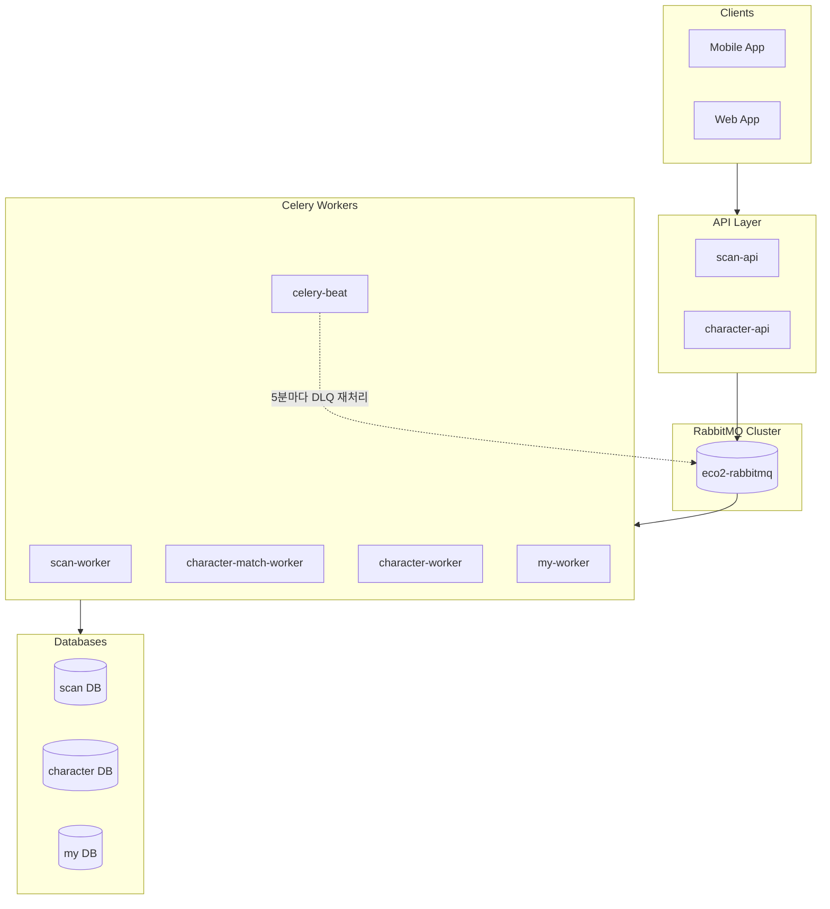
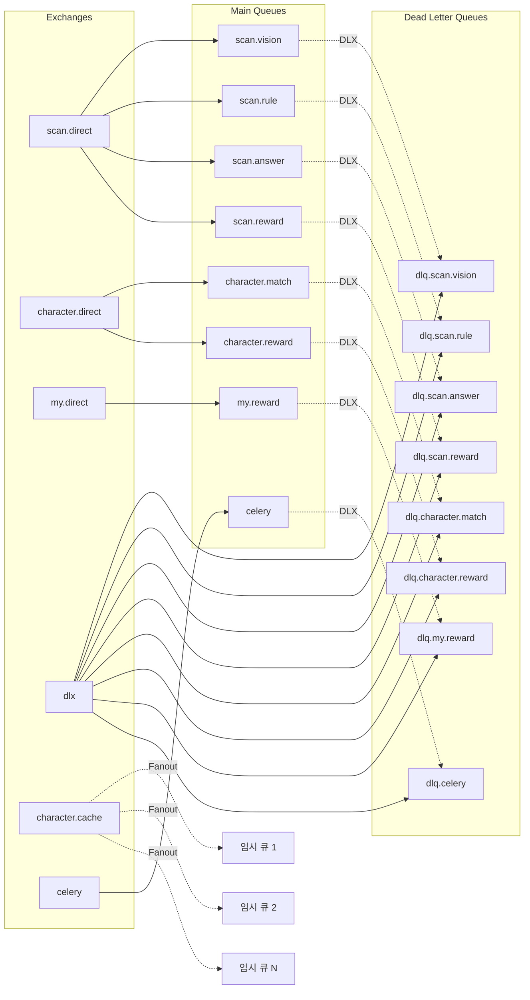
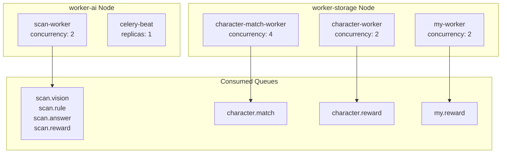
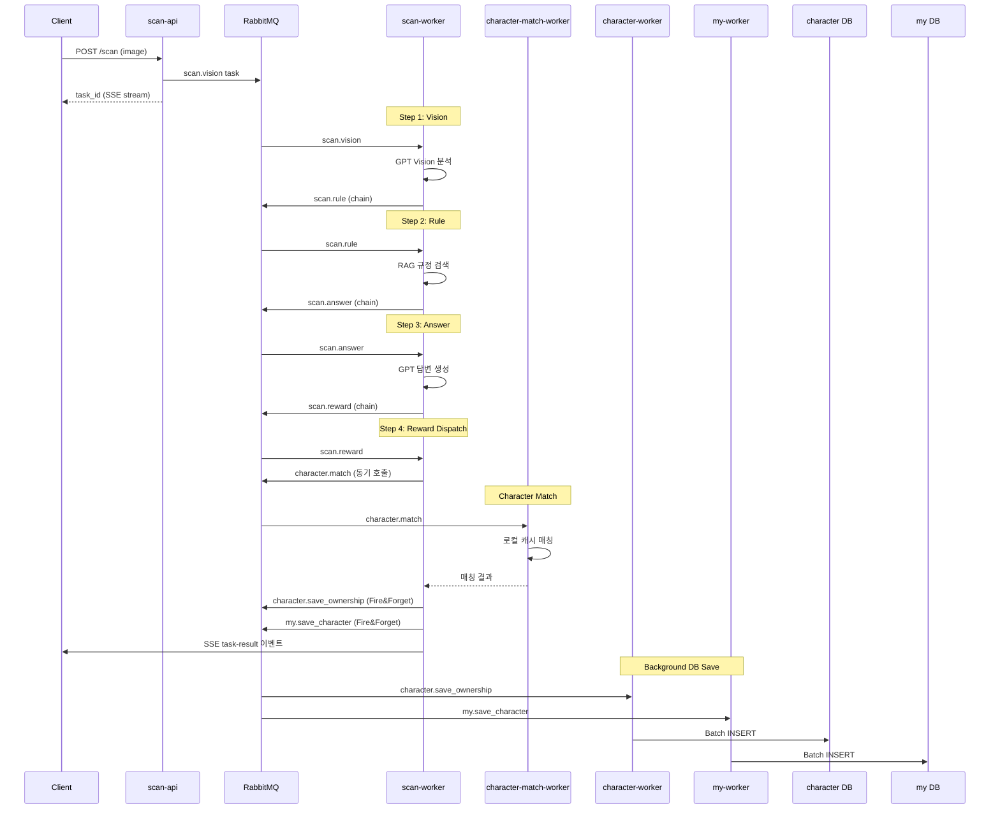
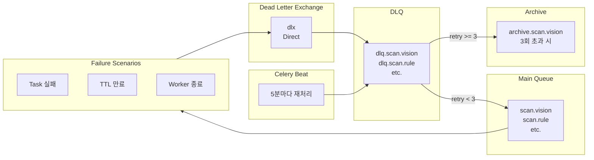
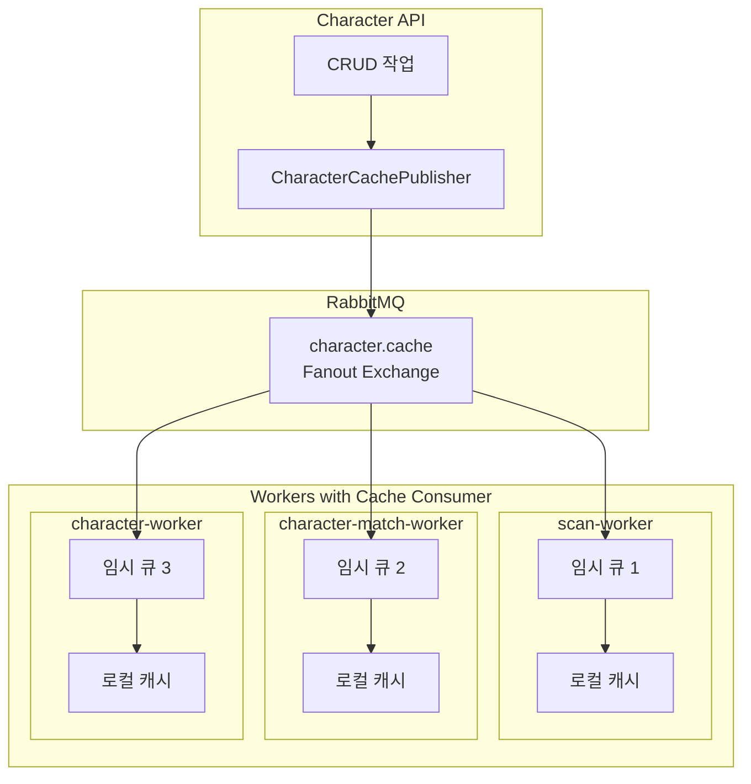

# RabbitMQ/Celery 시스템 전체 분석 보고서

> 이 문서는 현재 코드베이스의 RabbitMQ와 Celery 시스템 전체 구조를 분석하고 시각화한 참조 문서입니다.

---

## 1. 전체 아키텍처 개요



---

## 2. RabbitMQ Topology

### 2.1 Exchanges (7개)

| Exchange | Type | 용도 | 정의 파일 |
|----------|------|------|-----------|
| `scan.direct` | Direct | Scan AI 파이프라인 | `workloads/rabbitmq/base/topology/exchanges.yaml` |
| `character.direct` | Direct | 캐릭터 매칭/보상 | `workloads/rabbitmq/base/topology/exchanges.yaml` |
| `my.direct` | Direct | My 도메인 보상 저장 | `workloads/rabbitmq/base/topology/exchanges.yaml` |
| `dlx` | Direct | Dead Letter Exchange | `workloads/rabbitmq/base/topology/exchanges.yaml` |
| `authz.fanout` | Fanout | ext-authz 캐시 동기화 | `workloads/rabbitmq/base/topology/exchanges.yaml` |
| `character.cache` | Fanout | Worker 캐시 동기화 | `workloads/rabbitmq/base/topology/exchanges.yaml` |
| `celery` | Topic | Celery 기본 | `workloads/rabbitmq/base/topology/exchanges.yaml` |

### 2.2 Exchange-Queue 바인딩 구조



### 2.3 Queue 상세 정보

| Queue | TTL | DLQ Routing Key | 용도 |
|-------|-----|-----------------|------|
| `scan.vision` | 1시간 | dlq.scan.vision | GPT Vision 이미지 분류 |
| `scan.rule` | 5분 | dlq.scan.rule | RAG 기반 규정 검색 |
| `scan.answer` | 1시간 | dlq.scan.answer | GPT 답변 생성 |
| `scan.reward` | 1시간 | dlq.scan.reward | 보상 dispatch |
| `character.match` | **30초** | dlq.character.match | 캐릭터 매칭 (동기 응답) |
| `character.reward` | 24시간 | dlq.character.reward | 캐릭터 DB 저장 |
| `my.reward` | 24시간 | dlq.my.reward | My DB 저장 |
| `celery` | 1시간 | dlq.celery | 기본 큐 |

**DLQ 보관 기간**: 모든 DLQ는 **7일** 보관

---

## 3. Celery Workers 구성

### 3.1 Worker 배포 현황



### 3.2 Worker 상세 설정

| Worker | Namespace | Queues | Concurrency | Node | 정의 파일 |
|--------|-----------|--------|-------------|------|-----------|
| scan-worker | scan | scan.vision, scan.rule, scan.answer, scan.reward | 2 | worker-ai | `workloads/domains/scan-worker/base/deployment.yaml` |
| character-match-worker | character | character.match | 4 | worker-storage | `workloads/domains/character-match-worker/base/deployment.yaml` |
| character-worker | character | character.reward | 2 | worker-storage | `workloads/domains/character-worker/base/deployment.yaml` |
| my-worker | my | my.reward | 2 | worker-storage | `workloads/domains/my-worker/base/deployment.yaml` |
| celery-beat | scan | - (스케줄러) | 1 | worker-ai | `workloads/domains/celery-beat/base/deployment.yaml` |

---

## 4. Task Flow (Scan Pipeline)

### 4.1 전체 파이프라인 흐름



### 4.2 Task 상세 정보

| Task Name | Queue | Module | Time Limit | 설명 |
|-----------|-------|--------|------------|------|
| `scan.vision` | scan.vision | `domains/scan/tasks/vision.py` | 90초 (soft: 60초) | GPT Vision 이미지 분류 |
| `scan.rule` | scan.rule | `domains/scan/tasks/rule.py` | 60초 (soft: 30초) | RAG 기반 규정 검색 |
| `scan.answer` | scan.answer | `domains/scan/tasks/answer.py` | 90초 (soft: 60초) | GPT 답변 생성 |
| `scan.reward` | scan.reward | `domains/scan/tasks/reward.py` | 60초 (soft: 30초) | 보상 dispatch |
| `character.match` | character.match | `domains/character/tasks/match.py` | 15초 (soft: 10초) | 캐릭터 매칭 (동기) |
| `character.save_ownership` | character.reward | `domains/character/tasks/reward.py` | Batch | 캐릭터 DB 저장 |
| `my.save_character` | my.reward | `domains/my/tasks/sync_character.py` | Batch | My DB 저장 |

---

## 5. Dead Letter Queue (DLQ) 처리

### 5.1 DLQ 흐름



### 5.2 DLQ 재처리 로직

`domains/_shared/celery/dlq_tasks.py`에서 정의:

- **재처리 주기**: 5분마다 (Celery Beat)
- **한 번에 처리**: 최대 10개 메시지
- **최대 재시도**: 3회
- **재시도 초과 시**: Archive Queue로 이동

```python
# Beat Schedule (config.py에서 정의)
"beat_schedule": {
    "reprocess-dlq-scan-vision": {"schedule": 300.0, "kwargs": {"max_messages": 10}},
    "reprocess-dlq-scan-rule": {"schedule": 300.0, ...},
    "reprocess-dlq-scan-answer": {"schedule": 300.0, ...},
    "reprocess-dlq-scan-reward": {"schedule": 300.0, ...},
    "reprocess-dlq-character-reward": {"schedule": 300.0, ...},
    "reprocess-dlq-my-reward": {"schedule": 300.0, ...},
}
```

---

## 6. Event Broadcasting (캐시 동기화)

### 6.1 캐시 동기화 구조



### 6.2 이벤트 타입

| Event Type | Payload | 용도 |
|------------|---------|------|
| `full_refresh` | `{"type": "full_refresh", "characters": [...]}` | 전체 캐시 교체 |
| `upsert` | `{"type": "upsert", "character": {...}}` | 단일 캐릭터 추가/수정 |
| `delete` | `{"type": "delete", "character_id": "..."}` | 단일 캐릭터 삭제 |

**관련 파일:**
- Publisher: `domains/_shared/cache/cache_publisher.py`
- Consumer: `domains/_shared/cache/cache_consumer.py`

---

## 7. Celery 공통 설정

`domains/_shared/celery/config.py`에서 정의:

### 7.1 주요 설정값

| 설정 | 값 | 설명 |
|------|-----|------|
| `task_acks_late` | True | 처리 완료 후 ACK (메시지 손실 방지) |
| `task_reject_on_worker_lost` | True | Worker 종료 시 재큐잉 |
| `task_time_limit` | 300초 | Hard time limit |
| `task_soft_time_limit` | 240초 | Soft time limit |
| `worker_prefetch_multiplier` | 1 | Fair dispatch (긴 작업용) |
| `task_default_retry_delay` | 60초 | 기본 재시도 지연 |
| `task_max_retries` | 3 | 최대 재시도 횟수 |

### 7.2 Task Routing

```python
"task_routes": {
    "scan.vision": {"queue": "scan.vision"},
    "scan.rule": {"queue": "scan.rule"},
    "scan.answer": {"queue": "scan.answer"},
    "scan.reward": {"queue": "scan.reward"},
    "character.match": {"queue": "character.match"},
    "character.save_ownership": {"queue": "character.reward"},
    "my.save_character": {"queue": "my.reward"},
    "dlq.*": {"queue": "celery"},
}
```

---

## 8. 배치 처리 (Batches)

`character.save_ownership`과 `my.save_character`는 `celery-batches`를 사용하여 배치 처리:

| Task | flush_every | flush_interval | 처리 방식 |
|------|-------------|----------------|-----------|
| `character.save_ownership` | 50개 | 5초 | BULK INSERT ON CONFLICT DO NOTHING |
| `my.save_character` | 50개 | 5초 | BULK INSERT ON CONFLICT DO NOTHING |

---

## 9. 주요 파일 위치 요약

| 구성요소 | 위치 |
|----------|------|
| RabbitMQ Cluster | `workloads/rabbitmq/base/cluster.yaml` |
| Exchanges | `workloads/rabbitmq/base/topology/exchanges.yaml` |
| Queues | `workloads/rabbitmq/base/topology/queues.yaml` |
| Bindings | `workloads/rabbitmq/base/topology/bindings.yaml` |
| Celery 공통 설정 | `domains/_shared/celery/config.py` |
| DLQ 재처리 | `domains/_shared/celery/dlq_tasks.py` |
| Base Task | `domains/_shared/celery/base_task.py` |
| 캐시 Publisher | `domains/_shared/cache/cache_publisher.py` |
| 캐시 Consumer | `domains/_shared/cache/cache_consumer.py` |

---

## 10. 관련 문서

이 시스템의 설계 배경과 상세 구현에 대해서는 다음 문서들을 참조하세요:

- [00-rabbitmq-celery-architecture.md](./00-rabbitmq-celery-architecture.md) - 아키텍처 개요
- [02-mq-architecture-design.md](./02-mq-architecture-design.md) - MQ 아키텍처 설계
- [03-rabbitmq-infrastructure.md](./03-rabbitmq-infrastructure.md) - RabbitMQ 인프라
- [05-celery-scan-pipeline.md](./05-celery-scan-pipeline.md) - Celery Scan 파이프라인
- [06-celery-chain-events.md](./06-celery-chain-events.md) - Celery Chain 이벤트
- [07-reward-persistence-separation.md](./07-reward-persistence-separation.md) - 보상 영속성 분리
- [10-local-cache-event-broadcast.md](./10-local-cache-event-broadcast.md) - 로컬 캐시 이벤트 브로드캐스트
- [12-batch-processing-idempotency.md](./12-batch-processing-idempotency.md) - 배치 처리 및 멱등성

