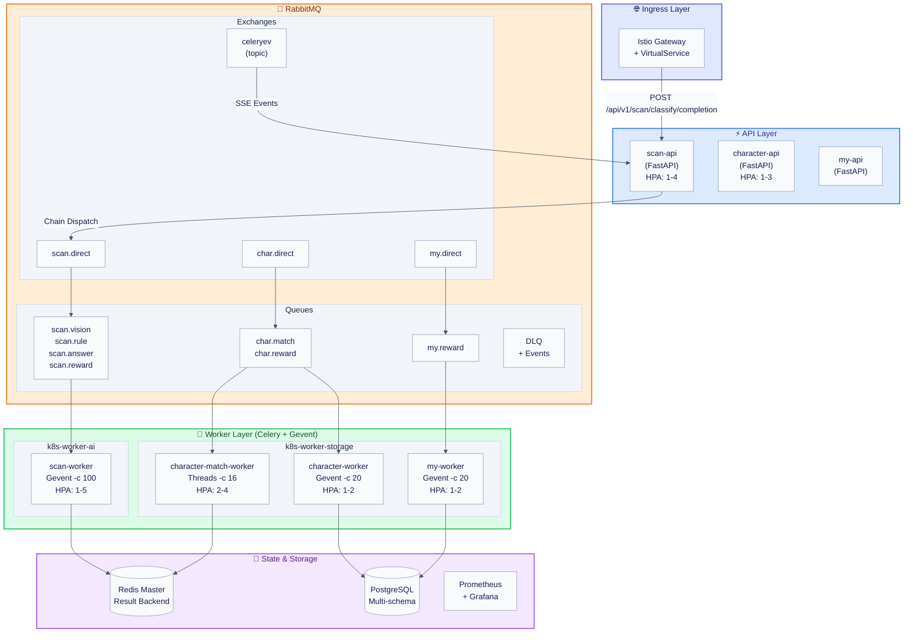
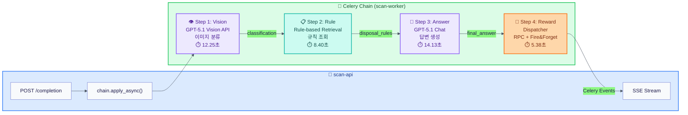
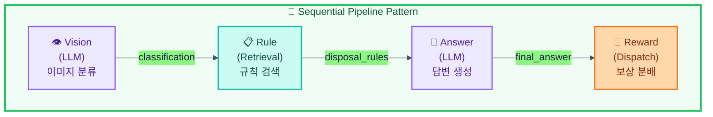
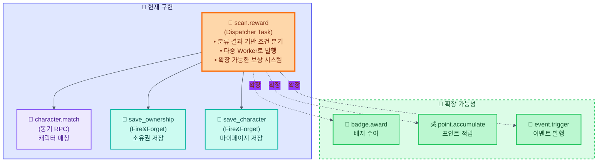
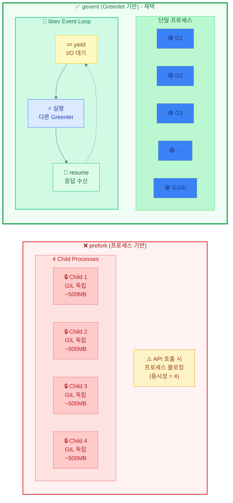
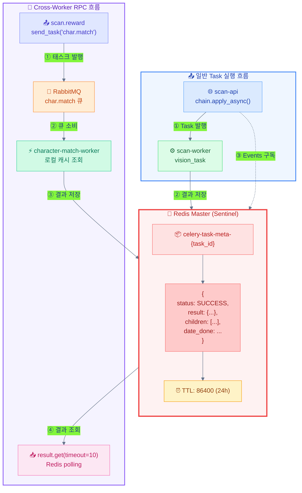
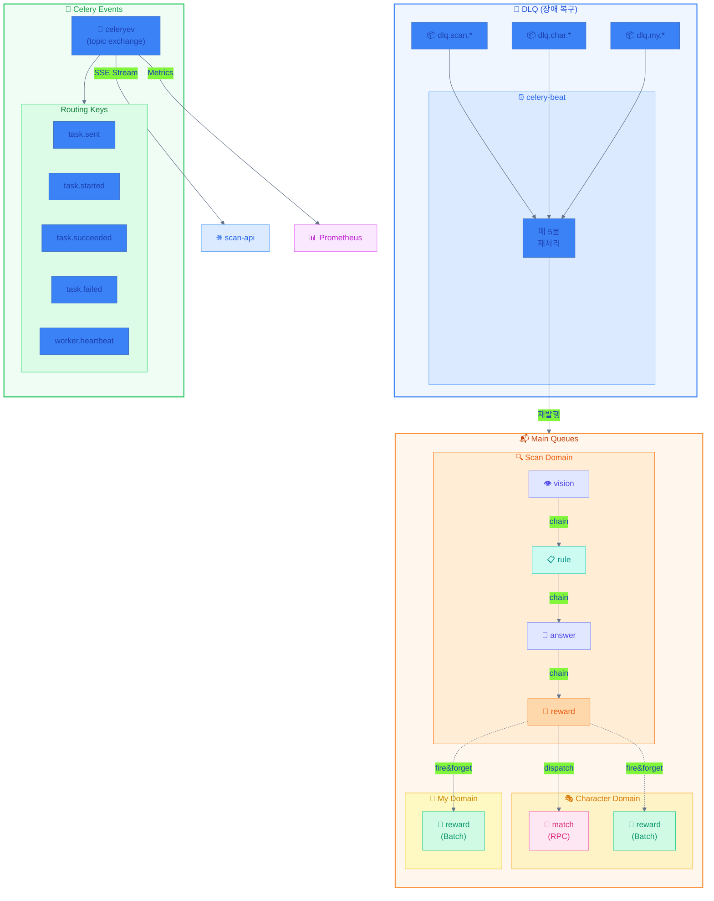
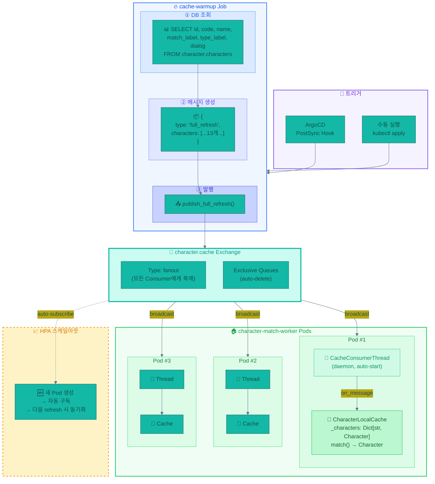
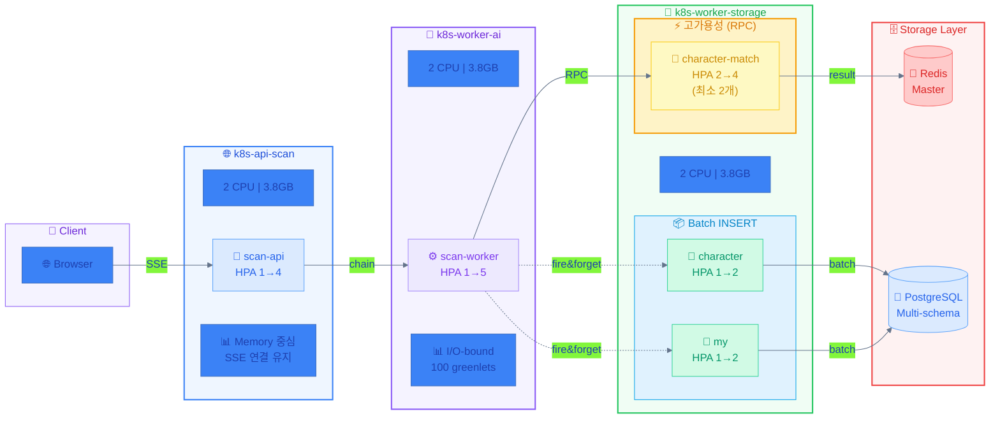
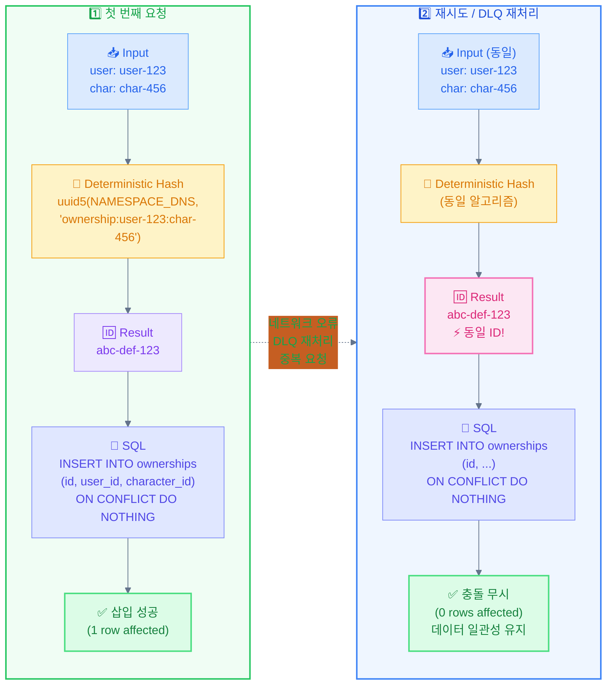

# Message Queue #12: Gevent 기반 LLM API 큐잉 시스템

> **작성일**: 2025-12-25  
> **이전 글**: [#11 Gevent Pool 전환 트러블슈팅](./20-gevent-migration-troubleshooting.md)  
> **상태**: Production Ready

---

## 1. 시스템 개요

### 1.1 목표

OpenAI GPT-5.1 기반 폐기물 분류 파이프라인을 **고가용성 큐잉 시스템**으로 구현:

- **RPM 제한 대응**: 50RPM+ 환경에서 안정적 처리
- **실시간 진행률**: SSE로 4단계 파이프라인 상태 스트리밍
- **장애 복원력**: DLQ 기반 자동 재처리
- **수평 확장**: HPA로 부하 기반 자동 스케일링

### 1.2 핵심 수치

<table>
<thead>
<tr><th>지표</th><th>Before (동기)</th><th>After (큐잉)</th><th>개선율</th></tr>
</thead>
<tbody>
<tr><td>동시 처리량</td><td>3 req</td><td>100+ req</td><td><strong>33x</strong></td></tr>
<tr><td>메모리 사용</td><td>4GB (prefork)</td><td>1GB (gevent)</td><td><strong>75%↓</strong></td></tr>
<tr><td>장애 복구</td><td>수동</td><td>자동 (DLQ)</td><td>-</td></tr>
<tr><td>스케일링</td><td>수동</td><td>HPA 자동</td><td>-</td></tr>
</tbody>
</table>

---

## 2. 전체 시스템 구성도



#### 📋 요청 처리 흐름

<table>
<thead>
<tr><th style="text-align:center">순서</th><th>구간</th><th>설명</th></tr>
</thead>
<tbody>
<tr><td style="text-align:center">①</td><td>Client → Ingress</td><td>Istio Gateway가 TLS 종료 및 라우팅 수행</td></tr>
<tr><td style="text-align:center">②</td><td>Ingress → scan-api</td><td>FastAPI가 요청 수신, Celery Chain 발행</td></tr>
<tr><td style="text-align:center">③</td><td>scan-api → RabbitMQ</td><td><code>chain.apply_async()</code>로 vision 큐에 첫 태스크 발행</td></tr>
<tr><td style="text-align:center">④</td><td>RabbitMQ → scan-worker</td><td>Gevent pool이 태스크 소비, LLM API 호출</td></tr>
<tr><td style="text-align:center">⑤</td><td>scan-worker → Redis</td><td>각 태스크 결과를 Redis에 저장</td></tr>
<tr><td style="text-align:center">⑥</td><td>celeryev → scan-api</td><td>Celery Events가 SSE로 클라이언트에 진행 상태 전송</td></tr>
<tr><td style="text-align:center">⑦</td><td>reward → character-match</td><td>동기 RPC로 캐릭터 매칭 결과 대기</td></tr>
<tr><td style="text-align:center">⑧</td><td>reward → DB workers</td><td>Fire&amp;Forget으로 소유권/마이페이지 저장</td></tr>
</tbody>
</table>

**핵심 포인트**:
- 🔵 **API Layer**: 요청 수신 및 SSE 스트리밍 담당
- 🟠 **RabbitMQ**: 태스크 큐잉 및 이벤트 브로드캐스트
- 🟢 **Worker Layer**: 실제 작업 수행 (LLM 호출, 캐시 조회, DB 저장)
- 🟣 **Storage Layer**: 상태 저장 (Redis), 영속 저장 (PostgreSQL)

---

## 3. Celery Chain 파이프라인

### 3.1 4단계 파이프라인 구조



#### 📋 파이프라인 실행 절차

<table>
<thead>
<tr><th style="text-align:center">Step</th><th>Task</th><th>역할</th><th style="text-align:center">평균 소요시간</th></tr>
</thead>
<tbody>
<tr><td style="text-align:center">1️⃣</td><td><strong>vision</strong></td><td>GPT-5.1 Vision API로 이미지 분류 (major/middle/minor 카테고리)</td><td style="text-align:center">12.25초</td></tr>
<tr><td style="text-align:center">2️⃣</td><td><strong>rule</strong></td><td>분류 결과로 <code>disposal_rules.json</code>에서 규칙 조회</td><td style="text-align:center">8.40초</td></tr>
<tr><td style="text-align:center">3️⃣</td><td><strong>answer</strong></td><td>GPT-5.1 Chat API로 최종 답변 생성 (disposal_steps, user_answer)</td><td style="text-align:center">14.13초</td></tr>
<tr><td style="text-align:center">4️⃣</td><td><strong>reward</strong></td><td>캐릭터 매칭(RPC) + 소유권 저장(Fire&amp;Forget) 분배</td><td style="text-align:center">5.38초</td></tr>
</tbody>
</table>

**총 파이프라인 시간**: ~40초 (p50), ~80초 (p99)

**핵심 포인트**:
- 🟣 **LLM 단계** (vision, answer): OpenAI API 호출, I/O-bound
- 🟢 **Retrieval 단계** (rule): 로컬 JSON 조회, CPU-bound
- 🟠 **Dispatch 단계** (reward): 다중 Worker로 작업 분배

### 3.2 설계 철학: LLM Chaining Patterns 적용

본 시스템은 [LLM Chaining: A Pragmatic Decision Framework](https://vrungta.substack.com/p/llm-chaining-a-pragmatic-decision)에서 제시한 두 가지 핵심 패턴을 적용했다:

#### Sequential Pipeline



**핵심 특징**:
- 각 단계가 이전 단계의 출력을 입력으로 받음
- 단계별 전문화: 분류 → 검색 → 생성 → 비즈니스 로직
- DLQ 기반 장애 복구로 Error Propagation 방지

#### Router/Dispatcher Pattern



#### 📋 Dispatcher 실행 절차

<table>
<thead>
<tr><th style="text-align:center">순서</th><th>대상</th><th style="text-align:center">방식</th><th>설명</th></tr>
</thead>
<tbody>
<tr><td style="text-align:center">①</td><td><code>character.match</code></td><td style="text-align:center"><strong>동기 RPC</strong></td><td>캐시에서 캐릭터 매칭 → 결과 대기 (클라이언트 응답에 필요)</td></tr>
<tr><td style="text-align:center">②</td><td><code>save_ownership</code></td><td style="text-align:center">Fire&amp;Forget</td><td>character.character_ownerships 테이블에 소유권 저장</td></tr>
<tr><td style="text-align:center">③</td><td><code>save_character</code></td><td style="text-align:center">Fire&amp;Forget</td><td>my.user_characters 테이블에 마이페이지 데이터 저장</td></tr>
</tbody>
</table>

**확장 시나리오** (점선 영역):
- `badge.award`: 특정 조건 달성 시 배지 수여
- `point.accumulate`: 분리배출 성공 시 포인트 적립
- `event.trigger`: 이벤트 기간 중 특별 보상 발행

#### Dispatch 큐 분리 이유

<table>
<thead>
<tr><th>설계 결정</th><th>이유</th></tr>
</thead>
<tbody>
<tr><td><strong>reward를 독립 큐로 분리</strong></td><td>Pipeline 종료 지점에서 다중 경로 분기 → Router 역할 명확화</td></tr>
<tr><td><strong>character.match 동기 호출</strong></td><td>보상 정보가 클라이언트 응답에 필요 → RPC로 결과 대기</td></tr>
<tr><td><strong>save_* Fire&amp;Forget</strong></td><td>DB 저장은 응답 경로에서 제외 → Eventual Consistency</td></tr>
<tr><td><strong>확장 가능한 구조</strong></td><td>분류 결과 기반으로 badge, point, event 등 추가 Dispatch 용이</td></tr>
</tbody>
</table>

> **핵심 원칙**: reward 태스크가 단순 저장이 아닌 **Dispatcher** 역할을 수행함으로써, 
> 현재 캐릭터 보상 시스템 외에도 포인트 적립, 배지 수여, 이벤트 트리거 등 
> 다양한 보상 메커니즘을 동일한 패턴으로 확장할 수 있는 아키텍처를 지향했다.

### 3.3 대안 비교

<table>
<thead>
<tr><th>대안</th><th>장점</th><th>단점</th><th>채택 여부</th></tr>
</thead>
<tbody>
<tr><td><strong>Celery Chain + Dispatch</strong></td><td>단계별 결과 전달, DLQ 자동 처리, 확장성</td><td>복잡도 ↑</td><td>✅ <strong>채택</strong></td></tr>
<tr><td>LangChain LCEL</td><td>LLM 특화, 스트리밍 지원</td><td>MQ 통합 복잡, 장애 복구 미흡</td><td>❌</td></tr>
<tr><td>직접 호출</td><td>단순</td><td>동기 블로킹, 확장성 없음</td><td>❌</td></tr>
<tr><td>Kafka Streams</td><td>대용량 처리</td><td>오버엔지니어링, 운영 복잡도</td><td>❌</td></tr>
</tbody>
</table>

---

## 4. Gevent Pool 구현

### 4.1 Pool 유형 비교



#### 📊 메모리 및 동시성 비교

<table>
<thead>
<tr><th style="text-align:center">항목</th><th style="text-align:center">prefork</th><th style="text-align:center">gevent</th></tr>
</thead>
<tbody>
<tr><td style="text-align:center"><strong>메모리</strong></td><td style="text-align:center">2GB (4 × 500MB)</td><td style="text-align:center">~501MB (1 프로세스 + 100 × 10KB)</td></tr>
<tr><td style="text-align:center"><strong>동시성</strong></td><td style="text-align:center">4 tasks</td><td style="text-align:center">100 tasks</td></tr>
<tr><td style="text-align:center"><strong>효율</strong></td><td style="text-align:center">⚠️ I/O 대기 시 블로킹</td><td style="text-align:center">✅ I/O 대기 시 yield</td></tr>
</tbody>
</table>

#### 📋 동작 방식 비교

**❌ prefork (프로세스 기반)**:
1. Worker 시작 시 N개의 자식 프로세스 생성 (fork)
2. 각 프로세스가 독립된 GIL 보유 → 진정한 병렬 처리 가능
3. **문제점**: OpenAI API 호출 시 프로세스가 응답 대기 중 **블로킹**
4. 동시성 = 프로세스 수 (4개면 4개만 동시 처리)

**✅ gevent (Greenlet 기반)**:
1. Worker 시작 시 단일 프로세스 내 N개 Greenlet 생성
2. `monkey.patch_all()`로 I/O 함수들을 협력적으로 패치
3. **핵심**: API 호출 시 **yield** → 다른 Greenlet 실행 → 응답 수신 시 **resume**
4. 동시성 = Greenlet 수 (100개면 100개 동시 처리)

> **결론**: LLM API 호출이 65% 이상인 I/O-bound 워크로드에서 gevent가 25배 이상 효율적

### 4.2 Gevent 선택 이유

<table>
<thead>
<tr><th>요소</th><th>prefork</th><th>gevent</th><th>판단</th></tr>
</thead>
<tbody>
<tr><td><strong>워크로드 유형</strong></td><td>CPU-bound</td><td>I/O-bound</td><td>LLM API = I/O → <strong>gevent</strong></td></tr>
<tr><td><strong>동시성</strong></td><td>프로세스 수</td><td>100+ greenlets</td><td>높은 동시성 필요 → <strong>gevent</strong></td></tr>
<tr><td><strong>메모리</strong></td><td>~500MB/프로세스</td><td>~10KB/greenlet</td><td>효율적 → <strong>gevent</strong></td></tr>
<tr><td><strong>코드 변경</strong></td><td>없음</td><td>동기 클라이언트</td><td>Monkey patching 활용</td></tr>
<tr><td><strong>Celery 지원</strong></td><td>공식</td><td>공식</td><td>둘 다 지원</td></tr>
</tbody>
</table>

### 4.3 Worker별 Pool 설정

```yaml
# scan-worker: LLM API 호출 (I/O-bound)
command: [celery, -A, domains.scan.celery_app, worker]
args: [-P, gevent, -c, '100']  # 100 greenlets

# character-match-worker: 로컬 캐시 조회 (메모리)
command: [celery, -A, domains.character.celery_app, worker]
args: [-P, threads, -c, '16']  # 16 threads (캐시 공유)

# character-worker: DB I/O (I/O-bound)
command: [celery, -A, domains.character.celery_app, worker]
args: [-P, gevent, -c, '20']  # 20 greenlets

# my-worker: DB I/O (I/O-bound)
command: [celery, -A, domains.my.celery_app, worker]
args: [-P, gevent, -c, '20']  # 20 greenlets
```

### 4.4 Monkey Patching 동작

```python
# Celery가 자동으로 실행 (gevent pool 사용 시)
from gevent import monkey
monkey.patch_all()

# 이후 모든 동기 I/O가 협력적으로 동작
import socket  # → gevent.socket
import ssl     # → gevent.ssl
import httpx   # socket 사용 → gevent에 의해 패치됨
```

---

## 5. Redis 상태 저장 시스템

### 5.1 Result Backend 아키텍처



#### 📋 Task 결과 저장/조회 절차

**일반 Task 흐름** (scan.vision 등):

<table>
<thead>
<tr><th style="text-align:center">순서</th><th>구간</th><th>설명</th></tr>
</thead>
<tbody>
<tr><td style="text-align:center">①</td><td>scan-api</td><td><code>chain.apply_async()</code> 호출, task_id 발급</td></tr>
<tr><td style="text-align:center">②</td><td>scan-worker</td><td>vision_task 실행, 결과 생성</td></tr>
<tr><td style="text-align:center">③</td><td>scan-worker → Redis</td><td><code>celery-task-meta-{task_id}</code> 키로 결과 저장 (TTL: 24시간)</td></tr>
<tr><td style="text-align:center">④</td><td>scan-api</td><td>Celery Events로 완료 확인 후 Redis에서 결과 조회</td></tr>
</tbody>
</table>

**Cross-Worker RPC 흐름** (character.match):

<table>
<thead>
<tr><th style="text-align:center">순서</th><th>구간</th><th>설명</th></tr>
</thead>
<tbody>
<tr><td style="text-align:center">①</td><td>scan.reward</td><td><code>send_task('character.match')</code> 호출</td></tr>
<tr><td style="text-align:center">②</td><td>character-match-worker</td><td>로컬 캐시에서 캐릭터 매칭 수행</td></tr>
<tr><td style="text-align:center">③</td><td>character-match-worker → Redis</td><td>매칭 결과 저장</td></tr>
<tr><td style="text-align:center">④</td><td>scan.reward</td><td><code>result.get(timeout=10)</code>으로 Redis polling하여 결과 획득</td></tr>
</tbody>
</table>

**핵심 장점**:
- ✅ Redis = 공유 저장소 → 어떤 Worker든 결과 조회 가능
- ✅ RPC reply 큐 불필요 → prefork 블로킹 문제 해결

### 5.2 RPC vs Redis 비교

<table>
<thead>
<tr><th>특성</th><th><code>rpc://</code></th><th><code>redis://</code></th><th>선택</th></tr>
</thead>
<tbody>
<tr><td><strong>저장소</strong></td><td>RabbitMQ 임시 큐</td><td>Redis 공유 저장소</td><td><strong>redis</strong></td></tr>
<tr><td><strong>Cross-Worker 조회</strong></td><td>불가 (자신의 큐만)</td><td>가능</td><td><strong>redis</strong></td></tr>
<tr><td><strong>prefork 호환</strong></td><td>블로킹 문제</td><td>문제 없음</td><td><strong>redis</strong></td></tr>
<tr><td><strong>결과 영속성</strong></td><td>연결 종료 시 삭제</td><td>TTL까지 유지</td><td><strong>redis</strong></td></tr>
<tr><td><strong>모니터링</strong></td><td>어려움</td><td>Redis CLI로 조회</td><td><strong>redis</strong></td></tr>
</tbody>
</table>

### 5.3 Redis 연결 설정

```yaml
# 모든 Worker/API에 동일 적용
env:
  - name: CELERY_RESULT_BACKEND
    # Headless Service로 Master 직접 연결 (Sentinel 환경)
    value: redis://dev-redis-node-0.dev-redis-headless.redis.svc.cluster.local:6379/0
```

---

## 6. 큐 라우팅 설계

### 6.1 큐 구조도



#### 📋 큐별 역할 및 메시지 흐름

**🟠 Main Queues** (Task 처리):

<table>
<thead>
<tr><th>Queue</th><th>Consumer</th><th>메시지 유형</th></tr>
</thead>
<tbody>
<tr><td><code>scan.vision</code></td><td>scan-worker</td><td>이미지 분류 요청</td></tr>
<tr><td><code>scan.rule</code></td><td>scan-worker</td><td>규칙 조회 요청</td></tr>
<tr><td><code>scan.answer</code></td><td>scan-worker</td><td>답변 생성 요청</td></tr>
<tr><td><code>scan.reward</code></td><td>scan-worker</td><td>보상 분배 요청</td></tr>
<tr><td><code>char.match</code></td><td>character-match-worker</td><td>캐릭터 매칭 요청 (RPC)</td></tr>
<tr><td><code>char.reward</code></td><td>character-worker</td><td>소유권 저장 요청 (Batch)</td></tr>
<tr><td><code>my.reward</code></td><td>my-worker</td><td>마이페이지 저장 요청 (Batch)</td></tr>
</tbody>
</table>

**🔵 DLQ Queues** (장애 복구):
- 실패한 태스크가 DLQ에 저장
- `celery-beat`가 매 5분마다 재처리 태스크 발행
- DLQ 재처리 태스크는 원래 도메인 큐로 라우팅

**🟢 Event Queues** (모니터링):
- `celeryev` Exchange (topic)로 이벤트 브로드캐스트
- `scan-api`가 SSE로 클라이언트에 진행 상태 전송
- Prometheus가 `worker.heartbeat`로 메트릭 수집

### 6.2 Task Routing 설정

```python
# domains/_shared/celery/config.py
"task_routes": {
    # Scan Chain (순차 처리)
    "scan.vision": {"queue": "scan.vision"},
    "scan.rule": {"queue": "scan.rule"},
    "scan.answer": {"queue": "scan.answer"},
    "scan.reward": {"queue": "scan.reward"},
    
    # Character (동기 RPC + 비동기 저장)
    "character.match": {"queue": "character.match"},
    "character.save_ownership": {"queue": "character.reward"},
    
    # My (비동기 저장)
    "my.save_character": {"queue": "my.reward"},
    
    # DLQ Reprocess → 원래 도메인 Worker가 처리
    "dlq.reprocess_scan_vision": {"queue": "scan.vision"},
    "dlq.reprocess_scan_rule": {"queue": "scan.rule"},
    "dlq.reprocess_scan_answer": {"queue": "scan.answer"},
    "dlq.reprocess_scan_reward": {"queue": "scan.reward"},
    "dlq.reprocess_character_reward": {"queue": "character.reward"},
    "dlq.reprocess_my_reward": {"queue": "my.reward"},
}
```

### 6.3 라우팅 선택 이유

<table>
<thead>
<tr><th>설계 결정</th><th>이유</th></tr>
</thead>
<tbody>
<tr><td><strong>단계별 큐 분리</strong></td><td>모니터링 용이, DLQ 정밀 제어</td></tr>
<tr><td><strong>도메인별 Worker</strong></td><td>관심사 분리, 독립적 스케일링</td></tr>
<tr><td><strong>DLQ → 원래 큐</strong></td><td>별도 Consumer 불필요, 기존 Worker 재활용</td></tr>
<tr><td><strong>Events Exchange</strong></td><td>SSE 실시간 스트리밍, Prometheus 연동</td></tr>
</tbody>
</table>

---

## 7. 캐시 동기화 (Fanout)

### 7.1 Local Cache 구조



#### 📋 캐시 동기화 절차

**초기 로딩 (PostSync Hook)**:
| 순서 | 구간 | 설명 |
|:----:|------|------|
| ① | cache-warmup Job | ArgoCD 배포 완료 후 트리거 |
| ② | PostgreSQL | `SELECT * FROM character.characters` 실행 |
| ③ | RabbitMQ | `{type: 'full_refresh', characters: [...]}` 메시지 발행 |
| ④ | Fanout Exchange | 모든 character-match-worker Pod에 메시지 복제 |
| ⑤ | 각 Pod | `CacheConsumerThread`가 메시지 수신 → 로컬 캐시 업데이트 |

**HPA 스케일아웃 시**:
| 순서 | 상황 | 동작 |
|:----:|------|------|
| ① | 새 Pod 생성 | HPA가 부하 기반으로 Pod 추가 |
| ② | Consumer 등록 | 새 Pod의 `CacheConsumerThread`가 Exchange에 구독 |
| ③ | 캐시 동기화 | 다음 refresh 이벤트 수신 시 자동으로 캐시 로드 |

**핵심 장점**:
- ✅ HPA 스케일아웃 시 새 Pod도 자동으로 캐시 동기화
- ✅ 캐시 업데이트 시 모든 Pod에 즉시 전파

### 7.2 캐시 전략 선택 이유

| 대안 | 장점 | 단점 | 채택 여부 |
|------|------|------|-----------|
| **Local Cache + Fanout** | 빠른 조회 (<1ms), 수평 확장 가능 | 캐시 일관성 지연 | ✅ **채택** |
| Redis Centralized | 강한 일관성 | 네트워크 latency | ❌ |
| gRPC 직접 호출 | 실시간 데이터 | 매 요청마다 호출 | ❌ |
| DB 직접 조회 | 항상 최신 | 느림, 부하 ↑ | ❌ |

---

## 8. HPA 자동 스케일링

### 8.1 HPA 설정 요약

| Component | Node | min | max | CPU% | Memory% | 역할 |
|-----------|------|-----|-----|------|---------|------|
| scan-api | k8s-api-scan | 1 | 4 | 70% | 80% | SSE 스트리밍 |
| scan-worker | k8s-worker-ai | 1 | 5 | 60% | 75% | LLM API 호출 |
| character-match | k8s-worker-storage | 2 | 4 | 70% | 80% | 캐시 조회 (RPC) |
| character-worker | k8s-worker-storage | 1 | 2 | 75% | 80% | DB 저장 (batch) |
| my-worker | k8s-worker-storage | 1 | 2 | 75% | 80% | DB 저장 (batch) |

### 8.2 노드 배치 전략



#### 📋 노드별 배치 이유

| Node | 배치 대상 | 배치 이유 |
|------|----------|----------|
| **k8s-api-scan** | scan-api | SSE 연결 유지 → 메모리 중심, API 전용 노드 분리 |
| **k8s-worker-ai** | scan-worker | OpenAI API 호출 → I/O-bound, 높은 동시성 필요 |
| **k8s-worker-storage** | character-*, my-* | DB/캐시 접근 → Storage 노드 근접 배치로 latency 최소화 |

**스케일링 전략**:
- 🔵 **scan-api**: SSE 연결 수 기반 Memory 스케일링
- 🟣 **scan-worker**: OpenAI API 응답 대기 → CPU 낮음, 동시성 높음
- 🟢 **character-match**: RPC 응답 속도 중요 → 최소 2개 유지 (가용성)
- 🌐 **character/my-worker**: Batch INSERT → 낮은 우선순위, 최소 리소스

---

## 9. 멱등성 보장

### 9.1 Deterministic UUID

```python
from uuid import NAMESPACE_DNS, uuid5

def _generate_ownership_id(user_id: str, character_id: str) -> UUID:
    """동일 입력 → 동일 UUID (멱등성 보장)."""
    return uuid5(NAMESPACE_DNS, f"ownership:{user_id}:{character_id}")
```

### 9.2 멱등성 처리 흐름



**핵심 장점**:
- ✅ 어떤 Worker가 처리하든 동일한 ID 생성
- ✅ DLQ 재처리, 네트워크 재시도 시에도 데이터 일관성 유지

---

## 10. 변경 이력

| 날짜 | 내용 |
|------|------|
| 2025-12-25 | 최초 작성 - LLM API 큐잉 시스템 최종 아키텍처 |
| 2025-12-25 | ASCII → Mermaid 다이어그램 전환, 블로그 포스팅 동기화 |
| 2025-12-25 | 각 다이어그램별 부가 설명 및 절차 추가 |
| 2025-12-25 | 전체 다이어그램 시각화 고도화 (색상, 흐름, 구조 개선) |

---

## 관련 문서

### 설계 참고 자료

- [LLM Chaining: A Pragmatic Decision Framework](https://vrungta.substack.com/p/llm-chaining-a-pragmatic-decision) - Sequential Pipeline, Router/Dispatcher 패턴 참고

### 블로그 포스팅

- [#12 Gevent 기반 LLM API 큐잉 시스템](https://rooftopsnow.tistory.com/76) - 본 문서의 블로그 버전
- [#11 Celery Prefork 병목 지점](https://rooftopsnow.tistory.com/72) - Gevent 전환 배경, Prometheus 실측
- [#10 DB INSERT 멱등성 처리, Celery Batch](https://rooftopsnow.tistory.com/71) - celery-batches, ON CONFLICT
- [#9 캐릭터 보상 판정과 DB 레이어 분리 (2)](https://rooftopsnow.tistory.com/70) - Fire&Forget, Eventual Consistency
- [#8 Local Cache Event Broadcast](https://rooftopsnow.tistory.com/69) - Fanout Exchange, 로컬 캐시
- [#7 Celery Chain + Celery Events (2)](https://rooftopsnow.tistory.com/68) - 4단계 Pipeline, SSE

### 트러블슈팅

- [Message Queue 트러블슈팅: Gevent Pool 마이그레이션](https://rooftopsnow.tistory.com/73) - 7개 문제 해결

### Python 기초

- [동시성 모델과 Green Thread](https://rooftopsnow.tistory.com/75) - prefork vs gevent vs asyncio
- [Event Loop: Gevent](https://rooftopsnow.tistory.com/74) - Monkey Patching, libev

### GitHub

- [eco2-team/backend](https://github.com/eco2-team/backend)

### 코드베이스

- [20-gevent-migration-troubleshooting.md](./20-gevent-migration-troubleshooting.md) - 트러블슈팅 상세

