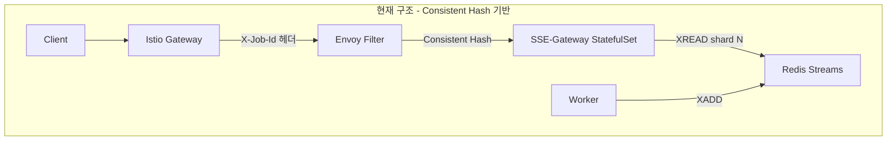
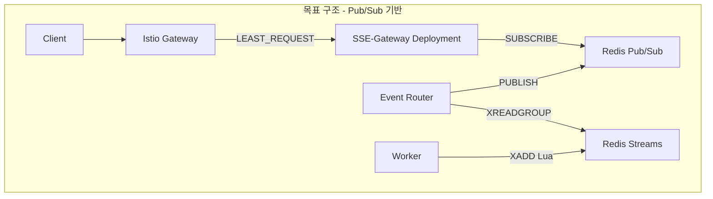

# SSE HA Architecture 전환 로드맵

## 현재 상태 분석





---

## Phase A: 삭제/변경 (기존 구조 정리)

### A-1. Envoy Filter 수정 ✅
- **파일**: `workloads/routing/gateway/base/envoy-filter.yaml`
- **작업**: job_id → X-Job-Id 변환 로직 제거
- **유지**: Cookie → Header 변환 로직 (인증용)

### A-2. SSE-Gateway StatefulSet → Deployment 전환 ✅
- **삭제 파일**:
  - `workloads/domains/sse-gateway/base/statefulset.yaml`
  - `workloads/domains/sse-gateway/base/service-headless.yaml`
- **생성 파일**:
  - `workloads/domains/sse-gateway/base/deployment.yaml`
- **수정 파일**:
  - `workloads/domains/sse-gateway/base/kustomization.yaml`

### A-3. DestinationRule 수정 ✅
- **파일**: `workloads/domains/sse-gateway/base/virtualservice.yaml`
- **작업**: 
  - `consistentHash.httpHeaderName: X-Job-Id` 제거
  - `loadBalancer.simple: LEAST_REQUEST` 설정

### A-4. SSE-Gateway config.py 단순화 ✅
- **파일**: `domains/sse-gateway/config.py`
- **작업**:
  - `get_pod_index()` 함수 제거
  - `sse_shard_id`, `sse_shard_count` 속성 제거
  - Pub/Sub 관련 설정 추가

---

## Phase B: 추가 구현 (HA 컴포넌트)

### B-1. Worker 멱등성 Lua Script ✅
- **파일**: `domains/_shared/events/redis_streams.py`
- **작업**: `publish_stage_event()` 함수에 멱등성 Lua Script 적용

```python
IDEMPOTENT_XADD = """
local publish_key = KEYS[1]  -- published:{job_id}:{stage}:{seq}
local stream_key = KEYS[2]   -- scan:events:{shard}
if redis.call('EXISTS', publish_key) == 1 then
    return {0, redis.call('GET', publish_key)}
end
local msg_id = redis.call('XADD', stream_key, 'MAXLEN', '~', '10000', '*', ...)
redis.call('SETEX', publish_key, 7200, msg_id)
return {1, msg_id}
"""
```

### B-2. Event Router 도메인 생성 ✅
- **새 디렉토리**: `domains/event-router/`

```
domains/event-router/
├── main.py               # FastAPI (Health/Ready)
├── config.py             # 환경변수 설정
├── core/
│   ├── consumer.py       # XREADGROUP 메인 루프
│   ├── processor.py      # State 갱신 + Pub/Sub (Lua Script)
│   └── reclaimer.py      # XAUTOCLAIM 장애 복구
├── Dockerfile
└── requirements.txt
```

- **K8s 매니페스트**: `workloads/domains/event-router/`

```
workloads/domains/event-router/
└── base/
    ├── deployment.yaml
    ├── service.yaml
    ├── keda-scaledobject.yaml
    └── kustomization.yaml
```

- **Namespace**: `workloads/namespaces/event-router.yaml`

### B-3. SSE-Gateway Pub/Sub 구독 전환 ✅
- **파일**: `domains/sse-gateway/core/broadcast_manager.py`
- **작업**:
  - XREAD 제거 → Pub/Sub SUBSCRIBE
  - State 복구, seq 필터링 추가
  - Shard 관련 로직 제거

### B-4. KEDA ScaledObject 설정 ✅
- **Event Router**: `workloads/domains/event-router/base/keda-scaledobject.yaml`
  - Prometheus Scaler (Streams Pending 기반)
  - min: 1, max: 2 (단일 노드 제약)
- **SSE-Gateway**: `workloads/domains/sse-gateway/base/keda-scaledobject.yaml`
  - Prometheus Scaler (Connections 기반)
  - min: 1, max: 3 (단일 노드 제약)

---

## Phase C: Istio 정리

### C-1. VirtualService 단순화 ✅
- **파일**: `workloads/routing/sse-gateway/base/virtual-service.yaml`
- **작업**: Consistent Hash 관련 주석/코드 제거

---

## 구현 순서 (Context 유실 대비)

| 단계 | 작업 | 상태 | 검증 방법 |
|------|------|------|----------|
| A-1 | Envoy Filter 수정 | ✅ 완료 | ArgoCD Sync |
| A-2 | StatefulSet → Deployment | ✅ 완료 | Pod 기동 확인 |
| A-3 | DestinationRule 수정 | ✅ 완료 | Istio 설정 확인 |
| A-4 | config.py 단순화 | ✅ 완료 | 빌드 성공 |
| B-1 | Worker 멱등성 | ✅ 완료 | 단위 테스트 |
| B-2 | Event Router 생성 | ✅ 완료 | Consumer Group 동작 |
| B-3 | SSE-Gateway Pub/Sub | ✅ 완료 | E2E 테스트 |
| B-4 | KEDA ScaledObject | ✅ 완료 | 스케일링 확인 |
| C-1 | VirtualService 정리 | ✅ 완료 | 라우팅 확인 |

---

## 검증 체크리스트

- [ ] SSE-Gateway Pod가 Deployment로 정상 기동
- [ ] Event Router Consumer Group 생성 확인 (`XINFO GROUPS scan:events:0`)
- [ ] Pub/Sub 채널 발행/구독 확인
- [ ] POST /scan → SSE 이벤트 수신 E2E 테스트
- [ ] Worker 재시도 시 중복 이벤트 없음 확인
- [ ] KEDA 스케일링 동작 확인

---

## 변경 파일 목록

### 수정된 파일
- `workloads/routing/gateway/base/envoy-filter.yaml`
- `workloads/domains/sse-gateway/base/kustomization.yaml`
- `workloads/domains/sse-gateway/base/virtualservice.yaml`
- `workloads/routing/sse-gateway/base/virtual-service.yaml`
- `domains/sse-gateway/config.py`
- `domains/sse-gateway/core/broadcast_manager.py`
- `domains/_shared/events/redis_streams.py`

### 삭제된 파일
- `workloads/domains/sse-gateway/base/statefulset.yaml`
- `workloads/domains/sse-gateway/base/service-headless.yaml`

### 생성된 파일
- `workloads/domains/sse-gateway/base/deployment.yaml`
- `workloads/domains/sse-gateway/base/keda-scaledobject.yaml`
- `workloads/namespaces/event-router.yaml`
- `workloads/domains/event-router/base/deployment.yaml`
- `workloads/domains/event-router/base/service.yaml`
- `workloads/domains/event-router/base/keda-scaledobject.yaml`
- `workloads/domains/event-router/base/kustomization.yaml`
- `domains/event-router/main.py`
- `domains/event-router/config.py`
- `domains/event-router/requirements.txt`
- `domains/event-router/Dockerfile`
- `domains/event-router/core/__init__.py`
- `domains/event-router/core/consumer.py`
- `domains/event-router/core/processor.py`
- `domains/event-router/core/reclaimer.py`

