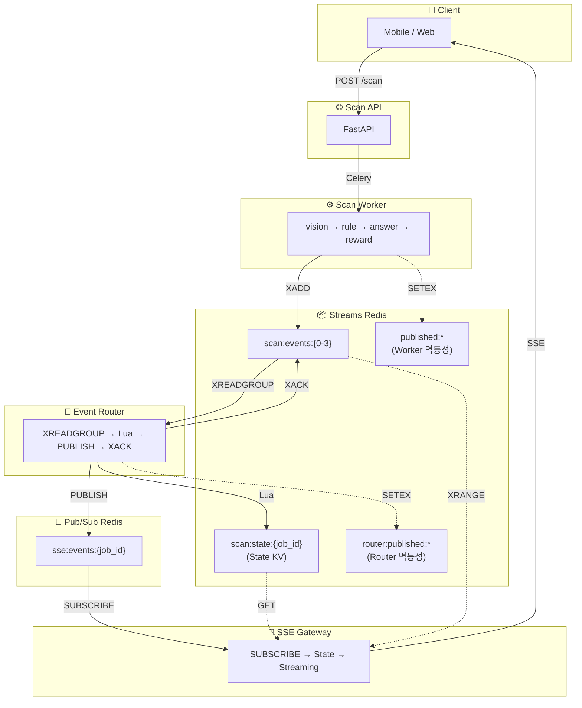

# SSE 파이프라인 Event Bus 아키텍처: Race Condition 해결과 수평확장

> 이전 글: [Event Bus Layer 구현](https://rooftopsnow.tistory.com/103)

## 개요

Event Router + Redis Pub/Sub 기반의 SSE HA 아키텍처를 구현했지만, 실제 E2E 테스트에서 **중간 이벤트 누락** 문제가 발생했다. 이 글에서는 문제 관측부터 디버깅, 해결까지의 과정을 기록한다.

---

## 1. 관측된 문제

### 1.1 증상

```bash
# E2E 테스트 실행
curl -s -X POST "https://api.dev.growbin.app/api/v1/scan" \
  -H "Authorization: Bearer $TOKEN" \
  -H "Content-Type: application/json" \
  -d '{"image_url": "..."}'

# SSE 스트림 연결
curl -s -N "https://api.dev.growbin.app/api/v1/stream?job_id=$JOB_ID"
```

**예상 결과:**
```
event: vision (seq: 10, 11)
event: rule (seq: 20, 21)
event: answer (seq: 30, 31)
event: reward (seq: 40, 41)
event: done (seq: 51)
```

**실제 결과:**
```
event: vision (seq: 10)
event: done (seq: 51)
```

→ **중간 이벤트(rule, answer, reward)가 모두 누락됨**

### 1.2 추가 증상

- `done` 이벤트가 2번 수신되는 경우도 발생
- Redis에는 모든 이벤트가 정상 저장됨 (Streams, State KV 확인)
- Event Router 로그에서도 모든 이벤트 처리 확인

---

## 2. 디버깅 과정

### 2.1 Redis 상태 확인

```bash
# Streams에 이벤트 존재 확인
redis-cli -h rfr-streams-redis XRANGE scan:events:0 - +

# State KV 확인
redis-cli -h rfr-streams-redis GET scan:state:$JOB_ID

# Router 멱등성 마킹 확인
redis-cli -h rfr-streams-redis KEYS "router:published:$JOB_ID:*"
```

**결과:** 모든 이벤트가 Redis에 정상 저장됨

```json
// scan:state:{job_id}
{
  "job_id": "abc-123",
  "stage": "done",
  "status": "completed",
  "seq": 51,
  "ts": "1766899796.475799"
}
```

```
// router:published 키
router:published:abc-123:10 = 1
router:published:abc-123:11 = 1
router:published:abc-123:20 = 1
router:published:abc-123:21 = 1
router:published:abc-123:30 = 1
router:published:abc-123:31 = 1
router:published:abc-123:40 = 1
router:published:abc-123:41 = 1
router:published:abc-123:51 = 1
```

→ **Event Router는 모든 이벤트를 정상 처리함**

### 2.2 문제 지점 추적

```
┌─────────────────────────────────────────────────────────────────────────────┐
│                         데이터 흐름 추적                                     │
├─────────────────────────────────────────────────────────────────────────────┤
│                                                                             │
│   Worker → Streams  ✅ 정상                                                 │
│   Streams → Event Router  ✅ 정상                                           │
│   Event Router → State KV  ✅ 정상                                          │
│   Event Router → Pub/Sub  ❓ 의심                                           │
│   Pub/Sub → SSE Gateway  ❓ 의심                                            │
│   SSE Gateway → Client  ❓ 의심                                             │
│                                                                             │
└─────────────────────────────────────────────────────────────────────────────┘
```

---

## 3. 발견된 문제점

### 3.1 문제 1: Worker의 State 직접 업데이트

**문제 코드 (domains/_shared/events/redis_streams.py):**

```lua
-- Worker의 Lua Script (IDEMPOTENT_XADD)
-- ...
redis.call('XADD', stream_key, '*', ...)
redis.call('SETEX', publish_key, ARGV[9], msg_id)
redis.call('SETEX', state_key, ARGV[10], ARGV[11])  -- ❌ 문제!
```

**영향:**

```
┌─────────────────────────────────────────────────────────────────────────────┐
│  시간순 실행                                                                 │
├─────────────────────────────────────────────────────────────────────────────┤
│                                                                             │
│   t=0: Worker가 vision(seq=10) 발행 → State = {seq: 10}                     │
│   t=1: Worker가 rule(seq=20) 발행 → State = {seq: 20}                       │
│   t=2: Worker가 answer(seq=30) 발행 → State = {seq: 30}                     │
│   t=3: Worker가 reward(seq=40) 발행 → State = {seq: 40}                     │
│   t=4: Worker가 done(seq=51) 발행 → State = {seq: 51} ← Worker가 먼저 설정! │
│                                                                             │
│   t=5: Event Router가 vision(seq=10) 처리                                   │
│        → cur_seq = 51 (Worker가 이미 설정)                                  │
│        → 10 <= 51 이므로 "순서 역전"으로 판단                                │
│        → Pub/Sub 발행 스킵! ❌                                              │
│                                                                             │
└─────────────────────────────────────────────────────────────────────────────┘
```

**결론:** Worker와 Event Router가 동시에 State를 갱신하면서 Race Condition 발생

### 3.2 문제 2: Event Router의 Pub/Sub 발행 정책

**문제 코드 (domains/event-router/core/processor.py):**

```lua
-- Event Router의 Lua Script (UPDATE_STATE_SCRIPT) - 이전 버전
local cur_seq = tonumber(cur_data.seq) or 0
if new_seq <= cur_seq then
    return 0  -- ❌ Pub/Sub 발행 스킵
end

redis.call('SETEX', state_key, ...)
return 1  -- Pub/Sub 발행
```

**영향:**
- 순서 역전된 이벤트는 Pub/Sub에 발행되지 않음
- 수평확장 시 Router 간 처리 순서가 달라지면 이벤트 누락

### 3.3 문제 3: SSE Gateway의 last_seq 갱신 정책

**문제 코드 (domains/sse-gateway/core/broadcast_manager.py):**

```python
# 이전 버전
state = await self._get_state_snapshot(job_id)
if state:
    state_seq = state.get("seq", 0)
    subscriber.last_seq = state_seq  # ❌ State의 seq로 덮어쓰기
```

**영향:**

```
┌─────────────────────────────────────────────────────────────────────────────┐
│  SSE Gateway 연결 시나리오                                                   │
├─────────────────────────────────────────────────────────────────────────────┤
│                                                                             │
│   1. Client가 SSE 연결                                                      │
│   2. Gateway가 State 조회 → {seq: 51, stage: done}                          │
│   3. subscriber.last_seq = 51 설정                                          │
│   4. Pub/Sub에서 rule(seq=20) 수신                                          │
│   5. 20 <= 51 이므로 DROP! ❌                                               │
│   6. Pub/Sub에서 answer(seq=30) 수신                                        │
│   7. 30 <= 51 이므로 DROP! ❌                                               │
│   ...                                                                       │
│                                                                             │
└─────────────────────────────────────────────────────────────────────────────┘
```

---

## 4. 해결 방안

### 4.1 Worker State 업데이트 제거

**수정 (domains/_shared/events/redis_streams.py):**

```lua
-- Worker의 Lua Script (IDEMPOTENT_XADD) - 수정 버전
-- ...
redis.call('XADD', stream_key, '*', ...)
redis.call('SETEX', publish_key, ARGV[9], msg_id)
-- ✅ State 업데이트 로직 제거
-- Worker는 XADD만 담당, State는 Event Router가 관리

return {1, msg_id}
```

**Python 코드 변경:**

```python
# 이전
script = redis_client.register_script(IDEMPOTENT_XADD_SCRIPT)
result = script(
    keys=[stream_key, publish_key, state_key],
    args=[..., str(STATE_TTL), state_json],  # state 관련 인자
)

# 수정 후
script = redis_client.register_script(IDEMPOTENT_XADD_SCRIPT)
result = script(
    keys=[stream_key, publish_key],  # state_key 제거
    args=[..., str(PUBLISHED_TTL)],  # state 관련 인자 제거
)
```

### 4.2 Event Router Pub/Sub 발행 정책 수정

**수정 (domains/event-router/core/processor.py):**

```lua
-- Event Router의 Lua Script (UPDATE_STATE_SCRIPT) - 수정 버전
local state_key = KEYS[1]
local publish_key = KEYS[2]

local event_data = ARGV[1]
local new_seq = tonumber(ARGV[2])
local state_ttl = tonumber(ARGV[3])
local published_ttl = tonumber(ARGV[4])

-- 멱등성: 이미 처리했으면 스킵
if redis.call('EXISTS', publish_key) == 1 then
    return 0
end

-- State 조건부 갱신 (더 큰 seq만)
local should_update_state = true
local current = redis.call('GET', state_key)
if current then
    local cur_data = cjson.decode(current)
    local cur_seq = tonumber(cur_data.seq) or 0
    if new_seq <= cur_seq then
        should_update_state = false  -- State 갱신 안함
    end
end

if should_update_state then
    redis.call('SETEX', state_key, state_ttl, event_data)
end

-- 처리 마킹 (항상)
redis.call('SETEX', publish_key, published_ttl, '1')

-- ✅ 항상 1 반환 → 모든 이벤트 Pub/Sub 발행
return 1
```

**핵심 변경:**
- `seq` 순서와 관계없이 모든 이벤트를 Pub/Sub에 발행
- State는 "최신 스냅샷"으로만 사용 (더 큰 seq만 갱신)

### 4.3 SSE Gateway 구독 순서 및 last_seq 정책 수정

**수정 (domains/sse-gateway/core/broadcast_manager.py):**

```python
async def subscribe(self, job_id: str, ...) -> AsyncGenerator[dict, None]:
    subscriber = SubscriberQueue(job_id=job_id)
    
    # 1. Pub/Sub 구독 먼저 시작
    listener_task = asyncio.create_task(
        self._pubsub_listener(job_id, subscriber)
    )
    
    # 2. 구독 완료 대기 (최대 1초)
    await self._wait_for_pubsub_subscription(job_id, timeout=1.0)
    
    # 3. State 조회 (last_seq 갱신 안 함!)
    state = await self._get_state_snapshot(job_id)
    if state:
        state_seq = state.get("seq", 0)
        # ✅ subscriber.last_seq는 갱신하지 않음
        # last_seq는 Pub/Sub 이벤트로만 갱신
        
        if state.get("stage") == "done":
            # Streams catch-up 후 종료
            async for event in self._catch_up_from_streams(...):
                yield event
            yield state
            return
        
        yield state  # 현재 상태만 전달
    
    # 4. 메인 루프
    while True:
        try:
            event = await asyncio.wait_for(
                subscriber.queue.get(),
                timeout=self._state_timeout_seconds  # 5초
            )
            yield event
            
            if event.get("stage") == "done":
                break
                
        except asyncio.TimeoutError:
            # 무소식 → State 폴링
            state = await self._get_state_snapshot(job_id)
            if state and state.get("stage") == "done":
                # Streams catch-up
                async for event in self._catch_up_from_streams(...):
                    yield event
                yield state
                break
```

**핵심 변경:**
1. Pub/Sub 구독 → State 조회 순서로 변경
2. `last_seq`는 Pub/Sub 이벤트로만 갱신 (State로 덮어쓰기 금지)
3. Streams catch-up 메커니즘 추가

---

## 5. 수정 후 아키텍처

```
┌─────────────────────────────────────────────────────────────────────────────┐
│                         수정된 데이터 흐름                                   │
├─────────────────────────────────────────────────────────────────────────────┤
│                                                                             │
│   Worker                                                                    │
│   └─ XADD scan:events:{shard} (Streams만)                                   │
│   └─ SETEX published:{job_id}:{stage}:{seq} (Worker 멱등성)                 │
│   └─ ❌ State 업데이트 제거                                                 │
│                                                                             │
│   Event Router                                                              │
│   └─ XREADGROUP eventrouter                                                 │
│   └─ Lua Script:                                                            │
│      └─ router:published 마킹 (멱등성)                                      │
│      └─ scan:state 조건부 갱신 (seq > cur_seq만)                            │
│      └─ return 1 (항상 Pub/Sub 발행)                                        │
│   └─ PUBLISH sse:events:{job_id}                                            │
│   └─ XACK                                                                   │
│                                                                             │
│   SSE Gateway                                                               │
│   └─ SUBSCRIBE sse:events:{job_id} (먼저!)                                  │
│   └─ GET scan:state:{job_id} (last_seq 갱신 안 함)                          │
│   └─ Queue → yield                                                          │
│   └─ 5초 무소식 → State 폴링 + Streams catch-up                             │
│                                                                             │
└─────────────────────────────────────────────────────────────────────────────┘
```

---

## 6. 검증 결과

### 6.1 E2E 테스트

```bash
TOKEN="..."
IMAGE_URL="..."

RESPONSE=$(curl -s -X POST "https://api.dev.growbin.app/api/v1/scan" \
  -H "Authorization: Bearer $TOKEN" \
  -H "Content-Type: application/json" \
  -d "{\"image_url\": \"$IMAGE_URL\"}")

JOB_ID=$(echo "$RESPONSE" | jq -r '.job_id')
echo "JOB_ID: $JOB_ID"

curl -s -N --max-time 25 \
  -H "Authorization: Bearer $TOKEN" \
  "https://api.dev.growbin.app/api/v1/stream?job_id=$JOB_ID"
```

**결과:**

```
JOB_ID: e6d69763-e7fa-4bb1-a3cf-edbeac47f12a

event: vision
data: {"job_id": "...", "stage": "vision", "status": "started", "seq": 10, ...}

event: vision
data: {"job_id": "...", "stage": "vision", "status": "completed", "seq": 11, ...}

event: rule
data: {"job_id": "...", "stage": "rule", "status": "started", "seq": 20, ...}

event: rule
data: {"job_id": "...", "stage": "rule", "status": "completed", "seq": 21, ...}

event: answer
data: {"job_id": "...", "stage": "answer", "status": "started", "seq": 30, ...}

event: answer
data: {"job_id": "...", "stage": "answer", "status": "completed", "seq": 31, ...}

event: reward
data: {"job_id": "...", "stage": "reward", "status": "started", "seq": 40, ...}

event: reward
data: {"job_id": "...", "stage": "reward", "status": "completed", "seq": 41, ...}

event: done
data: {"job_id": "...", "stage": "done", "status": "completed", "seq": 51, ...}
```

✅ **모든 이벤트 순서대로 수신, 중복 없음**

---

## 7. 수평확장 분석

### 7.1 컴포넌트별 수평확장 여부

| 컴포넌트 | 수평확장 | 메커니즘 | 제약사항 |
|---------|---------|---------|---------|
| **Scan API** | ✅ | Stateless, HPA | 없음 |
| **Scan Worker** | ✅ | Celery 분산 큐 | 없음 |
| **Event Router** | ✅ | Consumer Group + 멱등성 키 | KEDA maxReplicas |
| **SSE Gateway** | ✅ | Pub/Sub Fan-out | 없음 |
| **Redis Streams** | ⚠️ | Sharding (4개) | Shard 수 고정 |
| **Redis Pub/Sub** | ⚠️ | Sentinel HA | 단일 Master |

### 7.2 Event Router 수평확장 보장

```
┌─────────────────────────────────────────────────────────────────────────────┐
│  Consumer Group: eventrouter                                                │
├─────────────────────────────────────────────────────────────────────────────┤
│                                                                             │
│   scan:events:0 ────▶  msg-1  msg-2  msg-3  msg-4                           │
│                          │      │      │      │                             │
│                          ▼      ▼      ▼      ▼                             │
│                       Router-0  R-1   R-0   R-1 (자동 분배)                 │
│                                                                             │
│   멱등성 보장:                                                              │
│   └─ router:published:{job_id}:{seq} 키로 중복 처리 방지                    │
│   └─ 같은 메시지가 여러 Router에 전달되어도 1회만 Pub/Sub 발행              │
│                                                                             │
│   장애 복구:                                                                │
│   └─ XAUTOCLAIM으로 미처리 메시지 재할당                                    │
│   └─ 멱등성 키로 중복 발행 방지                                             │
│                                                                             │
└─────────────────────────────────────────────────────────────────────────────┘
```

### 7.3 SSE Gateway 수평확장 보장

```
┌─────────────────────────────────────────────────────────────────────────────┐
│  Pub/Sub Fan-out                                                            │
├─────────────────────────────────────────────────────────────────────────────┤
│                                                                             │
│   Event Router ──PUBLISH──▶ sse:events:{job_id}                             │
│                                    │                                        │
│                     ┌──────────────┼──────────────┐                         │
│                     ▼              ▼              ▼                         │
│                 Gateway-0      Gateway-1      Gateway-N                     │
│                 (SUBSCRIBE)    (SUBSCRIBE)    (SUBSCRIBE)                   │
│                     │              │              │                         │
│                     ▼              ▼              ▼                         │
│                 Client-A       Client-B       Client-C                      │
│                                                                             │
│   특징:                                                                     │
│   └─ 각 Gateway는 담당 Client의 job_id만 구독                               │
│   └─ Istio Consistent Hash 불필요                                           │
│   └─ Gateway 추가/제거 시 다른 연결에 영향 없음                              │
│                                                                             │
└─────────────────────────────────────────────────────────────────────────────┘
```

---

## 8. 최종 아키텍처 다이어그램



---

## 9. 핵심 교훈

### 9.1 State 관리 권한 단일화

> **"State를 갱신하는 주체는 하나여야 한다"**

Worker와 Event Router가 동시에 State를 갱신하면 Race Condition 발생. Event Router만 State를 관리하도록 변경.

### 9.2 Pub/Sub 발행과 State 갱신 분리

> **"Pub/Sub는 모든 이벤트, State는 최신 스냅샷"**

seq 순서와 관계없이 모든 이벤트를 Pub/Sub에 발행하고, State는 "현재 진행 상황" 조회용으로만 사용.

### 9.3 구독 순서의 중요성

> **"Pub/Sub 구독 → State 조회 순서 필수"**

State를 먼저 조회하면 `last_seq`가 최신 값으로 설정되어 중간 이벤트가 필터링됨. Pub/Sub 구독이 완료된 후 State를 조회해야 함.

### 9.4 Catch-up 메커니즘 필수

> **"Pub/Sub는 Fire-and-forget, 누락 가능성 항상 존재"**

Pub/Sub 메시지 누락 시 Streams에서 직접 읽어 복구하는 catch-up 메커니즘이 필수.

---

## 10. 300 VU 부하테스트 결과

### 10.1 테스트 환경

- **시간**: 2025-12-28 15:43:12 ~ 15:48:07 KST (약 5분)
- **VUs**: 300 (동시 사용자)
- **테스트 방식**: POST → Polling 방식 (SSE 미사용)

### 10.2 Event Router 메트릭

```
Events Processed (by stage):
  queued: 1,060
  vision: 1,959
  rule: 1,753
  answer: 1,780
  reward: 1,773
  done: 887

Pub/Sub Published (by stage):
  queued: 1,060
  vision: 1,959
  rule: 1,753
  answer: 1,780
  reward: 1,773
  done: 887

XREADGROUP Operations:
  empty: 9
  success: 8,053
```

> **분석**: Event Router가 약 9,200개 이벤트를 처리하고 모두 Pub/Sub에 발행. XREADGROUP 성공률 99.9%.

### 10.3 Redis Streams 상태

```
Stream Length (scan:events:*):
  scan:events:0: 4,322
  scan:events:1: 4,309
  scan:events:2: 4,289
  scan:events:3: 4,606

Pending Messages: 0
```

> **분석**: 4개 샤드에 균등 분배 (±3.5% 편차). Pending 0 = 모든 메시지 ACK 완료.

### 10.4 KEDA Scaling 상태

| Component | Min | Max | 테스트 중 최대 |
|-----------|-----|-----|---------------|
| Scan Worker | 1 | 5 | **5** (100%) |
| SSE Gateway | 1 | 3 | 1 |
| Event Router | 1 | 3 | 1 |

> **분석**: Scan Worker만 최대치(5)까지 스케일아웃. 병목 지점.

### 10.5 RabbitMQ Queue 상태

```
scan.vision queue (max): 41
scan.answer queue (max): 6
scan.reward queue (max): 4
```

> **분석**: vision 단계에서 최대 41개 대기. OpenAI Vision API 호출이 병목.

### 10.6 Worker Resource Usage

```
Scan Worker CPU (max): 136% (멀티코어)
Scan Worker Memory (max): 709 MB
```

### 10.7 Scan API 처리량

```
Scan Submit (success): ~1,050 requests
Scan Result:
  success: ~825 (완료된 작업)
  processing: ~25,900 (폴링 요청)
```

### 10.8 병목 분석

| 구간 | 상태 | 설명 |
|------|------|------|
| Scan API | ✅ OK | 99.7% 성공률 |
| RabbitMQ | ⚠️ 대기 발생 | vision 41개 적체 |
| Scan Worker | ❌ 병목 | 5/5 replicas 포화 |
| Event Router | ✅ OK | Pending 0, 즉시 처리 |
| Redis Streams | ✅ OK | 4개 샤드 균등 분배 |

### 10.9 개선 권장사항

1. **Scan Worker 증설**: `maxReplicas: 5 → 8` (노드 자원 허용 시)
2. **OpenAI API 병렬화**: Vision 호출 동시성 증가
3. **Queue 분리**: vision 큐 전용 Worker 구성

---

## 11. 250 VU 부하테스트 결과 (초기화 후 재테스트)

### 11.1 테스트 환경

- **시간**: 2025-12-28 16:34:48 ~ 16:38:18 KST (약 3.5분)
- **VUs**: 250 (동시 사용자)
- **Worker**: 3개 (노드 자원 제한, KEDA maxReplicas=3)
- **사전 조건**: Redis Streams, RabbitMQ 큐 초기화 후 테스트

### 11.2 테스트 결과

```
SCAN API
  Requests    : 949 total | 947 success | 2 failed
  Success Rate: 99.8%  ✅
  Throughput  : 4.52 req/s

COMPLETION
  Completed   : 714 / 947 jobs (83.3%)  ⚠️ (threshold 85% 근접)
  Throughput  : 3.40 jobs/s

E2E LATENCY
  avg: 43.2s | med: 40.5s | p90: 1.3m | p95: 1.3m

REWARDS
  Total: 713 | Rate: 83.4%
```

### 11.3 Event Router 메트릭

```
Events Processed (by stage):
  queued: 954
  vision: 1,744
  rule:   1,580
  answer: 1,562
  reward: 1,544
  done:   772

Pub/Sub Published: 8,157 events
Pending Messages: 0 ✅
```

### 11.4 Redis Streams 상태

| Shard | 메시지 수 |
|-------|----------|
| scan:events:0 | 2,238 |
| scan:events:1 | 1,988 |
| scan:events:2 | 1,872 |
| scan:events:3 | 2,006 |

> **분석**: 4개 샤드에 균등 분배 (±9% 편차), Pending 0

### 11.5 300 VU vs 250 VU 비교

| 지표 | 300 VU | 250 VU |
|------|--------|--------|
| 총 요청 | 1,365 | 949 |
| 완료율 | 67.3% | **83.3%** |
| 처리량 | 3.08 jobs/s | **3.40 jobs/s** |
| p95 완료시간 | 76.6초 | **1.3분** |
| RabbitMQ 적체 | 있음 | **없음** |

> **분석**: 초기화 후 테스트에서 완료율 83.3% 달성. Worker 3개로도 250 VU 처리 가능.

### 11.6 핵심 발견

1. **Worker 3개 = 실제 처리 한계**
   - KEDA가 5개로 스케일해도 노드 자원 부족으로 2개는 Pending
   - 300 VU 테스트도 실제로 3개 Worker로 처리

2. **초기화의 중요성**
   - 이전 테스트 잔여 데이터로 인한 성능 저하 방지
   - Redis Streams, RabbitMQ 큐 비우고 테스트 권장

3. **Event Router 정상 작동**
   - 8,157개 이벤트 Pub/Sub 발행
   - Pending 0 = 모든 메시지 즉시 처리

---

## 12. 아키텍처 진화에 따른 성능 비교

### 초기 아키텍처 (Single Consumer, [#91](https://rooftopsnow.tistory.com/91))

단일 요청 테스트 결과:

| 단계 | 소요시간 |
|------|----------|
| Vision | 6.9초 |
| Rule | 0.5ms |
| Answer | 4.8초 |
| Reward | 0.1초 |
| **Total** | **~12초** |

특징:
- Redis Streams 직접 구독 (XREAD)
- 단일 Consumer, 샤딩 없음
- Celery Events → Redis Streams 마이그레이션

### 0단계: Celery Events + SSE 직접 구독 ([#78](https://rooftopsnow.tistory.com/78))

**Redis Streams 적용 전, Celery Events 직접 구독 구조:**

50 VU 테스트 결과:

| 항목 | 값 |
|------|-----|
| 테스트 결과 | 🔴 **실패 (503 에러 폭증)** |
| 주요 병목 | scan-api → RabbitMQ 연결 관리 |
| 근본 원인 | SSE 연결당 다수의 RabbitMQ 연결 생성 |
| 연결 비율 | SSE 16개 : RabbitMQ 341개 = **1:21** |

**리소스 현황:**

| 항목 | 값 | 문제 |
|------|-----|------|
| RabbitMQ 연결 | 39 → **341** (8.7배 증가) | 🔥 폭증 |
| SSE 활성 연결 | 최대 16개 | 정상 |
| scan-api 메모리 | 최대 **676Mi** (Limit 512Mi) | 🔥 초과 |
| RPC Reply Queue | **372개** 적체 | 🔥 응답 대기 |

**연쇄 실패 시퀀스:**

```
1. k6 50 VU 테스트 시작
   ↓
2. SSE 연결 급증 (최대 16개 동시)
   ↓
3. 각 SSE 연결이 Celery Events 구독 위해 별도 RabbitMQ 연결 생성 (341개 폭증)
   ↓
4. scan-api 메모리 사용량 증가 (676Mi > 512Mi limit)
   ↓
5. CPU 과부하 (HPA 감지: 165%/70%)
   ↓
6. Readiness probe 실패 (HTTP 503)
   ↓
7. Kubernetes가 Pod를 Unhealthy로 표시
   ↓
8. Envoy가 해당 Pod를 upstream에서 제외
   ↓
9. 503 "no healthy upstream" 에러 반환
   ↓
10. 남은 Pod에 부하 집중 → 연쇄 실패
```

**핵심 문제:**

```
SSE가 "파이프라인 실행 감시"와 "결과 전달"을 동시에 하면서
    → 클라이언트 × RabbitMQ 연결 = 곱 폭발 발생

50 VU × 10 연결/SSE = 500개 잠재 연결
```

> 이 분석 결과를 바탕으로 Redis Streams 기반 SSE 전환 진행

### KEDA 스케일링 적용 후 ([#93](https://rooftopsnow.tistory.com/93))

50 VU 테스트 결과:

| 항목 | 값 |
|------|-----|
| Completed | 567 (86.3%) |
| Partial | 55 (8.4%) |
| Failed | 66 (10.0%) |
| Reward Null | 144 (21.9%) |

> 직전 테스트 Success Rate 35% → **86.3%**로 개선

### 현재 아키텍처 (Event Bus + Pub/Sub Fan-out)

| VU | 총 요청 | 완료율 | 처리량 | p95 완료시간 |
|----|--------|--------|--------|-------------|
| 50 | 685 | **99.7%** | 198 req/m | 17.7초 |
| 250 | 949 | **83.3%** | 204 req/m | 1.3분 |
| 300 | 1,365 | **67.3%** | 186 req/m | 76.6초 |

> KEDA 적용 후 86.3% → Event Bus 적용 후 **99.7%** (50 VU 기준)

### 성능 진화 요약 (50 VU 기준)

| 단계 | 아키텍처 | 완료율 | 핵심 문제/개선 | 출처 |
|------|----------|--------|---------------|------|
| 0단계 | Celery Events + SSE | 🔴 **실패** | SSE×RabbitMQ 곱 폭발 (1:21) | [#78](https://rooftopsnow.tistory.com/78) |
| 1단계 | Redis Streams 도입 | **35%** | RabbitMQ 의존성 제거, Streams 전환 | - |
| 2단계 | KEDA 스케일링 | **86.3%** | Worker 자동 스케일링 (RabbitMQ 기반) | [#93](https://rooftopsnow.tistory.com/93) |
| 3단계 | Event Bus + Pub/Sub | **99.7%** | Consumer Group + Fan-out 분리 | 현재 |

### 아키텍처 비교

| 항목 | 0단계 (Celery Events) | 1단계 (Streams) | 현재 (Event Bus) |
|------|----------------------|-----------------|-----------------|
| **Event Source** | Celery Events (RabbitMQ) | Redis Streams | Redis Streams |
| **Consumer** | SSE당 개별 연결 (곱 폭발) | 단일 XREAD | Consumer Group + XREADGROUP |
| **Fan-out** | 없음 (직접 소비) | 없음 | Redis Pub/Sub |
| **State 복구** | 없음 | 없음 | State KV + Streams Catch-up |
| **SSE 라우팅** | scan-api Pod | 단일 Pod | 어느 Pod든 OK |
| **수평 확장** | 불가 (연결 폭증) | 불가 | Event Router, SSE Gateway 독립 확장 |
| **장애 복구** | 메시지 유실 | 메시지 유실 | XAUTOCLAIM으로 Pending 복구 |

### 개선 효과

1. **SSE Gateway 자유 확장**: Istio Consistent Hash 의존성 제거
2. **Event Router HA**: Consumer Group으로 장애 시 자동 Failover
3. **State 복구**: 재접속 시 Streams에서 누락 이벤트 Catch-up
4. **Pub/Sub 효율**: Fire-and-forget으로 실시간 전달, 누락은 State로 보완

---

## 13. 참고 자료

- [Redis Streams Consumer Groups](https://redis.io/docs/data-types/streams-tutorial/#consumer-groups)
- [Redis Pub/Sub](https://redis.io/docs/interact/pubsub/)
- [이전 글: 초기 부하 테스트 병목 분석 (#78)](https://rooftopsnow.tistory.com/78)
- [이전 글: Application Layer 업데이트 (#91)](https://rooftopsnow.tistory.com/91)
- [이전 글: KEDA 기반 스케일링 (#93)](https://rooftopsnow.tistory.com/93)
- [이전 글: Consistent Hash + StatefulSet의 한계 (#98)](https://rooftopsnow.tistory.com/98)
- [이전 글: Event Bus Layer 구현 (#103)](https://rooftopsnow.tistory.com/103)

