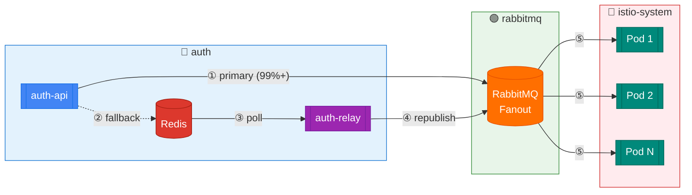
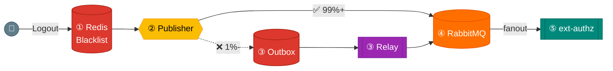
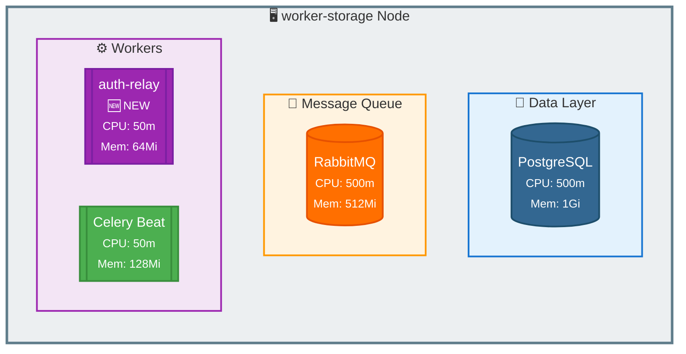
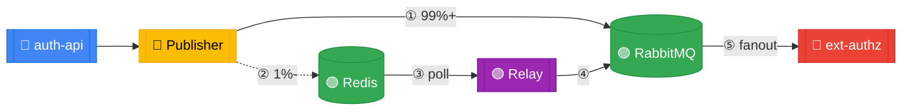
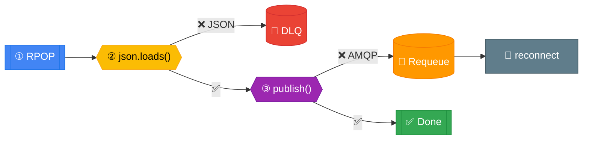

# Blacklist Relay Worker 구현

> **관련 문서**: [설계 결정 문서](./05-blacklist-relay-worker-design.md)
> 
> **PR**: [#243](https://github.com/eco2-team/backend/pull/243)

---

## 1. 전체 디자인

### 1.1 시스템 개요



| 단계 | 경로 | 설명 |
|------|------|------|
| ① | auth-api → RabbitMQ | 정상 발행 (99%+) |
| ② | auth-api → Redis | MQ 실패 시 Outbox 적재 |
| ③ | Redis → auth-relay | 1초마다 폴링 |
| ④ | auth-relay → RabbitMQ | Outbox 이벤트 재발행 |
| ⑤ | RabbitMQ → ext-authz | Fanout 브로드캐스트 |

### 1.2 데이터 흐름



| 단계 | 컴포넌트 | 동작 |
|------|----------|------|
| ① | Redis Blacklist | `SETEX token:blacklist:{jti} {ttl}` |
| ② | Publisher | `basic_publish()` 시도 |
| ③ | Outbox → Relay | 실패 시 `LPUSH` → `RPOP` → republish |
| ④ | RabbitMQ | Fanout 브로드캐스트 |
| ⑤ | ext-authz | `cache.Store(jti, entry)` |

### 1.3 컴포넌트 배치



**배치 결정 이유**:

| 요소 | 결정 | 이유 |
|------|------|------|
| **노드 선택** | worker-storage | Redis, RabbitMQ와 동일 노드 → 네트워크 지연 최소화 |
| **리소스** | CPU 50m, Mem 64Mi | 경량 워크로드 → 기존 리소스 여유 활용 |
| **프로비저닝** | 불필요 | 기존 인프라 활용 → 추가 노드 프로비저닝 없음 |

---

## 2. 주요 컴포넌트

### 2.1 컴포넌트 의존성



| 단계 | 경로 | 설명 |
|------|------|------|
| ① | Publisher → RabbitMQ | 정상 발행 (99%+) |
| ② | Publisher → Redis | MQ 실패 시 Outbox 적재 |
| ③ | Redis → Relay | 1초 폴링, RPOP |
| ④ | Relay → RabbitMQ | 재발행 |
| ⑤ | RabbitMQ → ext-authz | Fanout 브로드캐스트 |

### 2.2 파일 구조

```
domains/auth/
├── services/
│   └── blacklist_publisher.py     # [수정] MQ 발행 + Outbox Fallback
│       ├── get_blacklist_publisher()    # Singleton Factory
│       └── BlacklistEventPublisher
│           ├── publish_add()            # 1차: MQ, 실패 시 Outbox
│           ├── _ensure_connection()     # Lazy Connection
│           ├── _queue_to_outbox()       # Redis LPUSH
│           └── close()                  # Resource Cleanup
│
├── tasks/
│   ├── __init__.py                # [신규]
│   └── blacklist_relay.py         # [신규] Relay Worker
│       ├── BlacklistRelay
│       │   ├── start()                  # Entry Point
│       │   ├── _connect_mq()            # RabbitMQ 연결
│       │   ├── _handle_shutdown()       # SIGTERM Handler
│       │   ├── _run()                   # Main Loop
│       │   ├── _process_batch()         # Batch Processing
│       │   ├── _publish_to_mq()         # MQ 발행
│       │   ├── _reconnect_mq()          # 재연결
│       │   └── _cleanup()               # Resource Cleanup
│       └── main()                       # CLI Entry Point
│
├── tests/
│   └── unit/
│       ├── test_blacklist_publisher.py  # [신규] 14 tests
│       └── test_blacklist_relay.py      # [신규] 22 tests
│
├── Dockerfile.relay               # [신규] 경량 이미지 (~50MB)
└── requirements-relay.txt         # [신규] 최소 의존성
```

### 2.3 Redis 키 설계

| Key | Type | 용도 | TTL | 예상 크기 |
|-----|------|------|-----|----------|
| `outbox:blacklist` | List | 실패 이벤트 큐 (FIFO) | 영구 | ~0 (정상 시) |
| `outbox:blacklist:dlq` | List | 복구 불가 이벤트 | 영구 | ~0 (정상 시) |

**이벤트 JSON 구조**:
```json
{
  "type": "add",
  "jti": "a1b2c3d4-e5f6-7890-abcd-ef1234567890",
  "expires_at": "2025-12-31T23:59:59+00:00",
  "timestamp": "2025-12-30T10:30:00+00:00"
}
```

---

## 3. 구현 철학

### 3.1 설계 원칙

| 원칙 | 적용 | 이유 |
|------|------|------|
| **Fail-Fast** | MQ 실패 시 즉시 Outbox로 전환 | UX 영향 최소화 |
| **Non-Blocking** | 로그아웃 응답에 재시도 시간 미포함 | 응답 지연 방지 |
| **FIFO** | LPUSH/RPOP 조합 | 이벤트 순서 보장 |
| **At-Least-Once** | 실패 시 재큐잉 | 메시지 손실 방지 |
| **Graceful Degradation** | Relay 장애 시에도 auth-api 정상 | 결합도 최소화 |
| **Minimal Dependencies** | redis, pika만 사용 | 이미지 경량화 |

### 3.2 BlacklistEventPublisher 구현

#### Singleton 패턴

```python
_publisher_instance: BlacklistEventPublisher | None = None

def get_blacklist_publisher() -> BlacklistEventPublisher | None:
    """Singleton factory - 앱 생명주기 동안 하나의 연결 유지."""
    global _publisher_instance
    
    amqp_url = os.getenv("AMQP_URL")
    if not amqp_url:
        return None  # MQ 미설정 시 발행 비활성화
    
    if _publisher_instance is None:
        _publisher_instance = BlacklistEventPublisher(amqp_url)
    
    return _publisher_instance
```

**선택 이유**:
- RabbitMQ 연결은 비용이 높음 (TCP handshake + AMQP negotiation)
- 요청마다 새 연결 생성 시 성능 저하
- Connection Pool 대신 Singleton 선택 → 구현 단순화

#### Lazy Connection

```python
def _ensure_connection(self) -> None:
    """연결이 없거나 끊어진 경우에만 재연결."""
    if self._connection and not self._connection.is_closed:
        return  # 기존 연결 재사용
    
    # Lazy: 최초 발행 시점에 연결
    params = pika.URLParameters(self.amqp_url)
    self._connection = pika.BlockingConnection(params)
    self._channel = self._connection.channel()
    self._channel.exchange_declare(
        exchange=self.EXCHANGE_NAME,
        exchange_type="fanout",
        durable=True,
    )
```

**선택 이유**:
- 앱 시작 시 MQ 장애가 전체 부팅 실패로 이어지지 않음
- 실제 발행 필요 시점에만 연결 → 리소스 효율

#### Fallback 전략

```python
def publish_add(self, jti: str, expires_at: datetime) -> bool:
    """Publish with Outbox fallback.
    
    Returns:
        True: MQ 직접 발행 성공
        False: Outbox로 폴백 (Relay가 처리 예정)
    """
    event = {
        "type": "add",
        "jti": jti,
        "expires_at": expires_at.isoformat(),
        "timestamp": datetime.utcnow().isoformat(),
    }

    try:
        self._ensure_connection()
        self._channel.basic_publish(
            exchange=self.EXCHANGE_NAME,
            routing_key="",
            body=json.dumps(event),
            properties=pika.BasicProperties(
                content_type="application/json",
                delivery_mode=2,  # Persistent
            ),
        )
        return True
    except Exception as e:
        logger.warning(f"MQ publish failed, queueing to outbox: {e}")
        self._connection = None  # Reset for next attempt
        self._channel = None
        self._queue_to_outbox(event)
        return False
```

**반환값 설계**:
- `True`: 정상 발행 → 즉시 ext-authz 갱신
- `False`: Outbox 폴백 → 최대 1초 지연 후 갱신
- 예외 발생 안 함 → 로그아웃 응답 항상 성공

### 3.3 BlacklistRelay 구현

#### Polling 기반 설계

```python
async def _run(self) -> None:
    """Main polling loop."""
    while not self._shutdown:
        try:
            processed = await self._process_batch()
            if processed == 0:
                # 처리할 이벤트 없음 → 대기
                await asyncio.sleep(POLL_INTERVAL)
        except pika.exceptions.AMQPConnectionError:
            logger.warning("MQ connection lost, reconnecting...")
            self._reconnect_mq()
            await asyncio.sleep(POLL_INTERVAL)
        except Exception:
            logger.exception("Relay loop error")
            await asyncio.sleep(POLL_INTERVAL * 2)

    await self._cleanup()
```

**Push vs Pull 선택**:

| 방식 | 장점 | 단점 |
|------|------|------|
| **Push (Redis Pub/Sub)** | 즉시 전달 | 연결 끊김 시 메시지 손실 |
| **Pull (Polling)** | 메시지 손실 없음 | 폴링 간격만큼 지연 |

→ **Pull 선택**: At-Least-Once 보장이 더 중요

#### 배치 처리

```python
async def _process_batch(self) -> int:
    """Batch processing for efficiency."""
    processed = 0
    
    for _ in range(BATCH_SIZE):  # 기본 10개
        event_json = await self._redis.rpop(OUTBOX_KEY)
        if not event_json:
            break  # Outbox 비어있음
        
        try:
            event = json.loads(event_json)
            self._publish_to_mq(event)
            processed += 1
        except json.JSONDecodeError:
            # 복구 불가 → DLQ
            await self._redis.lpush(DLQ_KEY, event_json)
        except pika.exceptions.AMQPError:
            # MQ 일시 장애 → 재큐잉 (순서 유지)
            await self._redis.rpush(OUTBOX_KEY, event_json)
            self._reconnect_mq()
            break  # 배치 중단, 다음 폴링에서 재시도
    
    return processed
```

**배치 크기 결정**:
- 너무 작음 (1): 네트워크 오버헤드
- 너무 큼 (100+): 메모리 사용량 증가, 장애 시 재처리 범위 증가
- **10**: 균형점 (조정 가능, ConfigMap)

#### 에러 처리 전략



| 에러 | 처리 | 이유 |
|------|------|------|
| `JSONDecodeError` | DLQ 이동 | 복구 불가, 무한 루프 방지 |
| `AMQPError` | RPUSH 재큐잉 | 순서 유지, 재시도 |
| Success | `processed += 1` | 정상 완료 |

#### Graceful Shutdown

```python
def _handle_shutdown(self) -> None:
    """SIGTERM/SIGINT 수신 시 graceful shutdown."""
    logger.info("Shutdown signal received")
    self._shutdown = True
    # 현재 배치 완료 후 종료 (진행 중 이벤트 손실 방지)
```

**Kubernetes 통합**:
- `terminationGracePeriodSeconds`: 30초
- SIGTERM 수신 → 현재 배치 완료 → 연결 정리 → 종료
- 강제 종료(SIGKILL) 전까지 최대 30초 유예

### 3.4 Docker 이미지 최적화

```dockerfile
# 경량 베이스 이미지
FROM python:3.11-slim

# 최소 의존성만 설치 (redis, pika)
COPY domains/auth/requirements-relay.txt .
RUN pip install --no-cache-dir -r requirements-relay.txt

# 코드만 복사 (전체 도메인 X)
COPY domains/auth/tasks/ /app/domains/auth/tasks/
```

**이미지 크기 비교**:
| 이미지 | 크기 | 포함 내용 |
|--------|------|----------|
| `auth-api` | ~350MB | FastAPI, SQLAlchemy, gRPC, 등 |
| `auth-relay` | ~50MB | redis, pika만 |

---

## 4. 테스트

### 4.1 테스트 구조

```
tests/unit/
├── test_blacklist_publisher.py    # 14 tests
│   ├── TestGetBlacklistPublisher  # Singleton 동작
│   │   ├── test_returns_none_when_amqp_not_configured
│   │   ├── test_returns_publisher_when_amqp_configured
│   │   └── test_returns_singleton
│   │
│   ├── TestBlacklistEventPublisher  # 핵심 로직
│   │   ├── test_init
│   │   ├── test_ensure_connection_creates_connection
│   │   ├── test_ensure_connection_reuses_existing
│   │   ├── test_publish_add_success
│   │   └── test_publish_add_failure_queues_to_outbox
│   │
│   ├── TestQueueToOutbox  # Fallback 동작
│   │   ├── test_returns_false_when_redis_url_not_set
│   │   ├── test_queues_event_to_redis
│   │   └── test_returns_false_on_redis_error
│   │
│   └── TestClose  # Resource Cleanup
│       ├── test_close_when_no_connection
│       ├── test_close_when_connection_already_closed
│       └── test_close_closes_connection
│
└── test_blacklist_relay.py        # 22 tests
    ├── TestBlacklistRelayInit     # 초기화
    ├── TestConnectMq              # MQ 연결
    ├── TestHandleShutdown         # Graceful Shutdown
    ├── TestPublishToMq            # 발행
    ├── TestReconnectMq            # 재연결
    ├── TestProcessBatch           # 배치 처리 (핵심)
    │   ├── test_returns_zero_when_outbox_empty
    │   ├── test_processes_valid_event
    │   ├── test_processes_multiple_events
    │   ├── test_invalid_json_goes_to_dlq
    │   ├── test_mq_error_requeues_event
    │   └── test_respects_batch_size
    ├── TestCleanup                # Resource Cleanup
    ├── TestRun                    # Main Loop
    ├── TestStart                  # Entry Point
    └── TestProcessBatchEdgeCases  # Edge Cases
```

### 4.2 테스트 커버리지

```
================================ tests coverage ================================

Name                                           Stmts   Miss  Cover   Missing
----------------------------------------------------------------------------
domains/auth/services/blacklist_publisher.py      70      3    96%   49-51
domains/auth/tasks/blacklist_relay.py            121      5    96%   123-124, 230-235
----------------------------------------------------------------------------
TOTAL                                            191      8    96%

============================== 36 passed in 0.26s ==============================
```

| 파일 | Statements | Missed | Coverage | 미커버 라인 |
|------|-----------|--------|----------|------------|
| `blacklist_publisher.py` | 70 | 3 | **96%** | 49-51 (close 예외) |
| `blacklist_relay.py` | 121 | 5 | **96%** | 123-124, 230-235 (main 진입점) |
| **합계** | 191 | 8 | **96%** | |

### 4.3 코드 품질 (Radon)

```
============================================================
Radon Cyclomatic Complexity Analysis
============================================================

📁 blacklist_publisher.py
  ✅ get_blacklist_publisher: 4 (A)
  ✅ BlacklistEventPublisher: 3 (A)
  ✅ __init__: 1 (A)
  ✅ _ensure_connection: 3 (A)
  ✅ publish_add: 2 (A)
  ✅ _queue_to_outbox: 3 (A)
  ✅ close: 3 (A)
  Maintainability Index: 71.2

📁 blacklist_relay.py
  ✅ main: 1 (A)
  ✅ BlacklistRelay: 4 (A)
  ✅ __init__: 1 (A)
  ✅ start: 3 (A)
  ✅ _connect_mq: 2 (A)
  ✅ _handle_shutdown: 1 (A)
  ✅ _run: 5 (A)
  ✅ _process_batch: 7 (B)  ◄── 가장 복잡 (배치 처리 + 에러 핸들링)
  ✅ _publish_to_mq: 1 (A)
  ✅ _reconnect_mq: 5 (A)
  ✅ _cleanup: 4 (A)
  Maintainability Index: 55.6

============================================================
Summary
============================================================
총 블록: 18개
평균 복잡도: 2.94 (A등급)
C등급 이상: 0개 ✅
```

| 메트릭 | 값 | 기준 |
|--------|-----|------|
| 평균 복잡도 | 2.94 | A (1-5) |
| 최대 복잡도 | 7 (`_process_batch`) | B (6-10) |
| Maintainability Index | 71.2 / 55.6 | 양호 (20-100) |

---

## 5. 배포 및 운영

### 5.1 Kubernetes 리소스

| 리소스 | 파일 | 설명 |
|--------|------|------|
| Deployment | `base/deployment.yaml` | 1 replica, worker-storage 노드 |
| ConfigMap | `base/configmap.yaml` | 폴링 간격, 배치 크기 |
| Kustomization | `{base,dev,prod}/kustomization.yaml` | 환경별 오버레이 |

### 5.2 CI/CD

```yaml
# .github/workflows/ci-auth-relay.yml
on:
  push:
    branches: [develop]
    paths:
      - 'domains/auth/tasks/**'
      - 'domains/auth/Dockerfile.relay'
      - 'domains/auth/requirements-relay.txt'
      - 'workloads/domains/auth-relay/**'
```

### 5.3 모니터링

| 지표 | 정상 | 경고 | 위험 |
|------|------|------|------|
| `outbox:blacklist` 길이 | 0 | 1-100 | 100+ |
| `outbox:blacklist:dlq` 길이 | 0 | 1+ | - |
| Pod 상태 | Running | - | CrashLoopBackOff |
| 재시작 횟수 | 0 | 1-3 | 3+ |

---

## 6. Reference

- [설계 결정 문서](./05-blacklist-relay-worker-design.md)
- [PR #243](https://github.com/eco2-team/backend/pull/243)
- [Radon - Code Metrics](https://radon.readthedocs.io/)
- [pika - RabbitMQ Python Client](https://pika.readthedocs.io/)
- [redis-py - Async Support](https://redis-py.readthedocs.io/en/stable/examples/asyncio_examples.html)
