# 이코에코(Eco²) Clean Architecture #2: Auth - 구현

> **작성일**: 2024-12-31
> **태그**: `Clean Architecture`, `DDD`, `OAuth2.0`, `FastAPI`, `CQRS`

#1에서 설계한 내용을 실제 코드로 구현한다. 이 문서에서는 의존성 방향, 계층 분리, 책임 배치의 원칙과 그 적용을 다룬다.

---

## 아키텍처 개요

### 계층 구조와 의존성 방향

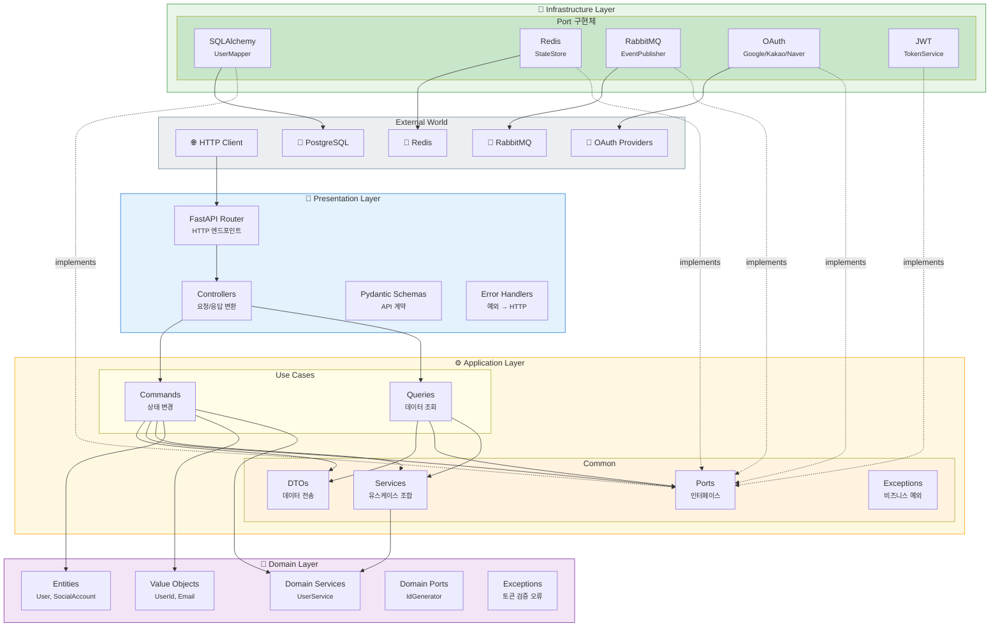

**의존성 규칙(Dependency Rule)**: 모든 의존성은 **바깥에서 안쪽**으로만 향한다.

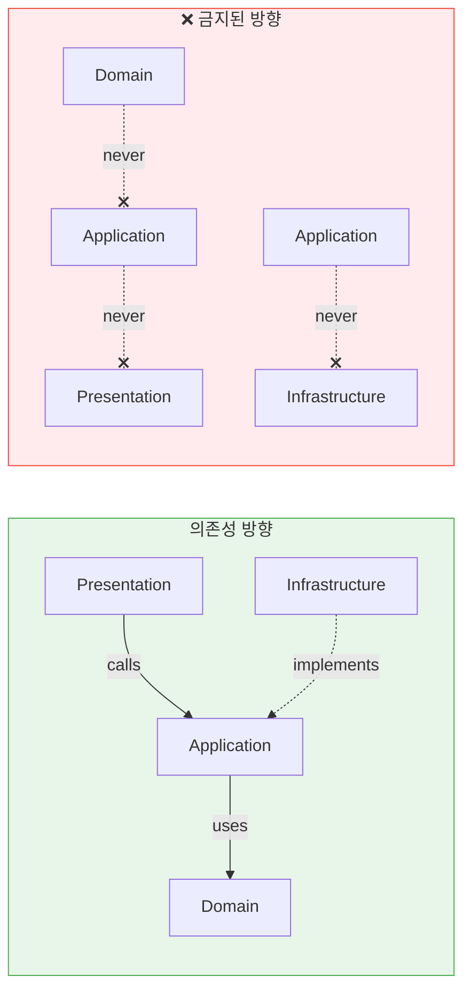

**핵심 원칙 설명**:
- **Domain 독립성**: 비즈니스 로직이 프레임워크나 DB에 종속되지 않음
- **의존성 역전(DIP)**: Application이 Port(Interface)를 정의하고, Infrastructure가 구현
- **테스트 용이성**: 각 레이어를 Mock으로 대체하여 격리 테스트 가능
- **유연한 교체**: Redis → Memcached, PostgreSQL → MongoDB 전환 시 Infrastructure만 변경

### 현재 디렉토리 구조

```
apps/auth/
├── main.py                           # FastAPI 앱 진입점
├── setup/
│   ├── config/settings.py            # 환경 설정
│   ├── dependencies.py               # DI 컨테이너 (의존성 조립)
│   └── logging.py
├── presentation/
│   └── http/
│       ├── controllers/              # HTTP 엔드포인트
│       ├── schemas/                  # Pydantic Request/Response
│       └── errors/                   # 예외 → HTTP 변환
├── application/
│   ├── commands/                     # Use Cases (상태 변경)
│   │   ├── oauth_authorize.py
│   │   ├── oauth_callback.py
│   │   ├── logout.py
│   │   └── refresh_tokens.py
│   ├── queries/                      # Use Cases (조회)
│   │   └── validate_token.py
│   └── common/
│       ├── dto/                      # Application DTOs
│       │   ├── auth.py               # Request/Response DTOs
│       │   ├── oauth.py              # OAuthState, OAuthProfile
│       │   ├── token.py              # TokenPair
│       │   └── user.py               # ValidatedUser
│       ├── ports/                    # 추상 인터페이스 (Protocol)
│       │   ├── token_service.py
│       │   ├── state_store.py
│       │   ├── blacklist_event_publisher.py
│       │   └── ...
│       ├── services/                 # Application Services
│       │   └── user_registration.py
│       └── exceptions/               # Application 예외
├── domain/
│   ├── entities/                     # 엔티티 (식별자 있음)
│   │   ├── user.py
│   │   └── user_social_account.py
│   ├── value_objects/                # 값 객체 (불변)
│   │   ├── user_id.py
│   │   ├── email.py
│   │   └── token_payload.py
│   ├── services/                     # 도메인 서비스
│   │   └── user_service.py
│   ├── ports/                        # 도메인 포트
│   │   └── user_id_generator.py
│   └── exceptions/                   # 도메인 예외
└── infrastructure/
    ├── adapters/                     # Port 구현체
    │   ├── user_data_mapper_sqla.py
    │   ├── user_reader_sqla.py
    │   └── user_id_generator_uuid.py
    ├── persistence_postgres/         # PostgreSQL 관련
    ├── persistence_redis/            # Redis 관련
    │   ├── state_store_redis.py
    │   └── outbox_redis.py
    ├── messaging/                    # RabbitMQ 관련
    │   ├── blacklist_event_publisher_rabbitmq.py
    │   └── login_audit_event_publisher_rabbitmq.py
    ├── oauth/                        # OAuth 클라이언트
    └── security/                     # JWT 서비스
        └── jwt_token_service.py
```

---

## Domain Layer

Domain Layer는 비즈니스 로직의 핵심이다. 외부 프레임워크나 인프라에 대한 의존성이 없어야 한다.

### Entity

Entity는 식별자(ID)를 가지며, 생명주기 동안 상태가 변할 수 있다.

```python
# apps/auth/domain/entities/user.py
from __future__ import annotations

from dataclasses import dataclass
from datetime import datetime
from typing import TYPE_CHECKING

if TYPE_CHECKING:
    from apps.auth.domain.value_objects.email import Email
    from apps.auth.domain.value_objects.user_id import UserId


@dataclass
class User:
    """사용자 엔티티.
    
    Attributes:
        id_: 사용자 고유 식별자 (UUID)
        email: 이메일 주소 (Value Object)
        nickname: 표시 이름
        profile_image: 프로필 이미지 URL
        is_active: 활성 상태
        created_at: 생성 시각
        updated_at: 수정 시각
    """
    id_: UserId
    email: Email
    nickname: str
    profile_image: str | None
    is_active: bool
    created_at: datetime
    updated_at: datetime

    def deactivate(self) -> None:
        """사용자 비활성화."""
        self.is_active = False
        self.updated_at = datetime.utcnow()

    def update_profile(self, nickname: str, profile_image: str | None) -> None:
        """프로필 정보 업데이트."""
        self.nickname = nickname
        self.profile_image = profile_image
        self.updated_at = datetime.utcnow()
```

### Value Object

Value Object는 식별자가 없고 불변(immutable)이다. 값으로만 동등성을 판단한다.

```python
# apps/auth/domain/value_objects/email.py
from __future__ import annotations

import re
from dataclasses import dataclass

from apps.auth.domain.exceptions.validation import InvalidEmailError


@dataclass(frozen=True, slots=True)
class Email:
    """이메일 주소 Value Object.
    
    생성 시점에 유효성 검증을 수행한다.
    
    Attributes:
        value: 이메일 주소 문자열
        
    Raises:
        InvalidEmailError: 유효하지 않은 이메일 형식
    """
    value: str

    def __post_init__(self) -> None:
        if not self._is_valid(self.value):
            raise InvalidEmailError(self.value)

    @staticmethod
    def _is_valid(email: str) -> bool:
        pattern = r"^[a-zA-Z0-9._%+-]+@[a-zA-Z0-9.-]+\.[a-zA-Z]{2,}$"
        return bool(re.match(pattern, email))

    @property
    def domain(self) -> str:
        """이메일 도메인 반환."""
        return self.value.split("@")[1]
```

**Value Object 특징:**
- `frozen=True`: 불변성 보장 (해시 가능)
- `slots=True`: 메모리 최적화, `__dict__` 생성 안 함
- `__post_init__`: 생성 시점 유효성 검증 (자기 검증 패턴)

```python
# apps/auth/domain/value_objects/user_id.py
from __future__ import annotations

from dataclasses import dataclass
from uuid import UUID


@dataclass(frozen=True, slots=True)
class UserId:
    """사용자 식별자 Value Object."""
    value: UUID

    def __str__(self) -> str:
        return str(self.value)

    @classmethod
    def from_string(cls, value: str) -> UserId:
        """문자열에서 UserId 생성."""
        return cls(value=UUID(value))
```

### Domain Port

Domain Layer에서 필요한 추상화를 정의한다.

```python
# apps/auth/domain/ports/user_id_generator.py
from typing import Protocol

from apps.auth.domain.value_objects.user_id import UserId


class UserIdGenerator(Protocol):
    """사용자 ID 생성기 Port.
    
    도메인에서 새 사용자 ID를 생성할 때 사용한다.
    구현체는 Infrastructure Layer에 위치한다.
    """
    def generate(self) -> UserId:
        """새로운 UserId 생성."""
        ...
```

### Domain Service

여러 Entity를 조합하거나, 단일 Entity에 어울리지 않는 도메인 로직을 담당한다.

```python
# apps/auth/domain/services/user_service.py
from __future__ import annotations

from datetime import datetime
from typing import TYPE_CHECKING

from apps.auth.domain.entities.user import User
from apps.auth.domain.entities.user_social_account import UserSocialAccount
from apps.auth.domain.value_objects.email import Email
from apps.auth.domain.ports.user_id_generator import UserIdGenerator

if TYPE_CHECKING:
    from apps.auth.application.common.dto.auth import OAuthProfile


class UserService:
    """사용자 관련 도메인 서비스.
    
    OAuth 프로필로부터 사용자 엔티티를 생성하는 등의
    도메인 로직을 캡슐화한다.
    """

    def __init__(self, user_id_generator: UserIdGenerator) -> None:
        self._user_id_generator = user_id_generator

    def create_user_from_oauth_profile(self, profile: OAuthProfile) -> User:
        """OAuth 프로필로부터 새 사용자 생성.
        
        Args:
            profile: OAuth Provider에서 받은 프로필 정보
            
        Returns:
            새로 생성된 User 엔티티
        """
        now = datetime.utcnow()
        return User(
            id_=self._user_id_generator.generate(),
            email=Email(profile.email),
            nickname=profile.name or profile.email.split("@")[0],
            profile_image=profile.picture,
            is_active=True,
            created_at=now,
            updated_at=now,
        )

    def create_social_account(
        self,
        user: User,
        provider: str,
        provider_user_id: str,
        access_token: str | None = None,
        refresh_token: str | None = None,
    ) -> UserSocialAccount:
        """소셜 계정 연결 생성."""
        now = datetime.utcnow()
        return UserSocialAccount(
            user_id=user.id_,
            provider=provider,
            provider_user_id=provider_user_id,
            access_token=access_token,
            refresh_token=refresh_token,
            created_at=now,
            updated_at=now,
        )
```

### Domain Exception

도메인 규칙 위반을 나타내는 예외들. **순수 토큰 검증 관련 예외**만 Domain에 위치한다.

```python
# apps/auth/domain/exceptions/auth.py
from apps.auth.domain.exceptions.base import DomainError


class InvalidTokenError(DomainError):
    """유효하지 않은 토큰 (서명 검증 실패, 형식 오류 등)."""
    pass


class TokenExpiredError(DomainError):
    """만료된 토큰."""
    pass


class TokenTypeMismatchError(DomainError):
    """토큰 타입 불일치 (access 토큰 자리에 refresh 토큰 사용 등)."""
    pass
```

> **주의**: `TokenRevokedError`는 Domain이 아닌 **Application Layer에 위치**한다. 블랙리스트 확인은 외부 저장소(Redis)를 조회하는 **비즈니스 흐름** 판단이므로, 순수 도메인 규칙이 아니다.

---

## Application Layer

Use Case를 구현하는 레이어. Command(상태 변경)와 Query(조회)로 나눈다. 외부 시스템과의 통신은 **Port(Protocol)**로 추상화하고, 실제 구현은 Infrastructure Layer에 위임한다.

### 계층별 책임 분리

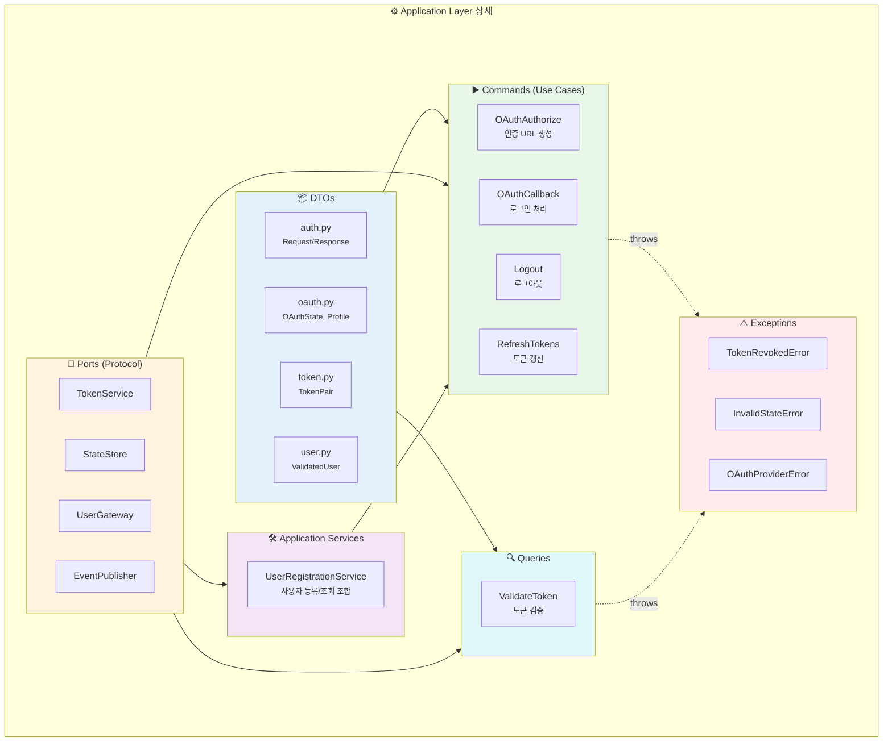

**Application Layer 구성 요소**:

| 구성 요소 | 책임 | 예시 | 위치 |
|----------|------|------|------|
| **DTO** | 계층 간 데이터 전송 | `TokenPair`, `OAuthProfile` | `common/dto/` |
| **Port** | 외부 시스템 계약 (Protocol) | `TokenService`, `StateStore` | `common/ports/` |
| **Application Service** | 여러 Port/Domain 조합 | `UserRegistrationService` | `common/services/` |
| **Command** | 상태 변경 Use Case | `OAuthCallbackInteractor` | `commands/` |
| **Query** | 조회 Use Case | `ValidateTokenQueryService` | `queries/` |
| **Exception** | 비즈니스 흐름 예외 | `TokenRevokedError` | `common/exceptions/` |

### DTO 분리 원칙

**Port 파일에 DTO를 함께 정의하지 않는다.** DTO는 별도 파일로 분리하여 책임을 명확히 한다.

```
application/common/
├── dto/
│   ├── auth.py         # OAuthAuthorizeRequest, LogoutRequest 등
│   ├── oauth.py        # OAuthState, OAuthProfile, OAuthTokens
│   ├── token.py        # TokenPair
│   └── user.py         # ValidatedUser
└── ports/
    ├── token_service.py    # TokenService Protocol (DTO import)
    ├── state_store.py      # StateStore Protocol
    └── ...
```

**분리 이유:**
- **단일 책임**: Port는 계약만, DTO는 데이터 구조만 담당
- **순환 참조 방지**: Port와 DTO가 서로 참조하는 상황 예방
- **재사용성**: 여러 Port/Command에서 동일 DTO 공유 가능

```python
# apps/auth/application/common/dto/oauth.py
from dataclasses import dataclass


@dataclass
class OAuthState:
    """OAuth 상태 데이터 (CSRF 방지용 state와 함께 저장)."""
    provider: str
    redirect_uri: str | None = None
    code_verifier: str | None = None
    device_id: str | None = None
    frontend_origin: str | None = None


@dataclass
class OAuthProfile:
    """OAuth 프로바이더에서 조회한 사용자 프로필."""
    provider: str
    provider_user_id: str
    email: str | None = None
    nickname: str | None = None
    profile_image_url: str | None = None
```

### Application Exception

비즈니스 **흐름** 관련 예외는 Application Layer에 위치한다.

```python
# apps/auth/application/common/exceptions/auth.py
from apps.auth.application.common.exceptions.base import ApplicationError


class TokenRevokedError(ApplicationError):
    """폐기된 토큰 (블랙리스트 등록).
    
    블랙리스트 확인은 외부 저장소(Redis) 조회가 필요하므로
    순수 도메인 규칙이 아닌 Application 계층 책임이다.
    """
    def __init__(self, jti: str | None = None) -> None:
        self.jti = jti
        message = f"Token revoked: {jti}" if jti else "Token has been revoked"
        super().__init__(message)


class InvalidStateError(ApplicationError):
    """OAuth 상태 검증 실패."""
    pass


class OAuthProviderError(ApplicationError):
    """OAuth 프로바이더 통신 오류."""
    def __init__(self, provider: str, reason: str) -> None:
        self.provider = provider
        super().__init__(f"OAuth provider error ({provider}): {reason}")
```

### Application Port

외부 시스템과의 통신을 추상화한다. **Protocol(typing.Protocol)**을 사용하여 구조적 서브타이핑을 지원한다.

```python
# apps/auth/application/common/ports/user_command_gateway.py
from typing import Protocol

from apps.auth.domain.entities.user import User
from apps.auth.domain.value_objects.user_id import UserId


class UserCommandGateway(Protocol):
    """사용자 쓰기 연산 Gateway.
    
    CQRS의 Command 측면을 담당한다.
    """
    async def save(self, user: User) -> None:
        """새 사용자 저장."""
        ...

    async def update(self, user: User) -> None:
        """사용자 정보 수정."""
        ...

    async def find_by_id(self, user_id: UserId) -> User | None:
        """ID로 사용자 조회 (Command에서 검증용)."""
        ...
```

```python
# apps/auth/application/common/ports/user_query_gateway.py
from typing import Protocol

from apps.auth.domain.entities.user import User


class UserQueryGateway(Protocol):
    """사용자 읽기 연산 Gateway.
    
    CQRS의 Query 측면을 담당한다.
    """
    async def find_by_email(self, email: str) -> User | None:
        """이메일로 사용자 조회."""
        ...

    async def find_by_social_account(
        self, provider: str, provider_user_id: str
    ) -> User | None:
        """소셜 계정 정보로 사용자 조회."""
        ...
```

```python
# apps/auth/application/common/ports/token_service.py
from typing import Protocol

from apps.auth.domain.value_objects.user_id import UserId
from apps.auth.domain.value_objects.token_payload import TokenPayload
from apps.auth.application.common.dto.auth import TokenPair


class TokenService(Protocol):
    """토큰 생성/검증 서비스 Port."""
    
    def create_token_pair(
        self, user_id: UserId, device_id: str | None = None
    ) -> TokenPair:
        """Access/Refresh 토큰 쌍 생성."""
        ...

    def decode(self, token: str) -> TokenPayload:
        """토큰 디코드 및 검증."""
        ...

    def get_jti(self, token: str) -> str:
        """토큰에서 JTI(JWT ID) 추출."""
        ...
```

### Command (상태 변경)

#### OAuth 인증 URL 생성

```python
# apps/auth/application/commands/oauth_authorize.py
from __future__ import annotations

import secrets
from dataclasses import dataclass
from typing import TYPE_CHECKING

if TYPE_CHECKING:
    from apps.auth.application.common.ports.state_store import StateStore
    from apps.auth.application.common.services.oauth_client import OAuthClient


@dataclass(frozen=True, slots=True)
class OAuthAuthorizeRequest:
    """OAuth 인증 요청 DTO."""
    provider: str
    redirect_uri: str
    state: str | None = None
    device_id: str | None = None
    frontend_origin: str | None = None


@dataclass(frozen=True, slots=True)
class OAuthAuthorizeResponse:
    """OAuth 인증 응답 DTO."""
    authorization_url: str
    state: str


class OAuthAuthorizeInteractor:
    """OAuth 인증 URL 생성 Use Case.
    
    1. state 생성 (CSRF 방지)
    2. code_verifier 생성 (PKCE)
    3. OAuth Provider의 인증 URL 생성
    4. state 정보를 Redis에 저장
    """

    def __init__(
        self,
        oauth_client: OAuthClient,
        state_store: StateStore,
    ) -> None:
        self._oauth_client = oauth_client
        self._state_store = state_store

    async def execute(self, request: OAuthAuthorizeRequest) -> OAuthAuthorizeResponse:
        # 1. state 생성 (클라이언트 제공 또는 자동 생성)
        state = request.state or secrets.token_urlsafe(32)
        
        # 2. PKCE code_verifier 생성
        code_verifier = secrets.token_urlsafe(64)

        # 3. OAuth Provider 인증 URL 생성
        authorization_url = self._oauth_client.get_authorization_url(
            provider=request.provider,
            redirect_uri=request.redirect_uri,
            state=state,
            code_verifier=code_verifier,
        )

        # 4. state 정보 저장 (TTL 10분)
        from apps.auth.application.common.dto.auth import OAuthState
        oauth_state = OAuthState(
            provider=request.provider,
            redirect_uri=request.redirect_uri,
            code_verifier=code_verifier,
            device_id=request.device_id,
            frontend_origin=request.frontend_origin,
        )
        await self._state_store.save(state, oauth_state, ttl_seconds=600)

        return OAuthAuthorizeResponse(
            authorization_url=authorization_url,
            state=state,
        )
```

#### 로그아웃 (이벤트 기반)

**변경 사항**: Redis 직접 접근 대신 **이벤트 발행**으로 전환. `auth_worker`가 이벤트를 소비하여 Redis에 저장한다.

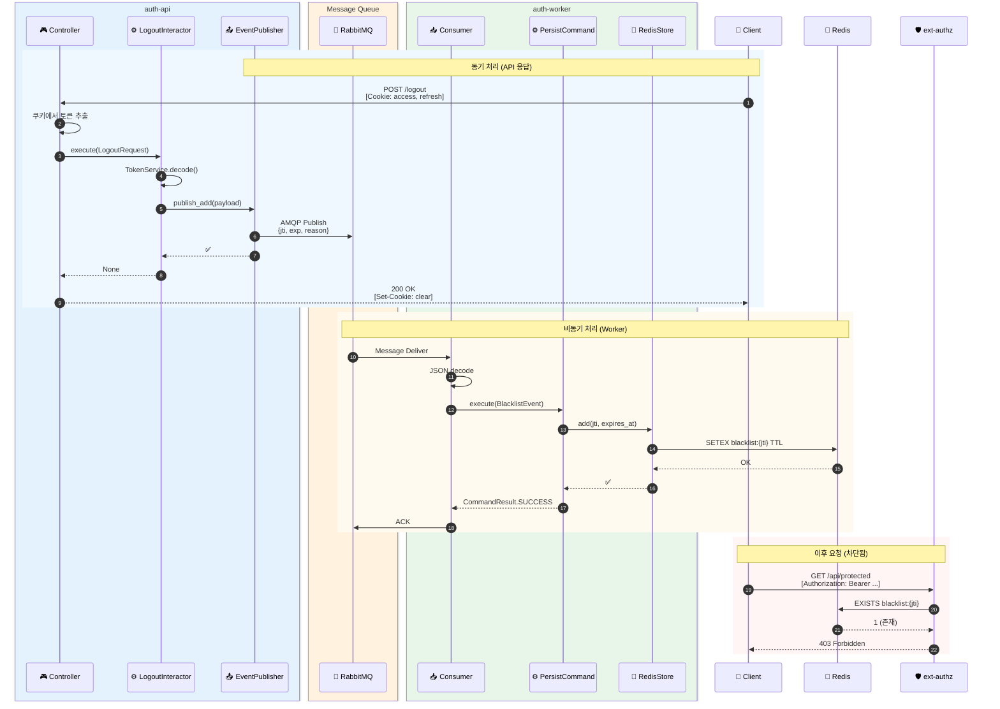

**로그아웃 이벤트 흐름 상세**:

1. **동기 구간** (API 응답까지): 클라이언트 → Controller → Interactor → EventPublisher → RabbitMQ
2. **비동기 구간** (Worker 처리): RabbitMQ → Consumer → Command → Redis
3. **검증 구간** (이후 요청): ext-authz가 Redis 블랙리스트 조회 → 차단

**설계 이점**:
- **응답 시간 단축**: Redis 저장을 기다리지 않고 즉시 응답
- **느슨한 결합**: `auth-api`가 Redis에 직접 의존하지 않음
- **확장성**: Worker 스케일아웃으로 처리량 증가 가능
- **신뢰성**: MQ의 메시지 보장으로 이벤트 유실 방지

```python
# apps/auth/application/commands/logout.py
from __future__ import annotations

import logging
from typing import TYPE_CHECKING

from apps.auth.domain.enums.token_type import TokenType
from apps.auth.application.common.dto.auth import LogoutRequest
    from apps.auth.application.common.ports.token_service import TokenService
from apps.auth.application.common.ports.blacklist_event_publisher import (
    BlacklistEventPublisher,
)

if TYPE_CHECKING:
    pass

logger = logging.getLogger(__name__)


class LogoutInteractor:
    """로그아웃 Use Case (이벤트 기반).
    
    Redis 직접 저장 대신 이벤트를 발행한다.
    auth_worker가 이벤트를 소비하여 Redis에 저장한다.
    """

    def __init__(
        self,
        token_service: TokenService,
        blacklist_publisher: BlacklistEventPublisher,
    ) -> None:
        self._token_service = token_service
        self._blacklist_publisher = blacklist_publisher

    async def execute(self, request: LogoutRequest) -> None:
        """로그아웃 처리.
        
        토큰이 유효하지 않아도 예외를 발생시키지 않는다.
        클라이언트 쿠키 삭제는 Presentation 레이어에서 처리한다.
        """
        # 1. Access 토큰 처리
        if request.access_token:
            try:
        payload = self._token_service.decode(request.access_token)
                self._token_service.ensure_type(payload, TokenType.ACCESS)
                await self._blacklist_publisher.publish_add(payload, reason="logout")
            except Exception:
                pass  # 유효하지 않은 토큰 무시

        # 2. Refresh 토큰 처리
        if request.refresh_token:
            try:
                payload = self._token_service.decode(request.refresh_token)
                self._token_service.ensure_type(payload, TokenType.REFRESH)
                await self._blacklist_publisher.publish_add(payload, reason="logout")
            except Exception:
                pass

        logger.info("User logged out")
```

**핵심 변경점:**
- `TokenBlacklist.add()` 직접 호출 → `BlacklistEventPublisher.publish_add()` 이벤트 발행
- 의존성 2개로 축소 (`TokenService`, `BlacklistEventPublisher`)
- 반환 타입 `None`으로 단순화 (성공/실패 구분 불필요)

### Query (조회)

토큰 검증은 `ext-authz`에서 수행하므로, `auth-api` 내부에서 블랙리스트 확인은 **제거**되었다.

```python
# apps/auth/application/queries/validate_token.py
from __future__ import annotations

from apps.auth.application.common.dto.auth import ValidateTokenRequest
from apps.auth.application.common.dto.user import ValidatedUser
    from apps.auth.application.common.ports.token_service import TokenService
from apps.auth.application.common.ports.user_query_gateway import UserQueryGateway


class ValidateTokenQueryService:
    """토큰 검증 Query.
    
    Note:
        블랙리스트 확인은 ext-authz가 담당한다.
        이 서비스는 토큰 디코드 및 사용자 정보 조회만 수행한다.
    """

    def __init__(
        self,
        token_service: TokenService,
        user_query_gateway: UserQueryGateway,
    ) -> None:
        self._token_service = token_service
        self._user_query_gateway = user_query_gateway

    async def execute(self, request: ValidateTokenRequest) -> ValidatedUser:
        # 1. 토큰 디코드 (형식, 서명, 만료 검증)
        payload = self._token_service.decode(request.token)

        # 2. 사용자 정보 조회
        user = await self._user_query_gateway.get_by_id(payload.sub)
        if not user:
            raise ValueError(f"User not found: {payload.sub}")

        return ValidatedUser(
            user_id=user.id_.value,
            username=user.username,
            nickname=user.nickname,
            email=None,
            profile_image_url=user.profile_image_url,
            provider=payload.provider,
        )
```

> **아키텍처 결정**: Access Token 블랙리스트 확인은 `ext-authz`가 Istio sidecar에서 수행한다. `auth-api`에서 중복으로 확인하지 않아 **단일 책임 원칙**을 준수한다.

### Application Service

**UserRegistrationService**: `OAuthCallbackInteractor`에서 사용자 등록/조회 책임을 분리한 Application Service.

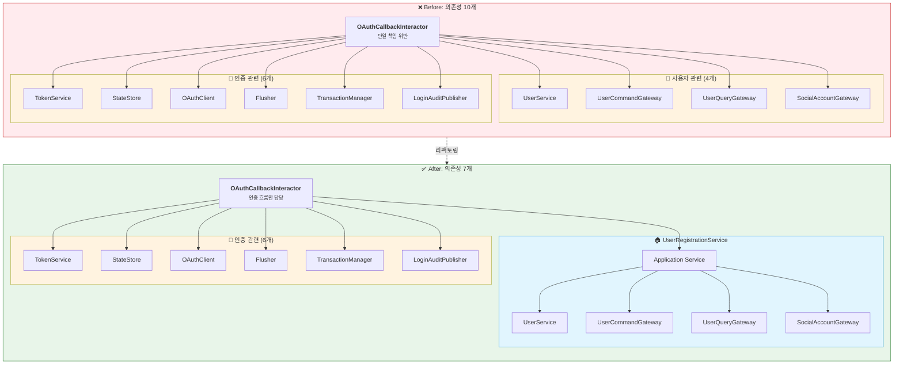

**리팩토링 효과 비교**:

| 항목 | Before | After | 개선 |
|------|--------|-------|------|
| **의존성 수** | 10개 | 7개 | -30% |
| **테스트 복잡도** | 10개 Mock 필요 | 7개 Mock 필요 | 간소화 |
| **단일 책임** | 인증 + 사용자 관리 | 인증만 | SRP 준수 |
| **재사용성** | 불가 | `UserRegistrationService` 재사용 가능 | 향상 |

**캡슐화된 책임**:

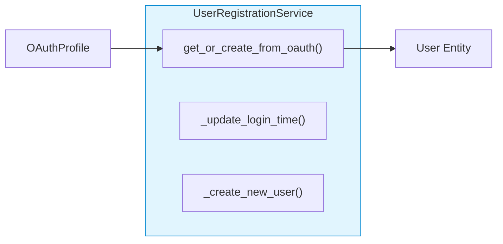

`UserRegistrationService`는 OAuth 프로필로 사용자를 조회하거나 생성하는 **단일 책임**을 가진다. 이 서비스는 `OAuthCallbackInteractor` 외에도 다른 Use Case에서 재사용할 수 있다.

```python
# apps/auth/application/common/services/user_registration.py
class UserRegistrationService:
    """OAuth 사용자 등록/조회 서비스.
    
    OAuthCallbackInteractor에서 사용자 관련 책임을 분리한다.
    """

    def __init__(
        self,
        user_service: UserService,
        user_command_gateway: UserCommandGateway,
        user_query_gateway: UserQueryGateway,
        social_account_gateway: SocialAccountGateway,
    ) -> None:
        self._user_service = user_service
        self._user_command_gateway = user_command_gateway
        self._user_query_gateway = user_query_gateway
        self._social_account_gateway = social_account_gateway

    async def get_or_create_from_oauth(self, profile: OAuthProfile) -> User:
        """OAuth 프로필로 사용자 조회 또는 생성."""
        existing_user = await self._user_query_gateway.get_by_provider(
            profile.provider, profile.provider_user_id
        )

        if existing_user:
            self._update_login_time(existing_user, profile)
            return existing_user

        return self._create_new_user(profile)
```

---

## Infrastructure Layer

외부 시스템과의 실제 통신을 구현한다. Application Layer의 **Port(Interface)**를 구현하는 **Adapter** 패턴을 사용한다.

### Port-Adapter 관계

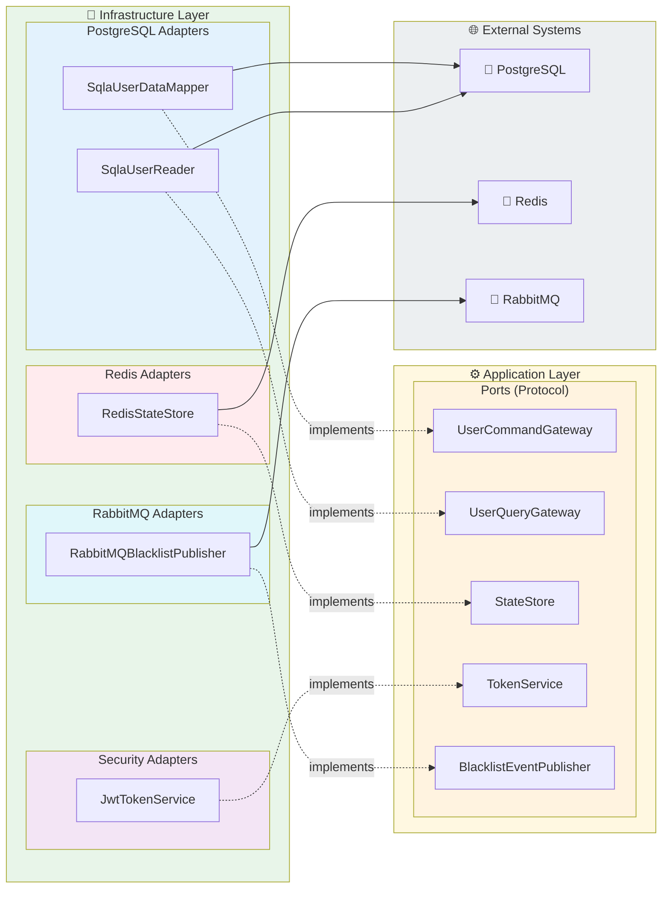

**Port-Adapter 매핑 상세**:

| Port (Application) | Adapter (Infrastructure) | 외부 시스템 |
|-------------------|-------------------------|-------------|
| `UserCommandGateway` | `SqlaUserDataMapper` | PostgreSQL |
| `UserQueryGateway` | `SqlaUserReader` | PostgreSQL |
| `SocialAccountGateway` | `SqlaSocialAccountMapper` | PostgreSQL |
| `StateStore` | `RedisStateStore` | Redis |
| `TokenService` | `JwtTokenService` | - (In-memory) |
| `BlacklistEventPublisher` | `RabbitMQBlacklistPublisher` | RabbitMQ |
| `LoginAuditEventPublisher` | `RabbitMQLoginAuditPublisher` | RabbitMQ |

### SQLAlchemy Adapter

```python
# apps/auth/infrastructure/adapters/user_data_mapper_sqla.py
from __future__ import annotations

from typing import TYPE_CHECKING

from sqlalchemy import select

from apps.auth.application.common.ports.user_command_gateway import UserCommandGateway
from apps.auth.domain.entities.user import User
from apps.auth.domain.value_objects.user_id import UserId

if TYPE_CHECKING:
    from sqlalchemy.ext.asyncio import AsyncSession


class SqlaUserDataMapper(UserCommandGateway):
    """SQLAlchemy 기반 사용자 Command Gateway 구현."""

    def __init__(self, session: AsyncSession) -> None:
        self._session = session

    async def save(self, user: User) -> None:
        """새 사용자 저장."""
        self._session.add(user)

    async def update(self, user: User) -> None:
        """사용자 정보 수정."""
        await self._session.merge(user)

    async def find_by_id(self, user_id: UserId) -> User | None:
        """ID로 사용자 조회."""
        stmt = select(User).where(User.id_ == user_id.value)
        result = await self._session.execute(stmt)
        return result.scalar_one_or_none()
```

```python
# apps/auth/infrastructure/adapters/user_reader_sqla.py
from __future__ import annotations

from typing import TYPE_CHECKING

from sqlalchemy import select

from apps.auth.application.common.ports.user_query_gateway import UserQueryGateway
from apps.auth.domain.entities.user import User
from apps.auth.domain.entities.user_social_account import UserSocialAccount

if TYPE_CHECKING:
    from sqlalchemy.ext.asyncio import AsyncSession


class SqlaUserReader(UserQueryGateway):
    """SQLAlchemy 기반 사용자 Query Gateway 구현."""

    def __init__(self, session: AsyncSession) -> None:
        self._session = session

    async def find_by_email(self, email: str) -> User | None:
        """이메일로 사용자 조회."""
        stmt = select(User).where(User.email == email)
        result = await self._session.execute(stmt)
        return result.scalar_one_or_none()

    async def find_by_social_account(
        self, provider: str, provider_user_id: str
    ) -> User | None:
        """소셜 계정으로 사용자 조회."""
        stmt = (
            select(User)
            .join(UserSocialAccount, User.id_ == UserSocialAccount.user_id)
            .where(
                UserSocialAccount.provider == provider,
                UserSocialAccount.provider_user_id == provider_user_id,
            )
        )
        result = await self._session.execute(stmt)
        return result.scalar_one_or_none()
```

### Redis Adapter

```python
# apps/auth/infrastructure/persistence_redis/state_store_redis.py
from __future__ import annotations

import json
from typing import TYPE_CHECKING

from apps.auth.application.common.ports.state_store import StateStore
from apps.auth.application.common.dto.auth import OAuthState

if TYPE_CHECKING:
    from redis.asyncio import Redis


class RedisStateStore(StateStore):
    """Redis 기반 OAuth State 저장소."""

    def __init__(self, redis: Redis) -> None:
        self._redis = redis
        self._prefix = "oauth:state:"

    async def save(self, state: str, data: OAuthState, ttl_seconds: int) -> None:
        """State 저장 (TTL 설정)."""
        key = f"{self._prefix}{state}"
        await self._redis.setex(key, ttl_seconds, data.model_dump_json())

    async def get(self, state: str) -> OAuthState | None:
        """State 조회."""
        key = f"{self._prefix}{state}"
        data = await self._redis.get(key)
        if data is None:
            return None
        return OAuthState.model_validate_json(data)

    async def delete(self, state: str) -> None:
        """State 삭제 (사용 후 제거)."""
        key = f"{self._prefix}{state}"
        await self._redis.delete(key)
```

```python
# apps/auth/infrastructure/persistence_redis/token_blacklist_redis.py
from __future__ import annotations

import time
from typing import TYPE_CHECKING

from apps.auth.application.common.ports.token_blacklist import TokenBlacklist

if TYPE_CHECKING:
    from redis.asyncio import Redis


class RedisTokenBlacklist(TokenBlacklist):
    """Redis 기반 토큰 블랙리스트.
    
    토큰의 JTI를 키로, 만료 시각까지 TTL로 저장한다.
    토큰 만료 시 자동으로 Redis에서 삭제된다.
    """

    def __init__(self, redis: Redis) -> None:
        self._redis = redis
        self._prefix = "blacklist:"

    async def add(self, jti: str, exp: int) -> None:
        """블랙리스트에 토큰 추가."""
        key = f"{self._prefix}{jti}"
        ttl = exp - int(time.time())
        if ttl > 0:
            await self._redis.setex(key, ttl, "1")

    async def contains(self, jti: str) -> bool:
        """블랙리스트 포함 여부 확인."""
        key = f"{self._prefix}{jti}"
        return await self._redis.exists(key) > 0
```

### JWT Token Service

```python
# apps/auth/infrastructure/security/jwt_token_service.py
from __future__ import annotations

import time
import uuid
from datetime import datetime, timedelta
from typing import TYPE_CHECKING

from jose import jwt, JWTError

from apps.auth.application.common.ports.token_service import TokenService
from apps.auth.domain.value_objects.token_payload import TokenPayload
from apps.auth.domain.value_objects.user_id import UserId
from apps.auth.domain.exceptions.auth import InvalidTokenError, TokenExpiredError
from apps.auth.application.common.dto.auth import TokenPair

if TYPE_CHECKING:
    from uuid import UUID


class JwtTokenService(TokenService):
    """JWT 기반 토큰 서비스 구현.
    
    Access Token: 짧은 수명 (30분)
    Refresh Token: 긴 수명 (7일)
    """

    def __init__(
        self,
        secret_key: str,
        algorithm: str = "HS256",
        access_token_expire_minutes: int = 30,
        refresh_token_expire_days: int = 7,
        issuer: str = "auth-service",
        audience: str = "api",
    ) -> None:
        self._secret_key = secret_key
        self._algorithm = algorithm
        self._access_token_expire = timedelta(minutes=access_token_expire_minutes)
        self._refresh_token_expire = timedelta(days=refresh_token_expire_days)
        self._issuer = issuer
        self._audience = audience

    def create_token_pair(
        self, user_id: UserId, device_id: str | None = None
    ) -> TokenPair:
        """Access/Refresh 토큰 쌍 생성."""
        now = self._now_timestamp()
        access_jti = str(uuid.uuid4())
        refresh_jti = str(uuid.uuid4())

        # Access Token
        access_exp = now + int(self._access_token_expire.total_seconds())
        access_payload = {
            "sub": str(user_id.value),
            "jti": access_jti,
            "iat": now,
            "exp": access_exp,
            "iss": self._issuer,
            "aud": self._audience,
            "type": "access",
        }
        if device_id:
            access_payload["device_id"] = device_id

        # Refresh Token
        refresh_exp = now + int(self._refresh_token_expire.total_seconds())
        refresh_payload = {
            "sub": str(user_id.value),
            "jti": refresh_jti,
            "iat": now,
            "exp": refresh_exp,
            "iss": self._issuer,
            "aud": self._audience,
            "type": "refresh",
        }
        if device_id:
            refresh_payload["device_id"] = device_id

        access_token = jwt.encode(access_payload, self._secret_key, self._algorithm)
        refresh_token = jwt.encode(refresh_payload, self._secret_key, self._algorithm)

        return TokenPair(
            access_token=access_token,
            refresh_token=refresh_token,
            access_expires_at=datetime.utcfromtimestamp(access_exp),
            refresh_expires_at=datetime.utcfromtimestamp(refresh_exp),
        )

    def decode(self, token: str) -> TokenPayload:
        """토큰 디코드 및 검증."""
        try:
            payload = jwt.decode(
                token,
                self._secret_key,
                algorithms=[self._algorithm],
                audience=self._audience,
                issuer=self._issuer,
            )
            return TokenPayload(
                sub=UUID(payload["sub"]),
                jti=payload["jti"],
                exp=payload["exp"],
                type=payload.get("type", "access"),
            )
        except jwt.ExpiredSignatureError:
            raise TokenExpiredError("Token has expired")
        except JWTError as e:
            raise InvalidTokenError(str(e))

    def get_jti(self, token: str) -> str:
        """토큰에서 JTI 추출."""
        payload = self.decode(token)
        return payload.jti

    def _now_timestamp(self) -> int:
        """현재 UTC Unix timestamp 반환."""
        return int(time.time())
```

---

## OAuth2.0 흐름 비교

### OAuth2.0 Authorization Code Flow + PKCE

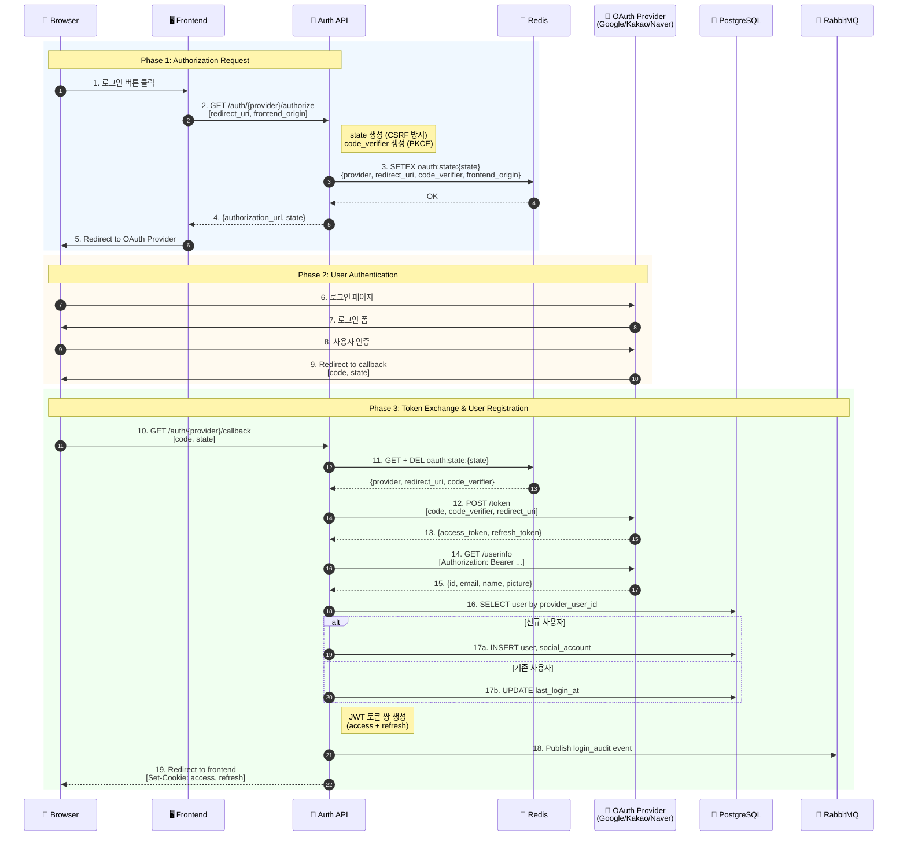

**OAuth2.0 + PKCE 흐름 설명**:

1. **Phase 1 (Authorization Request)**: 프론트엔드가 인증 URL을 요청하면, Auth API는 `state`(CSRF 방지)와 `code_verifier`(PKCE)를 생성하여 Redis에 저장한다.

2. **Phase 2 (User Authentication)**: 브라우저가 OAuth Provider로 리다이렉트되어 사용자가 로그인/동의한다.

3. **Phase 3 (Token Exchange)**: OAuth Provider가 `code`와 함께 콜백하면, Auth API는 Redis에서 state를 검증하고, `code_verifier`로 토큰을 교환한 후, 사용자 정보를 조회/생성하고 JWT를 발급한다.

### Clean Architecture 적용 (Before vs After)

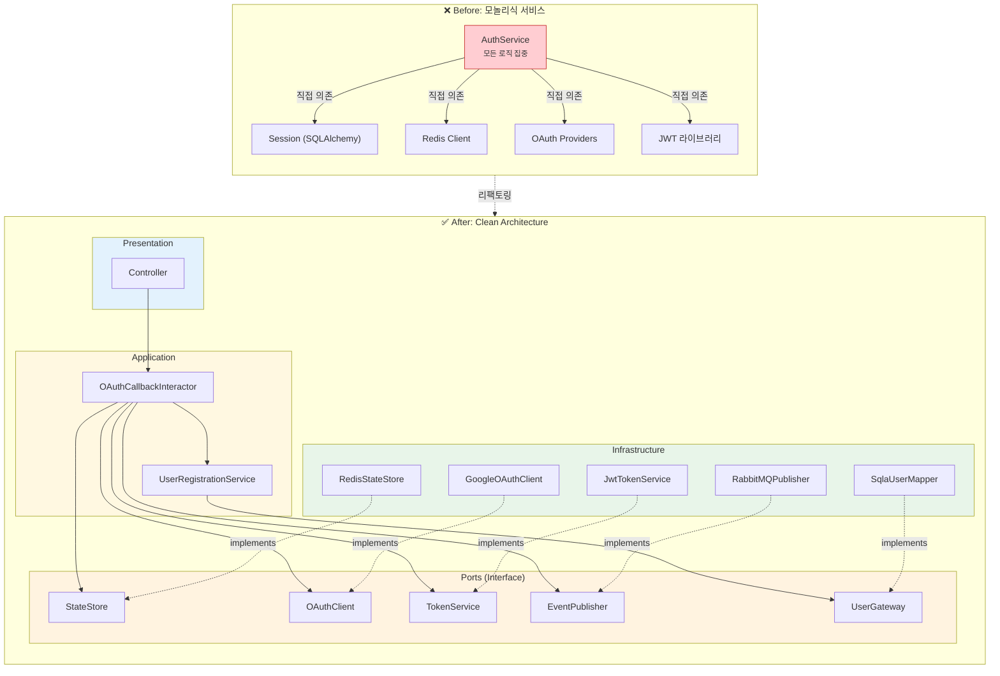

**Before vs After 비교**:

| 항목 | Before | After |
|------|--------|-------|
| **의존성 방향** | 구현체 직접 의존 | Port(Interface) 의존 |
| **테스트** | 실제 DB/Redis 필요 | Mock으로 대체 가능 |
| **결합도** | 강결합 | 느슨한 결합 |
| **교체 용이성** | 코드 전체 수정 필요 | Adapter만 교체 |
| **단일 책임** | 모든 로직 한 곳에 | 역할별 분리 |

### Before (기존)

```python
class AuthService:
    def __init__(
        self,
        session: AsyncSession = Depends(get_db_session),      # 구현체 직접
        token_service: TokenService = Depends(TokenService),   # 구현체 직접
        state_store: OAuthStateStore = Depends(OAuthStateStore),
        ...
    ):
        self.providers = ProviderRegistry(settings)  # 내부 생성
        self.user_repo = UserRepository(session)     # 내부 생성
```

**문제점:**
- `Depends()`로 구현체 직접 주입 → Mock 교체 불가
- 생성자 내부에서 객체 생성 → 의존성 숨김
- 모든 로직이 한 클래스에 집중 → 테스트 복잡

### After (리팩토링)

```python
# apps/auth/application/commands/oauth_callback.py
class OAuthCallbackInteractor:
    """OAuth 콜백 Interactor.
    
    의존성 7개로 축소 (UserRegistrationService로 4개 위임).
    """

    def __init__(
        self,
        user_registration: UserRegistrationService,    # Application Service
        login_audit_publisher: LoginAuditEventPublisher,  # Port
        token_service: TokenService,                    # Port
        state_store: StateStore,                        # Port
        oauth_client: OAuthClientService,               # Port
        flusher: Flusher,                               # Port
        transaction_manager: TransactionManager,        # Port
    ) -> None:
        ...

    async def execute(self, request: OAuthCallbackRequest) -> OAuthCallbackResponse:
        # 1. state 검증
        state_data = await self._state_store.consume(request.state)
        
        # 2. OAuth 프로필 조회
        profile = await self._oauth_client.fetch_profile(...)
        
        # 3. 사용자 조회/생성 (위임)
        user = await self._user_registration.get_or_create_from_oauth(profile)
        
        # 4. JWT 발급
        token_pair = self._token_service.issue_pair(...)
        
        # 5. 커밋
        await self._flusher.flush()
        await self._transaction_manager.commit()
        
        # 6. 로그인 감사 이벤트 발행 (비동기)
        await self._login_audit_publisher.publish(...)
        
        return OAuthCallbackResponse(...)
```

**개선점:**
- 의존성 10개 → 7개 축소 (사용자 관련 4개를 `UserRegistrationService`로 캡슐화)
- 모든 의존성이 Protocol(인터페이스) → Mock 교체 용이
- `UserRegistrationService`를 별도 테스트 가능 → 테스트 단위 세분화
- 로그인 감사 기록도 이벤트 기반으로 전환 → `auth-worker`가 PostgreSQL에 저장

---

## 테스트 전략

### Unit Test with Mock

```python
# apps/auth/tests/unit/application/test_commands.py
import pytest
from unittest.mock import AsyncMock, MagicMock, create_autospec

from apps.auth.application.commands.logout import LogoutInteractor, LogoutRequest
from apps.auth.application.common.ports.token_service import TokenService
from apps.auth.application.common.ports.token_blacklist import TokenBlacklist


@pytest.fixture
def mock_token_service():
    mock = create_autospec(TokenService, instance=True)
    mock.decode.return_value = MagicMock(sub="user-123", exp=9999999999)
    mock.get_jti.return_value = "jti-123"
    return mock


@pytest.fixture
def mock_token_blacklist():
    mock = create_autospec(TokenBlacklist, instance=True)
    mock.add = AsyncMock()
    return mock


@pytest.fixture
def logout_interactor(mock_token_service, mock_token_blacklist, ...):
    return LogoutInteractor(
        token_service=mock_token_service,
        token_blacklist=mock_token_blacklist,
        ...
    )


class TestLogoutInteractor:
    async def test_logout_adds_token_to_blacklist(
        self, logout_interactor, mock_token_blacklist
    ):
        """로그아웃 시 토큰이 블랙리스트에 추가되어야 함."""
        # Arrange
        request = LogoutRequest(access_token="valid_token", refresh_token=None)

        # Act
        result = await logout_interactor.execute(request)

        # Assert
        assert result.success is True
        mock_token_blacklist.add.assert_called_once()

    async def test_logout_handles_refresh_token(
        self, logout_interactor, mock_token_blacklist
    ):
        """Refresh Token이 있으면 함께 블랙리스트에 추가."""
        # Arrange
        request = LogoutRequest(
            access_token="access_token",
            refresh_token="refresh_token"
        )

        # Act
        await logout_interactor.execute(request)

        # Assert
        assert mock_token_blacklist.add.call_count == 2
```

**DIP 덕분에:**
- 실제 DB/Redis 없이 테스트 가능
- `create_autospec()`으로 인터페이스 기반 Mock 생성
- AAA 패턴 (Arrange-Act-Assert) 적용
- 빠른 피드백 루프 (밀리초 단위)

### 복잡도 분석

```bash
$ radon cc apps/auth/application/commands/ -a -s

apps/auth/application/commands/oauth_authorize.py
    OAuthAuthorizeInteractor.execute - A (3)

apps/auth/application/commands/logout.py
    LogoutInteractor.execute - A (4)

apps/auth/application/commands/refresh_tokens.py
    RefreshTokensInteractor.execute - B (6)

apps/auth/application/commands/oauth_callback.py
    OAuthCallbackInteractor.execute - C (12)  # 리팩토링 대상

Average complexity: B (6.25)
```

`oauth_callback.py`는 복잡도 C로 리팩토링이 필요하다. 메서드 분리를 통해 개선 가능.

---

## X-Frontend-Origin 헤더 처리

멀티 프론트엔드 환경(웹, 모바일 웹, 어드민 등) 지원을 위한 기능.

### 문제 상황

OAuth 콜백 후 프론트엔드로 리다이렉트할 때, 어느 프론트엔드로 보내야 하는지 알 수 없음.

### 해결 방안

```python
# apps/auth/presentation/http/controllers/auth/authorize.py
@router.get("/{provider}/authorize")
async def authorize(
    provider: str,
    redirect_uri: str,
    frontend_origin: str | None = Query(None),
    x_frontend_origin: str | None = Header(None, alias="x-frontend-origin"),
    interactor: OAuthAuthorizeInteractor = Depends(get_oauth_authorize_interactor),
) -> AuthorizeResponse:
    """OAuth 인증 URL 생성.
    
    프론트엔드 오리진은 쿼리 파라미터 또는 헤더로 전달할 수 있다.
    """
    resolved_origin = frontend_origin or x_frontend_origin

    request = OAuthAuthorizeRequest(
        provider=provider,
        redirect_uri=redirect_uri,
        frontend_origin=resolved_origin,
    )
    return await interactor.execute(request)
```

```python
# apps/auth/presentation/http/controllers/auth/callback.py
@router.get("/{provider}/callback")
async def callback(
    provider: str,
    code: str,
    state: str,
    x_frontend_origin: str | None = Header(None, alias="x-frontend-origin"),
    interactor: OAuthCallbackInteractor = Depends(get_oauth_callback_interactor),
) -> RedirectResponse:
    """OAuth 콜백 처리.
    
    State에 저장된 frontend_origin을 복원하여 리다이렉트.
    """
    result = await interactor.execute(callback_request)

    # State에서 frontend_origin 복원
    redirect_origin = result.frontend_origin or x_frontend_origin
    redirect_url = build_frontend_redirect_url(request, success_url, redirect_origin)

    return RedirectResponse(url=redirect_url)
```

**흐름:**
1. Authorize 요청 시 `X-Frontend-Origin` 헤더 또는 쿼리 파라미터로 전달
2. Redis State에 `frontend_origin` 저장
3. Callback에서 State 복원
4. 해당 프론트엔드로 리다이렉트

---

## 리팩토링 요약

### 주요 변경 사항 개요

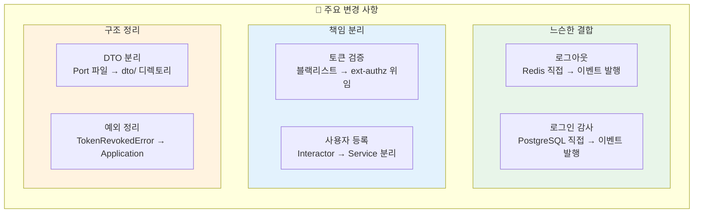

| 항목 | Before | After | 효과 |
|------|--------|-------|------|
| **로그아웃** | Redis 직접 저장 | 이벤트 발행 | 느슨한 결합, API 응답 시간 단축 |
| **토큰 검증** | 블랙리스트 확인 포함 | ext-authz 위임 | 중복 제거, 단일 책임 |
| **DTO 위치** | Port 파일 내 정의 | dto/ 디렉토리 분리 | 책임 분리, 순환 참조 방지 |
| **TokenRevokedError** | Domain Layer | Application Layer | 올바른 계층 배치 |
| **사용자 등록** | Interactor 내 구현 | UserRegistrationService 분리 | 의존성 축소, 테스트 용이 |
| **로그인 감사** | PostgreSQL 직접 저장 | 이벤트 발행 | auth-worker가 비동기 처리 |

### 계층별 예외 배치

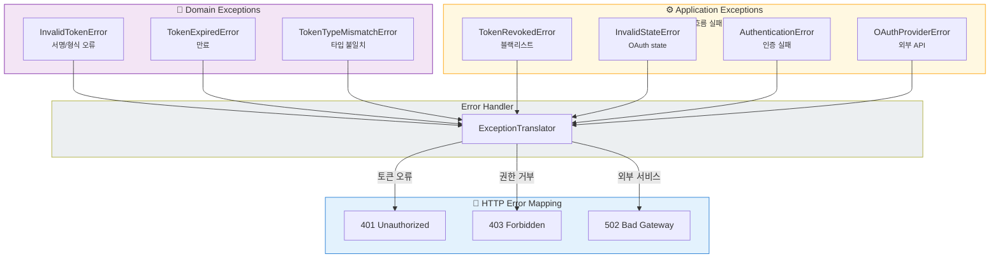

**계층별 예외 분류 기준**:
- **Domain Exception**: 순수 도메인 규칙 위반 (토큰 형식, 서명, 만료) — 외부 의존 없음
- **Application Exception**: 비즈니스 흐름 실패 (블랙리스트, OAuth 상태 검증) — 외부 저장소 조회 필요
- **Presentation**: 예외 → HTTP 상태 코드 변환 — `ExceptionTranslator`가 담당

### Port와 DTO 분리 원칙

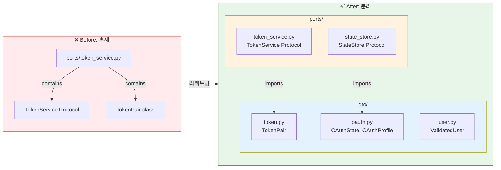

**분리 원칙**:

| 원칙 | 설명 |
|------|------|
| **Port** | 계약(인터페이스)만 정의 — "무엇을 할 수 있는가" |
| **DTO** | 데이터 구조만 정의 — "무엇을 주고받는가" |
| **분리 이유** | 단일 책임, 순환 참조 방지, 재사용성 |

### 전체 아키텍처 요약

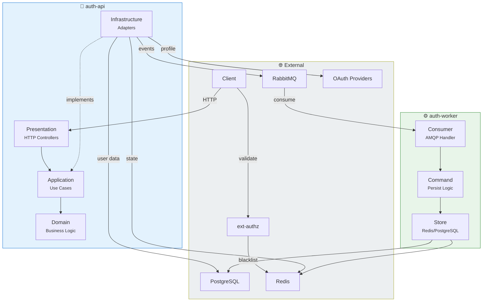

**아키텍처 구성 요약**:

- **auth-api**: HTTP 기반 인증 서비스 — OAuth 인증, 토큰 발급, 로그아웃
- **auth-worker**: AMQP 기반 워커 — 블랙리스트 저장, 로그인 감사 기록
- **ext-authz**: Istio sidecar — Access Token 블랙리스트 검증

이벤트 기반 아키텍처로 `auth-api`와 저장소 간 **느슨한 결합**을 달성했다. 각 컴포넌트는 **단일 책임**을 가지며, **테스트 용이성**이 높다.

---

## 참고 자료

- [fastapi-clean-example](https://github.com/ivan-borovets/fastapi-clean-example)
- Vaughn Vernon, "Implementing Domain-Driven Design" (2013)
- Martin Fowler, "Patterns of Enterprise Application Architecture" (2002)
- Eric Evans, "Domain-Driven Design" (2003)

    """
    def __init__(self, jti: str | None = None) -> None:
        self.jti = jti
        message = f"Token revoked: {jti}" if jti else "Token has been revoked"
        super().__init__(message)


class InvalidStateError(ApplicationError):
    """OAuth 상태 검증 실패."""
    pass


class OAuthProviderError(ApplicationError):
    """OAuth 프로바이더 통신 오류."""
    def __init__(self, provider: str, reason: str) -> None:
        self.provider = provider
        super().__init__(f"OAuth provider error ({provider}): {reason}")
```

### Application Port

외부 시스템과의 통신을 추상화한다. **Protocol(typing.Protocol)**을 사용하여 구조적 서브타이핑을 지원한다.

```python
# apps/auth/application/common/ports/user_command_gateway.py
from typing import Protocol

from apps.auth.domain.entities.user import User
from apps.auth.domain.value_objects.user_id import UserId


class UserCommandGateway(Protocol):
    """사용자 쓰기 연산 Gateway.
    
    CQRS의 Command 측면을 담당한다.
    """
    async def save(self, user: User) -> None:
        """새 사용자 저장."""
        ...

    async def update(self, user: User) -> None:
        """사용자 정보 수정."""
        ...

    async def find_by_id(self, user_id: UserId) -> User | None:
        """ID로 사용자 조회 (Command에서 검증용)."""
        ...
```

```python
# apps/auth/application/common/ports/user_query_gateway.py
from typing import Protocol

from apps.auth.domain.entities.user import User


class UserQueryGateway(Protocol):
    """사용자 읽기 연산 Gateway.
    
    CQRS의 Query 측면을 담당한다.
    """
    async def find_by_email(self, email: str) -> User | None:
        """이메일로 사용자 조회."""
        ...

    async def find_by_social_account(
        self, provider: str, provider_user_id: str
    ) -> User | None:
        """소셜 계정 정보로 사용자 조회."""
        ...
```

```python
# apps/auth/application/common/ports/token_service.py
from typing import Protocol

from apps.auth.domain.value_objects.user_id import UserId
from apps.auth.domain.value_objects.token_payload import TokenPayload
from apps.auth.application.common.dto.auth import TokenPair


class TokenService(Protocol):
    """토큰 생성/검증 서비스 Port."""
    
    def create_token_pair(
        self, user_id: UserId, device_id: str | None = None
    ) -> TokenPair:
        """Access/Refresh 토큰 쌍 생성."""
        ...

    def decode(self, token: str) -> TokenPayload:
        """토큰 디코드 및 검증."""
        ...

    def get_jti(self, token: str) -> str:
        """토큰에서 JTI(JWT ID) 추출."""
        ...
```

### Command (상태 변경)

#### OAuth 인증 URL 생성

```python
# apps/auth/application/commands/oauth_authorize.py
from __future__ import annotations

import secrets
from dataclasses import dataclass
from typing import TYPE_CHECKING

if TYPE_CHECKING:
    from apps.auth.application.common.ports.state_store import StateStore
    from apps.auth.application.common.services.oauth_client import OAuthClient


@dataclass(frozen=True, slots=True)
class OAuthAuthorizeRequest:
    """OAuth 인증 요청 DTO."""
    provider: str
    redirect_uri: str
    state: str | None = None
    device_id: str | None = None
    frontend_origin: str | None = None


@dataclass(frozen=True, slots=True)
class OAuthAuthorizeResponse:
    """OAuth 인증 응답 DTO."""
    authorization_url: str
    state: str


class OAuthAuthorizeInteractor:
    """OAuth 인증 URL 생성 Use Case.
    
    1. state 생성 (CSRF 방지)
    2. code_verifier 생성 (PKCE)
    3. OAuth Provider의 인증 URL 생성
    4. state 정보를 Redis에 저장
    """

    def __init__(
        self,
        oauth_client: OAuthClient,
        state_store: StateStore,
    ) -> None:
        self._oauth_client = oauth_client
        self._state_store = state_store

    async def execute(self, request: OAuthAuthorizeRequest) -> OAuthAuthorizeResponse:
        # 1. state 생성 (클라이언트 제공 또는 자동 생성)
        state = request.state or secrets.token_urlsafe(32)
        
        # 2. PKCE code_verifier 생성
        code_verifier = secrets.token_urlsafe(64)

        # 3. OAuth Provider 인증 URL 생성
        authorization_url = self._oauth_client.get_authorization_url(
            provider=request.provider,
            redirect_uri=request.redirect_uri,
            state=state,
            code_verifier=code_verifier,
        )

        # 4. state 정보 저장 (TTL 10분)
        from apps.auth.application.common.dto.auth import OAuthState
        oauth_state = OAuthState(
            provider=request.provider,
            redirect_uri=request.redirect_uri,
            code_verifier=code_verifier,
            device_id=request.device_id,
            frontend_origin=request.frontend_origin,
        )
        await self._state_store.save(state, oauth_state, ttl_seconds=600)

        return OAuthAuthorizeResponse(
            authorization_url=authorization_url,
            state=state,
        )
```

#### 로그아웃 (이벤트 기반)

**변경 사항**: Redis 직접 접근 대신 **이벤트 발행**으로 전환. `auth_worker`가 이벤트를 소비하여 Redis에 저장한다.


**로그아웃 이벤트 흐름 상세**:

1. **동기 구간** (API 응답까지): 클라이언트 → Controller → Interactor → EventPublisher → RabbitMQ
2. **비동기 구간** (Worker 처리): RabbitMQ → Consumer → Command → Redis
3. **검증 구간** (이후 요청): ext-authz가 Redis 블랙리스트 조회 → 차단

**설계 이점**:
- **응답 시간 단축**: Redis 저장을 기다리지 않고 즉시 응답
- **느슨한 결합**: `auth-api`가 Redis에 직접 의존하지 않음
- **확장성**: Worker 스케일아웃으로 처리량 증가 가능
- **신뢰성**: MQ의 메시지 보장으로 이벤트 유실 방지

```python
# apps/auth/application/commands/logout.py
from __future__ import annotations

import logging
from typing import TYPE_CHECKING

from apps.auth.domain.enums.token_type import TokenType
from apps.auth.application.common.dto.auth import LogoutRequest
    from apps.auth.application.common.ports.token_service import TokenService
from apps.auth.application.common.ports.blacklist_event_publisher import (
    BlacklistEventPublisher,
)

if TYPE_CHECKING:
    pass

logger = logging.getLogger(__name__)


class LogoutInteractor:
    """로그아웃 Use Case (이벤트 기반).
    
    Redis 직접 저장 대신 이벤트를 발행한다.
    auth_worker가 이벤트를 소비하여 Redis에 저장한다.
    """

    def __init__(
        self,
        token_service: TokenService,
        blacklist_publisher: BlacklistEventPublisher,
    ) -> None:
        self._token_service = token_service
        self._blacklist_publisher = blacklist_publisher

    async def execute(self, request: LogoutRequest) -> None:
        """로그아웃 처리.
        
        토큰이 유효하지 않아도 예외를 발생시키지 않는다.
        클라이언트 쿠키 삭제는 Presentation 레이어에서 처리한다.
        """
        # 1. Access 토큰 처리
        if request.access_token:
            try:
        payload = self._token_service.decode(request.access_token)
                self._token_service.ensure_type(payload, TokenType.ACCESS)
                await self._blacklist_publisher.publish_add(payload, reason="logout")
            except Exception:
                pass  # 유효하지 않은 토큰 무시

        # 2. Refresh 토큰 처리
        if request.refresh_token:
            try:
                payload = self._token_service.decode(request.refresh_token)
                self._token_service.ensure_type(payload, TokenType.REFRESH)
                await self._blacklist_publisher.publish_add(payload, reason="logout")
            except Exception:
                pass

        logger.info("User logged out")
```

**핵심 변경점:**
- `TokenBlacklist.add()` 직접 호출 → `BlacklistEventPublisher.publish_add()` 이벤트 발행
- 의존성 2개로 축소 (`TokenService`, `BlacklistEventPublisher`)
- 반환 타입 `None`으로 단순화 (성공/실패 구분 불필요)

### Query (조회)

토큰 검증은 `ext-authz`에서 수행하므로, `auth-api` 내부에서 블랙리스트 확인은 **제거**되었다.

```python
# apps/auth/application/queries/validate_token.py
from __future__ import annotations

from apps.auth.application.common.dto.auth import ValidateTokenRequest
from apps.auth.application.common.dto.user import ValidatedUser
    from apps.auth.application.common.ports.token_service import TokenService
from apps.auth.application.common.ports.user_query_gateway import UserQueryGateway


class ValidateTokenQueryService:
    """토큰 검증 Query.
    
    Note:
        블랙리스트 확인은 ext-authz가 담당한다.
        이 서비스는 토큰 디코드 및 사용자 정보 조회만 수행한다.
    """

    def __init__(
        self,
        token_service: TokenService,
        user_query_gateway: UserQueryGateway,
    ) -> None:
        self._token_service = token_service
        self._user_query_gateway = user_query_gateway

    async def execute(self, request: ValidateTokenRequest) -> ValidatedUser:
        # 1. 토큰 디코드 (형식, 서명, 만료 검증)
        payload = self._token_service.decode(request.token)

        # 2. 사용자 정보 조회
        user = await self._user_query_gateway.get_by_id(payload.sub)
        if not user:
            raise ValueError(f"User not found: {payload.sub}")

        return ValidatedUser(
            user_id=user.id_.value,
            username=user.username,
            nickname=user.nickname,
            email=None,
            profile_image_url=user.profile_image_url,
            provider=payload.provider,
        )
```

> **아키텍처 결정**: Access Token 블랙리스트 확인은 `ext-authz`가 Istio sidecar에서 수행한다. `auth-api`에서 중복으로 확인하지 않아 **단일 책임 원칙**을 준수한다.

### Application Service

**UserRegistrationService**: `OAuthCallbackInteractor`에서 사용자 등록/조회 책임을 분리한 Application Service.


**리팩토링 효과 비교**:

| 항목 | Before | After | 개선 |
|------|--------|-------|------|
| **의존성 수** | 10개 | 7개 | -30% |
| **테스트 복잡도** | 10개 Mock 필요 | 7개 Mock 필요 | 간소화 |
| **단일 책임** | 인증 + 사용자 관리 | 인증만 | SRP 준수 |
| **재사용성** | 불가 | `UserRegistrationService` 재사용 가능 | 향상 |

**캡슐화된 책임**:


`UserRegistrationService`는 OAuth 프로필로 사용자를 조회하거나 생성하는 **단일 책임**을 가진다. 이 서비스는 `OAuthCallbackInteractor` 외에도 다른 Use Case에서 재사용할 수 있다.

```python
# apps/auth/application/common/services/user_registration.py
class UserRegistrationService:
    """OAuth 사용자 등록/조회 서비스.
    
    OAuthCallbackInteractor에서 사용자 관련 책임을 분리한다.
    """

    def __init__(
        self,
        user_service: UserService,
        user_command_gateway: UserCommandGateway,
        user_query_gateway: UserQueryGateway,
        social_account_gateway: SocialAccountGateway,
    ) -> None:
        self._user_service = user_service
        self._user_command_gateway = user_command_gateway
        self._user_query_gateway = user_query_gateway
        self._social_account_gateway = social_account_gateway

    async def get_or_create_from_oauth(self, profile: OAuthProfile) -> User:
        """OAuth 프로필로 사용자 조회 또는 생성."""
        existing_user = await self._user_query_gateway.get_by_provider(
            profile.provider, profile.provider_user_id
        )

        if existing_user:
            self._update_login_time(existing_user, profile)
            return existing_user

        return self._create_new_user(profile)
```

---

## Infrastructure Layer

외부 시스템과의 실제 통신을 구현한다. Application Layer의 **Port(Interface)**를 구현하는 **Adapter** 패턴을 사용한다.

### Port-Adapter 관계


**Port-Adapter 매핑 상세**:

| Port (Application) | Adapter (Infrastructure) | 외부 시스템 |
|-------------------|-------------------------|-------------|
| `UserCommandGateway` | `SqlaUserDataMapper` | PostgreSQL |
| `UserQueryGateway` | `SqlaUserReader` | PostgreSQL |
| `SocialAccountGateway` | `SqlaSocialAccountMapper` | PostgreSQL |
| `StateStore` | `RedisStateStore` | Redis |
| `TokenService` | `JwtTokenService` | - (In-memory) |
| `BlacklistEventPublisher` | `RabbitMQBlacklistPublisher` | RabbitMQ |
| `LoginAuditEventPublisher` | `RabbitMQLoginAuditPublisher` | RabbitMQ |

### SQLAlchemy Adapter

```python
# apps/auth/infrastructure/adapters/user_data_mapper_sqla.py
from __future__ import annotations

from typing import TYPE_CHECKING

from sqlalchemy import select

from apps.auth.application.common.ports.user_command_gateway import UserCommandGateway
from apps.auth.domain.entities.user import User
from apps.auth.domain.value_objects.user_id import UserId

if TYPE_CHECKING:
    from sqlalchemy.ext.asyncio import AsyncSession


class SqlaUserDataMapper(UserCommandGateway):
    """SQLAlchemy 기반 사용자 Command Gateway 구현."""

    def __init__(self, session: AsyncSession) -> None:
        self._session = session

    async def save(self, user: User) -> None:
        """새 사용자 저장."""
        self._session.add(user)

    async def update(self, user: User) -> None:
        """사용자 정보 수정."""
        await self._session.merge(user)

    async def find_by_id(self, user_id: UserId) -> User | None:
        """ID로 사용자 조회."""
        stmt = select(User).where(User.id_ == user_id.value)
        result = await self._session.execute(stmt)
        return result.scalar_one_or_none()
```

```python
# apps/auth/infrastructure/adapters/user_reader_sqla.py
from __future__ import annotations

from typing import TYPE_CHECKING

from sqlalchemy import select

from apps.auth.application.common.ports.user_query_gateway import UserQueryGateway
from apps.auth.domain.entities.user import User
from apps.auth.domain.entities.user_social_account import UserSocialAccount

if TYPE_CHECKING:
    from sqlalchemy.ext.asyncio import AsyncSession


class SqlaUserReader(UserQueryGateway):
    """SQLAlchemy 기반 사용자 Query Gateway 구현."""

    def __init__(self, session: AsyncSession) -> None:
        self._session = session

    async def find_by_email(self, email: str) -> User | None:
        """이메일로 사용자 조회."""
        stmt = select(User).where(User.email == email)
        result = await self._session.execute(stmt)
        return result.scalar_one_or_none()

    async def find_by_social_account(
        self, provider: str, provider_user_id: str
    ) -> User | None:
        """소셜 계정으로 사용자 조회."""
        stmt = (
            select(User)
            .join(UserSocialAccount, User.id_ == UserSocialAccount.user_id)
            .where(
                UserSocialAccount.provider == provider,
                UserSocialAccount.provider_user_id == provider_user_id,
            )
        )
        result = await self._session.execute(stmt)
        return result.scalar_one_or_none()
```

### Redis Adapter

```python
# apps/auth/infrastructure/persistence_redis/state_store_redis.py
from __future__ import annotations

import json
from typing import TYPE_CHECKING

from apps.auth.application.common.ports.state_store import StateStore
from apps.auth.application.common.dto.auth import OAuthState

if TYPE_CHECKING:
    from redis.asyncio import Redis


class RedisStateStore(StateStore):
    """Redis 기반 OAuth State 저장소."""

    def __init__(self, redis: Redis) -> None:
        self._redis = redis
        self._prefix = "oauth:state:"

    async def save(self, state: str, data: OAuthState, ttl_seconds: int) -> None:
        """State 저장 (TTL 설정)."""
        key = f"{self._prefix}{state}"
        await self._redis.setex(key, ttl_seconds, data.model_dump_json())

    async def get(self, state: str) -> OAuthState | None:
        """State 조회."""
        key = f"{self._prefix}{state}"
        data = await self._redis.get(key)
        if data is None:
            return None
        return OAuthState.model_validate_json(data)

    async def delete(self, state: str) -> None:
        """State 삭제 (사용 후 제거)."""
        key = f"{self._prefix}{state}"
        await self._redis.delete(key)
```

```python
# apps/auth/infrastructure/persistence_redis/token_blacklist_redis.py
from __future__ import annotations

import time
from typing import TYPE_CHECKING

from apps.auth.application.common.ports.token_blacklist import TokenBlacklist

if TYPE_CHECKING:
    from redis.asyncio import Redis


class RedisTokenBlacklist(TokenBlacklist):
    """Redis 기반 토큰 블랙리스트.
    
    토큰의 JTI를 키로, 만료 시각까지 TTL로 저장한다.
    토큰 만료 시 자동으로 Redis에서 삭제된다.
    """

    def __init__(self, redis: Redis) -> None:
        self._redis = redis
        self._prefix = "blacklist:"

    async def add(self, jti: str, exp: int) -> None:
        """블랙리스트에 토큰 추가."""
        key = f"{self._prefix}{jti}"
        ttl = exp - int(time.time())
        if ttl > 0:
            await self._redis.setex(key, ttl, "1")

    async def contains(self, jti: str) -> bool:
        """블랙리스트 포함 여부 확인."""
        key = f"{self._prefix}{jti}"
        return await self._redis.exists(key) > 0
```

### JWT Token Service

```python
# apps/auth/infrastructure/security/jwt_token_service.py
from __future__ import annotations

import time
import uuid
from datetime import datetime, timedelta
from typing import TYPE_CHECKING

from jose import jwt, JWTError

from apps.auth.application.common.ports.token_service import TokenService
from apps.auth.domain.value_objects.token_payload import TokenPayload
from apps.auth.domain.value_objects.user_id import UserId
from apps.auth.domain.exceptions.auth import InvalidTokenError, TokenExpiredError
from apps.auth.application.common.dto.auth import TokenPair

if TYPE_CHECKING:
    from uuid import UUID


class JwtTokenService(TokenService):
    """JWT 기반 토큰 서비스 구현.
    
    Access Token: 짧은 수명 (30분)
    Refresh Token: 긴 수명 (7일)
    """

    def __init__(
        self,
        secret_key: str,
        algorithm: str = "HS256",
        access_token_expire_minutes: int = 30,
        refresh_token_expire_days: int = 7,
        issuer: str = "auth-service",
        audience: str = "api",
    ) -> None:
        self._secret_key = secret_key
        self._algorithm = algorithm
        self._access_token_expire = timedelta(minutes=access_token_expire_minutes)
        self._refresh_token_expire = timedelta(days=refresh_token_expire_days)
        self._issuer = issuer
        self._audience = audience

    def create_token_pair(
        self, user_id: UserId, device_id: str | None = None
    ) -> TokenPair:
        """Access/Refresh 토큰 쌍 생성."""
        now = self._now_timestamp()
        access_jti = str(uuid.uuid4())
        refresh_jti = str(uuid.uuid4())

        # Access Token
        access_exp = now + int(self._access_token_expire.total_seconds())
        access_payload = {
            "sub": str(user_id.value),
            "jti": access_jti,
            "iat": now,
            "exp": access_exp,
            "iss": self._issuer,
            "aud": self._audience,
            "type": "access",
        }
        if device_id:
            access_payload["device_id"] = device_id

        # Refresh Token
        refresh_exp = now + int(self._refresh_token_expire.total_seconds())
        refresh_payload = {
            "sub": str(user_id.value),
            "jti": refresh_jti,
            "iat": now,
            "exp": refresh_exp,
            "iss": self._issuer,
            "aud": self._audience,
            "type": "refresh",
        }
        if device_id:
            refresh_payload["device_id"] = device_id

        access_token = jwt.encode(access_payload, self._secret_key, self._algorithm)
        refresh_token = jwt.encode(refresh_payload, self._secret_key, self._algorithm)

        return TokenPair(
            access_token=access_token,
            refresh_token=refresh_token,
            access_expires_at=datetime.utcfromtimestamp(access_exp),
            refresh_expires_at=datetime.utcfromtimestamp(refresh_exp),
        )

    def decode(self, token: str) -> TokenPayload:
        """토큰 디코드 및 검증."""
        try:
            payload = jwt.decode(
                token,
                self._secret_key,
                algorithms=[self._algorithm],
                audience=self._audience,
                issuer=self._issuer,
            )
            return TokenPayload(
                sub=UUID(payload["sub"]),
                jti=payload["jti"],
                exp=payload["exp"],
                type=payload.get("type", "access"),
            )
        except jwt.ExpiredSignatureError:
            raise TokenExpiredError("Token has expired")
        except JWTError as e:
            raise InvalidTokenError(str(e))

    def get_jti(self, token: str) -> str:
        """토큰에서 JTI 추출."""
        payload = self.decode(token)
        return payload.jti

    def _now_timestamp(self) -> int:
        """현재 UTC Unix timestamp 반환."""
        return int(time.time())
```

---

## OAuth2.0 흐름 비교

### OAuth2.0 Authorization Code Flow + PKCE


**OAuth2.0 + PKCE 흐름 설명**:

1. **Phase 1 (Authorization Request)**: 프론트엔드가 인증 URL을 요청하면, Auth API는 `state`(CSRF 방지)와 `code_verifier`(PKCE)를 생성하여 Redis에 저장한다.

2. **Phase 2 (User Authentication)**: 브라우저가 OAuth Provider로 리다이렉트되어 사용자가 로그인/동의한다.

3. **Phase 3 (Token Exchange)**: OAuth Provider가 `code`와 함께 콜백하면, Auth API는 Redis에서 state를 검증하고, `code_verifier`로 토큰을 교환한 후, 사용자 정보를 조회/생성하고 JWT를 발급한다.

### Clean Architecture 적용 (Before vs After)


**Before vs After 비교**:

| 항목 | Before | After |
|------|--------|-------|
| **의존성 방향** | 구현체 직접 의존 | Port(Interface) 의존 |
| **테스트** | 실제 DB/Redis 필요 | Mock으로 대체 가능 |
| **결합도** | 강결합 | 느슨한 결합 |
| **교체 용이성** | 코드 전체 수정 필요 | Adapter만 교체 |
| **단일 책임** | 모든 로직 한 곳에 | 역할별 분리 |

### Before (기존)

```python
class AuthService:
    def __init__(
        self,
        session: AsyncSession = Depends(get_db_session),      # 구현체 직접
        token_service: TokenService = Depends(TokenService),   # 구현체 직접
        state_store: OAuthStateStore = Depends(OAuthStateStore),
        ...
    ):
        self.providers = ProviderRegistry(settings)  # 내부 생성
        self.user_repo = UserRepository(session)     # 내부 생성
```

**문제점:**
- `Depends()`로 구현체 직접 주입 → Mock 교체 불가
- 생성자 내부에서 객체 생성 → 의존성 숨김
- 모든 로직이 한 클래스에 집중 → 테스트 복잡

### After (리팩토링)

```python
# apps/auth/application/commands/oauth_callback.py
class OAuthCallbackInteractor:
    """OAuth 콜백 Interactor.
    
    의존성 7개로 축소 (UserRegistrationService로 4개 위임).
    """

    def __init__(
        self,
        user_registration: UserRegistrationService,    # Application Service
        login_audit_publisher: LoginAuditEventPublisher,  # Port
        token_service: TokenService,                    # Port
        state_store: StateStore,                        # Port
        oauth_client: OAuthClientService,               # Port
        flusher: Flusher,                               # Port
        transaction_manager: TransactionManager,        # Port
    ) -> None:
        ...

    async def execute(self, request: OAuthCallbackRequest) -> OAuthCallbackResponse:
        # 1. state 검증
        state_data = await self._state_store.consume(request.state)
        
        # 2. OAuth 프로필 조회
        profile = await self._oauth_client.fetch_profile(...)
        
        # 3. 사용자 조회/생성 (위임)
        user = await self._user_registration.get_or_create_from_oauth(profile)
        
        # 4. JWT 발급
        token_pair = self._token_service.issue_pair(...)
        
        # 5. 커밋
        await self._flusher.flush()
        await self._transaction_manager.commit()
        
        # 6. 로그인 감사 이벤트 발행 (비동기)
        await self._login_audit_publisher.publish(...)
        
        return OAuthCallbackResponse(...)
```

**개선점:**
- 의존성 10개 → 7개 축소 (사용자 관련 4개를 `UserRegistrationService`로 캡슐화)
- 모든 의존성이 Protocol(인터페이스) → Mock 교체 용이
- `UserRegistrationService`를 별도 테스트 가능 → 테스트 단위 세분화
- 로그인 감사 기록도 이벤트 기반으로 전환 → `auth-worker`가 PostgreSQL에 저장

---

## 테스트 전략

### Unit Test with Mock

```python
# apps/auth/tests/unit/application/test_commands.py
import pytest
from unittest.mock import AsyncMock, MagicMock, create_autospec

from apps.auth.application.commands.logout import LogoutInteractor, LogoutRequest
from apps.auth.application.common.ports.token_service import TokenService
from apps.auth.application.common.ports.token_blacklist import TokenBlacklist


@pytest.fixture
def mock_token_service():
    mock = create_autospec(TokenService, instance=True)
    mock.decode.return_value = MagicMock(sub="user-123", exp=9999999999)
    mock.get_jti.return_value = "jti-123"
    return mock


@pytest.fixture
def mock_token_blacklist():
    mock = create_autospec(TokenBlacklist, instance=True)
    mock.add = AsyncMock()
    return mock


@pytest.fixture
def logout_interactor(mock_token_service, mock_token_blacklist, ...):
    return LogoutInteractor(
        token_service=mock_token_service,
        token_blacklist=mock_token_blacklist,
        ...
    )


class TestLogoutInteractor:
    async def test_logout_adds_token_to_blacklist(
        self, logout_interactor, mock_token_blacklist
    ):
        """로그아웃 시 토큰이 블랙리스트에 추가되어야 함."""
        # Arrange
        request = LogoutRequest(access_token="valid_token", refresh_token=None)

        # Act
        result = await logout_interactor.execute(request)

        # Assert
        assert result.success is True
        mock_token_blacklist.add.assert_called_once()

    async def test_logout_handles_refresh_token(
        self, logout_interactor, mock_token_blacklist
    ):
        """Refresh Token이 있으면 함께 블랙리스트에 추가."""
        # Arrange
        request = LogoutRequest(
            access_token="access_token",
            refresh_token="refresh_token"
        )

        # Act
        await logout_interactor.execute(request)

        # Assert
        assert mock_token_blacklist.add.call_count == 2
```

**DIP 덕분에:**
- 실제 DB/Redis 없이 테스트 가능
- `create_autospec()`으로 인터페이스 기반 Mock 생성
- AAA 패턴 (Arrange-Act-Assert) 적용
- 빠른 피드백 루프 (밀리초 단위)

### 복잡도 분석

```bash
$ radon cc apps/auth/application/commands/ -a -s

apps/auth/application/commands/oauth_authorize.py
    OAuthAuthorizeInteractor.execute - A (3)

apps/auth/application/commands/logout.py
    LogoutInteractor.execute - A (4)

apps/auth/application/commands/refresh_tokens.py
    RefreshTokensInteractor.execute - B (6)

apps/auth/application/commands/oauth_callback.py
    OAuthCallbackInteractor.execute - C (12)  # 리팩토링 대상

Average complexity: B (6.25)
```

`oauth_callback.py`는 복잡도 C로 리팩토링이 필요하다. 메서드 분리를 통해 개선 가능.

---

## X-Frontend-Origin 헤더 처리

멀티 프론트엔드 환경(웹, 모바일 웹, 어드민 등) 지원을 위한 기능.

### 문제 상황

OAuth 콜백 후 프론트엔드로 리다이렉트할 때, 어느 프론트엔드로 보내야 하는지 알 수 없음.

### 해결 방안

```python
# apps/auth/presentation/http/controllers/auth/authorize.py
@router.get("/{provider}/authorize")
async def authorize(
    provider: str,
    redirect_uri: str,
    frontend_origin: str | None = Query(None),
    x_frontend_origin: str | None = Header(None, alias="x-frontend-origin"),
    interactor: OAuthAuthorizeInteractor = Depends(get_oauth_authorize_interactor),
) -> AuthorizeResponse:
    """OAuth 인증 URL 생성.
    
    프론트엔드 오리진은 쿼리 파라미터 또는 헤더로 전달할 수 있다.
    """
    resolved_origin = frontend_origin or x_frontend_origin

    request = OAuthAuthorizeRequest(
        provider=provider,
        redirect_uri=redirect_uri,
        frontend_origin=resolved_origin,
    )
    return await interactor.execute(request)
```

```python
# apps/auth/presentation/http/controllers/auth/callback.py
@router.get("/{provider}/callback")
async def callback(
    provider: str,
    code: str,
    state: str,
    x_frontend_origin: str | None = Header(None, alias="x-frontend-origin"),
    interactor: OAuthCallbackInteractor = Depends(get_oauth_callback_interactor),
) -> RedirectResponse:
    """OAuth 콜백 처리.
    
    State에 저장된 frontend_origin을 복원하여 리다이렉트.
    """
    result = await interactor.execute(callback_request)

    # State에서 frontend_origin 복원
    redirect_origin = result.frontend_origin or x_frontend_origin
    redirect_url = build_frontend_redirect_url(request, success_url, redirect_origin)

    return RedirectResponse(url=redirect_url)
```

**흐름:**
1. Authorize 요청 시 `X-Frontend-Origin` 헤더 또는 쿼리 파라미터로 전달
2. Redis State에 `frontend_origin` 저장
3. Callback에서 State 복원
4. 해당 프론트엔드로 리다이렉트

---

## 리팩토링 요약

### 주요 변경 사항 개요


| 항목 | Before | After | 효과 |
|------|--------|-------|------|
| **로그아웃** | Redis 직접 저장 | 이벤트 발행 | 느슨한 결합, API 응답 시간 단축 |
| **토큰 검증** | 블랙리스트 확인 포함 | ext-authz 위임 | 중복 제거, 단일 책임 |
| **DTO 위치** | Port 파일 내 정의 | dto/ 디렉토리 분리 | 책임 분리, 순환 참조 방지 |
| **TokenRevokedError** | Domain Layer | Application Layer | 올바른 계층 배치 |
| **사용자 등록** | Interactor 내 구현 | UserRegistrationService 분리 | 의존성 축소, 테스트 용이 |
| **로그인 감사** | PostgreSQL 직접 저장 | 이벤트 발행 | auth-worker가 비동기 처리 |

### 계층별 예외 배치

```mermaid
flowchart TB
    subgraph Domain["💎 Domain Exceptions<br/><small>순수 도메인 규칙 위반</small>"]
        direction LR
        DE1["InvalidTokenError<br/><small>서명/형식 오류</small>"]
        DE2["TokenExpiredError<br/><small>만료</small>"]
        DE3["TokenTypeMismatchError<br/><small>타입 불일치</small>"]
    end

    subgraph Application["⚙️ Application Exceptions<br/><small>비즈니스 흐름 실패</small>"]
        direction LR
        AE1["TokenRevokedError<br/><small>블랙리스트</small>"]
        AE2["InvalidStateError<br/><small>OAuth state</small>"]
        AE3["OAuthProviderError<br/><small>외부 API</small>"]
        AE4["AuthenticationError<br/><small>인증 실패</small>"]
    end

    subgraph Presentation["📱 HTTP Error Mapping"]
        direction LR
        PE1["401 Unauthorized"]
        PE2["403 Forbidden"]
        PE3["502 Bad Gateway"]
    end
    
    subgraph Handler["Error Handler"]
        EH["ExceptionTranslator"]
    end

    DE1 & DE2 & DE3 --> EH
    AE1 & AE2 & AE4 --> EH
    AE3 --> EH
    
    EH -->|"토큰 오류"| PE1
    EH -->|"권한 거부"| PE2
    EH -->|"외부 서비스"| PE3

    style Domain fill:#f3e5f5,stroke:#7b1fa2
    style Application fill:#fff8e1,stroke:#ffa000
    style Presentation fill:#e3f2fd,stroke:#1976d2
    style Handler fill:#eceff1
```

**계층별 예외 분류 기준**:
- **Domain Exception**: 순수 도메인 규칙 위반 (토큰 형식, 서명, 만료) — 외부 의존 없음
- **Application Exception**: 비즈니스 흐름 실패 (블랙리스트, OAuth 상태 검증) — 외부 저장소 조회 필요
- **Presentation**: 예외 → HTTP 상태 코드 변환 — `ExceptionTranslator`가 담당

### Port와 DTO 분리 원칙

```mermaid
flowchart LR
    subgraph Before["❌ Before: 혼재"]
        direction TB
        PS1["ports/token_service.py"]
        PS1 --> |"contains"| TS1["TokenService Protocol"]
        PS1 --> |"contains"| TP1["TokenPair class"]
    end
    
    subgraph After["✅ After: 분리"]
        direction TB
        subgraph DTODir["dto/"]
            TP2["token.py<br/>TokenPair"]
            OA2["oauth.py<br/>OAuthState, OAuthProfile"]
            US2["user.py<br/>ValidatedUser"]
        end
        
        subgraph PortDir["ports/"]
            TS2["token_service.py<br/>TokenService Protocol"]
            SS2["state_store.py<br/>StateStore Protocol"]
        end
        
        TS2 -->|"imports"| TP2
        SS2 -->|"imports"| OA2
    end
    
    Before -.->|"리팩토링"| After
    
    style Before fill:#ffebee,stroke:#c62828
    style After fill:#e8f5e9,stroke:#2e7d32
    style DTODir fill:#e3f2fd
    style PortDir fill:#fff3e0
```

**분리 원칙**:

| 원칙 | 설명 |
|------|------|
| **Port** | 계약(인터페이스)만 정의 — "무엇을 할 수 있는가" |
| **DTO** | 데이터 구조만 정의 — "무엇을 주고받는가" |
| **분리 이유** | 단일 책임, 순환 참조 방지, 재사용성 |

### 전체 아키텍처 요약

```mermaid
flowchart TB
    subgraph External["🌐 External"]
        Client["Client"]
        PG["PostgreSQL"]
        Redis["Redis"]
        MQ["RabbitMQ"]
        OAuth["OAuth Providers"]
        ExtAuthz["ext-authz"]
    end
    
    subgraph AuthAPI["🔐 auth-api"]
        direction TB
        Pres["Presentation<br/><small>HTTP Controllers</small>"]
        App["Application<br/><small>Use Cases</small>"]
        Domain["Domain<br/><small>Business Logic</small>"]
        Infra["Infrastructure<br/><small>Adapters</small>"]
        
        Pres --> App --> Domain
        Infra -.->|implements| App
    end
    
    subgraph AuthWorker["⚙️ auth-worker"]
        direction TB
        Consumer["Consumer<br/><small>AMQP Handler</small>"]
        Command["Command<br/><small>Persist Logic</small>"]
        Store["Store<br/><small>Redis/PostgreSQL</small>"]
        
        Consumer --> Command --> Store
    end
    
    Client -->|"HTTP"| Pres
    Client -->|"validate"| ExtAuthz
    ExtAuthz -->|"blacklist"| Redis
    
    Infra -->|"user data"| PG
    Infra -->|"state"| Redis
    Infra -->|"events"| MQ
    Infra -->|"profile"| OAuth
    
    MQ -->|"consume"| Consumer
    Store --> Redis & PG
    
    style AuthAPI fill:#e3f2fd,stroke:#1976d2
    style AuthWorker fill:#e8f5e9,stroke:#388e3c
    style External fill:#eceff1
```

**아키텍처 구성 요약**:

- **auth-api**: HTTP 기반 인증 서비스 — OAuth 인증, 토큰 발급, 로그아웃
- **auth-worker**: AMQP 기반 워커 — 블랙리스트 저장, 로그인 감사 기록
- **ext-authz**: Istio sidecar — Access Token 블랙리스트 검증

이벤트 기반 아키텍처로 `auth-api`와 저장소 간 **느슨한 결합**을 달성했다. 각 컴포넌트는 **단일 책임**을 가지며, **테스트 용이성**이 높다.

---

## 참고 자료

- [fastapi-clean-example](https://github.com/ivan-borovets/fastapi-clean-example)
- Vaughn Vernon, "Implementing Domain-Driven Design" (2013)
- Martin Fowler, "Patterns of Enterprise Application Architecture" (2002)
- Eric Evans, "Domain-Driven Design" (2003)
