# Clean Architecture #5: Users 도메인 마이그레이션 설계

> `domains/my` → `apps/users` Clean Architecture 마이그레이션 및 도메인 통합
>
> **구현 상태**: Phase 1 완료 (Canary 배포 준비)

---

## 개요

이 문서는 기존 `my` 도메인을 `users` 도메인으로 리팩토링하면서, `auth` 도메인에 분산된 User 관련 책임을 통합하는 과정을 다룬다.

### 핵심 변경 사항

| 변경 | Before | After |
|-----|--------|-------|
| **도메인명** | `my` | `users` |
| **라우팅** | `/api/v1/user/me` | `/api/v1/users/me` |
| **User 소유권** | auth + my (분산) | **users (단일)** |
| **auth ↔ users 통신** | 직접 DB 접근 | **gRPC** |

### 마이그레이션 목표

| 목표 | 설명 |
|-----|------|
| **계층 분리** | Presentation, Application, Domain, Infrastructure 분리 |
| **의존성 역전** | Port/Adapter 패턴으로 외부 의존성 추상화 |
| **gRPC 통합** | auth ↔ users 도메인 간 gRPC 통신 |
| **CQRS 적용** | 읽기(Query)와 쓰기(Command) 분리 |
| **데이터 소유권 명확화** | 중복 테이블 통합, 단일 소유 |

---

## 현재 구조 분석

### 데이터 흐름 아키텍처

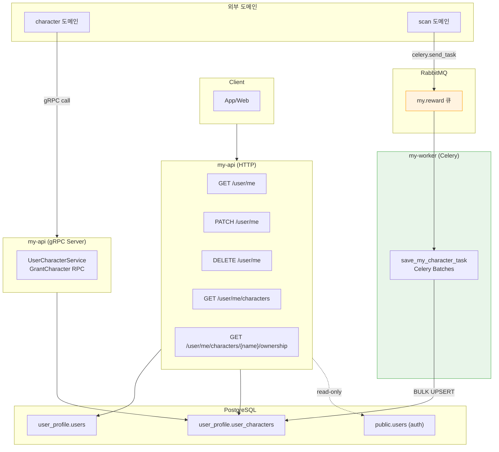

**데이터 흐름 설명**:

- **HTTP API**: 클라이언트에서 프로필 조회/수정/삭제, 캐릭터 목록 조회
- **gRPC Server**: `character` 도메인에서 캐릭터 지급 시 `GrantCharacter` RPC 호출
- **Celery Worker**: `scan` 도메인에서 보상 처리 시 `my.save_character` 태스크 발행 → 배치로 DB 저장
- **Auth 참조**: `auth` 도메인의 `users`, `user_social_accounts` 테이블을 읽기 전용으로 참조

### 핵심 구성요소

| 구성요소 | 역할 | 프로토콜 |
|---------|------|---------|
| **my-api** | 프로필 CRUD + 캐릭터 조회 | HTTP |
| **my-grpc** | 캐릭터 지급 | gRPC |
| **my-worker** | 캐릭터 배치 저장 | Celery |

### 현재 디렉토리 구조

```
domains/my/
├── main.py                      # FastAPI 앱
├── api/v1/endpoints/            # HTTP 엔드포인트
│   ├── profile.py
│   └── characters.py
├── services/                    # 비즈니스 로직
│   ├── my.py                    # 프로필 서비스
│   └── characters.py            # 캐릭터 서비스
├── repositories/                # 데이터 액세스
│   ├── user_repository.py
│   ├── user_character_repository.py
│   └── user_social_account_repository.py
├── models/                      # SQLAlchemy ORM
│   ├── user.py
│   ├── user_character.py
│   ├── auth_user.py             # auth 참조
│   └── auth_user_social_account.py
├── rpc/                         # gRPC
│   ├── server.py                # gRPC 서버
│   ├── character_client.py      # character gRPC 클라이언트
│   └── v1/
│       └── user_character_servicer.py
├── tasks/                       # Celery 태스크
│   └── sync_character.py
├── schemas/                     # Pydantic 스키마
└── proto/                       # Protobuf 정의
```

---

## 스키마 분리의 배경과 문제점

### 원래 설계 의도

초기 설계에서는 **마이크로서비스 지향 아키텍처**를 염두에 두고 스키마를 분리했다.

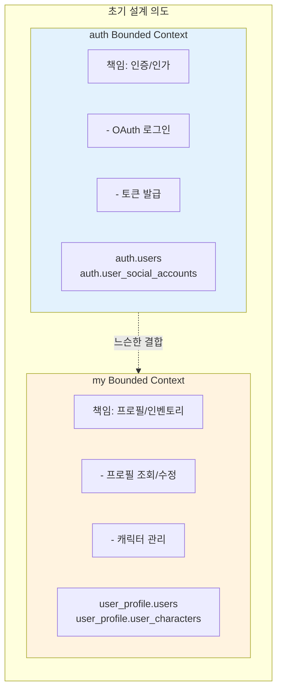

**설계 원칙**:

| 원칙 | 의도 |
|------|------|
| **Bounded Context** | 각 도메인이 자신의 데이터를 완전히 소유 |
| **스키마 분리** | 나중에 DB 분리를 쉽게 하기 위해 |
| **느슨한 결합** | `user_profile.users.auth_user_id`로 논리적 참조만 |

**원래 의도한 데이터 분리**:

- `auth.users`: **최소한의 인증 정보** (id, 소셜 계정 연결용)
- `user_profile.users`: **확장된 프로필 정보** (닉네임, 전화번호, 프로필 이미지)

### 실제로 발생한 문제

#### 문제 1: 데이터 중복

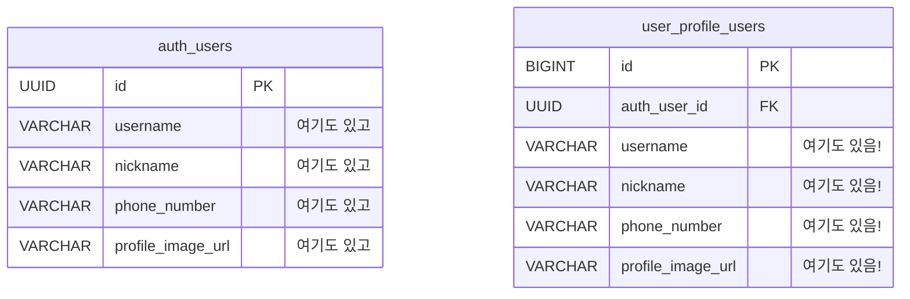

**중복 발생 원인**:

| 시점 | 상황 | 결과 |
|------|------|------|
| OAuth 구현 | OAuth에서 닉네임/이미지 제공 → `auth.users`에 저장 | auth에 프로필 정보 추가 |
| 프로필 기능 | my 도메인도 프로필 필요 → `user_profile.users` 생성 | 같은 정보 중복 저장 |

#### 문제 2: 애플리케이션 레벨 동기화 필요

```python
# my/services/my.py — 프로필 수정 시 양쪽 자동 업데이트
async def _apply_update(self, user: User, payload: UserUpdate) -> User:
    # 1. user_profile.users 업데이트
    updated = await self.repo.update_user(user, update_data)
    
    # 2. auth.users도 자동 업데이트 (애플리케이션에서 처리)
    if "phone_number" in update_data:
        await self.repo.update_auth_user_phone(
            user.auth_user_id, update_data.get("phone_number")
        )
    await self.session.commit()
```

**문제**:
- 사용자 입장에선 자동이지만, **개발자가 명시적으로 구현**해야 함
- 새 필드 추가 시 동기화 로직도 함께 추가해야 함
- 다른 도메인(예: admin)에서 수정 시 동기화 누락 위험
- 트랜잭션 범위가 두 스키마에 걸쳐있음

#### 문제 3: 불분명한 데이터 소유권

| 질문 | 답변 불가 |
|------|----------|
| 닉네임은 누구 책임? | `auth.users.nickname` vs `user_profile.users.nickname` |
| 프로필 수정 시 어디를 업데이트? | 둘 다? |
| 두 값이 다르면 어느 게 진짜? | 알 수 없음 |

### 교훈: 스키마 분리 ≠ 데이터 중복

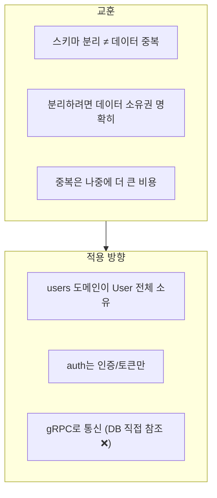

---

## 데이터베이스 스키마 분석

### 현재 스키마 구조 (ER Diagram)

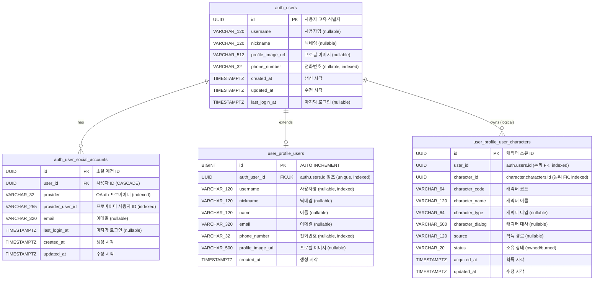

**ER 다이어그램 설명**:

- **auth.users**: 인증 도메인의 핵심 사용자 테이블 — OAuth 로그인 시 생성
- **auth.user_social_accounts**: 소셜 로그인 계정 — 1:N 관계로 다중 소셜 계정 지원
- **user_profile.users**: 프로필 확장 테이블 — `auth_user_id`로 auth.users 참조
- **user_profile.user_characters**: 캐릭터 인벤토리 — FK 없이 `user_id`로 논리적 참조

### 스키마별 테이블 상세

#### auth 스키마 (인증 도메인)

| 테이블 | 설명 | 관리 도메인 |
|--------|------|------------|
| `auth.users` | 사용자 기본 정보 | `apps/auth` |
| `auth.user_social_accounts` | OAuth 소셜 계정 | `apps/auth` |

```sql
-- auth.users
CREATE TABLE auth.users (
    id UUID PRIMARY KEY,
    username VARCHAR(120),
    nickname VARCHAR(120),
    profile_image_url VARCHAR(512),
    phone_number VARCHAR(32),
    created_at TIMESTAMPTZ NOT NULL DEFAULT NOW(),
    updated_at TIMESTAMPTZ NOT NULL DEFAULT NOW(),
    last_login_at TIMESTAMPTZ,
    CONSTRAINT uq_auth_users_name_phone UNIQUE (username, phone_number)
);

-- auth.user_social_accounts
CREATE TABLE auth.user_social_accounts (
    id UUID PRIMARY KEY,
    user_id UUID NOT NULL REFERENCES auth.users(id) ON DELETE CASCADE,
    provider VARCHAR(32) NOT NULL,
    provider_user_id VARCHAR(255) NOT NULL,
    email VARCHAR(320),
    last_login_at TIMESTAMPTZ,
    created_at TIMESTAMPTZ NOT NULL DEFAULT NOW(),
    updated_at TIMESTAMPTZ NOT NULL DEFAULT NOW(),
    CONSTRAINT uq_user_social_accounts_identity UNIQUE (provider, provider_user_id)
);
CREATE INDEX idx_user_social_accounts_user_id ON auth.user_social_accounts(user_id);
CREATE INDEX idx_user_social_accounts_provider ON auth.user_social_accounts(provider);
```

#### user_profile 스키마 (프로필 도메인)

| 테이블 | 설명 | 관리 도메인 |
|--------|------|------------|
| `user_profile.users` | 프로필 확장 정보 | `domains/my` |
| `user_profile.user_characters` | 캐릭터 인벤토리 | `domains/my` |

```sql
-- user_profile.users
CREATE TABLE user_profile.users (
    id BIGSERIAL PRIMARY KEY,
    auth_user_id UUID NOT NULL UNIQUE REFERENCES auth.users(id),
    username VARCHAR(120),
    nickname VARCHAR(120),
    name VARCHAR(120),
    email VARCHAR(320),
    phone_number VARCHAR(32),
    profile_image_url VARCHAR(500),
    created_at TIMESTAMPTZ NOT NULL DEFAULT NOW()
);
CREATE INDEX idx_user_profile_users_auth_user_id ON user_profile.users(auth_user_id);
CREATE INDEX idx_user_profile_users_phone ON user_profile.users(phone_number);

-- user_profile.user_characters
CREATE TABLE user_profile.user_characters (
    id UUID PRIMARY KEY DEFAULT gen_random_uuid(),
    user_id UUID NOT NULL,  -- 논리 FK (auth.users.id)
    character_id UUID NOT NULL,  -- 논리 FK (character.characters.id)
    character_code VARCHAR(64) NOT NULL,
    character_name VARCHAR(120) NOT NULL,
    character_type VARCHAR(64),
    character_dialog VARCHAR(500),
    source VARCHAR(120),
    status VARCHAR(20) NOT NULL DEFAULT 'owned',
    acquired_at TIMESTAMPTZ NOT NULL DEFAULT NOW(),
    updated_at TIMESTAMPTZ NOT NULL DEFAULT NOW(),
    CONSTRAINT uq_user_character_code UNIQUE (user_id, character_code)
);
CREATE INDEX idx_user_characters_user_id ON user_profile.user_characters(user_id);
CREATE INDEX idx_user_characters_character_id ON user_profile.user_characters(character_id);
```

### 문제점: 데이터 중복

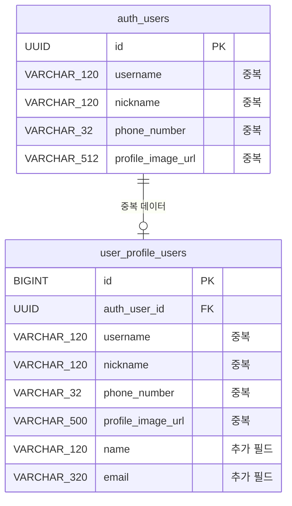

**중복 문제 설명**:

| 필드 | auth.users | user_profile.users | 문제 |
|------|------------|-------------------|------|
| `username` | ✅ | ✅ | **중복** |
| `nickname` | ✅ | ✅ | **중복** |
| `phone_number` | ✅ | ✅ | **중복** |
| `profile_image_url` | ✅ | ✅ | **중복** |
| `name` | ❌ | ✅ | 확장 필드 |
| `email` | ❌ (소셜 계정에 있음) | ✅ | 확장 필드 |

**현재 동기화 로직** (`MyService._apply_update`):

```python
# phone_number 수정 시 양쪽 테이블 자동 동기화 (애플리케이션 레벨)
if "phone_number" in update_data:
    await self.repo.update_auth_user_phone(
        user.auth_user_id, update_data.get("phone_number")
    )
await self.session.commit()
```

→ 애플리케이션 레벨 동기화로 인한 **유지보수 부담** 및 **불일치 위험**

---

## gRPC 기반 도메인 통합 설계

### 목표 아키텍처

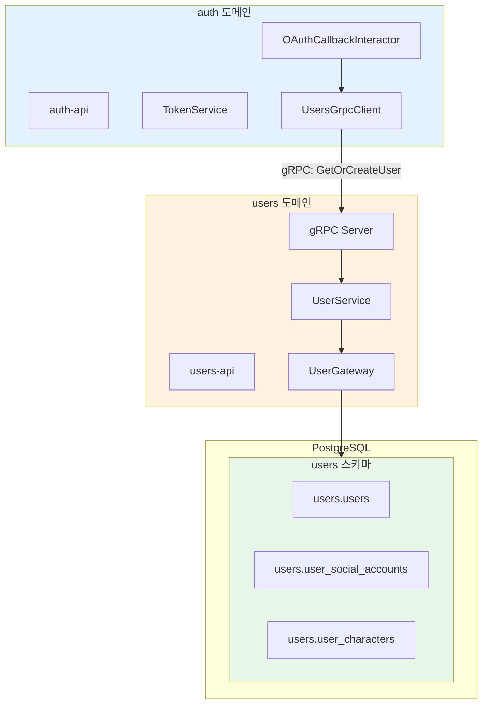

**아키텍처 설명**:

- **auth 도메인**: 인증/토큰만 담당, User 데이터 직접 접근 ❌
- **users 도메인**: User 전체 소유, gRPC 서버 제공
- **통신 방식**: auth → users는 **gRPC 동기 호출** (OAuth 콜백은 동기 필수)

### OAuth 콜백 플로우 (gRPC)

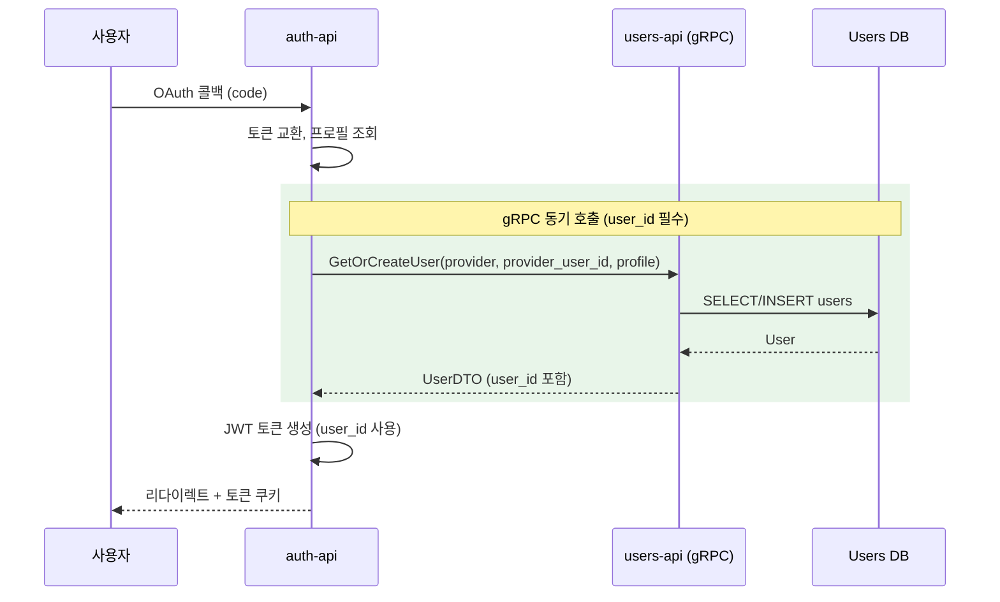

**동기 호출이 필수인 이유**:

| 이유 | 설명 |
|------|------|
| **토큰 발급 필요** | JWT에 `user_id` 클레임 포함 필수 |
| **즉시 응답 필요** | 사용자에게 토큰과 함께 리다이렉트 |
| **롤백 필요** | 사용자 생성 실패 시 로그인 실패 |

### 왜 이벤트가 아닌 gRPC인가?

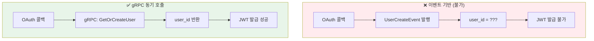

---

## 최종 스키마 설계

### 최종 ER Diagram

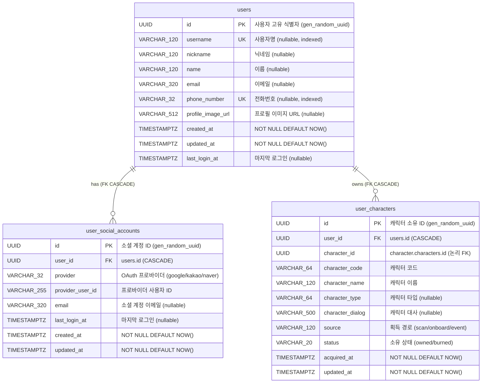

**ERD 설명**:

| 관계 | 유형 | 설명 |
|------|------|------|
| `users ↔ user_social_accounts` | `has` (1:N, FK) | 실제 FK, CASCADE 삭제 |
| `users ↔ user_characters` | `owns` (1:N, FK) | 실제 FK, CASCADE 삭제 |
| `user_characters ↔ characters` | 논리 FK | FK 없음, 도메인 독립성 |

### 최종 DDL

```sql
-- ========================================
-- users 스키마
-- ========================================
CREATE SCHEMA IF NOT EXISTS users;

-- ----------------------------------------
-- users.users
-- ----------------------------------------
CREATE TABLE users.users (
    id UUID PRIMARY KEY DEFAULT gen_random_uuid(),
    username VARCHAR(120),
    nickname VARCHAR(120),
    name VARCHAR(120),
    email VARCHAR(320),
    phone_number VARCHAR(32),
    profile_image_url VARCHAR(512),
    created_at TIMESTAMPTZ NOT NULL DEFAULT NOW(),
    updated_at TIMESTAMPTZ NOT NULL DEFAULT NOW(),
    last_login_at TIMESTAMPTZ,
    
    CONSTRAINT uq_users_phone UNIQUE (phone_number)
);

CREATE INDEX idx_users_username ON users.users(username) WHERE username IS NOT NULL;
CREATE INDEX idx_users_phone ON users.users(phone_number) WHERE phone_number IS NOT NULL;
CREATE INDEX idx_users_email ON users.users(email) WHERE email IS NOT NULL;

-- ----------------------------------------
-- users.user_social_accounts
-- ----------------------------------------
CREATE TABLE users.user_social_accounts (
    id UUID PRIMARY KEY DEFAULT gen_random_uuid(),
    user_id UUID NOT NULL,
    provider VARCHAR(32) NOT NULL,
    provider_user_id VARCHAR(255) NOT NULL,
    email VARCHAR(320),
    last_login_at TIMESTAMPTZ,
    created_at TIMESTAMPTZ NOT NULL DEFAULT NOW(),
    updated_at TIMESTAMPTZ NOT NULL DEFAULT NOW(),
    
    CONSTRAINT fk_social_user 
        FOREIGN KEY (user_id) REFERENCES users.users(id) ON DELETE CASCADE,
    CONSTRAINT uq_social_identity 
        UNIQUE (provider, provider_user_id)
);

CREATE INDEX idx_social_user_id ON users.user_social_accounts(user_id);
CREATE INDEX idx_social_provider ON users.user_social_accounts(provider);
CREATE INDEX idx_social_provider_user ON users.user_social_accounts(provider, provider_user_id);

-- ----------------------------------------
-- users.user_characters
-- ----------------------------------------
CREATE TABLE users.user_characters (
    id UUID PRIMARY KEY DEFAULT gen_random_uuid(),
    user_id UUID NOT NULL,
    character_id UUID NOT NULL,
    character_code VARCHAR(64) NOT NULL,
    character_name VARCHAR(120) NOT NULL,
    character_type VARCHAR(64),
    character_dialog VARCHAR(500),
    source VARCHAR(120),
    status VARCHAR(20) NOT NULL DEFAULT 'owned',
    acquired_at TIMESTAMPTZ NOT NULL DEFAULT NOW(),
    updated_at TIMESTAMPTZ NOT NULL DEFAULT NOW(),
    
    CONSTRAINT fk_character_user 
        FOREIGN KEY (user_id) REFERENCES users.users(id) ON DELETE CASCADE,
    CONSTRAINT uq_user_character 
        UNIQUE (user_id, character_code),
    CONSTRAINT chk_status 
        CHECK (status IN ('owned', 'burned'))
);

CREATE INDEX idx_characters_user_id ON users.user_characters(user_id);
CREATE INDEX idx_characters_character_id ON users.user_characters(character_id);
CREATE INDEX idx_characters_code ON users.user_characters(character_code);
```

### 도메인별 책임 정리

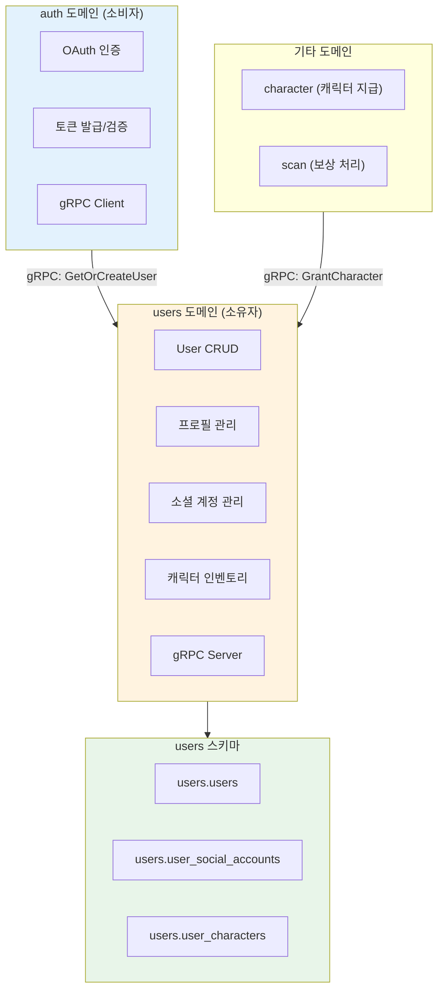

**책임 정리**:

| 도메인 | 역할 | 테이블 접근 |
|--------|------|------------|
| **users** | User 전체 소유, CRUD, 프로필, 캐릭터 | **Read/Write** |
| **auth** | 인증, 토큰 발급 | **gRPC 통해서만** |
| **character** | 캐릭터 지급 요청 | **gRPC 통해서만** |
| **scan** | 보상 처리 후 캐릭터 지급 | **Celery/gRPC** |

### 제약조건 요약

| 테이블 | 제약조건 | 컬럼 | 목적 |
|--------|---------|------|------|
| `users` | `uq_users_phone` | `phone_number` | 전화번호 중복 방지 |
| `user_social_accounts` | `uq_social_identity` | `(provider, provider_user_id)` | 소셜 계정 중복 방지 |
| `user_social_accounts` | `fk_social_user` | `user_id` | CASCADE 삭제 |
| `user_characters` | `uq_user_character` | `(user_id, character_code)` | 캐릭터 중복 소유 방지 |
| `user_characters` | `fk_character_user` | `user_id` | CASCADE 삭제 |
| `user_characters` | `chk_status` | `status` | 값 검증 (owned/burned) |

---

## 스키마 통합 마이그레이션 계획

### Before vs After

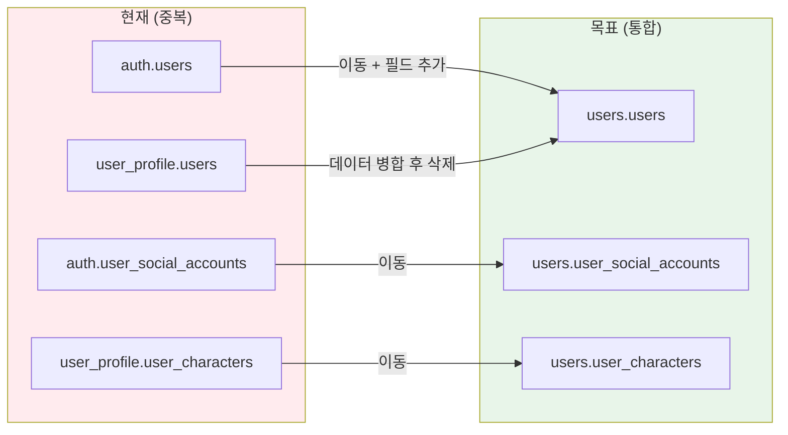

### 마이그레이션 단계

| Phase | 작업 | 테이블 변경 | 다운타임 |
|-------|------|------------|---------|
| **1** | 코드 이동 (auth → users) + gRPC 추가 | ❌ | ❌ |
| **2** | 스키마 생성 및 테이블 이동 | ✅ | 짧음 |
| **3** | 중복 데이터 병합 | ✅ | 짧음 |
| **4** | 이전 테이블/스키마 삭제 | ✅ | ❌ |

### Phase 2: 스키마 마이그레이션 SQL

```sql
-- Step 1: 새 스키마 생성
CREATE SCHEMA IF NOT EXISTS users;

-- Step 2: auth 테이블 이동
ALTER TABLE auth.users SET SCHEMA users;
ALTER TABLE auth.user_social_accounts SET SCHEMA users;

-- Step 3: user_profile.users 데이터 병합
UPDATE users.users u
SET 
    name = up.name,
    email = COALESCE(u.email, up.email)
FROM user_profile.users up
WHERE u.id = up.auth_user_id;

-- Step 4: user_characters 이동
ALTER TABLE user_profile.user_characters SET SCHEMA users;

-- Step 5: 중복 테이블 삭제
DROP TABLE user_profile.users;
DROP SCHEMA user_profile;

-- Step 6 (선택): auth 스키마 삭제
DROP SCHEMA auth;
```

---

## Phase 1 구현 완료

### 구현된 디렉토리 구조

```
apps/users/
├── __init__.py
├── main.py                    # FastAPI 애플리케이션 진입점
├── Dockerfile
├── requirements.txt
├── domain/
│   ├── entities/
│   │   ├── user.py            # User 엔티티 (dataclass)
│   │   └── user_character.py  # UserCharacter 엔티티
│   ├── enums/
│   │   └── user_character_status.py
│   └── services/
│       └── user_service.py    # 도메인 서비스 (전화번호 검증 등)
├── application/
│   ├── commands/
│   │   ├── update_profile.py  # UpdateProfileInteractor
│   │   └── delete_user.py     # DeleteUserInteractor
│   ├── queries/
│   │   ├── get_profile.py     # GetProfileQuery
│   │   └── get_characters.py  # GetCharactersQuery, CheckCharacterOwnershipQuery
│   └── common/
│       ├── dto/
│       │   ├── user_profile.py
│       │   └── user_character.py
│       └── ports/
│           ├── user_gateway.py
│           ├── user_character_gateway.py
│           ├── social_account_gateway.py
│           └── transaction_manager.py
├── infrastructure/
│   └── persistence_postgres/
│       ├── session.py
│       ├── mappings/
│       │   ├── user.py        # users.users 매핑
│       │   └── user_character.py
│       └── adapters/
│           ├── user_gateway_sqla.py
│           ├── user_character_gateway_sqla.py
│           ├── social_account_gateway_sqla.py
│           └── transaction_manager_sqla.py
├── presentation/
│   └── http/
│       ├── controllers/
│       │   ├── profile.py     # /user/me 엔드포인트
│       │   ├── characters.py  # /user/me/characters 엔드포인트
│       │   └── health.py
│       └── schemas/
│           └── user.py        # Pydantic 스키마
└── setup/
    ├── config.py              # Settings (Pydantic)
    ├── dependencies.py        # DI 설정
    └── logging.py
```

### 네이밍 변경

| 이전 (domains/my) | 이후 (apps/users) | 변경 이유 |
|------------------|------------------|----------|
| `MyService` | `UserService` | 도메인 명확성 |
| `my-api` | `users-api` | 도메인 일관성 |
| `user_profile` 스키마 | `users` 스키마 | 데이터 소유권 명확화 |

---

## 기능 분석

### API 엔드포인트

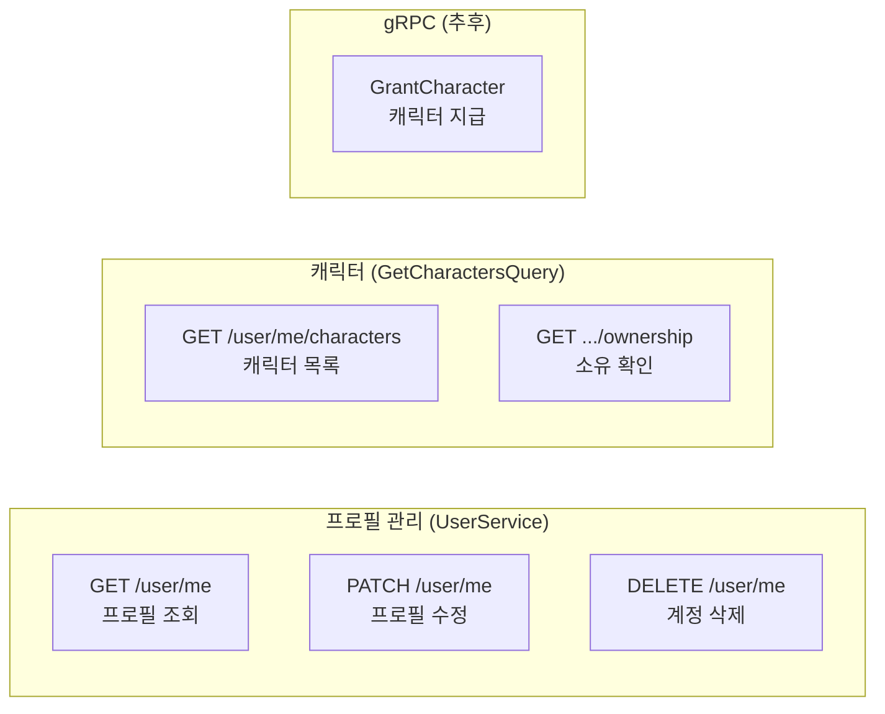

**API 설명**:

| 엔드포인트 | 메서드 | 설명 | 담당 |
|-----------|-------|------|--------|
| `/user/me` | GET | 현재 사용자 프로필 조회 | `GetProfileQuery` |
| `/user/me` | PATCH | 닉네임, 전화번호 수정 | `UpdateProfileInteractor` |
| `/user/me` | DELETE | 계정 삭제 | `DeleteUserInteractor` |
| `/user/me/characters` | GET | 소유 캐릭터 목록 | `GetCharactersQuery` |
| `/user/me/characters/{code}/ownership` | GET | 특정 캐릭터 소유 여부 | `CheckCharacterOwnershipQuery` |
| `GrantCharacter` (gRPC) | - | 캐릭터 지급 (추후 구현) | - |

### 캐릭터 저장 흐름 (Celery Batches)

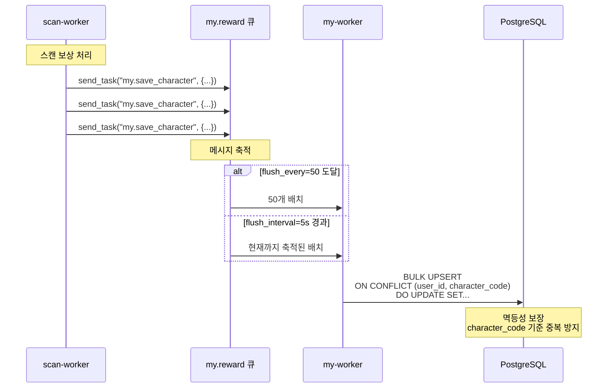

**Celery Batches 흐름 설명**:

1. **메시지 발행**: `scan` 도메인에서 보상 처리 시 `my.save_character` 태스크 발행
2. **배치 축적**: `flush_every=50` (50개 모이면) 또는 `flush_interval=5s` (5초 경과) 시 배치 처리
3. **BULK UPSERT**: `ON CONFLICT (user_id, character_code) DO UPDATE`로 멱등성 보장
4. **Self-Healing**: `character_id` 캐시 불일치 시에도 `character_code` 기준으로 정확히 저장

### gRPC 서버 (GrantCharacter)

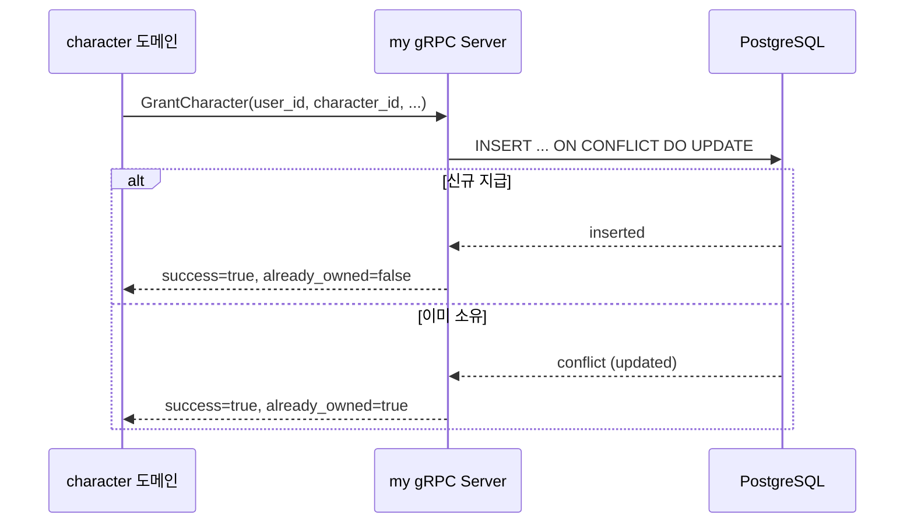

**gRPC 서버 설명**:

- `character` 도메인에서 **동기 스캔** 처리 시 `GrantCharacter` RPC 호출
- Optimistic Locking으로 동시 요청 시에도 중복 지급 방지
- `IntegrityError` 발생 시 `already_owned=true` 반환

### 외부 도메인 참조

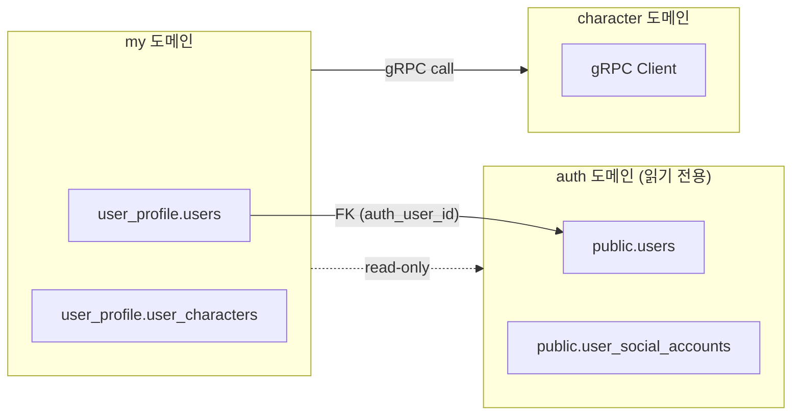

**외부 참조 설명**:

| 참조 대상 | 용도 | 방식 |
|----------|------|------|
| `auth.users` | 사용자 기본 정보 (닉네임, 이메일) | PostgreSQL 직접 조회 (읽기 전용) |
| `auth.user_social_accounts` | 소셜 계정 정보 (provider, last_login) | PostgreSQL 직접 조회 (읽기 전용) |
| `character` 도메인 | 기본 캐릭터 정보 조회 | gRPC 클라이언트 (Circuit Breaker 적용) |

---

## Clean Architecture 마이그레이션

### 목표 아키텍처

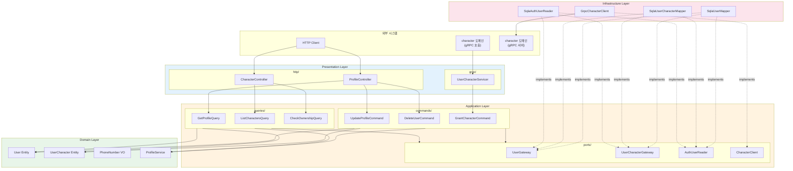

**아키텍처 설명**:

- **Presentation**: HTTP Controller와 gRPC Servicer가 공존 — 프로토콜 추상화
- **Application**: CQRS 패턴 적용 — Commands(쓰기), Queries(읽기) 분리
- **Domain**: 순수 비즈니스 로직 — 외부 의존성 없음
- **Infrastructure**: Port 구현체 — SQLAlchemy, gRPC 클라이언트

### 의존성 방향

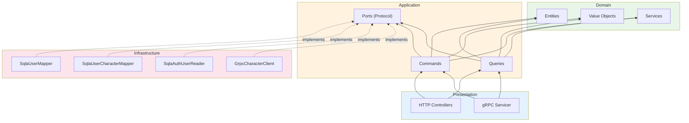

**의존성 규칙**:

| 규칙 | 설명 |
|-----|------|
| **안쪽으로만** | 모든 의존성은 Domain을 향함 |
| **Port/Adapter** | Application이 Port 정의, Infrastructure가 구현 |
| **DIP 적용** | 상위 모듈이 하위 모듈에 의존하지 않음 |

---

## 계층별 상세 설계

### Presentation Layer

#### HTTP Controllers

| Legacy | Clean Architecture | 역할 |
|--------|-------------------|------|
| `api/v1/endpoints/profile.py` | `presentation/http/controllers/profile.py` | 프로필 CRUD |
| `api/v1/endpoints/characters.py` | `presentation/http/controllers/characters.py` | 캐릭터 조회 |

```python
# presentation/http/controllers/profile.py
@router.get("/me", response_model=ProfileResponse)
async def get_profile(
    user: UserInfo = Depends(get_current_user),
    query: GetProfileQuery = Depends(),
) -> ProfileResponse:
    dto = await query.execute(
        GetProfileRequest(user_id=user.user_id, provider=user.provider)
    )
    return ProfileResponse.from_dto(dto)
```

#### gRPC Servicer

| Legacy | Clean Architecture | 역할 |
|--------|-------------------|------|
| `rpc/v1/user_character_servicer.py` | `presentation/grpc/user_character_servicer.py` | 캐릭터 지급 RPC |

```python
# presentation/grpc/user_character_servicer.py
class UserCharacterServicer(user_character_pb2_grpc.UserCharacterServiceServicer):
    def __init__(self, grant_command: GrantCharacterCommand):
        self._command = grant_command
    
    async def GrantCharacter(self, request, context) -> GrantCharacterResponse:
        dto = GrantCharacterRequest.from_proto(request)
        result = await self._command.execute(dto)
        return result.to_proto()
```

### Application Layer

#### Commands (쓰기)

| Use Case | 설명 | 의존 Port |
|----------|------|----------|
| `UpdateProfileCommand` | 프로필 수정 | `UserGateway` |
| `DeleteUserCommand` | 계정 삭제 | `UserGateway` |
| `GrantCharacterCommand` | 캐릭터 지급 (gRPC) | `UserCharacterGateway` |

```python
# application/commands/grant_character.py
@dataclass
class GrantCharacterRequest:
    user_id: UUID
    character_id: UUID
    character_code: str
    character_name: str
    character_type: str | None
    character_dialog: str | None
    source: str | None

class GrantCharacterCommand:
    def __init__(self, gateway: UserCharacterGateway):
        self._gateway = gateway
    
    async def execute(self, request: GrantCharacterRequest) -> GrantCharacterResult:
        result = await self._gateway.upsert(
            user_id=request.user_id,
            character_id=request.character_id,
            character_code=request.character_code,
            # ...
        )
        return GrantCharacterResult(
            success=True,
            already_owned=result.was_existing,
        )
```

#### Queries (읽기)

| Use Case | 설명 | 의존 Port |
|----------|------|----------|
| `GetProfileQuery` | 프로필 조회 | `UserGateway`, `AuthUserReader` |
| `ListCharactersQuery` | 캐릭터 목록 | `UserCharacterGateway` |
| `CheckOwnershipQuery` | 소유 확인 | `UserCharacterGateway` |

#### Ports (인터페이스)

```python
# application/common/ports/user_character_gateway.py
class UserCharacterGateway(Protocol):
    async def upsert(
        self,
        *,
        user_id: UUID,
        character_id: UUID,
        character_code: str,
        character_name: str,
        character_type: str | None,
        character_dialog: str | None,
        source: str | None,
    ) -> UpsertResult:
        """멱등 UPSERT (character_code 기준)"""
        ...
    
    async def list_by_user(self, user_id: UUID) -> list[UserCharacterDTO]:
        ...
    
    async def check_ownership_by_name(self, user_id: UUID, name: str) -> bool:
        ...
```

```python
# application/common/ports/character_client.py
class CharacterClient(Protocol):
    async def get_default_character(self) -> DefaultCharacterDTO | None:
        """기본 캐릭터 조회 (Circuit Breaker 적용)"""
        ...
```

### Domain Layer

#### Entity

```python
# domain/entities/user.py
@dataclass
class User:
    id: int | None
    auth_user_id: UUID
    username: str | None
    nickname: str | None
    phone_number: PhoneNumber | None  # Value Object
    profile_image_url: str | None
    created_at: datetime | None
    
    def update_profile(
        self,
        nickname: str | None = None,
        phone_number: PhoneNumber | None = None,
    ) -> None:
        if nickname is not None:
            self.nickname = nickname
        if phone_number is not None:
            self.phone_number = phone_number
```

#### Value Object

```python
# domain/value_objects/phone_number.py
@dataclass(frozen=True, slots=True)
class PhoneNumber:
    value: str
    
    def __post_init__(self):
        normalized = self._normalize(self.value)
        if not self._is_valid(normalized):
            raise InvalidPhoneNumberError(self.value)
        object.__setattr__(self, 'value', normalized)
    
    @staticmethod
    def _normalize(raw: str) -> str:
        digits = re.sub(r"\D+", "", raw)
        if digits.startswith("82") and len(digits) >= 11:
            digits = "0" + digits[2:]
        return digits
    
    def formatted(self) -> str:
        """010-1234-5678 형식"""
        return f"{self.value[:3]}-{self.value[3:7]}-{self.value[7:]}"
```

**Value Object 설명**:

- **불변(Immutable)**: `frozen=True`로 생성 후 변경 불가
- **자가 검증**: 생성 시점에 유효성 검사
- **정규화**: 국제 형식(+82) → 국내 형식(010) 자동 변환

#### Domain Service

```python
# domain/services/profile_service.py
class ProfileService:
    def build_profile(
        self,
        user: User,
        social_accounts: list[SocialAccountInfo],
        current_provider: str,
    ) -> ProfileDTO:
        account = self._select_social_account(social_accounts, current_provider)
        username = self._resolve_username(user, account)
        nickname = self._resolve_nickname(user, account, username)
        
        return ProfileDTO(
            username=username,
            nickname=nickname,
            phone_number=user.phone_number.formatted() if user.phone_number else None,
            provider=account.provider if account else current_provider,
            last_login_at=account.last_login_at if account else None,
        )
```

### Infrastructure Layer

#### Adapters

| Adapter | Port | 역할 |
|---------|------|------|
| `SqlaUserMapper` | `UserGateway` | User CRUD |
| `SqlaUserCharacterMapper` | `UserCharacterGateway` | 캐릭터 인벤토리 |
| `SqlaAuthUserReader` | `AuthUserReader` | auth 읽기 전용 |
| `GrpcCharacterClient` | `CharacterClient` | character gRPC 호출 |

```python
# infrastructure/adapters/user_character_mapper_sqla.py
class SqlaUserCharacterMapper(UserCharacterGateway):
    async def upsert(self, **kwargs) -> UpsertResult:
        stmt = (
            insert(UserCharacterModel)
            .values(**kwargs)
            .on_conflict_do_update(
                constraint="uq_user_character_code",
                set_={
                    "character_id": kwargs["character_id"],
                    "character_name": kwargs["character_name"],
                    # ...
                },
            )
            .returning(UserCharacterModel)
        )
        result = await self._session.execute(stmt)
        row = result.scalar_one()
        return UpsertResult(
            was_existing=(row.updated_at != row.acquired_at),
        )
```

```python
# infrastructure/grpc_client/character_client_grpc.py
class GrpcCharacterClient(CharacterClient):
    def __init__(self, settings: Settings):
        self._circuit_breaker = CircuitBreaker(
            name="character-grpc",
            fail_max=settings.circuit_fail_max,
            timeout_duration=settings.circuit_timeout_duration,
        )
    
    async def get_default_character(self) -> DefaultCharacterDTO | None:
        try:
            return await self._circuit_breaker.call_async(self._call_impl)
        except CircuitBreakerError:
            logger.warning("Circuit breaker OPEN")
            return None
```

---

## 디렉토리 구조

### apps/my (API + gRPC Server)

```
apps/my/
├── main.py                                      # FastAPI + gRPC 서버
├── requirements.txt
├── Dockerfile
│
├── setup/
│   ├── config/settings.py
│   └── dependencies.py                          # DI Container
│
├── presentation/
│   ├── http/
│   │   ├── controllers/
│   │   │   ├── profile.py                       # GET/PATCH/DELETE /user/me
│   │   │   └── characters.py                    # GET /user/me/characters
│   │   └── schemas/
│   │       ├── profile.py
│   │       └── character.py
│   └── grpc/
│       ├── user_character_servicer.py           # GrantCharacter RPC
│       └── schemas.py                           # Proto ↔ DTO
│
├── application/
│   ├── commands/
│   │   ├── update_profile.py
│   │   ├── delete_user.py
│   │   └── grant_character.py
│   ├── queries/
│   │   ├── get_profile.py
│   │   ├── list_characters.py
│   │   └── check_ownership.py
│   └── common/
│       ├── dto/
│       │   ├── profile.py
│       │   └── character.py
│       ├── ports/
│       │   ├── user_gateway.py
│       │   ├── user_character_gateway.py
│       │   ├── auth_user_reader.py
│       │   └── character_client.py
│       └── exceptions/
│
├── domain/
│   ├── entities/
│   │   ├── user.py
│   │   └── user_character.py
│   ├── value_objects/
│   │   ├── phone_number.py
│   │   └── ownership_status.py
│   ├── services/
│   │   └── profile_service.py
│   └── exceptions/
│
├── infrastructure/
│   ├── adapters/
│   │   ├── user_mapper_sqla.py
│   │   ├── user_character_mapper_sqla.py
│   │   └── auth_user_reader_sqla.py
│   ├── grpc_client/
│   │   └── character_client_grpc.py
│   └── persistence_postgres/
│       └── models/
│
└── proto/
    ├── user_character.proto
    └── character/
        └── character.proto
```

### apps/my_worker (Celery 배치)

```
apps/my_worker/
├── main.py                                      # Celery 앱
├── requirements.txt
├── Dockerfile
├── application/
│   └── commands/
│       └── save_character_batch.py              # 배치 저장 UseCase
└── infrastructure/
    └── persistence_postgres/
        └── user_character_bulk_store.py         # BULK UPSERT
```

---

## 파일별 매핑 테이블

### Services → Commands/Queries

| Legacy | Clean Architecture | 분류 |
|--------|-------------------|------|
| `services/my.py::get_current_user()` | `queries/get_profile.py` | Query |
| `services/my.py::update_current_user()` | `commands/update_profile.py` | Command |
| `services/my.py::delete_current_user()` | `commands/delete_user.py` | Command |
| `services/characters.py::list_owned()` | `queries/list_characters.py` | Query |
| `services/characters.py::owns_character()` | `queries/check_ownership.py` | Query |
| `rpc/v1/user_character_servicer.py::GrantCharacter()` | `commands/grant_character.py` | Command |

### Domain Logic 추출

| Legacy | Clean Architecture | 역할 |
|--------|-------------------|------|
| `services/my.py::_resolve_username()` | `domain/services/profile_service.py` | 사용자명 결정 |
| `services/my.py::_resolve_nickname()` | `domain/services/profile_service.py` | 닉네임 결정 |
| `services/my.py::_select_social_account()` | `domain/services/profile_service.py` | 소셜 계정 선택 |
| `services/my.py::_normalize_phone_number()` | `domain/value_objects/phone_number.py` | 전화번호 정규화 |

### Repositories → Adapters

| Legacy | Clean Architecture | Port |
|--------|-------------------|------|
| `repositories/user_repository.py` | `adapters/user_mapper_sqla.py` | `UserGateway` |
| `repositories/user_character_repository.py` | `adapters/user_character_mapper_sqla.py` | `UserCharacterGateway` |
| `repositories/user_social_account_repository.py` | `adapters/auth_user_reader_sqla.py` | `AuthUserReader` |

### gRPC 관련

| Legacy | Clean Architecture | 역할 |
|--------|-------------------|------|
| `rpc/character_client.py` | `infrastructure/grpc_client/character_client_grpc.py` | character gRPC 클라이언트 |
| `rpc/v1/user_character_servicer.py` | `presentation/grpc/user_character_servicer.py` | gRPC Servicer |
| `proto/*` | `proto/*` | 그대로 유지 |

---

## 마이그레이션 단계

### Phase 1: Domain Layer

1. Entity 정의 (`User`, `UserCharacter`)
2. Value Object 정의 (`PhoneNumber`, `OwnershipStatus`)
3. Domain Service 추출 (`ProfileService`)

### Phase 2: Application Layer

1. Port 정의 (`UserGateway`, `UserCharacterGateway`, `AuthUserReader`, `CharacterClient`)
2. Commands 구현 (`UpdateProfile`, `DeleteUser`, `GrantCharacter`)
3. Queries 구현 (`GetProfile`, `ListCharacters`, `CheckOwnership`)

### Phase 3: Infrastructure Layer

1. SQLAlchemy Adapters 구현
2. gRPC Client 구현 (Circuit Breaker 포함)
3. ORM Models 분리

### Phase 4: Presentation Layer

1. HTTP Controllers 구현
2. gRPC Servicer 구현
3. DI Container 구성 (`dependencies.py`)

### Phase 5: Worker 분리

1. `apps/my_worker` 디렉토리 생성
2. 배치 저장 UseCase 구현
3. Dockerfile 및 CI 설정

---

## References

- [Clean Architecture #2: Auth Clean Architecture 구현](https://rooftopsnow.tistory.com/123)
- Robert C. Martin, "Clean Architecture" (2017)
- Vaughn Vernon, "Implementing Domain-Driven Design" (2013)


| `services/characters.py::owns_character()` | `queries/check_ownership.py` | Query |
| `rpc/v1/user_character_servicer.py::GrantCharacter()` | `commands/grant_character.py` | Command |

### Domain Logic 추출

| Legacy | Clean Architecture | 역할 |
|--------|-------------------|------|
| `services/my.py::_resolve_username()` | `domain/services/profile_service.py` | 사용자명 결정 |
| `services/my.py::_resolve_nickname()` | `domain/services/profile_service.py` | 닉네임 결정 |
| `services/my.py::_select_social_account()` | `domain/services/profile_service.py` | 소셜 계정 선택 |
| `services/my.py::_normalize_phone_number()` | `domain/value_objects/phone_number.py` | 전화번호 정규화 |

### Repositories → Adapters

| Legacy | Clean Architecture | Port |
|--------|-------------------|------|
| `repositories/user_repository.py` | `adapters/user_mapper_sqla.py` | `UserGateway` |
| `repositories/user_character_repository.py` | `adapters/user_character_mapper_sqla.py` | `UserCharacterGateway` |
| `repositories/user_social_account_repository.py` | `adapters/auth_user_reader_sqla.py` | `AuthUserReader` |

### gRPC 관련

| Legacy | Clean Architecture | 역할 |
|--------|-------------------|------|
| `rpc/character_client.py` | `infrastructure/grpc_client/character_client_grpc.py` | character gRPC 클라이언트 |
| `rpc/v1/user_character_servicer.py` | `presentation/grpc/user_character_servicer.py` | gRPC Servicer |
| `proto/*` | `proto/*` | 그대로 유지 |

---

## 마이그레이션 단계

### Phase 1: Domain Layer

1. Entity 정의 (`User`, `UserCharacter`)
2. Value Object 정의 (`PhoneNumber`, `OwnershipStatus`)
3. Domain Service 추출 (`ProfileService`)

### Phase 2: Application Layer

1. Port 정의 (`UserGateway`, `UserCharacterGateway`, `AuthUserReader`, `CharacterClient`)
2. Commands 구현 (`UpdateProfile`, `DeleteUser`, `GrantCharacter`)
3. Queries 구현 (`GetProfile`, `ListCharacters`, `CheckOwnership`)

### Phase 3: Infrastructure Layer

1. SQLAlchemy Adapters 구현
2. gRPC Client 구현 (Circuit Breaker 포함)
3. ORM Models 분리

### Phase 4: Presentation Layer

1. HTTP Controllers 구현
2. gRPC Servicer 구현
3. DI Container 구성 (`dependencies.py`)

### Phase 5: Worker 분리

1. `apps/my_worker` 디렉토리 생성
2. 배치 저장 UseCase 구현
3. Dockerfile 및 CI 설정

---

## References

- [Clean Architecture #2: Auth Clean Architecture 구현](https://rooftopsnow.tistory.com/123)
- Robert C. Martin, "Clean Architecture" (2017)
- Vaughn Vernon, "Implementing Domain-Driven Design" (2013)

