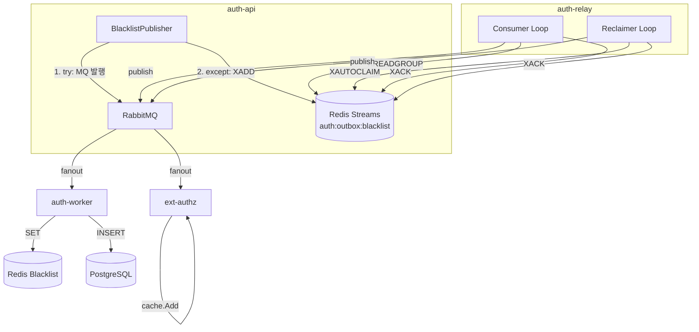
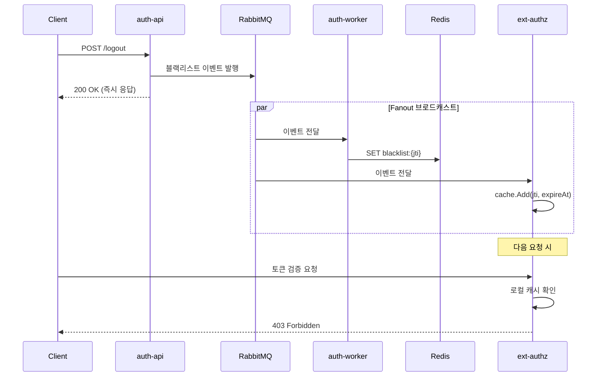
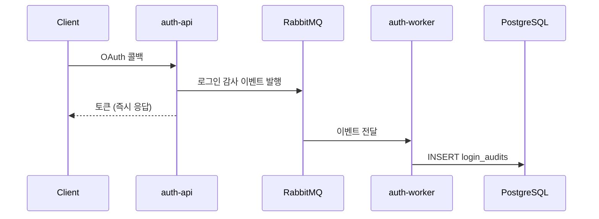
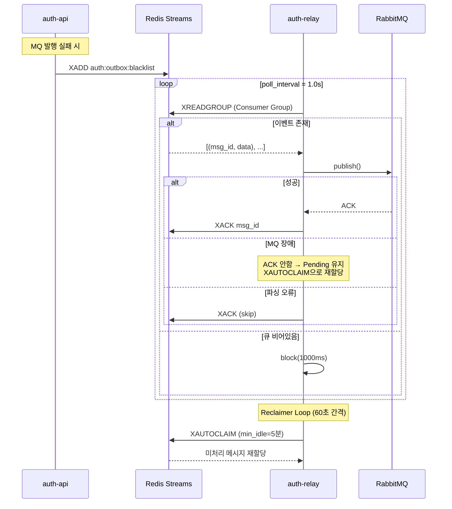
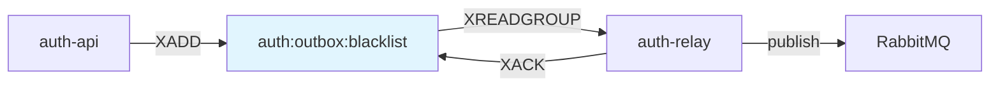
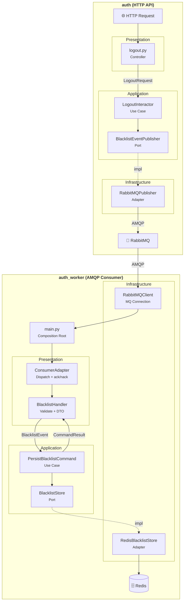
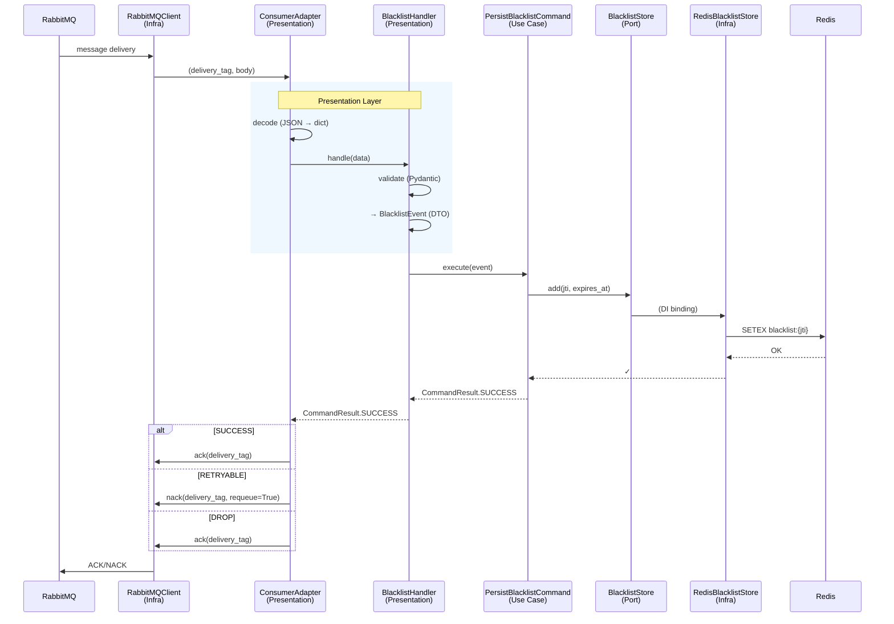
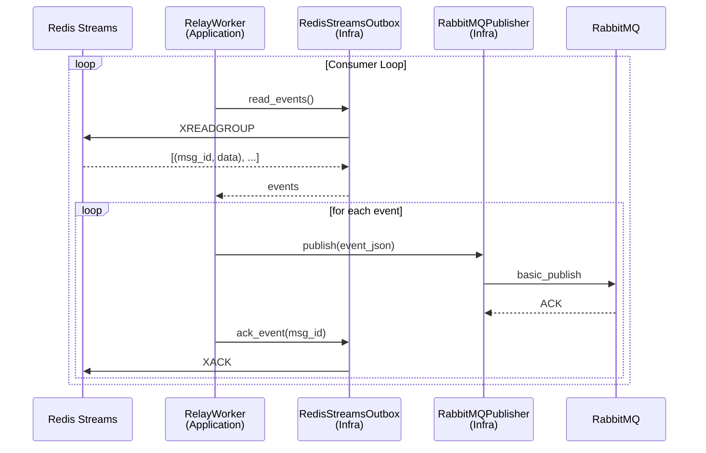

# Auth Persistence Offloading: 이벤트 기반 인증 워커 구현

> **작성일**: 2024-12-31
> **태그**: `Clean Architecture`, `Event-Driven`, `RabbitMQ`, `Redis Streams`, `PostgreSQL`

## 개요

인증 서비스(`auth-api`)에서 직접 수행하던 영속성 작업을 별도의 워커(`auth-worker`, `auth-relay`)로 분리한 과정을 기록합니다. 이를 통해 **느슨한 결합(Loose Coupling)**, **확장성(Scalability)**, **유지보수성(Maintainability)**을 개선했습니다.

## 배경

### 기존 아키텍처의 문제점

기존 `auth-api`는 다음과 같은 영속성 작업을 동기적으로 수행했습니다:

```
┌─────────────────────────────────────────────────────────────┐
│                       auth-api                               │
│                                                             │
│  [로그인] ──▶ PostgreSQL (사용자, 로그인 감사)               │
│  [로그아웃] ──▶ Redis (블랙리스트 추가)                      │
│  [토큰 갱신] ──▶ Redis (이전 토큰 블랙리스트)                │
└─────────────────────────────────────────────────────────────┘
```

**문제점**:

1. **강한 결합**: `auth-api`가 Redis와 PostgreSQL에 직접 의존
2. **단일 책임 원칙 위반**: 인증 로직과 영속성 로직이 혼재
3. **확장성 제한**: 영속성 작업이 API 응답 시간에 영향
4. **테스트 어려움**: 외부 의존성으로 인한 복잡한 테스트 설정

### 목표

- **블랙리스트 관리**: Redis 직접 접근 → 이벤트 발행으로 전환
- **로그인 감사 기록**: PostgreSQL 직접 접근 → 이벤트 발행으로 전환
- **ext-authz 활용**: 토큰 검증은 이미 `ext-authz`에서 수행 (중복 제거)
- **워커 독립화**: 인프라 워커를 별도 배포 단위로 분리

## 설계 원칙: Offloading 대상 선정

### ⚠️ 무분별한 Offloading 지양

모든 영속성 작업을 이벤트 기반으로 전환하는 것은 **안티패턴**입니다. Offloading 대상은 다음 기준으로 신중하게 선정해야 합니다.

### Offloading 적합 vs 부적합

| 작업 | Offloading | 이유 |
|------|-----------|------|
| **블랙리스트 추가** | ✅ 적합 | 즉시 응답 불필요, Eventual Consistency 허용 |
| **로그인 감사 기록** | ✅ 적합 | 부가 기능, 실패해도 인증 흐름에 영향 없음 |
| **OAuth State 검증** | ❌ 부적합 | 콜백 직후 즉시 검증 필요 (동기) |
| **사용자 생성/조회** | ❌ 부적합 | 토큰 발급에 필수, 트랜잭션 정합성 필요 |
| **토큰 발급** | ❌ 부적합 | 응답에 포함되어야 함 (동기 필수) |

### 강결합 유지 대상: OAuth 2.0 / 회원가입

```
┌─────────────────────────────────────────────────────────────────────┐
│                   auth-api (동기 처리 유지)                          │
│                                                                     │
│  [OAuth 콜백]                                                       │
│     │                                                               │
│     ├── 1. State 검증 ──────────▶ Redis (동기 읽기/삭제)            │
│     │      └── 위조 방지, CSRF 검증은 즉시 수행되어야 함              │
│     │                                                               │
│     ├── 2. 사용자 조회/생성 ────▶ PostgreSQL (동기 트랜잭션)         │
│     │      └── 토큰 발급 전 user_id 확보 필수                        │
│     │                                                               │
│     └── 3. 토큰 발급 ──────────▶ 응답 (동기)                        │
│            └── 클라이언트에게 즉시 반환되어야 함                      │
│                                                                     │
│  ※ 위 작업은 Eventual Consistency가 아닌                            │
│    Strong Consistency가 필요하므로 Offloading 대상이 아님            │
└─────────────────────────────────────────────────────────────────────┘
```

### 판단 기준

| 기준 | Offloading 적합 | 강결합 유지 |
|------|----------------|------------|
| **응답 의존성** | 응답에 결과 불필요 | 응답에 결과 포함 |
| **일관성 요구** | Eventual OK | Strong 필수 |
| **실패 영향** | 재시도 가능, 무해 | 전체 흐름 실패 |
| **지연 허용** | ms~초 단위 허용 | 즉시 필요 |

### 실제 적용

```python
# ✅ Offloading 대상: 로그아웃 (블랙리스트)
async def logout(self, access_token: str) -> None:
    payload = self._token_service.decode(access_token)
    
    # 이벤트 발행만 (워커가 Redis 저장)
    await self._blacklist_publisher.publish_add(payload)
    
    # 즉시 응답 (저장 완료 대기 안 함)


# ❌ Offloading 부적합: OAuth 콜백 (사용자 조회/생성)
async def oauth_callback(self, code: str, state: str) -> TokenPair:
    # 1. State 검증 (동기 - 즉시 필요)
    stored_state = await self._state_store.get_and_delete(state)
    if not stored_state:
        raise InvalidStateError()
    
    # 2. 사용자 조회/생성 (동기 - 토큰 발급에 필수)
    user = await self._get_or_create_user(oauth_user)
    
    # 3. 토큰 발급 (동기 - 응답에 포함)
    return self._token_service.create_pair(user)
```

> **핵심**: 성능 최적화보다 **로직의 정합성**이 우선입니다.  
> OAuth 2.0 흐름은 보안과 트랜잭션 무결성이 핵심이므로 강결합을 유지합니다.

## 새로운 아키텍처

### 이벤트 기반 영속성 오프로딩



**컴포넌트 역할**:

| 컴포넌트 | 역할 |
|---|---|
| `auth-api` | 이벤트 발행 (MQ 직접 or Outbox Fallback) |
| `Redis Streams` | MQ 장애 시 이벤트 임시 저장소 (Outbox) |
| `auth-relay` | Outbox → MQ 브릿지 (Consumer + Reclaimer) |
| `auth-worker` | 영속성 처리 (Redis 블랙리스트, PostgreSQL 감사 기록) |
| `ext-authz` | 토큰 검증 + 로컬 캐시 (In-memory 블랙리스트) |

**Fallback 흐름**: `auth-api`가 MQ 발행 실패 시 `XADD`로 Redis Streams에 저장 → `auth-relay`가 `XREADGROUP`으로 읽어서 MQ로 재발행

### 데이터 흐름

#### 1. 블랙리스트 이벤트



**흐름 요약**:
1. 클라이언트가 로그아웃 요청 → `auth-api`가 블랙리스트 이벤트 발행 → **즉시 응답** (비동기)
2. RabbitMQ Fanout으로 **동시 브로드캐스트**:
   - `auth-worker`: Redis에 블랙리스트 영구 저장 (TTL = 토큰 만료 시간)
   - `ext-authz`: 로컬 In-memory 캐시에 추가 (빠른 검증용)
3. 다음 API 요청 시 `ext-authz`가 로컬 캐시에서 JTI 확인 → **403 Forbidden**

**핵심**: 클라이언트는 영속성 완료를 기다리지 않고 즉시 응답을 받습니다. Eventual Consistency 허용 구간.

#### 2. 로그인 감사 이벤트



**흐름 요약**:
1. OAuth 콜백 처리 완료 → 로그인 감사 이벤트 발행 → **토큰 즉시 반환**
2. `auth-worker`가 비동기로 PostgreSQL에 감사 기록 저장

**로그인 감사 데이터**: `user_id`, `provider`, `jti`, `login_ip`, `user_agent`, `issued_at`

**핵심**: 감사 기록은 부가 기능으로, 실패해도 인증 흐름에 영향 없음. Fire-and-forget 패턴.

## Outbox 패턴 (Redis Streams)

### 왜 Outbox가 필요한가?

MQ 발행은 ~99% 성공하지만, 네트워크 장애나 RabbitMQ 다운 시 이벤트가 유실될 수 있습니다. **Outbox 패턴**은 이런 상황에서 이벤트를 안전하게 보관하고 재발행합니다.

### Redis List vs Redis Streams

| 항목 | List (이전) | Streams (현재) |
|------|------------|---------------|
| 읽기 | RPOP (즉시 삭제) | **XREADGROUP** (Pending 유지) |
| 처리 완료 | ❌ 없음 | ✅ **XACK** |
| 재처리 | 수동 LPUSH | ✅ **XAUTOCLAIM** (자동) |
| 다중 워커 | ❌ 경쟁 조건 | ✅ **Consumer Group** |
| 워커 장애 | 메시지 유실 | ✅ **Pending → 재할당** |

### Outbox 릴레이 시퀀스

> **auth-relay**는 Redis Streams Outbox 절차를 수행합니다.  
> 강결합 없이 ms 단위 **Eventual Consistency**로 논리적 정합성을 유지합니다.



**Consumer Loop** (실시간):
- `XREADGROUP`으로 새 메시지 읽기 (block 1초)
- MQ 발행 성공 시 `XACK`로 처리 완료
- MQ 장애 시 ACK 안 함 → Pending 상태 유지

**Reclaimer Loop** (60초 간격):
- `XAUTOCLAIM`으로 5분 이상 Pending 상태인 메시지 재할당
- 워커 장애/재시작 시 누락 메시지 복구

**예외 처리**:

| 상황 | 처리 |
|---|---|
| MQ 장애 | ACK 안 함 → Pending 유지 → Reclaimer가 재처리 |
| 파싱 오류 | XACK (skip) → 잘못된 메시지 폐기 |
| 워커 장애 | Pending 메시지 다른 워커로 재할당 |

### Outbox 컴포넌트 다이어그램



**데이터 흐름**:
`auth-api` → (XADD) → `Redis Streams` → (XREADGROUP) → `auth-relay` → (XACK) → `Redis Streams`  
`auth-relay` → (publish) → `RabbitMQ`

**핵심 보장**:
- **At-Least-Once Delivery**: ACK 전 장애 시 재처리
- **순서 보장**: Stream은 순서 유지, Consumer Group으로 분산 처리
- **장애 복구**: XAUTOCLAIM으로 미처리 메시지 자동 재할당

## 컴포넌트별 계층 구조

세 컴포넌트(`auth`, `auth_worker`, `auth_relay`)는 모두 Clean Architecture를 따릅니다. `auth`와 `auth_worker`는 Presentation Layer를 가지며, `auth_relay`는 단순한 브릿지 역할이므로 main에 통합되어 있습니다.

### 계층별 호출 흐름 비교



**auth (왼쪽)**:
- HTTP 요청 → Controller → Interactor → Port → Adapter → RabbitMQ
- 동기 요청-응답 패턴, 이벤트 발행 후 즉시 응답

**auth_worker (오른쪽)**:
- RabbitMQ → `RabbitMQClient`(Infra) → `ConsumerAdapter`(Pres) → `Handler`(Pres) → `Command`(App) → `Store`(Port) → Redis
- `ConsumerAdapter`: 메시지 디스패칭 + ack/nack 결정 (MQ semantics 담당)
- `Handler`: 검증(Pydantic) + DTO 변환 (비즈니스 로직 금지)
- `Command`: Use Case 실행, **CommandResult** 반환 (SUCCESS/RETRYABLE/DROP)

**핵심 설계**: Command가 "성공/재시도/폐기" 판단을 내리고, ConsumerAdapter가 이를 보고 ack/nack을 결정합니다. 이로써 **업무 판단(Application)**과 **MQ 정책(Presentation)**이 분리됩니다.

### 계층별 책임 비교

| 계층 | auth (HTTP) | auth_worker (AMQP) | auth_relay (Hybrid) |
|---|---|---|---|
| **Entry** | `main.py` (FastAPI) | `main.py` (Composition Root) | `main.py` |
| **Presentation** | ✅ `controllers/` | ✅ `ConsumerAdapter` + `handlers/` | ❌ (main에 통합) |
| **Application** | Interactor + Port | Command → **CommandResult** | Worker (루프) |
| **Infrastructure** | RabbitMQ Adapter | **RabbitMQClient** + Redis | Streams + MQ Adapter |

### 의존성 방향 (Dependency Rule)

```
┌───────────────────────────────────────────────────────────────────────────────┐
│                          Dependency Rule (동일 적용)                            │
├───────────────────────────────────────────────────────────────────────────────┤
│                                                                               │
│   Entry ───▶ Presentation ───▶ Application ◀─── Infrastructure               │
│   (main)    (Handler)          (Use Case)       (구현체)                      │
│                                     │                                         │
│                                     ▼                                         │
│                                Port (Interface)                               │
│                                                                               │
│   ※ 화살표 방향 = 의존성 방향                                                   │
│   ※ Application은 Infrastructure를 모름 (Port만 앎)                            │
│   ※ Presentation은 메시지 검증/변환만 담당 (비즈니스 로직 금지)                   │
│                                                                               │
└───────────────────────────────────────────────────────────────────────────────┘
```

> **Presentation Layer 분리의 이점**:
> - 프로토콜 변경 시 Application 계층 영향 없음 (예: RabbitMQ → Kafka)
> - 멱등/리트라이/에러 핸들링을 일관된 파이프라인으로 처리
> - 유닛 테스트 용이 (핸들러/유스케이스 분리)

### 메시지 핸들링 흐름 (auth_worker)



**흐름 요약**:
1. `RabbitMQClient`가 MQ에서 메시지를 수신하여 `ConsumerAdapter`에 전달
2. `ConsumerAdapter`가 JSON 디코딩 후 적절한 `Handler`에 디스패치
3. `Handler`가 Pydantic으로 검증하고, Application DTO로 변환
4. `Command`(Use Case)가 비즈니스 로직 수행 후 **CommandResult** 반환
5. `ConsumerAdapter`가 결과에 따라 **ack/nack 결정**

**CommandResult 분기**:

| 결과 | MQ 동작 | 사용 케이스 |
|---|---|---|
| `SUCCESS` | ack | 정상 처리 완료 |
| `RETRYABLE` | nack + requeue | 일시적 오류 (Redis 연결 실패 등) |
| `DROP` | ack (폐기) | 영구적 오류 (잘못된 메시지 형식 등) |

**핵심**: Command는 "업무적으로 성공했는지"만 판단하고, MQ semantics(ack/nack/requeue)는 ConsumerAdapter가 처리합니다.

### auth_relay 메시지 핸들링 (Streams → MQ)



**흐름 요약**:
1. `RelayWorker`가 `XREADGROUP`으로 새 메시지 읽기 (blocking)
2. 각 이벤트를 RabbitMQ로 발행 (`basic_publish`)
3. 발행 성공 시 `XACK`로 처리 완료 표시
4. 실패 시 ACK 안 함 → Pending 유지 → `XAUTOCLAIM`으로 재처리

**두 개의 루프 (병렬 실행)**:

| 루프 | 역할 | 주기 |
|---|---|---|
| **Consumer** | 새 메시지 처리 (`XREADGROUP`) | 실시간 (block 1s) |
| **Reclaimer** | 미처리 메시지 재할당 (`XAUTOCLAIM`) | 30초 간격, 5분 유휴 기준 |

**Presentation Layer 없는 이유**: 입력(Redis Streams)과 출력(RabbitMQ)이 고정되어 있고, 프로토콜 변경 가능성이 낮은 단순 브릿지 역할이므로 main에 통합.

## 구현 상세

### 1. auth-worker 클린 아키텍처

```
apps/auth_worker/
├── main.py                            # Composition Root (DI만)
├── presentation/                      # Inbound Adapter (AMQP)
│   └── amqp/
│       ├── consumer.py                # ConsumerAdapter (디스패칭 + ack/nack)
│       ├── handlers/
│       │   ├── base.py                # 검증 파이프라인
│       │   ├── blacklist.py           # Handler → Command 호출
│       │   └── login_audit.py
│       └── schemas.py                 # Pydantic 메시지 스키마
├── application/
│   ├── commands/
│   │   ├── persist_blacklist.py       # Use Case → CommandResult 반환
│   │   └── persist_login_audit.py
│   └── common/
│       ├── result.py                  # CommandResult (SUCCESS/RETRYABLE/DROP)
│       ├── dto/
│       └── ports/                     # Port (primitive only)
├── infrastructure/
│   ├── messaging/
│   │   └── rabbitmq_client.py         # MQ 연결/채널 (메시지 스트림)
│   ├── persistence_postgres/
│   └── persistence_redis/
└── setup/
    └── dependencies.py                # DI 컨테이너
```

> **계층별 책임 분리**:
> - `main.py`: Composition Root — DI 설정, 연결 관리, Consumer 시작
> - `ConsumerAdapter`: MQ semantics — decode, dispatch, **ack/nack 결정**
> - `Handler`: 메시지 검증, DTO 변환, Command 호출
> - `Command`: Use Case — 업무 성공/실패 판단, **CommandResult 반환**
> - `RabbitMQClient`: Infrastructure — MQ 연결/채널, 메시지 스트림 전달
>
> **핵심 설계**: Command가 `CommandResult(SUCCESS/RETRYABLE/DROP)`를 반환하고, ConsumerAdapter가 이를 보고 ack/nack을 결정. 업무 판단(Application)과 MQ 정책(Presentation)을 분리.

### 2. auth-relay (Redis Streams Consumer)

```
apps/auth_relay/
├── application/
│   └── relay_worker.py             # Consumer + Reclaimer 루프
├── config/
│   └── settings.py                 # Consumer Group 설정
├── infrastructure/
│   ├── outbox/
│   │   └── redis_outbox.py         # XREADGROUP/XACK/XAUTOCLAIM
│   └── messaging/
│       └── rabbitmq_publisher.py   # MQ 발행 로직
├── main.py                         # 진입점
├── Dockerfile
└── requirements.txt                # 최소 의존성 (2개)
```

### 핵심 컴포넌트

#### 1. AsyncRedisOutbox (auth-api 측 XADD)

```python
class AsyncRedisOutbox:
    """Redis Streams 기반 Outbox (비동기 버전).
    
    MQ 발행 실패 시 Fallback으로 사용됩니다.
    """
    
    STREAM_KEY = "auth:outbox:blacklist"
    STREAM_MAXLEN = 10000

    async def push(self, data: str) -> str | None:
        """이벤트를 Outbox에 추가 (XADD)."""
        msg_id = await self._redis.xadd(
            self._stream_key,
            {"data": data},
            maxlen=self._maxlen,
            approximate=True,
        )
        return msg_id
```

#### 2. RedisStreamsOutbox (auth-relay 측 Consumer)

```python
class RedisStreamsOutbox:
    """Redis Streams Consumer Group."""

    async def ensure_group(self) -> None:
        """Consumer Group 생성 (없으면 생성)."""
        await self._redis.xgroup_create(
            self._stream_key,
            self._group_name,
            id="0",
            mkstream=True,
        )

    async def read(self, count: int = 10, block_ms: int = 1000) -> list[tuple[str, str]]:
        """XREADGROUP으로 새 메시지 읽기."""
        result = await self._redis.xreadgroup(
            groupname=self._group_name,
            consumername=self._consumer_name,
            streams={self._stream_key: ">"},
            count=count,
            block=block_ms,
        )
        return [(msg_id, data) for msg_id, fields in result]

    async def ack(self, msg_id: str) -> bool:
        """처리 완료 (XACK)."""
        await self._redis.xack(self._stream_key, self._group_name, msg_id)
        return True

    async def claim_pending(self, min_idle_ms: int = 300000) -> list[tuple[str, str]]:
        """미처리 메시지 재할당 (XAUTOCLAIM)."""
        result = await self._redis.xautoclaim(
            self._stream_key,
            self._group_name,
            self._consumer_name,
            min_idle_time=min_idle_ms,
        )
        return [(msg_id, data) for msg_id, fields in result[1]]
```

#### 3. RelayWorker (Streams → MQ 브릿지)

```python
class RelayWorker:
    """Outbox relay worker (Streams → MQ)."""

    async def start(self) -> None:
        # Consumer Group 초기화
        await self._outbox.ensure_group()
        self._publisher.connect()
        
        # 두 개의 루프 병렬 실행
        await asyncio.gather(
            self._consumer_loop(),    # 새 메시지 처리
            self._reclaimer_loop(),   # 미처리 메시지 재할당
        )

    async def _consumer_loop(self) -> None:
        """Main consumer loop - XREADGROUP."""
        while not self._shutdown:
            events = await self._outbox.read(
                count=self._settings.batch_size,
                block_ms=self._settings.block_ms,
            )
            await self._process_events(events)

    async def _reclaimer_loop(self) -> None:
        """Reclaimer loop - XAUTOCLAIM (5분 유휴 메시지)."""
        while not self._shutdown:
            await asyncio.sleep(self._settings.reclaim_interval)
            events = await self._outbox.claim_pending()
            await self._process_events(events)

    async def _process_events(self, events: list[tuple[str, str]]) -> None:
        for msg_id, event_json in events:
            try:
                self._publisher.publish(event_json)
                await self._outbox.ack(msg_id)  # 성공 시 ACK
            except AMQPError:
                # ACK 안함 → Pending 유지 → XAUTOCLAIM으로 재처리
                break
```

### auth-api 측 이벤트 발행 (Outbox Fallback)

```python
class RabbitMQBlacklistEventPublisher:
    """MQ 발행 + Outbox Fallback."""

    async def publish_add(self, payload: TokenPayload, reason: str = "logout") -> None:
        event = {
            "type": "add",
            "jti": payload.jti,
            "expires_at": expires_at.isoformat(),
            ...
        }
        
        try:
            await self._ensure_connected()
            await self._publish(event)  # MQ 직접 발행
        except Exception as e:
            logger.warning(f"MQ failed, falling back to outbox: {e}")
            await self._queue_to_outbox(event)  # Streams Fallback

    async def _queue_to_outbox(self, event: dict) -> None:
        """XADD to Redis Streams."""
        await self._outbox.push(json.dumps(event))
```

## 코드 품질

### Radon 분석 결과

| 지표 | 값 | 등급 |
|------|-----|------|
| **Average CC** (Cyclomatic Complexity) | 2.71 | A |
| **Average MI** (Maintainability Index) | 79.06 | A |

### 테스트 커버리지

```
Name                                                      Stmts   Miss  Cover
------------------------------------------------------------------------------
apps/auth_worker/application/commands/persist_blacklist.py   21      0   100%
apps/auth_worker/application/commands/persist_login_audit.py 11      0   100%
apps/auth_worker/application/common/dto/blacklist_event.py   17      0   100%
apps/auth_worker/infrastructure/persistence_redis/...        29      0   100%
apps/auth_worker/setup/config.py                             16      0   100%
apps/auth_worker/setup/logging.py                            22      0   100%
------------------------------------------------------------------------------
TOTAL                                                       353     43    88%
```

**54 tests, 88% coverage** ✅

## 배포 구성

### Kubernetes Deployment

```yaml
# workloads/domains/auth-worker/base/deployment.yaml
apiVersion: apps/v1
kind: Deployment
metadata:
  name: auth-worker
  namespace: auth
spec:
  replicas: 1
  template:
    spec:
      containers:
      - name: auth-worker
        image: docker.io/mng990/eco2:auth-worker-dev-latest
        env:
        # Redis (블랙리스트 저장)
        - name: AUTH_REDIS_URL
          valueFrom:
            secretKeyRef:
              name: auth-secret
              key: AUTH_REDIS_BLACKLIST_URL
        # RabbitMQ (이벤트 소비)
        - name: AUTH_AMQP_URL
          valueFrom:
            secretKeyRef:
              name: auth-secret
              key: AUTH_AMQP_URL
        # PostgreSQL (로그인 감사 기록)
        - name: AUTH_DATABASE_URL
          valueFrom:
            secretKeyRef:
              name: auth-secret
              key: AUTH_DATABASE_URL
      # worker-storage 노드에 배치
      nodeSelector:
        workload-type: storage
      tolerations:
      - key: workload-type
        operator: Equal
        value: storage
        effect: NoSchedule
```

### auth-relay Streams 설정

```yaml
# workloads/domains/auth-relay/base/deployment.yaml
env:
  - name: RELAY_STREAM_KEY
    value: "auth:outbox:blacklist"
  - name: RELAY_CONSUMER_GROUP
    value: "auth-relay"
  - name: POD_NAME  # Consumer 이름 (Pod마다 고유)
    valueFrom:
      fieldRef:
        fieldPath: metadata.name
  - name: RELAY_BLOCK_MS
    value: "1000"
  - name: RELAY_RECLAIM_MIN_IDLE_MS
    value: "300000"  # 5분
```

## 결과

### AS-IS / TO-BE 비교

#### auth-api 영속성 접근

| 항목 | AS-IS | TO-BE |
|------|-------|-------|
| **Redis 블랙리스트** | 직접 쓰기 | 이벤트 발행만 |
| **PostgreSQL 감사 기록** | 동기 쓰기 | 이벤트 발행만 |
| **로그아웃 응답 시간** | ~50ms (Redis 대기) | ~5ms (발행만) |
| **확장성** | API 인스턴스에 종속 | 워커 독립 스케일링 |
| **테스트 용이성** | 외부 의존성 필요 | 모킹으로 격리 테스트 |

#### Outbox 패턴 개선

| 항목 | List (이전) | Streams (현재) |
|------|------------|---------------|
| **저장소** | Redis List | Redis Streams |
| **읽기 방식** | RPOP (폴링) | XREADGROUP (블로킹) |
| **처리 완료** | ❌ 없음 | ✅ XACK |
| **재처리** | 수동 requeue | ✅ XAUTOCLAIM (자동) |
| **다중 워커** | ❌ 경쟁 조건 | ✅ Consumer Group |
| **워커 장애** | 메시지 유실 | ✅ Pending → 재할당 |

#### auth-relay 앱 분리

| 항목 | AS-IS | TO-BE |
|------|-------|-------|
| **위치** | `apps/auth/workers/` | `apps/auth_relay/` |
| **의존성** | 48개 (auth 전체) | 2개 (redis, pika) |
| **이미지 크기** | ~300MB+ | ~50MB (추정) |
| **CI 트리거** | `apps/auth/workers/**` | `apps/auth_relay/**` |
| **코드 복사** | auth 전체 | relay만 |
| **배포 독립성** | auth 수정 시 재배포 | 완전 독립 |

### 아키텍처 개선

1. **단일 책임 원칙**: `auth-api`는 인증 로직에만 집중
2. **느슨한 결합**: 이벤트 기반 통신으로 서비스 간 결합도 감소
3. **확장성**: 워커 수평 확장 가능
4. **복원력**: Redis Streams + Outbox 패턴으로 실패 복구
5. **독립 배포**: 각 워커가 별도 CI/CD 파이프라인 보유

### 워커 분리의 장점

1. **명확한 관심사 분리**: 비즈니스 로직과 인프라 로직 분리
2. **독립적 확장**: 부하에 따라 각 워커 개별 스케일링
3. **리소스 격리**: CPU/메모리 경합 방지
4. **운영 용이성**: 각 서비스별 메트릭 분리 추적

## 향후 계획

1. ~~**auth-relay 분리**: `apps/auth_relay/`로 별도 패키지화~~ ✅ 완료
2. ~~**Outbox Streams 전환**: Redis List → Redis Streams~~ ✅ 완료
3. **DLQ 모니터링**: 미처리 메시지 알림 시스템
4. **이벤트 스키마 버저닝**: 하위 호환성 유지
5. **auth-relay 테스트**: 80% 이상 커버리지 달성

## 참고 자료

- [Clean Architecture by Robert C. Martin](https://blog.cleancoder.com/uncle-bob/2012/08/13/the-clean-architecture.html)
- [Event-Driven Architecture Patterns](https://microservices.io/patterns/data/event-driven-architecture.html)
- [RabbitMQ Best Practices](https://www.rabbitmq.com/production-checklist.html)
- [Outbox Pattern](https://microservices.io/patterns/data/transactional-outbox.html)
- [Redis Streams Introduction](https://redis.io/docs/data-types/streams/)

- [RabbitMQ Best Practices](https://www.rabbitmq.com/production-checklist.html)
- [Outbox Pattern](https://microservices.io/patterns/data/transactional-outbox.html)
- [Redis Streams Introduction](https://redis.io/docs/data-types/streams/)
