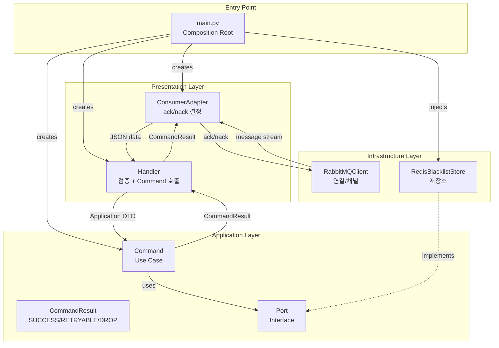
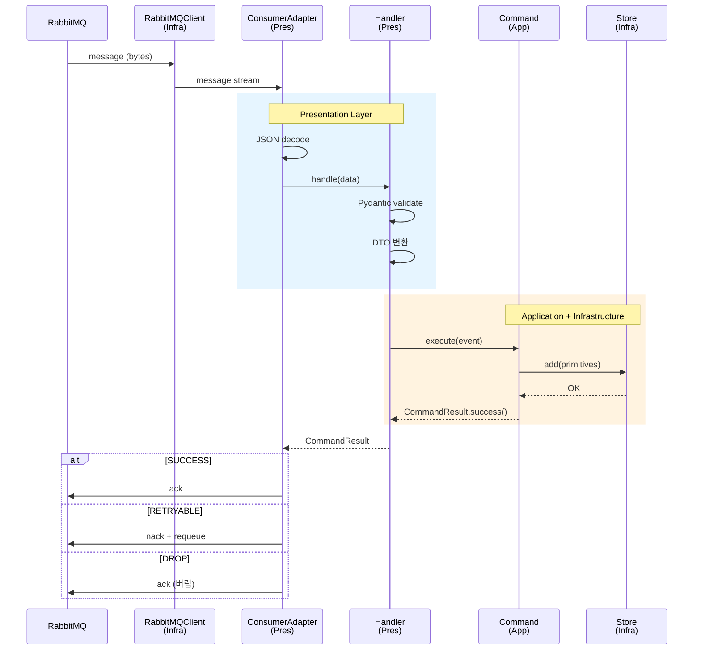

# Auth Worker Clean Architecture 적용기

> **작성일**: 2024-12-31  
> **태그**: `Clean Architecture`, `Message Queue`, `RabbitMQ`, `Worker`, `Hexagonal`

## 개요

웹 서버가 아닌 **메시지 컨슈머(Worker)**에도 Clean Architecture를 적용할 수 있을까요?

`auth-worker`는 블랙리스트와 로그인 감사 기록을 비동기로 영속화하는 워커입니다. HTTP가 아닌 AMQP 프로토콜을 사용하지만, **동일한 아키텍처 원칙**을 적용할 수 있습니다.

| 컴포넌트 | 역할 | 프로토콜 |
|---|---|---|
| **auth-worker** | 블랙리스트/감사 기록 영속화 | AMQP |

> **관련 포스팅**: `auth-api` Clean Architecture는 [이코에코(Eco²) Clean Architecture #2: Auth - 구현](/docs/blogs/clean-architecture/02-auth-implementation.md)을 참고하세요.

### 핵심 질문

1. **Presentation Layer가 뭘 하지?** — HTTP Controller 대신 뭐가 들어가나?
2. **ack/nack은 누가 결정하지?** — MQ semantics는 어느 계층의 책임인가?
3. **Infrastructure와 Application 경계는?** — RabbitMQ 연결은 어디에 두나?

### 설계 원칙

#### 1. Composition Root는 main.py

모든 의존성 조립은 `main.py`에서 수행합니다. DI Container를 통해 각 계층의 컴포넌트를 생성하고 연결합니다.

```
main.py (Composition Root)
    │
    ├── Infrastructure 생성
    │     ├── RabbitMQClient (MQ 연결)
    │     ├── RedisBlacklistStore (저장소)
    │     └── PostgresLoginAuditStore (저장소)
    │
    ├── Application 생성
    │     └── PersistBlacklistCommand (Use Case)
    │
    └── Presentation 생성
          ├── BlacklistHandler (메시지 → Command)
          └── ConsumerAdapter (디스패칭 + ack/nack)
```

**main.py의 책임**:
- DI 설정
- 연결 관리 (Redis, MQ, PostgreSQL)
- Consumer 시작/종료
- Graceful shutdown

**main.py의 비책임**:
- 메시지 파싱
- 업무 로직
- ack/nack 결정

#### 2. Presentation = Inbound Adapter

HTTP 서버에서 Controller가 하는 역할을 **Handler + ConsumerAdapter**가 수행합니다.

| HTTP API | Message Worker |
|----------|----------------|
| FastAPI Router | RabbitMQClient |
| Controller | Handler |
| Request DTO | Pydantic Schema |
| Response | ack/nack |

**Handler의 책임**

Handler는 **"메시지 → Command 호출"** 파이프라인입니다:

1. **메시지 검증** (Pydantic Schema)
2. **Application DTO 변환**
3. **Command 호출**
4. **CommandResult 전달**

Handler가 **하지 않는 것**:
- ack/nack 결정 (ConsumerAdapter에서)
- 업무 성공/실패 판단 (Command에서)
- 리트라이 정책 결정 (Command에서)

**ConsumerAdapter의 책임**

ConsumerAdapter는 **MQ semantics를 담당하는 프로토콜 어댑터**입니다:

1. **메시지 decode** (JSON)
2. **Handler 디스패칭**
3. **CommandResult 기반 ack/nack 결정**

```
RabbitMQClient (Infra)
        │
        │ message stream (bytes)
        ▼
ConsumerAdapter (Presentation)
        │
        │ JSON decoded data
        ▼
Handler (Presentation)
        │
        │ Application DTO
        ▼
Command (Application)
        │
        │ CommandResult
        ▼
ConsumerAdapter
        │
        └── ack / nack / requeue
```

#### 3. Application = Use Case + CommandResult

Application Layer의 Command는 **업무 성공/실패를 판단**하고 `CommandResult`로 반환합니다.

**CommandResult의 역할**

MQ의 ack/nack 정책을 **Application 계층의 언어로 추상화**합니다:

```python
class ResultStatus(Enum):
    SUCCESS    # 성공 → ack
    RETRYABLE  # 일시적 실패 → nack + requeue
    DROP       # 영구적 실패 → ack (메시지 버림)
```

**핵심 원칙**: Command가 "재시도 가능 여부"를 판단하고, ConsumerAdapter가 "어떻게 재시도할지"를 결정합니다.

| 판단 주체 | 역할 |
|-----------|------|
| **Command** (Application) | 일시적/영구적 실패 분류 |
| **ConsumerAdapter** (Presentation) | ack/nack/requeue 실행 |

**에러 분류 기준**

```python
# Application: Command에서 판단
try:
    await self._store.add(...)
    return CommandResult.success()

except (ConnectionError, TimeoutError) as e:
    # 일시적 실패 → 재시도 가능
    return CommandResult.retryable(str(e))

except ValueError as e:
    # 영구적 실패 → 재시도 무의미
    return CommandResult.drop(str(e))
```

#### 4. Infrastructure = 연결 + 저장소

Infrastructure Layer는 **외부 시스템과의 연결**을 담당합니다.

**RabbitMQClient vs ConsumerAdapter**

피드백에서 가장 중요했던 분리입니다:

| 컴포넌트 | 계층 | 책임 |
|----------|------|------|
| **RabbitMQClient** | Infrastructure | MQ 연결/채널/메시지 스트림 |
| **ConsumerAdapter** | Presentation | decode/dispatch/ack-nack |

**왜 분리하는가?**

- **테스트**: ConsumerAdapter는 RabbitMQClient 없이 테스트 가능
- **교체**: RabbitMQ → Kafka 전환 시 RabbitMQClient만 교체
- **책임 분리**: "연결"과 "디스패칭"은 다른 관심사

#### Port (Interface)

Application이 Infrastructure를 직접 의존하지 않도록 **Port(Interface)**를 정의합니다.

```python
# Application Layer에 위치
class BlacklistStore(Protocol):
    async def add(self, jti: str, expires_at: datetime, ...) -> None:
        ...
```

Infrastructure의 `RedisBlacklistStore`가 이 Port를 구현합니다.

**의존성 방향**:
```
Application ──────────▶ Port (Interface)
                           ▲
                           │ implements
Infrastructure ────────────┘
```

## 최종 아키텍처

### 계층별 구조

```
apps/auth_worker/
├── main.py                      # Composition Root
│
├── presentation/                # Inbound Adapter
│   └── amqp/
│       ├── consumer.py          # ConsumerAdapter (ack/nack)
│       ├── handlers/
│       │   ├── base.py          # 공통 파이프라인
│       │   └── blacklist.py     # Handler
│       └── schemas.py           # Pydantic (메시지 검증)
│
├── application/
│   ├── commands/
│   │   └── persist_blacklist.py # Use Case (CommandResult 반환)
│   └── common/
│       ├── result.py            # CommandResult
│       ├── dto/                 # Application DTO
│       └── ports/               # Port (Interface)
│
├── infrastructure/
│   ├── messaging/
│   │   └── rabbitmq_client.py   # MQ 연결 (메시지 스트림)
│   └── persistence_redis/
│       └── blacklist_store.py   # Port 구현체
│
└── setup/
    ├── config.py
    ├── dependencies.py          # DI Container
    └── logging.py
```

### 의존성 방향



### 메시지 처리 흐름



## 설계 결정과 트레이드오프

### 1. Handler vs ConsumerAdapter 분리

**결정**: Handler는 "메시지 → Command", ConsumerAdapter는 "ack/nack"

**이유**:
- Handler가 ack/nack까지 담당하면 **MQ semantics가 퍼짐**
- ConsumerAdapter에 **일관된 ack/nack 정책** 적용 가능
- 테스트 시 Handler만 따로 검증 가능

### 2. CommandResult 3-state

**결정**: SUCCESS / RETRYABLE / DROP

**이유**:
- MQ의 ack/nack과 **1:1 매핑되지 않음** (유연성)
- "DLQ", "지수 백오프" 등은 **나중에 확장 가능**
- 현재 단계에서는 **단순함 우선**

**확장 예시**:
```python
class ResultStatus(Enum):
    SUCCESS = auto()
    RETRY = auto()      # delay_ms 옵션 추가 가능
    DROP = auto()
    DLQ = auto()        # 명시적 DLQ 전송
```

### 3. Port의 파라미터 타입

**결정**: primitive 타입 사용 (UUID, str, datetime)

**이유**:
- Infrastructure가 **Application DTO를 import하지 않음**
- 의존성 방향 **엄격하게 유지**

**트레이드오프**:
- 파라미터가 많아질 수 있음
- Command에서 DTO → primitive 분해 필요

**완화 옵션** (필요 시):
- Application DTO를 Port에서 받되, Domain Entity는 아닌 경우 허용
- "실용적 Clean Architecture" 관점에서 유연하게 적용

## 테스트 전략

### 계층별 테스트

| 계층 | 테스트 방식 | 의존성 |
|------|-------------|--------|
| **Handler** | 유닛 테스트 | Mock Command |
| **Command** | 유닛 테스트 | Mock Store (Port) |
| **ConsumerAdapter** | 유닛 테스트 | Mock Handler |
| **통합** | 실제 MQ + Redis | Docker Compose |

### CommandResult 기반 테스트

```python
# Command 테스트
async def test_persist_blacklist_success():
    store = MockBlacklistStore()
    command = PersistBlacklistCommand(store)
    
    result = await command.execute(event)
    
    assert result.is_success
    assert store.add_called

async def test_persist_blacklist_retryable_on_connection_error():
    store = MockBlacklistStore(raise_error=ConnectionError())
    command = PersistBlacklistCommand(store)
    
    result = await command.execute(event)
    
    assert result.is_retryable
```

## 교훈

### 잘 된 점

1. **Composition Root**: DI 흐름이 명확하고 테스트 용이
2. **CommandResult**: MQ semantics를 Application 언어로 추상화
3. **RabbitMQClient 분리**: 연결과 디스패칭 관심사 분리
4. **Port primitive**: 의존성 방향 엄격하게 유지

### 주의할 점

1. **Handler 비대화**: 리트라이 분류는 Application에 두기
2. **CommandResult 과설계**: 현재 필요한 만큼만, 확장은 나중에
3. **primitive only 과잉**: 지나치면 중복 변환만 늘어남

## 결론

메시지 컨슈머도 Clean Architecture로 정리할 수 있습니다.

핵심은 **"프로토콜(MQ) 관심사"와 "업무 관심사"를 분리**하는 것입니다:

- **Presentation**: 메시지 decode, 검증, ack/nack
- **Application**: 업무 로직, 성공/실패 판단
- **Infrastructure**: 연결, 저장소

`CommandResult`는 이 두 관심사를 연결하는 **계약(Contract)**입니다. Application이 "일시적/영구적 실패"를 판단하고, Presentation이 "어떻게 처리할지"를 결정합니다.

이 패턴은 RabbitMQ뿐 아니라 **Kafka, Redis Streams, SQS** 등 다양한 메시지 브로커에 적용할 수 있습니다.

## 참고 자료

- [Clean Architecture by Robert C. Martin](https://blog.cleancoder.com/uncle-bob/2012/08/13/the-clean-architecture.html)
- [Hexagonal Architecture](https://alistair.cockburn.us/hexagonal-architecture/)
- [RabbitMQ Best Practices](https://www.rabbitmq.com/production-checklist.html)
- [Ports and Adapters Pattern](https://herbertograca.com/2017/09/14/ports-adapters-architecture/)


- [RabbitMQ Best Practices](https://www.rabbitmq.com/production-checklist.html)
- [Ports and Adapters Pattern](https://herbertograca.com/2017/09/14/ports-adapters-architecture/)

