# 이코에코(Eco²) Observability #0: 로깅 파이프라인 아키텍처 설계

> **시리즈**: Eco² Observability Enhancement  
> **작성일**: 2025-12-17  
> **태그**: `#Kubernetes` `#Observability` `#EFK` `#Logging` `#Architecture`

---

## 📋 개요

마이크로서비스 아키텍처에서 로깅은 단순한 디버깅 도구를 넘어 **시스템 투명성**을 확보하는 핵심 인프라입니다. 이 글에서는 15개 노드, 7개 API 서비스로 구성된 Eco² 백엔드의 로깅 파이프라인 아키텍처 설계 과정을 공유합니다.

### Eco² Observability 스택 전체 구성

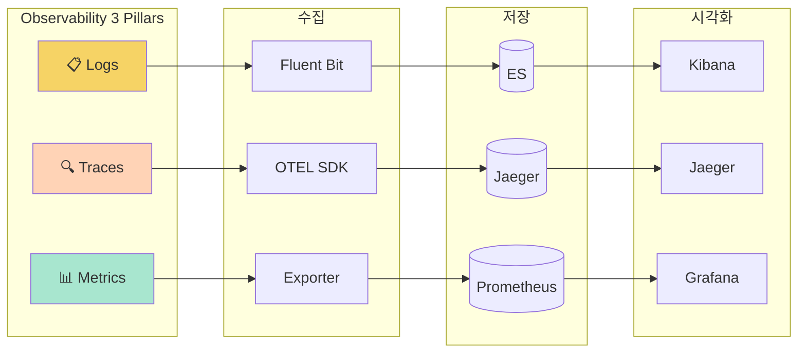

---

### Observability 3 Pillars 상세

#### 📋 1. 로깅 (Logs) - 분산 로그 중앙화

마이크로서비스 환경에선 로그가 각 노드에 흩어져 있어서, 장애 발생하면 여러 서버 돌아다니며 로그 찾아야 해. 이걸 해결하려고 **EFK 스택**으로 중앙화했어.

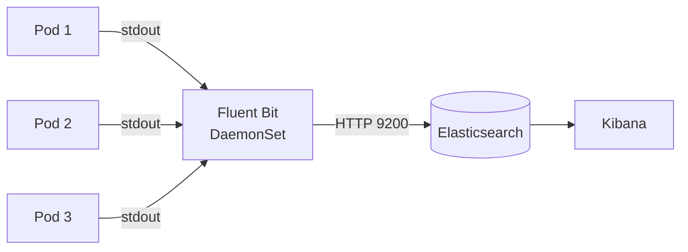

| 컴포넌트 | 역할 | 특징 |
|----------|------|------|
| **Fluent Bit** | 로그 수집 에이전트 | 각 노드에 DaemonSet으로 배포, ~5MB 초경량 |
| **Elasticsearch** | 로그 저장/인덱싱 | 전문 검색, ECS 스키마 기반 |
| **Kibana** | 시각화/대시보드 | KQL로 로그 검색, Lens 시각화 |

> 📌 **핵심**: Fluent Bit이 각 노드의 `/var/log/containers/*.log` 파일을 tail해서 ES로 전송함. 앱은 그냥 stdout으로 JSON 찍기만 하면 돼.

---

#### 🔍 2. 트레이싱 (Traces) - 분산 트레이스 중앙화

하나의 API 요청이 여러 서비스를 거칠 때, 어디서 병목이 생기는지 추적하려면 **분산 트레이싱**이 필수야. Istio Service Mesh의 **Envoy Sidecar**가 자동으로 트레이스 정보를 수집해.

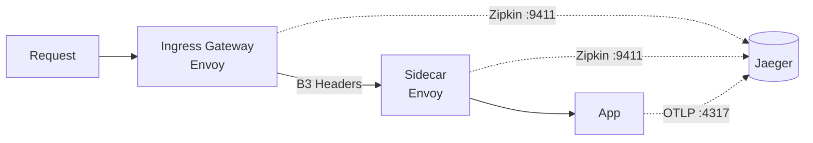

| 컴포넌트 | 역할 | 특징 |
|----------|------|------|
| **Envoy Sidecar** | 트레이스 자동 수집 | Istio가 모든 Pod에 주입, Zipkin 프로토콜 |
| **OTEL SDK** | 앱 내부 트레이스 | FastAPI 자동 계측, B3 propagator |
| **Jaeger** | 트레이스 저장/시각화 | Service Map, Dependencies 그래프 |

> 📌 **핵심**: Envoy가 **B3 헤더**(`x-b3-traceid`)로 trace context를 전파해. 앱의 OTEL SDK도 같은 traceID를 공유해서 E2E 추적이 가능함.

**트레이스 연결 구조:**
```
istio-ingressgateway (Span 1)
└── auth-api.auth (Sidecar Span 2)
    └── auth-api (App OTEL Span 3)
        └── asyncpg: SELECT... (DB Span 4)
```

---

#### 📊 3. 메트릭 (Metrics) - Prometheus Pull 모델

메트릭은 **Prometheus**가 각 서비스의 `/metrics` 엔드포인트를 **Pull 방식**으로 수집해. HTTP 1.1 기반이라 Service Mesh와 궁합이 좋아.

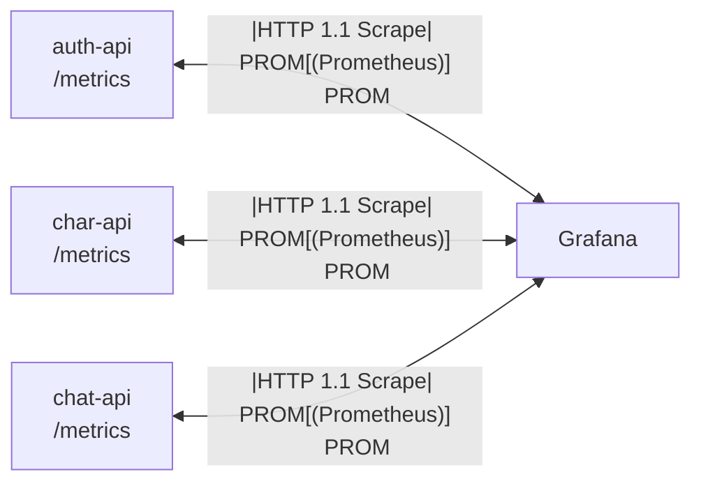

| 컴포넌트 | 역할 | 특징 |
|----------|------|------|
| **Prometheus Exporter** | 메트릭 노출 | `/metrics` 엔드포인트, HTTP 1.1 |
| **Prometheus** | 메트릭 수집/저장 | Pull 모델, PromQL, TSDB |
| **Grafana** | 시각화/알림 | 대시보드, 알림 룰 |

> 📌 **Pull vs Push**: Prometheus는 **Pull 모델**이라 서비스가 죽으면 "scrape 실패" 자체가 알림이 돼. Push 모델은 서비스가 죽으면 데이터가 안 오니까 구분이 어려워.

**ServiceMonitor로 자동 발견:**
```yaml
apiVersion: monitoring.coreos.com/v1
kind: ServiceMonitor
metadata:
  name: api-services
spec:
  selector:
    matchLabels:
      tier: business-logic
  endpoints:
  - port: http
    path: /metrics
```

---

### 3 Pillars 통합: trace_id로 연결

로그, 트레이스, 메트릭이 각각 따로 놀면 의미가 반감돼. **trace_id**를 공유해서 세 가지를 연결할 수 있어.

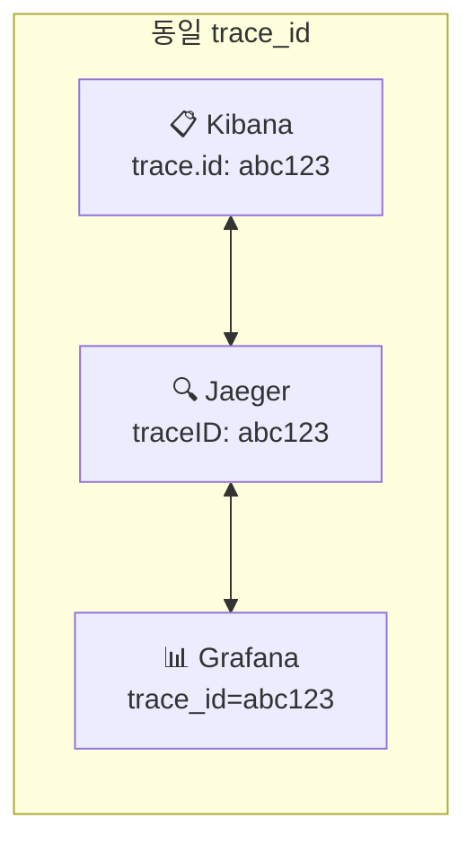

| 연결 | 방법 | 용도 |
|------|------|------|
| **로그 → 트레이스** | Kibana에서 `trace.id` 클릭 → Jaeger 이동 | 에러 로그의 전체 호출 흐름 확인 |
| **트레이스 → 로그** | Jaeger span에서 로그 링크 | 특정 span의 상세 로그 확인 |
| **메트릭 → 트레이스** | Grafana Exemplar | 느린 요청의 샘플 트레이스 확인 |

---

### 배경

- **현재 상태**: 각 Pod의 stdout/stderr 로그가 노드에 분산 저장
- **문제점**: 장애 발생 시 여러 노드를 직접 접속해 로그 확인 필요
- **목표**: 중앙 집중화된 로그 수집, 저장, 검색, 시각화 환경 구축

### 본 문서의 범위

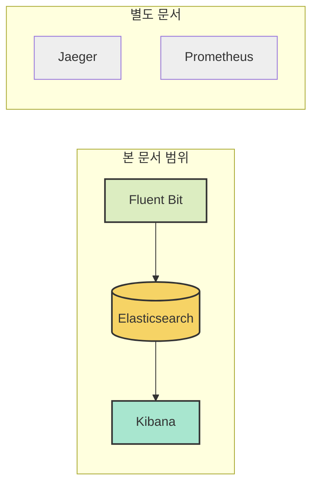

---

## 🎯 요구사항 분석

### 기능 요구사항

| 요구사항 | 설명 | 우선순위 |
|----------|------|----------|
| 중앙 집중화 | 모든 노드의 로그를 한 곳에서 조회 | P0 |
| 실시간 수집 | 로그 발생 후 5초 이내 검색 가능 | P0 |
| 구조화된 로깅 | JSON 포맷으로 필드별 검색 | P1 |
| 트레이스 연동 | trace_id로 분산 트레이싱과 연결 | P1 |
| 대시보드 | 에러율, 응답시간 등 시각화 | P2 |

### 비기능 요구사항

| 항목 | 목표 | 비고 |
|------|------|------|
| 가용성 | 99% | 로깅 장애가 서비스에 영향 없어야 함 |
| 지연 시간 | < 5초 | 로그 발생 → 검색 가능 |
| 저장 용량 | 50GB (7일) | 개발 환경 기준 |
| 리소스 격리 | 전용 노드 | API 서비스와 분리 |

---

## 🔍 기술 스택 비교

### 로깅 스택: EFK vs PLG (Loki)

[EDA 전환 로드맵](https://rooftopsnow.tistory.com/27)에서 언급했듯이, Observability 강화는 EDA 전환의 **선행 조건**입니다. 향후 Kafka + Logstash로 확장해야 하는 상황에서 **어떤 로깅 스택을 선택할 것인가**가 핵심 의사결정이었습니다.

| 항목 | EFK (Elasticsearch) | PLG (Loki) |
|------|---------------------|------------|
| **쿼리 방식** | 전문 검색 (Full-text) | 라벨 기반 (LogQL) |
| **인덱싱** | 모든 필드 인덱싱 | 라벨만 인덱싱 |
| **메모리** | 높음 (4GB+) | 낮음 (~1GB) |
| **복잡한 쿼리** | ✅ 우수 | ⚠️ 제한적 |
| **Logstash 통합** | ✅ 네이티브 | ❌ 별도 구성 필요 |
| **Kafka 연동** | ✅ Logstash Input | ⚠️ Promtail 제한적 |
| **에코시스템** | Kibana, APM, SIEM | Grafana |

#### 🎯 EFK 선택 이유: EDA 전환 효율성

**1. Logstash CRD 통합 (ECK Operator)**

EDA 도입 시 Kafka를 통한 로그 버퍼링과 복잡한 로그 변환(Saga trace_id 상관관계, CDC 이벤트 파싱)이 필요합니다. ECK Operator를 사용하면:

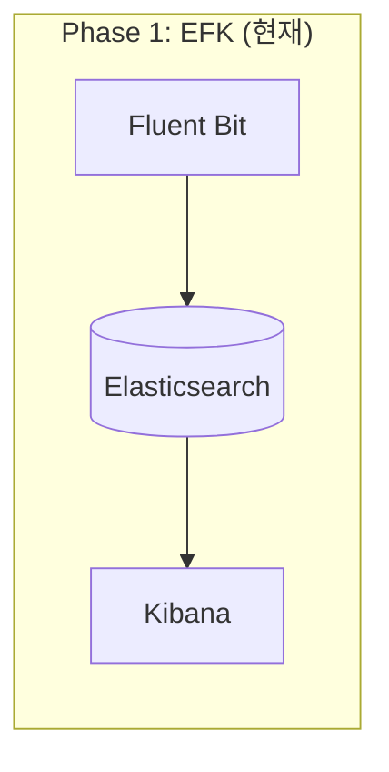

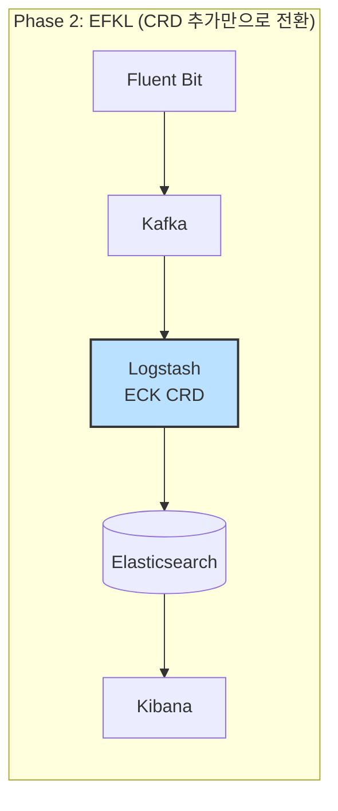

- Logstash CRD 추가 시 ES 연결 **자동 설정**
- TLS/인증 **자동 구성**
- **무중단 전환** 가능 (Fluent Bit output만 변경)

**2. PLG 선택 시 전환 비용**

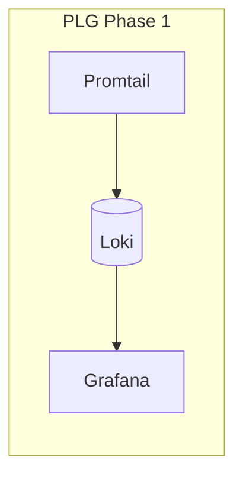

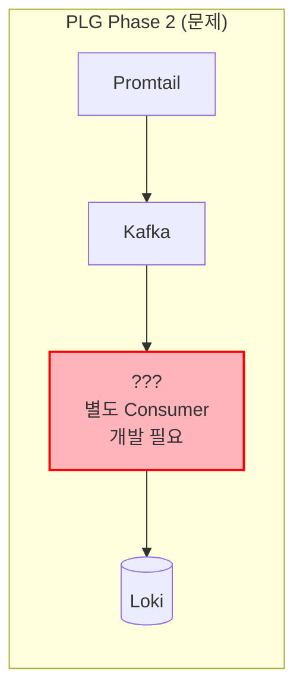

⚠️ **PLG 문제점**: Logstash 대안이 없어 **별도 Consumer 개발** 또는 **ES로 마이그레이션** 필요

**3. 로그량 증가 대응**

[EDA 로드맵](https://rooftopsnow.tistory.com/27)에서 분석한 대로, EDA 도입 후 로그량이 **5~10배 증가**합니다:

```
현재: 1 API 요청 → 1~3개 로그
EDA 후: 1 API 요청 → 10~30개 로그/이벤트
- Kafka Producer/Consumer 로그
- Saga 체인 로그 (시작/완료/실패)
- CDC 이벤트 로그 (Debezium)
- Celery 작업 로그
- 재시도/DLQ 로그
```

Elasticsearch의 전문 검색은 이러한 복잡한 분산 트랜잭션 로그에서 **trace_id 기반 검색**에 필수적입니다.

---

### ELK vs EFK: Logstash 도입 반려

[EDA 전환 백서](https://rooftopsnow.tistory.com/27)에서 분석한 대로, 향후 EDA 전환 시 로그 파이프라인에 **Logstash**가 필요합니다. 그러나 **현재 Phase 1**에서는 ELK가 아닌 **EFK**를 선택했습니다.

#### ELK vs EFK 비교

| 항목 | ELK (Logstash) | EFK (Fluent Bit) |
|------|----------------|------------------|
| **메모리** | 1~4GB | ~5MB/노드 |
| **배포 방식** | 중앙 집중 | DaemonSet (노드별) |
| **Pod 친화성** | ❌ 낮음 | ✅ 높음 |
| **로그 변환** | ✅ 강력함 (Grok, Ruby) | ⚠️ 기본 (Regex, Lua) |
| **Kafka 연동** | ✅ 네이티브 Input | ⚠️ Output만 지원 |
| **현재 필요성** | 낮음 (동기식 로그) | 높음 (수집 특화) |

#### 🚫 Logstash 반려 이유: 현재 용도에 비해 과도한 리소스

**1. 현재 동기식 로그만 발생**

현재 Eco² 백엔드는 순수 동기식 아키텍처입니다:

```
현재: Client → API → DB → Response
      └── 로그: 요청/응답/에러 (단순)
```

이 단계에서 Logstash의 강력한 변환 기능(Grok 파싱, Ruby 필터, 다중 파이프라인)은 **용도에 비해 과도합니다**.

**2. 리소스 효율성 계산**

```
# ELK (Logstash 포함)
Elasticsearch: 5GB + Kibana: 1GB + Logstash: 1GB = 7GB
└── 8GB 노드에서 시스템 여유 1GB (위험)

# EFK (Fluent Bit)
Elasticsearch: 5GB + Kibana: 1GB + Fluent Bit: ~50MB(전체) = 6GB
└── 8GB 노드에서 시스템 여유 2GB (안정)
```

**3. Logstash 없이 가능한 현재 워크로드**

| 기능 | Logstash | Fluent Bit | 현재 필요 |
|------|----------|------------|----------|
| 로그 수집 (tail) | ❌ | ✅ | ✅ |
| JSON 파싱 | ✅ | ✅ | ✅ |
| K8s 메타데이터 | ⚠️ 플러그인 | ✅ 네이티브 | ✅ |
| Grok 패턴 파싱 | ✅ | ⚠️ Regex | ❌ (JSON 출력) |
| Kafka Consumer | ✅ | ❌ | ❌ (현재 MQ 없음) |
| 복잡한 라우팅 | ✅ | ⚠️ 제한적 | ❌ |

---

### 로그 수집기: Fluent Bit 선택 근거

#### Pod 친화적 DaemonSet 아키텍처

**ELK: 중앙 집중형 (네트워크 병목)**

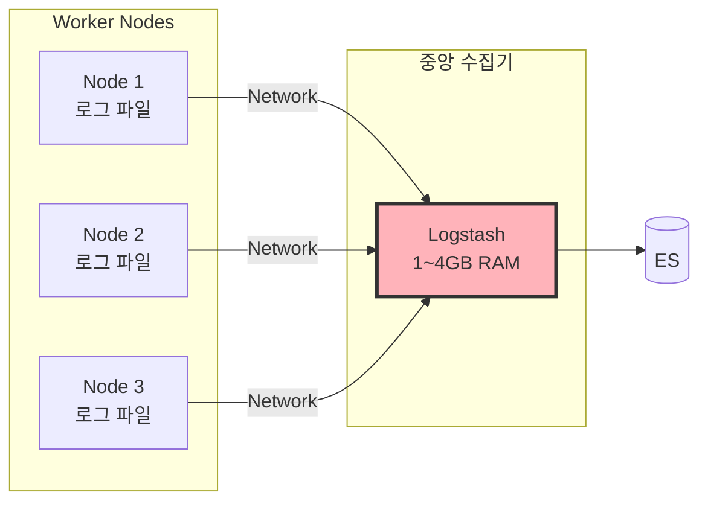

⚠️ **문제점**: 모든 로그가 단일 Logstash로 집중 → 네트워크 병목

---

**EFK: 분산 수집형 (노드별 처리)**

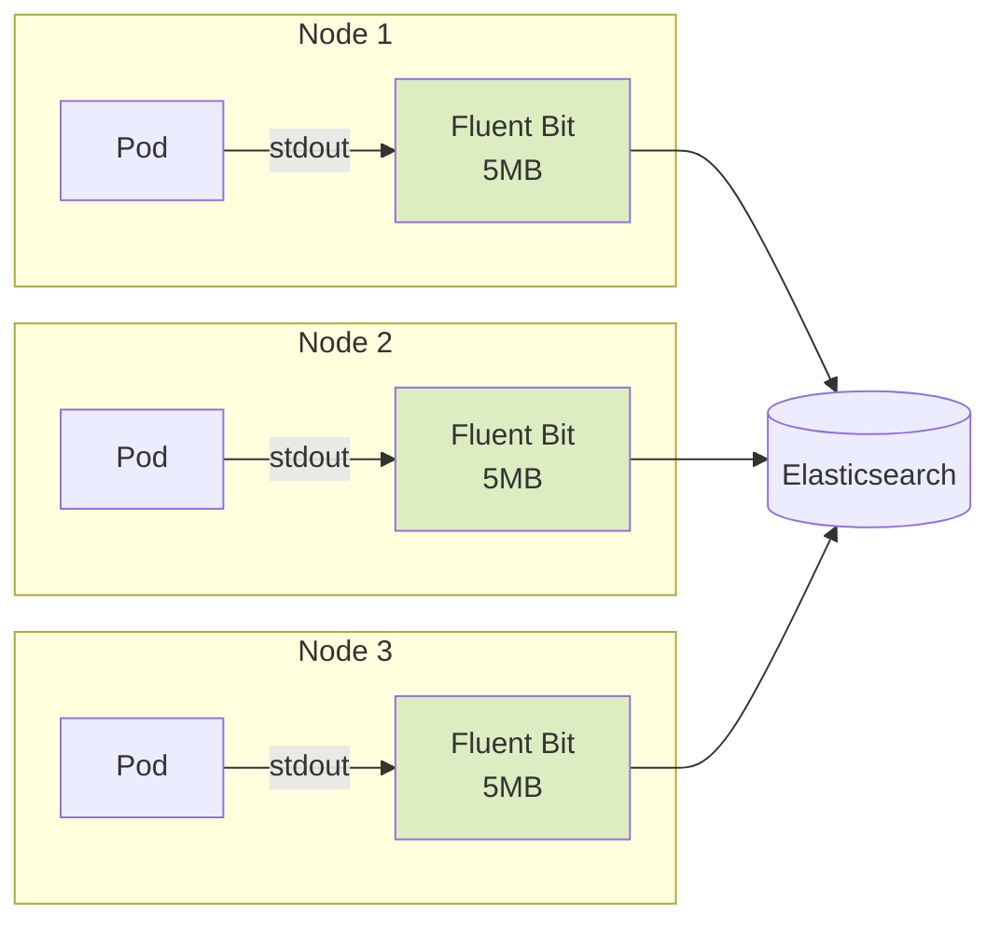

✅ **장점**:
- 각 노드에서 **로컬 파일 직접 tail** (네트워크 비용 최소화)
- **병렬 처리**로 네트워크 병목 분산
- 노드 장애 시 **해당 노드 로그만 영향** (Blast Radius 최소화)

#### 수집기 비교표

| 항목 | Fluent Bit | Fluentd | Logstash |
|------|------------|---------|----------|
| 언어 | C | Ruby | JRuby |
| 메모리 | **~5MB**/노드 | ~40MB/노드 | **~1-4GB** |
| CPU | 매우 낮음 | 낮음 | 중간 |
| 플러그인 | 기본 제공 | 풍부함 | 풍부함 |
| Kubernetes | **DaemonSet 최적화** | 가능 | 비권장 |
| 역할 | 수집/전달 특화 | 수집/변환 | **변환/라우팅 특화** |

**선택: Fluent Bit** - 경량 수집 에이전트로 리소스 절약, Pod 친화성 확보

---

### 향후 확장: EFK → EFKL 전환 계획

> **핵심**: 현재 EFK를 선택한 것은 Logstash를 **영구 배제**한 것이 아닙니다. [EDA 전환 백서](https://rooftopsnow.tistory.com/27)에서 예측한 대로, MQ 도입 시 로그가 **5~10배 폭증**하면 Logstash가 필수가 됩니다.

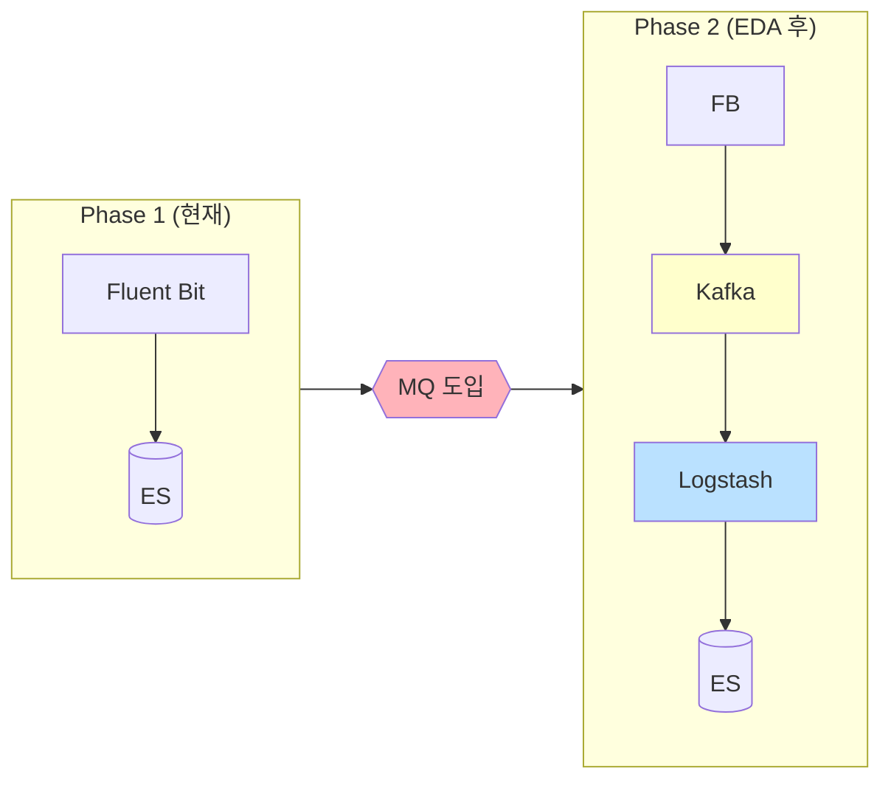

**Phase 2에서 Logstash 변환이 필요한 사례:**

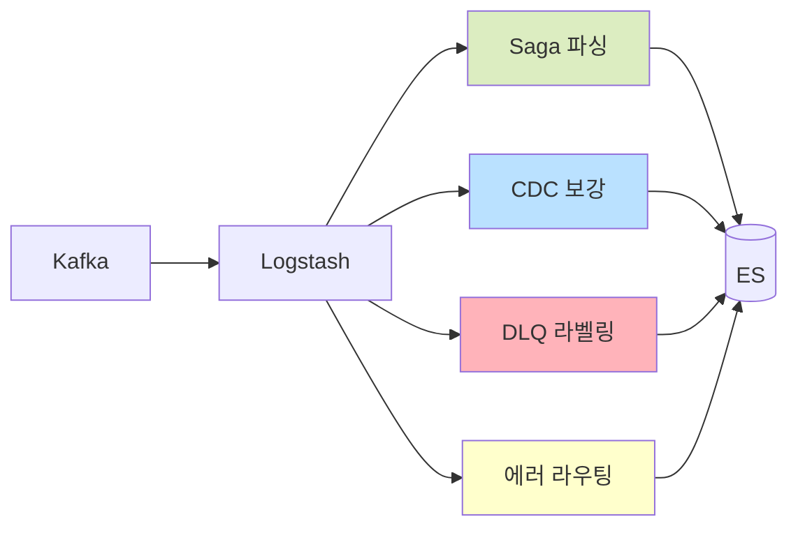

ECK Operator 기반으로 구축했기 때문에, **Logstash CRD 추가만으로 전환 가능**합니다.

> **Phase 2 전환 시**: Fluent Bit은 수집기로 유지하고, Logstash는 중앙 파이프라인으로 추가합니다. Fluent Bit의 output만 Kafka로 변경하면 되므로 **설정 재사용**이 가능합니다.

### 저장소: Elasticsearch vs Loki vs ClickHouse

| 항목 | Elasticsearch | Loki | ClickHouse |
|------|---------------|------|------------|
| 쿼리 방식 | 전문 검색 | 라벨 기반 | SQL |
| 인덱싱 | 전체 텍스트 | 라벨만 | 컬럼 |
| 메모리 | 높음 (4GB+) | 낮음 | 중간 |
| 에코시스템 | Kibana, APM | Grafana | Grafana |
| 복잡한 쿼리 | ✅ 우수 | ⚠️ 제한적 | ✅ 우수 |

**선택: Elasticsearch** - 전문 검색, Kibana 시각화, APM 확장성

### 배포 방식: Helm vs ECK Operator

| 항목 | Helm Chart | ECK Operator |
|------|------------|--------------|
| 관리 복잡도 | 수동 | 자동화 |
| TLS/인증 | 수동 설정 | 자동 생성 |
| 업그레이드 | 수동 | Rolling Update |
| Logstash 통합 | 별도 설정 | CRD로 통합 |
| 리소스 오버헤드 | 없음 | ~200MB |

**선택: ECK Operator** - 운영 자동화, 향후 Logstash 확장 용이

---

## 📐 아키텍처 설계

### 전체 로깅 파이프라인 아키텍처

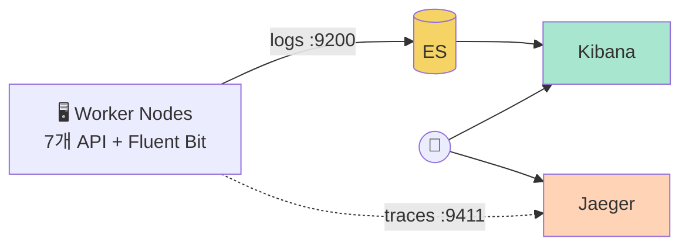

> 📌 **상세 구현**: [#1: 로깅 파이프라인 구축](./01-efk-stack-setup.md) 참조

---

### 로그 데이터 파이프라인

로그가 앱에서 생성되어 Kibana에서 조회되기까지의 **5단계 흐름**입니다.

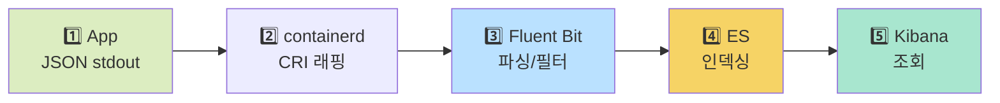

| 단계 | 컴포넌트 | 역할 | 상세 문서 |
|:----:|----------|------|:--------:|
| 1️⃣ | **FastAPI App** | ECS JSON 로그 출력 (`stdout`) | [#3](./03-ecs-structured-logging.md) |
| 2️⃣ | **containerd** | CRI 포맷으로 래핑 (`timestamp stream flag log`) | - |
| 3️⃣ | **Fluent Bit** | CRI 파싱 → K8s 메타 추가 → 노이즈 필터 | [#1](./01-efk-stack-setup.md) |
| 4️⃣ | **Elasticsearch** | `logs-YYYY.MM.DD` 인덱스 저장 | [#7](./07-index-lifecycle.md) |
| 5️⃣ | **Kibana** | DataView `logs-*`로 검색/시각화 | [#5](./05-kibana-dashboard.md) |

---

### Fluent Bit 필터 체인

3️⃣ 단계에서 Fluent Bit이 수행하는 필터 체인 상세입니다.

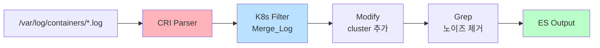

| 필터 | 기능 | 설정 |
|------|------|------|
| **CRI Parser** | `timestamp stream flag log` 분리 | `Parser cri` |
| **K8s Filter** | JSON 파싱 + Pod 메타데이터 추가 | `Merge_Log On` |
| **Modify** | 클러스터/환경 정보 추가 | `Add cluster eco2-dev` |
| **Grep** | health/ready 로그 제외 | `Exclude log /health\|ready/` |

> 📌 **트러블슈팅**: CRI Parser 미적용 시 로그 파싱 실패 → [Fluent Bit CRI Parser 오류](https://rooftopsnow.tistory.com/28)

---

### 최종 ES 문서 구조

Elasticsearch에 저장되는 문서의 필드 구조입니다.

| 필드 그룹 | 필드 예시 | 출처 |
|----------|----------|------|
| **시간** | `@timestamp` | CRI Parser |
| **스트림** | `stream`, `logtag` | CRI Parser |
| **로그 원본** | `log` | 원본 JSON 문자열 |
| **파싱된 로그** | `log_processed.message`, `log_processed.log_level` | Merge_Log |
| **K8s 메타** | `k8s_namespace_name`, `k8s_pod_name`, `k8s_labels.*` | K8s Filter |
| **클러스터** | `cluster`, `environment` | Modify Filter |

### 클러스터 노드 토폴로지

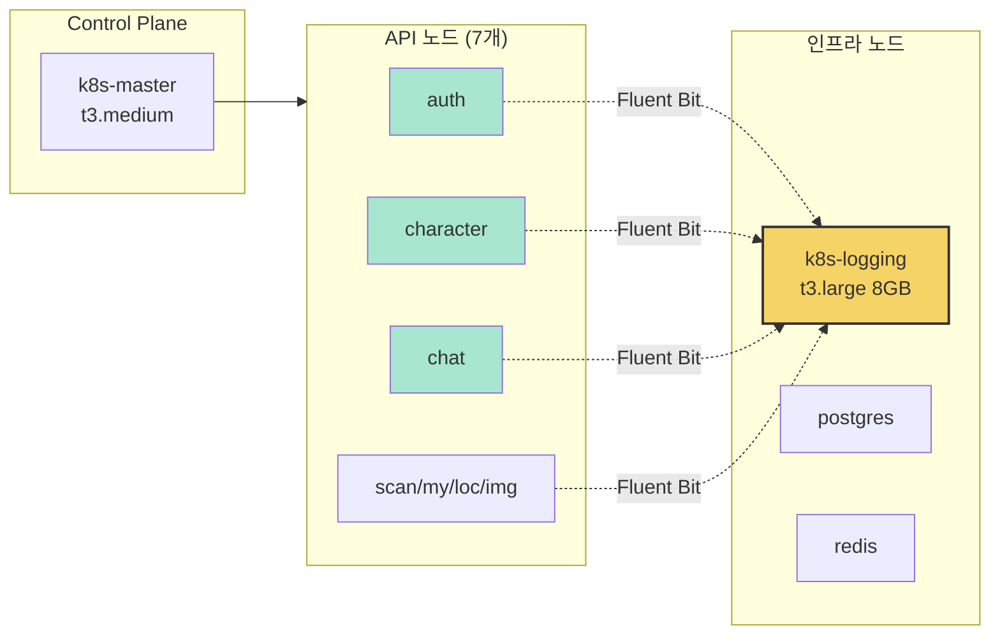

**노드 구성 요약:**

| 노드 유형 | 개수 | 인스턴스 | 역할 |
|----------|:----:|----------|------|
| Control Plane | 1 | t3.medium | API Server, etcd |
| API 서비스 | 7 | t3.small | auth, character, chat, scan, my, location, image |
| Logging | 1 | **t3.large** | Elasticsearch, Kibana |
| Database | 2 | t3.medium/small | PostgreSQL, Redis |

### 노드 격리 전략

로깅 시스템은 메모리/디스크 I/O 집약적이므로 API 서비스와 물리적으로 격리합니다.

```yaml
# 로깅 노드 구성
Node: k8s-logging
├── Label: workload=logging
├── Taint: domain=observability:NoSchedule
├── Instance: t3.large (2 vCPU, 8GB RAM)
└── Storage: 100GB gp3
```

### 리소스 배분 상세

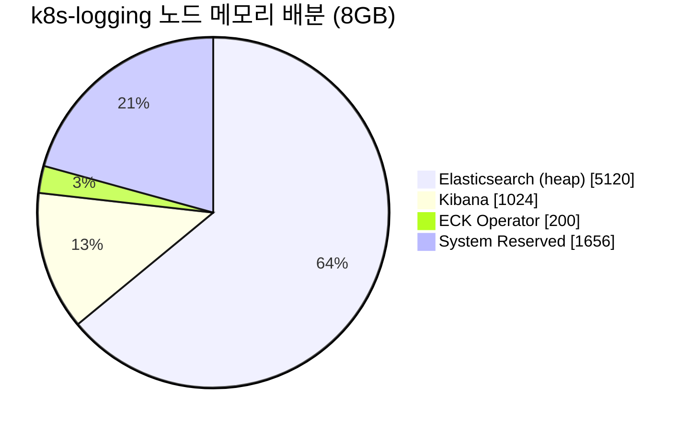

| 컴포넌트 | 메모리 | CPU | 역할 |
|----------|--------|-----|------|
| **Elasticsearch** | 5GB (heap) | 1 core | 로그 저장/검색 |
| **Kibana** | 1GB | 0.5 core | 시각화/대시보드 |
| **ECK Operator** | 200MB | 0.1 core | ES/Kibana 관리 |
| **System** | 1.8GB | 0.4 core | OS/kubelet |

### Fluent Bit 리소스 (노드당)

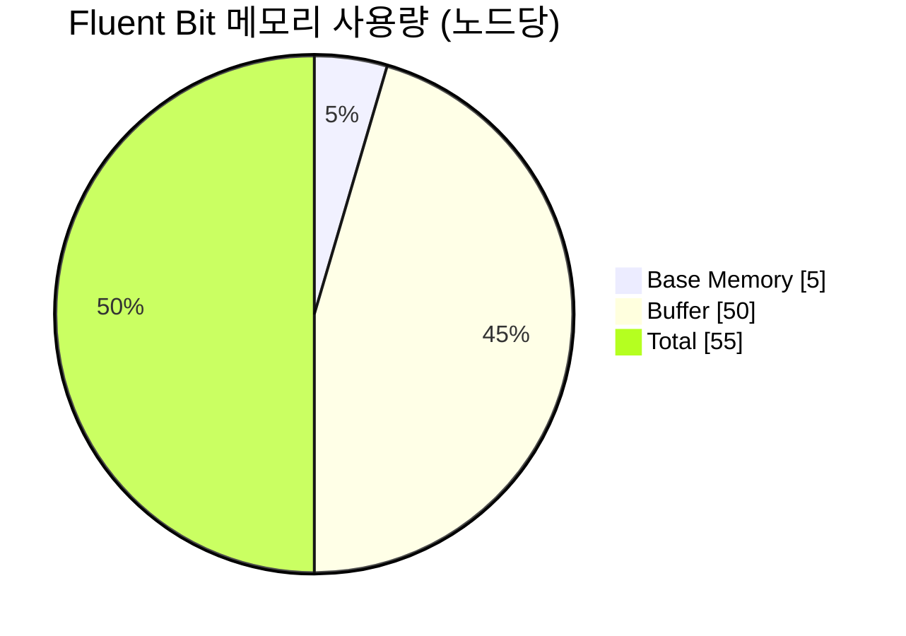

| 항목 | 값 | 비고 |
|------|-----|------|
| 기본 메모리 | ~5MB | C 언어 경량 구현 |
| 버퍼 | 50MB | `Mem_Buf_Limit` 설정 |
| **총계** | ~55MB | 15개 노드 = 825MB |

---

## 🔄 점진적 확장 계획

[EDA 전환 로드맵](https://rooftopsnow.tistory.com/27)의 1단계(Observability 강화)를 구현하는 과정입니다.

### Phase 1 vs Phase 2 아키텍처 비교

```mermaid
flowchart LR
    subgraph P1["Phase 1: EFK (현재)"]
        FB1[Fluent Bit] --> ES1[(ES)] --> KB1[Kibana]
    end

    subgraph P2["Phase 2: EFKL (EDA 후)"]
        FB2[FB] --> KF[Kafka] --> LS[Logstash] --> ES2[(ES)] --> KB2[Kibana]
    end
    
    style FB1 fill:#dcedc1
    style ES1 fill:#f6d365
    style KB1 fill:#a8e6cf
    style KF fill:#ffb3ba
    style LS fill:#bae1ff
    style ES2 fill:#f6d365
```

### Phase 1 (현재): EFK 직접 연결

```mermaid
flowchart LR
    subgraph "각 Worker Node"
        POD[API Pod] -->|stdout| FB[Fluent Bit<br/>5MB]
    end
    
    FB -->|"HTTP 9200<br/>Logstash_Format On"| ES[(Elasticsearch<br/>logs-YYYY.MM.DD)]
    ES --> KB[Kibana<br/>DataView: logs-*]

    style FB fill:#dcedc1
    style ES fill:#f6d365
    style KB fill:#a8e6cf
```

**현재 구성의 장점:**
- ✅ 단순한 구조 (컴포넌트 3개)
- ✅ 빠른 구축 (1일)
- ✅ 리소스 효율적 (Fluent Bit ~5MB/노드)
- ✅ 개발 환경 적합

### Phase 2 (EDA 도입 시): EFKL + Kafka 버퍼

```mermaid
flowchart LR
    FB[Fluent Bit] --> KAFKA[Kafka] --> LS[Logstash]
    
    LS --> PARSE[Saga]
    LS --> ENRICH[CDC]
    LS --> ROUTE[라우팅]
    
    PARSE & ENRICH & ROUTE --> ES[(ES)] --> KB[Kibana]

    style KAFKA fill:#ffb3ba
    style LS fill:#bae1ff
```

**Phase 2에서 Logstash가 필요한 이유:**

| 변환 작업 | 설명 | Fluent Bit | Logstash |
|----------|------|:----------:|:--------:|
| Saga 체인 파싱 | `saga_id` 추출 및 상관관계 | ❌ | ✅ Grok |
| CDC 이벤트 보강 | Debezium 메타데이터 추가 | ⚠️ 제한적 | ✅ Ruby |
| 조건부 라우팅 | 에러→별도 인덱스 | ⚠️ 기본 | ✅ 강력함 |
| DLQ 라벨링 | 재시도 횟수 태깅 | ❌ | ✅ |

### Phase 1 → Phase 2 전환 작업

```mermaid
gantt
    title EFK → EFKL 전환 타임라인
    dateFormat  HH:mm
    axisFormat %H:%M
    
    section 인프라
    Kafka 배포 (별도 노드)     :kafka, 00:00, 30m
    
    section ECK
    Logstash CRD 추가         :ls, after kafka, 15m
    ES 메모리 조정 (5GB→3GB)  :es, after ls, 15m
    
    section Fluent Bit
    Output 변경 (ES→Kafka)    :fb, after es, 15m
    
    section 검증
    E2E 테스트               :test, after fb, 15m
```

| 작업 | 예상 시간 | 다운타임 | ECK 자동화 |
|------|:--------:|:--------:|:----------:|
| Kafka 배포 (별도 노드) | 30분 | 없음 | - |
| Logstash CRD 추가 | 15분 | 없음 | ✅ ES 연결 자동 |
| ES 메모리 조정 (5GB → 3GB) | 15분 | Rolling | ✅ |
| Fluent Bit output 변경 | 15분 | 없음 | - |
| **총계** | **~1.5시간** | **~5분** | |

> StatefulSet 직접 관리 대비 **30분 단축**, Logstash-ES 연결 설정 자동화

### 로그량 예측

```mermaid
xychart-beta
    title "EDA 도입 전후 일일 로그량 예측"
    x-axis ["현재 (동기)", "EDA 후"]
    y-axis "일일 로그 수" 0 --> 350000
    bar [30000, 300000]
```

| 시점 | 일일 요청 | 일일 로그 | 증가율 | 피크 TPS |
|------|:--------:|:--------:|:------:|:--------:|
| 현재 (동기) | 10,000 | 30,000 | - | ~5 |
| EDA 도입 후 | 10,000 | **300,000** | **10x** | ~50 |

**로그 폭증 원인:**

```mermaid
flowchart LR
    REQ[1 API 요청]
    
    subgraph SYNC["현재 (동기) = 3개"]
        L1[요청] & L2[응답] & L3[에러?]
    end
    
    subgraph ASYNC["EDA 후 (비동기) = 10+개"]
        E1[Producer] --> E2[Consumer] --> E3[Saga] --> E4[Step1] --> E5[Step2] --> E6[CDC] --> E7[DLQ?]
    end

    REQ --> SYNC
    REQ --> ASYNC
    
    style L1 fill:#dcedc1
    style L2 fill:#dcedc1
    style E1 fill:#ffb3ba
    style E3 fill:#bae1ff
    style E6 fill:#ffffcc
```

---

## 📁 디렉토리 구조

```
backend/
├── workloads/
│   └── logging/
│       ├── base/
│       │   ├── kustomization.yaml
│       │   ├── elasticsearch.yaml    # ECK ES CR
│       │   ├── kibana.yaml           # ECK Kibana CR
│       │   ├── fluent-bit.yaml       # DaemonSet
│       │   └── network-policy.yaml   # 네트워크 격리
│       └── dev/
│           └── kustomization.yaml
├── clusters/
│   └── dev/
│       └── apps/
│           ├── 62-eck-operator.yaml  # ECK Operator
│           └── 63-efk-stack.yaml     # EFK 스택
└── docs/
    └── decisions/
        └── ADR-001-logging-architecture.md
```

---

## 🎓 핵심 설계 결정 (ADR)

### ADR-001: ECK Operator 사용

**결정**: StatefulSet 직접 관리 대신 ECK Operator 사용

**이유**:
1. Elasticsearch ↔ Kibana ↔ Logstash 간 인증/TLS 자동 구성
2. Rolling Upgrade 자동화
3. Phase 2에서 Logstash CRD 추가만으로 확장 가능

**트레이드오프**:
- Operator Pod 추가 리소스 (~200MB)
- ECK 버전 종속성

---

## 📚 다음 글 미리보기

**[#1: 로깅 파이프라인 구축]** - ECK Operator 설치, Elasticsearch/Kibana CR 작성, Fluent Bit DaemonSet 배포 과정을 다룹니다.

---

## 🔗 참고 자료

- [이코에코(Eco²) EDA 전환 로드맵](https://rooftopsnow.tistory.com/27) - 본 로깅 시스템 구축의 배경
- [Elastic Cloud on Kubernetes (ECK)](https://www.elastic.co/guide/en/cloud-on-k8s/current/index.html)
- [Fluent Bit Documentation](https://docs.fluentbit.io/)
- [Kubernetes Logging Architecture](https://kubernetes.io/docs/concepts/cluster-administration/logging/)
- [Grafana Loki vs Elasticsearch](https://grafana.com/docs/loki/latest/fundamentals/overview/)

