# 이코에코(Eco²) Observability #2: 로깅 정책 수립

> **시리즈**: Eco² Observability Enhancement  
> **작성일**: 2025-12-17  
> **수정일**: 2025-12-18  
> **태그**: `#Logging` `#BestPractices` `#ECS` `#OpenTelemetry` `#Policy`

---

## 📋 개요

로깅 시스템을 구축했다면, 이제 **무엇을**, **어떻게**, **얼마나** 로깅할지 정책을 수립해야 합니다. 이 글에서는 빅테크 기업들의 로깅 베스트 프랙티스를 분석하고, 우리 프로젝트에 맞는 정책을 도출하는 과정을 공유합니다.

---

## 🔍 빅테크 로깅 베스트 프랙티스 분석

### Google SRE

**핵심 원칙:**
- 로그는 **이벤트 기록**이 아닌 **질문에 대한 답**이어야 함
- 구조화된 로그로 **쿼리 가능성** 확보
- **Trace ID**로 분산 시스템 추적

**실천 사항:**

```
✅ 요청 ID, trace ID 필수 포함
✅ 에러 발생 시 컨텍스트 (입력값, 상태) 기록
✅ 비즈니스 메트릭과 로그 연계
❌ 민감 정보 로깅 금지
❌ 과도한 DEBUG 로그 금지
```

### Netflix

**핵심 원칙:**
- **Context Propagation**: 모든 서비스 간 컨텍스트 전파
- **Structured Logging**: JSON 포맷 표준화
- **Sampling**: 고빈도 이벤트는 샘플링

**로그 레벨 가이드:**

| Level | 사용 시점 | 예시 |
|-------|----------|------|
| ERROR | 즉각 대응 필요 | DB 연결 실패, 외부 API 500 |
| WARN | 잠재적 문제 | 재시도 발생, Rate limit 근접 |
| INFO | 정상 비즈니스 이벤트 | 로그인 성공, 주문 완료 |
| DEBUG | 개발/디버깅 | 함수 진입, 변수 값 |

### Uber

**핵심 원칙:**
- **High Cardinality 지원**: 사용자 ID, 트랜잭션 ID로 검색
- **Log Aggregation**: 중앙 집중화된 로그 분석
- **Cost-aware Logging**: 로그 볼륨 = 비용

**로그 볼륨 관리:**

```
Development: DEBUG 허용
Staging: INFO + 일부 DEBUG
Production: INFO 이상만
```

---

## 📐 CNCF 표준 분석

### OpenTelemetry

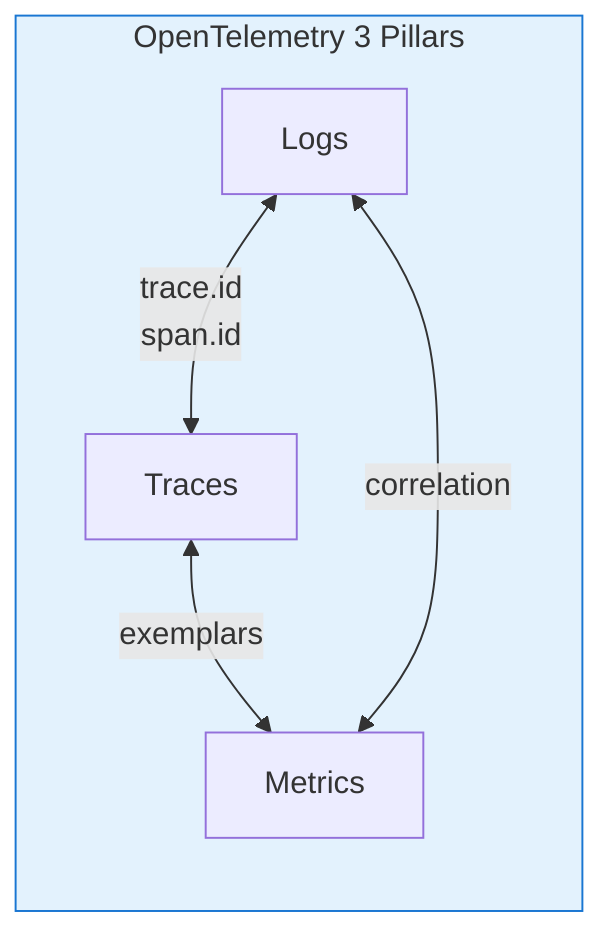

**로그 데이터 모델:**

```json
{
  "timestamp": "2025-12-17T10:00:00.000Z",
  "severity_text": "INFO",
  "body": "User login successful",
  "resource": {
    "service.name": "auth-api",
    "service.version": "1.0.7"
  },
  "attributes": {
    "user.id": "usr-123",
    "trace_id": "4bf92f3577b34da6a3ce929d0e0e4736",
    "span_id": "00f067aa0ba902b7"
  }
}
```

### Elastic Common Schema (ECS)

**표준 필드 구조:**

```json
{
  "@timestamp": "2025-12-17T10:00:00.000Z",
  "message": "User login successful",
  "log.level": "info",
  "log.logger": "auth.service",
  "service.name": "auth-api",
  "service.version": "1.0.7",
  "trace.id": "4bf92f3577b34da6a3ce929d0e0e4736",
  "span.id": "00f067aa0ba902b7",
  "error.type": "AuthenticationError",
  "error.message": "Invalid token",
  "error.stack_trace": "..."
}
```

**장점:**
- Elasticsearch/Kibana 최적화
- 400+ 표준 필드 정의
- 다양한 에코시스템 호환

---

## 📋 Eco² 로깅 정책 v1.1

### 1. 로그 포맷 표준

**ECS 기반 JSON 포맷 (현재 구현):**

```json
{
  "@timestamp": "2025-12-17T09:15:30.123Z",
  "message": "Authorization allowed",
  "log.level": "info",
  "log.logger": "domains.auth.services.auth",
  "ecs.version": "8.11.0",
  "service.name": "auth-api",
  "service.version": "1.0.7",
  "service.environment": "dev",
  "trace.id": "4bf92f3577b34da6a3ce929d0e0e4736",
  "span.id": "00f067aa0ba902b7",
  "event.action": "authorization",
  "event.outcome": "success",
  "event.duration_ms": 12.5
}
```

### 2. 필수 필드 정의 (현재 구현)

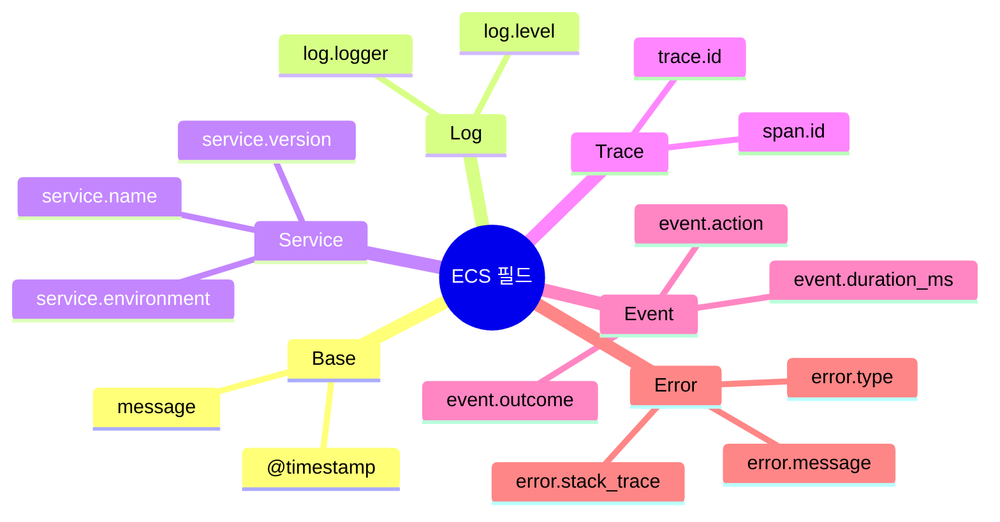

| 필드 | 타입 | 필수 | 구현 상태 |
|------|------|------|----------|
| `@timestamp` | ISO 8601 | ✅ | ✅ Python/Go |
| `message` | string | ✅ | ✅ Python/Go |
| `log.level` | string | ✅ | ✅ Python/Go |
| `service.name` | string | ✅ | ✅ Python/Go |
| `service.version` | string | ✅ | ✅ Python/Go |
| `trace.id` | string | ✅ | ✅ Python (OTEL), Go (B3) |
| `span.id` | string | ✅ | ✅ Python (OTEL), Go (B3) |
| `event.action` | string | △ | ✅ Go (ext-authz) |
| `event.outcome` | string | △ | ✅ Go (ext-authz) |

### 3. 로그 레벨 가이드라인

| Level | 사용 시점 | 프로덕션 활성화 | 현재 설정 |
|-------|----------|----------------|----------|
| DEBUG | 상세 디버깅 | ❌ | dev만 |
| INFO | 정상 비즈니스 이벤트 | ✅ | 기본값 |
| WARNING | 잠재적 문제, 재시도 | ✅ | 활성화 |
| ERROR | 오류 발생 | ✅ | 활성화 |
| CRITICAL | 서비스 중단 수준 | ✅ | 활성화 |

### 4. 서비스별 로깅 구현

#### Python API (auth, character, chat, etc.)

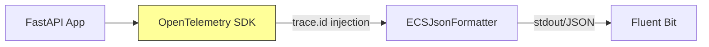

**구현 위치:** `domains/{service}/core/logging.py`

```python
# ECSJsonFormatter - OpenTelemetry trace.id 자동 주입
if HAS_OPENTELEMETRY:
    span = trace.get_current_span()
    ctx = span.get_span_context()
    if ctx.is_valid:
        log_obj["trace.id"] = format(ctx.trace_id, "032x")
        log_obj["span.id"] = format(ctx.span_id, "016x")
```

#### Go ext-authz

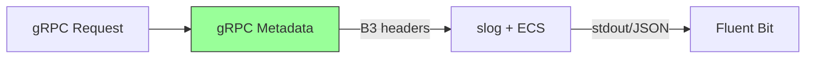

**구현 위치:** `domains/ext-authz/internal/logging/logger.go`

```go
// WithTrace - B3 trace context 주입
func (l *Logger) WithTrace(traceID, spanID string) *Logger {
    attrs := []any{slog.String("trace.id", traceID)}
    if spanID != "" {
        attrs = append(attrs, slog.String("span.id", spanID))
    }
    return &Logger{Logger: l.With(attrs...)}
}
```

### 5. 민감 정보 처리 (구현 완료)

**절대 로깅 금지:**
- 비밀번호, 인증 토큰
- 주민번호, 전화번호
- 신용카드, 계좌번호
- 암호화 키

**현재 마스킹 대상 (패턴 기반):**

```python
# domains/auth/core/constants.py
SENSITIVE_FIELD_PATTERNS = frozenset({
    "password",      # 사용자 비밀번호
    "secret",        # jwt_secret_key, client_secret
    "token",         # JWT, OAuth tokens
    "api_key",       # External API keys
    "authorization", # HTTP Authorization header
})
```

**마스킹 구현:**

```python
# Python 구현
MASK_PRESERVE_PREFIX = 4  # 앞 4자리 표시
MASK_PRESERVE_SUFFIX = 4  # 뒤 4자리 표시

def _mask_value(value: str) -> str:
    if len(value) <= 10:
        return "***REDACTED***"
    return f"{value[:4]}...{value[-4:]}"
    # eyJh...4fQk
```

```go
// Go 구현 (ext-authz)
func MaskUserID(userID string) string {
    if len(userID) <= 4 {
        return "****"
    }
    return userID[:4] + "****"
}
```

### 6. 도메인별 로깅 스코프

**auth-api:**

| 이벤트 | 레벨 | 필수 extra 필드 | 구현 |
|--------|------|-----------------|------|
| OAuth 로그인 시작 | INFO | `provider`, `state` | ✅ |
| OAuth 콜백 성공 | INFO | `provider`, `user_id` | ✅ |
| OAuth 콜백 실패 | ERROR | `provider`, `error_type` | ✅ |
| 토큰 발급 | INFO | `user_id`, `token_type` | ✅ |
| 토큰 검증 실패 | WARNING | `reason` | ✅ |

**ext-authz:**

| 이벤트 | 레벨 | 필수 extra 필드 | 구현 |
|--------|------|-----------------|------|
| Authorization allowed | INFO | `user.id`, `event.action`, `event.outcome` | ✅ |
| Authorization denied | WARN | `event.reason`, `error.message` | ✅ |
| Public path allowed | INFO | `url.path` | ✅ |

### 7. 성능 고려사항

**로그 레벨 게이팅:**

```python
# ✅ 좋은 예: 레벨 체크 후 로깅
if logger.isEnabledFor(logging.DEBUG):
    logger.debug("Expensive data", extra={"result": expensive_fn()})

# ❌ 나쁜 예: 항상 연산 수행
logger.debug("Expensive data", extra={"result": expensive_fn()})
```

**환경별 로그 볼륨 (현재 측정):**

| 환경 | 기본 레벨 | 실제 볼륨 (2025-12-17 기준) |
|------|----------|---------------------------|
| Development | DEBUG | ~420MB/day (1.1M docs) |
| Production | INFO | 예상 ~200MB/day |

---

## 🔄 Trace ID 전파 흐름

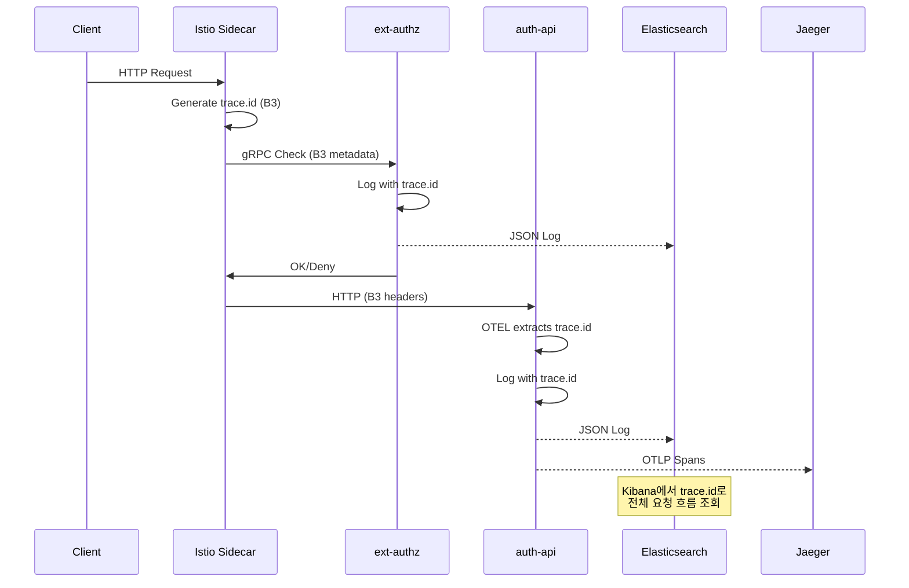

---

## 🎯 핵심 결정 사항과 근거

### 왜 ECS인가?

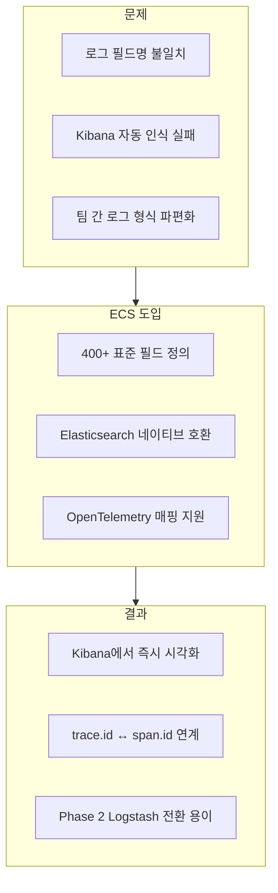

**선택 이유:**

1. **ECK Operator 생태계와 일치**
   - 우리는 ECK(Elastic Cloud on Kubernetes) Operator로 ES/Kibana를 관리 ([ADR-001](../decisions/ADR-001-logging-architecture.md))
   - ECS는 Elastic 생태계의 표준 스키마로, Kibana가 자동으로 필드를 인식
   - `service.name`, `trace.id` 등이 사이드바에 바로 표시됨

2. **Phase 2 (EDA) 전환 대비**
   - 현재: Fluent Bit → ES 직접 전송
   - EDA 도입 시: Fluent Bit → Kafka → **Logstash** → ES
   - ECS 표준 필드를 사용하면 Logstash 파이프라인에서 추가 변환 불필요

3. **OpenTelemetry 호환성**
   - OTEL `trace_id` → ECS `trace.id` 매핑 표준화
   - Jaeger 트레이스와 Kibana 로그 간 상관관계 조회 가능

### 왜 JSON인가?

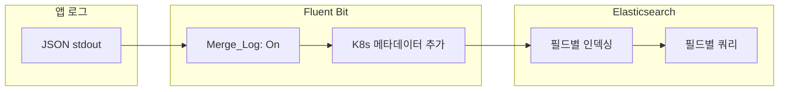

**선택 이유:**

1. **Fluent Bit 자동 파싱**
   - `Merge_Log: On` 설정으로 JSON 필드가 root에 자동 병합
   - 별도 grok 파서 없이 구조화된 로그 처리

2. **Kibana 쿼리 최적화**
   - `service.name: "auth-api"` 같은 필드 기반 검색
   - 일반 텍스트 로그 대비 10배 이상 빠른 검색

3. **EDA 전환 시 Logstash 처리 용이**
   - JSON → Logstash filter → JSON 파이프라인 단순화
   - Saga trace correlation 등 복잡한 변환 지원

### 왜 도메인별 독립 구현인가?

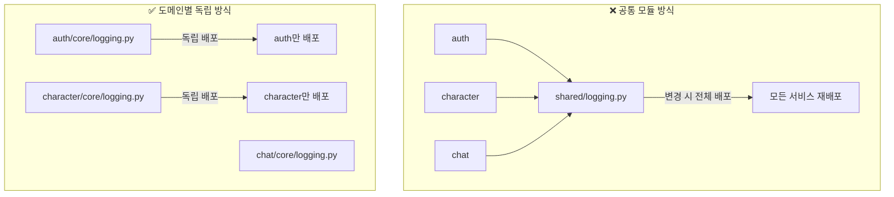

**선택 이유:**

1. **마이크로서비스 원칙 준수**
   - 각 서비스는 독립적으로 배포/확장 가능해야 함
   - 공통 모듈 의존 시 버전 충돌, 배포 동기화 문제 발생

2. **도메인별 커스터마이징**
   - auth: `provider`, `token_type`, `jti` 필드
   - ext-authz: `event.action`, `event.outcome` 필드
   - character: `character_id`, `exp_gained` 필드

3. **실용적 이유**
   - 코드 ~200줄 복사 vs 공통 모듈 관리 오버헤드
   - 각 팀이 독립적으로 로깅 정책 조정 가능

### 왜 trace.id가 필수인가?

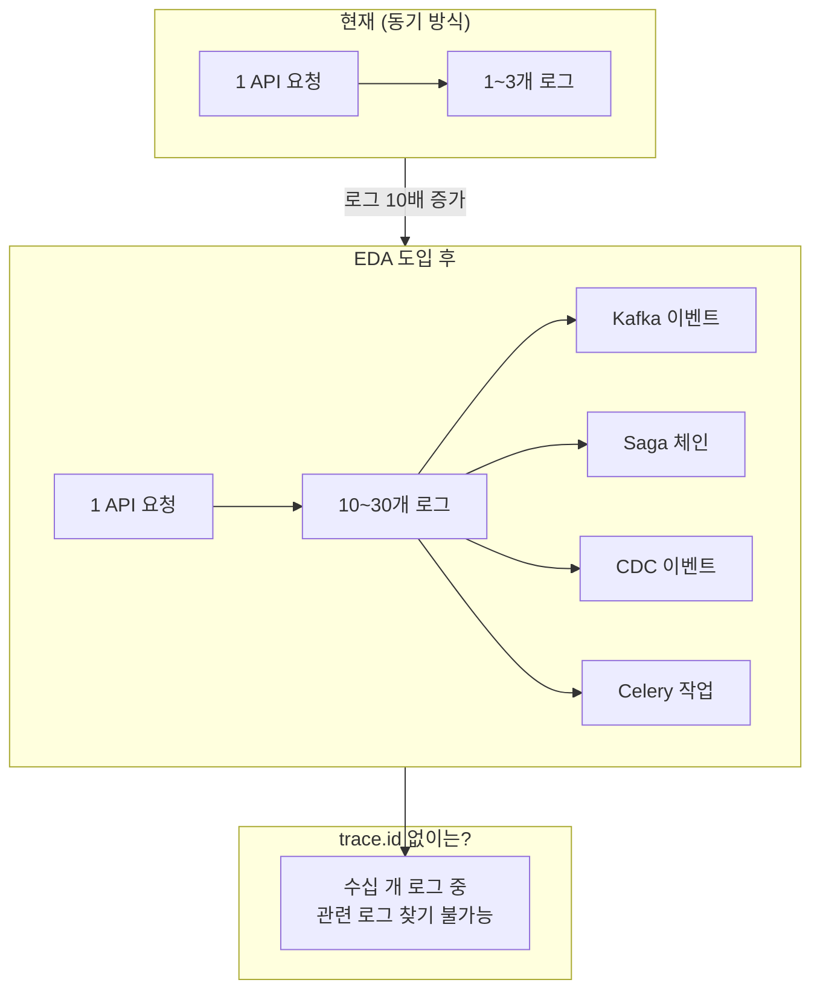

**선택 이유:**

1. **EDA 도입 시 로그 폭발 대비** ([ADR-001](../decisions/ADR-001-logging-architecture.md))
   ```
   현재: 1 요청 → 1~3개 로그 (일일 ~30,000 로그)
   EDA 후: 1 요청 → 10~30개 로그 (일일 ~300,000 로그)
   ```

2. **Istio가 생성한 trace.id를 전체 흐름에서 공유**
   - Istio Ingress Gateway가 **Source of Truth**
   - ext-authz, 앱 API, Kafka Consumer 모두 동일 trace.id 사용
   - Kibana에서 `trace.id: "xxx"` 검색 → 전체 요청 흐름 조회

3. **Jaeger ↔ Kibana 상관관계**
   - Jaeger에서 느린 trace 발견 → trace.id 복사
   - Kibana에서 해당 trace.id의 상세 로그 조회

### 왜 민감 정보 마스킹인가?

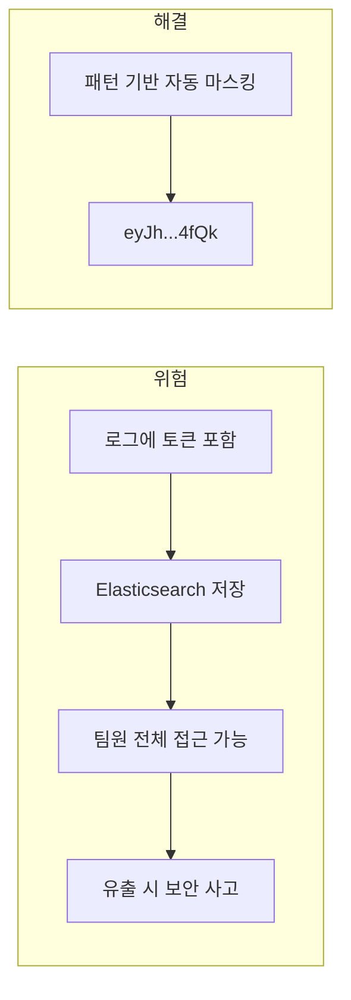

**선택 이유:**

1. **OWASP 로깅 치트시트 준수**
   - 인증 정보, 세션 ID, 개인정보는 로그에 포함 금지
   - 디버깅 목적이라도 마스킹 필수

2. **Elasticsearch 특성**
   - 로그가 검색 가능한 형태로 저장됨
   - Kibana에서 누구나 조회 가능
   - 잘못된 검색 쿼리로 민감 정보 노출 위험

3. **자동 마스킹으로 개발자 실수 방지**
   - 패턴 기반 (`password`, `token`, `secret` 등)
   - `extra` 필드 전체에 재귀적으로 적용
   - 개발자가 실수로 토큰을 로깅해도 자동 마스킹

### 왜 Python/Go 각각 구현인가?

| 구분 | Python (FastAPI) | Go (ext-authz) |
|------|------------------|----------------|
| **Trace 소스** | OpenTelemetry SDK | gRPC Metadata (B3) |
| **이유** | OTEL 자동 계측 (`opentelemetry-instrument`) | gRPC 서비스라 HTTP 헤더 접근 불가 |
| **로깅** | stdlib `logging` | `slog` (Go 1.21+) |
| **이유** | Python 표준, 대부분 라이브러리 호환 | 구조화 로깅 네이티브 지원 |
| **마스킹** | 재귀 dict 순회 | 개별 함수 |
| **이유** | `extra` 필드가 중첩 dict일 수 있음 | 필드가 명확하고 단순 |

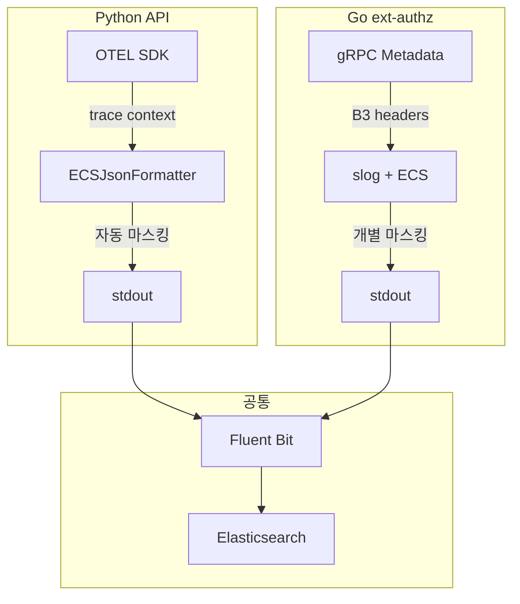

---

## 📁 정책 문서 구조

```
docs/
├── blogs/observability/
│   ├── 01-efk-stack-setup.md        # 인프라 구축
│   ├── 02-logging-policy.md         # 정책 수립 (이 문서)
│   ├── 03-ecs-structured-logging.md # Python 구현
│   ├── 04-distributed-tracing.md    # 분산 트레이싱
│   └── 12-log-trace-correlation.md  # 로그-트레이스 상관관계
└── decisions/
    └── ADR-001-logging-architecture.md  # 아키텍처 결정 기록
```

---

## 📚 다음 글 미리보기

**[#3: 도메인별 ECS 구조화 로깅]** - Python/FastAPI에서 ECS 기반 구조화된 로깅을 구현하고, OpenTelemetry와 연동하는 실제 코드를 다룹니다.

---

## 🔗 참고 자료

- [Google SRE Book - Monitoring Distributed Systems](https://sre.google/sre-book/monitoring-distributed-systems/)
- [Netflix Tech Blog - Logging](https://netflixtechblog.com/)
- [OpenTelemetry Logging](https://opentelemetry.io/docs/specs/otel/logs/)
- [Elastic Common Schema](https://www.elastic.co/guide/en/ecs/current/index.html)
- [OWASP Logging Cheat Sheet](https://cheatsheetseries.owasp.org/cheatsheets/Logging_Cheat_Sheet.html)
- [ADR-001: 로깅 아키텍처 선택](../decisions/ADR-001-logging-architecture.md)
