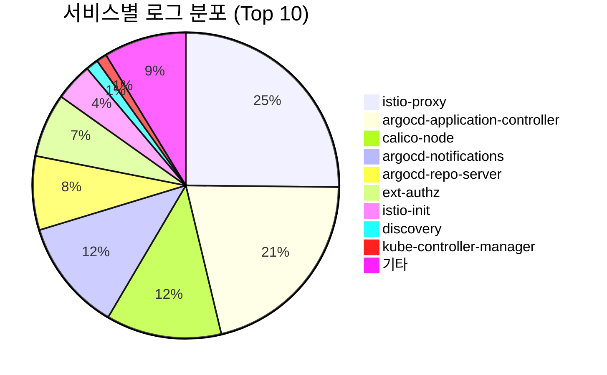
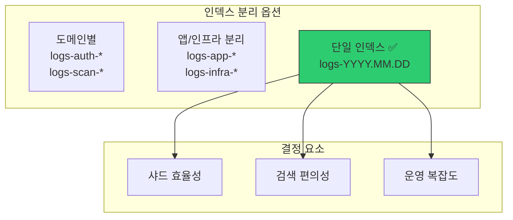
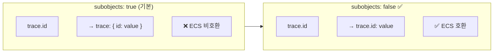

# 이코에코(Eco²) Observability #7: 인덱스 전략 및 라이프사이클 관리

> **시리즈**: Eco² Observability Enhancement  
> **작성일**: 2025-12-17  
> **수정일**: 2025-12-18  
> **태그**: `#Elasticsearch` `#Index` `#ILM` `#BestPractices`

---

## 📋 개요

마이크로서비스 환경에서 로그 인덱스를 어떻게 설계할지는 운영 효율성과 비용에 직접적인 영향을 미칩니다. 이 글에서는 빅테크(Netflix, Uber, Google)와 CNCF 권장사항을 바탕으로 인덱스 분리 전략을 수립하고, ILM을 통한 라이프사이클 관리를 다룹니다.

---

## 🎯 목표

1. 인덱스 분리 전략 선택 (도메인별 vs 앱/인프라 vs 단일)
2. Fluent Bit 라우팅 설정
3. ILM 정책으로 비용 최적화
4. ECS 필드 기반 서비스 구분

---

## ✅ 현재 클러스터 상태

### 인덱스 현황

```bash
# 2025-12-18 기준
kubectl exec -n logging eco2-logs-es-default-0 -- curl -s "http://localhost:9200/_cat/indices/logs-*?v"

index             docs.count  store.size
logs-2025.12.17   1,114,246   421mb
logs-2025.12.18     624,036   259mb
───────────────────────────────────────
Total             1,738,282   680mb
```

### 서비스별 로그 분포



### 앱 서비스 로그 (비즈니스 로직)

| 서비스 | 로그 수 | 비율 |
|--------|---------|------|
| image-api | 100 | 41% |
| auth-api | 53 | 22% |
| chat-api | 44 | 18% |
| scan-api | 36 | 15% |
| location-api | 6 | 2% |
| character-api | 3 | 1% |
| my-api | 1 | 0.4% |
| **Total** | **243** | 100% |

> **인사이트**: 전체 ~1.7M 로그 중 앱 로그는 243개(0.01%)뿐. 나머지는 인프라 로그(istio, argocd, calico 등).

---

## 1️⃣ 인덱스 분리 전략

### 아키텍처 결정: 단일 인덱스 선택



### 왜 단일 인덱스인가?

| 옵션 | 장점 | 단점 | ECO2 적합성 |
|------|------|------|-------------|
| **도메인별** (logs-auth-*, logs-scan-*) | 도메인 격리 | 샤드 폭발, 크로스 검색 어려움 | ❌ |
| **앱/인프라 분리** (logs-app-*, logs-infra-*) | 보존기간 차별화 | 라우팅 복잡도 증가 | △ (계획됨) |
| **단일 인덱스** (logs-YYYY.MM.DD) ✅ | 간단, 크로스 검색 용이 | 보존기간 동일 | ✅ (현재) |

**선택 이유:**

1. **개발 환경 특성**: 단일 ES 노드, 샤드 오버헤드 최소화 필요
2. **앱 로그 비율**: 전체의 0.01%로 분리 효과 미미
3. **Cross-service 검색**: `trace.id`로 auth→scan→character 추적 시 단일 인덱스가 유리
4. **운영 단순화**: ILM, Index Template, Fluent Bit 설정 최소화

### 빅테크 사례 분석

| 회사 | 전략 | 특징 | 교훈 |
|------|------|------|------|
| **Netflix** | 단일 + 필드 분리 | ELK + Kafka, `service_name` 필터링 | 필드 기반 검색 |
| **Uber** | 도메인별 → ClickHouse 전환 | 샤드 폭발 경험 | 인덱스 수 제한 |
| **Google SRE** | 환경별/레벨별 | 서비스별 ❌ | 필드 기반 ✅ |

> **Uber의 교훈**: "서비스 수가 증가하면서 인덱스 수도 폭발적으로 증가했고, 이로 인해 클러스터 관리가 어려워졌다."
> — [Uber Engineering Blog](https://www.uber.com/blog/logging/)

---

## 2️⃣ 현재 Fluent Bit 설정

### OUTPUT 설정 (단일 인덱스)

```ini
# workloads/logging/base/fluent-bit.yaml
[OUTPUT]
    Name            es
    Match           kube.*
    Host            eco2-logs-es-http.logging.svc.cluster.local
    Port            9200
    HTTP_User       ${ES_USER}
    HTTP_Passwd     ${ES_PASSWORD}
    Logstash_Format On
    Logstash_Prefix logs                    # ✅ 단일 prefix
    Logstash_DateFormat %Y.%m.%d            # logs-2025.12.18
    Retry_Limit     False
    Replace_Dots    Off                     # ECS dot notation 유지
    Suppress_Type_Name On
    Buffer_Size     5MB
    Generate_ID     On
```

**결과 인덱스 패턴:**
```
logs-2025.12.17
logs-2025.12.18
...
```

### Health 로그 필터링 (노이즈 감소)

```ini
# 프로브 로그 제외 (일일 ~120,000 로그 감소)
[FILTER]
    Name          grep
    Match         kube.*
    Exclude       log /health|ready|healthz|readyz|livez/
```

---

## 3️⃣ Index Template (ECS 호환)

### 현재 배포된 템플릿

```json
// eco2-logs-ecs (priority: 500)
{
  "index_patterns": ["logs-*"],
  "template": {
    "settings": {
      "number_of_shards": 1,
      "number_of_replicas": 0      // dev 환경: replica 없음
    },
    "mappings": {
      "subobjects": false,         // ✅ ECS dot notation 유지
      "properties": {
        "@timestamp": { "type": "date" },
        "message": { "type": "text" },
        "trace.id": { "type": "keyword" },
        "span.id": { "type": "keyword" },
        "log.level": { "type": "keyword" },
        "service.name": { "type": "keyword" },
        "service.version": { "type": "keyword" },
        "service.environment": { "type": "keyword" },
        "error.type": { "type": "keyword" },
        "error.message": { "type": "text" }
      },
      "dynamic_templates": [{
        "strings_as_keywords": {
          "match_mapping_type": "string",
          "mapping": { "type": "keyword", "ignore_above": 1024 }
        }
      }]
    }
  }
}
```

### 왜 subobjects: false인가?



**ES 8.x subobjects: false 기능:**
- `trace.id`, `span.id` 등 ECS 표준 필드명을 그대로 유지
- Fluent Bit `Replace_Dots: Off`와 함께 사용
- Kibana에서 `trace.id: "abc123*"` 검색 가능

---

## 4️⃣ 필드 기반 서비스 구분

도메인별 인덱스 대신 ECS 필드로 서비스를 구분합니다:

```json
{
  "@timestamp": "2025-12-18T12:00:00.000Z",
  "service.name": "auth-api",
  "service.version": "1.0.7",
  "service.environment": "dev",
  "kubernetes.namespace": "auth",
  "kubernetes.pod.name": "auth-api-xxx",
  "log.level": "INFO",
  "message": "User login successful",
  "trace.id": "49069056832712b6d1a76403290e3520"
}
```

### Kibana 쿼리 예시

```bash
# 특정 서비스 에러 로그
service.name: "auth-api" AND log.level: "ERROR"

# Cross-service 트랜잭션 추적 (단일 인덱스이므로 간단!)
trace.id: "49069056832712b6d1a76403290e3520"

# 특정 네임스페이스 전체 로그
kubernetes.namespace: "auth"

# 인프라 vs 앱 로그 구분
service.name: ("auth-api" OR "scan-api" OR "chat-api")
service.name: ("istio-proxy" OR "argocd-*" OR "calico-*")
```

---

## 5️⃣ ILM (Index Lifecycle Management)

### 현재 상태

| 정책 | 상태 | 설명 |
|------|------|------|
| `logs` (기본) | ✅ 사용 중 | Hot phase만, 30일 rollover |
| `logs-app-policy` | ⏳ 정의됨 | Hot→Warm→Delete (14일) |
| `logs-infra-policy` | ⏳ 정의됨 | Hot→Warm→Delete (7일) |

### ILM 라이프사이클 단계

```
┌─────────┐    3일    ┌─────────┐   14일   ┌─────────┐
│   Hot   │ ────────► │  Warm   │ ───────► │ Delete  │
│ (쓰기)  │           │(읽기전용)│          │         │
└─────────┘           └─────────┘          └─────────┘
  rollover             shrink              delete
  set_priority         forcemerge
```

### 계획된 ILM 정책 (StackConfigPolicy)

```yaml
# workloads/logging/base/stack-config-policy.yaml
spec:
  elasticsearch:
    indexLifecyclePolicies:
      # App 로그: 14일 보존
      logs-app-policy:
        phases:
          hot:
            actions:
              rollover:
                max_primary_shard_size: 30gb
                max_age: 1d
              set_priority: { priority: 100 }
          warm:
            min_age: 3d
            actions:
              shrink: { number_of_shards: 1 }
              forcemerge: { max_num_segments: 1 }
          delete:
            min_age: 14d
            actions: { delete: {} }
      
      # Infra 로그: 7일 보존
      logs-infra-policy:
        phases:
          hot:
            actions:
              rollover:
                max_primary_shard_size: 30gb
                max_age: 1d
          delete:
            min_age: 7d
            actions: { delete: {} }
```

---

## 6️⃣ 샤드 최적화

### 현재 샤드 상태

```bash
kubectl exec -n logging eco2-logs-es-default-0 -- curl -s "http://localhost:9200/_cat/shards/logs-*?v"

index             shard prirep state    docs      store
logs-2025.12.17   0     p      STARTED  1114246   421mb
logs-2025.12.17   0     r      UNASSIGNED              # replica 없음 (단일 노드)
logs-2025.12.18   0     p      STARTED   623687   259mb
```

### 왜 replica 0인가?

| 환경 | replicas | 이유 |
|------|----------|------|
| **dev** | 0 | 단일 노드, replica 할당 불가 |
| **prod** | 1+ | 고가용성 필요 |

```yaml
# Index Template 설정
"settings": {
  "number_of_shards": 1,
  "number_of_replicas": 0  # dev 환경
}
```

---

## 7️⃣ 스토리지 비용 최적화

### 일일 로그량

| 날짜 | 문서 수 | 크기 | 초당 로그 |
|------|---------|------|----------|
| 2025-12-17 | 1,114,246 | 421MB | ~13/s |
| 2025-12-18 | 624,036 | 259MB | ~7/s |

### 비용 절감 전략 (적용됨)

| 전략 | 효과 | 구현 |
|------|------|------|
| **Health 로그 제외** | ~120,000/일 감소 | Fluent Bit grep 필터 |
| **replica 0** | 스토리지 50% 절감 | Index Template |
| **strings_as_keywords** | 인덱싱 효율 | dynamic_template |

### 추가 최적화 (계획)

| 전략 | 예상 효과 | 상태 |
|------|----------|------|
| Infra 7일 보존 | 디스크 ~70% 절감 | ⏳ 계획됨 |
| Warm forcemerge | 추가 50% 압축 | ⏳ 계획됨 |

---

## 🔗 참고 자료

- [Uber Engineering: Logging at Scale](https://www.uber.com/blog/logging/)
- [Elasticsearch ILM](https://www.elastic.co/guide/en/elasticsearch/reference/current/index-lifecycle-management.html)
- [ES 8.x subobjects](https://www.elastic.co/docs/reference/elasticsearch/mapping-reference/subobjects)
- [CNCF Logging Best Practices](https://www.cncf.io/blog/2023/07/03/kubernetes-logging-best-practices/)

---

## ✅ 결론

| 결정 | 선택 | 이유 |
|------|------|------|
| 인덱스 분리 | **단일** (logs-YYYY.MM.DD) | 개발 환경, 앱 로그 0.01%, 크로스 검색 |
| 서비스 구분 | **ECS 필드** | `service.name`, `trace.id` |
| 샤드 | **1 primary, 0 replica** | 단일 노드 환경 |
| ILM | **Hot only** (현재) | 단순화, 추후 확장 |
| ECS 호환 | **subobjects: false** | dot notation 유지 |

### 향후 계획


1. **Phase 1**: `logs-app-policy`, `logs-infra-policy` ILM 활성화
2. **Phase 2**: Fluent Bit rewrite_tag로 앱/인프라 인덱스 분리 (트래픽 증가 시)

---

**다음 글**: [Kibana 대시보드 구성](./05-kibana-dashboard.md)
