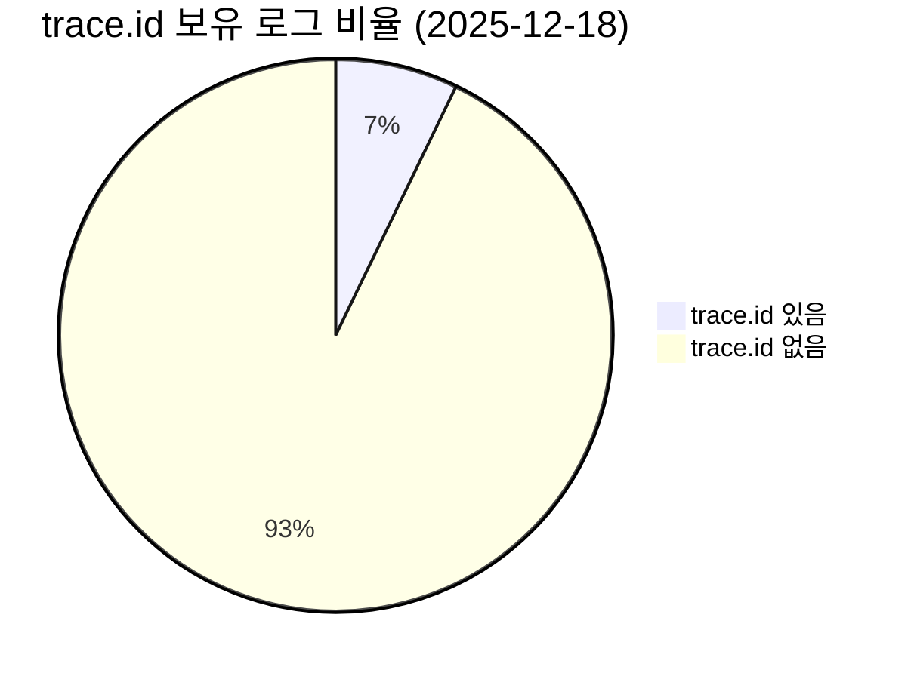
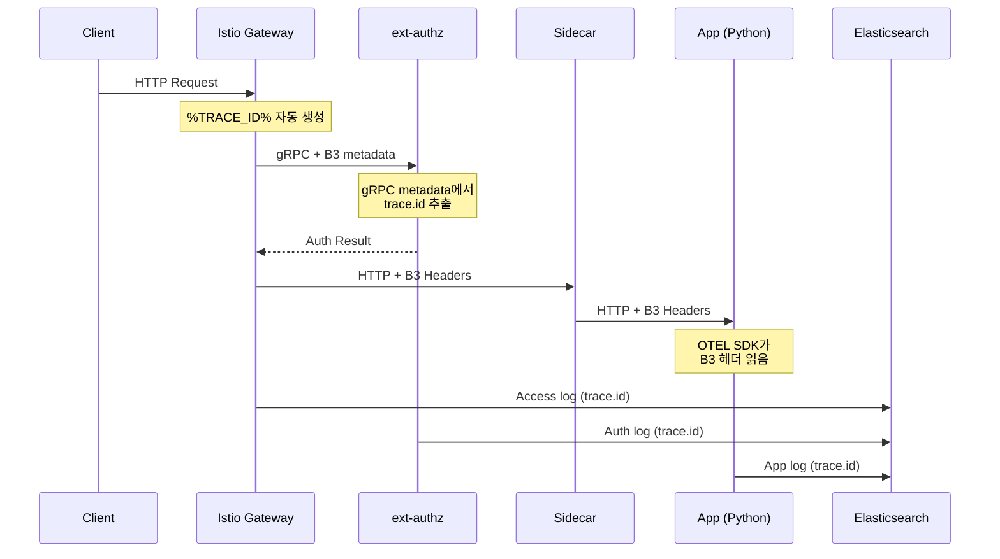
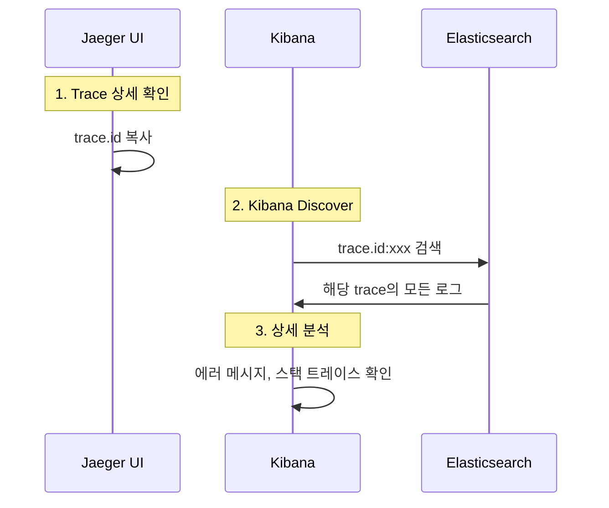
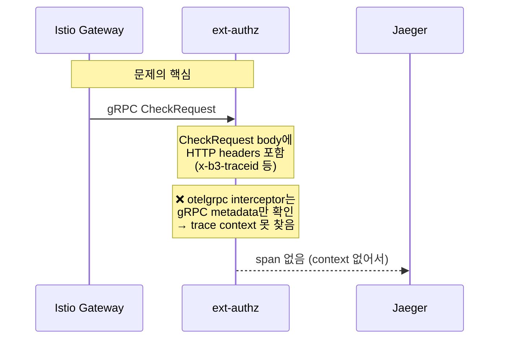

# 이코에코(Eco²) Observability #12: Log-Trace 연동 및 Kibana 검색 구조

> **시리즈**: Eco² Observability Enhancement  
> **작성일**: 2025-12-18  
> **수정일**: 2025-12-19  
> **태그**: `#FluentBit` `#Kibana` `#Elasticsearch` `#TraceCorrelation` `#ECS` `#OTEL`

---

## 📋 개요

분산 시스템에서 로그와 트레이스를 연결하는 것은 디버깅의 핵심입니다. 이 문서에서는 Kibana에서 `trace.id`로 로그를 검색할 수 있도록 구성한 과정과 현재 구현 상태를 다룹니다.

---

## ✅ 현재 클러스터 상태

### Trace 커버리지 통계



| 메트릭 | 값 |
|--------|-----|
| 전체 로그 | 1,750,699 |
| trace.id 있는 로그 | 125,398 |
| **커버리지** | **7.16%** |

### 서비스별 trace.id 분포

| 서비스 | trace.id 로그 수 | 비율 |
|--------|------------------|------|
| **istio-proxy** | 125,179 | 99.8% |
| chat-api | 40 | 0.03% |
| scan-api | 34 | 0.03% |
| ext-authz | 11 | 0.01% |
| auth-api | 10 | 0.01% |
| image-api | 4 | - |
| location-api | 2 | - |
| my-api | 1 | - |

> **인사이트**: istio-proxy (EnvoyFilter)가 대부분의 trace를 생성. 앱 로그는 요청 처리 시에만 trace.id 포함.

---

## 🔧 현재 구현 구조

### Trace 생성 흐름



### 컴포넌트별 trace.id 지원

| 컴포넌트 | trace.id 소스 | 구현 방식 | 로그 | Jaeger |
|----------|---------------|----------|:---:|:---:|
| **Istio Gateway** | `%TRACE_ID%` | EnvoyFilter | ✅ | ✅ |
| **istio-proxy (Sidecar)** | `%TRACE_ID%` | EnvoyFilter | ✅ | ✅ |
| **ext-authz (Go gRPC)** | CheckRequest headers | 수동 span 생성 | ✅ | ✅ |
| **Python APIs** | B3 헤더 | OTEL SDK 자동 계측 | ✅ | ✅ |
| **시스템 로그** | N/A | 미지원 | ❌ | ❌ |

---

## 📊 실제 로그 예시

### 1. istio-proxy 로그 (EnvoyFilter)

```json
{
  "@timestamp": "2025-12-18T18:05:28.383Z",
  "service.name": "istio-proxy",
  "trace.id": "c8fd3e757ca339685a7309846a5821b6",
  "http.request.method": "GET",
  "url.path": "/healthz/ready",
  "http.response.status_code": 200
}
```

### 2. ext-authz 로그 (gRPC metadata 추출)

```json
{
  "@timestamp": "2025-12-18T12:02:06.845Z",
  "service.name": "ext-authz",
  "trace.id": "a593d6809fe6f036728dc73cfd170b0e",
  "span.id": "3e491beac3443f3c",
  "msg": "Authorization denied",
  "event.outcome": "failure"
}
```

### 3. Python App 로그 (OTEL SDK)

```json
{
  "@timestamp": "2025-12-18T09:31:11.811+00:00",
  "service.name": "auth-api",
  "trace.id": "5fdc8e113b2618f6006a00c89347d78a",
  "span.id": "44ea44a93a45564f",
  "log.level": "warning",
  "message": "HTTP 401 UNAUTHORIZED: Missing refresh token"
}
```

---

## 🔧 핵심 구현 상세

### 1. EnvoyFilter (Istio Access Log)

`workloads/istio/base/envoy-filter-access-log.yaml`:

```yaml
apiVersion: networking.istio.io/v1alpha3
kind: EnvoyFilter
metadata:
  name: enable-access-log
  namespace: istio-system
spec:
  configPatches:
  - applyTo: NETWORK_FILTER
    match:
      context: ANY
      listener:
        filterChain:
          filter:
            name: envoy.filters.network.http_connection_manager
    patch:
      operation: MERGE
      value:
        typed_config:
          '@type': type.googleapis.com/envoy.extensions.filters.network.http_connection_manager.v3.HttpConnectionManager
          access_log:
          - name: envoy.access_loggers.file
            typed_config:
              '@type': type.googleapis.com/envoy.extensions.access_loggers.file.v3.FileAccessLog
              path: /dev/stdout
              log_format:
                json_format:
                  # ✅ %TRACE_ID% - 헤더 없어도 Envoy가 자동 생성
                  trace.id: '%TRACE_ID%'
                  span.id: '%REQ(X-B3-SPANID)%'
                  http.request.method: '%REQ(:METHOD)%'
                  url.path: '%REQ(:PATH)%'
                  http.response.status_code: '%RESPONSE_CODE%'
```

#### %TRACE_ID% vs %REQ(X-B3-TRACEID)% 비교

| 변수 | 값 보장 | 설명 |
|------|---------|------|
| `%REQ(X-B3-TRACEID)%` | ❌ | 클라이언트가 보낸 헤더만 |
| `%TRACE_ID%` | ✅ | Envoy가 항상 자동 생성 |

### 2. Index Template (ECS 호환)

`subobjects: false`로 dot notation 필드명 유지:

```json
{
  "index_patterns": ["logs-*"],
  "template": {
    "mappings": {
      "subobjects": false,
      "properties": {
        "trace.id": { "type": "keyword" },
        "span.id": { "type": "keyword" },
        "log.level": { "type": "keyword" },
        "service.name": { "type": "keyword" }
      }
    }
  }
}
```

### 3. Fluent Bit 설정

```ini
[OUTPUT]
    Name            es
    Match           kube.*
    Replace_Dots    Off    # ✅ ECS dot notation 유지
    ...
```

---

## 📝 Kibana 검색 가이드

### 검색 쿼리 예시

```kql
# 특정 trace의 모든 로그 (cross-service)
trace.id:5fdc8e113b2618f6006a00c89347d78a

# 특정 서비스의 에러 로그
service.name:auth-api AND log.level:error

# istio-proxy 401 에러
service.name:istio-proxy AND http.response.status_code:401

# 앱 로그만 (시스템 제외)
trace.id:* AND service.name:(auth-api OR scan-api OR chat-api)
```

### Jaeger ↔ Kibana 연동 워크플로우



**실제 사용:**
1. Jaeger: `https://jaeger.dev.growbin.app/trace/{trace_id}`
2. Kibana: `https://kibana.dev.growbin.app/app/discover` → `trace.id:{trace_id}`

---

## 📊 ECS 필드 매핑 현황

### 앱 로그 필드 (Python OTEL)

| 필드 | 타입 | 소스 | 예시 |
|------|------|------|------|
| `trace.id` | keyword | OTEL SDK | `5fdc8e113b2618f6...` |
| `span.id` | keyword | OTEL SDK | `44ea44a93a45564f` |
| `service.name` | keyword | App 코드 | `auth-api` |
| `service.version` | keyword | App 코드 | `1.0.7` |
| `log.level` | keyword | App 코드 | `info`, `warning`, `error` |
| `message` | text | App 코드 | 로그 메시지 |

### Istio 로그 필드 (EnvoyFilter)

| 필드 | 타입 | 소스 | 예시 |
|------|------|------|------|
| `trace.id` | keyword | `%TRACE_ID%` | `c8fd3e757ca33968...` |
| `span.id` | keyword | `%REQ(X-B3-SPANID)%` | B3 헤더 또는 빈값 |
| `http.request.method` | keyword | `%REQ(:METHOD)%` | `GET`, `POST` |
| `url.path` | keyword | `%REQ(:PATH)%` | `/api/v1/auth/refresh` |
| `http.response.status_code` | integer | `%RESPONSE_CODE%` | `200`, `401`, `500` |

### 시스템 로그 필드 (Lua 자동 생성)

| 필드 | 타입 | 소스 | 예시 |
|------|------|------|------|
| `service.name` | keyword | K8s 라벨 | `calico-node`, `argocd-server` |
| `service.environment` | keyword | namespace | `kube-system`, `argocd` |
| `kubernetes.namespace` | keyword | K8s 메타 | `kube-system` |
| `kubernetes.pod.name` | keyword | K8s 메타 | `calico-node-xv9c8` |

---

## 🏗️ Trace Propagation 아키텍처

```
┌─────────────────────────────────────────────────────────────────────────┐
│                       Trace ID Propagation                              │
├─────────────────────────────────────────────────────────────────────────┤
│                                                                         │
│  [Client Request]                                                       │
│       │                                                                 │
│       ▼                                                                 │
│  ┌──────────────────┐                                                  │
│  │ Istio Ingress    │ ◀── trace.id 생성 (%TRACE_ID%)                   │
│  │ Gateway          │     → ES에 access log 전송                       │
│  └────────┬─────────┘                                                  │
│           │ gRPC + B3 메타데이터                                        │
│           ▼                                                             │
│  ┌──────────────────┐                                                  │
│  │ ext-authz        │ ◀── gRPC metadata에서 trace.id 추출              │
│  │ (Go gRPC)        │     → ES에 auth log 전송                         │
│  └────────┬─────────┘                                                  │
│           │ 인증 결과                                                   │
│           ▼                                                             │
│  ┌──────────────────┐                                                  │
│  │ App Sidecar      │ ◀── B3 헤더 전파                                 │
│  │ (istio-proxy)    │     → ES에 access log 전송                       │
│  └────────┬─────────┘                                                  │
│           │ HTTP + B3 헤더                                              │
│           ▼                                                             │
│  ┌──────────────────┐                                                  │
│  │ App (Python)     │ ◀── OTEL SDK가 B3 헤더 읽음                      │
│  │ + OTEL SDK       │     → ES에 app log 전송 (동일 trace.id)          │
│  └──────────────────┘                                                  │
│                                                                         │
└─────────────────────────────────────────────────────────────────────────┘
```

---

## ⚠️ 트러블슈팅

### Issue 1: trace.id로 검색 안됨

**증상:**
```
Kibana: trace.id:xxx → No results
```

**원인:** Fluent Bit `Merge_Log_Key` 설정으로 필드가 중첩됨

**해결:** Nest lift 필터 추가
```ini
[FILTER]
    Name          nest
    Match         kube.*
    Operation     lift
    Nested_under  log_processed
```

### Issue 2: ECS dot notation이 object로 변환됨

**증상:**
```json
// 의도: "trace.id": "abc"
// 실제: "trace": { "id": "abc" }
```

**해결:**
1. Index Template: `subobjects: false`
2. Fluent Bit: `Replace_Dots Off`

### Issue 3: ext-authz 거부 시 trace.id 없음

**증상:** 401 에러에 trace.id가 없어서 추적 불가

**해결:** gRPC metadata에서 B3 헤더 추출
```go
if md, ok := metadata.FromIncomingContext(ctx); ok {
    if vals := md.Get("x-b3-traceid"); len(vals) > 0 {
        trace.TraceID = vals[0]
    }
}
```

---

## 📊 OpenTelemetry 커버리지 요약

### OTEL이 커버하는 범위

| 컴포넌트 | 방식 | trace.id | Jaeger Span |
|----------|------|----------|-------------|
| Python APIs | OTEL SDK 자동 계측 | ✅ | ✅ |
| Istio Sidecar | Envoy 내장 tracing | ✅ | ✅ |
| Istio Gateway | Envoy 내장 tracing | ✅ | ✅ |

### OTEL이 커버하지 않는 범위

| 컴포넌트 | 문제 | 해결 |
|----------|------|------|
| ~~ext-authz (Go gRPC)~~ | ~~SDK 미적용~~ | ✅ **해결됨** (아래 참조) |
| 시스템 로그 (calico 등) | 지원 안함 | N/A (trace 불필요) |

---

## 🎯 ext-authz Jaeger Span 적용 (2025-12-19)

### 문제 상황

ext-authz에 OTEL SDK가 구현되어 있었으나 **Jaeger에 서비스가 표시되지 않음**.

```
# Jaeger 서비스 목록 (적용 전)
auth-api, scan-api, chat-api, istio-ingressgateway...
# ext-authz 없음!
```

**로그에는 trace.id가 있었음**:
```json
{
  "service.name": "ext-authz",
  "trace.id": "a593d6809fe6f036728dc73cfd170b0e",
  "msg": "Authorization denied"
}
```

### 원인 분석



| 구성요소 | trace context 위치 | otelgrpc가 보는 위치 |
|----------|-------------------|---------------------|
| Istio ext-authz 호출 | `CheckRequest.attributes.request.http.headers` | gRPC metadata |
| **결과** | **불일치** → span 생성 안됨 |

### 해결: 수동 Span 생성

`domains/ext-authz/internal/server/server.go`:

```go
// 1. HTTP 헤더를 OTEL propagator에 어댑트
type httpHeaderCarrier map[string]string

func (c httpHeaderCarrier) Get(key string) string { return c[key] }
func (c httpHeaderCarrier) Set(key, value string) { c[key] = value }
func (c httpHeaderCarrier) Keys() []string { /* ... */ }

// 2. CheckRequest body에서 trace context 추출
func extractTraceContext(ctx context.Context, req *authv3.CheckRequest) context.Context {
    headers := req.Attributes.Request.Http.Headers
    propagator := otel.GetTextMapPropagator()
    return propagator.Extract(ctx, httpHeaderCarrier(headers))
}

// 3. Check 함수에서 수동 span 생성
func (s *AuthorizationServer) Check(ctx context.Context, req *authv3.CheckRequest) (*authv3.CheckResponse, error) {
    // trace context 추출
    ctx = extractTraceContext(ctx, req)
    
    // span 생성
    tracer := otel.Tracer("ext-authz")
    ctx, span := tracer.Start(ctx, "Authorization.Check",
        trace.WithSpanKind(trace.SpanKindServer),
        trace.WithAttributes(
            semconv.HTTPRequestMethodKey.String(method),
            semconv.URLPath(path),
        ),
    )
    defer span.End()
    
    // 결과에 따라 span 속성 설정
    span.SetAttributes(
        attribute.String("authz.result", "deny"),
        attribute.String("authz.reason", "missing_auth_header"),
    )
    // ...
}
```

### 적용 결과

**Jaeger 서비스 목록 (적용 후)**:

```diff
  auth-api
  auth-api.auth
  character-api
+ ext-authz        ← NEW!
+ ext-authz.auth   ← NEW!
  image-api
  istio-ingressgateway.istio-system
  ...
```

**Span 상세**:

```json
{
  "traceID": "2e9eee6ae8fe8ee4b58b9e8bed2d318c",
  "spanCount": 5,
  "operationName": "Authorization.Check",
  "tags": {
    "authz.result": "deny",
    "authz.reason": "missing_auth_header",
    "url.path": "/api/v1/user/me",
    "http.request.method": "GET",
    "http.host": "api.dev.growbin.app"
  }
}
```

### Trace 구조 (5 spans)

```
istio-ingressgateway.istio-system
├── async envoy.service.auth.v3.Authorization.Check egress
├── ext-authz.auth.svc.cluster.local:50051/*
│   └── Authorization.Check (ext-authz)  ← 새로 추가된 span
├── envoy.service.auth.v3.Authorization/Check
└── my-api.my.svc.cluster.local:8000/api/v1/user*
```

### 커밋

```
feat(ext-authz): add manual OTEL span creation for Jaeger visibility

Problem:
- ext-authz was configured with OTEL SDK and otelgrpc interceptor
- But spans were not appearing in Jaeger
- Root cause: Istio passes trace headers in CheckRequest body,
  not in gRPC metadata where otelgrpc interceptor looks

Solution:
- Add httpHeaderCarrier to adapt HTTP headers for OTEL propagator
- Extract trace context from CheckRequest body
- Create manual span with Authorization.Check operation
- Add span attributes for authz result, reason, user info

Version: 1.1.3 → 1.2.0
```

**SHA**: `ad869712`

---

## 🔗 참고 자료

- [OpenTelemetry B3 Propagator](https://opentelemetry.io/docs/specs/otel/context/api-propagators/#b3-requirements)
- [Elasticsearch subobjects](https://www.elastic.co/docs/reference/elasticsearch/mapping-reference/subobjects)
- [Envoy Access Log](https://www.envoyproxy.io/docs/envoy/latest/configuration/observability/access_log/usage)
- [Fluent Bit Nest Filter](https://docs.fluentbit.io/manual/pipeline/filters/nest)

---

## ✅ 결론

### Jaeger 서비스 커버리지 (2025-12-19 기준)

| 서비스 | Istio Sidecar | OTEL SDK | Jaeger Span |
|--------|:---:|:---:|:---:|
| istio-ingressgateway | ✅ | - | ✅ |
| auth-api | ✅ | ✅ | ✅ |
| scan-api | ✅ | ✅ | ✅ |
| chat-api | ✅ | ✅ | ✅ |
| character-api | ✅ | ✅ | ✅ |
| location-api | ✅ | ✅ | ✅ |
| image-api | ✅ | ✅ | ✅ |
| my-api | ✅ | ✅ | ✅ |
| **ext-authz** | ✅ | ✅ | ✅ **NEW** |

### 구현 현황

| 항목 | 상태 | 비고 |
|------|:---:|------|
| trace.id 커버리지 | 7.16% | 주로 istio-proxy |
| ECS 필드명 | ✅ | dot notation 유지 |
| Cross-service 검색 | ✅ | 단일 인덱스 |
| ext-authz 로그 trace | ✅ | gRPC metadata 추출 |
| **ext-authz Jaeger Span** | ✅ | **수동 span 생성** |
| Jaeger ↔ Kibana 연동 | ✅ | trace.id로 검색 |

### 향후 개선

| 항목 | 현재 | 목표 |
|------|------|------|
| 앱 로그 trace 커버리지 | 0.1% | 요청당 1개 이상 |
| ~~ext-authz Jaeger Span~~ | ~~❌~~ | ✅ **완료** |
