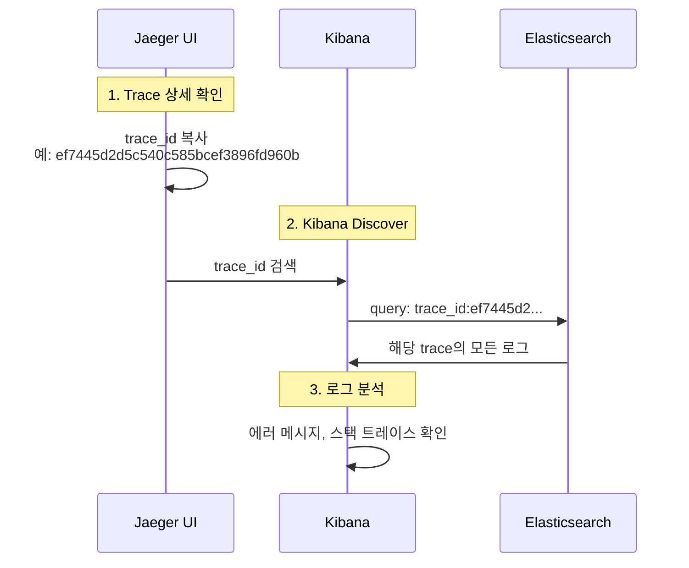

# 이코에코(Eco²) Observability #12: Log-Trace 연동 및 Kibana 검색 구조

> **시리즈**: Eco² Observability Enhancement  
> **작성일**: 2025-12-18  
> **태그**: `#FluentBit` `#Kibana` `#Elasticsearch` `#TraceCorrelation` `#ECS`

---

## 📋 개요

분산 시스템에서 로그와 트레이스를 연결하는 것은 디버깅의 핵심입니다. 이 문서에서는 Kibana에서 `trace_id`로 로그를 검색할 수 없었던 문제를 분석하고 해결한 과정을 다룹니다.

---

## 🔍 문제 상황

### 증상

Jaeger에서 확인한 `trace_id`로 Kibana에서 로그 검색 시 결과 없음.

```
# Kibana 검색 (실패)
trace.id:1598486b3c023e05db07590939154b51
→ No results match your search criteria
```

### 기대 동작

애플리케이션 로그에 `trace.id`가 포함되어 있으므로, 해당 값으로 검색 가능해야 함.

```json
// 애플리케이션 로그 출력 (kubectl logs)
{
  "@timestamp": "2025-12-18T07:04:51.886+00:00",
  "message": "Scan pipeline finished",
  "trace.id": "ef7445d2d5c540c585bcef3896fd960b",
  "span.id": "35ecc51ed1958ea4",
  "service.name": "scan-api"
}
```

---

## 📊 로그 파이프라인 분석

### 로그 흐름

```
App (JSON) → containerd (CRI) → Fluent Bit → Elasticsearch → Kibana
```

### 각 단계별 로그 구조 변화

#### 1. 애플리케이션 출력 (ECS JSON)

```json
{
  "@timestamp": "2025-12-18T07:04:51.886+00:00",
  "message": "Scan pipeline finished",
  "log.level": "info",
  "trace.id": "ef7445d2d5c540c585bcef3896fd960b",
  "span.id": "35ecc51ed1958ea4",
  "service.name": "scan-api"
}
```

#### 2. containerd CRI 래핑

containerd가 로그를 CRI 포맷으로 래핑:

```
2025-12-18T16:04:51.886+09:00 stdout F {"@timestamp": "2025-12-18T07:04:51.886+00:00", "message": "Scan pipeline finished", ...}
```

| 필드 | 값 | 설명 |
|------|-----|------|
| `time` | `2025-12-18T16:04:51.886+09:00` | containerd 타임스탬프 |
| `stream` | `stdout` | 출력 스트림 |
| `logtag` | `F` | Full (완전한 라인) |
| `log` | `{...JSON...}` | **원본 JSON이 문자열로 저장** |

#### 3. Fluent Bit 처리 후 (Elasticsearch 저장)

```json
{
  "@timestamp": "2025-12-18T07:04:51.886Z",
  "time": "2025-12-18T16:04:51.886+09:00",
  "stream": "stdout",
  "logtag": "F",
  "log": "{\"@timestamp\": \"2025-12-18T07:04:51.886+00:00\", ...}",
  "log_processed": {
    "@timestamp": "2025-12-18T07:04:51.886+00:00",
    "message": "Scan pipeline finished",
    "log_level": "info",
    "trace_id": "ef7445d2d5c540c585bcef3896fd960b",
    "span_id": "35ecc51ed1958ea4",
    "service_name": "scan-api"
  },
  "cluster": "eco2-dev",
  "environment": "dev",
  "k8s_namespace_name": "scan",
  "k8s_pod_name": "scan-api-59d5788d7-q7qcc",
  "k8s_container_name": "scan-api",
  "k8s_labels": {
    "app": "scan-api",
    "domain": "scan"
  }
}
```

---

## 🔧 원인 분석

### Fluent Bit 설정 검토

```ini
[FILTER]
    Name                kubernetes
    Match               kube.*
    Merge_Log           On
    Merge_Log_Key       log_processed    # ← 여기가 문제
    ...

[OUTPUT]
    Name            es
    Replace_Dots    On                    # ← trace.id → trace_id
    ...
```

### 문제점

| 설정 | 효과 | 결과 |
|------|------|------|
| `Merge_Log On` | JSON 로그를 파싱 | ✅ 정상 |
| `Merge_Log_Key log_processed` | 파싱 결과를 중첩 키에 저장 | ⚠️ 필드 접근 복잡 |
| `Replace_Dots On` | `.`을 `_`로 변환 | `trace.id` → `trace_id` |

### 실제 검색 경로

```
# 원하는 검색
trace.id:xxx

# 실제 필요한 검색 (문제 원인)
log_processed.trace_id:xxx
```

---

## ✅ 해결: Fluent Bit Nest Lift Filter 추가

### 수정 내용

`workloads/logging/base/fluent-bit.yaml`:

```ini
[FILTER]
    Name          nest
    Match         kube.*
    Operation     lift
    Nested_under  kubernetes
    Add_prefix    k8s_

# [신규 추가] log_processed 필드를 최상위로 올림
[FILTER]
    Name          nest
    Match         kube.*
    Operation     lift
    Nested_under  log_processed
```

### Nest Lift Filter 동작

```
# Before (중첩)
{
  "log_processed": {
    "trace_id": "abc123",
    "message": "hello"
  }
}

# After (평탄화)
{
  "trace_id": "abc123",
  "message": "hello"
}
```

### 적용

```bash
# ConfigMap 업데이트
kubectl apply -f workloads/logging/base/fluent-bit.yaml

# DaemonSet 재시작
kubectl rollout restart daemonset fluent-bit -n logging
```

---

## 📝 Kibana 검색 가이드

### 검색 필드 경로

| 시기 | 검색 쿼리 | 비고 |
|------|-----------|------|
| **수정 전** | `log_processed.trace_id:xxx` | 중첩 경로 필요 |
| **수정 후** | `trace_id:xxx` | 최상위 필드로 직접 검색 |

### 유용한 검색 쿼리

```kql
# 특정 trace의 모든 로그
trace_id:ef7445d2d5c540c585bcef3896fd960b

# 특정 서비스의 에러 로그
service_name:scan-api AND log_level:error

# 특정 시간대 + trace 조합
trace_id:xxx AND @timestamp >= "2025-12-18T07:00:00"
```

### 필드 매핑 참조

| 애플리케이션 출력 | Elasticsearch 필드 | 설명 |
|------------------|-------------------|------|
| `trace.id` | `trace_id` | Replace_Dots로 변환 |
| `span.id` | `span_id` | Replace_Dots로 변환 |
| `log.level` | `log_level` | Replace_Dots로 변환 |
| `service.name` | `service_name` | Replace_Dots로 변환 |
| `ecs.version` | `ecs_version` | Replace_Dots로 변환 |

---

## 📊 최종 로그 구조

### Elasticsearch 문서 스키마

```json
{
  // === Timestamp ===
  "@timestamp": "2025-12-18T07:04:51.886Z",
  
  // === 원본 로그 (CRI) ===
  "time": "2025-12-18T16:04:51.886+09:00",
  "stream": "stdout",
  "logtag": "F",
  "log": "{...원본 JSON...}",
  
  // === 파싱된 앱 로그 (lift 후 최상위) ===
  "message": "Scan pipeline finished",
  "log_level": "info",
  "trace_id": "ef7445d2d5c540c585bcef3896fd960b",
  "span_id": "35ecc51ed1958ea4",
  "service_name": "scan-api",
  "service_version": "1.0.7",
  "service_environment": "dev",
  "ecs_version": "8.11.0",
  
  // === 클러스터 메타데이터 ===
  "cluster": "eco2-dev",
  "environment": "dev",
  
  // === Kubernetes 메타데이터 (k8s_ prefix) ===
  "k8s_namespace_name": "scan",
  "k8s_pod_name": "scan-api-59d5788d7-q7qcc",
  "k8s_container_name": "scan-api",
  "k8s_host": "k8s-api-scan",
  "k8s_labels": {
    "app": "scan-api",
    "domain": "scan",
    "version": "v1"
  }
}
```

### 필드 그룹 설명

| 그룹 | Prefix | 용도 |
|------|--------|------|
| Timestamp | `@timestamp`, `time` | 시간 기반 쿼리 |
| CRI 원본 | `stream`, `logtag`, `log` | 디버깅용 원본 보존 |
| 앱 로그 | `message`, `log_level`, `trace_id` | 비즈니스 로직 추적 |
| 클러스터 | `cluster`, `environment` | 멀티 클러스터 구분 |
| K8s 메타 | `k8s_*` | 리소스 기반 필터링 |

---

## 🔗 Jaeger ↔ Kibana 연동 워크플로우

### Trace ID로 로그 찾기



### 실제 사용 예시

1. **Jaeger에서 문제 trace 식별**
   - URL: `https://jaeger.dev.growbin.app/trace/ef7445d2d5c540c585bcef3896fd960b`
   - 느린 span 또는 에러 발견

2. **Kibana에서 상세 로그 확인**
   - URL: `https://kibana.dev.growbin.app/app/discover`
   - 쿼리: `trace_id:ef7445d2d5c540c585bcef3896fd960b`
   - 해당 요청의 모든 로그 확인

---

## 📌 참고: Replace_Dots 설정 이유

### 문제: Elasticsearch 필드명 제약

Elasticsearch 7.x 이하에서 필드명에 `.`이 포함되면 object hierarchy로 해석됨.

```json
// 의도: 단일 필드
{ "trace.id": "abc" }

// ES 해석: 중첩 객체
{ "trace": { "id": "abc" } }
```

### 해결: Fluent Bit Replace_Dots

```ini
[OUTPUT]
    Name            es
    Replace_Dots    On    # trace.id → trace_id
```

### 트레이드오프

| 옵션 | 장점 | 단점 |
|------|------|------|
| `Replace_Dots On` | ES 호환성 보장 | ECS 필드명과 불일치 |
| `Replace_Dots Off` | ECS 표준 유지 | ES 매핑 복잡 |

**선택**: `Replace_Dots On` (운영 안정성 우선)

---

## 🏷️ 커밋

```
feat(logging): lift log_processed fields to top level for trace correlation

- Add nest lift filter to promote log_processed fields to root level
- Enables direct trace_id/span_id search in Kibana without nested path
- Before: log_processed.trace_id:xxx
- After: trace_id:xxx
```

**SHA**: `39b662a7`
