# 이코에코(Eco²) Observability #12: Log-Trace 연동 및 Kibana 검색 구조

> **시리즈**: Eco² Observability Enhancement  
> **작성일**: 2025-12-18  
> **태그**: `#FluentBit` `#Kibana` `#Elasticsearch` `#TraceCorrelation` `#ECS`

---

## 📋 개요

분산 시스템에서 로그와 트레이스를 연결하는 것은 디버깅의 핵심입니다. 이 문서에서는 Kibana에서 `trace_id`로 로그를 검색할 수 없었던 문제를 분석하고 해결한 과정을 다룹니다.

---

## 🔍 문제 상황

### 증상

Jaeger에서 확인한 `trace_id`로 Kibana에서 로그 검색 시 결과 없음.

```
# Kibana 검색 (실패)
trace.id:1598486b3c023e05db07590939154b51
→ No results match your search criteria
```

### 기대 동작

애플리케이션 로그에 `trace.id`가 포함되어 있으므로, 해당 값으로 검색 가능해야 함.

```json
// 애플리케이션 로그 출력 (kubectl logs)
{
  "@timestamp": "2025-12-18T07:04:51.886+00:00",
  "message": "Scan pipeline finished",
  "trace.id": "ef7445d2d5c540c585bcef3896fd960b",
  "span.id": "35ecc51ed1958ea4",
  "service.name": "scan-api"
}
```

---

## 📊 로그 파이프라인 분석

### 로그 흐름

```
App (JSON) → containerd (CRI) → Fluent Bit → Elasticsearch → Kibana
```

### 각 단계별 로그 구조 변화

#### 1. 애플리케이션 출력 (ECS JSON)

```json
{
  "@timestamp": "2025-12-18T07:04:51.886+00:00",
  "message": "Scan pipeline finished",
  "log.level": "info",
  "trace.id": "ef7445d2d5c540c585bcef3896fd960b",
  "span.id": "35ecc51ed1958ea4",
  "service.name": "scan-api"
}
```

#### 2. containerd CRI 래핑

containerd가 로그를 CRI 포맷으로 래핑:

```
2025-12-18T16:04:51.886+09:00 stdout F {"@timestamp": "2025-12-18T07:04:51.886+00:00", "message": "Scan pipeline finished", ...}
```

| 필드 | 값 | 설명 |
|------|-----|------|
| `time` | `2025-12-18T16:04:51.886+09:00` | containerd 타임스탬프 |
| `stream` | `stdout` | 출력 스트림 |
| `logtag` | `F` | Full (완전한 라인) |
| `log` | `{...JSON...}` | **원본 JSON이 문자열로 저장** |

#### 3. Fluent Bit 처리 후 (Elasticsearch 저장)

```json
{
  "@timestamp": "2025-12-18T07:04:51.886Z",
  "time": "2025-12-18T16:04:51.886+09:00",
  "stream": "stdout",
  "logtag": "F",
  "log": "{\"@timestamp\": \"2025-12-18T07:04:51.886+00:00\", ...}",
  "log_processed": {
    "@timestamp": "2025-12-18T07:04:51.886+00:00",
    "message": "Scan pipeline finished",
    "log_level": "info",
    "trace_id": "ef7445d2d5c540c585bcef3896fd960b",
    "span_id": "35ecc51ed1958ea4",
    "service_name": "scan-api"
  },
  "cluster": "eco2-dev",
  "environment": "dev",
  "k8s_namespace_name": "scan",
  "k8s_pod_name": "scan-api-59d5788d7-q7qcc",
  "k8s_container_name": "scan-api",
  "k8s_labels": {
    "app": "scan-api",
    "domain": "scan"
  }
}
```

---

## 🔧 원인 분석

### Fluent Bit 설정 검토

```ini
[FILTER]
    Name                kubernetes
    Match               kube.*
    Merge_Log           On
    Merge_Log_Key       log_processed    # ← 여기가 문제
    ...

[OUTPUT]
    Name            es
    Replace_Dots    On                    # ← trace.id → trace_id
    ...
```

### 문제점

| 설정 | 효과 | 결과 |
|------|------|------|
| `Merge_Log On` | JSON 로그를 파싱 | ✅ 정상 |
| `Merge_Log_Key log_processed` | 파싱 결과를 중첩 키에 저장 | ⚠️ 필드 접근 복잡 |
| `Replace_Dots On` | `.`을 `_`로 변환 | `trace.id` → `trace_id` |

### 실제 검색 경로

```
# 원하는 검색
trace.id:xxx

# 실제 필요한 검색 (문제 원인)
log_processed.trace_id:xxx
```

---

## ✅ 해결: Fluent Bit Nest Lift Filter 추가

### 수정 내용

`workloads/logging/base/fluent-bit.yaml`:

```ini
[FILTER]
    Name          nest
    Match         kube.*
    Operation     lift
    Nested_under  kubernetes
    Add_prefix    k8s_

# [신규 추가] log_processed 필드를 최상위로 올림
[FILTER]
    Name          nest
    Match         kube.*
    Operation     lift
    Nested_under  log_processed
```

### Nest Lift Filter 동작

```
# Before (중첩)
{
  "log_processed": {
    "trace_id": "abc123",
    "message": "hello"
  }
}

# After (평탄화)
{
  "trace_id": "abc123",
  "message": "hello"
}
```

### 적용

```bash
# ConfigMap 업데이트
kubectl apply -f workloads/logging/base/fluent-bit.yaml

# DaemonSet 재시작
kubectl rollout restart daemonset fluent-bit -n logging
```

---

## 📝 Kibana 검색 가이드

### 검색 필드 경로

| 시기 | 검색 쿼리 | 비고 |
|------|-----------|------|
| **수정 전** | `log_processed.trace_id:xxx` | 중첩 경로 필요 |
| **수정 후** | `trace_id:xxx` | 최상위 필드로 직접 검색 |

### 유용한 검색 쿼리

```kql
# 특정 trace의 모든 로그
trace_id:ef7445d2d5c540c585bcef3896fd960b

# 특정 서비스의 에러 로그
service_name:scan-api AND log_level:error

# 특정 시간대 + trace 조합
trace_id:xxx AND @timestamp >= "2025-12-18T07:00:00"
```

### 필드 매핑 참조

| 애플리케이션 출력 | Elasticsearch 필드 | 설명 |
|------------------|-------------------|------|
| `trace.id` | `trace_id` | Replace_Dots로 변환 |
| `span.id` | `span_id` | Replace_Dots로 변환 |
| `log.level` | `log_level` | Replace_Dots로 변환 |
| `service.name` | `service_name` | Replace_Dots로 변환 |
| `ecs.version` | `ecs_version` | Replace_Dots로 변환 |

---

## 📊 최종 로그 구조

### Elasticsearch 문서 스키마

```json
{
  // === Timestamp ===
  "@timestamp": "2025-12-18T07:04:51.886Z",
  
  // === 원본 로그 (CRI) ===
  "time": "2025-12-18T16:04:51.886+09:00",
  "stream": "stdout",
  "logtag": "F",
  "log": "{...원본 JSON...}",
  
  // === 파싱된 앱 로그 (lift 후 최상위) ===
  "message": "Scan pipeline finished",
  "log_level": "info",
  "trace_id": "ef7445d2d5c540c585bcef3896fd960b",
  "span_id": "35ecc51ed1958ea4",
  "service_name": "scan-api",
  "service_version": "1.0.7",
  "service_environment": "dev",
  "ecs_version": "8.11.0",
  
  // === 클러스터 메타데이터 ===
  "cluster": "eco2-dev",
  "environment": "dev",
  
  // === Kubernetes 메타데이터 (k8s_ prefix) ===
  "k8s_namespace_name": "scan",
  "k8s_pod_name": "scan-api-59d5788d7-q7qcc",
  "k8s_container_name": "scan-api",
  "k8s_host": "k8s-api-scan",
  "k8s_labels": {
    "app": "scan-api",
    "domain": "scan",
    "version": "v1"
  }
}
```

### 필드 그룹 설명

| 그룹 | Prefix | 용도 |
|------|--------|------|
| Timestamp | `@timestamp`, `time` | 시간 기반 쿼리 |
| CRI 원본 | `stream`, `logtag`, `log` | 디버깅용 원본 보존 |
| 앱 로그 | `message`, `log_level`, `trace_id` | 비즈니스 로직 추적 |
| 클러스터 | `cluster`, `environment` | 멀티 클러스터 구분 |
| K8s 메타 | `k8s_*` | 리소스 기반 필터링 |

---

## 🔗 Jaeger ↔ Kibana 연동 워크플로우

### Trace ID로 로그 찾기

```mermaid
sequenceDiagram
    participant J as Jaeger UI
    participant K as Kibana
    participant ES as Elasticsearch
    
    Note over J: 1. Trace 상세 확인
    J->>J: trace_id 복사<br/>예: ef7445d2d5c540c585bcef3896fd960b
    
    Note over K: 2. Kibana Discover
    J->>K: trace_id 검색
    K->>ES: query: trace_id:ef7445d2...
    ES->>K: 해당 trace의 모든 로그
    
    Note over K: 3. 로그 분석
    K->>K: 에러 메시지, 스택 트레이스 확인
```



### 실제 사용 예시

1. **Jaeger에서 문제 trace 식별**
   - URL: `https://jaeger.dev.growbin.app/trace/ef7445d2d5c540c585bcef3896fd960b`
   - 느린 span 또는 에러 발견

2. **Kibana에서 상세 로그 확인**
   - URL: `https://kibana.dev.growbin.app/app/discover`
   - 쿼리: `trace_id:ef7445d2d5c540c585bcef3896fd960b`
   - 해당 요청의 모든 로그 확인

---

## 📌 참고: Replace_Dots 설정 이유

### 문제: Elasticsearch 필드명 제약

Elasticsearch는 기본적으로 필드명에 `.`이 포함되면 object hierarchy로 해석한다.

```json
// 의도: 단일 필드
{ "trace.id": "abc" }

// ES 해석: 중첩 객체
{ "trace": { "id": "abc" } }
```

### ES 8.x 이후: subobjects 옵션

Elasticsearch 8.3+에서 `subobjects: false` 매핑 옵션이 추가되었다.

```json
PUT logs-template
{
  "mappings": {
    "subobjects": false,
    "properties": {
      "trace.id": { "type": "keyword" },
      "span.id": { "type": "keyword" },
      "log.level": { "type": "keyword" }
    }
  }
}
```

이 설정으로 dot 필드명을 평탄하게 유지할 수 있다. 현재 클러스터 버전 **8.11.0**에서 사용 가능.

> 📎 참고: [Elasticsearch subobjects 공식 문서](https://www.elastic.co/docs/reference/elasticsearch/mapping-reference/subobjects)

### 현재 선택: Replace_Dots On

| 옵션 | 장점 | 단점 |
|------|------|------|
| `Replace_Dots On` | 설정 간단, 호환성 보장 | ECS 필드명과 불일치 (`trace_id`) |
| `subobjects: false` | ECS 표준 유지 (`trace.id`) | Index Template 설정 필요 |

**현재 선택**: Fluent Bit 파싱 + `Replace_Dots Off` + `subobjects: false` Index Template

핵심: **Fluent Bit에서 JSON 파싱 (부하분산) + ES에서 dot 필드명 유지**

1. Fluent Bit: `Merge_Log On` - JSON 파싱하여 필드 추출 (각 노드에서 분산 처리)
2. Fluent Bit OUTPUT: `Replace_Dots Off` - dot notation 그대로 ES 전송
3. Index Template: `subobjects: false` - ES가 dot을 nested로 해석하지 않음

```
App (JSON log) → Fluent Bit (parse + distributed) → ES (subobjects:false) → Index
                      ↓                                    ↓
              각 노드에서 분산 파싱                  trace.id, log.level 등 ECS 필드명 유지
```

### 구현 파일

| 파일 | 설정 |
|------|------|
| `workloads/logging/base/fluent-bit.yaml` | `Merge_Log On`, `Replace_Dots Off` |
| `workloads/logging/base/elasticsearch-index-template.yaml` | `subobjects: false` Index Template |

### 장점

- **부하분산**: 각 노드의 DaemonSet에서 분산 파싱 (ES 부하 감소)
- **ECS 표준**: dot notation 필드명 유지 (`trace.id`, `log.level`)
- **단순성**: ES Ingest Pipeline 불필요

---

---

## 🔧 에러 로깅에 trace.id 추가

### 문제 상황

401/403 에러 응답에도 `trace.id`가 로그에 포함되어야 하지만, 에러 핸들러에서 로깅이 없어서 trace 연동이 불가능했음.

### 원인

```python
# 기존 코드 (로깅 없음)
async def http_exception_handler(request: Request, exc: HTTPException) -> JSONResponse:
    error_response = ErrorResponse(...)
    return JSONResponse(...)  # 로깅 없이 바로 응답
```

### 해결

`domains/auth/core/exceptions.py`에 에러 로깅 추가:

```python
import logging
logger = logging.getLogger(__name__)

async def http_exception_handler(request: Request, exc: HTTPException) -> JSONResponse:
    # 에러 로깅 (trace.id 자동 포함)
    log_level = logging.WARNING if exc.status_code < 500 else logging.ERROR
    logger.log(
        log_level,
        f"HTTP {exc.status_code} {error_code}: {exc.detail}",
        extra={
            "http.request.method": request.method,
            "url.path": request.url.path,
            "http.response.status_code": exc.status_code,
            "error.code": error_code,
        },
    )
    ...
```

### 결과

```json
{
  "@timestamp": "2025-12-18T09:31:11.811+00:00",
  "message": "HTTP 401 UNAUTHORIZED: Missing refresh token",
  "log.level": "warning",
  "trace.id": "5fdc8e113b2618f6006a00c89347d78a",
  "span.id": "e470f4fc8f8fa1f6",
  "service.name": "auth-api",
  "http.response.status_code": 401,
  "url.path": "/api/v1/auth/refresh"
}
```

이제 **401/403 에러도 trace.id로 추적 가능**!

---

## 📝 Kibana에서 service.name 표시 확인

### 문제

Kibana에서 `service.name` 컬럼이 `-`로 표시됨.

### 원인

1. **Data View 필드 미갱신**: 새 필드가 아직 인식되지 않음
2. **일부 로그만 해당 필드 보유**: 시스템 로그(argocd 등)에는 `service.name`이 없음

### 확인

ES에서 직접 검색하면 정상:

```bash
# service.name으로 검색
curl "ES/_search" -d '{"query":{"term":{"service.name":"auth-api"}}}'

# 결과
{
  "message": "HTTP 401 UNAUTHORIZED: Missing refresh token",
  "service.name": "auth-api"  # ✅ 정상 저장됨
}
```

### 해결 방법

1. **Kibana Data View 새로고침**:
   - Stack Management → Data Views → logs-* → Refresh field list

2. **검색 필터로 애플리케이션 로그만 표시**:
   ```kql
   service.name:* AND NOT k8s_namespace_name:(kube-system OR argocd OR logging)
   ```

---

## 🏷️ 커밋

```
feat(logging): lift log_processed fields to top level for trace correlation

- Add nest lift filter to promote log_processed fields to root level
- Enables direct trace_id/span_id search in Kibana without nested path
- Before: log_processed.trace_id:xxx
- After: trace_id:xxx
```

**SHA**: `39b662a7`

---

```
feat(auth): add error logging with trace context

- Log HTTP errors (401, 403, etc.) with trace.id for correlation
- Log validation errors with field information
- Log unexpected exceptions with full traceback
- Enables trace.id search in Kibana for error debugging
```

**SHA**: `eecc958b`

---

## 🔧 시스템 로그 ECS 표준화

### 문제 상황

Kibana Discover에서 `service.name` 필드가 Available fields에 표시되지 않음.

```
# 통계
- service.name 있는 로그: 57건 (0.3%)
- 전체 로그: 19,015건 (100%)
→ 99.7%가 시스템 로그 (calico, argocd 등)로 service.name 없음
```

### Kibana Discover 동작 원리

| 영역 | 표시 필드 |
|------|----------|
| **Available fields** | 현재 검색 결과에 **값이 있는** 필드만 표시 |
| **Empty fields** | 현재 검색 결과에 **값이 없는** 필드 |
| **Data View Management** | 전체 매핑된 필드 표시 (521개) |

`service.name`이 0.3%에만 있으니 기본 검색에서 Empty fields로 분류됨.

### 해결: 시스템 로그에 ECS 필드 자동 매핑

K8s 메타데이터를 활용하여 모든 로그에 `service.name` 자동 추가.

#### 라벨 분석

```
# 앱 로그 (우리 서비스)
app=auth-api, domain=auth, environment=dev, version=v1

# 시스템 로그 (ArgoCD, Istio)
app.kubernetes.io/name=argocd-server

# 시스템 로그 (Calico)
k8s-app=calico-node
```

#### ECS 매핑 전략

| ECS 필드 | 소스 (우선순위) |
|----------|----------------|
| `service.name` | `app` > `app.kubernetes.io/name` > `k8s-app` > `container_name` |
| `service.environment` | `environment` 라벨 > `namespace` |
| `service.version` | `version` > `app.kubernetes.io/version` |
| `kubernetes.namespace` | namespace 정보 |
| `kubernetes.pod.name` | Pod 이름 |
| `kubernetes.labels.*` | 모든 라벨 보존 |

### 구현: Fluent Bit Lua 필터

`workloads/logging/base/fluent-bit.yaml`:

```ini
# ECS 필드 자동 매핑 - K8s 메타데이터에서 ECS 표준 필드 생성
[FILTER]
    Name          lua
    Match         kube.*
    script        /fluent-bit/etc/ecs-enrichment.lua
    call          enrich_with_ecs_fields
```

#### Lua 스크립트 (ecs-enrichment.lua)

```lua
function enrich_with_ecs_fields(tag, timestamp, record)
    local modified = false
    
    -- 1. service.name 매핑 (앱 로그에서 이미 있으면 유지)
    if not record["service.name"] then
        local service_name = record["k8s_labels_app"]
                          or record["k8s_labels_app.kubernetes.io/name"]
                          or record["k8s_labels_k8s-app"]
                          or record["k8s_container_name"]
        
        if service_name then
            record["service.name"] = service_name
            modified = true
        end
    end
    
    -- 2. service.environment 매핑
    if not record["service.environment"] then
        local env = record["k8s_labels_environment"]
                 or record["k8s_namespace_name"]
        
        if env then
            record["service.environment"] = env
            modified = true
        end
    end
    
    -- 3. service.version 매핑
    if not record["service.version"] then
        local version = record["k8s_labels_version"]
                     or record["k8s_labels_app.kubernetes.io/version"]
        
        if version then
            record["service.version"] = version
            modified = true
        end
    end
    
    -- 4. kubernetes.* ECS 필드 매핑
    if record["k8s_namespace_name"] then
        record["kubernetes.namespace"] = record["k8s_namespace_name"]
        modified = true
    end
    
    if record["k8s_pod_name"] then
        record["kubernetes.pod.name"] = record["k8s_pod_name"]
        modified = true
    end
    
    -- 5. kubernetes.labels 객체로 라벨 보존
    local labels = {}
    local label_keys = {"app", "domain", "environment", "version", "tier", ...}
    
    for _, key in ipairs(label_keys) do
        local label_field = "k8s_labels_" .. key
        if record[label_field] then
            labels[key] = record[label_field]
        end
    end
    
    if next(labels) ~= nil then
        record["kubernetes.labels"] = labels
        modified = true
    end
    
    if modified then
        return 1, timestamp, record
    else
        return 0, timestamp, record
    end
end
```

### 적용 후 결과

#### 시스템 로그 (Calico)

```json
{
  "service.name": "calico-node",
  "service.environment": "kube-system",
  "kubernetes.namespace": "kube-system",
  "kubernetes.pod.name": "calico-node-4t5k9",
  "kubernetes.labels": {
    "k8s-app": "calico-node"
  }
}
```

#### 시스템 로그 (ArgoCD)

```json
{
  "service.name": "argocd-server",
  "service.environment": "argocd",
  "kubernetes.namespace": "argocd",
  "kubernetes.labels": {
    "app.kubernetes.io/name": "argocd-server"
  }
}
```

#### 앱 로그 (auth-api) - 기존 유지

```json
{
  "service.name": "auth-api",
  "service.environment": "dev",
  "service.version": "1.0.0",
  "trace.id": "abc123...",
  "kubernetes.labels": {
    "app": "auth-api",
    "domain": "auth",
    "tier": "business-logic"
  }
}
```

### 장점

| 항목 | 효과 |
|------|------|
| **검색 일관성** | 모든 로그에 `service.name` 보유 → Kibana 필터 항상 사용 가능 |
| **기존 로그 호환** | 앱 로그의 ECS 필드 유지 (Lua에서 조건부 처리) |
| **라벨 보존** | `kubernetes.labels` 객체로 원본 라벨 보존 |
| **ECS 표준 준수** | `kubernetes.*` 필드셋은 ECS 공식 스펙 |

### 적용 방법

```bash
# ConfigMap 업데이트
kubectl apply -f workloads/logging/base/fluent-bit.yaml

# DaemonSet 재시작
kubectl rollout restart daemonset fluent-bit -n logging

# 확인
kubectl get pods -n logging -w
```

---

## 🏷️ 커밋

```
feat(logging): add ECS enrichment for system logs via Lua filter

- Add Lua filter to map K8s labels to ECS fields (service.name, etc.)
- Priority: app > app.kubernetes.io/name > k8s-app > container_name
- Preserve app logs' existing ECS fields (conditional mapping)
- Add kubernetes.labels object for label preservation
- All logs now have service.name for consistent Kibana filtering
```
