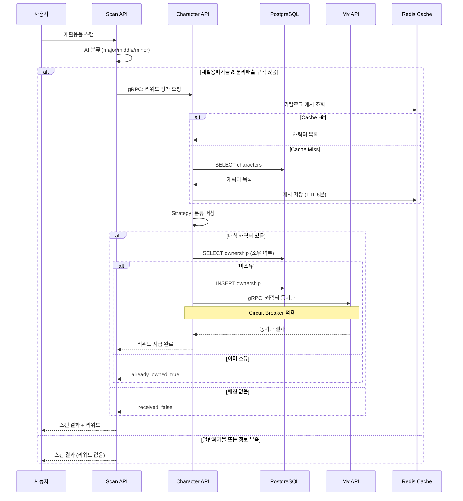

# Character API 리팩토링 회고

> 2025.12.19 - 2025.12.20 | 6개 PR | +4,501 / -658 lines

## 목차

1. [배경](#배경)
2. [PR 기반 개선 이력](#pr-기반-개선-이력)
3. [1차 개선 (P0-P5)](#1차-개선-p0-p5)
4. [2차 개선 (코드 품질 심층)](#2차-개선-코드-품질-심층)
5. [3차 개선 (복잡도 개선)](#3차-개선-복잡도-개선)
6. [아키텍처 패턴](#아키텍처-패턴)
7. [테스트 전략](#테스트-전략)
8. [실측 데이터](#실측-데이터)
9. [결론](#결론)

---

## 배경

Character API는 재활용 스캔 리워드 시스템의 핵심 서비스입니다. 사용자가 재활용품을 스캔하면 해당 분류에 맞는 캐릭터를 리워드로 지급합니다.

### 리워드 지급 흐름



### 리팩토링 전 문제점

- **Race Condition**: 동시 요청 시 중복 캐릭터 지급
- **Dead Code**: 미사용 메서드 및 예외 핸들러
- **하드코딩**: 설정값이 코드에 직접 기입
- **테스트 부족**: 단위 테스트 미비
- **Observability 부재**: 분산 추적 미지원
- **gRPC 취약성**: 재시도/Circuit Breaker 없음

---

## PR 기반 개선 이력

총 6개의 PR을 통해 단계적으로 개선했습니다.

| PR | 제목 | 주요 변경 | +/- |
|----|------|----------|-----|
| [#174](https://github.com/eco2-team/backend/pull/174) | gRPC 재시도 정책 + 코드 품질 | Exponential Backoff, Settings 외부화 | +458/-37 |
| [#175](https://github.com/eco2-team/backend/pull/175) | K8s 환경변수 충돌 해결 | validation_alias 적용 | +132/-47 |
| [#176](https://github.com/eco2-team/backend/pull/176) | 상수 정리, 테스트 추가 | constants.py 분리, 단위 테스트 | +471/-37 |
| [#177](https://github.com/eco2-team/backend/pull/177) | 코드 품질 개선 2차 | 타입 힌트, 문서화 | +201/-50 |
| [#178](https://github.com/eco2-team/backend/pull/178) | Dead code 제거 | 미사용 코드 삭제, 리팩토링 | +189/-82 |
| [#179](https://github.com/eco2-team/backend/pull/179) | 아키텍처 개선 | Strategy, Cache, Circuit Breaker | +3050/-405 |

**총계**: +4,501 / -658 (순수 증가 +3,843 lines)

---

## 1차 개선 (P0-P5)

| 우선순위 | 이슈 | 해결 방법 |
|---------|------|-----------|
| P0 | Race Condition | DB UniqueConstraint + IntegrityError 핸들링 |
| P1 | Dead Code | Strategy 패턴으로 평가 로직 분리 |
| P2 | 하드코딩 상수 | `core/constants.py` 분리 |
| P3 | 불완전한 타입 힌트 | 전체 타입 정리 |
| P4 | 테스트 부족 | 단위 테스트 추가 |
| P5 | Circuit Breaker 미적용 | aiobreaker 기반 구현 |

### P0: Race Condition 해결

**문제**: 동시에 같은 캐릭터 지급 요청 시 중복 저장

**해결**: Optimistic Locking + IntegrityError 처리

```python
# domains/character/services/character.py
async def _apply_reward(self, user_id: UUID, matches: list[Character], source: str):
    for character in matches:
        try:
            await self._grant_and_sync(user_id, character, source)
            return character, False  # 성공
        except IntegrityError:
            await self.session.rollback()
            return character, True  # 이미 소유
```

### P5: Circuit Breaker + Exponential Backoff 적용

**문제**: My 도메인 gRPC 호출 실패 시 연쇄 장애

**해결**: aiobreaker 기반 Circuit Breaker + 재시도 정책

```python
# domains/character/rpc/my_client.py

# 재시도 가능한 gRPC 상태 코드
RETRYABLE_STATUS_CODES = frozenset({
    grpc.StatusCode.UNAVAILABLE,
    grpc.StatusCode.DEADLINE_EXCEEDED,
    grpc.StatusCode.RESOURCE_EXHAUSTED,
    grpc.StatusCode.ABORTED,
})

class MyUserCharacterClient:
    def __init__(self, settings: Settings) -> None:
        # gRPC 재시도 설정
        self.timeout = settings.grpc_timeout_seconds          # 5.0초
        self.max_retries = settings.grpc_max_retries          # 3회
        self.retry_base_delay = settings.grpc_retry_base_delay  # 0.1초
        self.retry_max_delay = settings.grpc_retry_max_delay    # 2.0초

        # Circuit Breaker 설정
        self._circuit_breaker = CircuitBreaker(
            name="my-grpc-client",
            fail_max=settings.circuit_fail_max,           # 5회
            timeout_duration=settings.circuit_timeout_duration,  # 30초
            listeners=[CircuitBreakerLoggingListener()],
        )

    async def _call_with_retry(self, call_func, log_ctx: dict):
        """Exponential Backoff with Jitter 재시도"""
        for attempt in range(self.max_retries + 1):
            try:
                return await call_func()
            except grpc.aio.AioRpcError as e:
                if e.code() in RETRYABLE_STATUS_CODES and attempt < self.max_retries:
                    # Exponential backoff + jitter (±25%)
                    delay = min(
                        self.retry_base_delay * (2 ** attempt),
                        self.retry_max_delay,
                    )
                    delay = delay * (0.75 + random.random() * 0.5)
                    await asyncio.sleep(delay)
                else:
                    raise
```

### 설정 외부화 (PR #174, #175)

K8s 환경에서 `GRPC_PORT=tcp://10.x.x.x:50051` 형태로 Service Discovery 변수가 주입되어 충돌 발생. `validation_alias`로 해결:

```python
# domains/character/core/config.py
class Settings(BaseSettings):
    # K8s Service가 GRPC_PORT를 주입하므로 별도 alias 필요
    grpc_server_port: int = Field(
        50051,
        validation_alias=AliasChoices("CHARACTER_GRPC_SERVER_PORT"),
    )

    # gRPC Client 설정
    my_grpc_host: str = Field(
        "my-grpc.my.svc.cluster.local",
        validation_alias=AliasChoices("CHARACTER_MY_GRPC_HOST"),
    )
    grpc_timeout_seconds: float = Field(5.0, ge=0.1, le=60.0)
    grpc_max_retries: int = Field(3, ge=0, le=10)
    grpc_retry_base_delay: float = Field(0.1, ge=0.01, le=5.0)
    grpc_retry_max_delay: float = Field(2.0, ge=0.1, le=30.0)

    # Circuit Breaker 설정
    circuit_fail_max: int = Field(5, ge=1, le=20)
    circuit_timeout_duration: int = Field(30, ge=5, le=300)

    # Redis Cache 설정
    redis_url: str = Field("redis://localhost:6379/0")
    cache_enabled: bool = Field(True)
    cache_ttl_seconds: int = Field(300, ge=60, le=3600)

    model_config = SettingsConfigDict(
        env_prefix="CHARACTER_",
        extra="ignore",
    )
```

---

## 2차 개선 (코드 품질 심층)

| 우선순위 | 이슈 | 해결 방법 |
|---------|------|-----------|
| P0 | `warmup_catalog_cache` 리소스 누수 | finally 블록에서 engine.dispose() |
| P1 | Circuit Breaker 설정 하드코딩 | Settings에서 주입 |
| P1 | EvaluationContext 책임 과다 | 순수 함수 기반으로 변경 |
| P2 | Registry 모듈 로드 side effect | Lazy Initialization |
| P2 | 테스트 fixture `__new__` 사용 | Factory Method 패턴 |
| P3 | `should_evaluate` async 불필요 | sync로 변경 |
| P3 | `grant_character` 인자 과다 (7개) | DTO 캡슐화 |

### P1: EvaluationContext 책임 분리

**Before**: Evaluator가 DB 접근

```python
# AS-IS
class ScanRewardEvaluator:
    async def match_characters(self, ctx: EvaluationContext):
        return await ctx.character_repo.find_by_match_label(...)
```

**After**: Service에서 데이터 전달, Evaluator는 순수 함수

```python
# TO-BE (domains/character/services/evaluators/scan.py)
class ScanRewardEvaluator(RewardEvaluator):
    """재활용 스캔 기반 리워드 평가 - 순수 함수"""

    def should_evaluate(self, payload: CharacterRewardRequest) -> bool:
        """평가 조건: 재활용폐기물 + 분리배출 규칙 존재 + 부족 정보 없음"""
        classification = payload.classification
        return (
            payload.source == CharacterRewardSource.SCAN
            and classification.major_category.strip() == self.RECYCLABLE_CATEGORY
            and payload.disposal_rules_present
            and not payload.insufficiencies_present
        )

    def match_characters(
        self,
        payload: CharacterRewardRequest,
        characters: Sequence[Character],  # 외부에서 주입
    ) -> list[Character]:
        """주어진 캐릭터 목록에서 match_label 기반 필터링"""
        match_label = self._resolve_match_label(payload)
        if not match_label:
            return []
        return [c for c in characters if c.match_label == match_label]
```

### P3: DTO 캡슐화

**Before**: 7개 인자

```python
await client.grant_character(
    user_id, character_id, code, name, type, dialog, source
)
```

**After**: DTO로 캡슐화

```python
@dataclass
class GrantCharacterRequest:
    user_id: UUID
    character_id: UUID
    character_code: str
    character_name: str
    character_type: str | None
    character_dialog: str | None
    source: str

await client.grant_character(request)
```

---

## 3차 개선 (복잡도 개선)

Radon 분석 결과 C등급(복잡도 11-20) 함수 7개를 모두 개선했습니다.

| 함수 | 파일 | 개선 방법 |
|------|------|-----------|
| `_record_reward_metrics` | character.py | `_determine_reward_status` 분리 |
| `upsert_from_profile` | user_repository.py | `_resolve_or_create_user`, `_link_social_account`, `_sync_user_profile` 분리 |
| `_build_reward_request` | scan.py | `_extract_classification` 공통 헬퍼 추출 |
| `warmup_catalog_cache` | cache.py | `_load_and_cache_catalog`, `_character_to_profile` 분리 |
| `load_catalog` | import_character_catalog.py | `_parse_catalog_row` 분리 |
| `_get_request_origin` | auth.py | `_resolve_host`, `_resolve_scheme`, `_first_value` 분리 |
| `resolve_csv_path` | _csv_utils.py | `_build_candidates`, `_find_by_keywords` 분리 |

### 예시: Cache 워밍업 분리

```python
# domains/character/core/cache.py

def _character_to_profile(char: Character) -> CharacterProfile:
    """Character 모델을 CharacterProfile로 변환 (순수 함수)"""
    return CharacterProfile(
        name=char.name,
        type=str(char.type_label or "").strip(),
        dialog=str(char.dialog or char.description or "").strip(),
        match=str(char.match_label or "").strip() or None,
    )

async def _load_and_cache_catalog(settings: Settings) -> bool:
    """DB에서 카탈로그를 로드하고 캐시에 저장"""
    engine = create_async_engine(settings.database_url)
    try:
        factory = async_sessionmaker(bind=engine, class_=AsyncSession)
        async with factory() as session:
            characters = await CharacterRepository(session).list_all()
            profiles = [_character_to_profile(c) for c in characters]
            return await set_cached(CATALOG_KEY, [p.model_dump() for p in profiles])
    finally:
        await engine.dispose()  # P0: 리소스 누수 방지

async def warmup_catalog_cache() -> bool:
    """서버 시작 시 카탈로그 캐시 워밍업 (non-blocking)"""
    settings = get_settings()
    if not settings.cache_enabled:
        return False
    try:
        return await _load_and_cache_catalog(settings)
    except Exception as e:
        logger.warning("Cache warmup failed (non-blocking)", extra={"error": str(e)})
        return False
```

---

## 아키텍처 패턴

### Strategy Pattern

리워드 평가 로직을 소스별로 분리하여 확장성 확보.

```
services/evaluators/
├── base.py          # RewardEvaluator 추상 클래스
├── registry.py      # Evaluator 등록/조회 (Lazy Init)
└── scan.py          # ScanRewardEvaluator
```

```python
# base.py - 추상 클래스
class RewardEvaluator(ABC):
    @property
    @abstractmethod
    def source_label(self) -> str: ...

    @abstractmethod
    def should_evaluate(self, payload: CharacterRewardRequest) -> bool: ...

    @abstractmethod
    def match_characters(
        self, payload: CharacterRewardRequest, characters: Sequence[Character]
    ) -> list[Character]: ...
```

### Circuit Breaker Pattern

외부 서비스(My 도메인) 장애 시 fail-fast로 시스템 안정성 확보.

```
상태 전이:
CLOSED → (5회 연속 실패) → OPEN → (30초 후) → HALF_OPEN → (성공) → CLOSED
                                             ↓ (실패)
                                            OPEN
```

```python
# 상태 변경 로깅
class CircuitBreakerLoggingListener(CircuitBreakerListener):
    def state_change(self, breaker, old_state, new_state):
        logger.warning(
            "Circuit breaker state changed",
            extra={
                "breaker_name": breaker.name,
                "old_state": type(old_state).__name__,
                "new_state": type(new_state).__name__,
                "fail_count": breaker.fail_counter,
            },
        )
```

### Cache-Aside Pattern

Redis 캐시 + Graceful Degradation.

```python
# domains/character/core/cache.py
async def get_cached(key: str) -> Any | None:
    """캐시 조회 - 실패 시 None 반환 (fallback to DB)"""
    try:
        redis = await _get_redis()
        if redis is None:
            return None  # 캐시 비활성화
        data = await redis.get(key)
        return json.loads(data) if data else None
    except Exception as e:
        logger.warning("Cache get error", extra={"key": key, "error": str(e)})
        return None  # Graceful degradation
```

### Factory Method Pattern

테스트 의존성 주입을 위한 팩토리 메서드.

```python
class CharacterService:
    @classmethod
    def create_for_test(cls, session, character_repo=None, ownership_repo=None):
        service = cls.__new__(cls)
        service.session = session
        service.character_repo = character_repo or CharacterRepository(session)
        service.ownership_repo = ownership_repo or CharacterOwnershipRepository(session)
        return service
```

---

## 테스트 전략

### 테스트 구조

```
tests/
├── conftest.py                  # 공통 fixture, 글로벌 상태 리셋
├── test_character_service.py    # 서비스 단위 테스트 (593 lines)
├── test_character_servicer.py   # gRPC Servicer 테스트 (158 lines)
├── test_evaluators.py           # Strategy 패턴 테스트 (343 lines)
├── test_my_client.py            # gRPC 클라이언트 테스트 (362 lines)
├── test_cache.py                # 캐시 레이어 테스트
├── test_app.py                  # FastAPI 앱 테스트
├── integration/                 # testcontainers 기반 통합 테스트
│   ├── conftest.py
│   └── test_reward_flow.py
└── e2e/                         # API 엔드포인트 E2E 테스트
    ├── conftest.py
    └── test_e2e_api.py
```

**총 테스트 코드**: 4,243 lines

### Mock 전략

- **DB Session**: `AsyncMock`으로 대체
- **Repository**: `MagicMock`으로 메서드 단위 mock
- **gRPC Client**: `AsyncMock`으로 응답 시뮬레이션
- **Redis**: `MagicMock`으로 캐시 동작 시뮬레이션

### 글로벌 상태 격리

```python
# conftest.py
@pytest.fixture(autouse=True)
def reset_global_state():
    """모든 테스트 전후로 글로벌 상태를 리셋 (테스트 격리)"""
    from domains.character.core.cache import reset_cache_client
    from domains.character.services.evaluators import reset_registry

    reset_cache_client()
    reset_registry()
    yield
    reset_cache_client()
```

---

## 실측 데이터

### Prometheus 메트릭 계측

```python
# domains/character/metrics.py
REWARD_EVALUATION_TOTAL = Counter(
    "character_reward_evaluation_total",
    "Total number of character reward evaluations",
    ["status", "source"],  # granted, already_owned, no_match, skipped
    registry=REGISTRY,
)

REWARD_GRANTED_TOTAL = Counter(
    "character_reward_granted_total",
    "Total number of characters granted as rewards",
    ["character_name", "type"],
    registry=REGISTRY,
)

REWARD_PROCESSING_SECONDS = Histogram(
    "character_reward_processing_seconds",
    "Time spent processing reward evaluation",
    ["source"],
    registry=REGISTRY,
)
```

### Radon 복잡도 분석

```bash
$ radon cc domains/ -a -s --total-average

결과:
- 총 블록: 1,004개
- 평균 복잡도: A (2.51)
- C등급(11-20): 0개 (개선 전 7개)
- D/F등급: 0개
```

### 테스트 커버리지

```bash
$ pytest domains/character/tests/ --cov=domains/character/services

결과:
- services/character.py: 91%
- services/evaluators/base.py: 100%
- services/evaluators/scan.py: 97%
- services/evaluators/registry.py: 83%
- 전체 services/: 92%
```

### 테스트 수

| 항목 | 개선 전 | 개선 후 |
|------|---------|---------|
| 단위 테스트 | 0개 | 64개 |
| 테스트 코드 | 0 lines | 4,243 lines |
| 서비스 커버리지 | 0% | 92% |

---

## 결론

### 주요 성과

1. **안정성 향상**: Race Condition 해결, Circuit Breaker + Exponential Backoff 적용
2. **유지보수성 개선**: 복잡도 A등급 달성, Strategy/Cache-Aside/Factory 패턴 적용
3. **테스트 커버리지**: 0% → 92% (서비스 레이어), 4,243 lines 테스트 코드
4. **Observability**: Prometheus 메트릭 + 구조화된 로깅 + Jaeger 분산 추적
5. **설정 외부화**: K8s 환경변수 충돌 해결, Pydantic Settings 패턴 적용

### 아키텍처 개선 요약

```
개선 전:                          개선 후:
┌─────────────┐                   ┌─────────────┐
│  Service    │                   │  Service    │
│  (모든 로직) │                   │  (조정자)    │
└──────┬──────┘                   └──────┬──────┘
       │                                 │
       ▼                          ┌──────┴──────┐
┌─────────────┐                   │             │
│     DB      │                   ▼             ▼
└─────────────┘            ┌───────────┐  ┌───────────┐
                           │ Evaluator │  │   Cache   │
                           │(Strategy) │  │(Redis+DB) │
                           └───────────┘  └───────────┘
                                 │             │
                                 ▼             ▼
                           ┌───────────┐  ┌───────────┐
                           │ gRPC+CB   │  │ Metrics   │
                           └───────────┘  └───────────┘
```

### 향후 과제

- [ ] Integration 테스트 커버리지 확대 (testcontainers)
- [ ] MQ 기반 비동기 아키텍처 전환 (RabbitMQ + Celery)
- [ ] CDC 패턴 도입 검토 (Debezium)
- [ ] 캐시 무효화 자동화 (DB 변경 → 캐시 삭제)

---

## Reference

- [aiobreaker - Circuit Breaker](https://github.com/arlyon/aiobreaker)
- [Radon - Code Metrics](https://radon.readthedocs.io/)
- [pytest-asyncio](https://pytest-asyncio.readthedocs.io/)
- [Pydantic Settings](https://docs.pydantic.dev/latest/concepts/pydantic_settings/)
- [gRPC Retry Design](https://github.com/grpc/proposal/blob/master/A6-client-retries.md)
