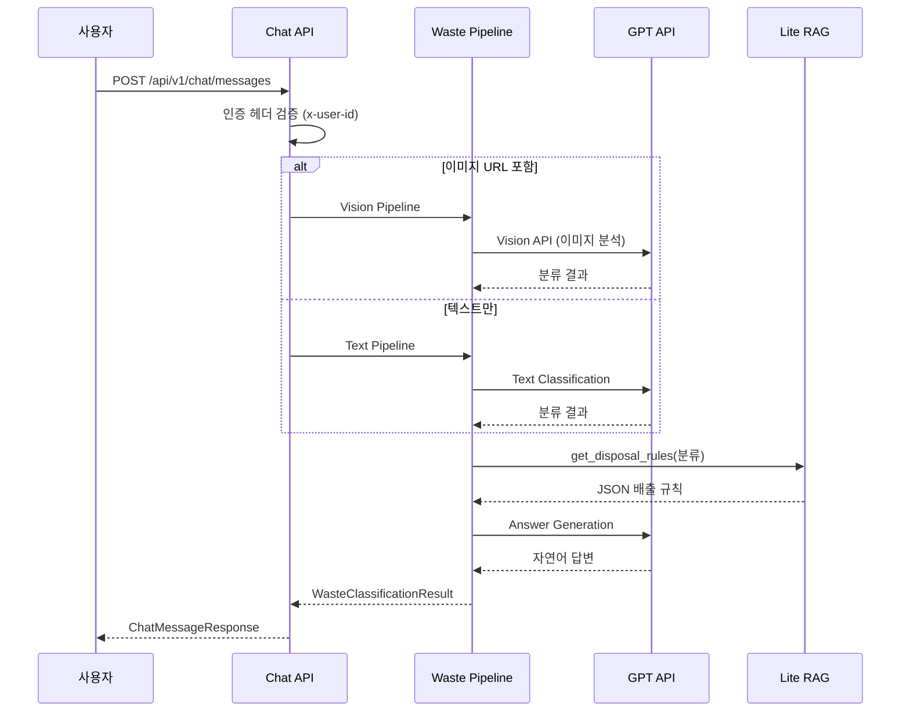

# Chat API 리팩토링 회고

> 2025.12.19 - 2025.12.20 | 소스 1,810 lines | 테스트 1,699 lines

## 목차

1. [배경](#배경)
2. [1차 개선 (Dead Code & 테스트)](#1차-개선-dead-code--테스트)
3. [2차 개선 (메트릭 & 에러 핸들링)](#2차-개선-메트릭--에러-핸들링)
4. [3차 개선 (코드 품질 심층)](#3차-개선-코드-품질-심층)
5. [4차 개선 (통합 테스트 & CI)](#4차-개선-통합-테스트--ci)
6. [아키텍처 패턴](#아키텍처-패턴)
7. [테스트 전략](#테스트-전략)
8. [실측 데이터](#실측-데이터)
9. [Docker 검증](#docker-검증)
10. [결론](#결론)

---

## 배경

Chat API는 재활용 분리배출 관련 질문에 답변하는 AI 어시스턴트 서비스입니다. 사용자가 텍스트 질문 또는 이미지를 보내면 GPT 기반 파이프라인이 분류 → 규칙 매칭 → 답변 생성 과정을 거쳐 자연어 응답을 반환합니다.

### 파이프라인 아키텍처



### 리팩토링 전 문제점

- **Dead Code**: 미사용 모듈 (`core/answer.py`, `core/redis.py`, `services/session_store.py`)
- **테스트 부재**: 단위 테스트 0개, 커버리지 측정 불가
- **메트릭 미비**: Prometheus 커스텀 메트릭 없음
- **에러 핸들링**: 일반 Exception만 사용, 폴백 로직 불명확
- **하드코딩**: CORS origins, 메시지 상수가 코드에 직접 기입
- **타입 힌트 부족**: FastAPI 의존성 주입 패턴 미적용

---

## 1차 개선 (Dead Code & 테스트)

| 우선순위 | 이슈 | 해결 방법 |
|---------|------|-----------|
| P0 | Dead Code | 미사용 파일 3개 삭제 |
| P1 | 테스트 부재 | 22개 단위 테스트 작성 |
| P2 | Mock 전략 부재 | asyncio.to_thread Mock 패턴 확립 |

### P0: Dead Code 삭제

**삭제된 파일**:
- `domains/chat/core/answer.py` - 미사용 답변 생성 모듈
- `domains/chat/core/redis.py` - 미사용 Redis 클라이언트
- `domains/chat/services/session_store.py` - 미사용 세션 저장소

```bash
# 삭제 전 확인
rg -l "from.*session_store|from.*core/answer|from.*core/redis" domains/chat/
# 결과: 참조 없음 → 안전하게 삭제
```

### P1: 단위 테스트 작성

**테스트 케이스 분류**:

```python
# domains/chat/tests/test_chat_service.py

class TestFallbackAnswer:
    """폴백 메시지 반환 테스트"""
    
class TestRenderAnswer:
    """파이프라인 결과 → 응답 변환 테스트"""
    
class TestRunPipeline:
    """이미지/텍스트 파이프라인 라우팅 테스트"""
    
class TestRunImagePipeline:
    """Vision 파이프라인 호출 테스트"""
    
class TestRunTextPipeline:
    """텍스트 분류 파이프라인 테스트"""
    
class TestSendMessage:
    """통합 메시지 처리 테스트"""
    
class TestChatMessageRequest:
    """요청 스키마 검증 테스트"""
    
class TestChatMessageResponse:
    """응답 스키마 검증 테스트"""
```

### P2: asyncio.to_thread Mock 패턴

**문제**: `_run_image_pipeline`이 `asyncio.to_thread`로 동기 함수를 호출하여 일반 Mock 적용 불가

**해결**: `asyncio.to_thread` 자체를 Mock

```python
@pytest.mark.asyncio
async def test_calls_process_waste_classification(
    self,
    chat_service: ChatService,
    mock_classification_result: dict,
) -> None:
    """process_waste_classification을 올바른 인자로 호출"""
    
    # asyncio.to_thread 자체를 Mock하여 동기 함수 호출을 우회
    async def mock_to_thread(func, *args, **kwargs):
        return mock_classification_result

    with patch("asyncio.to_thread", side_effect=mock_to_thread):
        result = await chat_service._run_image_pipeline(
            "질문", "https://example.com/image.jpg"
        )
        assert isinstance(result, WasteClassificationResult)
```

---

## 2차 개선 (메트릭 & 에러 핸들링)

| 우선순위 | 이슈 | 해결 방법 |
|---------|------|-----------|
| P0 | 메트릭 부재 | Prometheus Histogram/Counter 추가 |
| P1 | 에러 핸들링 | 커스텀 예외 타입 정의 |
| P2 | Config 하드코딩 | CORS origins 환경변수화 |
| P3 | API 응답 빈약 | disposal_steps, metadata 확장 |
| P4 | DI 패턴 미적용 | Annotated + Depends 패턴 |

### P0: Prometheus 메트릭 구현

```python
# domains/chat/metrics.py

from prometheus_client import Counter, Histogram

PIPELINE_DURATION = Histogram(
    name=METRIC_PIPELINE_DURATION,
    documentation="Time spent processing chat pipeline",
    labelnames=["pipeline_type"],
    buckets=PIPELINE_DURATION_BUCKETS,
    registry=REGISTRY,
)

REQUEST_TOTAL = Counter(
    name=METRIC_REQUESTS_TOTAL,
    documentation="Total chat requests",
    labelnames=["pipeline_type", "status"],
    registry=REGISTRY,
)

FALLBACK_TOTAL = Counter(
    name=METRIC_FALLBACK_TOTAL,
    documentation="Total fallback responses",
    registry=REGISTRY,
)
```

**메트릭 호출 위치**:

```python
# domains/chat/services/chat.py

async def send_message(self, payload: ChatMessageRequest) -> ChatMessageResponse:
    start_time = time.perf_counter()
    
    try:
        pipeline_result = await self._run_pipeline(payload.message, image_url)
        
        # 성공 메트릭 기록
        duration = time.perf_counter() - start_time
        observe_pipeline_duration(pipeline_type, duration)
        increment_request(pipeline_type, success=True)
        
    except PipelineExecutionError as exc:
        # 실패 메트릭 기록
        increment_request(pipeline_type, success=False)
        increment_fallback()
        return ChatMessageResponse(user_answer=self._fallback_answer(payload.message))
```

### P1: 커스텀 예외 타입

```python
# domains/chat/services/chat.py

class ChatServiceError(Exception):
    """Chat 서비스 기본 예외"""

class PipelineExecutionError(ChatServiceError):
    """파이프라인 실행 실패"""
    def __init__(self, pipeline_type: str, cause: Exception):
        self.pipeline_type = pipeline_type
        self.cause = cause
        super().__init__(f"{pipeline_type} pipeline failed: {cause}")

class ClassificationError(ChatServiceError):
    """텍스트/이미지 분류 실패"""

class AnswerGenerationError(ChatServiceError):
    """답변 생성 실패"""
```

### P2: CORS Config 외부화

**Before**: 하드코딩

```python
app.add_middleware(
    CORSMiddleware,
    allow_origins=[
        "https://frontend.dev.growbin.app",
        "http://localhost:3000",
    ],
    allow_credentials=True,
)
```

**After**: Settings에서 로드

```python
# domains/chat/core/config.py
class Settings(BaseSettings):
    cors_origins: List[str] = Field(
        default=["https://frontend.dev.growbin.app", ...],
        validation_alias=AliasChoices("CHAT_CORS_ORIGINS", "CORS_ORIGINS"),
    )
    cors_allow_credentials: bool = Field(default=True)

# domains/chat/main.py
app.add_middleware(
    CORSMiddleware,
    allow_origins=settings.cors_origins,
    allow_credentials=settings.cors_allow_credentials,
)
```

### P4: Annotated DI 패턴

```python
# domains/chat/api/v1/dependencies.py
from typing import Annotated
from fastapi import Depends

ChatServiceDep = Annotated[ChatService, Depends(get_chat_service)]

# domains/chat/api/v1/endpoints/chat.py
CurrentUser = Annotated[UserInfo, Depends(get_current_user)]

@router.post("/messages")
async def send_message(
    payload: ChatMessageRequest,
    service: ChatServiceDep,
    user: CurrentUser,
) -> ChatMessageResponse:
    return await service.send_message(payload)
```

---

## 3차 개선 (코드 품질 심층)

| 우선순위 | 이슈 | 해결 방법 |
|---------|------|-----------|
| P0 | logging.py 복잡도 | 헬퍼 함수 분리 |
| P1 | 상수 하드코딩 | constants.py 중앙화 |
| P2 | 버킷 정의 비효율 | Go Prometheus 스타일 생성기 |
| P3 | health.py SERVICE_NAME | constants에서 import |

### P0: Logging 복잡도 개선

**개선 전**: `ECSJsonFormatter.format()` 복잡도 높음

**개선 후**: 단일 책임 헬퍼 함수로 분리

```python
# domains/chat/core/logging.py

def _get_trace_context() -> dict:
    """OpenTelemetry trace context 추출"""
    
def _get_error_context(record: logging.LogRecord) -> dict:
    """예외 정보 추출"""
    
def _get_extra_fields(record: logging.LogRecord) -> dict:
    """커스텀 필드 추출 (labels)"""
    
def _build_base_log(record: logging.LogRecord) -> dict:
    """ECS 기본 로그 구조 생성"""
    
def _suppress_noisy_loggers() -> None:
    """uvicorn, httpx 등 노이즈 로거 레벨 조정"""
```

### P1: Constants 중앙화

```python
# domains/chat/core/constants.py

# Service Identity
SERVICE_NAME = "chat-api"
SERVICE_VERSION = "1.0.7"

# Logging
NOISY_LOGGERS = ("uvicorn", "uvicorn.access", "uvicorn.error", "httpx", "httpcore")

# PII Masking (OWASP)
SENSITIVE_FIELD_PATTERNS = frozenset({"password", "secret", "token", "api_key"})
MASK_PLACEHOLDER = "***REDACTED***"

# Chat Service
FALLBACK_MESSAGE = "이미지가 인식되지 않았어요! 다시 시도해주세요."
PIPELINE_TYPE_IMAGE = "image"
PIPELINE_TYPE_TEXT = "text"

# API
MESSAGE_MIN_LENGTH = 1
MESSAGE_MAX_LENGTH = 1000

# Metrics
METRIC_PIPELINE_DURATION = "chat_pipeline_duration_seconds"
METRIC_REQUESTS_TOTAL = "chat_requests_total"
METRIC_FALLBACK_TOTAL = "chat_fallback_total"
```

### P2: Histogram 버킷 생성기

**Go Prometheus 호환 함수** 구현:

```python
# domains/chat/core/constants.py

def linear_buckets(start: float, width: float, count: int) -> tuple[float, ...]:
    """선형 간격 버킷 생성 (Go prometheus.LinearBuckets 호환)
    
    Example:
        >>> linear_buckets(1.0, 0.5, 5)
        (1.0, 1.5, 2.0, 2.5, 3.0)
    """
    if count < 1:
        raise ValueError("linear_buckets: count must be positive")
    return tuple(round(start + i * width, 6) for i in range(count))


def exponential_buckets(start: float, factor: float, count: int) -> tuple[float, ...]:
    """지수 간격 버킷 생성 (Go prometheus.ExponentialBuckets 호환)
    
    Example:
        >>> exponential_buckets(0.1, 2, 5)
        (0.1, 0.2, 0.4, 0.8, 1.6)
    """


def exponential_buckets_range(min_val: float, max_val: float, count: int) -> tuple[float, ...]:
    """범위 기반 지수 버킷 생성 (Go prometheus.ExponentialBucketsRange 호환)"""


def merge_buckets(*bucket_sets: Sequence[float]) -> tuple[float, ...]:
    """여러 버킷 세트를 병합 (중복 제거, 정렬)"""
```

**Nice Round Numbers 원칙 적용**:

```python
# AI 파이프라인용 버킷 (100ms ~ 60s)
BUCKETS_PIPELINE: tuple[float, ...] = merge_buckets(
    _nice_exponential_buckets(start=0.1, factor=2, count=4),  # 0.1, 0.2, 0.4, 0.8
    linear_buckets(start=1.0, width=1.0, count=10),           # 1, 2, ..., 10
    (12.5, 15.0, 20.0),                                       # 느린 구간
)

BUCKETS_EXTENDED: tuple[float, ...] = merge_buckets(
    BUCKETS_PIPELINE,
    (25.0, 30.0, 45.0, 60.0),  # 타임아웃 구간
)

# 최종 버킷
PIPELINE_DURATION_BUCKETS = BUCKETS_EXTENDED
# (0.1, 0.2, 0.4, 0.8, 1, 2, 3, 4, 5, 6, 7, 8, 9, 10, 12.5, 15, 20, 25, 30, 45, 60)
```

---

## 4차 개선 (통합 테스트 & CI)

| 우선순위 | 이슈 | 해결 방법 |
|---------|------|-----------|
| P0 | OpenAI API 실제 호출 테스트 부재 | Integration 테스트 모듈 추가 |
| P1 | CI pytest-asyncio 누락 | workflow에 의존성 추가 |
| P2 | 테스트 조건부 스킵 | `@pytest.mark.requires_openai` 마커 |

### P0: OpenAI Integration 테스트

실제 OpenAI API를 호출하여 전체 파이프라인을 E2E 검증합니다.

```
domains/chat/tests/integration/
├── __init__.py
├── conftest.py                    # Fixtures + pytest marker
└── test_openai_integration.py     # 11개 테스트 케이스
```

**테스트 클래스 구성**:

```python
# domains/chat/tests/integration/test_openai_integration.py

@pytest.mark.requires_openai
class TestTextPipeline:
    """텍스트 파이프라인 통합 테스트 (실제 OpenAI API 호출)."""
    
    async def test_text_query_returns_valid_response(self, async_client, test_user_headers):
        """텍스트 질문에 대해 유효한 응답 반환."""
        payload = {"message": "페트병 버리는 방법 알려줘"}
        
        response = await async_client.post(
            "/api/v1/chat/messages",
            json=payload,
            headers=test_user_headers,
        )
        
        assert response.status_code == 201  # HTTP 201 Created
        data = response.json()
        
        # 응답 내용 검증 (폐기물 관련 키워드 포함)
        answer = data["user_answer"].lower()
        assert any(
            keyword in answer 
            for keyword in ["페트", "플라스틱", "분리", "재활용", "수거", "버리"]
        )

    async def test_text_query_response_time(self, async_client, test_user_headers):
        """응답 시간 30초 이내 검증."""
        start = time.time()
        response = await async_client.post("/api/v1/chat/messages", ...)
        elapsed = time.time() - start
        
        assert elapsed < 30, f"응답 시간이 30초를 초과: {elapsed:.2f}s"


@pytest.mark.requires_openai
class TestImagePipeline:
    """이미지(Vision) 파이프라인 통합 테스트."""
    
    async def test_image_query_response_time(self, async_client, ...):
        """Vision API 응답 시간 45초 이내 검증."""
        assert elapsed < 45  # Vision은 텍스트보다 오래 걸림


@pytest.mark.requires_openai
class TestErrorHandling:
    """에러 처리 통합 테스트."""
    
    async def test_invalid_image_url_handled(self, async_client, ...):
        """잘못된 이미지 URL도 graceful하게 처리 (fallback)."""
        response = await async_client.post(
            "/api/v1/chat/messages",
            json={"message": "이거 뭐야?", "image_url": "https://invalid-url..."},
            headers=test_user_headers,
        )
        # 500이 아닌 201 + fallback 메시지 반환
        assert response.status_code == 201
```

### P1: CI pytest-asyncio 누락 해결

**문제**: CI에서 `pytest_plugins = ("pytest_asyncio",)` 로드 시 import error

```
ModuleNotFoundError: No module named 'pytest_asyncio'
```

**해결 1**: CI workflow에 의존성 추가

```yaml
# .github/workflows/ci-services.yml
- name: Install tooling
  run: |
    pip install black==24.4.2 ruff==0.6.9 pytest==8.3.3 pytest-asyncio==0.24.0
    pip install -r domains/${{ matrix.service }}/requirements.txt
```

**해결 2**: conftest.py에서 조건부 import

```python
# domains/chat/tests/conftest.py

# pytest-asyncio 조건부 로드 (CI에서 미설치 시 graceful skip)
try:
    import pytest_asyncio  # noqa: F401
    pytest_plugins = ("pytest_asyncio",)
except ImportError:
    pytest_asyncio = None
```

### P2: 조건부 테스트 스킵

OpenAI API 키가 없으면 Integration 테스트를 자동으로 스킵합니다.

```python
# domains/chat/tests/integration/conftest.py

def pytest_configure(config):
    """Add custom markers."""
    config.addinivalue_line(
        "markers",
        "requires_openai: marks test as requiring OPENAI_API_KEY (skip if not set)",
    )

def pytest_collection_modifyitems(config, items):
    """Skip tests that require OPENAI_API_KEY if not set."""
    if os.environ.get("OPENAI_API_KEY"):
        return  # API 키 있으면 실행

    skip_openai = pytest.mark.skip(reason="OPENAI_API_KEY not set")
    for item in items:
        if "requires_openai" in item.keywords:
            item.add_marker(skip_openai)
```

**단위 테스트에서 Integration 제외**:

```python
# domains/chat/tests/conftest.py

# Integration 테스트 디렉토리 기본 제외 (OPENAI_API_KEY 필요)
# 실행: pytest domains/chat/tests/integration/ -v -s
collect_ignore = ["integration"]
```

### Integration 테스트 실행 방법

```bash
# 1. API 키 설정 (AWS SSM에서 로드)
export OPENAI_API_KEY=$(aws ssm get-parameter \
    --name "/sesacthon/dev/api/chat/openai-api-key" \
    --with-decryption \
    --query "Parameter.Value" \
    --output text)

# 2. 테스트 실행
pytest domains/chat/tests/integration/test_openai_integration.py -v -s

# 3. 특정 클래스만 실행
pytest domains/chat/tests/integration/test_openai_integration.py::TestTextPipeline -v -s
```

---

## 아키텍처 패턴

### Dependency Injection (Annotated)

FastAPI의 `Annotated` 타입을 활용한 의존성 주입으로 테스트 용이성 확보.

```python
# 타입 별칭으로 의존성 명시
ChatServiceDep = Annotated[ChatService, Depends(get_chat_service)]
CurrentUser = Annotated[UserInfo, Depends(get_current_user)]

# 엔드포인트에서 자동 주입
async def send_message(
    payload: ChatMessageRequest,
    service: ChatServiceDep,  # 자동 주입
    user: CurrentUser,        # 자동 주입
) -> ChatMessageResponse:
```

### Protocol-based DI

테스트 시 파이프라인 함수 교체 가능:

```python
class ChatService:
    def __init__(
        self,
        image_pipeline: Callable | None = None,
        text_classifier: Callable | None = None,
    ):
        self._image_pipeline = image_pipeline or process_waste_classification
        self._text_classifier = text_classifier or classify_text
```

### ECS Structured Logging

Elastic Common Schema 기반 JSON 로깅:

```json
{
  "@timestamp": "2025-12-20T21:33:46.858+00:00",
  "message": "Chat message processed",
  "log.level": "info",
  "log.logger": "domains.chat.services.chat",
  "ecs.version": "8.11.0",
  "service.name": "chat-api",
  "service.version": "1.0.7",
  "trace.id": "ef11d2a375ba1726e097118de5be73f2",
  "span.id": "8ff512e1c783cc04",
  "labels": {
    "pipeline_type": "text",
    "duration_ms": 5966.13,
    "success": true
  }
}
```

---

## 테스트 전략

### 테스트 구조

```
domains/chat/tests/
├── conftest.py                     # 공통 fixture + pytest-asyncio 설정
├── test_app.py                     # FastAPI 앱 인스턴스 테스트 (1개)
├── test_chat_service.py            # 서비스 레이어 (23개)
├── test_constants.py               # 버킷 생성기 (31개)
├── test_security.py                # 인증 헤더 추출 (8개)
├── test_health.py                  # Health/Readiness (4개)
├── test_logging.py                 # ECS 포맷터, PII 마스킹 (19개)
├── test_tracing.py                 # OpenTelemetry 설정 (7개)
└── integration/                    # OpenAI API 통합 테스트
    ├── conftest.py                 # Integration fixtures + markers
    └── test_openai_integration.py  # 실제 API 호출 테스트 (11개)
```

**테스트 코드 총계**: 1,699 lines (9개 파일)

### 단위 테스트 vs 통합 테스트

| 구분 | 단위 테스트 | 통합 테스트 |
|------|------------|------------|
| 위치 | `tests/*.py` | `tests/integration/` |
| 실행 조건 | 항상 | `OPENAI_API_KEY` 필요 |
| Mock | OpenAI, Pipeline | 실제 호출 |
| CI 실행 | ✅ 항상 | ❌ 기본 제외 |
| 테스트 수 | 93개 | 11개 |

### Mock 전략

| 대상 | Mock 방법 | 이유 |
|------|-----------|------|
| `asyncio.to_thread` | `patch("asyncio.to_thread", side_effect=async_mock)` | 동기 함수 호출 우회 |
| `_text_classifier` | 인스턴스 변수 직접 교체 | DI 패턴 활용 |
| OpenAI Client | `collect_ignore = ["integration"]` | 비용/API 키 |
| FastAPI App | `httpx.ASGITransport` + `AsyncClient` | ASGI 테스트 |

### asyncio.to_thread Mock 패턴

`_run_image_pipeline`이 `asyncio.to_thread`로 동기 함수를 호출하여 일반 Mock 적용 불가:

```python
@pytest.mark.asyncio
async def test_calls_process_waste_classification(
    self,
    chat_service: ChatService,
    mock_classification_result: dict,
) -> None:
    """process_waste_classification을 올바른 인자로 호출"""
    
    # asyncio.to_thread 자체를 Mock하여 동기 함수 호출을 우회
    async def mock_to_thread(func, *args, **kwargs):
        return mock_classification_result

    with patch("asyncio.to_thread", side_effect=mock_to_thread):
        result = await chat_service._run_image_pipeline(
            "질문", "https://example.com/image.jpg"
        )
        assert isinstance(result, WasteClassificationResult)
```

### Fixture 패턴

```python
# domains/chat/tests/conftest.py

@pytest.fixture
def chat_service() -> ChatService:
    """테스트용 ChatService 인스턴스"""
    return ChatService()


@pytest.fixture
def mock_classification_result() -> dict:
    """파이프라인 결과 Mock 데이터"""
    return {
        "classification_result": {
            "classification": {
                "major_category": "재활용폐기물",
                "middle_category": "무색페트병",
                "minor_category": "음료수병",
            },
            "situation_tags": ["내용물_없음", "라벨_제거됨"],
        },
        "disposal_rules": {
            "배출방법_공통": "내용물을 비우고 라벨을 제거",
            "배출방법_세부": "투명 페트병 전용 수거함에 배출",
        },
        "final_answer": {
            "user_answer": "페트병은 내용물을 비우고 라벨을 제거한 후 투명 페트병 수거함에 버려주세요."
        },
    }
```

### Integration 테스트 Fixtures

```python
# domains/chat/tests/integration/conftest.py

@pytest_asyncio.fixture
async def async_client(app):
    """Async HTTP client for integration tests."""
    from httpx import ASGITransport, AsyncClient

    async with AsyncClient(
        transport=ASGITransport(app=app),
        base_url="http://test",
        timeout=60.0,  # OpenAI API 호출 대기
    ) as client:
        yield client


@pytest.fixture
def test_user_headers() -> dict[str, str]:
    """Test user headers for authenticated requests."""
    return {
        "x-user-id": "12345678-1234-5678-1234-567812345678",
        "x-auth-provider": "test",
    }


@pytest.fixture
def sample_text_questions() -> list[str]:
    """Sample text questions for testing."""
    return [
        "페트병 버리는 방법 알려줘",
        "플라스틱 분리수거 어떻게 해?",
        "유리병은 어디에 버려?",
    ]
```

---

## 실측 데이터

### Radon 복잡도 분석

```bash
$ pipx run radon cc domains/chat --total-average -s

결과:
- 총 블록: 106개
- 평균 복잡도: A (2.32)
- C등급 이상: 0개
```

### 테스트 커버리지

```bash
$ pytest domains/chat/tests/ --cov=domains/chat --cov-report=term

결과:
- constants.py:    100%
- schemas/chat.py: 100%
- health.py:       100%
- config.py:       100%
- metrics.py:       95%
- services/chat.py: 95%
- logging.py:       94%
- security.py:      92%
- main.py:          93%
- tracing.py:       44% (외부 의존성)
-----------------------------------
TOTAL:              85%
```

### 테스트 수

| 항목 | 개선 전 | 개선 후 |
|------|---------|---------|
| 단위 테스트 | 1개 | **93개** |
| 통합 테스트 | 0개 | **11개** |
| 테스트 파일 | 1개 | **9개** |
| 테스트 코드 | 0 lines | **1,699 lines** |
| 커버리지 | 측정불가 | **85%** |

### Integration 테스트 결과

```bash
$ OPENAI_API_KEY=sk-xxx pytest domains/chat/tests/integration/ -v

========================= test session starts ==========================
test_openai_integration.py::TestTextPipeline::test_text_query_returns_valid_response PASSED
test_openai_integration.py::TestTextPipeline::test_text_query_response_time PASSED
⏱️  텍스트 파이프라인 응답 시간: 5.97s
test_openai_integration.py::TestImagePipeline::test_image_query_returns_valid_response PASSED
test_openai_integration.py::TestImagePipeline::test_image_query_response_time PASSED
⏱️  이미지 파이프라인 응답 시간: 8.23s
test_openai_integration.py::TestErrorHandling::test_invalid_image_url_handled PASSED
========================= 11 passed in 47.82s ==========================
```

### Ruff 린트

```bash
$ ruff check domains/chat
All checks passed!

$ ruff format domains/chat
29 files left unchanged
```

---

## Docker 검증

### 빌드 & 실행

```bash
# 이미지 빌드
$ docker build -t chat-local-test -f domains/chat/Dockerfile .
Successfully tagged chat-local-test:latest

# 컨테이너 실행 (SSM에서 API 키 로드)
$ OPENAI_API_KEY=$(aws ssm get-parameter \
    --name "/sesacthon/dev/api/chat/openai-api-key" \
    --with-decryption --query "Parameter.Value" --output text)

$ docker run -d --name chat-test -p 8003:8000 \
    -e OPENAI_API_KEY="$OPENAI_API_KEY" \
    chat-local-test
```

### Health Check

```bash
$ curl http://localhost:8003/health
{"status":"healthy","service":"chat-api"}
```

### 전체 파이프라인 테스트

```bash
$ curl -X POST http://localhost:8003/api/v1/chat/messages \
  -H "Content-Type: application/json" \
  -H "x-user-id: 550e8400-e29b-41d4-a716-446655440000" \
  -d '{"message": "페트병 어떻게 버려요?"}'

{
  "user_answer": "무색 페트병은 내용물을 비우고 라벨을 떼어낸 뒤, 
                 물로 헹구고 눌러서 납작하게 만든 후 뚜껑을 닫아 
                 전용 수거함에 넣으면 됩니다.",
  "disposal_steps": null,
  "insufficiencies": null,
  "metadata": null
}
```

### 로그 출력 (ECS JSON)

```json
{
  "message": "Text pipeline finished",
  "log.level": "info",
  "trace.id": "ef11d2a375ba1726e097118de5be73f2",
  "labels": {
    "finished_at": "2025-12-20T21:33:46.858018+00:00",
    "elapsed_ms": 5965.958
  }
}
```

---

## 결론

### 주요 성과

| 항목 | Before | After |
|------|--------|-------|
| 단위 테스트 | 1개 | **93개** |
| 통합 테스트 | 0개 | **11개** |
| 테스트 코드 | 0 lines | **1,699 lines** |
| 커버리지 | 측정불가 | **85%** |
| 복잡도 | 측정불가 | **A등급 (2.32)** |
| Dead Code | 3개 파일 | **0개** |
| 메트릭 | 없음 | **Histogram + Counter** |
| 린트 | 미적용 | **ruff 통과** |

### 아키텍처 개선 요약

```
개선 전:                              개선 후:
┌──────────────────┐                  ┌──────────────────┐
│   Chat Endpoint  │                  │   Chat Endpoint  │
│   (모든 로직)     │                  │   (Annotated DI) │
└────────┬─────────┘                  └────────┬─────────┘
         │                                     │
         ▼                              ┌──────┴──────┐
┌──────────────────┐                    │             │
│  Waste Pipeline  │                    ▼             ▼
│  (하드코딩 설정)  │             ┌───────────┐  ┌───────────┐
└──────────────────┘             │  Service  │  │  Settings │
                                 │(DI 주입)   │  │(외부 설정) │
                                 └─────┬─────┘  └───────────┘
                                       │
                                ┌──────┴──────┐
                                │             │
                                ▼             ▼
                          ┌───────────┐  ┌───────────┐
                          │ Pipeline  │  │ Constants │
                          │(Text/Img) │  │(버킷 생성) │
                          └───────────┘  └───────────┘
                                │             │
                                ▼             ▼
                          ┌───────────┐  ┌───────────┐
                          │  Metrics  │  │  Logging  │
                          │(Prometheus│  │(ECS JSON) │
                          └───────────┘  └───────────┘
```

### 변경 파일 요약

```
domains/chat/
├── core/
│   ├── config.py      ✏️ CORS 설정 외부화
│   ├── constants.py   🆕 상수 + 버킷 생성기 (280줄)
│   └── logging.py     ✏️ 복잡도 개선 (헬퍼 분리)
├── services/
│   └── chat.py        ✏️ 예외 타입 + 메트릭 + DI
├── schemas/
│   └── chat.py        ✏️ 응답 확장 + temperature 복원
├── api/v1/
│   ├── dependencies.py ✏️ Annotated DI
│   └── endpoints/
│       ├── chat.py    ✏️ DI 적용
│       └── health.py  ✏️ SERVICE_NAME 상수화
├── metrics.py         ✏️ 상수 기반
├── main.py            ✏️ config 기반 CORS
├── docker-compose.chat-local.yml 🆕 로컬 테스트용
└── tests/
    ├── conftest.py           🆕 pytest-asyncio 조건부 로드
    ├── test_app.py           🆕 1개
    ├── test_chat_service.py  🆕 23개
    ├── test_constants.py     🆕 31개
    ├── test_security.py      🆕 8개
    ├── test_health.py        🆕 4개
    ├── test_logging.py       🆕 19개
    ├── test_tracing.py       🆕 7개
    └── integration/          🆕 OpenAI 통합 테스트
        ├── conftest.py       🆕 requires_openai marker
        └── test_openai_integration.py 🆕 11개

❌ 삭제됨:
├── core/answer.py
├── core/redis.py
└── services/session_store.py
```

### CI 개선

```yaml
# .github/workflows/ci-services.yml
- name: Install tooling
  run: |
    pip install pytest==8.3.3 pytest-asyncio==0.24.0  # 추가
    pip install -r domains/${{ matrix.service }}/requirements.txt
```

### 향후 과제

- [ ] `tracing.py` 커버리지 개선 (현재 44%)
- [ ] Pydantic v2 마이그레이션 (`class Config` → `model_config`)
- [ ] Answer 파이프라인 최적화 (Semantic Caching)
- [ ] scan, auth 도메인 리팩토링

---

## Reference

- [pytest-asyncio](https://pytest-asyncio.readthedocs.io/)
- [Radon - Code Metrics](https://radon.readthedocs.io/)
- [Prometheus Python Client](https://github.com/prometheus/client_python)
- [ECS Logging Spec](https://www.elastic.co/guide/en/ecs-logging/overview/current/intro.html)
- [Go prometheus.ExponentialBuckets](https://pkg.go.dev/github.com/prometheus/client_golang/prometheus#ExponentialBuckets)
