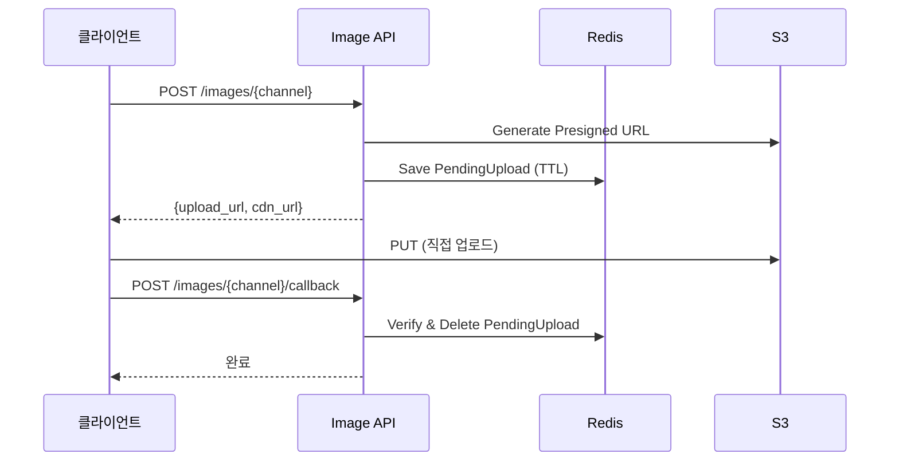

# Image API 리팩토링 회고

> 2025.12.20

## 목차

1. [배경](#배경)
2. [분석](#분석)
3. [개선 사항](#개선-사항)
4. [실측 데이터](#실측-데이터)
5. [결론](#결론)

---

## 배경

Image API는 이미지 업로드를 위한 **Presigned URL 발급 서비스**입니다.

### 주요 기능

- S3 Presigned URL 생성
- Redis 기반 업로드 세션 관리
- 채널별 업로드 분리 (chat, scan, my)

### 아키텍처



---

## 분석

### Character API 기준 평가

| 항목 | Image | 비고 |
|------|-------|------|
| Race Condition | ✅ 없음 | Redis 세션 기반 |
| Dead Code | ✅ 없음 | - |
| 하드코딩 | ✅ 없음 | Settings 분리됨 |
| 테스트 부족 | ⚠️ 41% | smoke test만 |
| Circuit Breaker | ➖ 불필요 | S3 SDK retry 내장 |

### 결론

Image 도메인은 이미 잘 구조화되어 있습니다. **테스트만 추가**하면 됩니다.

---

## 개선 사항

### P0: 서비스 단위 테스트 추가

추가된 테스트:
- `TestPendingUpload`: JSON 직렬화/역직렬화
- `TestCreateUploadUrl`: Presigned URL 생성
- `TestFinalizeUpload`: 업로드 완료/에러 케이스
- `TestBuildObjectKey`: 파일 키 생성
- `TestMetrics`: 메트릭스 반환

---

## 실측 데이터

### Radon 복잡도

```
실행: radon cc domains/image/ -a -s -nb

결과:
- B등급 함수: logging 관련만 (공통 모듈)
- 서비스 레이어: 모두 A등급
```

### 테스트 커버리지

```
실행: pytest domains/image/tests/ --cov=domains.image.services

결과:
- services/image.py: 100%
- 전체: 100%
```

### 테스트 수

| 항목 | 개선 전 | 개선 후 |
|------|---------|---------|
| 테스트 수 | 1개 | 14개 |
| 커버리지 | 41% | 100% |

---

## 결론

### 주요 성과

1. **커버리지 100%**: 모든 서비스 로직 테스트 완료
2. **에러 케이스 검증**: NotFound, ChannelMismatch, PermissionDenied

### 특이사항

- 이미 잘 설계된 도메인
- 추가 리팩토링 불필요
- 테스트 추가만으로 품질 확보

### 수정된 파일

```
domains/image/
└── tests/test_image_service.py  # 신규 (13개 테스트)
```

---

## Reference

- [AWS S3 Presigned URLs](https://docs.aws.amazon.com/AmazonS3/latest/userguide/using-presigned-url.html)
- [boto3 S3 Client](https://boto3.amazonaws.com/v1/documentation/api/latest/reference/services/s3.html)
