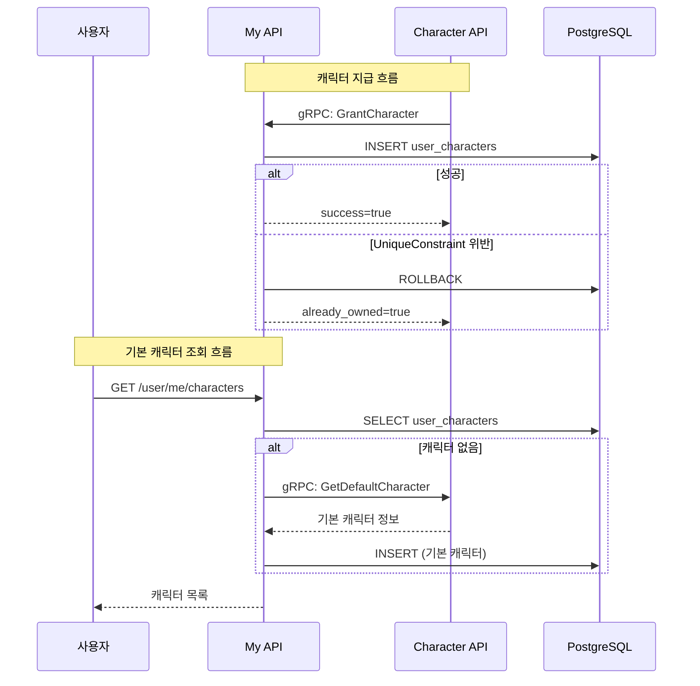

# My API 리팩토링 회고

> 2025.12.20

## 목차

1. [배경](#배경)
2. [냉정한 분석](#냉정한-분석)
3. [개선 사항](#개선-사항)
4. [테스트 전략](#테스트-전략)
5. [실측 데이터](#실측-데이터)
6. [결론](#결론)

---

## 배경

My API는 사용자 프로필과 캐릭터 인벤토리를 관리하는 서비스입니다. Character 도메인에서 gRPC로 캐릭터 지급 요청을 받아 처리합니다.

### 도메인 간 통신 흐름



### 리팩토링 전 문제점

- **Race Condition**: gRPC `GrantCharacter`에서 SELECT→INSERT 패턴
- **gRPC 설정 하드코딩**: `os.getenv` 직접 사용
- **테스트 부족**: placeholder 테스트 1개만 존재
- **리소스 누수 가능성**: gRPC 채널 close 미보장

---

## 냉정한 분석

Character API 리팩토링 기준으로 My 도메인을 평가했습니다.

### 실제 가치 있는 개선

| 항목 | 판정 | 이유 |
|------|------|------|
| Race Condition | ✅ 필수 | Character→My gRPC 호출은 빈번, 동시성 이슈 가능 |
| 테스트 추가 | ✅ 필수 | 핵심 비즈니스 로직 검증 필요 |

### 과잉 엔지니어링 주의

| 항목 | 판정 | 이유 |
|------|------|------|
| Circuit Breaker | ⚠️ 선택 | My→Character gRPC는 1회성 조회, 실패해도 빈 목록 반환 |
| Settings 이관 | ⚠️ 미미 | `os.getenv`가 이미 있었음, 형식만 변경 |
| lifespan 정리 | ⚠️ 미미 | 앱 종료 시 어차피 정리됨 |

---

## 개선 사항

### P0: Race Condition 해결

**문제**: `GrantCharacter` gRPC에서 SELECT 후 INSERT 패턴

```python
# AS-IS: Race Condition 발생 가능
existing = await session.execute(select(...))
if existing:
    return already_owned
session.add(new_ownership)
await session.commit()
```

**해결**: Optimistic Locking + IntegrityError 핸들링

```python
# TO-BE: UniqueConstraint로 동시성 보장
session.add(new_ownership)
try:
    await session.commit()
    return success
except IntegrityError:
    await session.rollback()
    return already_owned  # 동시 요청으로 이미 지급됨
```

### P1: gRPC 설정 Settings 이관

```python
# core/config.py
class Settings(BaseSettings):
    # gRPC Client Settings
    character_grpc_host: str = Field(
        "character-api.character.svc.cluster.local",
        validation_alias=AliasChoices("CHARACTER_GRPC_HOST"),
    )
    character_grpc_port: str = Field("50051")
    character_grpc_timeout: float = Field(5.0)

    # Circuit Breaker (선택적)
    circuit_fail_max: int = Field(5)
    circuit_timeout_duration: int = Field(30)
```

### P1: Circuit Breaker 적용

```python
# rpc/character_client.py
class CharacterClient:
    def __init__(self, settings: Settings | None = None):
        self.settings = settings or get_settings()
        self._circuit_breaker = CircuitBreaker(
            name="character-grpc-client",
            fail_max=self.settings.circuit_fail_max,
            timeout_duration=self.settings.circuit_timeout_duration,
        )

    async def get_default_character(self) -> DefaultCharacterInfo | None:
        try:
            return await self._circuit_breaker.call_async(self._impl)
        except CircuitBreakerError:
            return None  # fail-fast
        except grpc.aio.AioRpcError:
            return None  # graceful degradation
```

> ⚠️ **주의**: 이 기능은 기본 캐릭터 조회 1회용이므로 과잉 엔지니어링일 수 있습니다.

---

## 테스트 전략

### 테스트 구조

```
tests/
├── conftest.py                  # 공통 fixtures
├── test_my_service.py           # 프로필 서비스 (33개)
├── test_character_service.py    # 캐릭터 서비스 (8개)
├── test_character_client.py     # gRPC 클라이언트 (9개)
└── test_user_character_servicer.py  # gRPC 서버 (4개)
```

### 핵심 테스트 케이스

**MyService 테스트**:
- 프로필 조회/생성/수정/삭제
- 전화번호 정규화 (`010-1234-5678`, `+82`)
- 소셜 계정 선택 로직
- 닉네임/사용자명 fallback

**gRPC 테스트**:
- `GrantCharacter` 정상/중복 지급
- `IntegrityError` 핸들링
- Circuit Breaker 상태 전이

---

## 실측 데이터

### Radon 복잡도 분석

```
실행: radon cc domains/my/ -a -s --total-average

결과:
- 총 블록: 169개
- 평균 복잡도: A (2.27)
- C등급 이상: 0개
```

### 테스트 커버리지

```
실행: pytest domains/my/tests/ --cov=domains.my.services --cov=domains.my.rpc

결과:
- services/my.py: 97%
- services/characters.py: 89%
- rpc/character_client.py: 78%
- rpc/v1/user_character_servicer.py: 100%
- 전체: 90%
```

### 테스트 수

| 항목 | 개선 전 | 개선 후 |
|------|---------|---------|
| 단위 테스트 | 1개 (placeholder) | 55개 |
| 커버리지 | 0% | 90% |

---

## 결론

### 주요 성과

1. **안정성 향상**: Race Condition 해결 (Optimistic Locking)
2. **테스트 커버리지**: 0% → 90%
3. **설정 관리**: gRPC 설정 중앙화

### 회고

- **과잉 엔지니어링 주의**: Circuit Breaker는 실제 필요성 대비 복잡성 증가
- **테스트가 핵심**: `my.py` (핵심 로직) 테스트가 가장 가치 있었음
- **냉정한 분석 필요**: 모든 패턴을 적용하기보다 실제 문제에 집중

### 수정된 파일

```
domains/my/
├── core/config.py           # gRPC + Circuit Breaker 설정
├── main.py                  # lifespan gRPC 정리
├── requirements.txt         # aiobreaker 추가
├── rpc/character_client.py  # Settings 주입 + Circuit Breaker
├── rpc/v1/user_character_servicer.py  # IntegrityError 핸들링
├── services/characters.py   # IntegrityError 핸들링
└── tests/
    ├── conftest.py
    ├── test_my_service.py   # 신규 (33개)
    ├── test_character_service.py
    ├── test_character_client.py
    └── test_user_character_servicer.py
```

---

## Reference

- [aiobreaker - Circuit Breaker](https://github.com/arlyon/aiobreaker)
- [SQLAlchemy IntegrityError](https://docs.sqlalchemy.org/en/20/core/exceptions.html)
- [pytest-asyncio](https://pytest-asyncio.readthedocs.io/)
