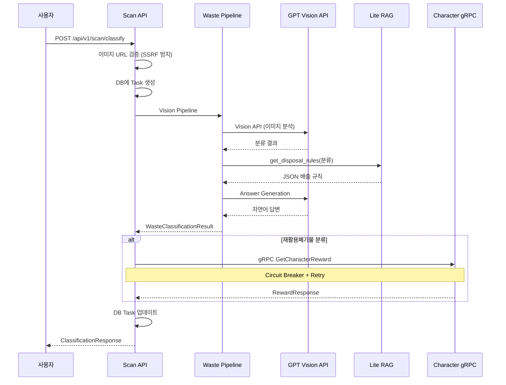

# Scan API 리팩토링 회고

> 2025.12.19 - 2025.12.21 | 소스 4,844 lines | 테스트 1,401 lines (70개)

## 목차

1. [배경](#배경)
2. [1차 개선 (gRPC 복원력)](#1차-개선-grpc-복원력)
3. [2차 개선 (보안 강화)](#2차-개선-보안-강화)
4. [3차 개선 (메트릭 & 상수)](#3차-개선-메트릭--상수)
5. [4차 개선 (비동기 Task Queue)](#4차-개선-비동기-task-queue)
6. [아키텍처 패턴](#아키텍처-패턴)
7. [테스트 전략](#테스트-전략)
8. [실측 데이터](#실측-데이터)
9. [결론](#결론)

---

## 배경

Scan API는 폐기물 이미지를 분석하여 분류 정보와 배출 방법을 제공하는 AI 파이프라인 서비스입니다. GPT Vision API로 이미지를 분류하고, 분류 결과에 따라 Character 도메인의 gRPC 서비스를 호출하여 캐릭터 리워드를 지급합니다.

### 파이프라인 아키텍처



### 리팩토링 전 문제점

- **gRPC 복원력 부재**: Character 서비스 장애 시 전체 요청 실패
- **보안 취약점**: 이미지 URL 검증 없이 SSRF 공격에 노출
- **메트릭 미비**: 파이프라인 단계별 지연 시간 측정 불가
- **하드코딩**: 설정값, 상수가 코드에 분산
- **동기 블로킹**: 긴 AI 파이프라인이 API 응답 지연 유발

---

## 1차 개선 (gRPC 복원력)

| 우선순위 | 이슈 | 해결 방법 |
|---------|------|-----------|
| P0 | gRPC 장애 전파 | Circuit Breaker 패턴 |
| P1 | 일시적 네트워크 오류 | Exponential Backoff + Jitter |
| P2 | 재시도 가능 여부 판단 | gRPC Status Code 분류 |

### P0: Circuit Breaker 구현

Character gRPC 서비스 장애 시 빠른 실패(Fail-fast)로 시스템 안정성 확보:

```python
# domains/scan/core/grpc_client.py

from aiobreaker import CircuitBreaker, CircuitBreakerError, CircuitBreakerListener

class CircuitBreakerLoggingListener(CircuitBreakerListener):
    """Circuit Breaker 상태 변경 로깅."""

    def state_change(self, breaker: CircuitBreaker, old_state, new_state) -> None:
        logger.warning(
            "Circuit breaker state changed",
            extra={
                "breaker_name": breaker.name,
                "old_state": type(old_state).__name__,
                "new_state": type(new_state).__name__,
                "fail_count": breaker.fail_counter,
            },
        )


class CharacterGrpcClient:
    def __init__(self, settings: Settings) -> None:
        self.target = settings.character_grpc_target
        self.max_retries = settings.grpc_max_retries
        
        # Circuit Breaker 초기화
        self._circuit_breaker = CircuitBreaker(
            name="character-grpc-client",
            fail_max=settings.grpc_circuit_fail_max,        # 5회 연속 실패 시 OPEN
            timeout_duration=settings.grpc_circuit_timeout_duration,  # 30초 후 HALF-OPEN
            listeners=[CircuitBreakerLoggingListener()],
        )
```

**Circuit Breaker 상태 머신**:

```
┌─────────────────────────────────────────────────────────────┐
│                      CLOSED (정상)                          │
│  - 모든 요청 통과                                           │
│  - fail_count 증가 (실패 시)                                │
│  - fail_count >= fail_max → OPEN 전환                      │
└─────────────────────────────────────────────────────────────┘
                          │
                          ▼ fail_count >= 5
┌─────────────────────────────────────────────────────────────┐
│                       OPEN (차단)                           │
│  - 모든 요청 즉시 실패 (CircuitBreakerError)               │
│  - timeout_duration 경과 → HALF-OPEN 전환                  │
└─────────────────────────────────────────────────────────────┘
                          │
                          ▼ 30초 경과
┌─────────────────────────────────────────────────────────────┐
│                    HALF-OPEN (테스트)                       │
│  - 단일 요청 허용                                           │
│  - 성공 → CLOSED 복귀                                       │
│  - 실패 → OPEN 재전환                                       │
└─────────────────────────────────────────────────────────────┘
```

### P1: Exponential Backoff + Jitter

일시적 네트워크 오류에 대한 지수 백오프 재시도:

```python
# domains/scan/core/grpc_client.py

async def _call_with_retry(self, call_func, log_ctx: dict):
    """Execute gRPC call with exponential backoff retry."""
    last_error: Exception | None = None

    for attempt in range(self.max_retries + 1):
        try:
            return await call_func()

        except grpc.aio.AioRpcError as e:
            status_code = e.code()

            if status_code in RETRYABLE_STATUS_CODES and attempt < self.max_retries:
                # Calculate delay with exponential backoff + jitter
                delay = min(
                    self.retry_base_delay * (2**attempt),
                    self.retry_max_delay,
                )
                # Add jitter (±25%) - 동시 요청의 "thundering herd" 방지
                delay = delay * (0.75 + random.random() * 0.5)

                logger.warning(
                    "gRPC call failed, retrying",
                    extra={
                        **log_ctx,
                        "attempt": attempt + 1,
                        "grpc_code": status_code.name,
                        "retry_delay_seconds": round(delay, 3),
                    },
                )
                await asyncio.sleep(delay)
            else:
                raise

    if last_error:
        raise last_error
```

**재시도 타이밍 예시** (base=0.1s, max=2.0s):

| 시도 | 기본 지연 | Jitter 적용 범위 |
|------|----------|-----------------|
| 1차  | 0.1s     | 0.075s ~ 0.125s |
| 2차  | 0.2s     | 0.15s ~ 0.25s   |
| 3차  | 0.4s     | 0.3s ~ 0.5s     |
| 4차  | 0.8s     | 0.6s ~ 1.0s     |

### P2: 재시도 가능 Status Code

gRPC 오류 코드별 재시도 정책:

```python
# domains/scan/core/grpc_client.py

RETRYABLE_STATUS_CODES = frozenset({
    grpc.StatusCode.UNAVAILABLE,       # 서비스 일시 불가
    grpc.StatusCode.DEADLINE_EXCEEDED, # 타임아웃
    grpc.StatusCode.RESOURCE_EXHAUSTED,# Rate limit
    grpc.StatusCode.ABORTED,           # 트랜잭션 충돌
})

# 재시도 불가 (즉시 실패):
# - INVALID_ARGUMENT: 클라이언트 오류
# - NOT_FOUND: 리소스 없음
# - PERMISSION_DENIED: 권한 없음
# - INTERNAL: 서버 버그
```

---

## 2차 개선 (보안 강화)

| 우선순위 | 이슈 | 해결 방법 |
|---------|------|-----------|
| P0 | SSRF 취약점 | Allowlist + Private IP 차단 |
| P1 | 경로 조작 공격 | 파일명 패턴 검증 |
| P2 | 확장자 위장 | Allowlist 확장자만 허용 |

### P0: SSRF 방지 검증기

Server-Side Request Forgery 공격 방지를 위한 다중 레이어 검증:

```python
# domains/scan/core/validators.py

class ImageUrlValidator:
    """
    이미지 URL 검증기.

    검증 순서:
    1. HTTPS 스키마 확인
    2. Allowlist 도메인 확인
    3. SSRF 방지 (프라이빗 IP 차단)
    4. 경로 형식 확인 (/{channel}/{filename}.{ext})
    5. 채널 허용 여부
    6. 파일명 패턴 (UUID hex)
    7. 확장자 허용 여부
    """

    def __init__(self, settings: Settings) -> None:
        self.allowed_hosts = settings.allowed_image_hosts
        self.allowed_channels = settings.allowed_image_channels
        self.allowed_extensions = settings.allowed_image_extensions
        self.filename_pattern = re.compile(settings.image_filename_pattern)

    def validate(self, url: str) -> ValidationResult:
        parsed = urlparse(url)

        # 1. HTTPS 강제
        if parsed.scheme != "https":
            return ValidationResult.fail(
                ImageUrlError.HTTPS_REQUIRED,
                f"HTTPS가 필요합니다 (현재: {parsed.scheme})",
            )

        # 2. 도메인 Allowlist
        if parsed.hostname not in self.allowed_hosts:
            return ValidationResult.fail(
                ImageUrlError.INVALID_HOST,
                f"허용되지 않은 호스트: {parsed.hostname}",
            )

        # 3. SSRF 방지
        ssrf_result = self._check_ssrf(parsed.hostname)
        if not ssrf_result.valid:
            return ssrf_result

        # ... 추가 검증
```

### SSRF 방지 로직

```python
def _check_ssrf(self, hostname: str | None) -> ValidationResult:
    """SSRF 방지: 프라이빗/내부 IP 차단."""
    
    # 위험한 호스트명 직접 차단
    dangerous_hosts = {"localhost", "127.0.0.1", "0.0.0.0", "::1", "[::1]"}
    if hostname.lower() in dangerous_hosts:
        return ValidationResult.fail(ImageUrlError.SSRF_BLOCKED, "내부 호스트 접근 차단됨")

    # DNS 확인 후 IP 검증
    try:
        ip_str = socket.gethostbyname(hostname)
        ip = ipaddress.ip_address(ip_str)

        if ip.is_private:
            return ValidationResult.fail(ImageUrlError.SSRF_BLOCKED, "프라이빗 IP 접근 차단됨")
        if ip.is_loopback:
            return ValidationResult.fail(ImageUrlError.SSRF_BLOCKED, "루프백 주소 접근 차단됨")
        if ip.is_reserved:
            return ValidationResult.fail(ImageUrlError.SSRF_BLOCKED, "예약된 IP 접근 차단됨")

    except socket.gaierror:
        pass  # DNS 실패 - Allowlist에서 이미 걸러짐

    return ValidationResult.ok()
```

**SSRF 차단 범위**:

| IP 범위 | 차단 이유 |
|---------|----------|
| `10.0.0.0/8` | 프라이빗 네트워크 |
| `172.16.0.0/12` | 프라이빗 네트워크 |
| `192.168.0.0/16` | 프라이빗 네트워크 |
| `127.0.0.0/8` | 루프백 |
| `169.254.0.0/16` | Link-local (AWS Metadata) |
| `::1` | IPv6 루프백 |

### 검증 결과 타입

```python
class ImageUrlError(str, Enum):
    """이미지 URL 검증 에러 코드."""
    HTTPS_REQUIRED = "HTTPS_REQUIRED"
    INVALID_HOST = "INVALID_HOST"
    INVALID_CHANNEL = "INVALID_CHANNEL"
    INVALID_PATH_FORMAT = "INVALID_PATH_FORMAT"
    INVALID_FILENAME = "INVALID_FILENAME"
    INVALID_EXTENSION = "INVALID_EXTENSION"
    SSRF_BLOCKED = "SSRF_BLOCKED"


@dataclass
class ValidationResult:
    """URL 검증 결과."""
    valid: bool
    error: ImageUrlError | None = None
    message: str | None = None

    @classmethod
    def ok(cls) -> "ValidationResult":
        return cls(valid=True)

    @classmethod
    def fail(cls, error: ImageUrlError, message: str) -> "ValidationResult":
        return cls(valid=False, error=error, message=message)
```

---

## 3차 개선 (메트릭 & 상수)

| 우선순위 | 이슈 | 해결 방법 |
|---------|------|-----------|
| P0 | 파이프라인 지연 추적 불가 | 단계별 Histogram 메트릭 |
| P1 | gRPC 호출 모니터링 부재 | 서비스/메서드별 메트릭 |
| P2 | 상수 분산 | constants.py 중앙화 |

### P0: 파이프라인 단계별 메트릭

AI 파이프라인 각 단계의 지연 시간 추적:

```python
# domains/scan/metrics.py

PIPELINE_STEP_LATENCY = Histogram(
    "scan_pipeline_step_duration_seconds",
    "Duration of each step in the waste classification pipeline",
    labelnames=["step"],  # vision, rag, answer, total_pipeline
    registry=REGISTRY,
    buckets=(0.1, 0.5, 1.0, 2.0, 3.0, 4.0, 5.0, 6.0, 7.0, 8.0, 9.0, 10.0, 12.5, 15.0, 20.0),
)

REWARD_MATCH_LATENCY = Histogram(
    "scan_reward_match_duration_seconds",
    "Duration of character reward matching API call",
    registry=REGISTRY,
    buckets=(0.05, 0.1, 0.25, 0.5, 1.0, 2.5, 5.0),
)

REWARD_MATCH_COUNTER = Counter(
    "scan_reward_match_total",
    "Total count of character reward matching attempts",
    labelnames=["status"],  # success, failed, skipped
    registry=REGISTRY,
)
```

**메트릭 기록 위치**:

```python
# domains/scan/services/scan.py

async def _run_pipeline(self, ...):
    pipeline_started = perf_counter()
    
    pipeline_payload = await asyncio.to_thread(
        process_waste_classification, ...
    )

    # 메트릭 기록
    metadata = pipeline_payload.get("metadata", {})
    if metadata:
        PIPELINE_STEP_LATENCY.labels(step="vision").observe(metadata.get("duration_vision", 0))
        PIPELINE_STEP_LATENCY.labels(step="rag").observe(metadata.get("duration_rag", 0))
        PIPELINE_STEP_LATENCY.labels(step="answer").observe(metadata.get("duration_answer", 0))
        PIPELINE_STEP_LATENCY.labels(step="total_pipeline").observe(metadata.get("duration_total", 0))
```

### P1: gRPC 호출 메트릭

```python
# domains/scan/metrics.py

GRPC_CALL_LATENCY = Histogram(
    "scan_grpc_call_duration_seconds",
    "Duration of gRPC calls to external services",
    labelnames=["service", "method"],
    registry=REGISTRY,
    buckets=(0.01, 0.05, 0.1, 0.25, 0.5, 1.0, 2.5),
)

GRPC_CALL_COUNTER = Counter(
    "scan_grpc_call_total",
    "Total count of gRPC calls",
    labelnames=["service", "method", "status"],  # success, error
    registry=REGISTRY,
)

# 사용 예시
with GRPC_CALL_LATENCY.labels(service="character", method="GetCharacterReward").time():
    response = await client.get_character_reward(grpc_req, log_ctx)

GRPC_CALL_COUNTER.labels(
    service="character", method="GetCharacterReward", status="success"
).inc()
```

### P2: 상수 중앙화 + 버킷 생성기

```python
# domains/scan/core/constants.py

# Service Identity
SERVICE_NAME = "scan-api"
SERVICE_VERSION = "1.0.8"

# gRPC Defaults
DEFAULT_GRPC_TIMEOUT = 5.0
DEFAULT_GRPC_MAX_RETRIES = 3
DEFAULT_GRPC_RETRY_BASE_DELAY = 0.1
DEFAULT_GRPC_RETRY_MAX_DELAY = 2.0
DEFAULT_GRPC_CIRCUIT_FAIL_MAX = 5
DEFAULT_GRPC_CIRCUIT_TIMEOUT = 30

# Prometheus Bucket Generators (Go prometheus 호환)
def linear_buckets(start: float, width: float, count: int) -> tuple[float, ...]:
    """선형 간격 버킷 생성."""
    return tuple(round(start + i * width, 6) for i in range(count))

def exponential_buckets(start: float, factor: float, count: int) -> tuple[float, ...]:
    """지수 간격 버킷 생성."""
    return tuple(round(start * (factor**i), 6) for i in range(count))

def merge_buckets(*bucket_sets: Sequence[float]) -> tuple[float, ...]:
    """여러 버킷 세트 병합 (중복 제거, 정렬)."""
    merged = set()
    for bucket_set in bucket_sets:
        merged.update(bucket_set)
    return tuple(sorted(merged))

# AI 파이프라인용 버킷 (100ms ~ 60s)
BUCKETS_PIPELINE: tuple[float, ...] = merge_buckets(
    exponential_buckets(start=0.1, factor=2, count=4),  # 0.1, 0.2, 0.4, 0.8
    linear_buckets(start=1.0, width=1.0, count=10),     # 1, 2, ..., 10
    (12.5, 15.0, 20.0, 25.0, 30.0, 45.0, 60.0),         # 느린 구간
)
```

---

## 4차 개선 (비동기 Task Queue)

| 우선순위 | 이슈 | 해결 방법 |
|---------|------|-----------|
| P0 | AI 파이프라인 응답 지연 | RabbitMQ + Celery 비동기 처리 |
| P1 | 리워드 손실 | DLQ 기반 복구 |
| P2 | 진행 상황 추적 | Redis 상태 저장 + SSE/Polling |

### P0: 비동기 분류 API

긴 AI 파이프라인을 백그라운드로 처리하고 즉시 응답:

```python
# domains/scan/api/v1/endpoints/scan.py

@router.post(
    "/classify/async",
    status_code=status.HTTP_202_ACCEPTED,
    response_model=AsyncClassifyResponse,
)
async def classify_waste_async(
    payload: ClassificationRequest,
    user: CurrentUser,
) -> AsyncClassifyResponse:
    """비동기 분류 요청 제출."""
    task_id = str(uuid4())
    
    # Redis에 초기 상태 저장
    state_manager = get_state_manager()
    await state_manager.create(
        task_id=task_id,
        user_id=str(user.id),
        initial_data={"image_url": str(payload.image_url)},
    )
    
    # Celery 태스크 체인 발행
    from domains.scan.tasks import vision_scan, rule_match, answer_gen
    
    chain = (
        vision_scan.s(task_id, str(payload.image_url), str(user.id))
        | rule_match.s(task_id)
        | answer_gen.s(task_id, str(user.id))
    )
    chain.apply_async()
    
    return AsyncClassifyResponse(
        task_id=task_id,
        status="queued",
        poll_url=f"/api/v1/scan/task/{task_id}/status",
    )
```

### Celery Task Chain

```python
# domains/scan/tasks/classification.py

@celery_app.task(bind=True, name="scan.vision_scan")
def vision_scan(self, task_id: str, image_url: str, user_id: str):
    """Step 1: GPT Vision으로 이미지 분류."""
    
    async def _run():
        state_manager = get_state_manager()
        await state_manager.update(
            task_id=task_id,
            status=TaskStatus.PROCESSING,
            step=TaskStep.SCAN,
            progress=STEP_PROGRESS[TaskStep.SCAN],
        )
        
        result = process_waste_classification(
            user_input_text="",
            image_url=image_url,
            save_result=False,
        )
        
        await state_manager.update(
            task_id=task_id,
            partial_result={"classification": result.get("classification_result")},
        )
        
        return result
    
    return asyncio.run(_run())


@celery_app.task(bind=True, name="scan.answer_gen")
def answer_gen(self, vision_result: dict, task_id: str, user_id: str):
    """Step 3: 최종 답변 생성 + 리워드 발행."""
    
    async def _run():
        # ... 답변 생성 로직
        
        # 완료 후 리워드 태스크 발행
        from domains.scan.tasks.reward import reward_grant
        reward_grant.delay(
            task_id=task_id,
            user_id=user_id,
            category=category,
        )
        
        await state_manager.update(
            task_id=task_id,
            status=TaskStatus.COMPLETED,
            step=TaskStep.COMPLETE,
            progress=100,
            result=final_result,
        )
        
        return final_result
    
    return asyncio.run(_run())
```

### P1: 리워드 DLQ 복구

Circuit Breaker OPEN 시 리워드 손실 방지:

```python
# domains/scan/tasks/reward.py

@celery_app.task(
    bind=True,
    name="scan.reward_grant",
    max_retries=3,
    default_retry_delay=60,
)
def reward_grant(self, task_id: str, user_id: str, category: str):
    """리워드 지급 태스크 (독립 큐)."""
    
    async def _run():
        client = get_character_client()
        
        if client.circuit_state == "OPEN":
            # Circuit Breaker 열림 - 나중에 재시도
            raise self.retry(countdown=30)
        
        response = await client.get_character_reward(grpc_req, log_ctx)
        
        if response is None:
            retry_count = self.request.retries
            if retry_count >= self.max_retries:
                # 최종 실패 - DLQ로 이동
                _move_to_dlq(task_id, user_id, category, "max_retries_exceeded")
                return
            raise self.retry()
        
        return {"received": response.received, "name": response.name}
    
    return asyncio.run(_run())


def _move_to_dlq(task_id: str, user_id: str, category: str, error: str):
    """DLQ에 실패한 리워드 기록."""
    logger.critical(
        f"[REWARD_DLQ] task_id={task_id}, user_id={user_id}, "
        f"category={category}, error={error}"
    )
    # 추후 Slack webhook, DB 기록 등 연동
```

### P2: Redis 상태 추적

```python
# domains/_shared/taskqueue/state.py

class TaskState:
    """Redis에 저장되는 태스크 상태."""
    task_id: str
    user_id: str
    status: TaskStatus  # queued | processing | completed | failed
    step: TaskStep      # pending | scan | analyze | answer | complete
    progress: int       # 0 ~ 100
    partial_result: dict | None  # 단계별 부분 결과
    result: dict | None          # 최종 결과
    error: str | None
    created_at: datetime
    updated_at: datetime


# Redis Key 설계
# task:{task_id} → JSON serialized TaskState
# TTL: 3600 (1시간)

class TaskStateManager:
    async def create(self, task_id: str, user_id: str, initial_data: dict) -> TaskState:
        state = TaskState(
            task_id=task_id,
            user_id=user_id,
            status=TaskStatus.QUEUED,
            step=TaskStep.PENDING,
            progress=0,
        )
        await self._redis.set(f"task:{task_id}", state.to_json(), ex=3600)
        return state
```

**프론트엔드 연동 (Polling)**:

```
1. POST /classify/async → { task_id, status: "queued" }
2. GET /task/{task_id}/status (500ms interval)
   → { status: "processing", step: "scan", progress: 25 }
   → { status: "processing", step: "analyze", progress: 50 }
   → { status: "processing", step: "answer", progress: 75 }
   → { status: "completed", progress: 100, result: {...} }
```

---

## 아키텍처 패턴

### Circuit Breaker Pattern

외부 서비스 장애 격리:

```
┌─────────────────────────────────────────────────────────────┐
│                       Scan API                              │
│                                                             │
│  ┌─────────────┐     ┌──────────────────┐                  │
│  │   Request   │────▶│ Circuit Breaker  │                  │
│  └─────────────┘     │                  │                  │
│                      │  CLOSED: 정상    │                  │
│                      │  OPEN: 빠른 실패 │────▶ Fallback    │
│                      │  HALF-OPEN: 테스트│                  │
│                      └────────┬─────────┘                  │
│                               │                             │
│                               ▼                             │
│                      ┌──────────────────┐                  │
│                      │  Character gRPC  │                  │
│                      └──────────────────┘                  │
└─────────────────────────────────────────────────────────────┘
```

### Graceful Degradation

리워드 서비스 장애 시 분류 결과만 반환:

```python
async def _process_reward(self, ...) -> CharacterRewardResponse | None:
    if not self._should_attempt_reward(pipeline_result):
        REWARD_MATCH_COUNTER.labels(status="skipped").inc()
        return None  # 리워드 조건 불충족

    reward = await self._call_character_reward_api(reward_request)
    
    if reward:
        REWARD_MATCH_COUNTER.labels(status="success").inc()
    else:
        REWARD_MATCH_COUNTER.labels(status="failed").inc()
        # 리워드 실패해도 분류 결과는 정상 반환
    
    return reward
```

### Validator Pattern

다중 레이어 검증 체인:

```
┌──────────────────────────────────────────────────────────────┐
│                    ImageUrlValidator                         │
│                                                              │
│  URL ──▶ HTTPS? ──▶ Allowlist? ──▶ SSRF? ──▶ Path? ──▶ OK  │
│           │           │            │          │              │
│           ▼           ▼            ▼          ▼              │
│         FAIL        FAIL         FAIL       FAIL             │
│                                                              │
│  ValidationResult {                                          │
│    valid: bool,                                              │
│    error: ImageUrlError | None,                              │
│    message: str | None                                       │
│  }                                                           │
└──────────────────────────────────────────────────────────────┘
```

---

## 테스트 전략

### 테스트 구조

```
domains/scan/tests/
├── conftest.py              # 공통 fixture
├── test_app.py              # FastAPI 앱 인스턴스 테스트
├── test_grpc_client.py      # gRPC 클라이언트 + Circuit Breaker (18개)
├── test_repository.py       # Repository CRUD (12개)
├── test_scan_service.py     # 서비스 레이어 (15개)
├── test_service_grpc.py     # gRPC 연동 통합 테스트 (8개)
└── test_validators.py       # URL 검증 + SSRF 방지 (17개)
```

**테스트 코드 총계**: 1,401 lines (70개 테스트)

### Circuit Breaker 테스트

```python
# domains/scan/tests/test_grpc_client.py

class TestCircuitBreaker:
    async def test_circuit_opens_after_consecutive_failures(
        self, client: CharacterGrpcClient, mock_stub
    ):
        """연속 실패 시 Circuit Breaker가 열림."""
        mock_stub.GetCharacterReward.side_effect = grpc.aio.AioRpcError(
            grpc.StatusCode.UNAVAILABLE, None, None
        )

        # fail_max (5) 번 실패
        for _ in range(5):
            await client.get_character_reward(mock_request, {})

        assert client.circuit_state == "OPEN"

    async def test_circuit_half_open_allows_single_request(
        self, client: CharacterGrpcClient
    ):
        """HALF-OPEN 상태에서 단일 요청 허용."""
        # ... 테스트 구현
```

### SSRF 방지 테스트

```python
# domains/scan/tests/test_validators.py

class TestSSRFPrevention:
    @pytest.mark.parametrize("host", [
        "localhost",
        "127.0.0.1",
        "0.0.0.0",
        "::1",
        "[::1]",
    ])
    def test_blocks_dangerous_hosts(self, validator, host):
        """위험한 호스트명 차단."""
        url = f"https://{host}/scan/test.jpg"
        result = validator.validate(url)
        assert not result.valid
        assert result.error == ImageUrlError.SSRF_BLOCKED

    @pytest.mark.parametrize("ip", [
        "10.0.0.1",
        "172.16.0.1",
        "192.168.1.1",
        "169.254.169.254",  # AWS Metadata
    ])
    def test_blocks_private_ips(self, validator, ip):
        """프라이빗 IP 차단."""
        # Mock DNS resolution
        with patch("socket.gethostbyname", return_value=ip):
            result = validator._check_ssrf("evil.com")
            assert not result.valid
```

### Mock 전략

| 대상 | Mock 방법 | 이유 |
|------|-----------|------|
| `grpc.aio.Channel` | `AsyncMock` | gRPC 서버 없이 테스트 |
| `socket.gethostbyname` | `patch` | DNS 해석 제어 |
| `asyncio.to_thread` | `side_effect=async_mock` | 동기 함수 우회 |
| `CircuitBreaker` | 내부 상태 조작 | 상태 전환 테스트 |

---

## 실측 데이터

### 테스트 수

| 항목 | 개선 전 | 개선 후 |
|------|---------|---------|
| 단위 테스트 | 0개 | **70개** |
| 테스트 파일 | 0개 | **7개** |
| 테스트 코드 | 0 lines | **1,401 lines** |

### 복원력 지표

| 시나리오 | 개선 전 | 개선 후 |
|---------|---------|---------|
| Character gRPC 장애 | 전체 요청 실패 | **분류 성공, 리워드만 실패** |
| 일시적 네트워크 오류 | 즉시 실패 | **3회 재시도 (지수 백오프)** |
| 연속 5회 장애 | 계속 시도 | **Circuit Breaker OPEN (30초 대기)** |

### 보안 지표

| 공격 유형 | 개선 전 | 개선 후 |
|---------|---------|---------|
| SSRF (내부 IP) | 취약 | **차단** |
| SSRF (localhost) | 취약 | **차단** |
| 경로 조작 | 취약 | **패턴 검증** |
| 확장자 위장 | 취약 | **Allowlist** |

---

## 결론

### 주요 성과

| 항목 | Before | After |
|------|--------|-------|
| 테스트 | 0개 | **70개** |
| gRPC 복원력 | 없음 | **Circuit Breaker + Retry** |
| SSRF 방지 | 없음 | **다중 레이어 검증** |
| 메트릭 | 없음 | **Histogram + Counter** |
| 비동기 처리 | 없음 | **RabbitMQ + Celery** |

### 아키텍처 개선 요약

```
개선 전:                              개선 후:
┌──────────────────┐                  ┌──────────────────┐
│   Scan Endpoint  │                  │   Scan Endpoint  │
│   (동기 블로킹)   │                  │   (비동기 발행)   │
└────────┬─────────┘                  └────────┬─────────┘
         │                                     │
         ▼                                     ▼
┌──────────────────┐                  ┌──────────────────┐
│  AI Pipeline     │                  │  RabbitMQ Queue  │
│  (8~15초 블로킹)  │                  │  (즉시 응답)     │
└────────┬─────────┘                  └────────┬─────────┘
         │                                     │
         ▼                                     ▼
┌──────────────────┐                  ┌──────────────────┐
│  Character gRPC  │                  │  Celery Worker   │
│  (장애 시 전파)   │                  │  (격리된 처리)   │
└──────────────────┘                  └────────┬─────────┘
                                               │
                                        ┌──────┴──────┐
                                        │             │
                                        ▼             ▼
                                  ┌───────────┐  ┌───────────┐
                                  │  Circuit  │  │  Redis    │
                                  │  Breaker  │  │  State    │
                                  └───────────┘  └───────────┘
```

### 변경 파일 요약

```
domains/scan/
├── core/
│   ├── config.py      ✏️ gRPC, 보안 설정 추가
│   ├── constants.py   🆕 상수 + 버킷 생성기 (186줄)
│   ├── grpc_client.py 🆕 Circuit Breaker + Retry (262줄)
│   └── validators.py  🆕 SSRF 방지 검증기 (216줄)
├── services/
│   └── scan.py        ✏️ 메트릭 + 검증 통합
├── metrics.py         ✏️ Pipeline/gRPC 메트릭
├── tasks/             🆕 Celery 태스크 디렉토리
│   ├── classification.py  🆕 분류 파이프라인 체인
│   └── reward.py          🆕 리워드 + DLQ
└── tests/
    ├── test_grpc_client.py  🆕 18개
    ├── test_validators.py   🆕 17개
    └── ...                  🆕 35개 추가
```

### 향후 과제

- [ ] SSE(Server-Sent Events) 실시간 상태 푸시
- [ ] Grafana 대시보드 (파이프라인 p50/p95/p99)
- [ ] DLQ 복구 자동화 (Admin API)
- [ ] 이미지 Content-Type 검증 (Magic bytes)

---

## Reference

- [aiobreaker - Async Circuit Breaker](https://github.com/arlyon/aiobreaker)
- [gRPC Status Codes](https://grpc.io/docs/guides/error/)
- [OWASP SSRF Prevention](https://cheatsheetseries.owasp.org/cheatsheets/Server_Side_Request_Forgery_Prevention_Cheat_Sheet.html)
- [Celery Task Chains](https://docs.celeryq.dev/en/stable/userguide/canvas.html#chains)
- [Redis State Management](https://redis.io/docs/data-types/strings/)
