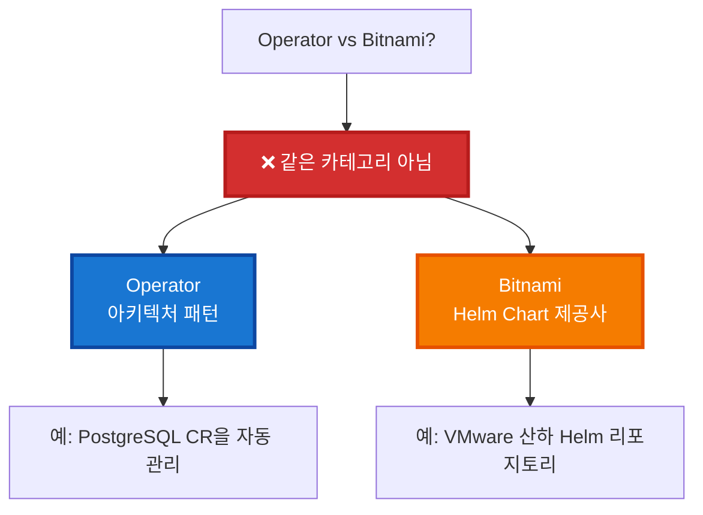
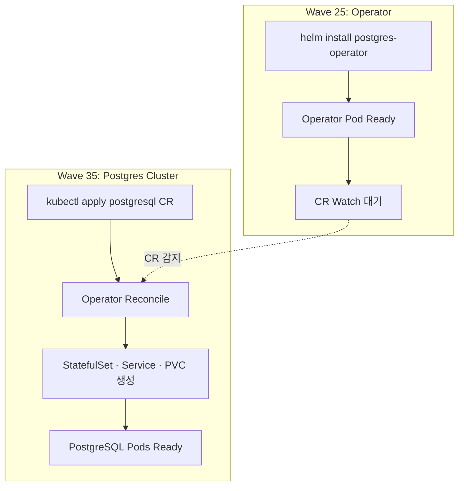

# DATA_OPERATOR_DESCRIPTION

> **목적**: Operator 패턴과 Bitnami Helm Chart의 차이를 명확히 문서화하고, PostgreSQL을 예시로 Wave 기반 GitOps 파이프라인 내 배치 순서를 정의한다.  
> **버전**: v1.1 · **작성일**: 2025-11-16 · **작성자**: Backend Platform Team

---

## 1. 개념 구분



### 1.1 Operator (아키텍처 패턴)

```yaml
정의: Kubernetes 리소스를 Custom Resource + Controller로 확장하여
      사람의 도메인 지식을 코드화한 자동화 패턴
핵심 구성:
  - Custom Resource Definition (CRD)
  - Controller / Reconcile Loop
  - 상태 관찰 → Desired State 충족
특징:
  - Self-healing (Drift 복구)
  - Domain-specific logic (예: PostgreSQL Failover)
  - 선언적 API (`kubectl apply -f postgresql.yaml`)
대표 Operator:
  - Zalando Postgres Operator
  - Spotahome Redis Operator
  - Prometheus Operator
```

### 1.2 Bitnami (Helm Chart 브랜드)

```yaml
정의: VMware 소유의 OSS 애플리케이션 패키징 벤더
제공물:
  - Container 이미지 (예: bitnami/postgresql:15.3.0)
  - Helm Chart Repository (stable/bitnami)
  - Best Practice 기본값
특징:
  - 대부분 StatefulSet/Deployment 템플릿
  - Operator 아님 (일부 Operator Chart 패키징은 예외)
  - 수동 Helm upgrade에 의존
```

---

## 2. PostgreSQL 사례 비교

### 2.1 Bitnami PostgreSQL Chart (Operator 아님)

```bash
helm install my-postgres bitnami/postgresql \
  --namespace data --create-namespace
```

```yaml
apiVersion: apps/v1
kind: StatefulSet
metadata:
  name: postgresql
spec:
  replicas: 1
  template:
    spec:
      containers:
        - name: postgresql
          image: bitnami/postgresql:15.3.0
# ❌ Custom Resource 없음
# ❌ Reconcile Loop 없음
# ✅ Helm upgrade로만 스케일/업그레이드
```

- 수동 `helm upgrade`가 필요하며 복구 로직은 Pod 재시작 수준.
- 백업/Failover, 모니터링 사이드카는 사용자가 직접 구성해야 함.

### 2.2 Zalando Postgres Operator

```bash
# Wave 25: Operator 배포
helm repo add zalando https://opensource.zalando.com/postgres-operator/charts/postgres-operator
helm install postgres-operator zalando/postgres-operator \
  --namespace postgres-operator --create-namespace

# Wave 35: CR로 클러스터 선언
cat <<'EOF' | kubectl apply -f -
apiVersion: acid.zalan.do/v1
kind: postgresql
metadata:
  name: postgres-main
  namespace: data
spec:
  teamId: "platform"
  numberOfInstances: 3
  users:
    sesacthon: []
  databases:
    sesacthon: sesacthon
  volume:
    size: 100Gi
EOF
```

- Operator가 CR을 감지하면 StatefulSet, Services, PVC, Secret, Backup CronJob, Monitoring Sidecar까지 일괄 생성.
- Replica 수 변경, 백업 스케줄 변경 등은 CR 수정으로 자동 반영.

### 2.3 비교 요약

| 항목 | Bitnami Chart (`bitnami/postgresql`) | Zalando Postgres Operator |
|------|-------------------------------------|---------------------------|
| 리소스 타입 | StatefulSet + ConfigMap | CRD + Controller + 생성된 StatefulSet |
| 설치 흐름 | `helm install/upgrade` | `helm install operator` → `kubectl apply CR` |
| 상태 관리 | 수동 (Helm values) | Reconcile Loop (자동 Drift 복구) |
| Failover | Pod 재시작 수준 | Patroni 내장, 자동 Failover |
| 백업 | 사용자가 CronJob 직접 작성 | Operator가 CronJob 생성 |
| 모니터링 | 수동 Exporter 추가 | Sidecar 자동 포함 (옵션) |
| 스케일 | `helm upgrade --set replicas=3` | `spec.numberOfInstances` 변경 |
| 적용 범위 | 주로 개발/단순 환경 | 프로덕션·HA 필수 환경 |
| SLA | 95% 수준 (수동복구) | 99.9% 목표 (자동복구) |

> **참고**: Bitnami도 `bitnami/rabbitmq-cluster-operator`처럼 다른 벤더 Operator를 Helm Chart 형태로 재포장하는 경우가 있으나, Chart 자체가 Operator가 되는 것은 아니다.

---

## 3. 무료 Operator 카탈로그

Bitnami Chart로는 HA·백업·자동 복구 요구사항을 충족하기 어렵기 때문에, 프로덕션 데이터 계층은 아래 무료 Operator 조합을 기본 옵션으로 삼는다.

### 3.1 PostgreSQL

| Operator | Maintainer / License | 설치 방법 | 주요 특징 |
|----------|---------------------|-----------|-----------|
| [Zalando Postgres Operator](https://github.com/zalando/postgres-operator) | Zalando · MIT license (GitHub 표기) | `helm repo add zalando https://opensource.zalando.com/postgres-operator/charts/postgres-operator`<br>`helm install postgres-operator zalando/postgres-operator -n postgres-operator --create-namespace` | Patroni 기반 HA·자동 Failover, `acid.zalan.do/v1/postgresql` CR, 백업·모니터링 리소스를 일괄 생성 |
| [CloudNativePG](https://github.com/cloudnative-pg/cloudnative-pg) | CloudNativePG 프로젝트 · Apache-2.0 | CloudNativePG 공식 문서에 따라 `kubectl apply --server-side -f https://raw.githubusercontent.com/cloudnative-pg/cloudnative-pg/release-1.27/releases/cnpg-1.27.1.yaml` | CNCF 프로젝트, 순정 PostgreSQL 전용, `kubectl cnpg` CLI로 백업/복구·비동기 복제·데이터베이스 증설 관리 |
| [Crunchy PostgreSQL Operator (PGO)](https://github.com/CrunchyData/postgres-operator) | Crunchy Data · Apache-2.0 | `kubectl apply -f https://raw.githubusercontent.com/CrunchyData/postgres-operator/v5.0.0/installers/kubectl/postgres-operator.yml` (공식 설치 매니페스트) | 고가용성/백업/DR 프로파일 포함, Monitoring Exporter/pgBackRest 연동, OperatorHub/OLM 지원 |

**선택 가이드**
- GitOps 친화/가벼운 구성이면 Zalando, 멀티 클러스터 SaaS 요구면 CloudNativePG, DBaaS-style 템플릿이 필요하면 PGO를 우선 검토한다.
- 세 Operator 모두 OSS이므로 추가 라이선스 비용 없이 테스트·프로덕션에 배치 가능하다.

### 3.2 Redis

| Operator | Maintainer / License | 설치 방법 | 주요 특징 |
|----------|---------------------|-----------|-----------|
| [Spotahome Redis Operator](https://github.com/spotahome/redis-operator) | Spotahome · Apache-2.0 | `kubectl apply -f https://raw.githubusercontent.com/spotahome/redis-operator/v1.0.0/deploy/operator.yaml` | Sentinel 기반 자동 Failover, Redis 6+ 지원, `RedisFailover` CR 하나로 Master/Replica/Exporter를 일괄 관리, Kubernetes 1.21+ 검증 |

### 3.3 RabbitMQ

| Operator | Maintainer / License | 설치 방법 | 주요 특징 |
|----------|---------------------|-----------|-----------|
| [RabbitMQ Cluster Operator](https://github.com/rabbitmq/cluster-operator) | RabbitMQ Core Team · MPL-2.0 | `kubectl apply -f https://github.com/rabbitmq/cluster-operator/releases/download/v2.7.0/cluster-operator.yml` *(버전은 최신 릴리스에 맞춰 변경)* | RabbitMQ 공식 팀이 유지보수, `RabbitmqCluster` CR로 클러스터/업그레이드/토폴로지 자동화, [공식 문서](https://www.rabbitmq.com/kubernetes/operator/operator-overview)에서 Messaging Topology Operator와 함께 지원 |

> **Bitnami RabbitMQ 상태**  
> Bitnami `rabbitmq`/`rabbitmq-cluster-operator` Chart는 2025-08-28 이후 Debian 기반 이미지가 중단되었고(`docs/troubleshooting/TROUBLESHOOTING.md` §18.5), VMware/Broadcom 지원 매트릭스에서도 빠졌다. 내부 정책상 Bitnami RabbitMQ Chart는 **Deprecated**로 분류하며, 공식 RabbitMQ Operator로 즉시 마이그레이션한다.

---

## 4. Wave 기반 배포 시퀀스 (ArgoCD App-of-Apps)

Operator는 “공장”, Custom Resource는 “주문서”에 해당하며 순서가 뒤바뀌면 CR을 감시할 주체가 없다.



### 4.1 타임라인

1. **T+0s (Wave 25)**: Helm으로 Operator 설치 → Controller Pod 실행, `postgresql` CRD 감시 시작. (아직 DB 없음)
2. **T+60s (Wave 35)**: `postgres-main` CR 적용 → Operator가 이벤트 감지.
3. **T+65s**: StatefulSet/Service/PVC/Secret/ConfigMap/Backup Job을 자동 생성.
4. **T+90s**: Pod가 순차 기동 → Patroni/Backup/Monitoring 사이드카까지 활성화.
5. **이후**: CR 수정 시마다 Operator가 Drift를 감지하고 Reconcile.

---

## 5. 사용 시나리오 가이드

| 사용 조건 | 권장 솔루션 | 이유 |
|-----------|-------------|------|
| 단일 인스턴스, Dev/Test, HA 불필요 | Bitnami Chart | 설치가 단순, 운영 개입 용이 |
| 멀티 AZ/HA, 자동 Failover, 백업 필수 | Operator (Zalando/Spotahome 등) | CR 기반 자동화, Self-healing |
| 메시지 브로커/DB 등 프로덕션 데이터 계층 | Operator | 상태 보존/복구 로직 포함 |
| 단순 캐시/Stateless 서비스 | Bitnami Chart or Kustomize | Stateful 관리 복잡도가 낮음 |

---

## 6. SeSACTHON 권장안

- **데이터 계층 (PostgreSQL, Redis, RabbitMQ)**: Operator 우선.  
  - PostgreSQL → Zalando Operator (또는 워크로드별로 CloudNativePG/PGO 보완)  
  - Redis → Spotahome Redis Operator  
  - RabbitMQ → [rabbitmq/cluster-operator](https://github.com/rabbitmq/cluster-operator) (Bitnami 이미지 중단으로 공식 Operator만 지원)
- **Wave 구성**: Wave 25에 모든 Operator 설치, Wave 35 이후 각 CR (DB/Queue Cluster) 선언.
- **Bitnami Chart 사용 범위**: 개발 환경, 단일 Replica, 빠른 프로토타이핑에 한정. (RabbitMQ는 예외 없이 Operator 전환)
- **GitOps 팁**: Operator Chart는 ArgoCD `syncWave: 25`, 각 CR은 `syncWave: 35`로 명시하여 순서를 보장한다.

---

## 7. 핵심 메시지

1. **Operator vs Bitnami**는 “패턴 vs 패키저” 비교이지 동급 비교가 아니다.  
2. Bitnami Chart 대부분은 StatefulSet 템플릿일 뿐, Operator가 제공하는 CR 기반 자동화 기능을 가지지 않는다.  
3. 프로덕션 데이터 계층은 반드시 Operator + CR 조합으로 선언적 관리(Wave 분리, Reconcile Loop)해야 SLA와 복구 시간을 충족할 수 있다.

---

> **DATA_OPERATOR_DESCRIPTION**은 위 내용을 단일 소스로 유지하며, 이후 Operator 관련 설계/감사 문서에서 본 레코드를 참조한다.

