# GitOps 아키텍처 - 전체 구성

> 14-Node Microservices Architecture의 GitOps 워크플로우 및 도구 역할 정리

## 📋 목차

1. [GitOps 개요](#gitops-개요)
2. [도구별 역할 구분](#도구별-역할-구분)
3. [Helm Chart의 역할](#helm-chart의-역할)
4. [전체 워크플로우](#전체-워크플로우)
5. [각 도구의 관리 범위](#각-도구의-관리-범위)
6. [Git 저장소 구조](#git-저장소-구조)
7. [변경 시나리오별 워크플로우](#변경-시나리오별-워크플로우)

---

## GitOps 개요

### GitOps란?

**Git을 Single Source of Truth로 사용하여 인프라와 애플리케이션을 선언적으로 관리**

```
Git Repository (Source of Truth)
    ↓
Automation Tools (Atlantis, ArgoCD, Ansible)
    ↓
Infrastructure & Applications (AWS, Kubernetes)
```

---

## 도구별 역할 구분

### 1. Atlantis (Terraform GitOps)

**역할**: AWS 인프라 관리 (Infrastructure as Code)

**관리 대상**:
- ✅ VPC, Subnet, Security Group
- ✅ EC2 Instances (Master, Workers, Monitoring, DB, Storage 노드)
- ✅ IAM Roles, Policies
- ✅ Route53 DNS
- ✅ CloudFront CDN
- ✅ S3 Buckets
- ✅ AWS Load Balancer

**워크플로우**:
```
1. Terraform 코드 수정 (terraform/*.tf)
2. Pull Request 생성
3. Atlantis가 자동으로 `terraform plan` 실행 → PR에 결과 코멘트
4. 리뷰 후 승인
5. PR 코멘트: `atlantis apply`
6. Atlantis가 `terraform apply` 실행 → AWS 인프라 변경
```

**Atlantis가 관리하지 않는 것**:
- ❌ Kubernetes 클러스터 설정 (Kubeadm, CNI, 노드 초기화)
- ❌ Kubernetes 리소스 (Deployment, Service, ConfigMap)
- ❌ 애플리케이션 배포

---

### 2. Ansible (Cluster Configuration Management)

**역할**: Kubernetes 클러스터 설정 및 초기화

**관리 대상**:
- ✅ Kubernetes 클러스터 초기화 (Kubeadm)
- ✅ CNI 설치 (Calico)
- ✅ 노드 레이블링 (node-role, feature labels)
- ✅ 시스템 패키지 설치 (kubectl, helm, docker)
- ✅ Kubernetes 인프라 컴포넌트 배포:
  - Cert-Manager
  - AWS Load Balancer Controller
  - Metrics Server
  - Ingress 리소스
  - Prometheus, Grafana
  - Atlantis
  - ArgoCD

**워크플로우**:
```
1. Ansible Playbook 수정 (ansible/playbooks/*.yml)
2. Git Push
3. ArgoCD Hooks가 감지하여 Ansible 실행 (자동)
   또는
   수동 실행: ansible-playbook -i ansible/inventory/hosts.ini ansible/playbooks/site.yml
4. Kubernetes 클러스터 설정 변경
```

**Ansible이 관리하지 않는 것**:
- ❌ AWS 인프라 생성/삭제 (EC2, VPC 등)
- ❌ 애플리케이션 배포 (API 서버들)
- ❌ 애플리케이션 빌드/테스트

---

### 3. ArgoCD (Application Deployment GitOps)

**역할**: Kubernetes 애플리케이션 배포 및 동기화

**관리 대상**:
- ✅ Microservices API Deployments:
  - Auth API
  - Scan API
  - Chat API
  - Mypage API
  - Location API
  - Info API
  - Character API
- ✅ Database Deployments:
  - PostgreSQL
  - Redis
  - RabbitMQ
- ✅ Kubernetes 리소스:
  - Deployments
  - Services
  - ConfigMaps
  - Secrets
  - PersistentVolumeClaims

**워크플로우**:
```
1. Kubernetes Manifest 수정 (k8s/*.yaml)
   또는
   애플리케이션 이미지 업데이트
2. Git Push
3. ArgoCD가 변경 사항 자동 감지
4. ArgoCD가 클러스터에 자동 배포 (Auto-Sync)
```

**ArgoCD Hooks** (Phase 3):
```
PreSync Hook → Ansible 실행 → 클러스터 설정 변경
    ↓
ArgoCD Sync → 애플리케이션 배포
    ↓
PostSync Hook → Health Check, Smoke Test
```

**ArgoCD가 관리하지 않는 것**:
- ❌ AWS 인프라 (Atlantis 담당)
- ❌ Kubernetes 클러스터 초기화 (Ansible 담당)
- ❌ CI/CD 빌드/테스트 (GitHub Actions 담당)

---

### 4. GitHub Actions (CI/CD)

**역할**: 애플리케이션 빌드, 테스트, 이미지 생성

**관리 대상**:
- ✅ 코드 빌드
- ✅ 단위 테스트, 통합 테스트
- ✅ Docker 이미지 빌드
- ✅ Docker 이미지 푸시 (ECR, Docker Hub)
- ✅ 이미지 태그 업데이트 (k8s/*.yaml)

**워크플로우**:
```
1. 애플리케이션 코드 수정 (src/*)
2. Git Push
3. GitHub Actions 실행:
   - 테스트
   - Docker 이미지 빌드
   - 이미지 푸시
   - Helm Chart values 파일의 이미지 태그 업데이트
4. ArgoCD가 감지하여 자동 배포
```

---

## Helm Chart의 역할

### 5. Helm (Kubernetes Package Manager)

**역할**: Kubernetes 리소스를 템플릿화하여 관리

**Helm Chart란?**
- Kubernetes 리소스(Deployment, Service, ConfigMap 등)를 패키지로 묶은 것
- 템플릿 + Values로 구성되어 환경별 설정을 쉽게 관리
- ArgoCD가 Helm Chart를 렌더링하여 Kubernetes에 배포

**관리 대상**:
- ✅ Kubernetes 리소스 템플릿:
  - `charts/ecoeco-backend/templates/`
    - deployments.yaml
    - services.yaml
    - ingress.yaml
    - configmaps.yaml
    - secrets.yaml
- ✅ 환경별 Values 파일:
  - `values-14nodes.yaml` (14-Node 프로덕션)
  - `values-dev.yaml` (개발 환경)
  - `values.yaml` (기본값)

**Helm Chart 구조**:
```yaml
charts/ecoeco-backend/
├── Chart.yaml                    # Chart 메타데이터
├── values.yaml                   # 기본 Values
├── values-14nodes.yaml          # 14-Node 프로덕션 Values
├── values-dev.yaml              # 개발 환경 Values
└── templates/                   # Kubernetes 리소스 템플릿
    ├── auth/
    │   ├── deployment.yaml      # {{ .Values.api.auth.image.tag }}
    │   └── service.yaml
    ├── scan/
    │   ├── deployment.yaml
    │   └── service.yaml
    ├── chat/
    │   ├── deployment.yaml
    │   └── service.yaml
    ├── ingress.yaml
    ├── configmap.yaml
    └── secrets.yaml
```

**Values 파일 예시** (`values-14nodes.yaml`):
```yaml
global:
  image:
    registry: ghcr.io
    repository: sesacthon
    pullPolicy: Always
  domain: growbin.app

api:
  auth:
    enabled: true
    replicaCount: 2
    image:
      name: auth-service
      tag: v1.2.3                 # GitHub Actions가 업데이트
    nodeSelector:
      node-role: auth
    resources:
      requests:
        memory: "256Mi"
        cpu: "100m"
      limits:
        memory: "512Mi"
        cpu: "500m"
  
  scan:
    enabled: true
    replicaCount: 2
    image:
      name: scan-service
      tag: v1.4.5                 # GitHub Actions가 업데이트
    nodeSelector:
      node-role: scan
    resources:
      requests:
        memory: "512Mi"
        cpu: "200m"
```

**템플릿 파일 예시** (`templates/auth/deployment.yaml`):
```yaml
apiVersion: apps/v1
kind: Deployment
metadata:
  name: {{ .Values.api.auth.name | default "auth-service" }}
  namespace: {{ .Values.api.namespace }}
spec:
  replicas: {{ .Values.api.auth.replicaCount }}
  selector:
    matchLabels:
      app: auth
  template:
    metadata:
      labels:
        app: auth
    spec:
      nodeSelector:
        {{- toYaml .Values.api.auth.nodeSelector | nindent 8 }}
      containers:
        - name: auth
          image: "{{ .Values.global.image.registry }}/{{ .Values.global.image.repository }}/{{ .Values.api.auth.image.name }}:{{ .Values.api.auth.image.tag }}"
          imagePullPolicy: {{ .Values.global.image.pullPolicy }}
          ports:
            - containerPort: 8000
          env:
            - name: DATABASE_URL
              value: "postgresql://{{ .Values.externalServices.postgresql.host }}:{{ .Values.externalServices.postgresql.port }}/{{ .Values.externalServices.postgresql.database }}"
          resources:
            {{- toYaml .Values.api.auth.resources | nindent 12 }}
```

**Helm의 장점**:
```yaml
장점:
  ✅ 템플릿화:
    - 중복 코드 제거
    - 유지보수 용이
  
  ✅ 환경별 관리:
    - values-14nodes.yaml (프로덕션)
    - values-dev.yaml (개발)
    - 하나의 템플릿, 여러 환경
  
  ✅ 버전 관리:
    - Chart.yaml에 버전 명시
    - 롤백 용이
  
  ✅ ArgoCD 통합:
    - ArgoCD가 Helm Chart를 직접 렌더링
    - Helm CLI 불필요
```

**워크플로우**:


```mermaid
graph LR
    A[GitHub Actions] --> B[이미지 빌드 & 푸시]
    B --> C[values-14nodes.yaml<br/>이미지 태그 업데이트]
    C --> D[Git Commit & Push]
    D --> E[ArgoCD 감지]
    E --> F[Helm Chart 렌더링]
    F --> G[kubectl apply]
    G --> H[Kubernetes Cluster]
    
    style A fill:#b91c1c,stroke:#dc2626,stroke-width:2px,color:#fff
    style B fill:#0e7490,stroke:#06b6d4,stroke-width:2px,color:#fff
    style C fill:#166534,stroke:#16a34a,stroke-width:2px,color:#fff
    style D fill:#78350f,stroke:#a16207,stroke-width:2px,color:#fff
    style E fill:#6b21a8,stroke:#9333ea,stroke-width:2px,color:#fff
    style F fill:#1e3a8a,stroke:#2563eb,stroke-width:2px,color:#fff
    style G fill:#991b1b,stroke:#dc2626,stroke-width:2px,color:#fff
    style H fill:#0c4a6e,stroke:#0369a1,stroke-width:2px,color:#fff
```

**Helm이 관리하지 않는 것**:
- ❌ Docker 이미지 빌드 (GitHub Actions 담당)
- ❌ AWS 인프라 (Atlantis 담당)
- ❌ Kubernetes 클러스터 초기화 (Ansible 담당)
- ❌ 실제 배포 실행 (ArgoCD가 Helm을 사용하여 배포)

**Helm vs Raw Kubernetes YAML**:

| 구분 | Raw YAML (k8s/) | Helm Chart (charts/) |
|------|----------------|---------------------|
| **관리 방식** | 파일별 개별 관리 | 템플릿 + Values |
| **중복** | 높음 (반복 코드) | 낮음 (템플릿화) |
| **환경 관리** | 파일 복사 필요 | Values 파일만 변경 |
| **유지보수** | 어려움 | 쉬움 |
| **ArgoCD 통합** | 가능 | 가능 (권장) |

**실제 사용 예시**:

```bash
# ArgoCD Application에서 Helm Chart 지정
apiVersion: argoproj.io/v1alpha1
kind: Application
metadata:
  name: ecoeco-backend-14nodes
spec:
  source:
    repoURL: https://github.com/SeSACTHON/backend.git
    targetRevision: develop
    path: charts/ecoeco-backend        # Helm Chart 경로
    helm:
      valueFiles:
        - values-14nodes.yaml          # 14-Node 프로덕션 Values
      parameters:
        - name: api.auth.image.tag
          value: v1.2.3                # 동적으로 변경 가능
```

---

## 전체 워크플로우

### Phase 1: 인프라 생성 (Atlantis + Terraform)

```mermaid
graph LR
    A[terraform/*.tf 수정] --> B[Pull Request]
    B --> C[Atlantis: terraform plan]
    C --> D[PR 리뷰]
    D --> E[atlantis apply 코멘트]
    E --> F[AWS 인프라 생성]
    F --> G[EC2 Instances Running]
    
    style A fill:#78350f,stroke:#a16207,stroke-width:2px,color:#fff
    style B fill:#0e7490,stroke:#06b6d4,stroke-width:2px,color:#fff
    style C fill:#b91c1c,stroke:#dc2626,stroke-width:2px,color:#fff
    style D fill:#166534,stroke:#16a34a,stroke-width:2px,color:#fff
    style E fill:#6b21a8,stroke:#9333ea,stroke-width:2px,color:#fff
    style F fill:#1e3a8a,stroke:#2563eb,stroke-width:2px,color:#fff
    style G fill:#991b1b,stroke:#dc2626,stroke-width:2px,color:#fff
```



### Phase 2: 클러스터 설정 (Ansible)

```mermaid
graph LR
    A[ansible/playbooks/*.yml 수정] --> B[Git Push]
    B --> C[ArgoCD Hook 트리거]
    C --> D[Ansible Playbook 실행]
    D --> E[Kubernetes 클러스터 초기화]
    E --> F[인프라 컴포넌트 설치]
    F --> G[클러스터 Ready]
    
    style A fill:#78350f,stroke:#a16207,stroke-width:2px,color:#fff
    style B fill:#0e7490,stroke:#06b6d4,stroke-width:2px,color:#fff
    style C fill:#6b21a8,stroke:#9333ea,stroke-width:2px,color:#fff
    style D fill:#166534,stroke:#16a34a,stroke-width:2px,color:#fff
    style E fill:#1e3a8a,stroke:#2563eb,stroke-width:2px,color:#fff
    style F fill:#b91c1c,stroke:#dc2626,stroke-width:2px,color:#fff
    style G fill:#991b1b,stroke:#dc2626,stroke-width:2px,color:#fff
```



### Phase 3: 애플리케이션 배포 (ArgoCD + GitHub Actions)

```mermaid
graph LR
    A[src/* 코드 수정] --> B[Git Push]
    B --> C[GitHub Actions: Build & Test]
    C --> D[Docker Image Push]
    D --> E[k8s/*.yaml 이미지 태그 업데이트]
    E --> F[Git Push]
    F --> G[ArgoCD 감지]
    G --> H[자동 배포]
    
    style A fill:#78350f,stroke:#a16207,stroke-width:2px,color:#fff
    style B fill:#0e7490,stroke:#06b6d4,stroke-width:2px,color:#fff
    style C fill:#b91c1c,stroke:#dc2626,stroke-width:2px,color:#fff
    style D fill:#166534,stroke:#16a34a,stroke-width:2px,color:#fff
    style E fill:#1e3a8a,stroke:#2563eb,stroke-width:2px,color:#fff
    style F fill:#0e7490,stroke:#06b6d4,stroke-width:2px,color:#fff
    style G fill:#6b21a8,stroke:#9333ea,stroke-width:2px,color:#fff
    style H fill:#991b1b,stroke:#dc2626,stroke-width:2px,color:#fff
```



---

## 각 도구의 관리 범위

### Layer별 구분

```
┌─────────────────────────────────────────────────────────┐
│  Layer 5: Application Code (개발자)                      │
│  - 애플리케이션 소스 코드                                  │
│  - 단위 테스트                                            │
└─────────────────────────────────────────────────────────┘
                    ↓ GitHub Actions (CI)
┌─────────────────────────────────────────────────────────┐
│  Layer 4: Container Images (GitHub Actions)              │
│  - Docker 이미지 빌드                                      │
│  - 이미지 레지스트리 (GHCR)                                │
└─────────────────────────────────────────────────────────┘
                    ↓ Image Tag Update
┌─────────────────────────────────────────────────────────┐
│  Layer 3: Package Management (Helm)                      │
│  - Kubernetes 리소스 템플릿                                │
│  - Values 파일 (환경별 설정)                               │
│  - Chart 버전 관리                                         │
└─────────────────────────────────────────────────────────┘
                    ↓ ArgoCD Render
┌─────────────────────────────────────────────────────────┐
│  Layer 2: Application Deployment (ArgoCD)                │
│  - Helm Chart 렌더링                                       │
│  - Git → Cluster 동기화                                   │
│  - 애플리케이션 배포                                        │
└─────────────────────────────────────────────────────────┘
                    ↓ kubectl apply
┌─────────────────────────────────────────────────────────┐
│  Layer 1: Kubernetes Cluster (Ansible)                   │
│  - Kubeadm init/join                                      │
│  - CNI (Calico)                                           │
│  - 노드 레이블링                                           │
│  - 인프라 컴포넌트 (Cert-Manager, ALB Controller)          │
└─────────────────────────────────────────────────────────┘
                    ↓ SSH & kubectl
┌─────────────────────────────────────────────────────────┐
│  Layer 0: Infrastructure (Atlantis + Terraform)          │
│  - AWS EC2, VPC, Security Groups                         │
│  - IAM Roles                                              │
│  - Route53, CloudFront                                    │
└─────────────────────────────────────────────────────────┘
```

---

## Git 저장소 구조

```
SeSACTHON/backend/
│
├── terraform/                    # Atlantis가 관리
│   ├── main.tf
│   ├── variables.tf
│   ├── vpc.tf
│   ├── ec2.tf
│   ├── iam.tf
│   └── ...
│
├── ansible/                      # Ansible이 관리
│   ├── inventory/
│   │   └── hosts.ini
│   └── playbooks/
│       ├── site.yml
│       ├── 01-prerequisites.yml
│       ├── 02-init-master.yml
│       ├── 03-join-workers.yml
│       ├── 04-cni-install.yml
│       ├── 05-label-nodes.yml
│       ├── 06-infrastructure-components.yml
│       ├── 07-ingress-resources.yml
│       ├── 08-monitoring.yml
│       └── 09-atlantis.yml
│
├── charts/                      # Helm Chart (ArgoCD가 사용)
│   └── ecoeco-backend/
│       ├── Chart.yaml
│       ├── values.yaml          # 기본 Values
│       ├── values-14nodes.yaml  # 14-Node 프로덕션
│       ├── values-dev.yaml      # 개발 환경
│       └── templates/           # Kubernetes 리소스 템플릿
│           ├── auth/
│           │   ├── deployment.yaml
│           │   └── service.yaml
│           ├── scan/
│           │   ├── deployment.yaml
│           │   └── service.yaml
│           ├── chat/
│           │   ├── deployment.yaml
│           │   └── service.yaml
│           ├── database/
│           │   ├── postgres.yaml
│           │   ├── redis.yaml
│           │   └── rabbitmq.yaml
│           ├── ingress.yaml
│           └── configmap.yaml
│
├── argocd/                      # ArgoCD Application 정의
│   ├── application-14nodes.yaml
│   └── applications/
│       ├── auth-app.yaml
│       └── scan-app.yaml
│
├── src/                          # GitHub Actions가 빌드
│   ├── auth/
│   ├── scan/
│   ├── chat/
│   └── ...
│
└── .github/
    └── workflows/
        ├── build-auth.yml
        ├── build-scan.yml
        └── ...
```

---

## 변경 시나리오별 워크플로우

### 시나리오 1: EC2 인스턴스 타입 변경

**도구**: Atlantis (Terraform)

```bash
1. terraform/variables.tf 수정
   variable "master_instance_type" {
     default = "t3.large"  # t3.medium에서 변경
   }

2. Pull Request 생성

3. Atlantis가 자동으로 plan 실행
   PR에 변경 사항 코멘트

4. 리뷰 후 PR에 코멘트: "atlantis apply"

5. Atlantis가 terraform apply 실행
   → EC2 인스턴스 타입 변경
```

### 시나리오 2: Kubernetes CNI 업그레이드

**도구**: Ansible

```bash
1. ansible/playbooks/04-cni-install.yml 수정
   - name: "Calico 설치"
     shell: |
       kubectl apply -f https://docs.projectcalico.org/v3.28/manifests/calico.yaml
       # 버전 변경: v3.26 → v3.28

2. Git Push

3. ArgoCD PreSync Hook 트리거
   → Ansible Playbook 실행
   → CNI 업그레이드

4. 또는 수동 실행:
   ansible-playbook -i ansible/inventory/hosts.ini \
     ansible/playbooks/04-cni-install.yml
```

### 시나리오 3: Auth API 버전 업데이트

**도구**: GitHub Actions → Helm → ArgoCD

```bash
1. src/auth/*.ts 코드 수정

2. Git Push

3. GitHub Actions 실행:
   - 테스트
   - Docker 이미지 빌드 (태그: v1.2.3)
   - 이미지 푸시 (GHCR)

4. GitHub Actions가 charts/ecoeco-backend/values-14nodes.yaml 수정:
   api:
     auth:
       image:
         tag: v1.2.3  # 업데이트!

5. Git Push

6. ArgoCD가 변경 감지
   → Helm Chart 렌더링
   → 자동 배포
```

### 시나리오 4: PostgreSQL 리소스 증가

**도구**: ArgoCD

```bash
1. k8s/database/postgres-deployment.yaml 수정
   resources:
     requests:
       memory: "2Gi"   # 1Gi에서 변경
       cpu: "1"        # 500m에서 변경

2. Git Push

3. ArgoCD가 자동으로 감지하여 배포
   → PostgreSQL Pod 재시작 (새로운 리소스 할당)
```

### 시나리오 5: 새로운 Worker 노드 추가

**도구**: Atlantis → Ansible

```bash
# Phase 1: 인프라 생성 (Atlantis)
1. terraform/variables.tf 수정
   variable "scan_worker_count" {
     default = 3  # 2에서 변경
   }

2. Pull Request 생성

3. atlantis apply
   → EC2 인스턴스 생성

# Phase 2: 클러스터 조인 (Ansible)
4. Ansible inventory 자동 업데이트

5. ansible-playbook -i ansible/inventory/hosts.ini \
     ansible/playbooks/03-join-workers.yml
   → 새 Worker 노드가 클러스터에 조인

6. ansible-playbook -i ansible/inventory/hosts.ini \
     ansible/playbooks/05-label-nodes.yml
   → 노드 레이블링
```

---

## 각 도구의 장단점

### Atlantis (Terraform)

**장점**:
- ✅ PR 기반 리뷰 프로세스
- ✅ Plan 결과를 PR에 자동 코멘트
- ✅ 인프라 변경 이력이 Git에 기록
- ✅ 롤백이 용이 (Git revert)

**단점**:
- ❌ Kubernetes 리소스 관리 불가
- ❌ 애플리케이션 배포 불가

**사용 케이스**:
- AWS 리소스 생성/수정/삭제
- 인프라 변경 사항 리뷰

---

### Ansible

**장점**:
- ✅ SSH 기반으로 모든 노드 제어 가능
- ✅ 시스템 레벨 설정 관리
- ✅ 멱등성 (Idempotency)
- ✅ Playbook으로 복잡한 워크플로우 구현

**단점**:
- ❌ AWS 인프라 관리에는 적합하지 않음
- ❌ 애플리케이션 배포에는 ArgoCD가 더 적합

**사용 케이스**:
- Kubernetes 클러스터 초기화
- 시스템 패키지 설치
- 인프라 컴포넌트 배포

---

### ArgoCD

**장점**:
- ✅ Git을 Single Source of Truth로 사용
- ✅ 자동 동기화
- ✅ 실시간 상태 모니터링
- ✅ 롤백이 매우 쉬움
- ✅ UI/CLI로 쉬운 관리

**단점**:
- ❌ Kubernetes 외부 리소스 관리 불가
- ❌ 클러스터 초기화 불가

**사용 케이스**:
- Kubernetes 애플리케이션 배포
- 애플리케이션 상태 모니터링
- GitOps 워크플로우

---

### GitHub Actions

**장점**:
- ✅ GitHub와 완벽한 통합
- ✅ 병렬 실행
- ✅ 다양한 Action 마켓플레이스
- ✅ Secret 관리

**단점**:
- ❌ 인프라 관리 불가
- ❌ 배포 상태 추적 어려움

**사용 케이스**:
- 애플리케이션 빌드
- 테스트 실행
- Docker 이미지 생성

---

## GitOps 흐름도 (전체)

```
┌──────────────────────────────────────────────────────────────────────┐
│                        Developer Workflow                              │
└──────────────────────────────────────────────────────────────────────┘
    │
    ├── 인프라 변경? ─────────────────────────────────────────────────┐
    │                                                                   │
    │   terraform/*.tf 수정                                             │
    │        ↓                                                          │
    │   Pull Request                                                    │
    │        ↓                                                          │
    │   Atlantis: terraform plan                                        │
    │        ↓                                                          │
    │   리뷰 & 승인                                                     │
    │        ↓                                                          │
    │   atlantis apply 코멘트                                           │
    │        ↓                                                          │
    │   AWS 인프라 변경                                                 │
    │        ↓                                                          │
    └────────┼───────────────────────────────────────────────────────┘
             │
    ├── 클러스터 설정 변경? ───────────────────────────────────────────┐
    │                                                                   │
    │   ansible/playbooks/*.yml 수정                                    │
    │        ↓                                                          │
    │   Git Push                                                        │
    │        ↓                                                          │
    │   ArgoCD PreSync Hook                                             │
    │        ↓                                                          │
    │   Ansible Playbook 실행                                           │
    │        ↓                                                          │
    │   Kubernetes 클러스터 설정 변경                                   │
    │        ↓                                                          │
    └────────┼───────────────────────────────────────────────────────┘
             │
    └── 애플리케이션 배포? ───────────────────────────────────────────┐
                                                                       │
        src/* 코드 수정                                                │
             ↓                                                         │
        Git Push                                                       │
             ↓                                                         │
        GitHub Actions: Build & Test                                   │
             ↓                                                         │
        Docker Image Push                                              │
             ↓                                                         │
        k8s/*.yaml 이미지 태그 업데이트                                │
             ↓                                                         │
        Git Push                                                       │
             ↓                                                         │
        ArgoCD 감지                                                    │
             ↓                                                         │
        자동 배포                                                      │
             ↓                                                         │
        ────────┼───────────────────────────────────────────────────┘
```

---

## 결론

### Atlantis vs Ansible vs Helm vs ArgoCD

| 구분 | Atlantis | Ansible | Helm | ArgoCD |
|------|----------|---------|------|--------|
| **목적** | AWS 인프라 관리 | 클러스터 설정 | K8s 리소스 템플릿화 | 애플리케이션 배포 |
| **관리 대상** | EC2, VPC, IAM 등 | Kubeadm, CNI, 노드 설정 | Chart 템플릿, Values | Helm Chart 렌더링 |
| **실행 방식** | PR 코멘트 | SSH | 템플릿 + Values | Git Sync + Helm Render |
| **실행 주기** | 수동 (PR) | 수동/Hook | ArgoCD에 의해 실행 | 자동 (3분마다) |
| **롤백** | Git revert → apply | Playbook 재실행 | Values 변경 | Git revert → Auto-sync |

### 각 도구는 서로를 대체하지 않습니다!

- **Atlantis**: Infrastructure Layer (AWS)
- **Ansible**: Configuration Layer (Kubernetes Cluster)
- **Helm**: Package Management Layer (K8s 리소스 템플릿)
- **ArgoCD**: Application Layer (Kubernetes Apps 배포)

**모두 필요하며, 각자의 역할이 명확합니다.**

---

## 참고 문서

- [Atlantis 공식 문서](https://www.runatlantis.io/docs/)
- [Ansible 공식 문서](https://docs.ansible.com/)
- [Helm 공식 문서](https://helm.sh/docs/)
- [ArgoCD 공식 문서](https://argo-cd.readthedocs.io/)
- [GitOps 원칙](https://www.gitops.tech/)
- [Helm Chart Best Practices](https://helm.sh/docs/chart_best_practices/)

---

**작성일**: 2025-11-11  
**버전**: v0.7.0  
**아키텍처**: 14-Node Microservices with Full GitOps

