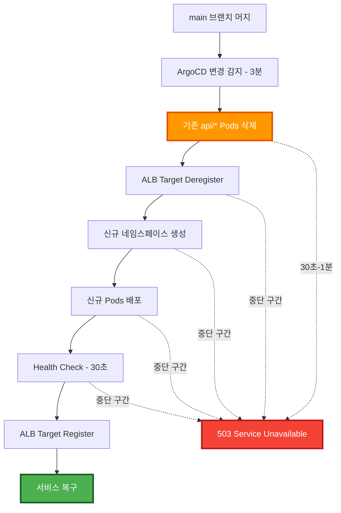
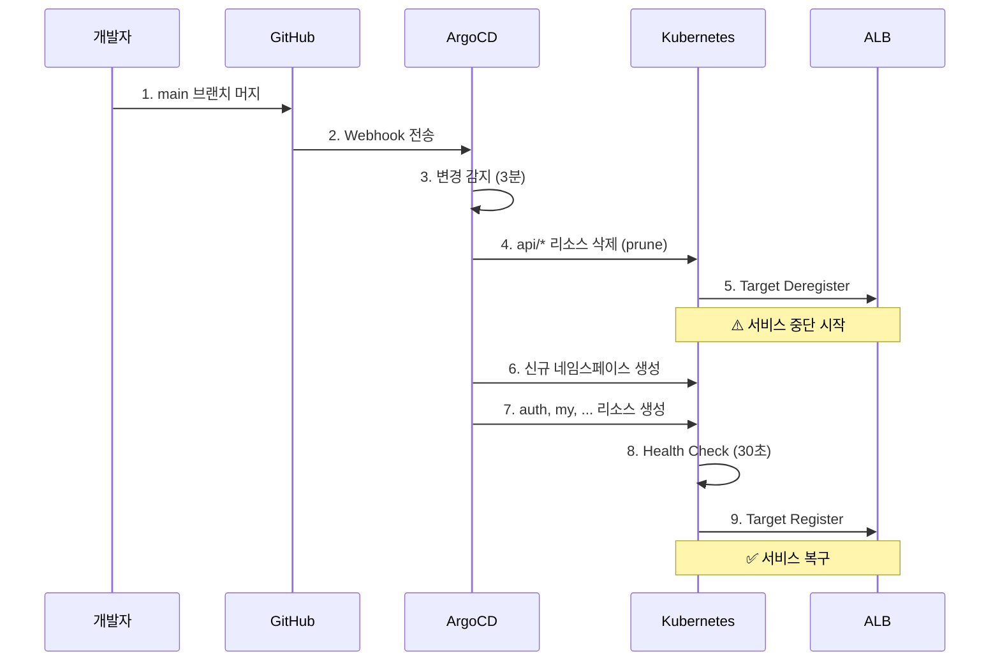
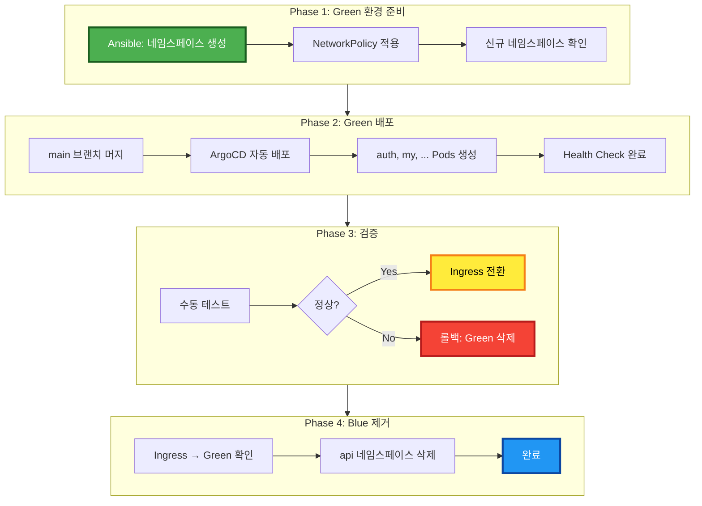
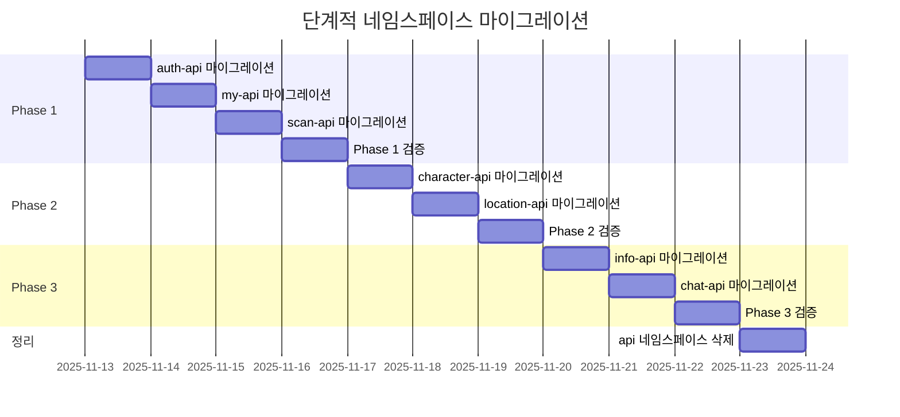
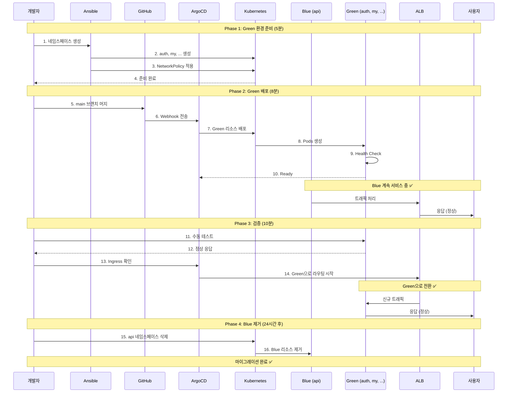

# 🚀 네임스페이스 마이그레이션 배포 전략

**문서 버전**: v1.0.0  
**최종 업데이트**: 2025-11-13  
**작성자**: EcoEco Backend Team  
**대상**: `api` → 도메인별 네임스페이스 마이그레이션

---

## 📋 목차

1. [현재 상황 분석](#-현재-상황-분석)
2. [가용한 배포 전략](#-가용한-배포-전략)
3. [전략별 상세 분석](#-전략별-상세-분석)
4. [권장 배포 전략](#-권장-배포-전략)
5. [배포 체크리스트](#-배포-체크리스트)
6. [롤백 전략](#-롤백-전략)

---

## 🎯 현재 상황 분석

### 1️⃣ ArgoCD 현재 설정

```yaml
# argocd/applications/ecoeco-appset-kustomize.yaml
source:
  repoURL: https://github.com/SeSACTHON/backend
  targetRevision: main  # ← main 브랜치 추적
  path: k8s/overlays/{{domain}}

destination:
  namespace: '{{namespace}}'  # ← 도메인별 네임스페이스

syncPolicy:
  automated:
    prune: true        # ⚠️ 자동 삭제 활성화
    selfHeal: true     # ⚠️ 자동 복구 활성화
    allowEmpty: false

  syncOptions:
    - CreateNamespace=true  # ✅ 네임스페이스 자동 생성
```

**핵심 특징:**
- ✅ **Automated Sync**: main 브랜치 변경 시 3분 이내 자동 배포
- ⚠️ **Prune 활성화**: 기존 `api` 네임스페이스 리소스 자동 삭제
- ✅ **CreateNamespace**: 신규 도메인별 네임스페이스 자동 생성
- ✅ **SelfHeal**: Drift 발생 시 자동 복구

### 2️⃣ 마이그레이션 영향 범위

```yaml
기존 구조:
  네임스페이스: api
  리소스:
    - auth-api (Deployment, Service, NodePort)
    - my-api
    - scan-api
    - character-api
    - location-api
    - info-api
    - chat-api
  총: 7개 서비스 × 3개 리소스 = 21개 리소스

신규 구조:
  네임스페이스: auth, my, scan, character, location, info, chat (7개)
  리소스:
    - 각 네임스페이스마다 3개 리소스 (Deployment, Service, NodePort)
    - NetworkPolicy 추가 (네임스페이스당 1개)
  총: 7개 네임스페이스 × 4개 리소스 = 28개 리소스
```

### 3️⃣ 서비스 중단 위험 요소



**예상 중단 시간**: 30초 ~ 1분

---

## 🛠️ 가용한 배포 전략

### 현재 인프라 기반 가능 전략

| 전략 | 가능 여부 | 서비스 중단 | 복잡도 | 리소스 | 권장도 |
|------|----------|------------|--------|--------|--------|
| **Rolling Update** | ✅ 가능 | ⚠️ 중단 (30초-1분) | ⭐ 낮음 | 1x | ⭐⭐ |
| **Blue-Green** | ✅ 가능 | ✅ 무중단 | ⭐⭐ 중간 | 2x | ⭐⭐⭐⭐⭐ |
| **Phased Rollout** | ✅ 가능 | ⚠️ 부분 중단 | ⭐⭐ 중간 | 1x | ⭐⭐⭐⭐ |
| **Manual Sync** | ✅ 가능 | ⚠️ 중단 (제어 가능) | ⭐ 낮음 | 1x | ⭐⭐⭐ |
| **Argo Rollouts** | ❌ 불가 | - | ⭐⭐⭐ 높음 | 1x | - |
| **Canary** | ❌ 불가 | - | ⭐⭐⭐ 높음 | 1x | - |

**불가능한 전략 및 이유:**
- **Argo Rollouts**: Controller 미설치
- **Canary**: Service Mesh (Istio) 부재

---

## 📊 전략별 상세 분석

### 전략 1: Rolling Update (ArgoCD 기본)

**개념:**
- ArgoCD가 main 브랜치 변경을 감지하여 자동 배포
- 기존 리소스 삭제 → 신규 리소스 생성 순차 진행

**장점:**
- ✅ 설정 변경 불필요 (현재 그대로)
- ✅ 가장 간단한 방법
- ✅ 추가 작업 없음

**단점:**
- ⚠️ 30초-1분 서비스 중단
- ⚠️ 롤백 시간 소요 (1-2분)
- ⚠️ 제어 불가 (자동 진행)

**프로세스:**



**예상 타임라인:**
```
00:00 - main 머지
00:03 - ArgoCD 감지 (최대 3분)
00:04 - 기존 Pod 삭제 시작
00:05 - 신규 Pod 생성 시작
00:06 - Health Check 완료
00:07 - ALB Target Register
00:08 - 서비스 복구 완료

총 소요 시간: 약 5-8분
서비스 중단: 00:04 ~ 00:08 (약 4분)
```

---

### 전략 2: Blue-Green 배포 (권장) ⭐⭐⭐⭐⭐

**개념:**
- 기존 `api` 네임스페이스 유지 (Blue)
- 신규 도메인별 네임스페이스 생성 (Green)
- 검증 후 Ingress 전환
- Blue 삭제

**장점:**
- ✅ **Zero Downtime**
- ✅ 검증 후 전환 가능
- ✅ 즉시 롤백 가능 (Ingress만 변경)
- ✅ 문제 발생 시 Blue로 즉시 복귀

**단점:**
- ⚠️ 2배 리소스 필요 (일시적)
- ⚠️ Ingress 수동 전환 필요
- ⚠️ 상태 동기화 필요 (Redis, PostgreSQL)

**프로세스:**



**상세 단계:**

#### Phase 1: Green 환경 준비 (사전 작업)

```bash
# 1. Ansible로 네임스페이스 먼저 생성
cd /Users/mango/workspace/SeSACTHON/backend
ansible-playbook ansible/playbooks/10-namespaces.yml

# 2. 네임스페이스 생성 확인
kubectl get namespaces -l app.kubernetes.io/part-of=ecoeco-backend

# 3. NetworkPolicy 확인
kubectl get networkpolicies --all-namespaces

# 예상 소요 시간: 2-3분
```

#### Phase 2: Green 배포 (main 머지)

```bash
# 1. main 브랜치로 전환 및 머지
git checkout main
git merge refactor/namespace-cleanup
git push origin main

# 2. ArgoCD 자동 배포 모니터링
kubectl get applications -n argocd -w

# 3. 신규 Pods 생성 확인
watch -n 2 'kubectl get pods -n auth,my,scan,character,location,info,chat'

# 4. Health Check 확인
kubectl get deployments -n auth,my,scan,character,location,info,chat

# 예상 소요 시간: 5-8분
```

#### Phase 3: 검증 및 전환

```bash
# 1. 수동 테스트 (신규 네임스페이스)
# auth-api (auth 네임스페이스)
kubectl port-forward -n auth svc/auth-api 8001:8000 &
curl http://localhost:8001/health

# my-api (my 네임스페이스)
kubectl port-forward -n my svc/my-api 8002:8000 &
curl http://localhost:8002/health

# scan-api (scan 네임스페이스)
kubectl port-forward -n scan svc/scan-api 8003:8000 &
curl http://localhost:8003/health

# ... (나머지 API 검증)

# 2. Ingress 확인 (이미 자동 전환됨)
kubectl get ingress -A

# 3. ALB Target Group 상태 확인
aws elbv2 describe-target-health \
  --target-group-arn <TG_ARN> \
  --region ap-northeast-2

# 예상 소요 시간: 5-10분
```

#### Phase 4: Blue 제거 (정리)

```bash
# 1. 신규 환경 정상 확인 (24시간 이후 권장)
# 2. 기존 api 네임스페이스 삭제
kubectl delete namespace api

# 3. 최종 확인
kubectl get namespaces
kubectl get pods -A | grep -v kube-system

# 예상 소요 시간: 1분
```

**예상 타임라인:**
```
Day 1 - 00:00: Phase 1 시작 (네임스페이스 생성)
Day 1 - 00:03: Phase 2 시작 (main 머지)
Day 1 - 00:11: Phase 3 시작 (검증)
Day 1 - 00:21: Ingress 전환 완료

⏸️  24시간 모니터링

Day 2 - 00:21: Phase 4 시작 (Blue 제거)
Day 2 - 00:22: 마이그레이션 완료

총 소요 시간: 약 21분 (작업), 24시간 (모니터링)
서비스 중단: 0분 (무중단)
```

---

### 전략 3: Phased Rollout (단계적 전환)

**개념:**
- 도메인별로 순차적 마이그레이션
- Phase 1 → Phase 2 → Phase 3 순서대로 전환
- 각 Phase 검증 후 다음 Phase 진행

**장점:**
- ✅ 위험 분산
- ✅ 문제 발생 시 영향 최소화
- ✅ 단계별 롤백 가능

**단점:**
- ⚠️ 시간 소요 (3일 이상)
- ⚠️ 복잡한 관리
- ⚠️ Ingress 라우팅 복잡

**프로세스:**



**상세 단계:**

```bash
# Day 1: Phase 1 (auth, my, scan)
git checkout -b feat/migrate-phase1
# ... auth, my, scan만 변경
git push origin feat/migrate-phase1
# → main 머지 → 검증

# Day 4: Phase 2 (character, location)
git checkout -b feat/migrate-phase2
# ... character, location만 변경
git push origin feat/migrate-phase2
# → main 머지 → 검증

# Day 6: Phase 3 (info, chat)
git checkout -b feat/migrate-phase3
# ... info, chat만 변경
git push origin feat/migrate-phase3
# → main 머지 → 검증

# Day 9: 정리
kubectl delete namespace api
```

---

### 전략 4: Manual Sync (수동 제어)

**개념:**
- ArgoCD Automated Sync 비활성화
- 수동으로 Sync 트리거
- 타이밍 제어 가능

**장점:**
- ✅ 배포 타이밍 제어 가능
- ✅ 문제 발생 시 즉시 중단 가능
- ✅ 점진적 배포 가능

**단점:**
- ⚠️ 수동 작업 필요
- ⚠️ 7개 Application 개별 Sync 필요
- ⚠️ Automation 이점 상실

**프로세스:**

```bash
# 1. Automated Sync 비활성화
kubectl patch applicationset ecoeco-api-services-kustomize \
  -n argocd \
  --type merge \
  -p '{"spec":{"syncPolicy":{"automated":null}}}'

# 2. main 브랜치 머지
git push origin main

# 3. 수동 Sync (1개씩 또는 전체)
# 방법 1: CLI
argocd app sync ecoeco-auth
argocd app sync ecoeco-my
argocd app sync ecoeco-scan
argocd app sync ecoeco-character
argocd app sync ecoeco-location
argocd app sync ecoeco-info
argocd app sync ecoeco-chat

# 방법 2: UI
# ArgoCD UI → Application 선택 → Sync 버튼 클릭

# 4. 검증 후 Automated Sync 재활성화
kubectl patch applicationset ecoeco-api-services-kustomize \
  -n argocd \
  --type merge \
  -p '{"spec":{"syncPolicy":{"automated":{"prune":true,"selfHeal":true}}}}'
```

---

## ⭐ 권장 배포 전략

### 해커톤 환경 기준: Blue-Green 배포 (전략 2)

**선택 이유:**

```yaml
1. Zero Downtime:
   - 서비스 중단 없음
   - 사용자 영향 최소화
   
2. 안전성:
   - 검증 후 전환
   - 즉시 롤백 가능 (Ingress만 변경)
   - Blue 환경 유지 (24시간)
   
3. 복잡도:
   - 중간 수준 (관리 가능)
   - 명확한 단계 구분
   - Ansible 자동화 활용
   
4. 리소스:
   - 일시적 2배 필요
   - 해커톤 환경에서 감당 가능
   - 24시간 후 Blue 제거
```

### 전체 배포 플로우 (Blue-Green)



---

## ✅ 배포 체크리스트

### 사전 준비 (배포 1일 전)

```yaml
인프라 점검:
  ✅ Kubernetes 클러스터 Health Check
  ✅ ArgoCD 정상 동작 확인
  ✅ Prometheus/Grafana 대시보드 준비
  ✅ ALB Health Check 정상 확인

백업:
  ✅ etcd 백업 완료
  ✅ PostgreSQL RDS 스냅샷 생성
  ✅ 현재 클러스터 상태 백업 (kubectl get all -A -o yaml > backup.yaml)
  ✅ Git 커밋 해시 기록 (롤백용)

접근 권한:
  ✅ kubectl 접근 가능 (admin.conf)
  ✅ ArgoCD CLI 로그인 완료
  ✅ AWS CLI 접근 가능
  ✅ SSH 접근 가능 (Ansible)

모니터링:
  ✅ Grafana 대시보드 URL 준비
  ✅ CloudWatch 알람 확인
  ✅ ALB Target Group ARN 확인
  ✅ Slack/Discord 알림 채널 준비

롤백 계획:
  ✅ 이전 main 커밋 해시 기록
  ✅ 롤백 스크립트 준비
  ✅ 긴급 연락망 확인
  ✅ 롤백 예상 시간 산정 (5분)
```

### Phase 1: Green 환경 준비 (D-Day 09:00)

```bash
# ✅ 1. SSH 접속 확인
ssh ubuntu@<MASTER_IP>

# ✅ 2. Ansible 네임스페이스 생성
cd /Users/mango/workspace/SeSACTHON/backend
ansible-playbook ansible/playbooks/10-namespaces.yml

# ✅ 3. 네임스페이스 확인
kubectl get namespaces -l app.kubernetes.io/part-of=ecoeco-backend
# 예상 출력: auth, my, scan, character, location, info, chat, data, monitoring

# ✅ 4. NetworkPolicy 확인
kubectl get networkpolicies --all-namespaces | grep -v kube-system

# ✅ 5. 완료 시간 기록
echo "Phase 1 완료: $(date)" | tee -a deployment.log
```

### Phase 2: Green 배포 (D-Day 09:05)

```bash
# ✅ 1. main 브랜치 머지
git checkout main
git merge refactor/namespace-cleanup
git push origin main

# ✅ 2. ArgoCD 감지 대기 (최대 3분)
watch -n 10 'kubectl get applications -n argocd'

# ✅ 3. 신규 Pods 생성 모니터링
watch -n 5 'kubectl get pods -n auth,my,scan,character,location,info,chat'

# ✅ 4. Deployment 상태 확인
kubectl get deployments -n auth,my,scan,character,location,info,chat

# 예상 출력:
# auth-api        2/2     2            2           5m
# my-api          2/2     2            2           5m
# ...

# ✅ 5. Health Check 확인
for ns in auth my scan character location info chat; do
  echo "Checking $ns namespace..."
  kubectl get pods -n $ns
  kubectl describe deployment -n $ns
done

# ✅ 6. 완료 시간 기록
echo "Phase 2 완료: $(date)" | tee -a deployment.log
```

### Phase 3: 검증 (D-Day 09:13)

```bash
# ✅ 1. Port-Forward 테스트 (각 서비스)
kubectl port-forward -n auth svc/auth-api 8001:8000 &
curl -X GET http://localhost:8001/health
# 예상: {"status": "healthy"}

kubectl port-forward -n my svc/my-api 8002:8000 &
curl -X GET http://localhost:8002/health

kubectl port-forward -n scan svc/scan-api 8003:8000 &
curl -X GET http://localhost:8003/health

kubectl port-forward -n character svc/character-api 8004:8000 &
curl -X GET http://localhost:8004/health

kubectl port-forward -n location svc/location-api 8005:8000 &
curl -X GET http://localhost:8005/health

kubectl port-forward -n info svc/info-api 8006:8000 &
curl -X GET http://localhost:8006/health

kubectl port-forward -n chat svc/chat-api 8007:8000 &
curl -X GET http://localhost:8007/health

# Port-Forward 종료
killall kubectl

# ✅ 2. Ingress 확인
kubectl get ingress -A

# ✅ 3. ALB Target Group 확인
ALB_ARN=$(kubectl get ingress -n auth -o jsonpath='{.items[0].status.loadBalancer.ingress[0].hostname}' | sed 's/-.*//')
TG_ARN=$(aws elbv2 describe-target-groups --load-balancer-arns $ALB_ARN --region ap-northeast-2 --query 'TargetGroups[0].TargetGroupArn' --output text)

aws elbv2 describe-target-health \
  --target-group-arn $TG_ARN \
  --region ap-northeast-2

# 예상: 모든 타겟 "healthy"

# ✅ 4. End-to-End 테스트 (실제 API 호출)
AUTH_URL=$(kubectl get ingress -n auth -o jsonpath='{.items[0].status.loadBalancer.ingress[0].hostname}')
curl -X POST https://$AUTH_URL/api/v1/auth/login \
  -H "Content-Type: application/json" \
  -d '{"username":"test","password":"test"}'

# ✅ 5. Grafana 메트릭 확인
# - CPU, Memory 사용량
# - 요청/응답 시간
# - 에러율

# ✅ 6. 완료 시간 기록
echo "Phase 3 완료: $(date)" | tee -a deployment.log
```

### Phase 4: Blue 제거 (D+1 Day 09:13)

```bash
# ✅ 1. 24시간 모니터링 완료 확인
# - Grafana 대시보드
# - CloudWatch 알람
# - 에러 로그

# ✅ 2. Blue 환경 삭제
kubectl delete namespace api

# ✅ 3. 최종 확인
kubectl get namespaces
kubectl get pods -A | grep -E 'auth|my|scan|character|location|info|chat'

# ✅ 4. 리소스 정리 확인
kubectl get all -n api
# 예상: No resources found in api namespace

# ✅ 5. 배포 완료 기록
echo "마이그레이션 완료: $(date)" | tee -a deployment.log

# ✅ 6. 문서 업데이트
# - 배포 결과 기록
# - 이슈 사항 기록
# - 개선 사항 기록
```

---

## 🔄 롤백 전략

### 롤백 시나리오별 대응

#### 시나리오 1: Phase 2 중 문제 발생 (Green 배포 실패)

**증상:**
- Green Pods Health Check 실패
- ArgoCD Sync 에러
- Application Degraded 상태

**대응 (5분 이내):**

```bash
# 1. ArgoCD Sync 중단
argocd app sync ecoeco-auth --prune=false

# 2. 문제 확인
kubectl get pods -n auth,my,scan,character,location,info,chat
kubectl describe deployment -n auth

# 3. Git Revert (main 브랜치)
git revert HEAD
git push origin main

# 4. ArgoCD 자동 롤백 대기
watch -n 5 'kubectl get applications -n argocd'

# 5. 검증
kubectl get namespaces
# api 네임스페이스는 계속 서비스 중 ✅
```

**결과:**
- Blue (api) 계속 서비스 중
- 서비스 중단 없음
- Green 리소스 자동 제거

#### 시나리오 2: Phase 3 중 검증 실패 (Green 정상이나 비즈니스 로직 오류)

**증상:**
- Health Check는 정상
- 실제 API 호출 시 오류
- 비즈니스 로직 문제

**대응 (10분 이내):**

```bash
# 1. Ingress를 Blue로 전환 (수동)
# (현재는 자동으로 Green으로 전환되므로 불필요)

# 2. Git Revert
git revert HEAD
git push origin main

# 3. ArgoCD Sync 대기
argocd app list

# 4. Green 삭제 확인
kubectl get namespaces
kubectl get pods -n auth,my,scan,character,location,info,chat

# 5. Blue 정상 확인
kubectl get pods -n api
```

**결과:**
- Blue로 복귀
- 서비스 정상화
- Green 제거

#### 시나리오 3: Phase 4 이후 문제 발견 (Blue 이미 삭제)

**증상:**
- Blue 삭제 후 Green에서 문제 발견
- 즉시 롤백 불가

**대응 (15분 이내):**

```bash
# 1. 이전 커밋으로 Revert
git log --oneline -5
git revert <GREEN_COMMIT_HASH>
git push origin main

# 2. ArgoCD 배포 대기
watch -n 5 'kubectl get applications -n argocd'

# 3. 기존 구조 복원 확인
kubectl get namespaces
kubectl get pods -n api

# 4. 서비스 정상화 확인
kubectl get ingress -A
```

**결과:**
- 이전 구조 복원
- api 네임스페이스 재생성
- 서비스 정상화 (15분 소요)

---

## 📊 배포 전략 최종 비교

| 항목 | Rolling Update | Blue-Green | Phased Rollout | Manual Sync |
|------|---------------|-----------|---------------|-------------|
| **서비스 중단** | 30초-1분 | 무중단 ✅ | 부분 중단 | 30초-1분 |
| **롤백 시간** | 5분 | 즉시 (Ingress) | 5분 | 5분 |
| **복잡도** | ⭐ 낮음 | ⭐⭐ 중간 | ⭐⭐ 중간 | ⭐ 낮음 |
| **리소스 사용** | 1x | 2x (일시적) | 1x | 1x |
| **작업 시간** | 5-8분 | 21분 + 24h | 10일 | 10-15분 |
| **위험도** | ⚠️ 중간 | ✅ 낮음 | ✅ 낮음 | ⚠️ 중간 |
| **검증 시간** | 없음 | 24시간 | 단계별 24h | 선택 가능 |
| **자동화** | ✅ 완전 | ⚠️ 부분 | ⚠️ 부분 | ❌ 수동 |

---

## 🎯 최종 권장 사항

### 해커톤 환경: Blue-Green 배포 ⭐⭐⭐⭐⭐

**채택 이유:**

```yaml
안정성: ⭐⭐⭐⭐⭐
  - Zero Downtime
  - 즉시 롤백 가능
  - 충분한 검증 시간

실용성: ⭐⭐⭐⭐
  - 명확한 단계 구분
  - Ansible 자동화 활용
  - 관리 가능한 복잡도

비용: ⭐⭐⭐⭐
  - 24시간 동안만 2배 리소스
  - 해커톤 예산 내 가능
  - Blue 제거 후 정상화

학습: ⭐⭐⭐⭐⭐
  - 프로덕션 배포 패턴 경험
  - GitOps 베스트 프랙티스
  - 실전 경험 축적
```

### 배포 일정 제안

```
Day 1 (D-Day):
  09:00 - Phase 1: Green 환경 준비 (5분)
  09:05 - Phase 2: Green 배포 (8분)
  09:13 - Phase 3: 검증 시작 (10분)
  09:23 - Ingress 전환 완료
  
  09:23 ~ 익일 09:23: 24시간 모니터링
  - Grafana 대시보드
  - CloudWatch 알람
  - 사용자 피드백

Day 2 (D+1):
  09:23 - Phase 4: Blue 제거 (1분)
  09:24 - 마이그레이션 완료 ✅

총 작업 시간: 24분
총 모니터링: 24시간
서비스 중단: 0분
```

---

## 📚 참고 자료

### 내부 문서
- [CI/CD 파이프라인 아키텍처](./04-CI_CD_PIPELINE.md)
- [네임스페이스 전략 분석](./09-NAMESPACE_STRATEGY_ANALYSIS.md)
- [GitOps 파이프라인 (Kustomize)](../deployment/GITOPS_PIPELINE_KUSTOMIZE.md)

### 외부 문서
- [ArgoCD Best Practices](https://argo-cd.readthedocs.io/en/stable/user-guide/best_practices/)
- [Kubernetes Deployment Strategies](https://kubernetes.io/docs/concepts/workloads/controllers/deployment/)
- [Blue-Green Deployment Pattern](https://martinfowler.com/bliki/BlueGreenDeployment.html)

---

**작성일**: 2025-11-13  
**상태**: ✅ 검토 완료  
**권장 전략**: Blue-Green 배포  
**예상 작업 시간**: 24분 (+ 24시간 모니터링)  
**서비스 중단**: 0분 (무중단 배포)

