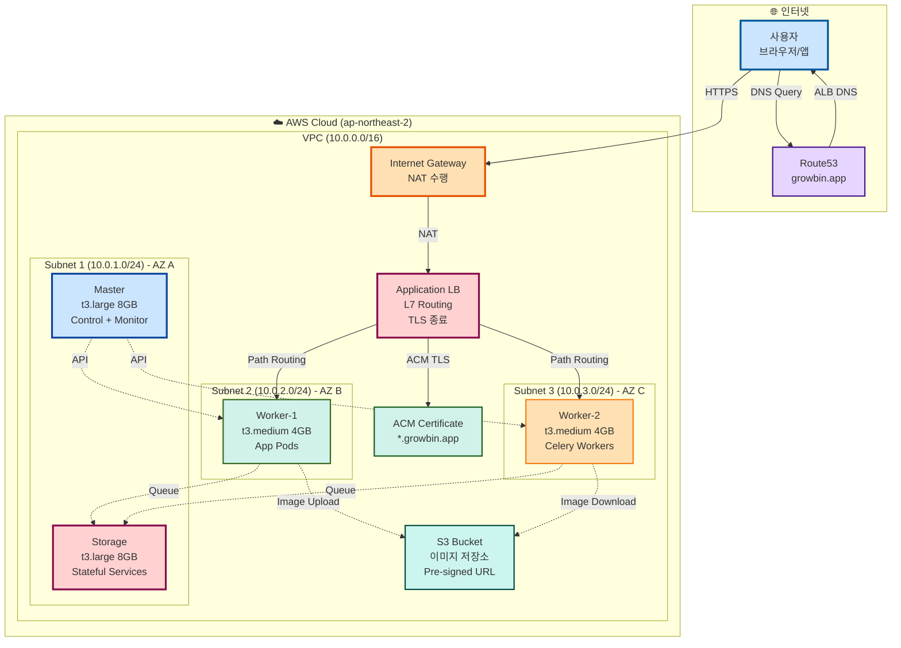
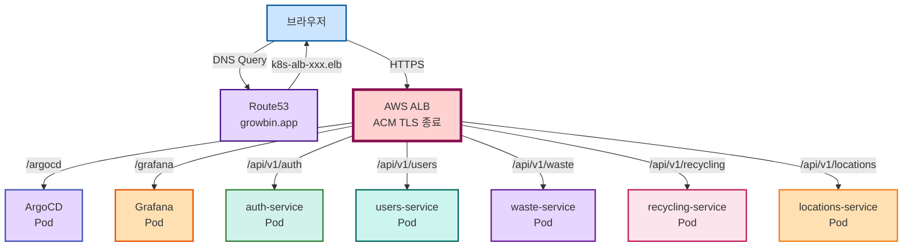
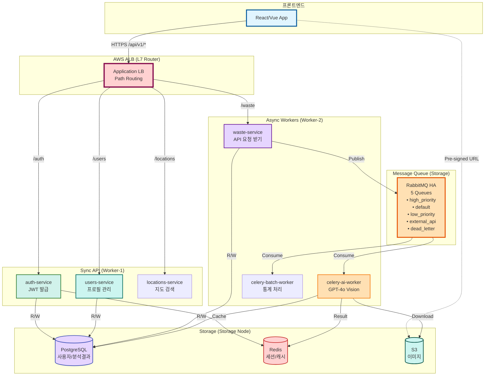
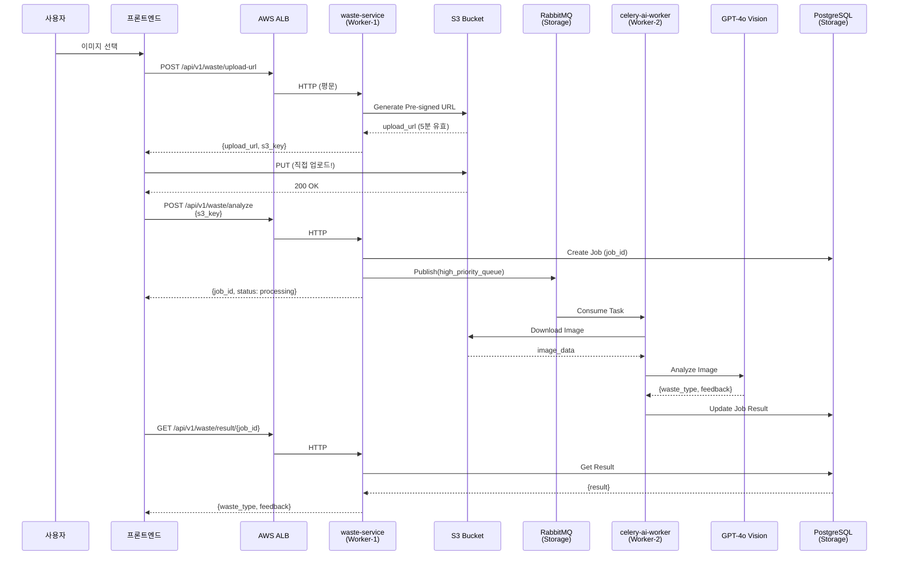
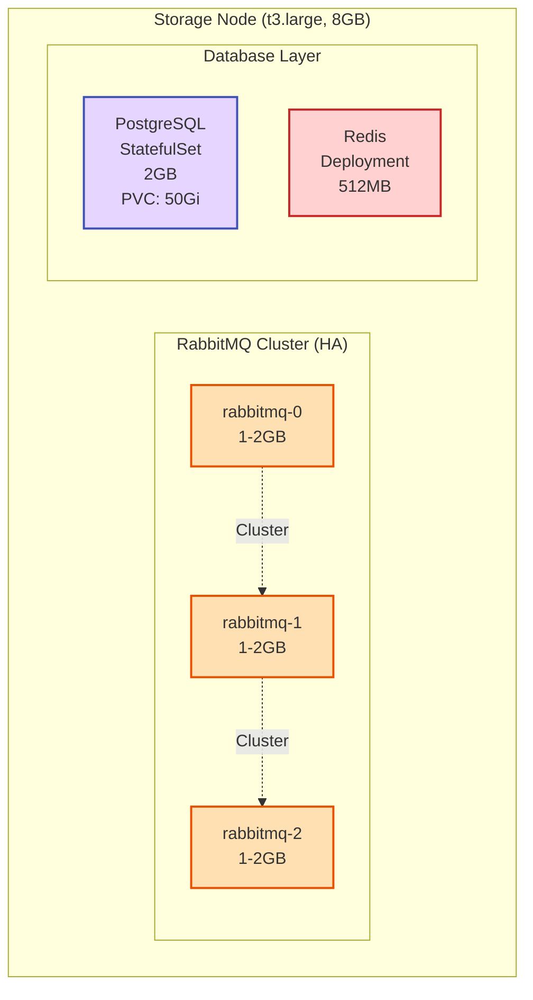

# 🏗️ 최종 배포 아키텍처 (4-Node Cluster)

> **Instagram + Robin Storage 패턴 적용**  
> **AWS ALB + ACM + S3 통합**  
> **날짜**: 2025-10-31

## 📋 목차

1. [전체 아키텍처 개요](#전체-아키텍처-개요)
2. [4-Node 구성](#4-node-구성)
3. [네트워크 레이어](#네트워크-레이어)
4. [애플리케이션 레이어](#애플리케이션-레이어)
5. [데이터 흐름](#데이터-흐름)

---

## 🏗️ 전체 아키텍처 개요



---

## 🖥️ 4-Node 구성

### 노드별 역할

```mermaid
graph LR
    subgraph Cluster["Kubernetes Cluster (4 Nodes)"]
        subgraph Master["Master Node<br/>t3.large (2vCPU, 8GB, 80GB)<br/>$60/month"]
            CP[Control Plane<br/>• kube-apiserver<br/>• kube-scheduler<br/>• kube-controller-manager<br/>• etcd]
            Mon[Monitoring<br/>• Prometheus<br/>• Grafana<br/>• AlertManager]
        end
        
        subgraph Worker1["Worker-1<br/>t3.medium (2vCPU, 4GB, 40GB)<br/>$30/month"]
            App[Application Pods<br/>• auth-service<br/>• users-service<br/>• locations-service<br/>FastAPI / Reactor]
        end
        
        subgraph Worker2["Worker-2<br/>t3.medium (2vCPU, 4GB, 40GB)<br/>$30/month"]
            Async[Async Workers<br/>• celery-ai-worker<br/>• celery-batch-worker<br/>• celery-api-worker<br/>GPT-4o Vision]
        end
        
        subgraph Storage["Storage Node<br/>t3.large (2vCPU, 8GB, 100GB)<br/>$60/month"]
            Queue[Message Queue<br/>• RabbitMQ HA (3 pods)<br/>• Clustering enabled]
            DB[Database<br/>• PostgreSQL<br/>• Redis]
        end
    end
    
    App -->|Publish Task| Queue
    Async -->|Consume Task| Queue
    App -->|Read/Write| DB
    Async -->|Read/Write| DB
    CP -.->|Manage| App
    CP -.->|Manage| Async
    CP -.->|Manage| Queue
    
    style Master fill:#cce5ff,stroke:#0d47a1,stroke-width:3px
    style Worker1 fill:#d1f2eb,stroke:#33691e,stroke-width:3px
    style Worker2 fill:#ffe0b3,stroke:#f57f17,stroke-width:3px
    style Storage fill:#ffd1d1,stroke:#880e4f,stroke-width:3px
```

### 리소스 요약

```
Total Cluster:
━━━━━━━━━━━━━━━━━━━━━━━━━━━━━━━━━━━━━━━━
Nodes: 4
vCPU: 8 cores (2+2+2+2)
Memory: 24GB (8+4+4+8)
Storage: 260GB (80+40+40+100)
Cost: $180/month (EC2)
```

---

## 🌐 네트워크 레이어

### Path-based Routing (ALB)



### 라우팅 규칙

```
단일 도메인: growbin.app
단일 ALB: k8s-alb-xxx.elb.amazonaws.com

경로 기반 라우팅:
━━━━━━━━━━━━━━━━━━━━━━━━━━━━━━━━━━━━━━━━
Path                    Target              Namespace
━━━━━━━━━━━━━━━━━━━━━━━━━━━━━━━━━━━━━━━━
/argocd/*              argocd-server:443    argocd
/grafana/*             grafana:80           monitoring
/api/v1/auth/*         auth-service:8000    default
/api/v1/users/*        users-service:8000   default
/api/v1/waste/*        waste-service:8000   default
/api/v1/recycling/*    recycling:8000       default
/api/v1/locations/*    locations:8000       default
/*                     default-backend:80   default

Protocol:
- 외부: HTTPS (TLS 1.3, ACM)
- ALB → Pod: HTTP (평문)
```

---

## 🔄 애플리케이션 레이어

### 마이크로서비스 통신



---

## 📊 데이터 흐름

### 이미지 분석 Flow (End-to-End)



### 특징

```
✅ 프론트엔드 → S3 직접 업로드 (백엔드 부하 없음)
✅ 즉시 응답 (job_id)
✅ 백그라운드 처리 (5-30초)
✅ Polling으로 결과 조회
✅ RabbitMQ로 비동기 처리
✅ Celery Worker 독립 스케일링
```

---

## 🔐 Security & Network

### Security Groups 요약

```
Master SG:
━━━━━━━━━━━━━━━━━━━━━━━━━━━━━━━━━━━━━━━━
6443 (K8s API), 80/443 (HTTP/S), 22 (SSH)
2379-2380 (etcd), 10250/10257/10259 (Control Plane)
4789 (VXLAN UDP)

Worker SG:
━━━━━━━━━━━━━━━━━━━━━━━━━━━━━━━━━━━━━━━━
22 (SSH), 10250 (Kubelet), 10256 (kube-proxy)
4789 (VXLAN UDP), All from Master, All from Self
```

### Calico VXLAN

```
Pod 네트워크: 192.168.0.0/16
━━━━━━━━━━━━━━━━━━━━━━━━━━━━━━━━━━━━━━━━
Master:   192.168.0.0/24
Storage:  192.168.1.0/24
Worker-1: 192.168.2.0/24
Worker-2: 192.168.x.0/24

통신 방식: VXLAN Overlay (UDP 4789)
BGP: Disabled (완전 비활성화)
Mode: VXLAN Always (IP-in-IP Never)
```

---

## 💾 Storage 아키텍처

### Storage Node 구성



### RabbitMQ 큐 설계

```
5개 Queue 전략 (Instagram 패턴):

1. high_priority_queue:
   - 이미지 분석 (GPT-4o Vision)
   - 처리 시간: 5-10초
   - Worker: 3개
   - 우선순위: 높음

2. default_queue:
   - 일반 작업
   - 사용자 알림, 통계
   - Worker: 2개

3. low_priority_queue:
   - 배치 작업
   - 정리, 집계
   - Worker: 1개

4. external_api_queue:
   - Rate Limited
   - Kakao Map API 등
   - Worker: 1개
   - 분당 제한

5. dead_letter_queue:
   - 실패한 메시지
   - 재시도 로직
   - 모니터링
```

---

## 📦 배포 구성 요소

### AWS 리소스

```
Compute:
✅ EC2 4대 (t3.large x2, t3.medium x2)
✅ Elastic IP 1개 (Master)

Network:
✅ VPC (10.0.0.0/16)
✅ Subnets 3개 (Public)
✅ Internet Gateway
✅ Security Groups 2개
✅ ALB (자동 생성)

Storage:
✅ EBS 260GB (gp3)
✅ S3 Bucket (이미지)

Security:
✅ ACM Certificate (*.growbin.app)
✅ IAM Roles (SSM, ALB, S3)

DNS:
✅ Route53 (growbin.app)
```

### Kubernetes 리소스

```
Control Plane:
✅ kube-apiserver, scheduler, controller
✅ etcd (백업 자동화)

Network:
✅ Calico VXLAN CNI
✅ kube-proxy (iptables)
✅ CoreDNS

Platform:
✅ AWS Load Balancer Controller
✅ cert-manager (선택)
✅ Metrics Server

Monitoring:
✅ Prometheus (7d retention)
✅ Grafana
✅ AlertManager

GitOps:
✅ ArgoCD

Message Queue:
✅ RabbitMQ (HA 3-node)

계획:
⏳ PostgreSQL StatefulSet
⏳ Redis Deployment
⏳ 5개 마이크로서비스
⏳ Celery Workers
```

---

## 💰 비용 분석

```
월간 비용:
━━━━━━━━━━━━━━━━━━━━━━━━━━━━━━━━━━━━━━━━
EC2:
  Master (t3.large):    $60
  Worker-1 (t3.medium): $30
  Worker-2 (t3.medium): $30
  Storage (t3.large):   $60
  
EBS (260GB gp3):        $20

S3:
  Storage (~1000 imgs): $5
  Requests:             $1
  
ALB:
  시간당 과금:          $16
  
Route53:
  Hosted Zone:          $0.50
  
ACM:
  Certificate:          무료
  
━━━━━━━━━━━━━━━━━━━━━━━━━━━━━━━━━━━━━━━━
총계:                   $222.50/월

절감된 비용:
- NAT Gateway 없음:    -$96/월
- MetalLB 대신 ALB:    최적화
```

---

## 🚀 배포 시간

```
자동 배포 (./scripts/auto-rebuild.sh):
━━━━━━━━━━━━━━━━━━━━━━━━━━━━━━━━━━━━━━━━
1. Terraform init:        2분
2. Terraform destroy:     5분
3. Terraform apply:       10분
   - VPC, Subnets:        1분
   - EC2 4대:             3분
   - S3, ACM:             5분
   - DNS 전파:            1분
4. Ansible playbook:      35분
   - OS 준비:             5분
   - Docker/containerd:   5분
   - Kubernetes:          10분
   - Calico VXLAN:        5분
   - ALB Controller:      3분
   - RabbitMQ:            5분
   - Monitoring:          2분

총: 약 52분
```

---

## 📚 참고 문서

- [VPC 네트워크 설계](../infrastructure/vpc-network-design.md)
- [Calico CNI 비교](../infrastructure/cni-comparison.md)
- [배포 가이드](../../DEPLOYMENT_GUIDE.md)

---

**작성일**: 2025-10-31  
**버전**: 2.0  
**아키텍처**: 4-Node Instagram-style

