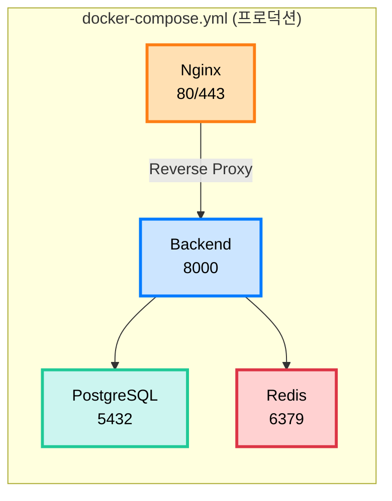

# 🐳 Docker 배포 가이드

이 문서는 Docker와 Docker Compose를 사용한 배포 방법을 설명합니다.

## 📋 목차

1. [Docker 개요](#docker-개요)
2. [로컬 개발 환경](#로컬-개발-환경)
3. [프로덕션 빌드](#프로덕션-빌드)
4. [Docker Compose 사용법](#docker-compose-사용법)
5. [트러블슈팅](#트러블슈팅)

---

## 🐋 Docker 개요

### 프로젝트의 Docker 구성



### Dockerfile 종류

| 파일 | 용도 | 특징 |
|------|------|------|
| `Dockerfile` | 프로덕션 | Multi-stage build, 최적화 |
| `Dockerfile.dev` | 개발 | Hot reload, 디버깅 |

---

## 💻 로컬 개발 환경

### 개발 환경 실행

```bash
# Docker Compose로 전체 스택 실행
docker-compose -f docker-compose.dev.yml up

# 또는 Makefile 사용
make docker-up-dev
```

### 개발 환경 구성

```yaml
# docker-compose.dev.yml
services:
  backend:
    build:
      dockerfile: Dockerfile.dev  # 개발용 Dockerfile
    volumes:
      - ./app:/app/app  # Hot reload를 위한 볼륨 마운트
    environment:
      DEBUG: "True"
```

**장점:**
- ✅ 코드 변경 시 자동 리로드
- ✅ 디버거 포트 노출 (5678)
- ✅ 데이터베이스 자동 시작

### 개별 서비스 실행

```bash
# 특정 서비스만 시작
docker-compose -f docker-compose.dev.yml up backend
docker-compose -f docker-compose.dev.yml up db
docker-compose -f docker-compose.dev.yml up redis

# 백그라운드 실행
docker-compose -f docker-compose.dev.yml up -d
```

---

## 🚀 프로덕션 빌드

### Dockerfile 분석

```dockerfile
# Multi-stage build
FROM python:3.11-slim as builder

# 의존성 설치 (builder stage)
WORKDIR /app
COPY requirements.txt .
RUN pip install --user -r requirements.txt

# Production stage
FROM python:3.11-slim

# builder에서 패키지 복사
COPY --from=builder /root/.local /root/.local

# 애플리케이션 코드 복사
COPY ./app /app/app

# 비 root 사용자로 실행 (보안)
RUN useradd -m -u 1000 appuser
USER appuser

# Health check
HEALTHCHECK CMD python -c "import requests; requests.get('http://localhost:8000/')"

# 실행
CMD ["uvicorn", "app.main:app", "--host", "0.0.0.0", "--port", "8000", "--workers", "4"]
```

**최적화 포인트:**
- ✅ Multi-stage build로 이미지 크기 감소
- ✅ 비 root 사용자로 보안 강화
- ✅ Health check 내장
- ✅ 프로덕션용 worker 설정

### 이미지 빌드

```bash
# 프로덕션 이미지 빌드
docker build -t sesacthon-backend:latest .

# 또는 Makefile 사용
make docker-build

# 특정 플랫폼 빌드 (M1 Mac 등)
docker build --platform linux/amd64 -t sesacthon-backend:latest .
```

### 이미지 실행 테스트

```bash
# 단일 컨테이너 실행
docker run -p 8000:8000 \
  -e DATABASE_URL=postgresql://... \
  sesacthon-backend:latest

# 환경변수 파일 사용
docker run -p 8000:8000 \
  --env-file .env \
  sesacthon-backend:latest
```

---

## 🎼 Docker Compose 사용법

### 프로덕션 환경 실행

```bash
# 전체 스택 시작
docker-compose up -d

# 또는
make docker-up

# 빌드와 함께 시작
docker-compose up -d --build
```

### docker-compose.yml 구조

```yaml
version: '3.8'

services:
  # PostgreSQL
  db:
    image: postgres:15-alpine
    environment:
      POSTGRES_USER: sesacthon
      POSTGRES_PASSWORD: sesacthon123
      POSTGRES_DB: sesacthon_db
    volumes:
      - postgres_data:/var/lib/postgresql/data
    healthcheck:
      test: ["CMD-SHELL", "pg_isready -U sesacthon"]

  # Redis
  redis:
    image: redis:7-alpine
    volumes:
      - redis_data:/data

  # FastAPI Backend
  backend:
    build: .
    environment:
      DATABASE_URL: postgresql://sesacthon:sesacthon123@db:5432/sesacthon_db
    depends_on:
      db:
        condition: service_healthy

  # Nginx
  nginx:
    image: nginx:1.25-alpine
    ports:
      - "80:80"
      - "443:443"
    volumes:
      - ./nginx/nginx.conf:/etc/nginx/nginx.conf:ro
    depends_on:
      - backend

volumes:
  postgres_data:
  redis_data:
```

### 로그 확인

```bash
# 전체 로그
docker-compose logs -f

# 특정 서비스 로그
docker-compose logs -f backend
docker-compose logs -f nginx

# 최근 100줄만 보기
docker-compose logs --tail=100 backend

# 특정 시간 이후 로그
docker-compose logs --since 30m backend
```

### 컨테이너 상태 확인

```bash
# 실행 중인 컨테이너
docker-compose ps

# 상세 정보
docker-compose ps -a

# 리소스 사용량
docker stats
```

### 컨테이너 내부 접속

```bash
# Backend 컨테이너 접속
docker-compose exec backend bash

# PostgreSQL 접속
docker-compose exec db psql -U sesacthon -d sesacthon_db

# Redis 접속
docker-compose exec redis redis-cli
```

### 데이터베이스 작업

```bash
# 마이그레이션 실행
docker-compose exec backend alembic upgrade head

# 마이그레이션 생성
docker-compose exec backend alembic revision --autogenerate -m "설명"

# PostgreSQL 백업
docker-compose exec db pg_dump -U sesacthon sesacthon_db > backup.sql

# PostgreSQL 복원
docker-compose exec -T db psql -U sesacthon sesacthon_db < backup.sql
```

---

## 🛠️ 유용한 명령어

### 컨테이너 관리

```bash
# 중지
docker-compose down

# 중지 + 볼륨 삭제
docker-compose down -v

# 재시작
docker-compose restart

# 특정 서비스만 재시작
docker-compose restart backend

# 서비스 스케일링
docker-compose up -d --scale backend=3
```

### 이미지 관리

```bash
# 이미지 목록
docker images

# 사용하지 않는 이미지 삭제
docker image prune

# 전체 정리 (컨테이너, 이미지, 볼륨)
docker system prune -a
```

### 네트워크 관리

```bash
# 네트워크 목록
docker network ls

# 네트워크 상세 정보
docker network inspect sesacthon_backend_network

# 컨테이너 IP 확인
docker inspect -f '{{range.NetworkSettings.Networks}}{{.IPAddress}}{{end}}' backend
```

---

## 🔧 트러블슈팅

### 1. 컨테이너가 시작되지 않음

**확인 사항:**
```bash
# 로그 확인
docker-compose logs backend

# 컨테이너 상태
docker-compose ps

# 포트 충돌 확인
lsof -i :8000
lsof -i :5432
```

### 2. 데이터베이스 연결 실패

**해결 방법:**
```bash
# DB 컨테이너 상태 확인
docker-compose ps db

# DB 로그 확인
docker-compose logs db

# 네트워크 확인
docker network inspect sesacthon_backend_network

# DB에 직접 연결 테스트
docker-compose exec db psql -U sesacthon -d sesacthon_db
```

### 3. Hot Reload가 작동하지 않음

**해결 방법:**
```bash
# 볼륨 마운트 확인
docker-compose -f docker-compose.dev.yml config

# 컨테이너 재시작
docker-compose -f docker-compose.dev.yml restart backend

# 로그에서 uvicorn --reload 옵션 확인
docker-compose logs backend | grep reload
```

### 4. 이미지 빌드 실패

**해결 방법:**
```bash
# 캐시 없이 빌드
docker-compose build --no-cache

# BuildKit 사용
DOCKER_BUILDKIT=1 docker build -t sesacthon-backend:latest .

# 디스크 공간 확인
docker system df
```

### 5. 502 Bad Gateway (Nginx)

**해결 방법:**
```bash
# Backend 컨테이너 확인
docker-compose ps backend

# Nginx 설정 검증
docker-compose exec nginx nginx -t

# Backend 로그 확인
docker-compose logs backend

# 네트워크 연결 확인
docker-compose exec nginx ping backend
```

---

## 📊 모니터링

### 리소스 사용량 확인

```bash
# 실시간 모니터링
docker stats

# 특정 컨테이너만
docker stats sesacthon_backend

# 로그 크기 확인
docker-compose logs --tail=0 -f | wc -l
```

### Health Check

```bash
# Backend health check
curl http://localhost:8000/

# PostgreSQL health check
docker-compose exec db pg_isready -U sesacthon

# Redis health check
docker-compose exec redis redis-cli ping
```

---

## 🚀 배포 최적화

### 이미지 크기 최적화

```dockerfile
# 경량 베이스 이미지 사용
FROM python:3.11-slim

# 불필요한 파일 제외 (.dockerignore)
.git
__pycache__
*.pyc
.env

# Multi-stage build 사용
FROM python:3.11 as builder
# ...
FROM python:3.11-slim
COPY --from=builder ...
```

### 보안 강화

```dockerfile
# 비 root 사용자 실행
RUN useradd -m -u 1000 appuser
USER appuser

# 읽기 전용 파일시스템
docker run --read-only sesacthon-backend

# 리소스 제한
docker run --memory="512m" --cpus="0.5" sesacthon-backend
```

---

## 📚 관련 문서

- [CI/CD 파이프라인](cicd.md) - GitHub Actions 배포 자동화
- [AWS 배포](aws.md) - EC2/ECS 배포
- [환경변수 가이드](environment.md) - .env 설정
- [전체 배포 가이드](full-guide.md) - 통합 배포 문서

---

**문서 버전**: 1.0.0  
**최종 업데이트**: 2025-10-30

