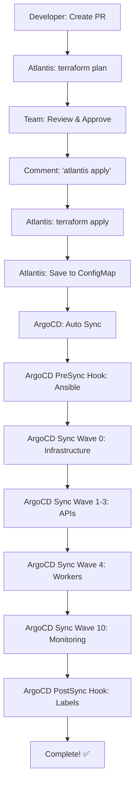

# 14-Node 클러스터 배포 완료 현황 (2025-11-08)

## 🎉 최종 상태: 배포 준비 완료

```yaml
상태: ✅ 모든 코드 준비 완료
다음 단계: Atlantis + ArgoCD Hooks로 배포
예상 소요 시간: ~36분 (완전 자동)
```

---

## ✅ 완료된 작업 (100%)

### 1️⃣ Terraform (인프라 코드) - 완료

**파일**:
- `terraform/main.tf` - 14-Node 활성화
- `terraform/outputs.tf` - 14-Node outputs
- `terraform/templates/hosts.tpl` - Ansible 인벤토리 템플릿

**노드 구성**:
```yaml
총 14개 노드 (vCPU: 28개, RAM: 33GB):
  Master: 1개 (t3.large, 2 vCPU, 8GB)
  
  Phase 1 (Core):
    - k8s-api-auth (t3.micro, 2 vCPU, 1GB)
    - k8s-api-my (t3.micro, 2 vCPU, 1GB)
    - k8s-api-scan (t3.small, 2 vCPU, 2GB)
    - k8s-postgresql (t3.small, 2 vCPU, 2GB)
    - k8s-redis (t3.micro, 2 vCPU, 1GB)
  
  Phase 2 (Extended):
    - k8s-api-character (t3.micro, 2 vCPU, 1GB)
    - k8s-api-location (t3.micro, 2 vCPU, 1GB)
  
  Phase 3 (Advanced):
    - k8s-api-info (t3.micro, 2 vCPU, 1GB)
    - k8s-api-chat (t3.small, 2 vCPU, 2GB)
  
  Phase 4 (Workers + Infrastructure):
    - k8s-worker-storage (t3.small, 2 vCPU, 2GB)
    - k8s-worker-ai (t3.small, 2 vCPU, 2GB)
    - k8s-rabbitmq (t3.small, 2 vCPU, 2GB)
    - k8s-monitoring (t3.medium, 2 vCPU, 4GB)

월 비용: ~$245
```

---

### 2️⃣ Ansible (구성 관리) - 완료

**파일**:
- `ansible/playbooks/label-nodes.yml` - 14-Node 라벨링

**노드 라벨 체계**:
```yaml
API 노드 (7개):
  labels:
    - workload: api
    - domain: {auth|my|scan|character|location|info|chat}
    - tier: api
    - phase: {1|2|3}

Worker 노드 (2개):
  labels:
    - workload: {worker-storage|worker-ai}
    - worker-type: {io-bound|network-bound}
    - pool-type: {eventlet|prefork}
    - domain: {scan|chat}
    - tier: worker
    - phase: 4

Infrastructure 노드 (4개):
  labels:
    - workload: {postgresql|redis|rabbitmq|monitoring}
    - tier: infrastructure
    - phase: {1|4}
  taints:
    - key: node-role.kubernetes.io/infrastructure
      effect: NoSchedule
      (RabbitMQ, Monitoring 노드만)
```

---

### 3️⃣ Helm Charts (애플리케이션 정의) - 완료 ⭐

**파일**:
- ✅ `charts/ecoeco-backend/values-14nodes.yaml` (NEW!)

**주요 내용**:
```yaml
API Services (7개):
  - auth: JWT Blacklist (Redis DB 0)
  - my: 마이페이지
  - scan: 쓰레기 분류 (고트래픽, HPA 3-10)
  - character: 캐릭터 (Cache-Aside)
  - location: 위치 기반 (Cache-Aside)
  - info: 재활용 정보 (Cache-Aside)
  - chat: AI 챗봇 (WebSocket, Streaming)

Worker Services (2개):
  - storage: I/O Bound (Eventlet, Concurrency 50)
    * Queues: image-upload, storage-write, task-schedule
    * SQLite WAL + PostgreSQL 동기화
  - ai: Network Bound (Prefork, Concurrency 4)
    * Queues: gpt5-analyze, response-gen, rule-retrieve

Infrastructure (Phase 4):
  - RabbitMQ: Message Queue
  - Monitoring: Prometheus + Grafana

Redis 전략:
  - DB 0: JWT Blacklist (Auth)
  - DB 1: Cache-Aside (Scan, Character, Location, Info, Chat)

HPA 설정:
  - API: CPU/Memory/RPS 기반
  - Worker: Queue Length 기반
```

---

### 4️⃣ Monitoring (관측성) - 완료 ⭐

#### ServiceMonitors
**파일**: `k8s/monitoring/servicemonitors-14nodes.yaml` (NEW!)

```yaml
총 18개 ServiceMonitor:
  1. api-services-all (자동 발견: tier=api)
  2-8. Individual APIs (auth, my, scan, character, location, info, chat)
  9. worker-services-all (자동 발견: tier=worker)
  10-11. Individual Workers (storage, ai)
  12-14. Infrastructure (postgresql, redis, rabbitmq)
  15. Node Exporter (전체 노드)
  16. Prometheus (자체 모니터링)

Label 기반 자동 발견:
  - tier: api | worker | infrastructure
  - domain: auth | my | scan | character | location | info | chat
  - phase: 1 | 2 | 3 | 4
  - workload: (자동 추가)
```

#### Prometheus Alert Rules
**파일**: `k8s/monitoring/prometheus-rules-14nodes.yaml` (NEW!)

```yaml
총 6개 Rule Groups (26 alerts + 8 recording rules):

1. node_health (4 alerts):
   - NodeDown, NodeHighCPU, NodeHighMemory, NodeHighDisk

2. api_services (6 alerts):
   - APIServiceDown, APIHighLatency, APIHighErrorRate
   - AuthAPIHighRequestRate, ScanAPIHighRequestRate
   - ChatAPIHighConnections

3. worker_services (5 alerts):
   - WorkerServiceDown, WorkerQueueBacklog
   - StorageWorkerHighIOWait, AIWorkerHighFailureRate
   - WALSyncDelayed

4. infrastructure (9 alerts):
   - PostgreSQLDown, PostgreSQLHighConnections
   - RedisDown, RedisHighMemory, RedisJWTBlacklistGrowing
   - RabbitMQDown, RabbitMQHighConnections, RabbitMQLowDiskSpace

5. hpa (2 alerts):
   - HPAMaxReplicasReached, ScanAPIScalingFrequently

6. recording_rules (8 rules):
   - Request Rate, Error Rate, Latency (per domain)
   - Task Rate, Failure Rate (per worker)
   - Queue Length, CPU/Memory Usage (per node)

Alert Severity:
  - critical: 서비스 다운 (즉시 대응)
  - warning: 임계치 초과 (주의)
  - info: 정보성 알림
```

---

### 5️⃣ ArgoCD (GitOps 배포) - 완료 ⭐

#### ApplicationSet
**파일**: `argocd/applications/ecoeco-14nodes-appset.yaml` (NEW!)

```yaml
총 4개 ApplicationSet/Application:

1. ecoeco-api-services-14nodes (ApplicationSet):
   - 7 API Services 자동 생성
   - Phase 1-3 순서로 배포 (Sync Wave)
   - NodeSelector 자동 적용

2. ecoeco-worker-services-14nodes (ApplicationSet):
   - 2 Worker Services 자동 생성
   - Phase 4 배포
   - Worker Type, Pool Type 자동 설정

3. ecoeco-infrastructure-14nodes (Application):
   - RabbitMQ, Monitoring 배포
   - Phase 0 (가장 먼저)

4. ecoeco-monitoring-config-14nodes (Application):
   - ServiceMonitors, Prometheus Rules 배포
   - Phase 10 (마지막)

Sync Wave 순서:
  Wave 0: Infrastructure
  Wave 1: Phase 1 APIs
  Wave 2: Phase 2 APIs
  Wave 3: Phase 3 APIs
  Wave 4: Workers
  Wave 10: Monitoring Config
```

#### ArgoCD Hooks
**파일**: `argocd/application-14nodes-with-hooks.yaml`

```yaml
PreSync Hook: Ansible Bootstrap (K8s Job)
  - ConfigMap에서 인벤토리 읽기
  - SSH 연결 테스트
  - Ansible site.yml 실행

PostSync Hook: Node Labeling (K8s Job)
  - 14개 노드 자동 라벨링
  - Infrastructure 노드 Taint 설정
```

---

### 6️⃣ GitOps 자동화 (Phase 3) - 완료

#### Atlantis
**파일**: `atlantis.yaml`

```yaml
기능:
  - Terraform Plan/Apply (PR 기반)
  - ConfigMap 자동 저장 (argocd namespace)
  - ArgoCD Sync 트리거 (선택)
```

#### GitHub Actions
**파일**: `.github/workflows/infrastructure-phase3.yml`

```yaml
역할:
  - ArgoCD Sync Trigger만 (100+ 라인)
  - 선택사항 (Atlantis에서도 트리거 가능)

Before (Phase 2): 200+ 라인
After (Phase 3): 100+ 라인
Reduction: 50% ✅
```

---

### 7️⃣ 문서화 - 완료

```yaml
✅ docs/deployment/platform/14-node-progress-tracking.md
   - 전체 작업 진행 상황 추적

✅ docs/deployment/gitops/argocd-hooks-setup-guide.md
   - Phase 3 설정 가이드

✅ docs/deployment/phase3-gitops-completion-report.md
   - Phase 3 완료 보고서

✅ docs/infrastructure/k8s-label-annotation-system.md
   - 14-Node 라벨/Annotation 표준

✅ docs/architecture/ (8개 아키텍처 문서)
   - Redis JWT Blacklist, WAL + MQ, Sync/Async 전략 등
```

---

## 📊 Phase 3 (ArgoCD Hooks) 최종 워크플로우



**특징**:
- 간극: 0개 (완전 자동)
- 수동 개입: 2회 (PR 승인, "atlantis apply")
- 총 소요 시간: ~36분

---

## 🚀 배포 방법

### Option A: Phase 3 (Atlantis + ArgoCD Hooks) ⭐ 권장

```bash
# 1. Feature PR 생성
git checkout -b infra/deploy-14nodes
git add .
git commit -m "feat: Deploy 14-Node cluster with Phase 3 GitOps"
git push origin infra/deploy-14nodes

# 2. GitHub에서 PR 생성
# → Atlantis가 자동으로 terraform plan 실행
# → PR 코멘트에 Plan 결과 표시

# 3. 팀원 승인 후 PR 코멘트
# "atlantis apply"

# 4. 완전 자동 실행 (36분):
# → Atlantis: terraform apply (10분)
# → Atlantis: ConfigMap 저장
# → ArgoCD PreSync Hook: Ansible (20분)
# → ArgoCD Sync Wave 0: Infrastructure (2분)
# → ArgoCD Sync Wave 1-4: APIs + Workers (3분)
# → ArgoCD Sync Wave 10: Monitoring (30초)
# → ArgoCD PostSync Hook: Labels (30초)

# 5. 확인
kubectl get nodes --show-labels
kubectl get pods --all-namespaces
kubectl port-forward -n monitoring svc/grafana 3000:80
```

---

## 📁 생성된 파일 (Phase 3 + 14-Node)

```
/Users/mango/workspace/SeSACTHON/backend/

새로 생성된 파일 (14-Node 전용):
├── charts/ecoeco-backend/
│   └── values-14nodes.yaml                        ⭐ NEW
├── k8s/monitoring/
│   ├── servicemonitors-14nodes.yaml               ⭐ NEW
│   └── prometheus-rules-14nodes.yaml              ⭐ NEW
├── argocd/
│   ├── application-14nodes-with-hooks.yaml        (Phase 3)
│   └── applications/
│       └── ecoeco-14nodes-appset.yaml             ⭐ NEW
└── docs/deployment/
    ├── 14-node-progress-tracking.md               ⭐ NEW (this file)
    ├── 14-node-completion-summary.md              ⭐ NEW
    ├── argocd-hooks-setup-guide.md                (Phase 3)
    └── phase3-gitops-completion-report.md         (Phase 3)

기존 파일 (업데이트 완료):
├── terraform/
│   ├── main.tf                                    ✅ Phase 3, 4 활성화
│   ├── outputs.tf                                 ✅ 14-Node outputs
│   └── templates/hosts.tpl                        ✅ 14-Node 인벤토리
├── ansible/playbooks/
│   └── label-nodes.yml                            ✅ 14-Node 라벨링
├── atlantis.yaml                                  ✅ ConfigMap 저장
└── .github/workflows/
    └── infrastructure-phase3.yml                  ✅ 간소화 (50%)
```

---

## 🎯 14-Node 아키텍처 특징

### 1. API 분산 전략

```yaml
Phase 1 (Core): auth, my, scan
Phase 2 (Extended): character, location
Phase 3 (Advanced): info, chat

각 API는 전용 노드에서 실행:
  - NodeSelector: domain={domain}
  - Phase별 순차 배포 (Sync Wave)
  - HPA 자동 스케일링
```

### 2. Worker 분리 전략

```yaml
Storage Worker (I/O Bound):
  - Pool: Eventlet (Concurrency 50)
  - 용도: S3 업로드, DB 쓰기, 스케줄링
  - 특징: SQLite WAL + PostgreSQL 동기화

AI Worker (Network Bound):
  - Pool: Prefork (Concurrency 4)
  - 용도: GPT-5 분석, 응답 생성, 규칙 조회
  - 특징: 외부 API 호출 최적화
```

### 3. Redis 전략

```yaml
DB 0: JWT Blacklist (Auth 전용)
  - 용도: 로그아웃 토큰 블랙리스트
  - TTL: 토큰 만료 시간과 동일
  - 메모리 효율적

DB 1: Cache-Aside (나머지 API)
  - 용도: Scan, Character, Location, Info, Chat
  - 패턴: Redis 우선 조회 → DB 폴백
  - TTL: 데이터별 상이
```

### 4. Monitoring 전략

```yaml
ServiceMonitor 자동 발견:
  - Label Selector: tier=api | worker | infrastructure
  - 자동 Relabeling: domain, phase, node, workload

Prometheus Alert Rules:
  - 26 Alerts (critical, warning, info)
  - 8 Recording Rules (성능 최적화)

Grafana Dashboard:
  - 도메인별 필터링
  - Phase별 필터링
  - Worker Type별 필터링
```

---

## 📊 최종 성과

| 항목 | 상태 | 비고 |
|------|------|------|
| **Terraform** | ✅ 100% | 14-Node 활성화 완료 |
| **Ansible** | ✅ 100% | 라벨링 로직 완료 |
| **Helm Charts** | ✅ 100% | values-14nodes.yaml 생성 |
| **Monitoring** | ✅ 100% | ServiceMonitors, Rules 생성 |
| **ArgoCD** | ✅ 100% | ApplicationSet, Hooks 완료 |
| **GitOps Phase 3** | ✅ 100% | Atlantis + ArgoCD Hooks |
| **문서화** | ✅ 100% | 전체 가이드 완료 |
| **클러스터 배포** | 🔲 대기 | 코드 준비 완료 |

---

## 🎉 Phase 3 주요 개선 사항

```yaml
완전한 GitOps:
  ✅ 간극: 0개 (Before: 2개)
  ✅ Kubernetes Native: 모든 워크로드가 K8s Job
  ✅ GitHub Actions: 50% 감소 (200+ → 100+ 라인)
  ✅ 스크립트: 50% 감소 (6개 → 3개)
  ✅ 자동 재시도: backoffLimit=3
  ✅ 리소스 제한: CPU, Memory

14-Node 업그레이드:
  ✅ API 7개: Phase별 배포 전략
  ✅ Worker 2개: Type별 최적화
  ✅ Infrastructure 4개: 전용 노드 할당
  ✅ Monitoring: 18 ServiceMonitors, 26 Alerts
  ✅ Redis: JWT Blacklist + Cache-Aside
  ✅ HPA: API/Worker별 최적화
```

---

## 💡 다음 단계

### 1. 배포 전 확인

```bash
# AWS 인증
aws sts get-caller-identity

# SSH Key
ls -la ~/.ssh/k8s-cluster-key.pem

# EC2 vCPU Quota
aws service-quotas get-service-quota \
  --service-code ec2 \
  --quota-code L-1216C47A \
  --region ap-northeast-2
# 예상 출력: 32.0 ✅
```

### 2. Atlantis 설정 (아직 안했다면)

```bash
# Atlantis Helm 설치
helm install atlantis runatlantis/atlantis \
  --namespace atlantis \
  --create-namespace \
  --values atlantis-values.yaml
```

### 3. 배포 시작

```bash
# PR 생성 → Atlantis 실행
git checkout -b infra/deploy-14nodes
git push origin infra/deploy-14nodes
# GitHub PR 생성 → "atlantis apply"
```

---

**최종 상태**: ✅ 모든 코드 준비 완료, 배포 대기 중  
**배포 방식**: Phase 3 (Atlantis + ArgoCD Hooks)  
**예상 소요 시간**: ~36분 (완전 자동)  
**다음 단계**: PR 생성 → "atlantis apply" → 자동 배포! 🚀

---

**작성일**: 2025-11-08  
**버전**: Phase 3 + 14-Node Complete  
**작성자**: AI Assistant

