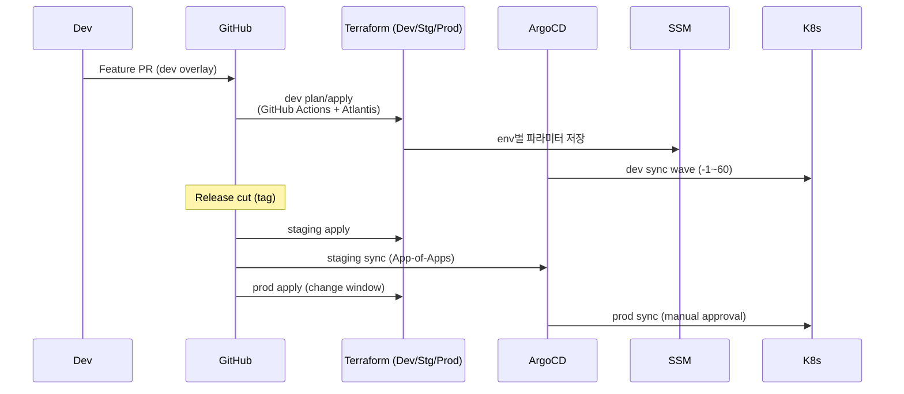

# 환경별 배포 전략 (Dev / Staging / Prod)

> **목표**: Terraform → Ansible → ArgoCD(App-of-Apps) 계층을 사용하는 현재 클러스터 스택을 dev/staging/prod 환경으로 분리하고, 일관된 프로모션 플로우와 운영 책임을 정의한다.

---

## 1. 환경 정의

| 환경 | 목적 | 인프라 범위 | Git 기준 | 운영 책임 |
|------|------|-------------|----------|-----------|
| **Dev** | 기능 개발·실험 | 단일 Availability Zone, 축소 노드 (예: 6 nodes) | `feature/*`, `develop` | 각 서비스 팀 (Self-service) |
| **Staging** | 릴리스 후보·성능 검증 | Prod와 동일 토폴로지(13 nodes) / 축소 리소스 | `release/*` | Platform Team |
| **Prod** | 실 서비스 | 완전한 고가용성(13 nodes 이상, 멀티 AZ) | `main` | Platform + SRE 공동 |

### 공통 원칙
1. **아세트 분리**: 각 환경은 별도 Terraform state, AWS 리소스 Prefix(`sesacthon-dev`, `sesacthon-stg`, `sesacthon-prod`)를 사용.
2. **권한 구분**: Dev는 개발자 AssumeRole 허용, Staging/Prod는 릴리스 파이프라인 전용 Role만 접근.
3. **GitOps 중심**: 모든 환경은 동일 App-of-Apps 구조를 사용하되, `argocd/apps/environments/{env}` 내 Overlay로 값만 차등.

---

## 2. 아키텍처 적용 전략

### 2.1 Terraform
- **워크스페이스/디렉토리 분리**: `terraform/env/dev`, `terraform/env/staging`, `terraform/env/prod` 디렉토리에 별도 `terraform.tfvars`.
- **백엔드**: S3 Bucket과 DynamoDB Table을 환경별로 구성 (`sesacthon-tfstate-dev` 등).
- **출력 주입**: `TERRAFORM_SECRET_INJECTION.md` 전략을 활용해 VPC/Subnet ID 등은 `/sesacthon/{env}/...` 경로로 SSM에 저장.

### 2.2 Ansible
- **Inventory 생성**: Terraform output을 통해 `inventory/{env}/hosts.ini` 자동 생성.
- **플레이북 재사용**: `site.yml`은 동일하되, `group_vars/{env}.yml`에 CNI/CAS/도메인 값을 환경별 정의.
- **Wave 연계**: NetworkPolicy, Operators 등은 `NETWORK_ISOLATION_POLICY.md`, `ARGOCD_SYNC_WAVE_PLAN.md` 순서를 유지.

### 2.3 ArgoCD / GitOps
- **Root App 구조**:
  ```
  argocd/
  ├── root-app.yaml              # 공통 설정
  └── projects/
      ├── dev-project.yaml
      ├── staging-project.yaml
      └── prod-project.yaml
  └── apps/
      ├── dev/
      │   └── *.yaml (sync-wave 동일, 값만 dev overlay)
      ├── staging/
      └── prod/
  ```
- **Sync Wave 재사용**: `ARGOCD_SYNC_WAVE_PLAN.md`의 Wave -1~60+ 순서를 그대로 사용하되, 환경별 Repo Path (`k8s/overlays/{env}`)를 참조.
- **프로모션**: Dev → Staging → Prod 순으로 tag를 승격하며 `argocd app sync`를 트리거.

---

## 3. 배포 플로우



---

## 4. 환경별 설정 가이드

| 항목 | Dev | Staging | Prod |
|------|-----|---------|------|
| **AWS Account** | 공유 계정, VPC `10.10.0.0/16` | 공유 가능 / 단독 권장 | 전용 계정 권장 |
| **Terraform** | `terraform/env/dev` workspace | `terraform/env/staging` | `terraform/env/prod` |
| **DNS** | `dev.ecoeco.app` | `staging.ecoeco.app` | `ecoeco.app` |
| **ArgoCD Project** | `project: dev` (자동 sync) | `project: staging` (hook 검증) | `project: prod` (manual sync) |
| **Helm Values** | 리소스 최소화, Spot Instances 가능 | Prod 동일 구성 | 고가용성, PDB/HPAs 강화 |
| **NetworkPolicy** | 기본 deny + 최소 허용 | Prod 동일 | Prod 기준 |

---

## 5. 운영 체크리스트

1. **Terraform Drift**: 환경별로 주간 `terraform plan`을 실행해 Output Secret이 최신인지 확인.
2. **ArgoCD Health Gate**: Staging Sync 완료 시 `kube-prometheus-stack` Alert가 clean인지 확인 후 Prod로 승격.
3. **Secrets**: `/sesacthon/{env}`에 저장된 Parameter 변경 시 ExternalSecrets 재동기화 (`kubectl delete externalsecret ...`).
4. **Cost Guardrail**: Dev/Staging은 노드 오토스케일 최소값을 0/1로 설정하고, Prod만 24/7 유지.

---

## 6. 향후 과제

1. **Multi-cluster GitOps**: Prod를 EKS(또는 Self-Managed) 별도 클러스터로 전환 시 ArgoCD ApplicationSet으로 환경별 clusterName을 주입.
2. **Release Automation**: GitHub Actions에서 Staging 테스트 성공 시 자동으로 Prod PR 생성 및 Change Calendar 연동.
3. **Policy Enforcement**: Kyverno / OPA Gatekeeper를 환경별로 차등 적용 (Prod는 강제, Dev는 Audit).

---

> 이 문서는 dev/staging/prod 환경 분리를 위한 기준이며, 환경 추가/변경 시 Terraform tfvars·Ansible inventory·ArgoCD overlay를 동기화해야 한다.必要 시 `NETWORK_ISOLATION_POLICY.md`, `ARGOCD_SYNC_WAVE_PLAN.md`, `TERRAFORM_SECRET_INJECTION.md`와 함께 업데이트한다.

