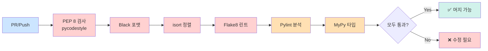

# 🚀 FastAPI 백엔드 코딩 컨벤션

## 📋 목차
1. [프로젝트 구조](#프로젝트-구조)
2. [네이밍 컨벤션](#네이밍-컨벤션)
3. [코드 스타일](#코드-스타일)
4. [DTO & Validation](#dto--validation)
5. [API 공통 응답](#api-공통-응답)
6. [데이터베이스 엔티티](#데이터베이스-엔티티)
7. [코드 포매팅 설정](#코드-포매팅-설정)

---

## 📁 프로젝트 구조

```
backend/
├── app/
│   ├── main.py                    # FastAPI 앱 진입점
│   ├── core/                      # 핵심 설정 및 공통 모듈
│   │   ├── config.py              # 환경변수, 설정 관리
│   │   ├── security.py            # JWT, OAuth 인증/인가
│   │   └── database.py            # DB 연결 설정
│   ├── common/                    # 공통 유틸리티
│   │   ├── responses.py           # 공통 응답 포맷
│   │   ├── exceptions.py          # 커스텀 예외 처리
│   │   └── dependencies.py        # 공통 의존성
│   ├── domains/                   # 도메인별 모듈
│   │   ├── auth/                  # 인증/인가
│   │   │   ├── models.py          # SQLAlchemy 모델
│   │   │   ├── schemas.py         # Pydantic DTO
│   │   │   ├── services.py        # 비즈니스 로직
│   │   │   ├── repositories.py    # DB 접근 로직
│   │   │   └── routes.py          # API 엔드포인트
│   │   ├── users/
│   │   ├── waste/                 # 쓰레기 인식 관련
│   │   ├── recycling/             # 재활용 정보 관련
│   │   └── locations/             # 수거함 위치 정보
│   ├── external/                  # 외부 API 연동
│   │   ├── ai_vision.py           # AI 비전 모델 연동
│   │   ├── llm.py                 # LLM 연동
│   │   └── oauth_clients.py       # 소셜 로그인 클라이언트
│   └── tests/                     # 테스트 코드
│       ├── unit/
│       └── integration/
├── alembic/                       # DB 마이그레이션
├── requirements.txt
├── .env
├── pyproject.toml                 # Black, pytest 설정
├── .flake8                        # Flake8 설정
└── README.md
```

### 📌 폴더 구조 원칙
- **폴더명**: 소문자 + 언더스코어(`snake_case`)
- **클래스명**: 파스칼 케이스(`PascalCase`)
- **함수명**: 소문자 + 언더스코어(`snake_case`)
- **상수명**: 대문자 + 언더스코어(`UPPER_SNAKE_CASE`)

---

## 🏷️ 네이밍 컨벤션

### 1. 파일명
| 파일 유형 | 규칙 | 예시 |
|---------|------|------|
| 모델 (Entity) | `models.py` | `domains/users/models.py` |
| DTO (Schema) | `schemas.py` | `domains/users/schemas.py` |
| 서비스 | `services.py` | `domains/users/services.py` |
| 레포지토리 | `repositories.py` | `domains/users/repositories.py` |
| 라우터 | `routes.py` | `domains/users/routes.py` |

### 2. 함수명 (Services & Routes)

#### Service 메서드
```python
# 조회
def find_user_by_id(user_id: int) -> User:
    """단건 조회"""
    pass

def find_users_by_email(email: str) -> List[User]:
    """다건 조회"""
    pass

# 생성
def save_user(user_data: UserCreateRequest) -> User:
    """사용자 등록"""
    pass

# 수정
def update_user(user_id: int, user_data: UserUpdateRequest) -> User:
    """사용자 정보 수정"""
    pass

# 삭제
def delete_user(user_id: int) -> bool:
    """사용자 삭제"""
    pass
```

#### Repository 메서드
```python
# 데이터베이스 접근 계층
def get_by_id(db: Session, user_id: int) -> Optional[User]:
    """ID로 조회"""
    pass

def get_all(db: Session, skip: int = 0, limit: int = 100) -> List[User]:
    """전체 조회"""
    pass

def create(db: Session, user: User) -> User:
    """생성"""
    pass

def update(db: Session, user: User) -> User:
    """수정"""
    pass

def delete(db: Session, user_id: int) -> bool:
    """삭제"""
    pass
```

### 3. 브랜치 네이밍
```bash
# 형식: feature/{이슈번호}-{도메인}-{기능명}
feature/1-auth-oauth-login
feature/2-waste-ai-recognition
feature/3-locations-recycling-map

# 버그 수정
hotfix/4-fix-login-token-expiration
```

---

## 📏 PEP 8 기본 규칙

> **PEP 8**은 Python 공식 코드 스타일 가이드입니다. 본 프로젝트는 PEP 8을 기반으로 하되, Black 포맷터 설정(줄 길이 100자 등)을 따릅니다.

### 1. 들여쓰기 (Indentation)

```python
# ✅ 올바른 예: 4칸 스페이스 사용
def calculate_total(
    price: int,
    quantity: int,
    discount: float = 0.0
) -> float:
    subtotal = price * quantity
    discount_amount = subtotal * discount
    return subtotal - discount_amount

# ❌ 잘못된 예: 탭 또는 2칸 스페이스
def wrong_function():
  return "2칸은 PEP 8 위반"
```

**규칙:**
- ✅ **4칸 스페이스** 사용 (탭 금지)
- ✅ 혼합 사용 금지 (IndentationError 발생)
- ✅ 에디터 설정: "Tab을 스페이스로 변환"

### 2. 최대 줄 길이 (Line Length)

```python
# PEP 8 원칙: 79자
# 본 프로젝트: 100자 (Black 기준)

# ✅ 올바른 예: 100자 이내
def create_user_with_profile(
    email: str, password: str, nickname: str, bio: str
) -> User:
    return User(email=email, password=password, nickname=nickname, bio=bio)

# ✅ 긴 문자열은 괄호로 묶어 분리
error_message = (
    "사용자 인증에 실패했습니다. "
    "이메일 또는 비밀번호를 다시 확인해주세요."
)

# ✅ 긴 리스트는 여러 줄로
allowed_origins = [
    "http://localhost:3000",
    "http://localhost:5173",
    "https://yourdomain.com",
]
```

**규칙:**
- ✅ 최대 **100자** (pyproject.toml에 설정됨)
- ✅ 주석/Docstring도 100자 이내
- ✅ Black이 자동으로 처리

### 3. 공백 (Whitespace)

```python
# ✅ 올바른 예: 연산자 양쪽 공백
x = 1 + 2
result = price * quantity

# ❌ 잘못된 예: 공백 없음
x=1+2

# ✅ 함수 인자: 쉼표 뒤 공백
def func(a, b, c):
    pass

# ❌ 잘못된 예
def func(a,b,c):
    pass

# ✅ 키워드 인자: = 양쪽 공백 없음
def greet(name, greeting="Hello"):
    pass

# ❌ 잘못된 예
def greet(name, greeting = "Hello"):
    pass

# ✅ 리스트/딕셔너리: 괄호 안쪽 공백 없음
spam = [1, 2, 3]
ham = {'key': 'value'}

# ❌ 잘못된 예
spam = [ 1, 2, 3 ]
ham = { 'key': 'value' }

# ✅ 슬라이싱: 콜론 주변 공백 없음
x = my_list[1:5]
y = my_dict['key']

# ❌ 잘못된 예
x = my_list[1 : 5]
```

### 4. 빈 줄 (Blank Lines)

```python
# ✅ 최상위 함수/클래스 정의 전후: 2줄
import os


def top_level_function():
    pass


class TopLevelClass:
    pass


# ✅ 클래스 내 메서드 사이: 1줄
class MyClass:
    def method_one(self):
        pass
    
    def method_two(self):
        pass


# ✅ 함수 내 논리적 블록 구분: 1줄
def complex_function():
    # 초기화
    x = 1
    y = 2
    
    # 처리
    result = x + y
    
    # 반환
    return result
```

**규칙:**
- ✅ 최상위 함수/클래스 정의 전후: **2줄**
- ✅ 클래스 내 메서드 사이: **1줄**
- ✅ 함수 내 논리적 구분: **1줄** (선택)
- ✅ 파일 끝: 빈 줄 1개

### 5. 문자열 따옴표 (String Quotes)

```python
# ✅ 작은따옴표 사용 (일관성 유지)
message = 'Hello, World!'
name = 'John'

# ✅ 문자열 내 작은따옴표 포함 시 큰따옴표 사용
sentence = "It's a beautiful day"

# ✅ Docstring: 큰따옴표 3개 (PEP 257)
def my_function():
    """이것은 docstring입니다.
    
    여러 줄로 작성할 수 있습니다.
    """
    pass

# ✅ f-string 사용 권장 (Python 3.6+)
user_id = 123
message = f'User {user_id} logged in'

# ❌ 피해야 할 방식
message = 'User ' + str(user_id) + ' logged in'
message = 'User %s logged in' % user_id
```

**규칙:**
- ✅ 일반 문자열: **작은따옴표** 선호
- ✅ Docstring: **큰따옴표 3개**
- ✅ f-string 적극 활용

### 6. 주석 (Comments)

```python
# ✅ 인라인 주석: 코드와 최소 2칸 띄우기
x = x + 1  # 카운터 증가

# ❌ 잘못된 예: 공백 부족
x = x + 1 # 카운터 증가

# ✅ 블록 주석: 코드와 동일한 들여쓰기
def process_data():
    # 데이터 검증
    # 1. 타입 확인
    # 2. 범위 확인
    if not validate(data):
        return None
    
    # 데이터 처리
    result = transform(data)
    return result

# ✅ TODO 주석: 이슈 번호와 함께
# TODO(#123): 에러 처리 개선 필요
# FIXME(#456): 성능 최적화 필요
# NOTE: 이 함수는 deprecated될 예정

# ❌ 피해야 할 주석
# x = x + 1  # 너무 당연한 주석
# 이 코드는 사용자를 생성합니다  # 함수명으로 충분함
```

**규칙:**
- ✅ 주석은 완전한 문장으로
- ✅ `#` 뒤에 공백 1개
- ✅ 인라인 주석: 코드와 2칸 이상 띄우기
- ✅ 불필요한 주석 금지 (코드가 자명한 경우)

### 7. 네이밍 상세 규칙 (PEP 8)

```python
# ✅ 변수/함수: snake_case
user_name = "John"
total_price = 100

def calculate_total_price():
    pass

# ✅ 클래스: PascalCase
class UserProfile:
    pass

class WasteAnalysisResult:
    pass

# ✅ 상수: UPPER_SNAKE_CASE
MAX_UPLOAD_SIZE = 10 * 1024 * 1024  # 10MB
DATABASE_URL = "postgresql://..."
API_VERSION = "v1"

# ✅ 내부 사용 변수/함수: 언더스코어 시작
_internal_cache = {}

def _private_helper():
    pass

# ✅ 불린 변수: is_, has_, can_ 접두사
is_active = True
has_permission = False
can_delete = True

# ❌ 피해야 할 네이밍
l = 1  # 소문자 L (숫자 1과 혼동)
O = 0  # 대문자 O (숫자 0과 혼동)
I = 1  # 대문자 I (소문자 l과 혼동)

# ❌ 너무 짧은 이름
a = get_user()  # user로 명명
x = calculate()  # result로 명명

# ❌ 너무 긴 이름
user_profile_information_data_transfer_object = UserProfileDTO()
# → user_profile_dto로 충분
```

### 8. 비교 연산 (Comparisons)

```python
# ✅ None 비교: is/is not 사용
if user is None:
    pass

if result is not None:
    pass

# ❌ 잘못된 예
if user == None:
    pass

# ✅ 불린 값 비교: 직접 사용
if is_active:
    pass

if not is_deleted:
    pass

# ❌ 잘못된 예
if is_active == True:
    pass

if is_deleted == False:
    pass

# ✅ 빈 시퀀스 확인
if not my_list:
    pass

if my_dict:
    pass

# ❌ 잘못된 예
if len(my_list) == 0:
    pass

if len(my_dict) > 0:
    pass
```

### 9. 타입 힌팅 (Type Hints)

```python
from typing import Optional, List, Dict, Union

# ✅ 함수 시그니처에 타입 힌트
def find_users(
    email: Optional[str] = None,
    limit: int = 100
) -> List[User]:
    pass

# ✅ 변수 타입 힌트 (복잡한 경우)
user_dict: Dict[str, Union[str, int]] = {
    "name": "John",
    "age": 30
}

# ✅ Python 3.10+ (Union 대신 | 사용 가능)
def get_value() -> str | int:
    pass

# ✅ 제네릭 타입
from typing import TypeVar, Generic

T = TypeVar('T')

class Repository(Generic[T]):
    def get(self, id: int) -> Optional[T]:
        pass
```

---

## 🎨 코드 스타일

### 1. Import 순서 (PEP 8)
```python
# 1. 표준 라이브러리
import os
import sys
from datetime import datetime
from typing import Optional, List

# 2. 서드파티 라이브러리
from fastapi import APIRouter, Depends, HTTPException, status
from pydantic import BaseModel, Field, validator
from sqlalchemy.orm import Session

# 3. 로컬 모듈
from app.core.database import get_db
from app.common.responses import success_response
from app.domains.users.models import User
from app.domains.users.schemas import UserCreateRequest
```

### 2. 줄바꿈 규칙

#### 함수 정의 (매개변수 3개 이상 시 줄바꿈)
```python
# ✅ 좋은 예 - 매개변수 3개 이상
def create_user(
    email: str,
    password: str,
    nickname: str
) -> User:
    pass

# ✅ 좋은 예 - 매개변수 2개 이하
def find_user(email: str) -> Optional[User]:
    pass
```

#### 클래스 변수 선언
```python
class UserCreateRequest(BaseModel):
    """사용자 생성 요청 DTO"""
    
    email: str = Field(..., description="이메일", example="user@example.com")
    password: str = Field(..., min_length=8, description="비밀번호")
    nickname: str = Field(..., min_length=2, max_length=20, description="닉네임")
    
    profile_image_url: Optional[str] = Field(None, description="프로필 이미지 URL")
```

### 3. Docstring (Google Style)
```python
def find_recycling_locations(
    latitude: float,
    longitude: float,
    radius: int = 1000
) -> List[RecyclingLocation]:
    """사용자 위치 기반 재활용 수거함 검색
    
    Args:
        latitude: 위도
        longitude: 경도
        radius: 검색 반경 (미터 단위, 기본값: 1000m)
    
    Returns:
        List[RecyclingLocation]: 반경 내 재활용 수거함 목록
    
    Raises:
        HTTPException: 좌표가 유효하지 않을 경우
    """
    pass
```

---

## 📦 DTO & Validation

### 원칙
1. **요청/응답은 항상 DTO(Pydantic Schema)를 사용한다**
2. **DTO는 비즈니스 로직을 포함하지 않는다**
3. **Router ↔ Service 간 이동은 반드시 DTO로만 수행**
4. **DTO ↔ Entity 변환은 Service 계층에서 수행**

### 네이밍 규칙
```python
# Request DTO: {기능명}Request
class UserCreateRequest(BaseModel):
    pass

# Response DTO: {기능명}Response
class UserCreateResponse(BaseModel):
    pass

# 중첩 DTO: {도메인명}{용도}
class WasteRecognitionResult(BaseModel):
    pass
```

### 예시
```python
from pydantic import BaseModel, Field, EmailStr, validator
from typing import Optional
from datetime import datetime

# ===== Request DTO =====
class UserCreateRequest(BaseModel):
    """사용자 생성 요청"""
    
    email: EmailStr = Field(..., description="이메일")
    password: str = Field(..., min_length=8, description="비밀번호")
    nickname: str = Field(..., min_length=2, max_length=20, description="닉네임")
    
    @validator('password')
    def validate_password(cls, v):
        if not any(char.isdigit() for char in v):
            raise ValueError('비밀번호는 최소 1개의 숫자를 포함해야 합니다')
        if not any(char.isalpha() for char in v):
            raise ValueError('비밀번호는 최소 1개의 영문자를 포함해야 합니다')
        return v
    
    class Config:
        json_schema_extra = {
            "example": {
                "email": "user@example.com",
                "password": "securepass123",
                "nickname": "홍길동"
            }
        }

# ===== Response DTO =====
class UserCreateResponse(BaseModel):
    """사용자 생성 응답"""
    
    user_id: int = Field(..., description="사용자 ID")
    email: str = Field(..., description="이메일")
    nickname: str = Field(..., description="닉네임")
    created_at: datetime = Field(..., description="가입일시")
    
    class Config:
        from_attributes = True  # SQLAlchemy 모델과 호환
```

---

## 📡 API 공통 응답

### 응답 포맷
```python
# app/common/responses.py
from typing import Optional, Any
from datetime import datetime
from pydantic import BaseModel
from fastapi import status

class CommonResponse(BaseModel):
    """공통 응답 형식"""
    
    status: str
    timestamp: str
    message: str
    data: Optional[Any] = None
    error: Optional[Any] = None

def success_response(
    message: str,
    data: Any = None,
    status_code: str = "OK"
) -> CommonResponse:
    """성공 응답 생성"""
    return CommonResponse(
        status=status_code,
        timestamp=datetime.now().strftime("%Y-%m-%d %H:%M:%S"),
        message=message,
        data=data,
        error=None
    )

def error_response(
    message: str,
    error: Any = None,
    status_code: str = "BAD_REQUEST"
) -> CommonResponse:
    """에러 응답 생성"""
    return CommonResponse(
        status=status_code,
        timestamp=datetime.now().strftime("%Y-%m-%d %H:%M:%S"),
        message=message,
        data=None,
        error=error
    )
```

### 사용 예시
```python
# routes.py
from app.common.responses import success_response

@router.post("/users", response_model=CommonResponse)
def create_user(user_data: UserCreateRequest, db: Session = Depends(get_db)):
    """사용자 생성"""
    user = save_user(db, user_data)
    
    return success_response(
        message=f"{user.nickname}님이 성공적으로 가입하셨습니다.",
        data=UserCreateResponse.from_orm(user)
    )
```

### 응답 예시
```json
{
  "status": "OK",
  "timestamp": "2025-10-30 15:30:45",
  "message": "홍길동님이 성공적으로 가입하셨습니다.",
  "data": {
    "user_id": 1,
    "email": "user@example.com",
    "nickname": "홍길동",
    "created_at": "2025-10-30T15:30:45"
  },
  "error": null
}
```

---

## 🗄️ 데이터베이스 엔티티

### SQLAlchemy 모델 규칙
```python
from sqlalchemy import Column, Integer, String, DateTime, Boolean
from sqlalchemy.ext.declarative import declarative_base
from datetime import datetime

Base = declarative_base()

class User(Base):
    """사용자 엔티티"""
    
    __tablename__ = "users"  # 테이블명: 소문자 복수형
    
    # Primary Key
    user_id = Column(
        Integer,
        primary_key=True,
        index=True,
        autoincrement=True,
        comment="사용자 ID"
    )
    
    # 컬럼명: 소문자 + 언더스코어 (snake_case)
    email = Column(String(255), unique=True, nullable=False, comment="이메일")
    password_hash = Column(String(255), nullable=False, comment="비밀번호 해시")
    nickname = Column(String(50), nullable=False, comment="닉네임")
    
    # 소셜 로그인 관련
    oauth_provider = Column(String(20), nullable=True, comment="OAuth 제공자")
    oauth_id = Column(String(255), nullable=True, comment="OAuth ID")
    
    # 타임스탬프
    created_at = Column(
        DateTime,
        default=datetime.utcnow,
        nullable=False,
        comment="생성일시"
    )
    updated_at = Column(
        DateTime,
        default=datetime.utcnow,
        onupdate=datetime.utcnow,
        nullable=False,
        comment="수정일시"
    )
    
    # 상태
    is_active = Column(Boolean, default=True, nullable=False, comment="활성화 여부")
```

### 규칙
1. **테이블명**: 소문자 + 복수형 (`users`, `waste_items`)
2. **컬럼명**: 소문자 + 언더스코어 (`user_id`, `created_at`)
3. **PK 네이밍**: `{테이블명_단수}_id` (예: `user_id`, `waste_item_id`)
4. **FK 네이밍**: `{참조테이블_단수}_id` (예: `user_id`, `category_id`)
5. **타임스탬프**: 반드시 `created_at`, `updated_at` 포함
6. **Comment**: 모든 컬럼에 한글 설명 추가

---

---

## ✅ PEP 8 검증 방법

### 로컬에서 검사

```bash
# 1. PEP 8 검사 (pycodestyle)
pycodestyle app/ --max-line-length=100 --statistics

# 2. 전체 린트 검사 (PEP 8 포함)
make lint

# 3. 자동 수정
make lint-fix

# 4. 상세 리포트 생성
make lint-report
# → reports/ 폴더에 HTML 리포트 생성
```

### CI에서 자동 검사

모든 PR과 Push에서 자동으로 PEP 8 검사가 실행됩니다:



**검사 항목:**
1. ✅ **pycodestyle** - 순수 PEP 8 준수 여부
2. ✅ **Black** - 코드 포맷 일관성
3. ✅ **isort** - Import 정렬 (PEP 8 준수)
4. ✅ **Flake8** - PEP 8 + 추가 린트 규칙
5. ⭐ **Pylint** - 정적 분석 (선택)
6. ⭐ **MyPy** - 타입 힌트 검증 (선택)

### 에러 예시 및 해결

```bash
# PEP 8 에러 예시
app/main.py:15:80: E501 line too long (105 > 100 characters)
app/core/config.py:23:1: E302 expected 2 blank lines, found 1

# 자동 수정
make lint-fix

# 또는 수동 수정 후 재검사
pycodestyle app/
```

---

## 🛠️ 코드 포매팅 설정

### 1. Black (코드 포매터)

#### 설치
```bash
pip install black
```

#### 설정 파일: `pyproject.toml`
```toml
[tool.black]
line-length = 100
target-version = ['py311']
include = '\.pyi?$'
exclude = '''
/(
    \.git
    | \.venv
    | venv
    | __pycache__
    | alembic/versions
    | \.pytest_cache
)/
'''
```

#### 사용법
```bash
# 전체 프로젝트 포맷팅
black .

# 특정 폴더만 포맷팅
black app/

# 확인만 하고 수정하지 않음 (CI/CD용)
black --check .
```

---

### 2. Flake8 (린터)

#### 설치
```bash
pip install flake8
```

#### 설정 파일: `.flake8`
```ini
[flake8]
max-line-length = 100
exclude = 
    .git,
    __pycache__,
    .venv,
    venv,
    alembic/versions,
    .pytest_cache

ignore = 
    E203,  # Black과 충돌 (콜론 앞 공백)
    E266,  # 주석 시작 전 #이 너무 많음
    E501,  # 줄 길이 (Black이 처리)
    W503   # 라인 브레이크 전 이항 연산자

per-file-ignores =
    __init__.py:F401  # __init__.py의 미사용 import 허용
```

#### 사용법
```bash
# 전체 프로젝트 검사
flake8 .

# 특정 폴더만 검사
flake8 app/
```

---

### 3. isort (Import 정렬)

#### 설치
```bash
pip install isort
```

#### 설정 파일: `pyproject.toml`
```toml
[tool.isort]
profile = "black"
line_length = 100
multi_line_output = 3
include_trailing_comma = true
force_grid_wrap = 0
use_parentheses = true
ensure_newline_before_comments = true
```

#### 사용법
```bash
# 전체 프로젝트 정렬
isort .

# 확인만 하고 수정하지 않음
isort --check-only .
```

---

### 4. pre-commit Hook (자동화)

#### 설치
```bash
pip install pre-commit
```

#### 설정 파일: `.pre-commit-config.yaml`
```yaml
repos:
  - repo: https://github.com/psf/black
    rev: 24.3.0
    hooks:
      - id: black
        language_version: python3.11

  - repo: https://github.com/pycqa/isort
    rev: 5.13.2
    hooks:
      - id: isort
        args: ["--profile", "black"]

  - repo: https://github.com/pycqa/flake8
    rev: 7.0.0
    hooks:
      - id: flake8
        additional_dependencies: [flake8-docstrings]

  - repo: https://github.com/pre-commit/pre-commit-hooks
    rev: v4.5.0
    hooks:
      - id: trailing-whitespace
      - id: end-of-file-fixer
      - id: check-yaml
      - id: check-added-large-files
```

#### 활성화
```bash
# pre-commit 설치
pre-commit install

# 수동 실행
pre-commit run --all-files
```

---

## 📌 추가 규칙

### 1. Repository 계층 분리
```python
# ❌ 나쁜 예: Service에서 다른 도메인의 Repository 직접 접근
class WasteService:
    def process_waste(self, waste_id: int):
        user = UserRepository.get_by_id(user_id)  # ❌ 금지!

# ✅ 좋은 예: Service끼리만 호출
class WasteService:
    def __init__(self, user_service: UserService):
        self.user_service = user_service
    
    def process_waste(self, waste_id: int):
        user = self.user_service.find_user_by_id(user_id)  # ✅ 허용
```

### 2. 환경변수 관리
```python
# app/core/config.py
from pydantic_settings import BaseSettings

class Settings(BaseSettings):
    # 데이터베이스
    DATABASE_URL: str
    
    # JWT
    SECRET_KEY: str
    ALGORITHM: str = "HS256"
    ACCESS_TOKEN_EXPIRE_MINUTES: int = 30
    
    # OAuth
    KAKAO_CLIENT_ID: str
    KAKAO_CLIENT_SECRET: str
    NAVER_CLIENT_ID: str
    NAVER_CLIENT_SECRET: str
    GOOGLE_CLIENT_ID: str
    GOOGLE_CLIENT_SECRET: str
    
    # AI 모델
    AI_VISION_API_URL: str
    LLM_API_KEY: str
    
    class Config:
        env_file = ".env"
        case_sensitive = True

settings = Settings()
```

---

## 🎯 참고 자료

- [PEP 8 – Style Guide for Python Code](https://peps.python.org/pep-0008/)
- [Google Python Style Guide](https://google.github.io/styleguide/pyguide.html)
- [FastAPI Best Practices](https://github.com/zhanymkanov/fastapi-best-practices)
- [Black - The Uncompromising Code Formatter](https://black.readthedocs.io/)
- [Flake8 Documentation](https://flake8.pycqa.org/)

---

**마지막 업데이트**: 2025-10-30  
**작성자**: SeSACTHON Backend Team

